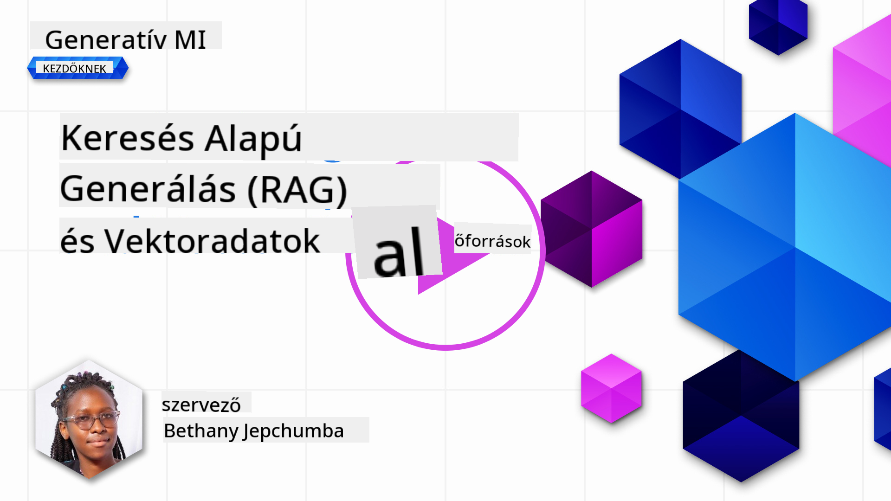
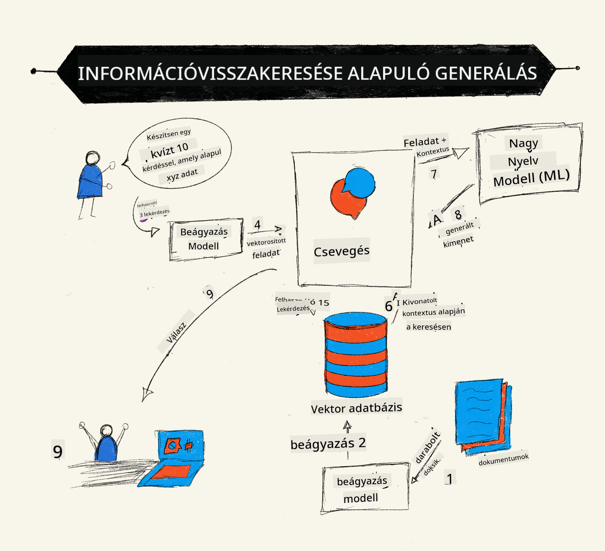
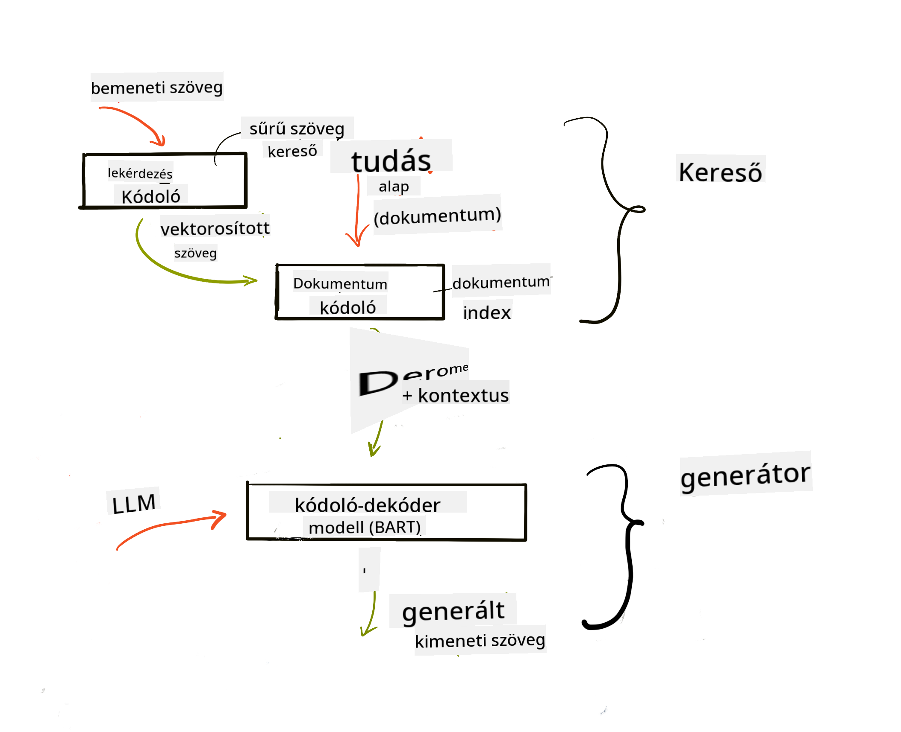
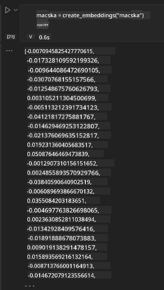

<!--
CO_OP_TRANSLATOR_METADATA:
{
  "original_hash": "e2861bbca91c0567ef32bc77fe054f9e",
  "translation_date": "2025-06-25T22:43:12+00:00",
  "source_file": "15-rag-and-vector-databases/README.md",
  "language_code": "hu"
}
-->
# Visszakeresésen alapuló generálás (RAG) és vektorbázisok

[](https://aka.ms/gen-ai-lesson15-gh?WT.mc_id=academic-105485-koreyst)

A keresőalkalmazások leckében röviden megtanultuk, hogyan integrálhatjuk saját adatainkat a nagy nyelvi modellekbe (LLM-ekbe). Ebben a leckében mélyebben megvizsgáljuk, hogyan alapozhatjuk meg adatainkat LLM alkalmazásunkban, a folyamat mechanikáját és az adatok tárolásának módszereit, beleértve az beágyazásokat és a szöveget is.

> **Videó hamarosan**

## Bevezetés

Ebben a leckében az alábbiakat fogjuk tárgyalni:

- Bevezetés a RAG-ba, mi az, és miért használják a mesterséges intelligenciában.

- Megérteni, mik a vektorbázisok, és hogyan hozhatunk létre egyet alkalmazásunkhoz.

- Gyakorlati példa arra, hogyan integrálhatjuk a RAG-ot egy alkalmazásba.

## Tanulási célok

A lecke befejezése után képes leszel:

- Megmagyarázni a RAG jelentőségét az adatvisszakeresésben és -feldolgozásban.

- RAG alkalmazás beállítása és az adatok alapozása egy LLM-hez.

- A RAG és a vektorbázisok hatékony integrációja LLM alkalmazásokban.

## Szenáriónk: saját adatainkkal bővítjük LLM-jeinket

Ehhez a leckéhez szeretnénk hozzáadni saját jegyzeteinket az oktatási startuphoz, amely lehetővé teszi a chatbot számára, hogy több információt szerezzen a különböző témákról. A meglévő jegyzeteink segítségével a tanulók jobban tudnak tanulni és megérteni a különböző témákat, így könnyebbé téve a vizsgákra való felkészülést. Szenáriónk létrehozásához a következőket fogjuk használni:

- `Azure OpenAI:` az LLM, amit a chatbotunk létrehozásához használunk

- `AI for beginners' lesson on Neural Networks`: ez lesz az adat, amire az LLM-ünket alapozzuk

- `Azure AI Search` és `Azure Cosmos DB:` vektorbázis az adataink tárolására és egy keresési index létrehozására

A felhasználók képesek lesznek gyakorló kvízeket létrehozni jegyzeteikből, felülvizsgálati kártyákat készíteni és tömör áttekintéseket készíteni. Kezdjük azzal, hogy megnézzük, mi a RAG és hogyan működik:

## Visszakeresésen alapuló generálás (RAG)

Egy LLM alapú chatbot a felhasználói utasításokat dolgozza fel válaszok generálására. Interaktívnak tervezték, és széles körű témákban beszélget a felhasználókkal. Azonban a válaszai korlátozottak az adott kontextusra és az alapvető képzési adataira. Például a GPT-4 tudásának határidőpontja 2021. szeptember, ami azt jelenti, hogy nincs tudomása az azóta történt eseményekről. Ezenkívül az LLM-ek képzéséhez használt adatok kizárják a bizalmas információkat, például a személyes jegyzeteket vagy egy vállalat termékkézikönyvét.

### Hogyan működnek a RAG-ok (Visszakeresésen alapuló generálás)



Tegyük fel, hogy egy chatbottal szeretnél kvízeket készíteni a jegyzeteidből, szükséged lesz egy kapcsolatra a tudásbázissal. Itt jön a képbe a RAG. A RAG-ok így működnek:

- **Tudásbázis:** A visszakeresés előtt ezeket a dokumentumokat be kell fogadni és elő kell dolgozni, jellemzően a nagy dokumentumokat kisebb darabokra bontva, szövegbeágyazásra átalakítva és egy adatbázisban tárolva.

- **Felhasználói kérdés:** a felhasználó feltesz egy kérdést

- **Visszakeresés:** Amikor a felhasználó kérdést tesz fel, a beágyazási modell releváns információkat keres elő a tudásbázisunkból, hogy több kontextust biztosítson, amely beépül a kérdésbe.

- **Kiegészített generálás:** az LLM javítja válaszát az előkeresett adatok alapján. Lehetővé teszi, hogy a válasz ne csak az előre betanított adatokon alapuljon, hanem az adott kontextusból származó releváns információkon is. Az előkeresett adatok felhasználásra kerülnek az LLM válaszainak kiegészítésére. Az LLM ezután választ ad a felhasználó kérdésére.



A RAG-ok architektúrája transzformátorokkal van megvalósítva, amelyek két részből állnak: egy kódoló és egy dekódoló. Például, amikor a felhasználó kérdést tesz fel, a bemeneti szöveg 'kódolódik' vektorokká, amelyek megragadják a szavak jelentését, és a vektorok 'dekódolódnak' a dokumentumindexünkbe, és új szöveget generálnak a felhasználói kérdés alapján. Az LLM mind egy kódoló-dekódoló modellt használ a kimenet generálására.

Két megközelítés a RAG megvalósításakor a javasolt cikk szerint: [Retrieval-Augmented Generation for Knowledge intensive NLP (natural language processing software) Tasks](https://arxiv.org/pdf/2005.11401.pdf?WT.mc_id=academic-105485-koreyst):

- **_RAG-Szekvencia_** a visszakeresett dokumentumok felhasználásával a lehető legjobb válasz előrejelzésére a felhasználói kérdésre

- **RAG-Token** dokumentumok felhasználása a következő token generálásához, majd ezek visszakeresése a felhasználói kérdés megválaszolásához

### Miért használnád a RAG-okat?

- **Információgazdagság:** biztosítja, hogy a szöveges válaszok naprakészek és aktuálisak legyenek. Ezáltal javítja a teljesítményt a domain-specifikus feladatokban azáltal, hogy hozzáfér a belső tudásbázishoz.

- Csökkenti a hamisítást azáltal, hogy **ellenőrizhető adatokat** használ fel a tudásbázisban, hogy kontextust biztosítson a felhasználói kérdésekhez.

- **Költséghatékony**, mivel gazdaságosabbak, mint egy LLM finomhangolása.

## Tudásbázis létrehozása

Alkalmazásunk saját adatainkon alapul, azaz a Neurális Hálózat lecke az AI Kezdőknek tananyagból.

### Vektorbázisok

A vektorbázis, a hagyományos adatbázisokkal ellentétben, egy speciális adatbázis, amelyet a beágyazott vektorok tárolására, kezelésére és keresésére terveztek. Számszerű reprezentációkat tárol a dokumentumokról. Az adatok számszerű beágyazásokra bontása megkönnyíti AI rendszerünk számára az adatok megértését és feldolgozását.

Beágyazásainkat vektorbázisokban tároljuk, mivel az LLM-ek korlátozott számú tokent fogadnak be bemenetként. Mivel nem adhatod át az összes beágyazást egy LLM-nek, fel kell darabolnunk őket, és amikor a felhasználó kérdést tesz fel, a kérdéshez leginkább hasonló beágyazások visszakerülnek a kérdéssel együtt. A darabolás csökkenti a költségeket is az LLM-en keresztülhaladó tokenek számán.

Néhány népszerű vektorbázis az Azure Cosmos DB, a Clarifyai, a Pinecone, a Chromadb, a ScaNN, a Qdrant és a DeepLake. Az Azure CLI segítségével létrehozhatsz egy Azure Cosmos DB modellt a következő paranccsal:

```bash
az login
az group create -n <resource-group-name> -l <location>
az cosmosdb create -n <cosmos-db-name> -r <resource-group-name>
az cosmosdb list-keys -n <cosmos-db-name> -g <resource-group-name>
```

### Szövegből beágyazások

Mielőtt tárolnánk adatainkat, vektorbeli beágyazásokra kell konvertálnunk őket, mielőtt az adatbázisban tárolnánk őket. Ha nagy dokumentumokkal vagy hosszú szövegekkel dolgozol, darabolhatod őket a várt lekérdezések alapján. A darabolás történhet mondat szinten vagy bekezdés szinten. Mivel a darabolás a környező szavak jelentéséből származik, adhatsz hozzá más kontextust is egy darabhoz, például a dokumentum címének hozzáadásával vagy némi szöveg hozzáadásával a darab előtt vagy után. Az adatokat így darabolhatod:

```python
def split_text(text, max_length, min_length):
    words = text.split()
    chunks = []
    current_chunk = []

    for word in words:
        current_chunk.append(word)
        if len(' '.join(current_chunk)) < max_length and len(' '.join(current_chunk)) > min_length:
            chunks.append(' '.join(current_chunk))
            current_chunk = []

    # If the last chunk didn't reach the minimum length, add it anyway
    if current_chunk:
        chunks.append(' '.join(current_chunk))

    return chunks
```

Miután daraboltuk, különböző beágyazási modellek segítségével ágyazhatjuk be a szövegünket. Néhány modell, amit használhatsz: word2vec, ada-002 az OpenAI-tól, Azure Computer Vision és még sok más. A használni kívánt modell kiválasztása attól függ, hogy milyen nyelveket használsz, milyen típusú tartalmat kódol (szöveg/képek/hang), mekkora bemenetet tud kódolni és a beágyazás kimenetének hossza.

Egy példa a beágyazott szövegre az OpenAI `text-embedding-ada-002` modelljével:


## Visszakeresés és vektoros keresés

Amikor a felhasználó kérdést tesz fel, a visszakereső vektorrá alakítja azt a lekérdezési kódoló segítségével, majd átkutatja dokumentum keresési indexünket a bemenettel kapcsolatos releváns vektorok után. Miután befejezte, mind a bemeneti vektort, mind a dokumentum vektorokat szöveggé alakítja, és átadja az LLM-nek.

### Visszakeresés

A visszakeresés akkor történik, amikor a rendszer megpróbálja gyorsan megtalálni az indexből azokat a dokumentumokat, amelyek megfelelnek a keresési kritériumoknak. A visszakereső célja, hogy olyan dokumentumokat szerezzen be, amelyek kontextust biztosítanak, és az LLM-et az adataidra alapozzák.

Számos módon lehet keresni az adatbázisunkban, például:

- **Kulcsszó keresés** - szövegkereséshez használatos

- **Szemantikus keresés** - a szavak szemantikus jelentését használja

- **Vektoros keresés** - a dokumentumokat szövegből vektoros reprezentációkká alakítja beágyazási modellek segítségével. A visszakeresés azzal történik, hogy lekérdezzük azokat a dokumentumokat, amelyek vektoros reprezentációi a legközelebb állnak a felhasználói kérdéshez.

- **Hibrid** - a kulcsszó és a vektoros keresés kombinációja.

A visszakeresés kihívása akkor jelentkezik, amikor nincs hasonló válasz a lekérdezésre az adatbázisban, a rendszer ekkor a lehető legjobb információt adja vissza, azonban használhatsz olyan taktikákat, mint a relevancia maximális távolságának beállítása vagy a kulcsszavak és vektoros keresés kombinációját alkalmazó hibrid keresés. Ebben a leckében hibrid keresést használunk, amely a vektoros és kulcsszó keresés kombinációja. Adatainkat egy adatkeretbe fogjuk tárolni, amely oszlopokat tartalmaz a darabokkal és beágyazásokkal.

### Vektoros hasonlóság

A visszakereső a tudásbázisban olyan beágyazásokat keres, amelyek közel vannak egymáshoz, a legközelebbi szomszéd, mivel ezek hasonló szövegek. Abban az esetben, ha a felhasználó lekérdezést tesz fel, először beágyazódik, majd hasonló beágyazásokkal párosítják. A közös mérőszám, amelyet arra használnak, hogy megtalálják, mennyire hasonlóak a különböző vektorok, a koszinusz hasonlóság, amely két vektor közötti szögön alapul.

A hasonlóság mérésére más alternatívák is vannak, például az euklideszi távolság, amely a vektor végpontok közötti egyenes vonal, és a skaláris szorzat, amely két vektor megfelelő elemeinek szorzatainak összegét méri.

### Keresési index

A visszakeresés során szükségünk lesz arra, hogy építsünk egy keresési indexet a tudásbázisunkhoz, mielőtt keresést végzünk. Az index tárolja beágyazásainkat, és gyorsan visszakeresi a leginkább hasonló darabokat még egy nagy adatbázisban is. Az indexet helyben hozhatjuk létre a következő módon:

```python
from sklearn.neighbors import NearestNeighbors

embeddings = flattened_df['embeddings'].to_list()

# Create the search index
nbrs = NearestNeighbors(n_neighbors=5, algorithm='ball_tree').fit(embeddings)

# To query the index, you can use the kneighbors method
distances, indices = nbrs.kneighbors(embeddings)
```

### Újrarangsorolás

Miután lekérdezted az adatbázist, szükség lehet az eredmények rendezésére a legrelevánsabbtól kezdve. Az újrarangsoroló LLM gépi tanulást használ a keresési eredmények relevanciájának javítására azáltal, hogy azokat a legrelevánsabbtól kezdve rendezi. Az Azure AI Search segítségével az újrarangsorolás automatikusan történik egy szemantikus újrarangsoroló segítségével. Egy példa arra, hogyan működik az újrarangsorolás a legközelebbi szomszédokkal:

```python
# Find the most similar documents
distances, indices = nbrs.kneighbors([query_vector])

index = []
# Print the most similar documents
for i in range(3):
    index = indices[0][i]
    for index in indices[0]:
        print(flattened_df['chunks'].iloc[index])
        print(flattened_df['path'].iloc[index])
        print(flattened_df['distances'].iloc[index])
    else:
        print(f"Index {index} not found in DataFrame")
```

## Mindez összefoglalva

Az utolsó lépés az LLM hozzáadása a keverékhez, hogy válaszokat kapjunk, amelyek az adatainkra alapozódnak. Az alábbiak szerint valósíthatjuk meg:

```python
user_input = "what is a perceptron?"

def chatbot(user_input):
    # Convert the question to a query vector
    query_vector = create_embeddings(user_input)

    # Find the most similar documents
    distances, indices = nbrs.kneighbors([query_vector])

    # add documents to query  to provide context
    history = []
    for index in indices[0]:
        history.append(flattened_df['chunks'].iloc[index])

    # combine the history and the user input
    history.append(user_input)

    # create a message object
    messages=[
        {"role": "system", "content": "You are an AI assistant that helps with AI questions."},
        {"role": "user", "content": history[-1]}
    ]

    # use chat completion to generate a response
    response = openai.chat.completions.create(
        model="gpt-4",
        temperature=0.7,
        max_tokens=800,
        messages=messages
    )

    return response.choices[0].message

chatbot(user_input)
```

## Alkalmazásunk értékelése

### Értékelési mutatók

- A válaszok minősége, biztosítva, hogy természetesnek, gördülékenynek és emberinek hangozzon

- Az adatok megalapozottsága: annak értékelése, hogy a válasz a megadott dokumentumokból származik-e

- Relevancia: annak értékelése, hogy a válasz megfelel-e és kapcsolódik-e a feltett kérdéshez

- Folyékonyság - hogy a válasz nyelvtanilag értelmes-e

## A RAG (Visszakeresésen alapuló generálás) és a vektorbázisok használati esetei

Számos különböző használati eset van, ahol a függvényhívások javíthatják alkalmazásodat, például:

- Kérdések és válaszok: a vállalati adatok alapozása egy csevegéshez, amelyet a munkavállalók használhatnak kérdések feltevésére.

- Ajánlórendszerek: ahol létrehozhatsz egy rendszert, amely a leginkább hasonló értékeket párosítja, például filmeket, éttermeket és még sok mást.

- Chatbot szolgáltatások: tárolhatod a csevegési előzményeket és személyre szabhatod a beszélgetést a felhasználói adatok alapján.

- Képalapú keresés vektoros beágyazások alapján, hasznos a képfelismerésnél és az anomália detektálásnál.

## Összefog

**Jogi nyilatkozat**:  
Ez a dokumentum a [Co-op Translator](https://github.com/Azure/co-op-translator) AI fordítási szolgáltatás használatával készült. Bár igyekszünk pontosságra törekedni, kérjük, vegye figyelembe, hogy az automatikus fordítások hibákat vagy pontatlanságokat tartalmazhatnak. Az eredeti dokumentum az eredeti nyelvén tekintendő hiteles forrásnak. Fontos információk esetén javasolt a professzionális, emberi fordítás igénybevétele. Nem vállalunk felelősséget a fordítás használatából eredő félreértésekért vagy téves értelmezésekért.