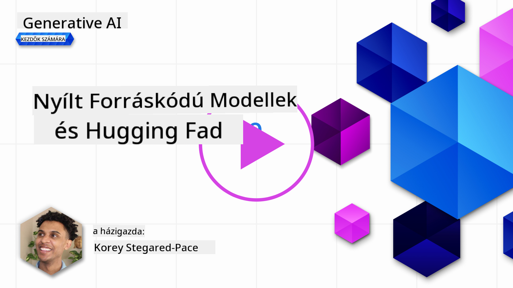
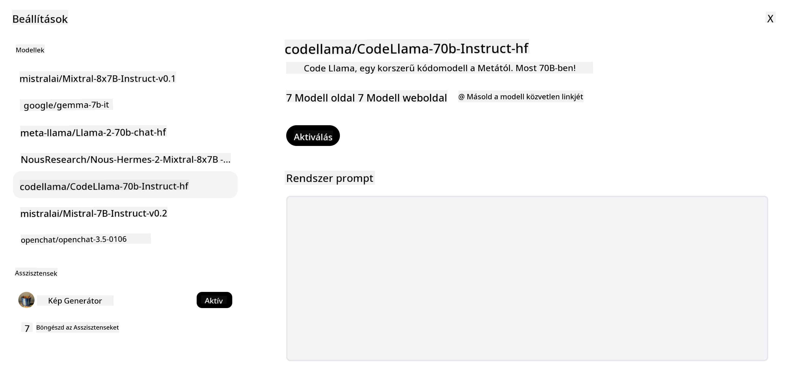
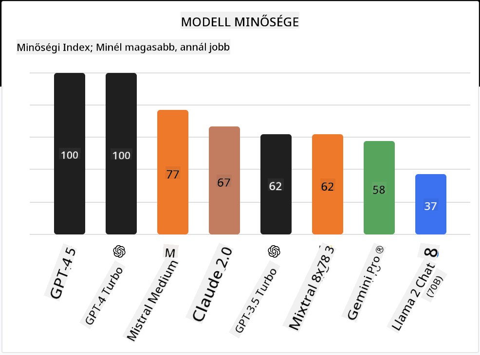

<!--
CO_OP_TRANSLATOR_METADATA:
{
  "original_hash": "0bba96e53ab841d99db731892a51fab8",
  "translation_date": "2025-07-09T17:13:52+00:00",
  "source_file": "16-open-source-models/README.md",
  "language_code": "hu"
}
-->

## Bevezetés

A nyílt forráskódú LLM-ek világa izgalmas és folyamatosan fejlődik. Ez a lecke mélyreható betekintést nyújt a nyílt forráskódú modellekbe. Ha arra vagy kíváncsi, hogyan viszonyulnak a zárt forráskódú modellek a nyílt forráskódúakhoz, látogass el a ["Különböző LLM-ek felfedezése és összehasonlítása" leckéhez](../02-exploring-and-comparing-different-llms/README.md?WT.mc_id=academic-105485-koreyst). Ez a lecke a finomhangolás témáját is érinti, de részletesebb magyarázatot találsz a ["LLM-ek finomhangolása" leckében](../18-fine-tuning/README.md?WT.mc_id=academic-105485-koreyst).

## Tanulási célok

- Megérteni a nyílt forráskódú modelleket
- Megismerni a nyílt forráskódú modellek használatának előnyeit
- Felfedezni a Hugging Face-en és az Azure AI Studioban elérhető nyílt modelleket

## Mik azok a nyílt forráskódú modellek?

A nyílt forráskódú szoftverek kulcsszerepet játszottak a technológia fejlődésében számos területen. Az Open Source Initiative (OSI) [10 kritériumot határozott meg a szoftverek nyílt forráskódú besorolásához](https://web.archive.org/web/20241126001143/https://opensource.org/osd?WT.mc_id=academic-105485-koreyst). A forráskódot nyíltan kell megosztani egy OSI által jóváhagyott licenc alatt.

Bár az LLM-ek fejlesztése hasonló elemeket tartalmaz, mint a szoftverfejlesztés, a folyamat nem teljesen azonos. Ez sok vitát váltott ki a közösségben arról, hogy mit jelent a nyílt forráskód az LLM-ek esetében. Ahhoz, hogy egy modell megfeleljen a hagyományos nyílt forráskódú definíciónak, a következő információknak nyilvánosan elérhetőnek kell lenniük:

- A modell betanításához használt adatkészletek.
- A teljes modell súlyai a tanítás részeként.
- Az értékelő kód.
- A finomhangoló kód.
- A teljes modell súlyai és a tanítási metrikák.

Jelenleg csak néhány modell felel meg ezeknek a kritériumoknak. Az [Allen Institute for Artificial Intelligence (AllenAI) által készített OLMo modell](https://huggingface.co/allenai/OLMo-7B?WT.mc_id=academic-105485-koreyst) például ilyen.

Ebben a leckében a modelleket a továbbiakban "nyílt modelleknek" nevezzük, mivel íráskori állapotukban nem feltétlenül felelnek meg a fenti kritériumoknak.

## A nyílt modellek előnyei

**Nagyon testreszabhatóak** – Mivel a nyílt modellek részletes tanítási információkkal érkeznek, a kutatók és fejlesztők módosíthatják a modell belső működését. Ez lehetővé teszi, hogy nagyon specializált modelleket hozzanak létre, amelyek egy adott feladatra vagy tudományterületre vannak finomhangolva. Ilyen például a kódgenerálás, matematikai műveletek vagy a biológia.

**Költséghatékonyság** – Ezeknek a modelleknek a tokenenkénti használati és üzemeltetési költsége alacsonyabb, mint a zárt forráskódú modelleké. Generatív AI alkalmazások fejlesztésekor érdemes figyelembe venni a teljesítmény és ár arányát az adott felhasználási esetben.

  
Forrás: Artificial Analysis

**Rugalmasság** – A nyílt modellekkel való munka lehetővé teszi, hogy rugalmasan válassz különböző modellek között vagy kombináld őket. Erre példa a [HuggingChat Asszisztensek](https://huggingface.co/chat?WT.mc_id=academic-105485-koreyst), ahol a felhasználó közvetlenül a felhasználói felületen választhatja ki a használt modellt:

## Különböző nyílt modellek felfedezése

### Llama 2

A Meta által fejlesztett [Llama 2](https://huggingface.co/meta-llama?WT.mc_id=academic-105485-koreyst) egy nyílt modell, amelyet kifejezetten csevegés alapú alkalmazásokhoz optimalizáltak. Ennek oka a finomhangolási módszere, amely nagy mennyiségű párbeszédet és emberi visszajelzést tartalmazott. Ezzel a módszerrel a modell olyan eredményeket produkál, amelyek jobban megfelelnek az emberi elvárásoknak, így jobb felhasználói élményt nyújt.

Néhány finomhangolt Llama változat például a [Japanese Llama](https://huggingface.co/elyza/ELYZA-japanese-Llama-2-7b?WT.mc_id=academic-105485-koreyst), amely a japán nyelvre specializálódott, és a [Llama Pro](https://huggingface.co/TencentARC/LLaMA-Pro-8B?WT.mc_id=academic-105485-koreyst), amely a bázismodell továbbfejlesztett változata.

### Mistral

A [Mistral](https://huggingface.co/mistralai?WT.mc_id=academic-105485-koreyst) egy nyílt modell, amely nagy hangsúlyt fektet a magas teljesítményre és hatékonyságra. A Mixture-of-Experts megközelítést alkalmazza, amely egy csoport specializált szakértő modellből álló rendszert hoz létre, ahol a bemenettől függően bizonyos modelleket választanak ki használatra. Ez hatékonyabbá teszi a számítást, mivel a modellek csak azokra a bemenetekre fókuszálnak, amelyekben szakértők.

Néhány finomhangolt Mistral változat például a [BioMistral](https://huggingface.co/BioMistral/BioMistral-7B?text=Mon+nom+est+Thomas+et+mon+principal?WT.mc_id=academic-105485-koreyst), amely az orvosi területre fókuszál, és az [OpenMath Mistral](https://huggingface.co/nvidia/OpenMath-Mistral-7B-v0.1-hf?WT.mc_id=academic-105485-koreyst), amely matematikai számításokat végez.

### Falcon

A [Falcon](https://huggingface.co/tiiuae?WT.mc_id=academic-105485-koreyst) egy LLM, amelyet a Technology Innovation Institute (**TII**) fejlesztett. A Falcon-40B 40 milliárd paraméteren lett betanítva, és bizonyítottan jobb teljesítményt nyújt, mint a GPT-3, kevesebb számítási erőforrás felhasználásával. Ennek oka a FlashAttention algoritmus és a multiquery attention használata, amelyek csökkentik a memóriaigényt az inferencia során. A csökkentett inferenciaidő miatt a Falcon-40B jól használható csevegőalkalmazásokhoz.

Néhány finomhangolt Falcon változat például az [OpenAssistant](https://huggingface.co/OpenAssistant/falcon-40b-sft-top1-560?WT.mc_id=academic-105485-koreyst), egy nyílt modelleken alapuló asszisztens, és a [GPT4ALL](https://huggingface.co/nomic-ai/gpt4all-falcon?WT.mc_id=academic-105485-koreyst), amely jobb teljesítményt nyújt, mint az alapmodell.

## Hogyan válasszunk?

Nincs egyetlen helyes válasz arra, hogyan válasszunk nyílt modellt. Jó kiindulópont lehet az Azure AI Studio feladat szerinti szűrő funkciója, amely segít megérteni, hogy a modell milyen típusú feladatokra lett betanítva. A Hugging Face emellett fenntart egy LLM ranglistát, amely bizonyos metrikák alapján mutatja a legjobban teljesítő modelleket.

Ha különböző típusú LLM-eket szeretnél összehasonlítani, az [Artificial Analysis](https://artificialanalysis.ai/?WT.mc_id=academic-105485-koreyst) is remek forrás:

  
Forrás: Artificial Analysis

Ha egy konkrét feladatra dolgozol, érdemes olyan finomhangolt változatokat keresni, amelyek az adott területre fókuszálnak. Több nyílt modell kipróbálása és összehasonlítása a saját és a felhasználóid elvárásai szerint szintén jó gyakorlat.

## Következő lépések

A nyílt modellek legjobb része, hogy viszonylag gyorsan elkezdhetsz velük dolgozni. Nézd meg az [Azure AI Studio Model Katalógust](https://ai.azure.com?WT.mc_id=academic-105485-koreyst), amely tartalmaz egy speciális Hugging Face gyűjteményt ezekkel a modellekkel, amikről itt beszéltünk.

## A tanulás itt nem ér véget, folytasd az utat

A lecke elvégzése után nézd meg a [Generatív AI tanulási gyűjteményünket](https://aka.ms/genai-collection?WT.mc_id=academic-105485-koreyst), hogy tovább fejleszd generatív AI ismereteidet!

**Jogi nyilatkozat**:  
Ez a dokumentum az AI fordító szolgáltatás, a [Co-op Translator](https://github.com/Azure/co-op-translator) segítségével készült. Bár a pontosságra törekszünk, kérjük, vegye figyelembe, hogy az automatikus fordítások hibákat vagy pontatlanságokat tartalmazhatnak. Az eredeti dokumentum az anyanyelvén tekintendő hiteles forrásnak. Fontos információk esetén szakmai, emberi fordítást javaslunk. Nem vállalunk felelősséget a fordítás használatából eredő félreértésekért vagy téves értelmezésekért.