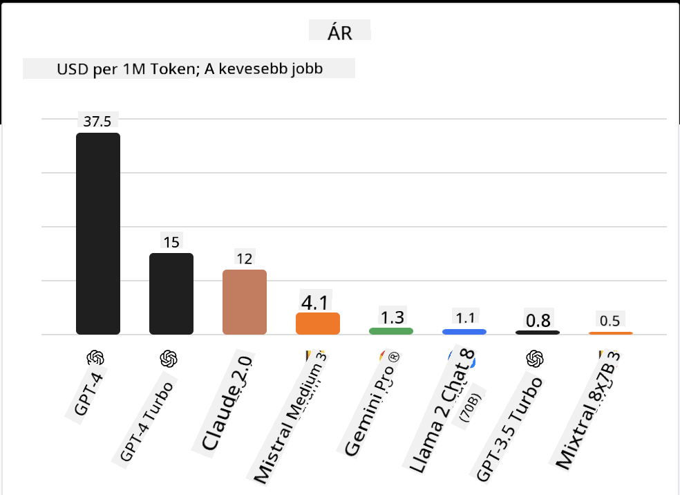

<!--
CO_OP_TRANSLATOR_METADATA:
{
  "original_hash": "0bba96e53ab841d99db731892a51fab8",
  "translation_date": "2025-05-20T07:02:06+00:00",
  "source_file": "16-open-source-models/README.md",
  "language_code": "hu"
}
-->

## Bevezetés

Az open-source LLM-ek világa izgalmas és folyamatosan fejlődik. Ez a lecke célja, hogy alapos betekintést nyújtson az open source modellekbe. Ha információt keres arról, hogyan viszonyulnak a zárt modellek az open source modellekhez, látogasson el az ["Különböző LLM-ek felfedezése és összehasonlítása" leckére](../02-exploring-and-comparing-different-llms/README.md?WT.mc_id=academic-105485-koreyst). Ez a lecke a finomhangolás témáját is érinti, de részletesebb magyarázatot a ["LLM-ek finomhangolása" leckében](../18-fine-tuning/README.md?WT.mc_id=academic-105485-koreyst) találhat.

## Tanulási célok

- Ismeretek szerzése az open source modellekről
- Az open source modellekkel való munka előnyeinek megértése
- Az elérhető open modellek felfedezése a Hugging Face és az Azure AI Studio platformokon

## Mik azok az Open Source Modellek?

Az open source szoftverek kulcsszerepet játszottak a technológia fejlődésében különböző területeken. Az Open Source Initiative (OSI) [10 kritériumot határozott meg a szoftverek](https://web.archive.org/web/20241126001143/https://opensource.org/osd?WT.mc_id=academic-105485-koreyst) open source-ként való besorolásához. A forráskódot nyíltan kell megosztani egy, az OSI által jóváhagyott licenc alatt.

Bár az LLM-ek fejlesztése hasonló elemeket tartalmaz, mint a szoftverfejlesztés, a folyamat nem teljesen ugyanaz. Ez sok vitát hozott a közösségben az open source definíciójáról az LLM-ek kontextusában. Ahhoz, hogy egy modell megfeleljen az open source hagyományos definíciójának, a következő információknak nyilvánosan elérhetőnek kell lenniük:

- A modell tanításához használt adathalmazok.
- Teljes modell súlyok a tanítás részeként.
- Az értékelési kód.
- A finomhangolási kód.
- Teljes modell súlyok és tanítási metrikák.

Jelenleg csak néhány modell felel meg ennek a kritériumnak. Az [OLMo modell, amelyet az Allen Institute for Artificial Intelligence (AllenAI) hozott létre](https://huggingface.co/allenai/OLMo-7B?WT.mc_id=academic-105485-koreyst) ilyen kategóriába tartozik.

Ebben a leckében a modellekre "open modellek" néven fogunk hivatkozni, mivel lehet, hogy nem felelnek meg a fenti kritériumoknak az írás idején.

## Az Open Modellek Előnyei

**Magas szintű testreszabhatóság** - Mivel az open modellek részletes tanítási információkkal kerülnek kiadásra, a kutatók és fejlesztők módosíthatják a modell belső működését. Ez lehetővé teszi a speciális feladatokra vagy kutatási területekre finomhangolt modellek létrehozását. Néhány példa erre a kódgenerálás, matematikai műveletek és biológia.

**Költség** - Ezeknek a modelleknek a használati és telepítési költsége alacsonyabb, mint a zárt modelleké. Generatív AI alkalmazások építésekor érdemes megvizsgálni a teljesítményt és az árat az adott felhasználási esethez.

Forrás: Artificial Analysis

**Rugalmasság** - Az open modellekkel való munka lehetővé teszi a rugalmasságot különböző modellek használatában vagy kombinálásában. Erre példa a [HuggingChat Assistants](https://huggingface.co/chat?WT.mc_id=academic-105485-koreyst), ahol a felhasználó közvetlenül az interfészen választhatja ki a használt modellt:

## Különböző Open Modellek Felfedezése

### Llama 2

A [LLama2](https://huggingface.co/meta-llama?WT.mc_id=academic-105485-koreyst), amelyet a Meta fejlesztett, egy open modell, amely optimalizálva van chat alapú alkalmazásokra. Ez a finomhangolási módszerének köszönhető, amely nagy mennyiségű párbeszédet és emberi visszajelzést tartalmazott. Ezzel a módszerrel a modell több olyan eredményt produkál, amely megfelel az emberi elvárásoknak, így jobb felhasználói élményt nyújt.

A Llama finomhangolt verzióinak néhány példája a [Japán Llama](https://huggingface.co/elyza/ELYZA-japanese-Llama-2-7b?WT.mc_id=academic-105485-koreyst), amely a japán nyelvre specializálódott, és a [Llama Pro](https://huggingface.co/TencentARC/LLaMA-Pro-8B?WT.mc_id=academic-105485-koreyst), amely a bázismodell továbbfejlesztett verziója.

### Mistral

A [Mistral](https://huggingface.co/mistralai?WT.mc_id=academic-105485-koreyst) egy open modell, amely erősen fókuszál a magas teljesítményre és hatékonyságra. A Mixture-of-Experts megközelítést alkalmazza, amely különböző szakértői modelleket kombinál egy rendszerbe, ahol az inputtól függően bizonyos modellek kerülnek kiválasztásra. Ez hatékonyabbá teszi a számítást, mivel a modellek csak azokra az inputokra reagálnak, amelyekre specializálódtak.

A Mistral finomhangolt verzióinak néhány példája a [BioMistral](https://huggingface.co/BioMistral/BioMistral-7B?text=Mon+nom+est+Thomas+et+mon+principal?WT.mc_id=academic-105485-koreyst), amely az orvosi területre fókuszál, és az [OpenMath Mistral](https://huggingface.co/nvidia/OpenMath-Mistral-7B-v0.1-hf?WT.mc_id=academic-105485-koreyst), amely matematikai számításokat végez.

### Falcon

A [Falcon](https://huggingface.co/tiiuae?WT.mc_id=academic-105485-koreyst) egy LLM, amelyet a Technology Innovation Institute (**TII**) hozott létre. A Falcon-40B-t 40 milliárd paraméterrel képezték ki, ami azt mutatja, hogy jobb teljesítményt nyújt, mint a GPT-3, kevesebb számítási költséggel. Ez a FlashAttention algoritmus és a multiquery figyelem használatának köszönhető, amely lehetővé teszi a memóriaigény csökkentését az inferencia időben. A csökkentett inferencia idővel a Falcon-40B alkalmas chat alkalmazásokra.

A Falcon finomhangolt verzióinak néhány példája az [OpenAssistant](https://huggingface.co/OpenAssistant/falcon-40b-sft-top1-560?WT.mc_id=academic-105485-koreyst), egy open modellekre épülő asszisztens és a [GPT4ALL](https://huggingface.co/nomic-ai/gpt4all-falcon?WT.mc_id=academic-105485-koreyst), amely magasabb teljesítményt nyújt, mint a bázismodell.

## Hogyan Válasszunk

Nincs egyetlen válasz az open modell kiválasztására. Jó kiindulópont lehet az Azure AI Studio feladat szerinti szűrőjének használata. Ez segít megérteni, milyen típusú feladatokra képezték ki a modellt. A Hugging Face egy LLM Leaderboard-ot is fenntart, amely megmutatja a legjobban teljesítő modelleket bizonyos metrikák alapján.

Amikor az LLM-eket különböző típusokban szeretnénk összehasonlítani, az [Artificial Analysis](https://artificialanalysis.ai/?WT.mc_id=academic-105485-koreyst) egy másik nagyszerű forrás:

Forrás: Artificial Analysis

Ha egy konkrét felhasználási eseten dolgozik, hatékony lehet a finomhangolt verziók keresése, amelyek ugyanarra a területre fókuszálnak. Több open modell kipróbálása, hogy hogyan teljesítenek az Ön és a felhasználói elvárásai szerint, egy másik jó gyakorlat.

## Következő lépések

Az open modellek legjobb része, hogy elég gyorsan elkezdhet velük dolgozni. Nézze meg az [Azure AI Studio Model Catalog](https://ai.azure.com?WT.mc_id=academic-105485-koreyst), amely tartalmaz egy speciális Hugging Face gyűjteményt az itt tárgyalt modellekkel.

## A tanulás nem áll meg itt, folytassa az utazást

A lecke befejezése után nézze meg a [Generative AI Learning gyűjteményünket](https://aka.ms/genai-collection?WT.mc_id=academic-105485-koreyst), hogy tovább fejlessze Generative AI tudását!

**Felelősség kizárása**:  
Ez a dokumentum AI fordítási szolgáltatás, a [Co-op Translator](https://github.com/Azure/co-op-translator) használatával lett lefordítva. Bár törekszünk a pontosságra, kérjük, vegye figyelembe, hogy az automatikus fordítások hibákat vagy pontatlanságokat tartalmazhatnak. Az eredeti dokumentum az eredeti nyelvén tekintendő a hiteles forrásnak. Kritikus információk esetén ajánlott a professzionális emberi fordítás. Nem vállalunk felelősséget semmilyen félreértésért vagy félremagyarázásért, amely ezen fordítás használatából ered.