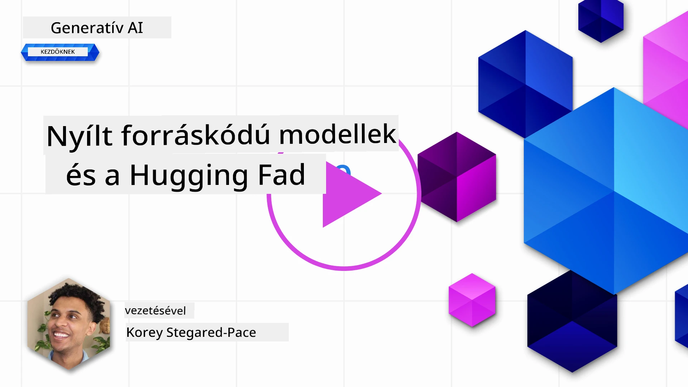
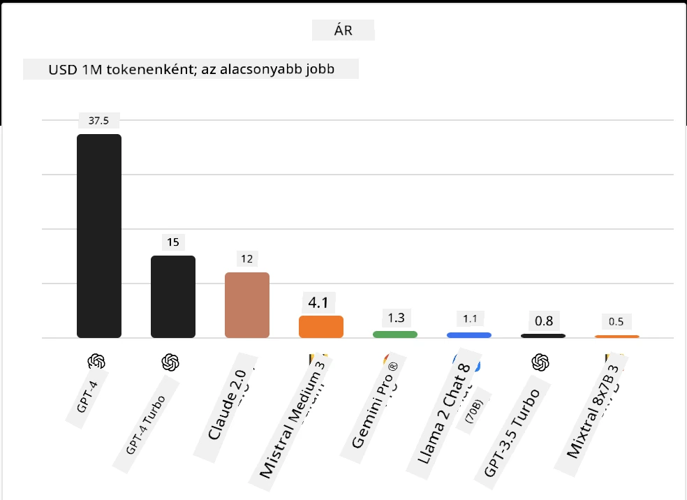
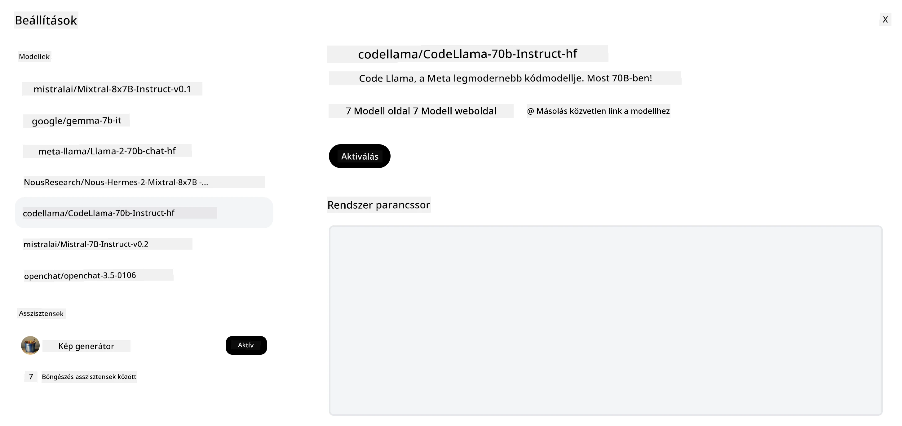
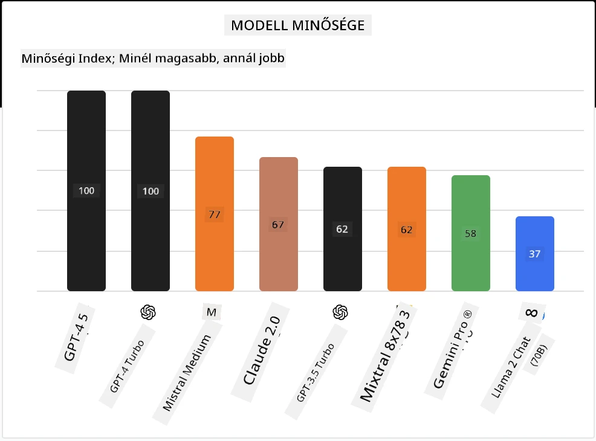

## Bevezetés

A nyílt forráskódú LLM-ek világa izgalmas és folyamatosan fejlődik. Ez a lecké mélyreható betekintést kíván nyújtani a nyílt forráskódú modellekbe. Ha azt keresed, hogy a zárt forráskódú modellek hogyan viszonyulnak a nyílt forráskódú modellekhez, látogass el a [„Különböző LLM-ek felfedezése és összehasonlítása” leckéhez](../02-exploring-and-comparing-different-llms/README.md?WT.mc_id=academic-105485-koreyst). Ez a lecke a finomhangolás témáját is érinti, de egy részletesebb magyarázatot találsz a [„LLM-ek finomhangolása” leckében](../18-fine-tuning/README.md?WT.mc_id=academic-105485-koreyst).

## Tanulási célok

- Megérteni a nyílt forráskódú modelleket
- Érteni a nyílt forráskódú modellek használatának előnyeit
- A Hugging Face-en és a Microsoft Foundry modell katalógusában elérhető nyílt modellek felfedezése

## Mik azok a nyílt forráskódú modellek?

A nyílt forráskódú szoftverek kulcsszerepet játszottak a technológia fejlődésében különböző területeken. A Nyílt Forráskódú Kezdeményezés (OSI) [10 kritériumot határozott meg a szoftverek](https://web.archive.org/web/20241126001143/https://opensource.org/osd?WT.mc_id=academic-105485-koreyst) nyílt forráskódú besorolásához. A forráskódot nyilvánosan kell megosztani egy OSI által jóváhagyott licenc alatt.

Bár az LLM-ek fejlesztése hasonló elemeket tartalmaz a szoftverfejlesztéshez, a folyamat nem teljesen azonos. Ez sok vitát váltott ki a közösségben az LLM-ek kontextusában a nyílt forráskód definíciójáról. Ahhoz, hogy egy modell a hagyományos nyílt forráskódú definícióval összhangban legyen, a következő információknak kell nyilvánosan elérhetőnek lennie:

- Az adatkészletek, amelyeket a modell képzéséhez használtak.
- A teljes modell súlyai a képzés részeként.
- Az értékelő kód.
- A finomhangoló kód.
- A teljes modell súlyai és képzési metrikái.

Jelenleg csak néhány modell felel meg ezeknek a kritériumoknak. Az [OLMo modell, amelyet az Allen Institute for Artificial Intelligence (AllenAI) hozott létre](https://huggingface.co/allenai/OLMo-7B?WT.mc_id=academic-105485-koreyst), az, amely ebbe a kategóriába tartozik.

Ebben a leckében a modelleket "nyílt modelleknek" fogjuk nevezni, mivel nem biztos, hogy megfelelnek a fenti kritériumoknak a készítés időpontjában.

## A nyílt modellek előnyei

**Nagyon testre szabható** – Mivel a nyílt modelleket részletes képzési információkkal együtt adják ki, a kutatók és fejlesztők módosíthatják a modell belső működését. Ez lehetővé teszi rendkívül specializált modellek létrehozását, amelyek egy adott feladatra vagy tanulmányi területre vannak finomhangolva. Példák erre a kódgenerálás, matematikai műveletek és biológia.

**Költség** – Az ilyen modellek használatának és telepítésének költsége tokenenként alacsonyabb, mint a zárt forráskódú modelleké. Generatív AI alkalmazások építésekor az ár/teljesítmény arányt figyelembe kell venni az adott használati esetben.

Forrás: Artificial Analysis

**Rugalmasság** – A nyílt modellekkel való munka lehetővé teszi, hogy rugalmas legyél és különböző modelleket használj vagy kombinálj. Erre példa a [HuggingChat Assistants](https://huggingface.co/chat?WT.mc_id=academic-105485-koreyst), ahol a felhasználó közvetlenül a felhasználói felületen választhatja ki a használt modellt:

## Különböző nyílt modellek felfedezése

### Llama 2

A [Llama2](https://huggingface.co/meta-llama?WT.mc_id=academic-105485-koreyst), amelyet a Meta fejlesztett, egy nyílt modell, amelyet chat-alapú alkalmazásokhoz optimalizáltak. Ez a finomhangolási módszerének köszönhető, amely nagy mennyiségű párbeszédet és emberi visszajelzést tartalmazott. Ezzel a módszerrel a modell olyan eredményeket produkál, amelyek jobban megfelelnek az emberi elvárásoknak, ezáltal jobb felhasználói élményt nyújtva.

A Llama finomhangolt verzióinak példái a [Japanese Llama](https://huggingface.co/elyza/ELYZA-japanese-Llama-2-7b?WT.mc_id=academic-105485-koreyst), amely japán nyelvre szakosodott, valamint a [Llama Pro](https://huggingface.co/TencentARC/LLaMA-Pro-8B?WT.mc_id=academic-105485-koreyst), amely a bázismodell továbbfejlesztett verziója.

### Mistral

A [Mistral](https://huggingface.co/mistralai?WT.mc_id=academic-105485-koreyst) egy nyílt modell, amely erősen a magas teljesítményre és hatékonyságra fókuszál. A Mixture-of-Experts megközelítést használja, amely több specializált szakértői modell csoportját kombinálja egy rendszerbe, ahol a bemenet alapján bizonyos modelleket választanak ki használatra. Ez hatékonyabbá teszi a számítást, mivel a modellek csak a saját specializációjuknak megfelelő bemenetekre reagálnak.

A Mistral finomhangolt verzióinak példái a [BioMistral](https://huggingface.co/BioMistral/BioMistral-7B?text=Mon+nom+est+Thomas+et+mon+principal?WT.mc_id=academic-105485-koreyst), amely az orvosi szakterületre koncentrál, valamint az [OpenMath Mistral](https://huggingface.co/nvidia/OpenMath-Mistral-7B-v0.1-hf?WT.mc_id=academic-105485-koreyst), amely matematikai számításokat végez.

### Falcon

A [Falcon](https://huggingface.co/tiiuae?WT.mc_id=academic-105485-koreyst) egy LLM, amelyet a Technology Innovation Institute (**TII**) hozott létre. A Falcon-40B 40 milliárd paraméteren lett betanítva, és bizonyítottan jobban teljesít, mint a GPT-3 kisebb számítási költség mellett. Ennek oka a FlashAttention algoritmus és a multiquery attention használata, ami csökkenti a memóriaigényt az előrejelzés során. Ezzel a csökkentett előrejelzési idővel a Falcon-40B alkalmas chat alkalmazásokhoz.

A Falcon finomhangolt verzióinak példái az [OpenAssistant](https://huggingface.co/OpenAssistant/falcon-40b-sft-top1-560?WT.mc_id=academic-105485-koreyst), amely egy nyílt modelleken alapuló asszisztens, valamint a [GPT4ALL](https://huggingface.co/nomic-ai/gpt4all-falcon?WT.mc_id=academic-105485-koreyst), amely a bázismodellnél jobb teljesítményt nyújt.

## Hogyan válasszunk?

Nincs egyetlen válasz a nyílt modell kiválasztására. Jó kiindulópont a Microsoft Foundry modell katalógusának feladatszűrő funkciója. Ez segít megérteni, hogy milyen típusú feladatokra képezték a modellt. A Hugging Face egy LLM ranglistát is vezet, amely megmutatja a legjobb teljesítményű modelleket bizonyos metrikák alapján.

Ha különféle típusú LLM-eket szeretnél összehasonlítani, az [Artificial Analysis](https://artificialanalysis.ai/?WT.mc_id=academic-105485-koreyst) szintén egy remek forrás:

Forrás: Artificial Analysis

Ha egy konkrét feladaton dolgozol, hatékony lehet olyan finomhangolt verziókat keresni, amelyek ugyanarra a területre fókuszálnak. Több nyílt modellel való kísérletezés, hogy lássuk, miként teljesítenek az elvárásaid és felhasználóid igényei szerint, szintén jó gyakorlat.

## Következő lépések

A nyílt modellek legjobb része, hogy viszonylag gyorsan elkezdheted velük a munkát. Nézd meg a [Microsoft Foundry modell katalógust](https://ai.azure.com?WT.mc_id=academic-105485-koreyst), amely tartalmaz egy külön Hugging Face gyűjteményt ezekkel a modellekkel, amelyeket itt megvitattunk.

## A tanulás itt nem áll meg, folytasd az utat

A lecke elvégzése után nézd meg a [Generatív AI tanulási gyűjteményünket](https://aka.ms/genai-collection?WT.mc_id=academic-105485-koreyst), hogy tovább fejleszd Generatív AI ismereteidet!

---

<!-- CO-OP TRANSLATOR DISCLAIMER START -->
**Jogi nyilatkozat**:
Ez a dokumentum az AI fordítási szolgáltatás, a [Co-op Translator](https://github.com/Azure/co-op-translator) segítségével készült. Bár az pontosságra törekszünk, kérjük, vegye figyelembe, hogy az automatikus fordítások hibákat vagy pontatlanságokat tartalmazhatnak. Az eredeti dokumentum az anyanyelvén tekintendő hiteles forrásnak. Fontos információk esetén professzionális emberi fordítást javasolunk. Nem vállalunk felelősséget semmilyen félreértésért vagy téves értelmezésért, amely ebből a fordításból ered.
<!-- CO-OP TRANSLATOR DISCLAIMER END -->