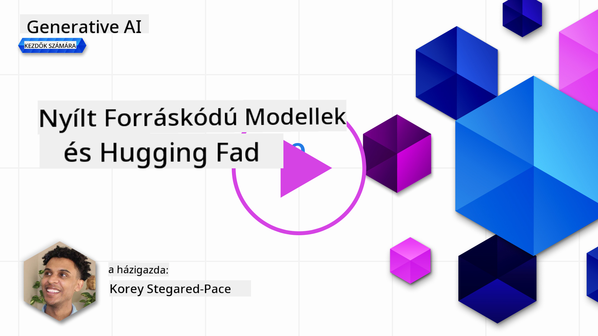
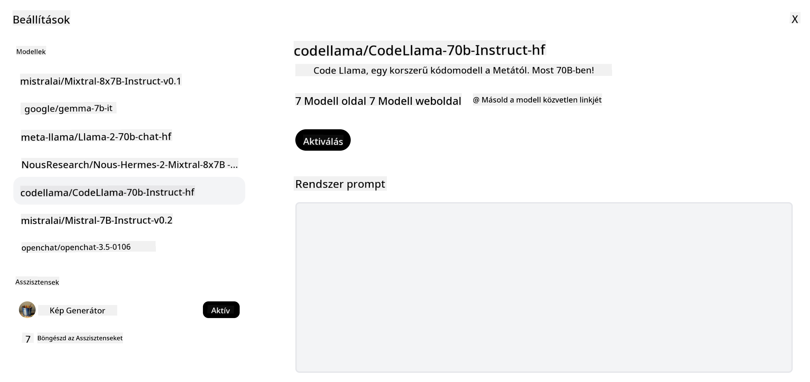

<!--
CO_OP_TRANSLATOR_METADATA:
{
  "original_hash": "0bba96e53ab841d99db731892a51fab8",
  "translation_date": "2025-06-26T00:02:18+00:00",
  "source_file": "16-open-source-models/README.md",
  "language_code": "hu"
}
-->

## Bevezetés

A nyílt forráskódú LLM-ek világa izgalmas és folyamatosan fejlődik. Ez a lecke mélyreható betekintést nyújt a nyílt forráskódú modellekbe. Ha arra vagy kíváncsi, hogyan hasonlíthatók össze a saját fejlesztésű modellek a nyílt forráskódúakkal, látogasd meg az ["Exploring and Comparing Different LLMs" leckét](../02-exploring-and-comparing-different-llms/README.md?WT.mc_id=academic-105485-koreyst). Ez a lecke a finomhangolás témáját is érinti, de részletesebb magyarázatot a ["Fine-Tuning LLMs" leckében](../18-fine-tuning/README.md?WT.mc_id=academic-105485-koreyst) találhatsz.

## Tanulási célok

- Megérteni a nyílt forráskódú modelleket
- Megérteni a nyílt forráskódú modellekkel való munka előnyeit
- Felfedezni a Hugging Face és az Azure AI Studio által kínált nyílt modelleket

## Mik azok a Nyílt Forráskódú Modellek?

A nyílt forráskódú szoftverek kulcsszerepet játszottak a technológia fejlődésében különböző területeken. Az Open Source Initiative (OSI) [10 kritériumot határozott meg a szoftverek számára](https://web.archive.org/web/20241126001143/https://opensource.org/osd?WT.mc_id=academic-105485-koreyst), hogy nyílt forráskódúnak minősüljenek. A forráskódot nyíltan kell megosztani egy OSI által jóváhagyott licenc alatt.

Bár az LLM-ek fejlesztése hasonló elemeket tartalmaz, mint a szoftverfejlesztés, a folyamat nem teljesen ugyanaz. Ez sok vitát váltott ki a közösségben az LLM-ek kontextusában vett nyílt forráskód definíciójáról. Ahhoz, hogy egy modell megfeleljen a hagyományos nyílt forráskódú definíciónak, a következő információknak nyilvánosan elérhetőnek kell lenniük:

- Az adathalmazok, amelyeket a modell képzéséhez használtak.
- Teljes modell súlyok a képzés részeként.
- Az értékelési kód.
- A finomhangolási kód.
- Teljes modell súlyok és képzési metrikák.

Jelenleg csak néhány modell felel meg ezeknek a kritériumoknak. Az [OLMo modell, amelyet az Allen Institute for Artificial Intelligence (AllenAI) hozott létre](https://huggingface.co/allenai/OLMo-7B?WT.mc_id=academic-105485-koreyst), ilyen kategóriába tartozik.

Ebben a leckében a továbbiakban "nyílt modelleknek" nevezzük a modelleket, mivel lehet, hogy az írás idején nem felelnek meg a fenti kritériumoknak.

## A Nyílt Modellek Előnyei

**Nagyon Testreszabható** - Mivel a nyílt modelleket részletes képzési információkkal együtt adják ki, a kutatók és fejlesztők módosíthatják a modell belső működését. Ez lehetővé teszi nagyon specializált modellek létrehozását, amelyek egy adott feladatra vagy tanulmányi területre vannak finomhangolva. Ilyen példák a kódgenerálás, matematikai műveletek és biológia.

**Költség** - A tokenenkénti költség ezeknek a modelleknek a használatakor és telepítésekor alacsonyabb, mint a saját fejlesztésű modellek esetében. Generatív AI alkalmazások építésekor érdemes megvizsgálni a teljesítmény és az ár közötti viszonyt, amikor ezekkel a modellekkel dolgozol az adott felhasználási esetre.

  
Forrás: Artificial Analysis

**Rugalmasság** - A nyílt modellekkel való munka lehetővé teszi, hogy rugalmas legyél különböző modellek használatában vagy kombinálásában. Ennek egyik példája a [HuggingChat Asszisztensek](https://huggingface.co/chat?WT.mc_id=academic-105485-koreyst), ahol a felhasználó közvetlenül a felhasználói felületen választhatja ki a használt modellt:

## Különböző Nyílt Modellek Felfedezése

### Llama 2

A [LLama2](https://huggingface.co/meta-llama?WT.mc_id=academic-105485-koreyst), amelyet a Meta fejlesztett ki, egy nyílt modell, amelyet chat alapú alkalmazásokhoz optimalizáltak. Ez a finomhangolási módszerének köszönhető, amely nagy mennyiségű párbeszédet és emberi visszajelzést tartalmazott. Ezzel a módszerrel a modell több olyan eredményt produkál, amely megfelel az emberi elvárásoknak, ezáltal jobb felhasználói élményt nyújt.

A Llama finomhangolt verziói közé tartozik például a [Japanese Llama](https://huggingface.co/elyza/ELYZA-japanese-Llama-2-7b?WT.mc_id=academic-105485-koreyst), amely japán nyelvre specializálódott, és a [Llama Pro](https://huggingface.co/TencentARC/LLaMA-Pro-8B?WT.mc_id=academic-105485-koreyst), amely a bázismodell továbbfejlesztett változata.

### Mistral

A [Mistral](https://huggingface.co/mistralai?WT.mc_id=academic-105485-koreyst) egy nyílt modell, amely nagy hangsúlyt fektet a magas teljesítményre és hatékonyságra. A Mixture-of-Experts megközelítést alkalmazza, amely egy csoport speciális szakértői modellt kombinál egy rendszerbe, ahol a bemenet alapján bizonyos modelleket választanak ki használatra. Ez hatékonyabbá teszi a számítást, mivel a modellek csak azokra a bemenetekre reagálnak, amelyekre specializálódtak.

A Mistral finomhangolt verziói közé tartozik például a [BioMistral](https://huggingface.co/BioMistral/BioMistral-7B?text=Mon+nom+est+Thomas+et+mon+principal?WT.mc_id=academic-105485-koreyst), amely az orvosi területre összpontosít, és az [OpenMath Mistral](https://huggingface.co/nvidia/OpenMath-Mistral-7B-v0.1-hf?WT.mc_id=academic-105485-koreyst), amely matematikai számításokat végez.

### Falcon

A [Falcon](https://huggingface.co/tiiuae?WT.mc_id=academic-105485-koreyst) egy LLM, amelyet a Technology Innovation Institute (**TII**) hozott létre. A Falcon-40B-t 40 milliárd paraméteren képezték ki, ami kevesebb számítási költséggel jobb teljesítményt mutat, mint a GPT-3. Ez a FlashAttention algoritmus és a többkérdéses figyelem használatának köszönhető, ami lehetővé teszi a memóriaigény csökkentését az értelmezési időben. A csökkentett értelmezési idővel a Falcon-40B alkalmas chat alkalmazásokhoz.

A Falcon finomhangolt verziói közé tartozik például az [OpenAssistant](https://huggingface.co/OpenAssistant/falcon-40b-sft-top1-560?WT.mc_id=academic-105485-koreyst), egy nyílt modellekre épülő asszisztens, és a [GPT4ALL](https://huggingface.co/nomic-ai/gpt4all-falcon?WT.mc_id=academic-105485-koreyst), amely jobb teljesítményt nyújt, mint az alapmodell.

## Hogyan Válasszunk

Nincs egyetlen válasz a nyílt modell kiválasztására. Jó kiindulópont lehet az Azure AI Studio feladat szerinti szűrés funkciójának használata. Ez segít megérteni, hogy milyen típusú feladatokra képezték a modellt. A Hugging Face is fenntart egy LLM Leaderboardot, amely megmutatja a legjobban teljesítő modelleket bizonyos metrikák alapján.

Ha az LLM-eket különböző típusok szerint szeretnéd összehasonlítani, az [Artificial Analysis](https://artificialanalysis.ai/?WT.mc_id=academic-105485-koreyst) egy másik nagyszerű forrás:

  
Forrás: Artificial Analysis

Ha egy adott felhasználási esetet vizsgálsz, érdemes finomhangolt verziókat keresni, amelyek ugyanarra a területre összpontosítanak. Több nyílt modell kipróbálása, hogy lássuk, hogyan teljesítenek a saját és a felhasználóid elvárásai szerint, szintén jó gyakorlat.

## Következő lépések

A nyílt modellek legjobb része, hogy gyorsan elkezdheted velük a munkát. Nézd meg az [Azure AI Studio Modellkatalógust](https://ai.azure.com?WT.mc_id=academic-105485-koreyst), amely egy speciális Hugging Face gyűjteményt tartalmaz az itt tárgyalt modellekkel.

## A tanulás nem áll meg itt, folytasd az utazást

A lecke befejezése után nézd meg a [Generative AI Learning gyűjteményünket](https://aka.ms/genai-collection?WT.mc_id=academic-105485-koreyst), hogy tovább fejleszd a Generative AI ismereteidet!

**Felelősség kizárása**:  
Ez a dokumentum az AI fordítási szolgáltatás [Co-op Translator](https://github.com/Azure/co-op-translator) segítségével lett lefordítva. Bár törekszünk a pontosságra, kérjük, vegye figyelembe, hogy az automatikus fordítások hibákat vagy pontatlanságokat tartalmazhatnak. Az eredeti dokumentum az eredeti nyelven tekintendő a hiteles forrásnak. Fontos információk esetén javasolt a professzionális emberi fordítás. Nem vállalunk felelősséget semmilyen félreértésért vagy félremagyarázásért, amely a fordítás használatából ered.