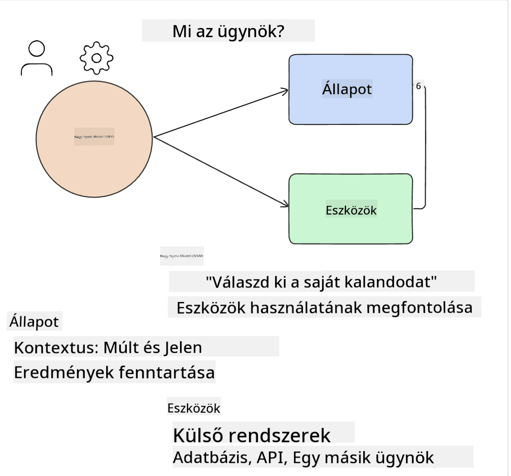
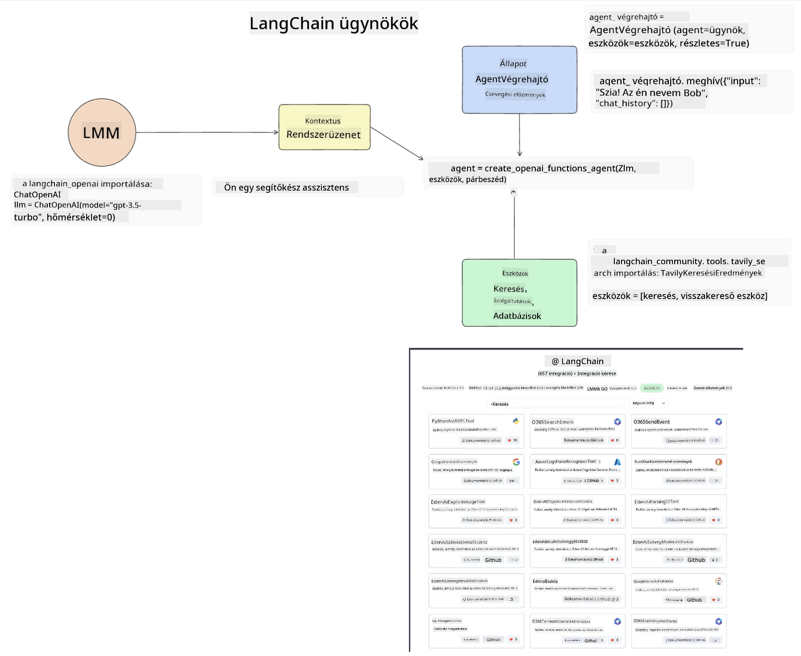
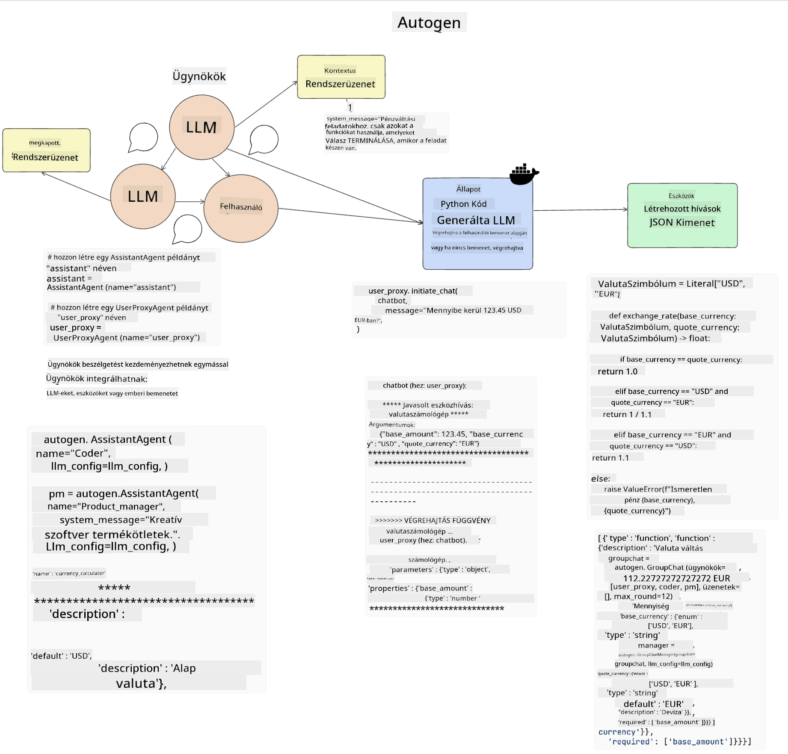
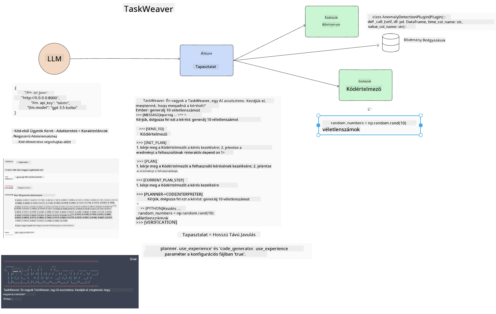
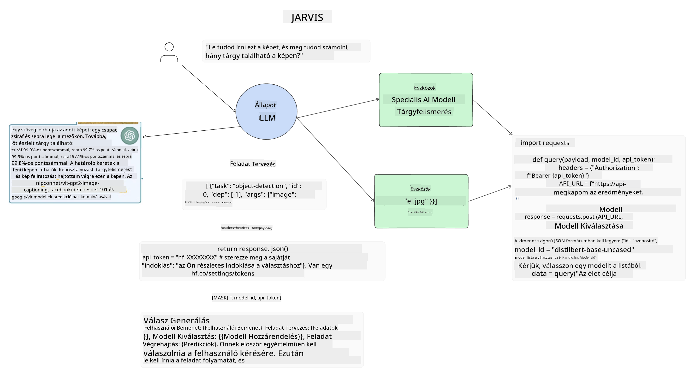

<!--
CO_OP_TRANSLATOR_METADATA:
{
  "original_hash": "11f03c81f190d9cbafd0f977dcbede6c",
  "translation_date": "2025-05-20T07:30:04+00:00",
  "source_file": "17-ai-agents/README.md",
  "language_code": "hu"
}
-->
[](https://aka.ms/gen-ai-lesson17-gh?WT.mc_id=academic-105485-koreyst)

## Bevezetés

Az AI ügynökök izgalmas fejlődést jelentenek a generatív AI területén, lehetővé téve a nagy nyelvi modellek (LLM-ek) számára, hogy asszisztensekből olyan ügynökökké fejlődjenek, akik képesek cselekedni. Az AI ügynök keretrendszerek lehetővé teszik a fejlesztők számára, hogy olyan alkalmazásokat hozzanak létre, amelyek hozzáférést biztosítanak az LLM-ek számára eszközökhöz és állapotkezeléshez. Ezek a keretrendszerek javítják a láthatóságot is, lehetővé téve a felhasználók és fejlesztők számára, hogy nyomon kövessék az LLM-ek által tervezett tevékenységeket, ezáltal javítva az élménykezelést.

A lecke az alábbi területeket fogja lefedni:

- Megérteni, mi az AI ügynök - Pontosan mi is az AI ügynök?
- Négy különböző AI ügynök keretrendszer felfedezése - Mi teszi őket egyedivé?
- Ezeknek az AI ügynököknek a különböző felhasználási esetekben való alkalmazása - Mikor kell AI ügynököket használni?

## Tanulási célok

A lecke elvégzése után képes leszel:

- Elmagyarázni, mi az AI ügynök és hogyan lehet használni.
- Megérteni a különbségeket néhány népszerű AI ügynök keretrendszer között, és hogyan különböznek.
- Megérteni, hogyan működnek az AI ügynökök, hogy alkalmazásokat építhess velük.

## Mik azok az AI ügynökök?

Az AI ügynökök nagyon izgalmas területet képviselnek a generatív AI világában. Ezzel az izgalommal néha összekeverednek a kifejezések és azok alkalmazása. Hogy egyszerűen és a legtöbb AI ügynököt említő eszközt magában foglalóan tartsuk a dolgokat, ezt a definíciót fogjuk használni:

Az AI ügynökök lehetővé teszik a nagy nyelvi modellek (LLM-ek) számára, hogy feladatokat hajtsanak végre azáltal, hogy hozzáférést biztosítanak számukra egy **állapothoz** és **eszközökhöz**.



Határozzuk meg ezeket a kifejezéseket:

**Nagy nyelvi modellek** - Ezek azok a modellek, amelyekre a kurzus során hivatkozunk, mint például a GPT-3.5, GPT-4, Llama-2 stb.

**Állapot** - Ez arra a kontextusra utal, amelyben az LLM dolgozik. Az LLM a múltbeli tevékenységek és a jelenlegi kontextus alapján dönt a következő lépésekről. Az AI ügynök keretrendszerek lehetővé teszik a fejlesztők számára, hogy könnyebben fenntartsák ezt a kontextust.

**Eszközök** - A felhasználó által kért feladat elvégzéséhez, amelyet az LLM megtervezett, az LLM-nek hozzáférésre van szüksége eszközökhöz. Néhány példa az eszközökre lehet egy adatbázis, egy API, egy külső alkalmazás vagy akár egy másik LLM!

Ezek a definíciók remélhetőleg jó alapot adnak a továbbiakhoz, ahogy megvizsgáljuk, hogyan valósítják meg őket. Nézzünk meg néhány különböző AI ügynök keretrendszert:

## LangChain ügynökök

A [LangChain ügynökök](https://python.langchain.com/docs/how_to/#agents?WT.mc_id=academic-105485-koreyst) az általunk fentebb meghatározott definíciók megvalósítása.

Az **állapot** kezeléséhez egy beépített funkciót használ, amelyet `AgentExecutor`-nak neveznek. Ez elfogadja a meghatározott `agent`-t és a rendelkezésre álló `tools`-t.

A `Agent Executor` a csevegési előzményeket is tárolja, hogy biztosítsa a csevegés kontextusát.



A LangChain egy [eszközkatalógust](https://integrations.langchain.com/tools?WT.mc_id=academic-105485-koreyst) kínál, amelyeket be lehet importálni az alkalmazásba, ahol az LLM hozzáférhet hozzájuk. Ezeket a közösség és a LangChain csapata készítette.

Ezeket az eszközöket definiálhatod, és átadhatod a `Agent Executor`-nak.

A láthatóság egy másik fontos szempont az AI ügynökökről beszélve. Fontos, hogy az alkalmazásfejlesztők megértsék, melyik eszközt használja az LLM és miért. Ehhez a LangChain csapata kifejlesztette a LangSmith-t.

## AutoGen

A következő AI ügynök keretrendszer, amelyet meg fogunk vizsgálni, az [AutoGen](https://microsoft.github.io/autogen/?WT.mc_id=academic-105485-koreyst). Az AutoGen fő fókusza a beszélgetések. Az ügynökök egyszerre **beszélgetőkész** és **testreszabhatóak**.

**Beszélgetőkész -** Az LLM-ek képesek elkezdeni és folytatni egy beszélgetést egy másik LLM-mel a feladat elvégzése érdekében. Ezt úgy teszik, hogy létrehoznak `AssistantAgents`-t és adnak nekik egy specifikus rendszert üzenetet.

```python

autogen.AssistantAgent( name="Coder", llm_config=llm_config, ) pm = autogen.AssistantAgent( name="Product_manager", system_message="Creative in software product ideas.", llm_config=llm_config, )

```

**Testreszabható** - Az ügynökök nem csak LLM-ek lehetnek, hanem felhasználók vagy eszközök is. Fejlesztőként definiálhatsz egy `UserProxyAgent`-et, amely felelős a felhasználóval való interakcióért a feladat végrehajtásához szükséges visszajelzésekért. Ez a visszajelzés vagy folytathatja a feladat végrehajtását, vagy leállíthatja azt.

```python
user_proxy = UserProxyAgent(name="user_proxy")
```

### Állapot és eszközök

Az állapot megváltoztatásához és kezeléséhez egy asszisztens ügynök Python kódot generál a feladat elvégzéséhez.

Íme a folyamat példája:



#### LLM rendszert üzenettel meghatározva

```python
system_message="For weather related tasks, only use the functions you have been provided with. Reply TERMINATE when the task is done."
```

Ez a rendszert üzenet irányítja ezt a specifikus LLM-et, hogy mely funkciók relevánsak a feladatához. Ne feledd, az AutoGen segítségével több meghatározott AssistantAgent lehet különböző rendszert üzenetekkel.

#### Csevegést a felhasználó kezdeményezi

```python
user_proxy.initiate_chat( chatbot, message="I am planning a trip to NYC next week, can you help me pick out what to wear? ", )

```

Ez a felhasználó_proxy (ember) üzenete indítja el az ügynök folyamatát, hogy feltérképezze a végrehajtandó lehetséges funkciókat.

#### Funkció végrehajtása

```bash
chatbot (to user_proxy):

***** Suggested tool Call: get_weather ***** Arguments: {"location":"New York City, NY","time_periond:"7","temperature_unit":"Celsius"} ******************************************************** --------------------------------------------------------------------------------

>>>>>>>> EXECUTING FUNCTION get_weather... user_proxy (to chatbot): ***** Response from calling function "get_weather" ***** 112.22727272727272 EUR ****************************************************************

```

Miután az első csevegés feldolgozásra került, az ügynök javasolja a végrehajtandó eszközt. Ebben az esetben ez egy `get_weather`. Depending on your configuration, this function can be automatically executed and read by the Agent or can be executed based on user input.

You can find a list of [AutoGen code samples](https://microsoft.github.io/autogen/docs/Examples/?WT.mc_id=academic-105485-koreyst) to further explore how to get started building.

## Taskweaver

The next agent framework we will explore is [Taskweaver](https://microsoft.github.io/TaskWeaver/?WT.mc_id=academic-105485-koreyst). It is known as a "code-first" agent because instead of working strictly with `strings` , it can work with DataFrames in Python. This becomes extremely useful for data analysis and generation tasks. This can be things like creating graphs and charts or generating random numbers.

### State and Tools

To manage the state of the conversation, TaskWeaver uses the concept of a `Planner`. The `Planner` is a LLM that takes the request from the users and maps out the tasks that need to be completed to fulfill this request.

To complete the tasks the `Planner` is exposed to the collection of tools called `Plugins` nevű funkció. Ez lehet Python osztályok vagy általános kódértelmező. Ezek a bővítmények beágyazásokként vannak tárolva, hogy az LLM jobban tudjon keresni a megfelelő bővítmény után.



Itt van egy példa egy bővítményre, amely anomália észlelését kezeli:

```python
class AnomalyDetectionPlugin(Plugin): def __call__(self, df: pd.DataFrame, time_col_name: str, value_col_name: str):
```

A kódot ellenőrzik a végrehajtás előtt. Egy másik funkció a kontextus kezelésére a Taskweaverben a `experience`. Experience allows for the context of a conversation to be stored over to the long term in a YAML file. This can be configured so that the LLM improves over time on certain tasks given that it is exposed to prior conversations.

## JARVIS

The last agent framework we will explore is [JARVIS](https://github.com/microsoft/JARVIS?tab=readme-ov-file?WT.mc_id=academic-105485-koreyst). What makes JARVIS unique is that it uses an LLM to manage the `state` a beszélgetés és a `tools` más AI modellek. Mindegyik AI modell speciális modellek, amelyek bizonyos feladatokat hajtanak végre, mint például objektumfelismerés, átírás vagy kép feliratozás.



Az LLM, mint általános célú modell, megkapja a felhasználó kérését, és azonosítja a specifikus feladatot és az ahhoz szükséges érveket/adatokat.

```python
[{"task": "object-detection", "id": 0, "dep": [-1], "args": {"image": "e1.jpg" }}]
```

Az LLM ezután olyan formátumra alakítja a kérést, amelyet a speciális AI modell értelmezhet, például JSON. Miután az AI modell visszaadta a feladat alapján készült előrejelzését, az LLM megkapja a választ.

Ha több modell szükséges a feladat elvégzéséhez, az LLM a válaszokat is értelmezi, mielőtt összehozza őket, hogy generálja a felhasználónak szóló választ.

Az alábbi példa bemutatja, hogyan működne ez, amikor a felhasználó egy kép objektumainak leírását és számát kéri:

## Feladat

Az AI ügynökök tanulásának folytatásához építhetsz az AutoGen segítségével:

- Egy alkalmazást, amely egy oktatási startup különböző részlegeinek üzleti megbeszélését szimulálja.
- Hozz létre rendszert üzeneteket, amelyek segítik az LLM-eket különböző személyiségek és prioritások megértésében, és lehetővé teszik a felhasználó számára, hogy bemutasson egy új termékötletet.
- Az LLM-nek ezután követő kérdéseket kell generálnia minden részlegtől, hogy finomítsa és javítsa a bemutatót és a termékötletet.

## A tanulás itt nem áll meg, folytasd az utazást

A lecke elvégzése után nézd meg [Generative AI Learning collection](https://aka.ms/genai-collection?WT.mc_id=academic-105485-koreyst) gyűjteményünket, hogy tovább fejleszd generatív AI tudásodat!

**Jogi nyilatkozat**:  
Ez a dokumentum az AI fordítási szolgáltatás, a [Co-op Translator](https://github.com/Azure/co-op-translator) segítségével lett lefordítva. Bár törekszünk a pontosságra, kérjük, vegye figyelembe, hogy az automatikus fordítások hibákat vagy pontatlanságokat tartalmazhatnak. Az eredeti dokumentum az anyanyelvén tekintendő hiteles forrásnak. Kritikus információk esetén javasolt a professzionális emberi fordítás igénybevétele. Nem vállalunk felelősséget a fordítás használatából eredő félreértésekért vagy félremagyarázásokért.