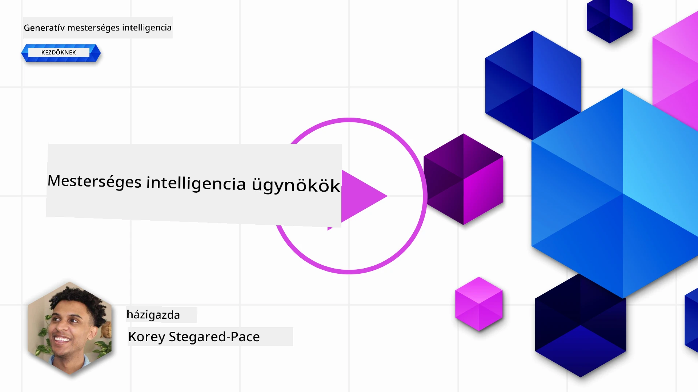
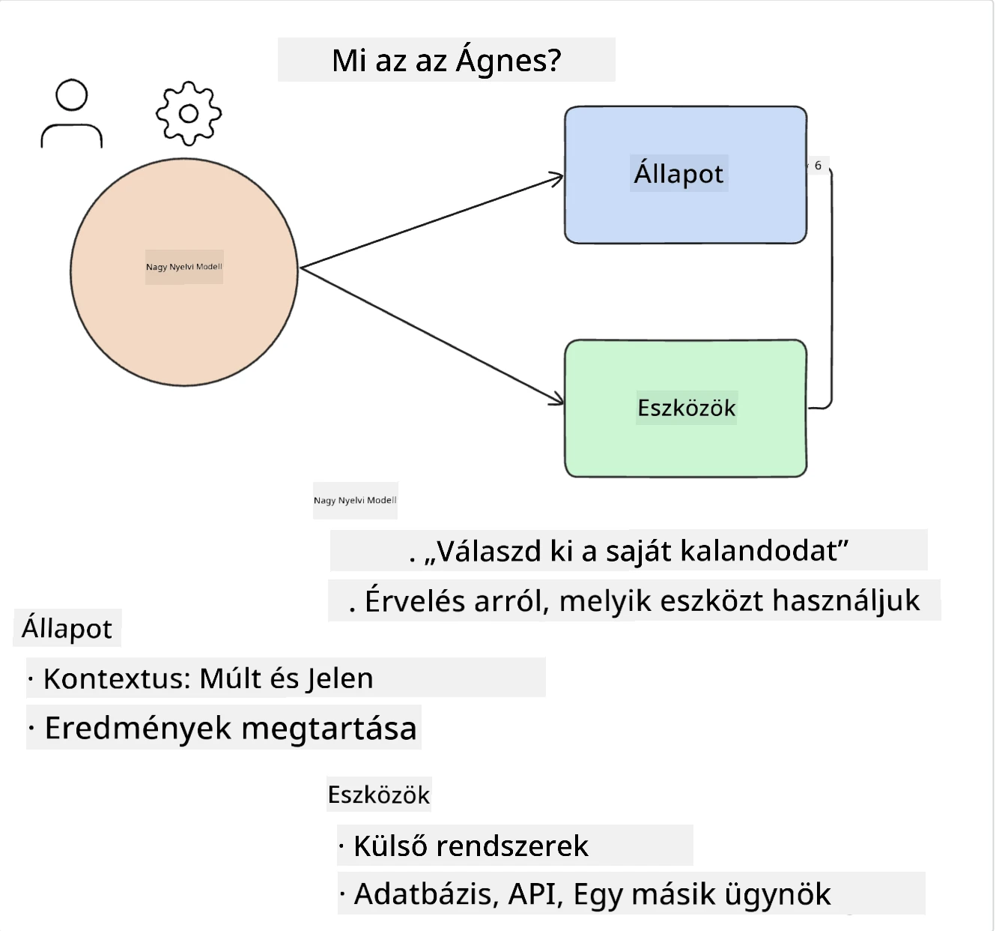
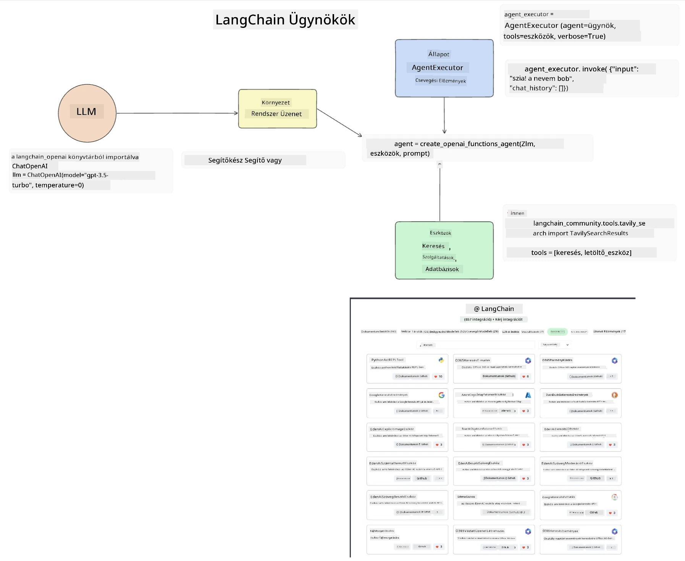
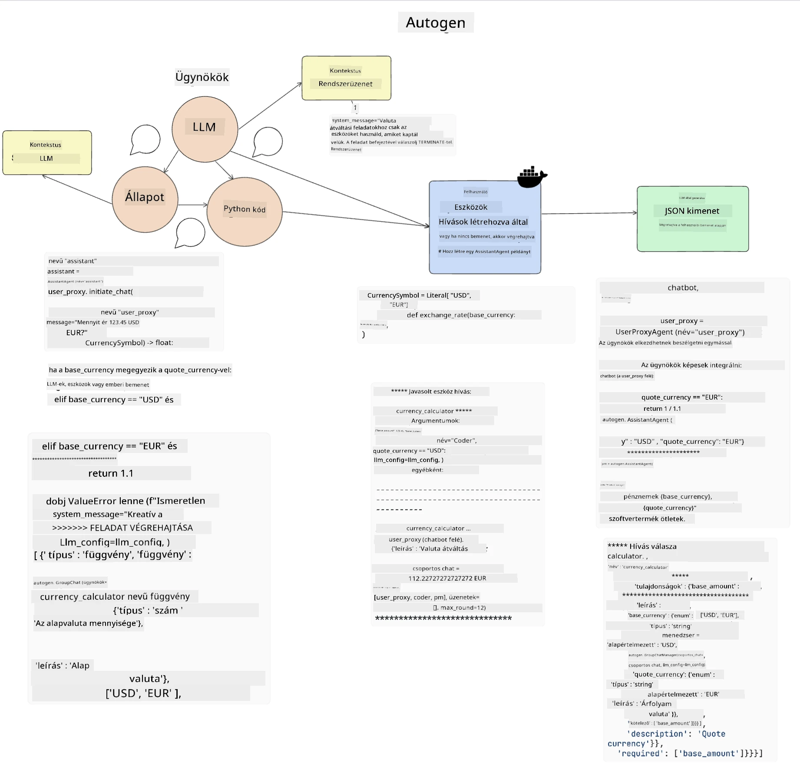
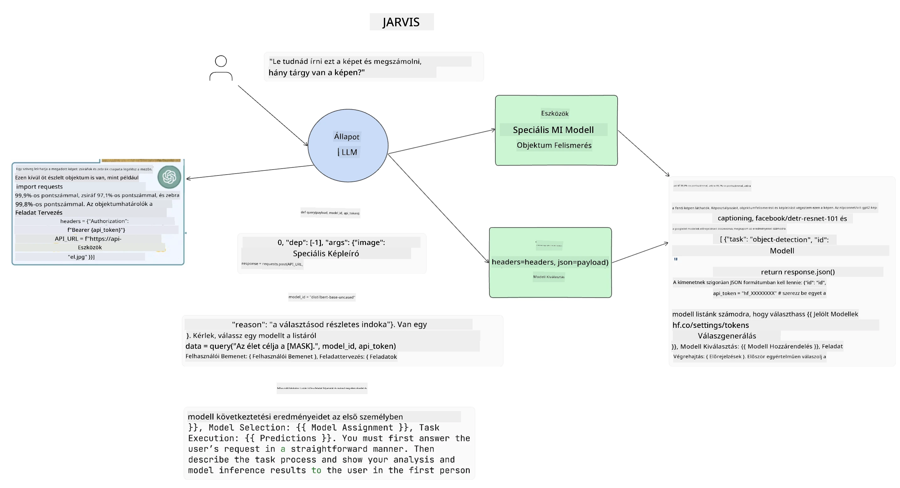

[](https://youtu.be/yAXVW-lUINc?si=bOtW9nL6jc3XJgOM)

## Bevezetés

Az AI Ügynökök izgalmas fejlesztést képviselnek a Generatív MI területén, lehetővé téve, hogy a Nagy Nyelvi Modellek (LLM-ek) az asszisztensekből olyan ügynökökké fejlődjenek, amelyek képesek cselekvéseket végrehajtani. Az AI Ügynök keretrendszerek lehetővé teszik a fejlesztők számára alkalmazások létrehozását, amelyek hozzáférést biztosítanak az LLM-ek számára eszközökhöz és állapotkezeléshez. Ezek a keretrendszerek növelik a láthatóságot is, lehetővé téve a felhasználók és fejlesztők számára, hogy nyomon kövessék az LLM-ek által tervezett cselekvéseket, ezáltal javítva a felhasználói élmény menedzsmentjét.

A lecke a következő területeket fogja érinteni:

- Mi az az AI Ügynök? – Pontosan mit értünk AI Ügynök alatt?
- Négy különböző AI Ügynök Keretrendszer bemutatása – Mi teszi őket egyedivé?
- AI Ügynökök alkalmazása különböző használati esetekben – Mikor érdemes AI Ügynököket használni?

## Tanulási célok

A lecke elvégzése után képes leszel:

- Elmagyarázni, mi az AI Ügynök és hogyan alkalmazható.
- Megérteni a népszerű AI Ügynök Keretrendszerek közötti különbségeket és jellemzőiket.
- Megérteni, hogyan működnek az AI Ügynökök az alkalmazások építéséhez.

## Mik azok az AI Ügynökök?

Az AI Ügynökök nagyon izgalmas területet jelentenek a Generatív MI világában. Ezzel az izgalommal néha fogalmi és alkalmazási zavar is együtt jár. Hogy egyszerűek és befogadóak legyünk a legtöbb AI Ügynökre utaló eszközzel, a következő definíciót fogjuk használni:

Az AI Ügynökök lehetővé teszik a Nagy Nyelvi Modellek (LLM-ek) számára, hogy feladatokat hajtsanak végre azáltal, hogy hozzáférést kapnak egy **állapothoz** és **eszközökhöz**.



Határozzuk meg ezeket a fogalmakat:

**Nagy Nyelvi Modellek** – Ezek azok a modellek, amelyekre a kurzus során hivatkozunk, például GPT-3.5, GPT-4, Llama-2 stb.

**Állapot** – Ez az a kontextus, amelyben az LLM dolgozik. Az LLM a korábbi cselekvések és a jelenlegi kontextus alapján irányítja a döntéseit a további lépésekhez. Az AI Ügynök Keretrendszerek megkönnyítik a fejlesztők számára, hogy fenntartsák ezt a kontextust.

**Eszközök** – A felhasználó által kért, és az LLM által megtervezett feladat végrehajtásához az LLM-nek hozzáférést kell kapnia eszközökhöz. Néhány példa eszközökre: adatbázis, API, külső alkalmazás vagy akár egy másik LLM!

Ezek a definíciók remélhetőleg jó alapot adnak a továbblépéshez, miközben megvizsgáljuk, hogyan vannak megvalósítva. Fedezzünk fel néhány különböző AI Ügynök keretrendszert:

## LangChain Ügynökök

A [LangChain Ügynökök](https://python.langchain.com/docs/how_to/#agents?WT.mc_id=academic-105485-koreyst) megvalósítják a fent definiált elveket.

Az **állapot** kezelésére egy beépített függvényt használnak, amely az `AgentExecutor` névre hallgat. Ez elfogadja a definiált `agent`-et és az elérhető `tools`-okat.

Az `Agent Executor` tárolja a chat előzményeket is, hogy biztosítsa a beszélgetés kontextusát.



A LangChain kínál egy [eszközkatalógust](https://integrations.langchain.com/tools?WT.mc_id=academic-105485-koreyst), amelyeket be lehet importálni az alkalmazásba, ahová az LLM hozzáférhet. Ezeket a közösség és a LangChain csapata készíti.

Ezeket az eszközöket definiálhatod, majd átadhatod az `Agent Executor`-nak.

A láthatóság szintén fontos szempont AI Ügynökök esetén. Fontos, hogy az alkalmazásfejlesztők megértsék, mely eszközt használja az LLM és miért. Ennek érdekében a LangChain csapata kifejlesztette a LangSmith-et.

## AutoGen

A következő AI Ügynök keretrendszer, amiről beszélünk, az [AutoGen](https://microsoft.github.io/autogen/?WT.mc_id=academic-105485-koreyst). Az AutoGen fő fókusza a beszélgetés. Az ügynökök mind **beszélgetőképesek**, mind **testreszabhatók**.

**Beszélgetőképes -** Az LLM-ek képesek megkezdeni és folytatni egy beszélgetést egy másik LLM-mel, hogy végrehajtsanak egy feladatot. Ez úgy történik, hogy `AssistantAgents` jönnek létre és kapnak egy specifikus rendszerüzenetet.

```python

autogen.AssistantAgent( name="Coder", llm_config=llm_config, ) pm = autogen.AssistantAgent( name="Product_manager", system_message="Creative in software product ideas.", llm_config=llm_config, )

```

**Testreszabható** – Az ügynökök nem csak LLM-ek lehetnek, hanem felhasználók vagy eszközök is. Fejlesztőként definiálhatsz egy `UserProxyAgent`-et, amely felelős a felhasználóval való interakcióért, hogy visszajelzést kapjon a feladat végrehajtásával kapcsolatban. Ez a visszajelzés folytathatja vagy leállíthatja a feladat végrehajtását.

```python
user_proxy = UserProxyAgent(name="user_proxy")
```

### Állapot és Eszközök

Az állapot változtatására és kezelésére egy asszisztens ügynök Python kódot generál a feladat végrehajtásához.

Itt egy példa a folyamatról:



#### LLM definiálva egy rendszerüzenettel

```python
system_message="For weather related tasks, only use the functions you have been provided with. Reply TERMINATE when the task is done."
```

Ez a rendszerüzenet irányítja ezt a konkrét LLM-et arra, hogy mely funkciók relevánsak a feladatához. Ne feledd, az AutoGen segítségével több definiált AssistantAgent is lehet különböző rendszerüzenetekkel.

#### A beszélgetést a felhasználó kezdeményezi

```python
user_proxy.initiate_chat( chatbot, message="I am planning a trip to NYC next week, can you help me pick out what to wear? ", )

```

Ez a felhasználói proxy (ember) üzenet indítja el az ügynök folyamatát, hogy feltárja azokat a funkciókat, amelyeket végre kell hajtania.

#### A funkció végrehajtása

```bash
chatbot (to user_proxy):

***** Suggested tool Call: get_weather ***** Arguments: {"location":"New York City, NY","time_periond:"7","temperature_unit":"Celsius"} ******************************************************** --------------------------------------------------------------------------------

>>>>>>>> EXECUTING FUNCTION get_weather... user_proxy (to chatbot): ***** Response from calling function "get_weather" ***** 112.22727272727272 EUR ****************************************************************

```

Amint az első beszélgetés feldolgozásra kerül, az ügynök elküldi a javasolt eszközt a híváshoz. Ebben az esetben ez egy `get_weather` nevű függvény. A konfigurációdtól függően ez a függvény automatikusan végrehajtódhat és olvasható az ügynök által, vagy a felhasználói input alapján hajtható végre.

Találsz egy listát az [AutoGen kódmintákból](https://microsoft.github.io/autogen/docs/Examples/?WT.mc_id=academic-105485-koreyst), hogy még jobban megismerhesd a fejlesztést.

## Taskweaver

A következő ügynök keretrendszer, amit felfedezünk, a [Taskweaver](https://microsoft.github.io/TaskWeaver/?WT.mc_id=academic-105485-koreyst). Ez egy „kód-első” ügynök, mert nemcsak `sztringekkel` dolgozik, hanem Python DataFrame-ekkel is. Ez rendkívül hasznos adatelemzési és generálási feladatoknál, mint például gráfok, diagramok készítése vagy véletlenszám-generálás.

### Állapot és Eszközök

A beszélgetés állapotának kezelésére a TaskWeaver a `Planner` (tervező) koncepcióját használja. A `Planner` egy LLM, amely átveszi a felhasználói kérést és felméri a feladatokat, amelyeket teljesíteni kell a kérés teljesítéséhez.

A feladatok végrehajtásához a `Planner` hozzáférést kap egy `Plugins` gyűjteményhez, amely lehet Python osztály vagy egy általános kódértelmező. Ezeket a plugineket beágyazásokként tárolják, hogy az LLM könnyebben találhassa meg a megfelelő plugint.


Itt egy példa egy pluginelemre, ami anomáliaérzékelést kezel:

```python
class AnomalyDetectionPlugin(Plugin): def __call__(self, df: pd.DataFrame, time_col_name: str, value_col_name: str):
```

A kód végrehajtás előtt ellenőrizve van. Egy másik funkció a kontextus kezelésére a Taskweaver-ben az `experience` (tapasztalat). Az experience lehetővé teszi, hogy egy beszélgetés kontextusát hosszú távon egy YAML fájlban tároljuk. Ez úgy konfigurálható, hogy az LLM idővel javuljon egyes feladatokban, amennyiben korábbi beszélgetéseknek van kitéve.

## JARVIS

Az utolsó ügynök keretrendszer, amit felfedezünk, a [JARVIS](https://github.com/microsoft/JARVIS?tab=readme-ov-file&WT.mc_id=academic-105485-koreyst). Ami egyedivé teszi a JARVIS-t, hogy egy LLM kezeli a beszélgetés `állapotát`, míg az `eszközök` más AI modellek. Ezek az AI modellek specializált modellek, amelyek bizonyos feladatokat látnak el, például tárgyfelismerést, átírást vagy képmagyarázatot.



Az általános célú LLM megkapja a felhasználói kérést, azonosítja a konkrét feladatot és az esetleges argumentumokat/adatokat, amelyek a feladat végrehajtásához szükségesek.

```python
[{"task": "object-detection", "id": 0, "dep": [-1], "args": {"image": "e1.jpg" }}]
```

Az LLM ezután a kérést olyan formátumba alakítja, amelyet a specializált AI modell képes értelmezni, például JSON formátumba. Amikor az AI modell visszaadja az előrejelzését a feladat alapján, az LLM megkapja a választ.

Ha a feladat végrehajtásához több modellre is szükség van, az LLM értelmezi a modellek válaszait is, mielőtt egyesítené őket a használó számára adott válasz előállításához.

Az alábbi példa bemutatja, hogyan működne ez, amikor egy felhasználó leírást és tárgyak számát kéri egy képen:

## Feladat

Az AI Ügynökök tanulásának folytatásához építhetsz AutoGen-nel:

- Egy alkalmazást, amely szimulál egy üzleti találkozót egy oktatási startup különböző részlegei között.
- Rendszerüzenetek létrehozását, amelyek irányítják az LLM-eket a különböző személyiségek és prioritások megértésében, és lehetővé teszik a felhasználónak, hogy új termékötleteket mutasson be.
- Az LLM ezután generáljon követő kérdéseket minden részlegtől, hogy finomítsa és javítsa az ajánlatot és a termékötletet.

## A tanulás itt nem ér véget, folytasd az utat

A lecke elvégzése után nézd meg [Generatív MI Tanulási gyűjteményünket](https://aka.ms/genai-collection?WT.mc_id=academic-105485-koreyst), hogy tovább fejleszd Generatív MI tudásodat!

---

<!-- CO-OP TRANSLATOR DISCLAIMER START -->
**Jogi Nyilatkozat**:  
Ezt a dokumentumot az AI fordító szolgáltatás, a [Co-op Translator](https://github.com/Azure/co-op-translator) segítségével fordítottuk. Bár pontos fordításra törekszünk, kérjük, vegye figyelembe, hogy az automatikus fordítások hibákat vagy pontatlanságokat tartalmazhatnak. Az eredeti dokumentum a saját nyelvén tekintendő hivatalos forrásnak. Kritikus információk esetén profi emberi fordítást javaslunk. Nem vállalunk felelősséget az ebből eredő félreértésekért vagy téves értelmezésekért.
<!-- CO-OP TRANSLATOR DISCLAIMER END -->