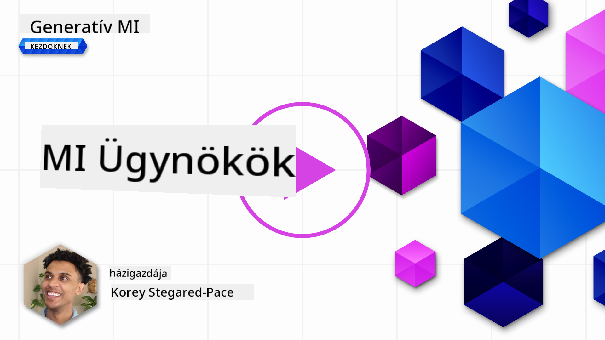
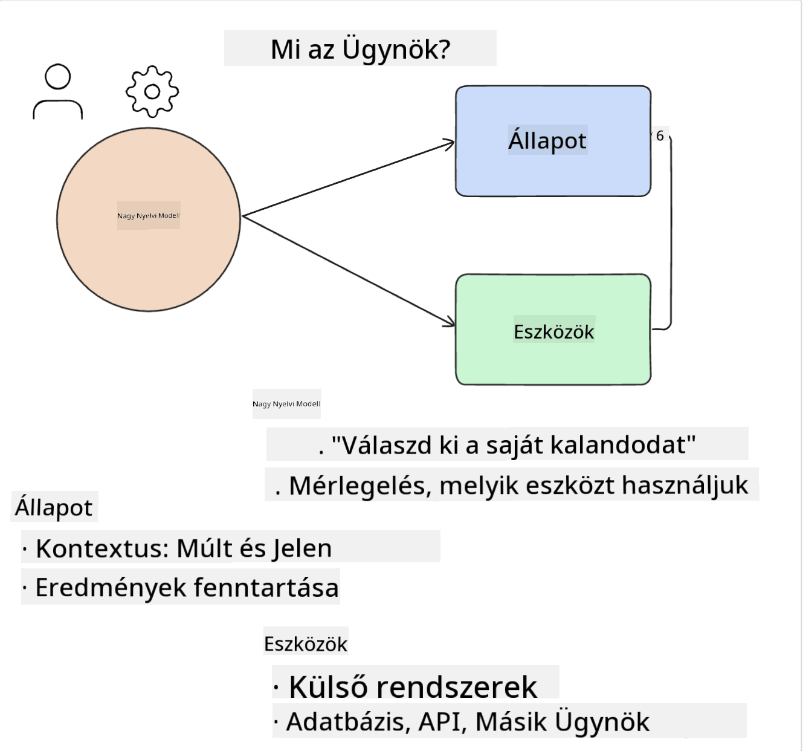
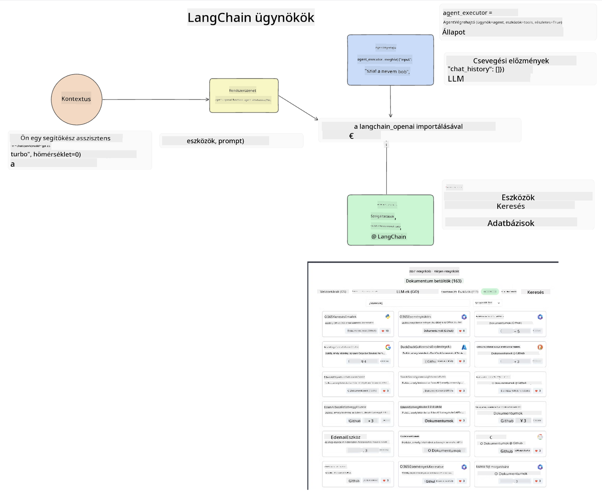
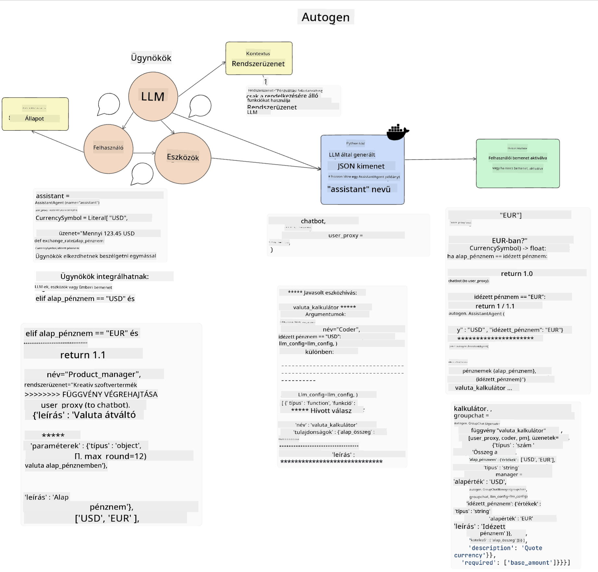
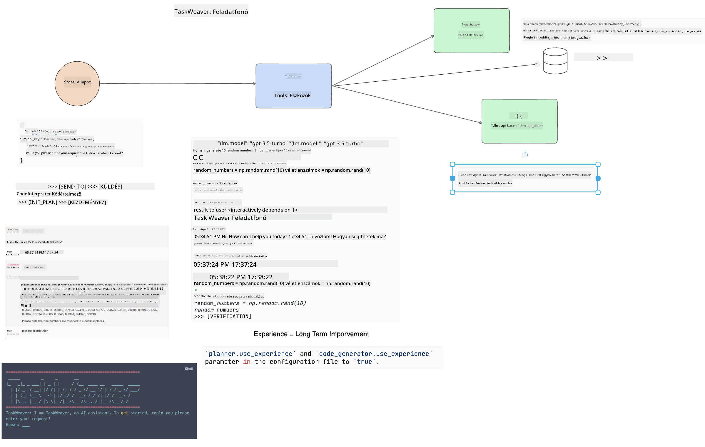
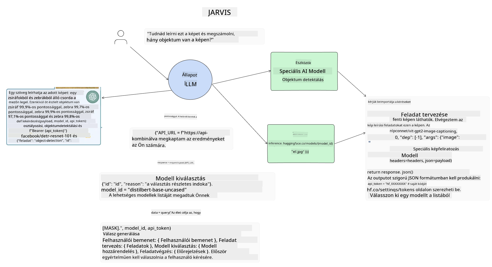

<!--
CO_OP_TRANSLATOR_METADATA:
{
  "original_hash": "11f03c81f190d9cbafd0f977dcbede6c",
  "translation_date": "2025-06-26T00:23:46+00:00",
  "source_file": "17-ai-agents/README.md",
  "language_code": "hu"
}
-->
[](https://aka.ms/gen-ai-lesson17-gh?WT.mc_id=academic-105485-koreyst)

## Bevezetés

Az AI ügynökök izgalmas fejleményt jelentenek a generatív AI terén, lehetővé téve a nagy nyelvi modellek (LLM-ek) számára, hogy asszisztensekből cselekvőképes ügynökökké fejlődjenek. Az AI ügynök keretrendszerek lehetővé teszik a fejlesztők számára, hogy olyan alkalmazásokat hozzanak létre, amelyek hozzáférést biztosítanak az LLM-ek számára eszközökhöz és állapotkezeléshez. Ezek a keretrendszerek növelik a láthatóságot is, lehetővé téve a felhasználók és fejlesztők számára, hogy nyomon kövessék az LLM-ek által tervezett lépéseket, ezáltal javítva az élménykezelést.

A lecke az alábbi területeket fogja lefedni:

- Megérteni, mi az az AI ügynök - Pontosan mi is az AI ügynök?
- Négy különböző AI ügynök keretrendszer felfedezése - Mi teszi őket egyedivé?
- Ezeknek az AI ügynököknek a különböző felhasználási esetekben történő alkalmazása - Mikor kell AI ügynököket használni?

## Tanulási célok

A lecke elvégzése után képes leszel:

- Elmagyarázni, mik azok az AI ügynökök, és hogyan használhatók.
- Megérteni néhány népszerű AI ügynök keretrendszer közötti különbségeket, és hogyan különböznek egymástól.
- Megérteni, hogyan működnek az AI ügynökök, hogy alkalmazásokat építhess velük.

## Mik azok az AI ügynökök?

Az AI ügynökök nagyon izgalmas területet képviselnek a generatív AI világában. Ezzel az izgalommal néha zavaros kifejezések és alkalmazások is járnak. Hogy egyszerűek és befogadóak legyünk a legtöbb eszközzel, amelyek az AI ügynökökre hivatkoznak, a következő definíciót fogjuk használni:

Az AI ügynökök lehetővé teszik a nagy nyelvi modellek (LLM-ek) számára, hogy feladatokat hajtsanak végre, azáltal hogy hozzáférést biztosítanak számukra egy **állapothoz** és **eszközökhöz**.



Határozzuk meg ezeket a kifejezéseket:

**Nagy nyelvi modellek** - Ezek azok a modellek, amelyekre a kurzus során hivatkozunk, mint például a GPT-3.5, GPT-4, Llama-2 stb.

**Állapot** - Ez az a kontextus, amelyben az LLM dolgozik. Az LLM használja a korábbi cselekvések kontextusát és a jelenlegi kontextust, irányítva a döntéshozatalát a következő cselekvésekhez. Az AI ügynök keretrendszerek lehetővé teszik a fejlesztők számára, hogy könnyebben fenntartsák ezt a kontextust.

**Eszközök** - Ahhoz, hogy teljesítse a felhasználó által kért feladatot, amit az LLM megtervezett, az LLM-nek hozzáférésre van szüksége eszközökhöz. Néhány példa az eszközökre lehet adatbázis, API, külső alkalmazás vagy akár egy másik LLM is!

Remélhetőleg ezek a definíciók jó alapot adnak neked, ahogy tovább haladunk az implementálásuk módjának vizsgálatában. Fedezzük fel néhány különböző AI ügynök keretrendszert:

## LangChain Ügynökök

A [LangChain Ügynökök](https://python.langchain.com/docs/how_to/#agents?WT.mc_id=academic-105485-koreyst) a fent megadott definíciók megvalósítása.

Az **állapot** kezelésére egy beépített funkciót használ, amelyet `AgentExecutor`-nak hívnak. Ez elfogadja a meghatározott `agent` és az elérhető `tools`.

A `Agent Executor` a chat történetet is tárolja, hogy biztosítsa a chat kontextusát.



A LangChain egy [eszközkatalógust](https://integrations.langchain.com/tools?WT.mc_id=academic-105485-koreyst) kínál, amelyeket importálhatsz az alkalmazásodba, ahol az LLM hozzáférést kaphat. Ezeket a közösség és a LangChain csapata készíti.

Ezután meghatározhatod ezeket az eszközöket, és átadhatod őket a `Agent Executor`-nak.

A láthatóság egy másik fontos szempont, amikor az AI ügynökökről beszélünk. Fontos az alkalmazásfejlesztők számára, hogy megértsék, melyik eszközt használja az LLM, és miért. Ehhez a LangChain csapata kifejlesztette a LangSmith-t.

## AutoGen

A következő AI ügynök keretrendszer, amit megvitatunk, az [AutoGen](https://microsoft.github.io/autogen/?WT.mc_id=academic-105485-koreyst). Az AutoGen fő fókusza a beszélgetések. Az ügynökök **beszélgetőképesek** és **testreszabhatóak**.

**Beszélgetőképes -** Az LLM-ek el tudnak kezdeni és folytatni egy beszélgetést egy másik LLM-mel egy feladat elvégzése érdekében. Ez úgy történik, hogy létrehozzák a `AssistantAgents` és megadnak nekik egy specifikus rendszerüzenetet.

```python

autogen.AssistantAgent( name="Coder", llm_config=llm_config, ) pm = autogen.AssistantAgent( name="Product_manager", system_message="Creative in software product ideas.", llm_config=llm_config, )

```

**Testreszabható** - Az ügynökök nem csak LLM-ekként definiálhatók, hanem lehetnek felhasználók vagy eszközök is. Fejlesztőként definiálhatsz egy `UserProxyAgent`-et, amely felelős a felhasználóval való interakcióért a feladat elvégzéséhez szükséges visszajelzés érdekében. Ez a visszajelzés folytathatja a feladat végrehajtását vagy megállíthatja azt.

```python
user_proxy = UserProxyAgent(name="user_proxy")
```

### Állapot és Eszközök

Az állapot megváltoztatásához és kezeléséhez egy asszisztens ügynök Python kódot generál a feladat elvégzéséhez.

Íme egy példa a folyamatra:



#### LLM Meghatározva Rendszerüzenettel

```python
system_message="For weather related tasks, only use the functions you have been provided with. Reply TERMINATE when the task is done."
```

Ez a rendszerüzenet irányítja ezt a specifikus LLM-et, hogy mely funkciók relevánsak a feladatához. Ne feledd, az AutoGen-nel több meghatározott AssistantAgent is lehet különböző rendszerüzenetekkel.

#### A Chatet a Felhasználó Indítja

```python
user_proxy.initiate_chat( chatbot, message="I am planning a trip to NYC next week, can you help me pick out what to wear? ", )

```

Ez az üzenet a user_proxy (Ember) részéről indítja el az ügynök folyamatát, hogy feltárja azokat a lehetséges funkciókat, amelyeket végre kell hajtania.

#### Funkció Végrehajtva

```bash
chatbot (to user_proxy):

***** Suggested tool Call: get_weather ***** Arguments: {"location":"New York City, NY","time_periond:"7","temperature_unit":"Celsius"} ******************************************************** --------------------------------------------------------------------------------

>>>>>>>> EXECUTING FUNCTION get_weather... user_proxy (to chatbot): ***** Response from calling function "get_weather" ***** 112.22727272727272 EUR ****************************************************************

```

Miután az első chat feldolgozásra került, az ügynök elküldi a javasolt eszközt, hogy hívja meg. Ebben az esetben ez egy `get_weather`. Depending on your configuration, this function can be automatically executed and read by the Agent or can be executed based on user input.

You can find a list of [AutoGen code samples](https://microsoft.github.io/autogen/docs/Examples/?WT.mc_id=academic-105485-koreyst) to further explore how to get started building.

## Taskweaver

The next agent framework we will explore is [Taskweaver](https://microsoft.github.io/TaskWeaver/?WT.mc_id=academic-105485-koreyst). It is known as a "code-first" agent because instead of working strictly with `strings` , it can work with DataFrames in Python. This becomes extremely useful for data analysis and generation tasks. This can be things like creating graphs and charts or generating random numbers.

### State and Tools

To manage the state of the conversation, TaskWeaver uses the concept of a `Planner`. The `Planner` is a LLM that takes the request from the users and maps out the tasks that need to be completed to fulfill this request.

To complete the tasks the `Planner` is exposed to the collection of tools called `Plugins` nevű funkció. Ezek lehetnek Python osztályok vagy általános kódértelmezők. Ezek a bővítmények beágyazásként vannak tárolva, hogy az LLM jobban kereshessen a megfelelő bővítmény után.



Itt van egy példa egy bővítményre, amely anomália detektálással foglalkozik:

```python
class AnomalyDetectionPlugin(Plugin): def __call__(self, df: pd.DataFrame, time_col_name: str, value_col_name: str):
```

A kód ellenőrizve van a végrehajtás előtt. Egy másik funkció a kontextus kezelésére a Taskweaver-ben az `experience`. Experience allows for the context of a conversation to be stored over to the long term in a YAML file. This can be configured so that the LLM improves over time on certain tasks given that it is exposed to prior conversations.

## JARVIS

The last agent framework we will explore is [JARVIS](https://github.com/microsoft/JARVIS?tab=readme-ov-file?WT.mc_id=academic-105485-koreyst). What makes JARVIS unique is that it uses an LLM to manage the `state` a beszélgetésben, és a `tools` más AI modellek. Mindegyik AI modell speciális modellek, amelyek bizonyos feladatokat hajtanak végre, mint például objektumfelismerés, átirat készítés vagy kép feliratozás.



Az LLM, mint általános célú modell, fogadja a felhasználó kérését, és azonosítja a specifikus feladatot és az ahhoz szükséges érveket/adatokat.

```python
[{"task": "object-detection", "id": 0, "dep": [-1], "args": {"image": "e1.jpg" }}]
```

Az LLM ezután úgy formázza a kérést, hogy a speciális AI modell értelmezni tudja, például JSON formátumban. Miután az AI modell visszaadta a feladat alapján készített előrejelzését, az LLM fogadja a választ.

Ha több modellre van szükség a feladat elvégzéséhez, az LLM értelmezni fogja a válaszokat ezekből a modellekből, mielőtt összehozza őket a felhasználónak szánt válasz generálásához.

Az alábbi példa bemutatja, hogyan működne ez, amikor a felhasználó egy kép objektumainak leírását és számát kéri:

## Feladat

Az AI ügynökök tanulásának folytatásához építhetsz az AutoGen segítségével:

- Egy alkalmazást, amely egy oktatási startup különböző részlegeivel szimulál egy üzleti megbeszélést.
- Hozz létre rendszerüzeneteket, amelyek segítik az LLM-eket a különböző személyiségek és prioritások megértésében, és lehetővé teszik a felhasználó számára egy új termékötlet bemutatását.
- Az LLM-nek ezután követő kérdéseket kell generálnia az egyes részlegektől, hogy finomítsa és javítsa a bemutatót és a termékötletet.

## A tanulás nem áll meg itt, folytasd az utazást

A lecke befejezése után tekintsd meg [Generatív AI Tanulási gyűjteményünket](https://aka.ms/genai-collection?WT.mc_id=academic-105485-koreyst), hogy tovább fejleszd generatív AI ismereteidet!

**Felelősség kizárása**:  
Ez a dokumentum az [Co-op Translator](https://github.com/Azure/co-op-translator) AI fordítási szolgáltatás segítségével készült. Bár törekszünk a pontosságra, kérjük, vegye figyelembe, hogy az automatikus fordítások hibákat vagy pontatlanságokat tartalmazhatnak. Az eredeti dokumentum az anyanyelvén tekintendő hiteles forrásnak. Kritikus információk esetén javasolt a professzionális emberi fordítás igénybevétele. Nem vállalunk felelősséget a fordítás használatából eredő félreértésekért vagy félreértelmezésekért.