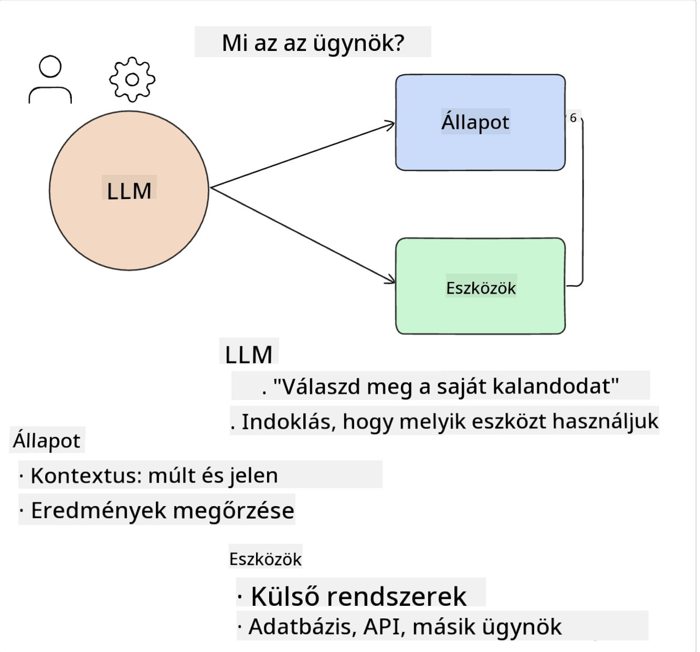
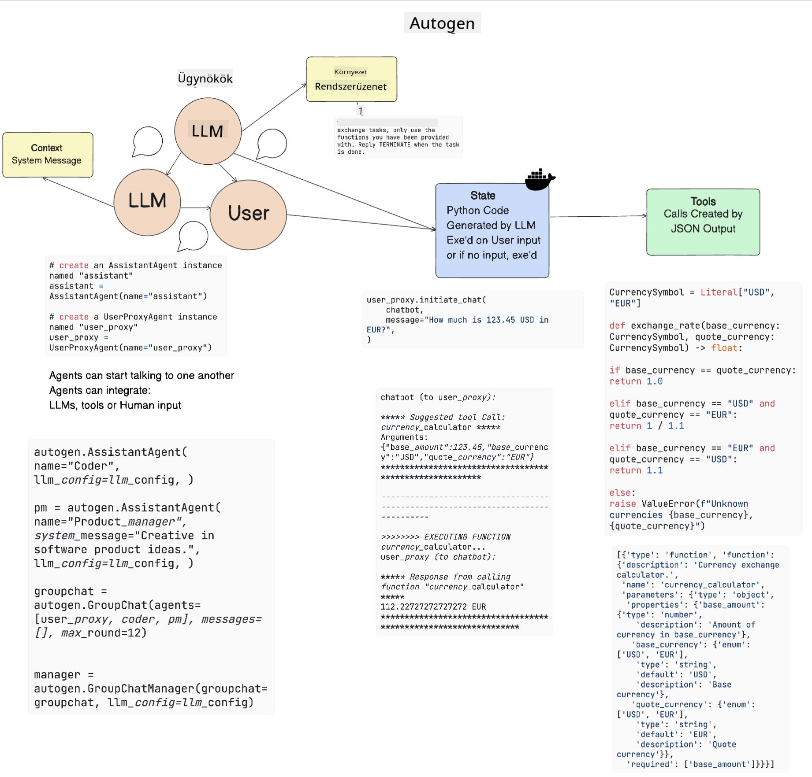

<!--
CO_OP_TRANSLATOR_METADATA:
{
  "original_hash": "8e8d1f6a63da606af7176a87ff8e92b6",
  "translation_date": "2025-10-17T21:33:45+00:00",
  "source_file": "17-ai-agents/README.md",
  "language_code": "hu"
}
-->
[](https://youtu.be/yAXVW-lUINc?si=bOtW9nL6jc3XJgOM)

## Bevezetés

Az AI ügynökök izgalmas fejleményt jelentenek a generatív mesterséges intelligencia területén, lehetővé téve a nagy nyelvi modellek (LLM-ek) számára, hogy asszisztensekből cselekvésre képes ügynökökké fejlődjenek. Az AI ügynök keretrendszerek lehetővé teszik a fejlesztők számára, hogy olyan alkalmazásokat hozzanak létre, amelyek hozzáférést biztosítanak az LLM-ek számára eszközökhöz és állapotkezeléshez. Ezek a keretrendszerek javítják az átláthatóságot is, lehetővé téve a felhasználók és fejlesztők számára, hogy nyomon kövessék az LLM-ek által tervezett cselekvéseket, ezáltal javítva az élménykezelést.

A lecke az alábbi területeket fogja lefedni:

- Az AI ügynökök megértése - Mi is pontosan egy AI ügynök?
- Négy különböző AI ügynök keretrendszer felfedezése - Mi teszi őket egyedivé?
- Az AI ügynökök alkalmazása különböző felhasználási esetekben - Mikor érdemes AI ügynököket használni?

## Tanulási célok

A lecke elvégzése után képes leszel:

- Elmagyarázni, hogy mik az AI ügynökök és hogyan használhatók.
- Megérteni néhány népszerű AI ügynök keretrendszer közötti különbségeket, és hogy miben térnek el egymástól.
- Megérteni, hogyan működnek az AI ügynökök, hogy alkalmazásokat építhess velük.

## Mik azok az AI ügynökök?

Az AI ügynökök rendkívül izgalmas területet képviselnek a generatív mesterséges intelligencia világában. Ezzel az izgalommal néha összezavarodás is jár a kifejezések és azok alkalmazása kapcsán. Az egyszerűség és a legtöbb AI ügynököt érintő eszközök befogadása érdekében a következő definíciót fogjuk használni:

Az AI ügynökök lehetővé teszik a nagy nyelvi modellek (LLM-ek) számára, hogy feladatokat végezzenek el azáltal, hogy hozzáférést biztosítanak számukra egy **állapothoz** és **eszközökhöz**.



Határozzuk meg ezeket a kifejezéseket:

**Nagy nyelvi modellek** - Ezek azok a modellek, amelyekről a kurzus során szó lesz, mint például GPT-3.5, GPT-4, Llama-2 stb.

**Állapot** - Ez arra a kontextusra utal, amelyben az LLM dolgozik. Az LLM a korábbi cselekvések és a jelenlegi kontextus alapján irányítja a döntéshozatalt a következő cselekvésekhez. Az AI ügynök keretrendszerek megkönnyítik a fejlesztők számára ennek a kontextusnak a fenntartását.

**Eszközök** - Az LLM-nek eszközökhöz kell hozzáférnie ahhoz, hogy elvégezze a felhasználó által kért és az LLM által megtervezett feladatot. Néhány példa az eszközökre: adatbázis, API, külső alkalmazás vagy akár egy másik LLM!

Ezek a definíciók remélhetőleg jó alapot adnak a továbbiakhoz, amikor megvizsgáljuk, hogyan valósítják meg őket. Nézzünk meg néhány különböző AI ügynök keretrendszert:

## LangChain ügynökök

[LangChain ügynökök](https://python.langchain.com/docs/how_to/#agents?WT.mc_id=academic-105485-koreyst) a fent megadott definíciók megvalósítását jelentik.

Az **állapot** kezelésére egy beépített funkciót használ, amelyet `AgentExecutor`-nak hívnak. Ez elfogadja a meghatározott `agent`-et és az elérhető `tools`-okat.

Az `AgentExecutor` a csevegési előzményeket is tárolja, hogy biztosítsa a csevegés kontextusát.


A LangChain kínál egy [eszközkatalógust](https://integrations.langchain.com/tools?WT.mc_id=academic-105485-koreyst), amelyet be lehet importálni az alkalmazásba, hogy az LLM hozzáférhessen hozzájuk. Ezeket a közösség és a LangChain csapata készítette.

Ezután meghatározhatod ezeket az eszközöket, és átadhatod őket az `AgentExecutor`-nak.

Az átláthatóság egy másik fontos szempont, amikor AI ügynökökről beszélünk. Fontos, hogy az alkalmazásfejlesztők megértsék, melyik eszközt használja az LLM és miért. Ehhez a LangChain csapata kifejlesztette a LangSmith-t.

## AutoGen

A következő AI ügynök keretrendszer, amelyet megvitatunk, az [AutoGen](https://microsoft.github.io/autogen/?WT.mc_id=academic-105485-koreyst). Az AutoGen fő fókusza a beszélgetések. Az ügynökök **beszélgetőképesek** és **testreszabhatók**.

**Beszélgetőképes -** Az LLM-ek képesek beszélgetést kezdeményezni és folytatni egy másik LLM-mel egy feladat elvégzése érdekében. Ez úgy történik, hogy `AssistantAgents`-eket hozunk létre, és specifikus rendszerüzenetet adunk nekik.

```python

autogen.AssistantAgent( name="Coder", llm_config=llm_config, ) pm = autogen.AssistantAgent( name="Product_manager", system_message="Creative in software product ideas.", llm_config=llm_config, )

```

**Testreszabható** - Az ügynökök nemcsak LLM-ként definiálhatók, hanem felhasználóként vagy eszközként is. Fejlesztőként definiálhatsz egy `UserProxyAgent`-et, amely felelős a felhasználóval való interakcióért a feladat végrehajtásának visszajelzése érdekében. Ez a visszajelzés folytathatja a feladat végrehajtását vagy leállíthatja azt.

```python
user_proxy = UserProxyAgent(name="user_proxy")
```

### Állapot és eszközök

Az állapot megváltoztatásához és kezeléséhez egy asszisztens ügynök Python kódot generál a feladat elvégzéséhez.

Íme egy példa a folyamatra:



#### LLM rendszerüzenettel definiálva

```python
system_message="For weather related tasks, only use the functions you have been provided with. Reply TERMINATE when the task is done."
```

Ez a rendszerüzenet irányítja az adott LLM-et, hogy mely funkciók relevánsak a feladatához. Ne feledd, az AutoGen segítségével több különböző rendszerüzenettel rendelkező AssistantAgent is definiálható.

#### A csevegést a felhasználó kezdeményezi

```python
user_proxy.initiate_chat( chatbot, message="I am planning a trip to NYC next week, can you help me pick out what to wear? ", )

```

Ez a user_proxy (ember) üzenete indítja el az ügynök folyamatát, hogy feltárja a végrehajtandó funkciókat.

#### A funkció végrehajtása

```bash
chatbot (to user_proxy):

***** Suggested tool Call: get_weather ***** Arguments: {"location":"New York City, NY","time_periond:"7","temperature_unit":"Celsius"} ******************************************************** --------------------------------------------------------------------------------

>>>>>>>> EXECUTING FUNCTION get_weather... user_proxy (to chatbot): ***** Response from calling function "get_weather" ***** 112.22727272727272 EUR ****************************************************************

```

Miután az első csevegést feldolgozták, az ügynök javasolja a hívandó eszközt. Ebben az esetben ez egy `get_weather` nevű funkció. A konfigurációtól függően ez a funkció automatikusan végrehajtható és az ügynök által olvasható, vagy végrehajtható a felhasználó bemenete alapján.

További információkért és a kezdéshez nézd meg az [AutoGen kódmintákat](https://microsoft.github.io/autogen/docs/Examples/?WT.mc_id=academic-105485-koreyst).

## Taskweaver

A következő ügynök keretrendszer, amelyet megvizsgálunk, a [Taskweaver](https://microsoft.github.io/TaskWeaver/?WT.mc_id=academic-105485-koreyst). Ez egy "kód-első" ügynök, mivel nem kizárólag `string`-ekkel dolgozik, hanem Python DataFrame-ekkel is. Ez rendkívül hasznos lehet adat-elemzési és generálási feladatokhoz, például grafikonok és diagramok készítéséhez vagy véletlenszámok generálásához.

### Állapot és eszközök

A beszélgetés állapotának kezeléséhez a TaskWeaver a `Planner` koncepcióját használja. A `Planner` egy LLM, amely a felhasználók kérését veszi alapul, és megtervezi a feladatok elvégzéséhez szükséges lépéseket.

A feladatok elvégzéséhez a `Planner` hozzáférést kap egy eszközgyűjteményhez, amelyet `Plugins`-nek neveznek. Ezek lehetnek Python osztályok vagy általános kódértelmezők. Ezeket az eszközöket beágyazásokként tárolják, hogy az LLM könnyebben megtalálja a megfelelő plugint.


Íme egy példa egy anomáliadetektálás kezelésére szolgáló pluginra:

```python
class AnomalyDetectionPlugin(Plugin): def __call__(self, df: pd.DataFrame, time_col_name: str, value_col_name: str):
```

A kódot végrehajtás előtt ellenőrzik. A Taskweaver másik funkciója az állapot kezelésére az `experience`. Az `experience` lehetővé teszi, hogy a beszélgetés kontextusa hosszú távon egy YAML fájlban tárolódjon. Ez úgy konfigurálható, hogy az LLM idővel javuljon bizonyos feladatokban, mivel korábbi beszélgetéseknek van kitéve.

## JARVIS

Az utolsó ügynök keretrendszer, amelyet megvizsgálunk, a [JARVIS](https://github.com/microsoft/JARVIS?tab=readme-ov-file?WT.mc_id=academic-105485-koreyst). Ami a JARVIS-t egyedivé teszi, az az, hogy egy LLM-et használ a beszélgetés **állapotának** kezelésére, és az **eszközök** más AI modellek. Minden AI modell specializált modell, amely bizonyos feladatokat végez, például objektumfelismerés, átirat készítés vagy képaláírás.


Az LLM, mint általános célú modell, megkapja a felhasználó kérését, és azonosítja a konkrét feladatot, valamint az ahhoz szükséges argumentumokat/adatokat.

```python
[{"task": "object-detection", "id": 0, "dep": [-1], "args": {"image": "e1.jpg" }}]
```

Az LLM ezután olyan formátumban küldi el a kérést, amelyet a specializált AI modell értelmezni tud, például JSON formátumban. Miután az AI modell visszaküldte a feladat alapján készített előrejelzését, az LLM megkapja a választ.

Ha több modellre van szükség a feladat elvégzéséhez, az LLM értelmezi a modellek válaszait, mielőtt összehozná őket, hogy választ generáljon a felhasználónak.

Az alábbi példa bemutatja, hogyan működne ez, amikor egy felhasználó egy kép objektumainak leírását és számát kéri:

## Feladat

Az AI ügynökök tanulásának folytatásához építhetsz az AutoGen segítségével:

- Egy alkalmazást, amely egy oktatási startup különböző részlegeinek üzleti megbeszélését szimulálja.
- Hozz létre rendszerüzeneteket, amelyek segítik az LLM-eket különböző személyiségek és prioritások megértésében, és lehetővé teszik a felhasználó számára, hogy bemutasson egy új termékötletet.
- Az LLM-nek ezután követő kérdéseket kell generálnia minden részlegtől, hogy finomítsa és javítsa a bemutatót és a termékötletet.

## A tanulás itt nem ér véget, folytasd az utazást

A lecke elvégzése után nézd meg a [Generatív AI tanulási gyűjteményünket](https://aka.ms/genai-collection?WT.mc_id=academic-105485-koreyst), hogy tovább fejleszd generatív AI tudásodat!

---

**Felelősség kizárása**:  
Ez a dokumentum az AI fordítási szolgáltatás [Co-op Translator](https://github.com/Azure/co-op-translator) segítségével lett lefordítva. Bár törekszünk a pontosságra, kérjük, vegye figyelembe, hogy az automatikus fordítások hibákat vagy pontatlanságokat tartalmazhatnak. Az eredeti dokumentum az eredeti nyelvén tekintendő hiteles forrásnak. Kritikus információk esetén javasolt professzionális emberi fordítást igénybe venni. Nem vállalunk felelősséget a fordítás használatából eredő félreértésekért vagy téves értelmezésekért.