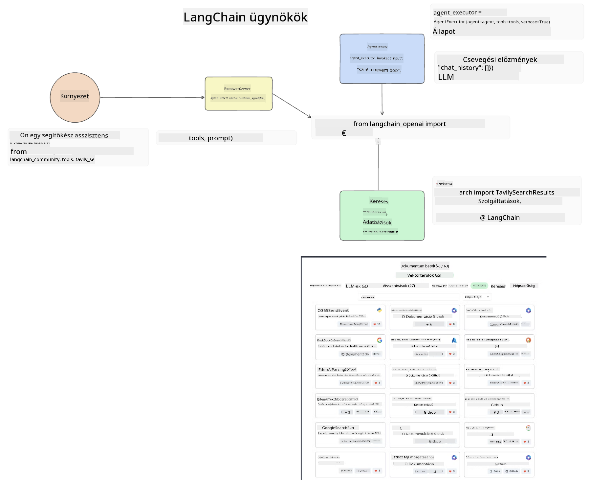
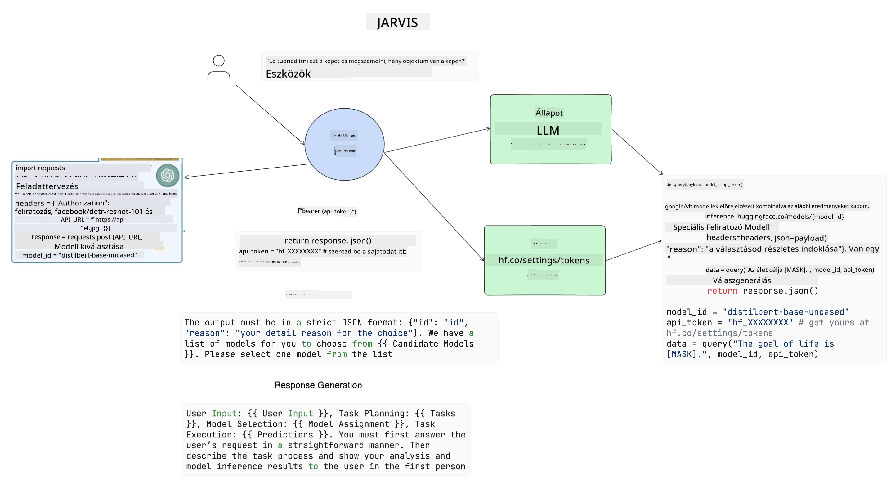

<!--
CO_OP_TRANSLATOR_METADATA:
{
  "original_hash": "11f03c81f190d9cbafd0f977dcbede6c",
  "translation_date": "2025-07-09T17:30:01+00:00",
  "source_file": "17-ai-agents/README.md",
  "language_code": "hu"
}
-->
[](https://aka.ms/gen-ai-lesson17-gh?WT.mc_id=academic-105485-koreyst)

## Bevezetés

Az AI ügynökök izgalmas fejlesztést jelentenek a Generatív MI területén, lehetővé téve, hogy a Nagy Nyelvi Modellek (LLM-ek) a segédektől olyan ügynökökké váljanak, amelyek képesek cselekvéseket végrehajtani. Az AI ügynök keretrendszerek lehetővé teszik a fejlesztők számára, hogy olyan alkalmazásokat hozzanak létre, amelyek hozzáférést biztosítanak az LLM-eknek eszközökhöz és állapotkezeléshez. Ezek a keretrendszerek továbbá növelik az átláthatóságot, így a felhasználók és fejlesztők nyomon követhetik az LLM-ek által tervezett lépéseket, ezáltal javítva a felhasználói élményt.

A lecke a következő területeket fogja lefedni:

- Mi az AI ügynök? – Mit értünk pontosan AI ügynök alatt?
- Négy különböző AI ügynök keretrendszer bemutatása – Miben egyediek?
- AI ügynökök alkalmazása különböző esetekben – Mikor érdemes AI ügynököket használni?

## Tanulási célok

A lecke elvégzése után képes leszel:

- Elmagyarázni, mik az AI ügynökök és hogyan használhatók.
- Megérteni a népszerű AI ügynök keretrendszerek közötti különbségeket.
- Átlátni, hogyan működnek az AI ügynökök, hogy alkalmazásokat építhess velük.

## Mik azok az AI ügynökök?

Az AI ügynökök egy nagyon izgalmas terület a Generatív MI világában. Ezzel az izgalommal néha fogalmi zavarok is járnak. Az egyszerűség és a legtöbb AI ügynökre utaló eszköz befogadása érdekében a következő definíciót használjuk:

Az AI ügynökök lehetővé teszik, hogy a Nagy Nyelvi Modellek (LLM-ek) feladatokat hajtsanak végre azáltal, hogy hozzáférést kapnak egy **állapothoz** és **eszközökhöz**.


Határozzuk meg ezeket a fogalmakat:

**Nagy Nyelvi Modellek** – Ezek a kurzus során említett modellek, mint például a GPT-3.5, GPT-4, Llama-2 stb.

**Állapot** – Ez az a kontextus, amelyben az LLM dolgozik. Az LLM a korábbi műveleteinek és a jelenlegi kontextusnak az ismeretében hozza meg döntéseit a következő lépésekhez. Az AI ügynök keretrendszerek megkönnyítik a fejlesztők számára ennek a kontextusnak a kezelését.

**Eszközök** – Ahhoz, hogy az LLM végrehajtsa a felhasználó által kért és általa megtervezett feladatot, hozzáférésre van szüksége eszközökhöz. Ilyen eszköz lehet például egy adatbázis, egy API, egy külső alkalmazás vagy akár egy másik LLM is!

Ezek a definíciók remélhetőleg jó alapot adnak a továbbiakhoz, amikor megnézzük, hogyan valósítják meg ezeket. Nézzünk meg néhány különböző AI ügynök keretrendszert:

## LangChain ügynökök

A [LangChain Agents](https://python.langchain.com/docs/how_to/#agents?WT.mc_id=academic-105485-koreyst) megvalósítja a fent megadott definíciókat.

Az **állapot** kezelésére egy beépített funkciót használ, az `AgentExecutor`-t. Ez fogadja a definiált `agent`-et és a rendelkezésre álló `tools`-okat.

Az `AgentExecutor` tárolja a beszélgetés előzményeit is, hogy biztosítsa a kontextust.



A LangChain egy [eszköztárat](https://integrations.langchain.com/tools?WT.mc_id=academic-105485-koreyst) kínál, amelyeket be lehet importálni az alkalmazásba, és amelyekhez az LLM hozzáférhet. Ezeket a közösség és a LangChain csapata készíti.

Ezeket az eszközöket definiálhatod, majd átadhatod az `AgentExecutor`-nak.

Az átláthatóság szintén fontos szempont az AI ügynököknél. Fontos, hogy a fejlesztők megértsék, melyik eszközt használja az LLM és miért. Erre fejlesztette ki a LangChain a LangSmith-et.

## AutoGen

A következő AI ügynök keretrendszer, amit bemutatunk, az [AutoGen](https://microsoft.github.io/autogen/?WT.mc_id=academic-105485-koreyst). Az AutoGen fő fókusza a beszélgetések. Az ügynökök egyszerre **beszélgetőképesek** és **testreszabhatók**.

**Beszélgetőképes –** Az LLM-ek képesek elkezdeni és folytatni egy beszélgetést egy másik LLM-mel, hogy végrehajtsanak egy feladatot. Ezt úgy érik el, hogy `AssistantAgents`-eket hoznak létre, és specifikus rendszerüzenetet adnak nekik.

```python

autogen.AssistantAgent( name="Coder", llm_config=llm_config, ) pm = autogen.AssistantAgent( name="Product_manager", system_message="Creative in software product ideas.", llm_config=llm_config, )

```

**Testreszabható** – Az ügynökök nem csak LLM-ek lehetnek, hanem felhasználók vagy eszközök is. Fejlesztőként definiálhatsz például egy `UserProxyAgent`-et, amely a felhasználóval való visszacsatolásért felelős a feladat végrehajtása során. Ez a visszacsatolás folytathatja vagy megszakíthatja a feladat végrehajtását.

```python
user_proxy = UserProxyAgent(name="user_proxy")
```

### Állapot és eszközök

Az állapot változtatásához és kezeléséhez az asszisztens ügynök Python kódot generál a feladat végrehajtásához.

Íme egy példa a folyamatról:


#### LLM rendszerüzenettel definiálva

```python
system_message="For weather related tasks, only use the functions you have been provided with. Reply TERMINATE when the task is done."
```

Ez a rendszerüzenet irányítja az adott LLM-et, hogy mely funkciók relevánsak a feladatához. Ne feledd, az AutoGen-nél több különböző rendszerüzenettel rendelkező AssistantAgent is definiálható.

#### A beszélgetést a felhasználó indítja

```python
user_proxy.initiate_chat( chatbot, message="I am planning a trip to NYC next week, can you help me pick out what to wear? ", )

```

Ez a felhasználói üzenet (user_proxy, ember) indítja el az ügynök folyamatát, hogy feltérképezze, mely funkciókat kell végrehajtania.

#### A funkció végrehajtása

```bash
chatbot (to user_proxy):

***** Suggested tool Call: get_weather ***** Arguments: {"location":"New York City, NY","time_periond:"7","temperature_unit":"Celsius"} ******************************************************** --------------------------------------------------------------------------------

>>>>>>>> EXECUTING FUNCTION get_weather... user_proxy (to chatbot): ***** Response from calling function "get_weather" ***** 112.22727272727272 EUR ****************************************************************

```

Miután az első beszélgetés feldolgozásra került, az ügynök elküldi a javasolt hívandó eszközt. Ebben az esetben ez a `get_weather` nevű funkció. A konfigurációdtól függően ez a funkció automatikusan végrehajtható és az ügynök által olvasható, vagy a felhasználói input alapján fut le.

További [AutoGen kódpéldákat](https://microsoft.github.io/autogen/docs/Examples/?WT.mc_id=academic-105485-koreyst) találsz, hogy mélyebben megismerd a fejlesztést.

## Taskweaver

A következő ügynök keretrendszer, amit megvizsgálunk, a [Taskweaver](https://microsoft.github.io/TaskWeaver/?WT.mc_id=academic-105485-koreyst). Ezt "code-first" ügynöknek nevezik, mert nem csak `string`-ekkel dolgozik, hanem Python DataFrame-ekkel is. Ez különösen hasznos adatfeldolgozási és generálási feladatoknál, például grafikonok és diagramok készítésénél vagy véletlenszám-generálásnál.

### Állapot és eszközök

A beszélgetés állapotának kezelésére a TaskWeaver a `Planner` koncepciót használja. A `Planner` egy LLM, amely a felhasználói kérést felbontja az elvégzendő feladatokra.

A feladatok végrehajtásához a `Planner` hozzáfér egy `Plugins` nevű eszközkészlethez. Ezek lehetnek Python osztályok vagy általános kódértelmezők. Ezeket a plugineket beágyazásként tárolják, hogy az LLM hatékonyabban tudja keresni a megfelelő plugint.


Íme egy példa egy anomáliaészleléshez használt pluginra:

```python
class AnomalyDetectionPlugin(Plugin): def __call__(self, df: pd.DataFrame, time_col_name: str, value_col_name: str):
```

A kód végrehajtás előtt ellenőrzésre kerül. Egy másik kontextuskezelő funkció a Taskweaver-ben az `experience`. Az experience lehetővé teszi, hogy a beszélgetés kontextusa hosszú távon, YAML fájlban tárolódjon. Ez konfigurálható úgy, hogy az LLM idővel javuljon bizonyos feladatokban, ha korábbi beszélgetésekhez hozzáfér.

## JARVIS

Az utolsó ügynök keretrendszer, amit bemutatunk, a [JARVIS](https://github.com/microsoft/JARVIS?tab=readme-ov-file?WT.mc_id=academic-105485-koreyst). Ami egyedivé teszi a JARVIS-t, hogy egy LLM kezeli a beszélgetés `állapotát`, míg a `tools` más AI modellek. Ezek az AI modellek specializáltak, és bizonyos feladatokat végeznek, például objektumfelismerést, átiratkészítést vagy képleírást.



Az LLM, mint általános célú modell, megkapja a felhasználói kérést, azonosítja a konkrét feladatot és a szükséges paramétereket/adatokat a feladat végrehajtásához.

```python
[{"task": "object-detection", "id": 0, "dep": [-1], "args": {"image": "e1.jpg" }}]
```

Az LLM ezután olyan formátumba alakítja a kérést, amelyet a specializált AI modell értelmezni tud, például JSON formátumba. Miután az AI modell visszaküldte az előrejelzését a feladatra, az LLM megkapja a választ.

Ha több modellre van szükség a feladat végrehajtásához, az LLM értelmezi a modellek válaszait, majd összegezve adja vissza a választ a felhasználónak.

Az alábbi példa azt mutatja be, hogyan működik ez, amikor a felhasználó egy kép tárgyainak leírását és számát kéri:

## Feladat

Az AI ügynökök további tanulmányozásához építhetsz AutoGen segítségével:

- Egy alkalmazást, amely egy oktatási startup különböző osztályainak üzleti megbeszélését szimulálja.
- Rendszerüzenetek létrehozását, amelyek segítik az LLM-eket különböző személyiségek és prioritások megértésében, és lehetővé teszik a felhasználónak, hogy új termékötletet mutasson be.
- Az LLM-nek ezután követő kérdéseket kell generálnia az egyes osztályoktól, hogy finomítsa és javítsa az ötletet és a terméket.

## A tanulás itt nem ér véget, folytasd az utat

A lecke elvégzése után nézd meg a [Generatív MI tanulási gyűjteményünket](https://aka.ms/genai-collection?WT.mc_id=academic-105485-koreyst), hogy tovább fejleszd a Generatív MI tudásodat!

**Jogi nyilatkozat**:  
Ez a dokumentum az AI fordító szolgáltatás, a [Co-op Translator](https://github.com/Azure/co-op-translator) segítségével készült. Bár a pontosságra törekszünk, kérjük, vegye figyelembe, hogy az automatikus fordítások hibákat vagy pontatlanságokat tartalmazhatnak. Az eredeti dokumentum az anyanyelvén tekintendő hiteles forrásnak. Kritikus információk esetén professzionális, emberi fordítást javaslunk. Nem vállalunk felelősséget a fordítás használatából eredő félreértésekért vagy téves értelmezésekért.