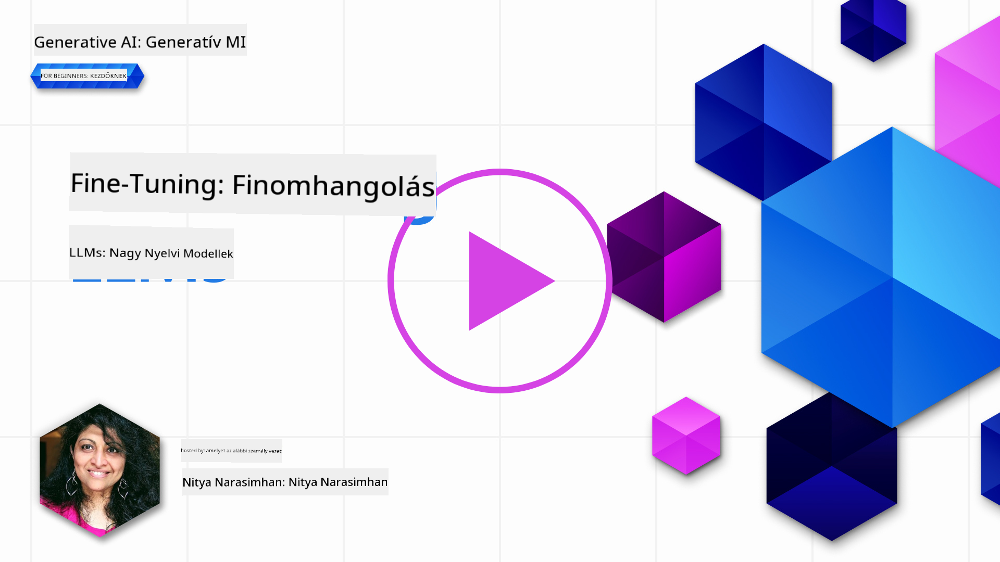

<!--
CO_OP_TRANSLATOR_METADATA:
{
  "original_hash": "68664f7e754a892ae1d8d5e2b7bd2081",
  "translation_date": "2025-05-20T07:56:09+00:00",
  "source_file": "18-fine-tuning/README.md",
  "language_code": "hu"
}
-->

# Az LLM finomhangolása

A generatív AI alkalmazások létrehozása nagy nyelvi modellek segítségével új kihívásokat jelent. Az egyik fő probléma a válaszok minőségének (pontosság és relevancia) biztosítása a modell által generált tartalom esetében egy adott felhasználói kérésre. Az előző leckékben olyan technikákat tárgyaltunk, mint a prompt mérnökség és a visszakereséssel bővített generáció, amelyek a problémát azzal próbálják megoldani, hogy _módosítják a meglévő modell bemeneti kérését_.

A mai leckében egy harmadik technikát, a **finomhangolást** tárgyaljuk, amely a kihívást azzal próbálja megoldani, hogy _újra betanítja magát a modellt_ további adatokkal. Nézzük meg a részleteket.

## Tanulási célok

Ez a lecke bevezeti a finomhangolás fogalmát az előre betanított nyelvi modellek esetében, megvizsgálja ennek az eljárásnak az előnyeit és kihívásait, valamint útmutatást ad arra vonatkozóan, hogy mikor és hogyan érdemes finomhangolást alkalmazni a generatív AI modellek teljesítményének javítása érdekében.

A lecke végére képesnek kell lenned megválaszolni a következő kérdéseket:

- Mi a finomhangolás a nyelvi modellek esetében?
- Mikor és miért hasznos a finomhangolás?
- Hogyan tudom finomhangolni az előre betanított modellt?
- Mik a finomhangolás korlátai?

Készen állsz? Kezdjük el.

## Illusztrált útmutató

Szeretnél átfogó képet kapni arról, amit tárgyalni fogunk, mielőtt belemerülünk a részletekbe? Nézd meg ezt az illusztrált útmutatót, amely bemutatja a tanulási folyamatot ebben a leckében - a finomhangolás alapvető fogalmainak és motivációjának megismerésétől kezdve a folyamat és a legjobb gyakorlatok megértéséig a finomhangolási feladat végrehajtásához. Ez egy izgalmas téma a felfedezéshez, ezért ne felejtsd el megnézni a [Források](./RESOURCES.md?WT.mc_id=academic-105485-koreyst) oldalt, ahol további linkeket találsz az önálló tanulási utad támogatásához!

## Mi a finomhangolás a nyelvi modellek esetében?

Definíció szerint a nagy nyelvi modellek _előre betanítottak_ nagy mennyiségű, különböző forrásokból, köztük az internetről származó szövegeken. Ahogy az előző leckékben megtanultuk, olyan technikákra van szükségünk, mint a _prompt mérnökség_ és a _visszakereséssel bővített generáció_, hogy javítsuk a modell válaszainak minőségét a felhasználói kérdésekre ("prompts").

Egy népszerű prompt mérnökségi technika az, hogy a modellnek több útmutatást adunk arra vonatkozóan, hogy mi várható a válaszban, akár _utasítások_ (explicit útmutatás) adásával, akár _néhány példa_ bemutatásával (implicit útmutatás). Ezt _few-shot tanulásnak_ nevezik, de két korlátja van:

- A modell token korlátai korlátozhatják a megadható példák számát, és csökkenthetik a hatékonyságot.
- A modell token költségei drágává tehetik a példák hozzáadását minden kéréshez, és korlátozhatják a rugalmasságot.

A finomhangolás egy gyakori gyakorlat a gépi tanulási rendszerekben, amikor egy előre betanított modellt új adatokkal újra betanítunk, hogy javítsuk a teljesítményét egy adott feladaton. A nyelvi modellek kontextusában a finomhangolás során a _kiválasztott példák egy készletét használjuk egy adott feladatra vagy alkalmazási területre_, hogy létrehozzunk egy **egyedi modellt**, amely pontosabb és relevánsabb lehet az adott feladathoz vagy területhez. A finomhangolás egyik mellékhatása az is lehet, hogy csökkenti a szükséges példák számát a few-shot tanuláshoz - csökkentve a token használatot és a kapcsolódó költségeket.

## Mikor és miért kell finomhangolni a modelleket?

Ebben a kontextusban, amikor a finomhangolásról beszélünk, a **felügyelt** finomhangolásra utalunk, ahol az újratanítás **új adatok hozzáadásával** történik, amelyek nem voltak részei az eredeti tanító adathalmaznak. Ez eltér az ellenőrizetlen finomhangolási megközelítéstől, ahol a modellt az eredeti adatokon újratanítják, de más hiperparaméterekkel.

A legfontosabb, amit meg kell jegyezni, hogy a finomhangolás egy fejlett technika, amely bizonyos szintű szakértelmet igényel a kívánt eredmények eléréséhez. Ha nem megfelelően hajtják végre, akkor nem biztos, hogy a várt javulásokat hozza, sőt, akár ronthatja is a modell teljesítményét a célzott területen.

Tehát mielőtt megtanulnád, "hogyan" kell finomhangolni a nyelvi modelleket, tudnod kell, "miért" kell ezt az utat választani, és "mikor" kell elkezdeni a finomhangolási folyamatot. Kezdd azzal, hogy felteszed magadnak ezeket a kérdéseket:

- **Felhasználási eset**: Mi a _felhasználási eseted_ a finomhangolásra? Milyen szempontot szeretnél javítani a jelenlegi előre betanított modellen?
- **Alternatívák**: Próbáltál más technikákat a kívánt eredmények eléréséhez? Használd őket összehasonlítási alapként.
  - Prompt mérnökség: Próbálj ki technikákat, mint például a few-shot kérdezés releváns válasz példákkal. Értékeld a válaszok minőségét.
  - Visszakereséssel bővített generáció: Próbáld meg kiegészíteni a kérdéseket a keresési adatok által visszakeresett eredményekkel. Értékeld a válaszok minőségét.
- **Költségek**: Azonosítottad a finomhangolás költségeit?
  - Hangolhatóság - elérhető-e az előre betanított modell finomhangolásra?
  - Erőfeszítés - a tanító adatok előkészítésére, a modell értékelésére és finomítására.
  - Számítás - a finomhangolási feladatok futtatására és a finomhangolt modell telepítésére
  - Adatok - hozzáférés elegendő minőségű példákhoz a finomhangolási hatás érdekében
- **Előnyök**: Megerősítetted a finomhangolás előnyeit?
  - Minőség - túlszárnyalta-e a finomhangolt modell az alapmodellt?
  - Költség - csökkenti-e a token használatot az egyszerűsített kérdésekkel?
  - Kiterjeszthetőség - újra felhasználható-e az alapmodell új területekre?

Ezekre a kérdésekre válaszolva el tudod dönteni, hogy a finomhangolás megfelelő megközelítés-e a felhasználási esetedhez. Ideális esetben a megközelítés csak akkor érvényes, ha az előnyök meghaladják a költségeket. Miután eldöntötted, hogy folytatod, itt az ideje, hogy gondolkodj azon, _hogyan_ tudod finomhangolni az előre betanított modellt.

Szeretnél több betekintést kapni a döntéshozatali folyamatba? Nézd meg a [Finomhangolni vagy nem finomhangolni](https://www.youtube.com/watch?v=0Jo-z-MFxJs) című videót.

## Hogyan tudjuk finomhangolni az előre betanított modellt?

Az előre betanított modell finomhangolásához szükséged lesz:

- egy előre betanított modellre, amelyet finomhangolhatsz
- egy adathalmazra, amelyet a finomhangoláshoz használhatsz
- egy képzési környezetre a finomhangolási feladat futtatásához
- egy hosztoló környezetre a finomhangolt modell telepítéséhez

## Finomhangolás akcióban

Az alábbi források lépésről-lépésre bemutatják, hogyan végezhetsz el egy valós példát egy kiválasztott modell és egy gondosan összeállított adathalmaz segítségével. A bemutatók végrehajtásához szükséged lesz egy fiókra a konkrét szolgáltatónál, valamint hozzáférésre a releváns modellhez és adathalmazokhoz.

| Szolgáltató  | Bemutató                                                                                                                                                                       | Leírás                                                                                                                                                                                                                                                                                                                                                                                                                        |
| ------------ | ------------------------------------------------------------------------------------------------------------------------------------------------------------------------------ | ---------------------------------------------------------------------------------------------------------------------------------------------------------------------------------------------------------------------------------------------------------------------------------------------------------------------------------------------------------------------------------------------------------------------------------- |
| OpenAI       | [Hogyan finomhangoljuk a chat modelleket](https://github.com/openai/openai-cookbook/blob/main/examples/How_to_finetune_chat_models.ipynb?WT.mc_id=academic-105485-koreyst)                | Tanuld meg, hogyan finomhangolj egy `gpt-35-turbo` modellt egy adott területre ("recept asszisztens") azzal, hogy előkészíted a tanító adatokat, futtatod a finomhangolási feladatot, és használod a finomhangolt modellt az előrejelzéshez.                                                                                                                                                                                                                                              |
| Azure OpenAI | [GPT 3.5 Turbo finomhangolási bemutató](https://learn.microsoft.com/azure/ai-services/openai/tutorials/fine-tune?tabs=python-new%2Ccommand-line?WT.mc_id=academic-105485-koreyst) | Tanuld meg, hogyan finomhangolj egy `gpt-35-turbo-0613` modellt **az Azure-on** azzal, hogy lépéseket teszel a tanító adatok létrehozására és feltöltésére, futtatod a finomhangolási feladatot. Telepítsd és használd az új modellt.                                                                                                                                                                                                                                                                 |
| Hugging Face | [LLM-ek finomhangolása a Hugging Face-szel](https://www.philschmid.de/fine-tune-llms-in-2024-with-trl?WT.mc_id=academic-105485-koreyst)                                               | Ez a blogbejegyzés bemutatja, hogyan finomhangolj egy _nyílt LLM-et_ (például: `CodeLlama 7B`) a [transformers](https://huggingface.co/docs/transformers/index?WT.mc_id=academic-105485-koreyst) könyvtár és a [Transformer Reinforcement Learning (TRL)](https://huggingface.co/docs/trl/index?WT.mc_id=academic-105485-koreyst]) segítségével, nyílt [adathalmazok](https://huggingface.co/docs/datasets/index?WT.mc_id=academic-105485-koreyst) felhasználásával a Hugging Face-en. |
|              |                                                                                                                                                                                |                                                                                                                                                                                                                                                                                                                                                                                                                                    |
| 🤗 AutoTrain | [LLM-ek finomhangolása az AutoTrain-nal](https://github.com/huggingface/autotrain-advanced/?WT.mc_id=academic-105485-koreyst)                                                         | Az AutoTrain (vagy AutoTrain Advanced) egy Python könyvtár, amelyet a Hugging Face fejlesztett ki, és amely lehetővé teszi a finomhangolást sokféle feladatra, beleértve az LLM finomhangolást. Az AutoTrain egy kódmentes megoldás, és a finomhangolás elvégezhető saját felhőben, a Hugging Face Spaces-en vagy helyileg. Támogatja mind a webalapú GUI-t, mind a CLI-t, valamint a yaml konfigurációs fájlokkal történő képzést.                                                                               |
|              |                                                                                                                                                                                |                                                                                                                                                                                                                                                                                                                                                                                                                                    |

## Feladat

Válassz ki egyet a fenti bemutatók közül, és dolgozd végig őket. _Lehet, hogy ezeknek a bemutatóknak egy változatát Jupyter Notebookokban is megismételjük ebben a repóban, csak hivatkozási célból. Kérjük, közvetlenül az eredeti forrásokat használd, hogy a legfrissebb verziókat kapd meg_.

## Remek munka! Folytasd a tanulást.

A lecke befejezése után nézd meg a [Generatív AI Tanulási gyűjteményünket](https://aka.ms/genai-collection?WT.mc_id=academic-105485-koreyst), hogy tovább fejleszd a Generatív AI tudásodat!

Gratulálunk!! Befejezted a kurzus v2 sorozatának utolsó leckéjét! Ne hagyd abba a tanulást és az építést. **Nézd meg a [FORRÁSOK](RESOURCES.md?WT.mc_id=academic-105485-koreyst) oldalt, ahol további javaslatokat találsz erre a témára.

A v1 sorozat leckéi is frissültek több feladattal és koncepcióval. Szánj egy percet a tudásod felfrissítésére - és kérjük, [oszd meg kérdéseidet és visszajelzéseidet](https://github.com/microsoft/generative-ai-for-beginners/issues?WT.mc_id=academic-105485-koreyst), hogy segíts nekünk javítani ezeket a leckéket a közösség számára.

**Jogi nyilatkozat**:  
Ezt a dokumentumot az [Co-op Translator](https://github.com/Azure/co-op-translator) AI fordítási szolgáltatás segítségével fordítottuk le. Bár törekszünk a pontosságra, kérjük, vegye figyelembe, hogy az automatikus fordítások hibákat vagy pontatlanságokat tartalmazhatnak. Az eredeti dokumentum az anyanyelvén tekintendő hiteles forrásnak. Kritikus információk esetén javasolt a professzionális emberi fordítás. Nem vállalunk felelősséget a fordítás használatából eredő félreértésekért vagy félreértelmezésekért.