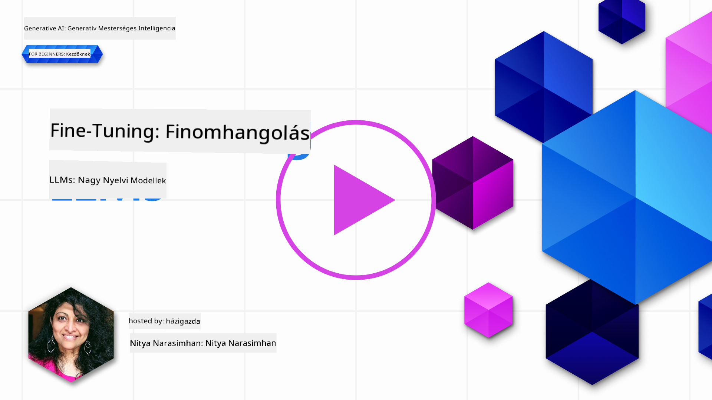
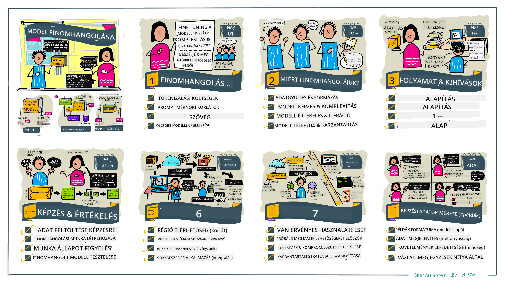

<!--
CO_OP_TRANSLATOR_METADATA:
{
  "original_hash": "68664f7e754a892ae1d8d5e2b7bd2081",
  "translation_date": "2025-06-26T00:49:35+00:00",
  "source_file": "18-fine-tuning/README.md",
  "language_code": "hu"
}
-->

# Finomhangolás az LLM-edhez

A nagy nyelvi modellek használata generatív AI alkalmazások építéséhez új kihívásokkal jár. Egy kulcsfontosságú kérdés az, hogy hogyan biztosítsuk a válaszok minőségét (pontosság és relevancia) a modell által generált tartalomban egy adott felhasználói kérésre. Korábbi leckékben olyan technikákat tárgyaltunk, mint a prompt mérnökség és a visszakeresés-alapú generáció, amelyek megpróbálják megoldani a problémát a meglévő modell _bemeneti promptjának módosításával_.

A mai leckében egy harmadik technikát, a **finomhangolást** tárgyaljuk, amely megpróbálja megoldani a kihívást a modell _újratovábbképzésével_ további adatokkal. Merüljünk el a részletekben.

## Tanulási célok

Ez a lecke bevezeti a finomhangolás fogalmát az előképzett nyelvi modellek esetében, feltárja ennek az eljárásnak az előnyeit és kihívásait, valamint útmutatást ad arra vonatkozóan, mikor és hogyan használjuk a finomhangolást a generatív AI modellek teljesítményének javítására.

A lecke végére képesnek kell lenned válaszolni a következő kérdésekre:

- Mi a finomhangolás a nyelvi modellek esetében?
- Mikor és miért hasznos a finomhangolás?
- Hogyan tudok finomhangolni egy előképzett modellt?
- Melyek a finomhangolás korlátai?

Készen állsz? Vágjunk bele.

## Illusztrált útmutató

Szeretnél átfogó képet kapni arról, amit tárgyalni fogunk, mielőtt elmélyednénk a részletekben? Nézd meg ezt az illusztrált útmutatót, amely leírja a tanulási folyamatot ebben a leckében - a finomhangolás alapfogalmainak és motivációjának megismerésétől a finomhangolási feladat végrehajtásának folyamatának és legjobb gyakorlatainak megértéséig. Ez egy izgalmas téma a felfedezésre, ezért ne felejtsd el megnézni a [Források](./RESOURCES.md?WT.mc_id=academic-105485-koreyst) oldalt, ahol további linkeket találsz az önálló tanulási utad támogatására!

## Mi a finomhangolás a nyelvi modellek esetében?

Definíció szerint a nagy nyelvi modellek _előképzettek_, azaz nagy mennyiségű szövegen lettek kiképezve, amelyet különböző forrásokból, többek között az internetről gyűjtöttek. Ahogy azt korábbi leckékben megtanultuk, olyan technikákra van szükségünk, mint a _prompt mérnökség_ és a _visszakeresés-alapú generáció_, hogy javítsuk a modell válaszainak minőségét a felhasználó kérdéseire ("promptok").

Egy népszerű prompt mérnökségi technika magában foglalja, hogy a modellnek több útmutatást adunk arról, hogy mi várható a válaszban, akár _utasítások_ (explicit útmutatás) megadásával, akár _néhány példa_ bemutatásával (implicit útmutatás). Ezt _kevés példás tanulásnak_ nevezik, de két korlátja van:

- A modell token korlátai korlátozhatják a megadható példák számát, és korlátozhatják a hatékonyságot.
- A modell token költségei megdrágíthatják a példák hozzáadását minden prompthoz, és korlátozhatják a rugalmasságot.

A finomhangolás egy gyakori gyakorlat a gépi tanulási rendszerekben, ahol egy előképzett modellt újra kiképezünk új adatokkal, hogy javítsuk a teljesítményét egy adott feladaton. A nyelvi modellek kontextusában az előképzett modellt finomhangolhatjuk _egy adott feladat vagy alkalmazási terület kurált példakészletével_, hogy létrehozzunk egy **egyedi modellt**, amely pontosabb és relevánsabb lehet az adott feladat vagy terület számára. A finomhangolás egy mellékhatása lehet, hogy csökkentheti a kevés példás tanuláshoz szükséges példák számát - csökkentve a token használatot és a kapcsolódó költségeket.

## Mikor és miért érdemes finomhangolni a modelleket?

Ebben a kontextusban, amikor a finomhangolásról beszélünk, a **felügyelt** finomhangolásra utalunk, ahol az újratovábbképzés **új adatok hozzáadásával** történik, amelyek nem voltak részei az eredeti képzési adatbázisnak. Ez különbözik az önálló finomhangolási megközelítéstől, ahol a modellt az eredeti adatokon képezzük újra, de eltérő hiperparaméterekkel.

A kulcsfontosságú dolog, amit meg kell jegyezni, hogy a finomhangolás egy fejlett technika, amely bizonyos szintű szakértelmet igényel a kívánt eredmények eléréséhez. Ha helytelenül végzik, előfordulhat, hogy nem hozza meg a várható javulásokat, és akár ronthatja is a modell teljesítményét az általad célzott területen.

Tehát, mielőtt megtanulnád, hogyan kell finomhangolni a nyelvi modelleket, tudnod kell, miért érdemes ezt az utat választani, és mikor érdemes elkezdeni a finomhangolás folyamatát. Kezdj azzal, hogy felteszed magadnak ezeket a kérdéseket:

- **Felhasználási eset**: Mi a _felhasználási eseted_ a finomhangoláshoz? Milyen aspektusát szeretnéd javítani az aktuális előképzett modellnek?
- **Alternatívák**: Kipróbáltál már _más technikákat_ a kívánt eredmények eléréséhez? Használd őket a kiindulási alap létrehozásához összehasonlítás céljából.
  - Prompt mérnökség: Próbálj ki technikákat, mint a kevés példás promptolás releváns prompt válaszok példáival. Értékeld a válaszok minőségét.
  - Visszakeresés-alapú generáció: Próbáld meg kiegészíteni a promptokat a lekérdezési eredményekkel, amelyeket az adataid keresésével nyertél. Értékeld a válaszok minőségét.
- **Költségek**: Azonosítottad a finomhangolás költségeit?
  - Hangolhatóság - elérhető-e az előképzett modell finomhangolásra?
  - Erőfeszítés - a képzési adatok előkészítésére, a modell értékelésére és finomítására.
  - Számítás - a finomhangolási feladatok futtatására, és a finomhangolt modell telepítésére
  - Adat - hozzáférés elegendő minőségi példához a finomhangolás hatásához
- **Előnyök**: Megerősítetted a finomhangolás előnyeit?
  - Minőség - felülmúlta-e a finomhangolt modell a kiindulási alapot?
  - Költség - csökkenti-e a token használatot a promptok egyszerűsítésével?
  - Kiterjeszthetőség - újra tudod-e használni az alapmodellt új területekre?

Ezekre a kérdésekre válaszolva el kell tudnod dönteni, hogy a finomhangolás megfelelő megközelítés-e a felhasználási esetedhez. Ideális esetben a megközelítés csak akkor érvényes, ha az előnyök felülmúlják a költségeket. Miután eldöntötted, hogy folytatod, itt az ideje, hogy elgondolkodj azon, _hogyan_ tudod finomhangolni az előképzett modellt.

Szeretnél további betekintést nyerni a döntéshozatali folyamatba? Nézd meg [Finomhangolni vagy nem finomhangolni](https://www.youtube.com/watch?v=0Jo-z-MFxJs)

## Hogyan tudjuk finomhangolni az előképzett modellt?

Az előképzett modell finomhangolásához szükséged lesz:

- egy előképzett modellre, amit finomhangolhatsz
- egy adathalmazra, amit finomhangoláshoz használhatsz
- egy képzési környezetre a finomhangolási feladat futtatásához
- egy hosztoló környezetre a finomhangolt modell telepítéséhez

## Finomhangolás gyakorlatban

Az alábbi források lépésről lépésre bemutatják, hogyan lehet egy valódi példát végigjárni egy kiválasztott modell és egy kurált adathalmaz segítségével. Ezeknek a bemutatóknak a végigjárásához szükséged lesz egy fiókra a konkrét szolgáltatónál, valamint hozzáférésre a releváns modellhez és adathalmazokhoz.

| Szolgáltató  | Bemutató                                                                                                                                                                       | Leírás                                                                                                                                                                                                                                                                                                                                                                                                                        |
| ------------ | ------------------------------------------------------------------------------------------------------------------------------------------------------------------------------ | ---------------------------------------------------------------------------------------------------------------------------------------------------------------------------------------------------------------------------------------------------------------------------------------------------------------------------------------------------------------------------------------------------------------------------------- |
| OpenAI       | [Hogyan finomhangoljuk a chat modelleket](https://github.com/openai/openai-cookbook/blob/main/examples/How_to_finetune_chat_models.ipynb?WT.mc_id=academic-105485-koreyst)                | Tanulj meg finomhangolni egy `gpt-35-turbo` modellt egy adott területre ("recept asszisztens") úgy, hogy előkészíted a képzési adatokat, futtatod a finomhangolási feladatot, és a finomhangolt modellt használod következtetésre.                                                                                                                                                                                                                                              |
| Azure OpenAI | [GPT 3.5 Turbo finomhangolási bemutató](https://learn.microsoft.com/azure/ai-services/openai/tutorials/fine-tune?tabs=python-new%2Ccommand-line?WT.mc_id=academic-105485-koreyst) | Tanulj meg finomhangolni egy `gpt-35-turbo-0613` modellt **az Azure-on** úgy, hogy lépéseket teszel a képzési adatok létrehozására és feltöltésére, futtatod a finomhangolási feladatot. Telepítsd és használd az új modellt.                                                                                                                                                                                                                                                                 |
| Hugging Face | [Finomhangolás LLM-ekkel a Hugging Face segítségével](https://www.philschmid.de/fine-tune-llms-in-2024-with-trl?WT.mc_id=academic-105485-koreyst)                                               | Ez a blogbejegyzés végigvezet egy _nyílt LLM_ (pl. `CodeLlama 7B`) finomhangolásán a [transformers](https://huggingface.co/docs/transformers/index?WT.mc_id=academic-105485-koreyst) könyvtár és a [Transformer Reinforcement Learning (TRL)](https://huggingface.co/docs/trl/index?WT.mc_id=academic-105485-koreyst]) segítségével, nyílt [adathalmazokkal](https://huggingface.co/docs/datasets/index?WT.mc_id=academic-105485-koreyst) a Hugging Face-en. |
|              |                                                                                                                                                                                |                                                                                                                                                                                                                                                                                                                                                                                                                                    |
| 🤗 AutoTrain | [Finomhangolás LLM-ekkel az AutoTrain segítségével](https://github.com/huggingface/autotrain-advanced/?WT.mc_id=academic-105485-koreyst)                                                         | Az AutoTrain (vagy AutoTrain Advanced) egy python könyvtár, amelyet a Hugging Face fejlesztett ki, és amely lehetővé teszi a finomhangolást sok különböző feladatra, beleértve az LLM finomhangolást is. Az AutoTrain egy kódmentes megoldás, és a finomhangolás elvégezhető saját felhőben, a Hugging Face Spaces-en vagy helyileg. Támogatja mind a web-alapú GUI-t, a CLI-t, mind a yaml konfigurációs fájlokkal történő képzést.                                                                               |
|              |                                                                                                                                                                                |                                                                                                                                                                                                                                                                                                                                                                                                                                    |

## Feladat

Válassz ki egyet a fenti bemutatók közül, és járd végig őket. _Elképzelhető, hogy ezeknek a bemutatóknak egy változatát replikáljuk a Jupyter Notebooks-ban ebben a repóban csak referenciaként. Kérlek, használd közvetlenül az eredeti forrásokat, hogy megkapd a legfrissebb verziókat_.

## Nagyszerű munka! Folytasd a tanulást.

Miután befejezted ezt a leckét, nézd meg a [Generatív AI Tanulási gyűjteményünket](https://aka.ms/genai-collection?WT.mc_id=academic-105485-koreyst), hogy tovább fejleszd a Generatív AI tudásodat!

Gratulálunk!! Teljesítetted a v2 sorozat utolsó leckéjét ebben a kurzusban! Ne hagyd abba a tanulást és az építést. **Nézd meg a [FORRÁSOK](RESOURCES.md?WT.mc_id=academic-105485-koreyst) oldalt, ahol további javaslatokat találsz csak erre a témára.

Az v1 sorozat leckéi is frissítve lettek több feladattal és fogalommal. Tehát szánj egy percet a tudásod frissítésére - és kérlek, [oszd meg kérdéseidet és visszajelzéseidet](https://github.com/microsoft/generative-ai-for-beginners/issues?WT.mc_id=academic-105485-koreyst), hogy segíts nekünk javítani ezeket a leckéket a közösség számára.

**Jogi nyilatkozat**:  
Ezt a dokumentumot AI fordítási szolgáltatással, a [Co-op Translator](https://github.com/Azure/co-op-translator) segítségével fordították le. Bár törekszünk a pontosságra, kérjük, vegye figyelembe, hogy az automatikus fordítások hibákat vagy pontatlanságokat tartalmazhatnak. Az eredeti dokumentum saját nyelvén tekintendő a hiteles forrásnak. Kritikus információk esetén javasolt a professzionális emberi fordítás. Nem vállalunk felelősséget a fordítás használatából eredő félreértésekért vagy félremagyarázásokért.