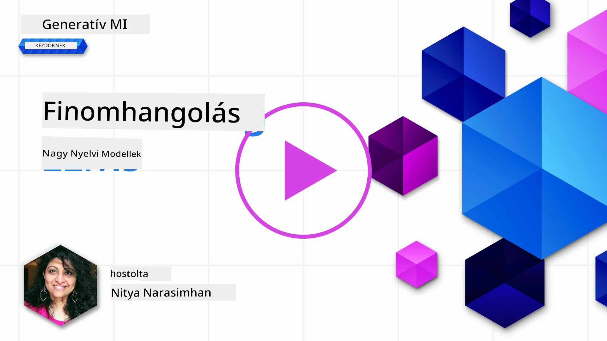
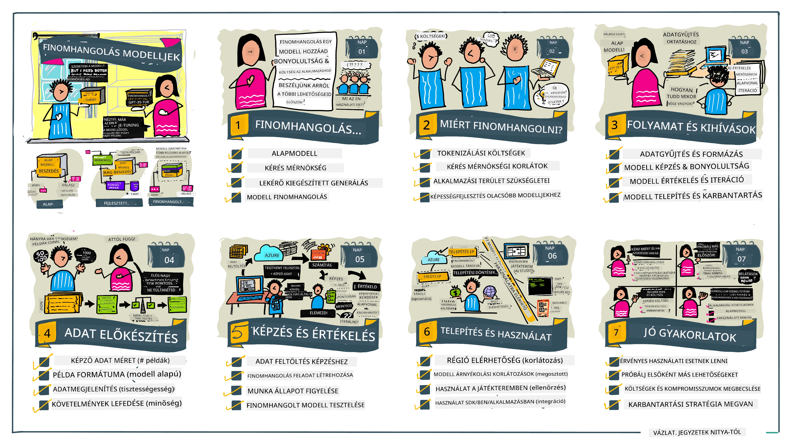

# LLM finomhangolása

Nagy nyelvi modellek használata generatív MI alkalmazások építéséhez új kihívásokkal jár. Egy kulcskérdés a válaszok minőségének (pontosság és relevancia) biztosítása a modell által generált tartalomban egy adott felhasználói kérésre. Az előző leckékben olyan technikákat tárgyaltunk, mint a prompttervezés és a visszakereséssel kiegészített generálás, amelyek megpróbálják megoldani a problémát azzal, hogy _módosítják a prompt bemenetet_ a meglévő modellhez.

A mai leckében egy harmadik technikát, a **finomhangolást** tárgyaljuk, amely a kihívást úgy próbálja megoldani, hogy _magát a modellt újratanítja_ további adatokkal. Merüljünk el a részletekben.

## Tanulási célok

Ez a lecke bevezeti a finomhangolás fogalmát az előre betanított nyelvi modelleknél, feltárja ennek az megközelítésnek az előnyeit és kihívásait, valamint útmutatást ad arra, mikor és hogyan érdemes finomhangolást alkalmazni a generatív MI modellek teljesítményének javítása érdekében.

A lecke végére képesnek kell lenned megválaszolni a következő kérdéseket:

- Mi az a finomhangolás nyelvi modellek esetében?
- Mikor és miért hasznos a finomhangolás?
- Hogyan tudok egy előre betanított modellt finomhangolni?
- Milyen korlátai vannak a finomhangolásnak?

Készen állsz? Kezdjük el.

## Illusztrált útmutató

Szeretnéd áttekinteni a leckében érintett fő témákat, mielőtt belevágnánk? Tekintsd meg ezt az illusztrált útmutatót, amely bemutatja a tanulási utat ebben a leckében – a finomhangolás alapfogalmainak és motivációjának megismerésétől a folyamat és a legjobb gyakorlatok megértéséig a finomhangolási feladat végrehajtásához. Ez egy izgalmas téma a felfedezéshez, ezért ne felejtsd el megnézni a [Források](./RESOURCES.md?WT.mc_id=academic-105485-koreyst) oldalt további linkekért, amelyek támogatják az önálló tanulási utadat!

## Mi az a finomhangolás nyelvi modelleknél?

Definíció szerint a nagy nyelvi modellek _előre betanítottak_ nagy mennyiségű, változatos internetes forrásokból származó szövegen. Ahogy az előző leckékből megtanultuk, szükségünk van olyan technikákra, mint a _prompttervezés_ és a _visszakereséssel kiegészített generálás_, hogy javítsuk a modell válaszainak minőségét a felhasználó kérdéseire („promptonokra”).

Egy népszerű prompttervezési technika, hogy a modellnek több útmutatást adunk arról, mit várunk el a válaszból, akár _utasításokkal_ (explicit útmutatás), akár _néhány példával való bemutatással_ (implicit útmutatás). Ezt hívjuk _few-shot tanulásnak_, de két korlátja van:

- A modell tokenkorlátai megszabhatják, hány példát tudsz adni, és korlátozzák a hatékonyságot.
- A modell tokenköltségei megdrágíthatják minden promptba a példák hozzáadását és korlátozzák a rugalmasságot.

A finomhangolás egy gyakori módszer a gépi tanulásban, amikor egy előre betanított modellt új adatokkal újratanítunk, hogy javítsuk a teljesítményét egy adott feladaton. A nyelvi modellek esetében képesek vagyunk finomhangolni az előre betanított modellt _egy előkészített példa-készlettel egy adott feladathoz vagy alkalmazási területhez_, hogy egy **egyedi modellt** hozzunk létre, amely pontosabb és relevánsabb lehet az adott feladatra vagy területre. A finomhangolás további előnye, hogy csökkentheti a few-shot tanuláshoz szükséges példák számát – így csökkenti a tokenfelhasználást és a kapcsolódó költségeket.

## Mikor és miért érdemes finomhangolni a modelleket?

Ebben a kontextusban, amikor a finomhangolásról beszélünk, akkor **felügyelt finomhangolásról** beszélünk, ahol az újratanítás az **új adatok hozzáadásával** történik, amelyek nem voltak részei az eredeti tanító adathalmaznak. Ez eltér az önfelügyelt finomhangolástól, ahol a modellt az eredeti adatokon újratanítják, de más hiperparaméterekkel.

A legfontosabb, hogy tartsd szem előtt: a finomhangolás fejlett technika, amely bizonyos szintű szakértelmet igényel a kívánt eredmények eléréséhez. Ha nem megfelelően végzed, nem hozhatja meg a várt javulásokat, vagy akár ronthatja a modell teljesítményét a célzott területeden.

Tehát mielőtt megtanulnád, „hogyan” finomhangoljuk a nyelvi modelleket, tudnod kell, „miért” érdemes ezt az utat választani, és „mikor” kezdd el a finomhangolási folyamatot. Kezdd azzal, hogy feltetted magadnak ezeket a kérdéseket:

- **Felhasználási eset**: Mi a te _felhasználási eseted_ a finomhangoláshoz? A jelenlegi előre betanított modell mely aspektusát szeretnéd javítani?
- **Alternatívák**: Próbáltál-e _más technikákat_ a kívánt eredmények elérésére? Használd őket kiindulópontnak az összehasonlításhoz.
  - Prompttervezés: Próbálj ki olyan technikákat, mint a few-shot prompting releváns promptválaszok példáival. Értékeld a válaszok minőségét.
  - Visszakereséssel kiegészített generálás: Próbálj meg bővíteni promtokat lekérdezési eredményekkel, amelyeket adatok keresésével nyertél ki. Értékeld a válaszok minőségét.
- **Költségek**: Azonosítottad a finomhangolás költségeit?
  - Finomhangolhatóság - elérhető-e az előre betanított modell finomhangolásra?
  - Erőfeszítés - tanító adatok előkészítése, kiértékelés és modell finomítása.
  - Számítási kapacitás - a finomhangolási feladatok futtatásához és a finomhangolt modell telepítéséhez.
  - Adat - elegendő mennyiségű minőségi példa a finomhangoláshoz szükséges hatás eléréséhez.
- **Előnyök**: Megerősítetted a finomhangolás előnyeit?
  - Minőség - a finomhangolt modell felülmúlta a kiindulási modellt?
  - Költség - csökkenti-e a tokenfelhasználást azzal, hogy egyszerűbb promtokat enged?
  - Kiterjeszthetőség - az alapmodellt új területekre is át tudod alakítani?

E kérdések megválaszolásával eldöntheted, hogy a finomhangolás-e a megfelelő megközelítés az adott felhasználási esethez. Ideálisan ez az út akkor érvényes, ha az előnyök meghaladják a költségeket. Ha úgy döntesz, hogy folytatod, ideje elgondolkodni azon, _hogyan_ finomhangolhatod az előre betanított modellt.

További betekintésért a döntési folyamatba nézd meg a [Finomhangoljunk vagy ne finomhangoljunk](https://www.youtube.com/watch?v=0Jo-z-MFxJs) videót.

## Hogyan tudunk finomhangolni egy előre betanított modellt?

A finomhangoláshoz szükséges:

- egy előre betanított modell, amelyet finomhangolhatsz
- egy adathalmaz a finomhangoláshoz
- egy környezet a finomhangolási feladat futtatásához
- egy hoszting környezet a finomhangolt modell telepítéséhez

## Finomhangolás a gyakorlatban

Az alábbi források lépésről lépésre vezetnek végig egy valós példán egy kiválasztott modellt és előkészített adathalmazt használva. Ezek a bemutatók használatához szükséged lesz fiókra a konkrét szolgáltatónál, valamint hozzáférésre a vonatkozó modellhez és adatokhoz.

| Szolgáltató | Bemutató                                                                                                                                                                        | Leírás                                                                                                                                                                                                                                                                                                                                                                                                                         |
| ------------ | ------------------------------------------------------------------------------------------------------------------------------------------------------------------------------ | -------------------------------------------------------------------------------------------------------------------------------------------------------------------------------------------------------------------------------------------------------------------------------------------------------------------------------------------------------------------------------------------------------------------------------- |
| OpenAI       | [Hogyan finomhangoljuk a chat modelleket](https://github.com/openai/openai-cookbook/blob/main/examples/How_to_finetune_chat_models.ipynb?WT.mc_id=academic-105485-koreyst)      | Tanuld meg, hogyan finomhangolj egy `gpt-35-turbo` modellt egy adott területre („recept asszisztens”) tanító adatok előkészítésével, finomhangolási feladat futtatásával és a finomhangolt modell lekérdezésével.                                                                                                                                                                                                                  |
| Azure OpenAI | [GPT 3.5 Turbo finomhangolási bemutató](https://learn.microsoft.com/azure/ai-services/openai/tutorials/fine-tune?tabs=python-new%2Ccommand-line&WT.mc_id=academic-105485-koreyst) | Tanuld meg, hogyan finomhangolj egy `gpt-35-turbo-0613` modellt **Azure-on**: lépésről lépésre adathalmaz készítése és feltöltése, finomhangolás futtatása. Az új modell telepítése és használata.                                                                                                                                                                                                                                 |
| Hugging Face | [LLM-ek finomhangolása Hugging Face segítségével](https://www.philschmid.de/fine-tune-llms-in-2024-with-trl?WT.mc_id=academic-105485-koreyst)                                  | Ez a blogbejegyzés bemutatja egy _nyílt LLM_ (pl.: `CodeLlama 7B`) finomhangolását a [transformers](https://huggingface.co/docs/transformers/index?WT.mc_id=academic-105485-koreyst) könyvtár és a [Transformer Reinforcement Learning (TRL)](https://huggingface.co/docs/trl/index?WT.mc_id=academic-105485-koreyst) segítségével, nyílt [adatkészleteken](https://huggingface.co/docs/datasets/index?WT.mc_id=academic-105485-koreyst) a Hugging Face-en. |
|              |                                                                                                                                                                                |                                                                                                                                                                                                                                                                                                                                                                                                                                 |
| 🤗 AutoTrain | [LLM finomhangolás az AutoTrain-nal](https://github.com/huggingface/autotrain-advanced/?WT.mc_id=academic-105485-koreyst)                                                     | Az AutoTrain (vagy AutoTrain Advanced) egy python könyvtár a Hugging Face-től, amely lehetővé teszi sokféle feladat finomhangolását, beleértve az LLM finomhangolást is. Az AutoTrain egy kód nélküli megoldás, és a finomhangolás történhet a saját felhődből, Hugging Face Spaces-en vagy helyileg. Támogatja a webes GUI-t, parancssori eszközt és yaml konfigurációs fájlokat is.                                                                               |
|              |                                                                                                                                                                                |                                                                                                                                                                                                                                                                                                                                                                                                                                 |
| 🦥 Unsloth   | [LLM finomhangolás Unsloth segítségével](https://github.com/unslothai/unsloth)                                                                                                | Az Unsloth egy nyílt forrású keretrendszer, amely támogatja az LLM finomhangolását és megerősítéses tanulást (RL). Az Unsloth egyszerűsíti a helyi tréninget, értékelést és telepítést előre elkészített [notebookokkal](https://github.com/unslothai/notebooks). Támogatja a szöveg-beszéd konverziót (TTS), BERT és multimodális modelleket is. Kezdéshez olvasd el lépésről lépésre útmutatóját: [Finomhangolás LLM-ekhez](https://docs.unsloth.ai/get-started/fine-tuning-llms-guide).            |
|              |                                                                                                                                                                                |                                                                                                                                                                                                                                                                                                                                                                                                                                 |
## Házi feladat

Válassz ki egy a fenti bemutatók közül, és dolgozd végig. _Ezekből esetleg készítünk egy verziót Jupyter notebookokban ebben a repóban csak referencia célból. Kérjük, az eredeti forrásokat használd a legfrissebb verziókért._

## Szép munka! Folytasd a tanulást.

A lecke elvégzése után nézd meg a [Generatív MI tanulási gyűjteményünket](https://aka.ms/genai-collection?WT.mc_id=academic-105485-koreyst), hogy tovább fejleszd generatív MI ismereteidet!

Gratulálunk!! Teljesítetted a tanfolyam v2-es sorozatának utolsó leckéjét! Ne állj meg a tanulásban és az alkotásban. **Nézd meg a [FORRÁSOK](RESOURCES.md?WT.mc_id=academic-105485-koreyst) oldalt további tippekért kizárólag erre a témára.**

A v1-es leckesorozatunk is frissült több feladattal és koncepcióval, szóval szánj egy percet, hogy felfrissítsd tudásod – és kérjük, [oszd meg kérdéseidet és visszajelzéseidet](https://github.com/microsoft/generative-ai-for-beginners/issues?WT.mc_id=academic-105485-koreyst), hogy segíts nekünk fejleszteni ezeket a leckéket a közösség számára.

---

<!-- CO-OP TRANSLATOR DISCLAIMER START -->
**Jogi nyilatkozat**:
Ezt a dokumentumot az AI fordítási szolgáltatás [Co-op Translator](https://github.com/Azure/co-op-translator) használatával fordítottuk. Bár igyekszünk pontos fordítást biztosítani, kérjük, vegye figyelembe, hogy az automatizált fordítások hibákat vagy pontatlanságokat tartalmazhatnak. Az eredeti dokumentum a saját nyelvén tekintendő hiteles forrásnak. Fontos információk esetén profi emberi fordítást ajánlunk. Nem vállalunk felelősséget az ebből eredő félreértésekért vagy téves értelmezésekért.
<!-- CO-OP TRANSLATOR DISCLAIMER END -->