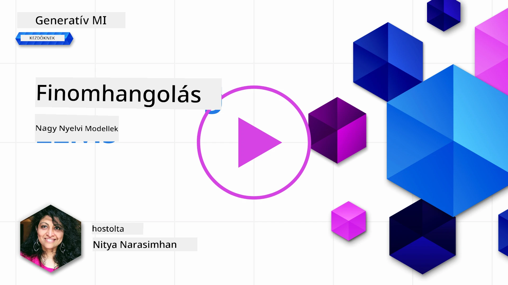
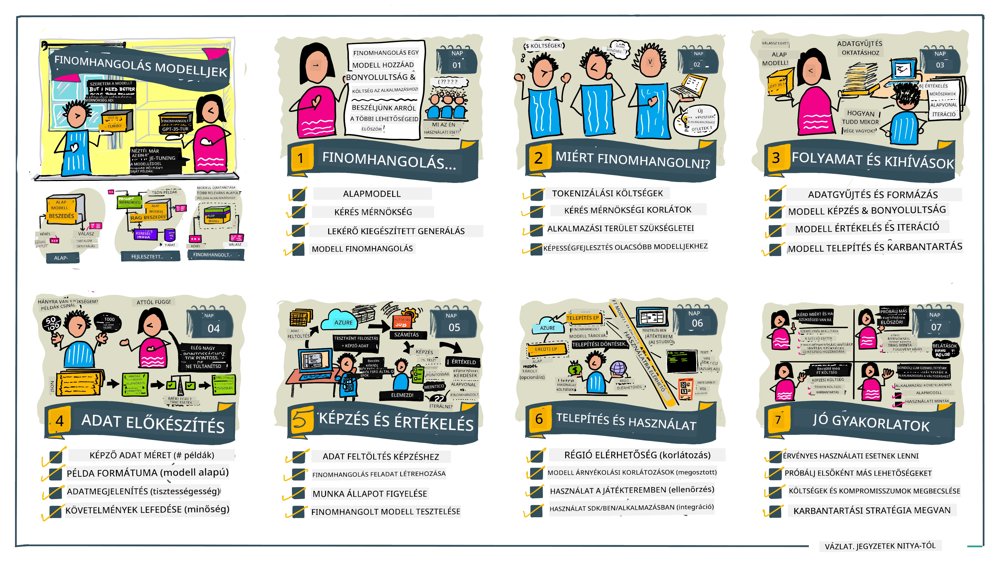

# LLM finomhangolása

Nagy nyelvi modellek alkalmazása generatív mesterséges intelligencia rendszerek építéséhez új kihívásokkal jár. Egy alapvető kérdés a válaszminőség (pontosság és relevancia) biztosítása a modell által egy adott felhasználói kéréshez generált tartalomban. Korábbi leckékben beszéltünk olyan technikákról, mint a prompt mérnökség és a lekérdezés-alapú generálás, amelyek a problémát azzal próbálják megoldani, hogy _módosítják a bemeneti promptot_ a meglévő modellen.

A mai leckében egy harmadik technikát ismertetünk, a **finomhangolást**, amely azt próbálja kezelni, hogy a modellt _magát újratanítjuk_ további adatokkal. Merüljünk el a részletekben.

## Tanulási célok

Ez a lecke bemutatja a finomhangolás fogalmát a előre betanított nyelvi modellek esetén, feltárja ennek előnyeit és kihívásait, valamint iránymutatást ad arra, mikor és hogyan érdemes finomhangolást végezni a generatív MI modellek teljesítményének javítása érdekében.

A lecke végére képes leszel válaszolni a következő kérdésekre:

- Mi az a finomhangolás a nyelvi modellek esetén?
- Mikor és miért érdemes finomhangolni?
- Hogyan lehet finomhangolni egy előre betanított modellt?
- Milyen korlátai vannak a finomhangolásnak?

Készen állsz? Kezdjük el.

## Illusztrált útmutató

Szeretnéd átlátni, hogy miről lesz szó, mielőtt mélyebben belemerülnénk? Tekintsd meg ezt az illusztrált útmutatót, amely leírja a tanulási utat ebben a leckében – a finomhangolás alapvető fogalmainak és motivációjának megismerésétől a folyamat és legjobb gyakorlatok megértéséig a finomhangolási feladat végrehajtásához. Ez egy izgalmas téma a felfedezéshez, ezért ne felejtsd el megnézni a [Források](./RESOURCES.md?WT.mc_id=academic-105485-koreyst) oldalt további linkekért, amelyek a saját tanulási utadat támogatják!

## Mi az a finomhangolás a nyelvi modelleknél?

Definíció szerint a nagy nyelvi modelleket _előre betanítják_ nagy mennyiségű szövegen, amely különböző forrásokból, köztük az internetről származik. Ahogy a korábbi leckékben tanultuk, olyan technikákra van szükségünk, mint a _prompt mérnökség_ és a _lekérdezés-alapú generálás_, hogy javítsuk a modell válaszainak minőségét a felhasználó kérdéseire („promptra”).

Egy népszerű prompt-mérnökségi technika, ha több iránymutatást adunk a modellnek arra vonatkozóan, hogy milyen válaszokat várunk, akár _utasításokkal_ (explicit iránymutatás), akár _példák megadásával_ (implicit iránymutatás). Ezt nevezzük _few-shot learning_-nek, amelynek két korlátja van:

- A modell token korlátai megszabhatják, hány példát adhatsz meg, és korlátozzák a hatékonyságot.
- A modell token költségei megdrágíthatják minden prompt példákkal való kiegészítését, és csökkenthetik a rugalmasságot.

A finomhangolás egy bevett gyakorlat a gépi tanulásban, amikor az előre betanított modellt új adatokkal újratanítják, hogy javítsák a teljesítményt egy adott feladatra. A nyelvi modellek esetében egy válogatott példa készlettel finomhangolható az előre betanított modell egy adott feladatra vagy alkalmazási területre, hogy egy **egyedi modellt** hozzunk létre, amely pontosabb és relevánsabb lehet az adott feladatra vagy területre. A finomhangolás mellékes előnye, hogy csökkentheti a few-shot tanuláshoz szükséges példák számát – ezáltal csökentve a tokenhasználatot és az ezzel járó költségeket.

## Mikor és miért érdemes finomhangolni a modelleket?

Ebben az összefüggésben a finomhangolás alatt a **felügyelt** finomhangolást értjük, ahol az újratanítás az eredeti tanuló adathalmazon kívüli új adatok hozzáadásával történik. Ez különbözik az _önálló_ finomhangolástól, ahol a modell az eredeti adatokkal, de különböző hiperparaméterek mellett kerül újratanításra.

A legfontosabb, hogy a finomhangolás egy fejlett technika, amely bizonyos szakértelmet igényel a kívánt eredmények eléréséhez. Hibás végrehajtás esetén nem biztos, hogy a várt javulást hozza, sőt akár ronthatja is a modell teljesítményét a célzott területen.

Tehát mielőtt megtanulnád, „hogyan” kell finomhangolni a nyelvi modelleket, előbb tudnod kell, „miért” érdemes erre az útra lépni, és „mikor” kezd el a finomhangolási folyamatot. Tedd föl magadnak ezeket a kérdéseket:

- **Használati eset:** Mi a _használati eseted_ a finomhangolásra? A jelenlegi előre betanított modell mely aspektusát szeretnéd fejleszteni?
- **Alternatívák:** Próbáltál _más technikákat_ a kívánt eredmények elérésére? Használd őket összehasonlítási alapként.
  - Prompt mérnökség: Próbálj ki few-shot prompt technikákat releváns prompt válaszpéldákkal. Értékeld a válaszok minőségét.
  - Lekérdezés-alapú generálás: Próbáld meg kiegészíteni a promptokat a lekérdezéssel visszakapott adatokkal. Értékeld a válaszok minőségét.
- **Költségek:** Felmérted a finomhangolás költségeit?
  - Állíthatóság - elérhető-e a modell finomhangolásra?
  - Erőfeszítés - tanuló adatkészlet előkészítése, modell értékelése és finomítása.
  - Számítási erőforrás - a finomhangolási feladatok futtatásához és a finomhangolt modell üzembe helyezéséhez.
  - Adat - hozzáférés elegendő és minőségi példákhoz a hatékony finomhangoláshoz.
- **Előnyök:** Megerősítetted a finomhangolás előnyeit?
  - Minőség - a finomhangolt modell felülmúlta-e az alapmodellt?
  - Költség - csökkenti-e a tokenhasználatot a promptok egyszerűsítésével?
  - Bővíthetőség - alapmodell használható-e új területekre átalakításra?

Ezekre a kérdésekre válaszolva eldöntheted, hogy a finomhangolás a megfelelő megközelítés-e a te esetedben. Ideálisan akkor érdemes belevágni, ha az előnyök meghaladják a költségeket. Ha úgy döntesz, hogy folytatod, itt az idő, hogy átgondold, _hogyan_ tudod finomhangolni az előre betanított modellt.

További betekintést szeretnél a döntéshozatal folyamatába? Nézd meg a [Finomhangoljak vagy ne finomhangoljak?](https://www.youtube.com/watch?v=0Jo-z-MFxJs)

## Hogyan finomhangoljunk egy előre betanított modellt?

Egy előre betanított modell finomhangolásához szükséged van:

- egy finomhangolható előre betanított modellre
- egy adatkészletre a finomhangoláshoz
- egy képzési környezetre a finomhangolási feladat futtatásához
- egy hosztolási környezetre a finomhangolt modell szolgáltatásához

## Finomhangolás a Microsoft Foundry-ban

A [Microsoft Foundry](https://ai.azure.com?WT.mc_id=academic-105485-koreyst) a hely, ahol ma az Azure-on egyedi modelleket finomhangolhatsz, telepíthetsz és kezelhetsz (ez egyesíti az egykor külön létező Azure OpenAI Studio-t és Azure AI Studio-t). Mielőtt belevágsz egy feladatba, érdemes megismerni a Foundry által kínált lehetőségeket és a platform által ajánlott legjobb gyakorlatokat. A Foundry a **LoRA (alacsony rangú adaptáció)** technológiát használja a modellek hatékony finomhangolásához, ami gyorsabb és megfizethetőbb edzést tesz lehetővé, mintha az összes súlyt újratanítanánk.

### 1. lépés: Válassz képzési technikát

A Foundry három finomhangolási technikát támogat. **Kezdj az SFT-vel** - ez fedi a legtöbb esetet.

| Technika | Mire jó | Mikor használd |
| --- | --- | --- |
| **Felügyelt finomhangolás (SFT)** | Bemenet/kimenet pérapárokkal tanítja a modellt, hogy olyan válaszokat adjon, amilyeneket szeretnél. | Alapértelmezett a legtöbb feladathoz: domén-specializáció, feladatvégrehajtás, stílus és hangnem, utasításkövetés és nyelvi adaptáció. |
| **Közvetlen preferencia optimalizálás (DPO)** | _Kedvelt vs. nem kedvelt_ válaszpárokról tanul, hogy az outputok emberi preferenciákhoz igazodjanak. | Válaszminőség, biztonság és igazítás javítása összehasonlító visszajelzés esetén. |
| **Megerősítéses finomhangolás (RFT)** | _Értékelők_ jutalmi jeleit használja komplex viselkedések optimalizálásához megerősítéses tanulással. | Objektív, érvelés-központú területek (matematika, kémia, fizika), melyek egyértelmű helyes/helytelen válaszokkal rendelkeznek. Több ML szakértelmet igényel. |

### 2. lépés: Válaszd ki a képzési szintet

A Foundry lehetővé teszi, hogy válaszd, hol és hogyan fusson a képzés:

- **Standard** - a te régiódban futtat, garantálja az adat helybeni tárolását. Használd, ha az adatoknak egy adott régióban kell maradniuk.
- **Globális** - olcsóbb és gyorsabb menedzselés azon régión kívüli kapacitás segítségével (az adatokat és model súlyokat átmásolja a képzés régiójába). Jó alapbeállítás, ha nem követelmény az adat helybeni tárolása.
- **Fejlesztői** - legalacsonyabb költség, használja az üres kapacitást késleltetés és SLA garanciák nélkül (a feladatok megszakíthatók és folytathatók). Kísérletezéshez ideális.

### 3. lépés: Válassz alapmodellt

Finomhangolható modellek közé tartozik az OpenAI `gpt-4o-mini`, `gpt-4o`, `gpt-4.1`, `gpt-4.1-mini` és `gpt-4.1-nano` (SFT; a 4o/4.1 család támogatja a DPO-t is), az érvelő modellek `o4-mini` és `gpt-5` (RFT), valamint nyílt forráskódú modellek, például a `Ministral-3B`, `Qwen-32B`, `Llama-3.3-70B-Instruct` és `gpt-oss-20b` (SFT a Foundry erőforrásokon). Mindig ellenőrizd az aktuális [Finomhangolási modellek listáját](https://learn.microsoft.com/azure/ai-foundry/foundry-models/concepts/models-sold-directly-by-azure?WT.mc_id=academic-105485-koreyst#fine-tuning-models) a támogatott módszerekről, régiókról és elérhetőségekről.

> A Foundry két lehetőséget kínál: **szerver nélküli** (fogyasztás-alapú árazás, nincs GPU kvóta kezelés, OpenAI és kiválasztott modellek) és **kezelte számítást** (saját VM-ek Azure Machine Learning-en keresztül a legtöbb modellhez). A legtöbben a szerver nélküli módon kezdjenek.

### Foundry legjobb gyakorlatok

- **Előbb alapmérés.** Mérd le az alapmodellt prompt mérnökséggel és RAG segítségével _mielőtt_ finomhangolnád, ezzel bizonyíthatod a javulást.
- **Kezdj kicsiben, majd skálázz.** Kezdd 50-100 minőségi példával a megközelítés validálásához, majd növeld 500+ példára élesben. A minőség fontosabb, mint a mennyiség – szűrd ki az alacsony minőségű példákat.
- **Formázd helyesen az adatokat.** Képzési és validációs fájlok JSONL, UTF-8 **BOM-mal**, 512 MB alatt, chat-kompletálási üzenet formátumban. Mindig legyen validációs fájl, hogy figyelhesd a túltanulást.
- **Tartsd meg a rendszerüzenetet a lekérdezésnél.** Használd ugyanazt a rendszerüzenetet a modellhívásnál, amit a tanítás során.
- **Értékeld a checkpointokat – ne telepíts vakon az utolsót.** A Foundry megtartja az utolsó három epochot telepíthető checkpointként; válaszd ki azt, amelyik a legjobban általánosít a `train_loss` / `valid_loss` és token pontosság alapján.
- **Mérd a token költséget a minőség mellett** amikor a finomhangolt modellt összehasonlítod az alapmodellel.
- **Ismételj folyamatos finomhangolással.** Egy már finomhangolt modellt is lehet új adatokkal finomhangolni (támogatott OpenAI modelleken).
- **Figyelj a hosztolási költségekre.** A telepített egyedi modell óradíjas, és az inaktív telepítés 15 nap után törlésre kerül – takarítsd ki, amire nincs szükség.

Menj végig az átfogó útmutatón a [Egy modell testreszabása finomhangolással](https://learn.microsoft.com/azure/ai-foundry/openai/how-to/fine-tuning?WT.mc_id=academic-105485-koreyst) oldalon, és nézd meg a [DPO](https://learn.microsoft.com/azure/ai-foundry/openai/how-to/fine-tuning-direct-preference-optimization?WT.mc_id=academic-105485-koreyst) és [RFT](https://learn.microsoft.com/azure/ai-foundry/openai/how-to/reinforcement-fine-tuning?WT.mc_id=academic-105485-koreyst) útmutatókat, amikor készen állsz a többi technika kipróbálására.

## Finomhangolás gyakorlatban

A következő források lépésről lépésre bemutatott útmutatókat tartalmaznak, amelyek egy valódi példán vezetnek végig egy támogatott modellen válogatott adatkészlettel. A feldolgozáshoz szükséged van egy fiókra az adott szolgáltatónál, valamint hozzáférésre a megfelelő modellhez és adatokhoz.

| Szolgáltató  | Útmutató                                                                                                                                                                         | Leírás                                                                                                                                                                                                                                                                                                                                                                                                                         |
| ------------ | --------------------------------------------------------------------------------------------------------------------------------------------------------------------------------- | -------------------------------------------------------------------------------------------------------------------------------------------------------------------------------------------------------------------------------------------------------------------------------------------------------------------------------------------------------------------------------------------------------------------------------- |
| OpenAI       | [Hogyan finomhangoljuk a chat modelleket](https://github.com/openai/openai-cookbook/blob/main/examples/How_to_finetune_chat_models.ipynb?WT.mc_id=academic-105485-koreyst)        | Tanulj meg finomhangolni egy friss OpenAI chat modellt egy adott doménre („recept asszisztens”) úgy, hogy előkészíted a tanuló adatokat, lefuttatod a finomhangolási feladatot, majd a finomhangolt modellt használod a lekérdezésekhez.                                                                                                                                                                                            |
| Microsoft Foundry | [Modell testreszabása finomhangolással](https://learn.microsoft.com/azure/ai-foundry/openai/tutorials/fine-tune?WT.mc_id=academic-105485-koreyst)                                     | Tanuld meg finomhangolni egy jelenleg támogatott modellt, például a `gpt-4.1-mini`-t **Azure-on** a Microsoft Foundry-val: készíts és tölts fel tanuló és validációs adatokat, futtasd a finomhangolási munkát, majd telepítsd és használd az új modellt.                                                                                                                                                                            |

| Hugging Face | [Nagy nyelvi modellek finomhangolása a Hugging Face segítségével](https://www.philschmid.de/fine-tune-llms-in-2024-with-trl?WT.mc_id=academic-105485-koreyst)                                               | Ez a blogbejegyzés bemutatja, hogyan finomhangoljunk egy _nyílt LLM-et_ (például: `CodeLlama 7B`) a [transformers](https://huggingface.co/docs/transformers/index?WT.mc_id=academic-105485-koreyst) könyvtár és a [Transformer Reinforcement Learning (TRL)](https://huggingface.co/docs/trl/index?WT.mc_id=academic-105485-koreyst) segítségével nyílt [adatkészleteken](https://huggingface.co/docs/datasets/index?WT.mc_id=academic-105485-koreyst) a Hugging Face-en. |
|              |                                                                                                                                                                                |                                                                                                                                                                                                                                                                                                                                                                                                                                    |
| 🤗 AutoTrain | [Nagy nyelvi modellek finomhangolása az AutoTrain-nel](https://github.com/huggingface/autotrain-advanced/?WT.mc_id=academic-105485-koreyst)                                                         | Az AutoTrain (vagy AutoTrain Advanced) egy python könyvtár, amelyet a Hugging Face fejlesztett ki, és amely számos különböző feladat finomhangolását támogatja, beleértve a LLM finomhangolást is. Az AutoTrain egy kód nélküli megoldás, és a finomhangolás elvégezhető saját felhőben, a Hugging Face Spaces-en vagy helyben. Mind webalapú GUI-t, CLI-t, mind yaml konfigurációs fájlokon keresztüli tanítást támogat.                                                                               |
|              |                                                                                                                                                                                |                                                                                                                                                                                                                                                                                                                                                                                                                                    |
| 🦥 Unsloth | [Nagy nyelvi modellek finomhangolása az Unsloth segítségével](https://github.com/unslothai/unsloth?WT.mc_id=academic-105485-koreyst)                                                         | Az Unsloth egy nyílt forráskódú keretrendszer, amely támogatja az LLM finomhangolását és a megerősítéses tanulást (RL). Az Unsloth megkönnyíti a helyi tanítást, értékelést és telepítést előre elkészített [jegyzetfüzetekkel](https://github.com/unslothai/notebooks?WT.mc_id=academic-105485-koreyst). Támogatja továbbá a szöveg-beszéd (TTS), BERT és multimodális modelleket is. A kezdéshez olvasd el lépésről lépésre szóló [Nagy nyelvi modellek finomhangolása útmutatót](https://docs.unsloth.ai/get-started/fine-tuning-llms-guide).                                                                          |
|              |                                                                                                                                                                                |                                                                                                                                                                                                                                                                                                                                                                                                                                    |
## Feladat

Válassz ki egy fenti bemutatót, és haladj végig rajta. _Ezeknek a bemutatóknak egy verzióját akár létrehozhatjuk Jupyter jegyzetfüzetekben ebben a repóban csak hivatkozásként. Kérjük, hogy a legfrissebb verziókért használd közvetlenül az eredeti forrásokat_.

## Nagyszerű munka! Folytasd a tanulást.

A lecke befejezése után nézd meg a [Generatív AI tanulási gyűjteményünket](https://aka.ms/genai-collection?WT.mc_id=academic-105485-koreyst), hogy tovább fejleszd a generatív MI ismereteidet!

Gratulálunk!! Teljesítetted a tanfolyam v2-es sorozatának utolsó leckéjét! Ne hagyd abba a tanulást és építkezést. \*\*Nézd meg a [FORRÁSOK](RESOURCES.md?WT.mc_id=academic-105485-koreyst) oldalt további ajánlásokért csak erre a témára vonatkozóan.

A v1-es leckesorozatunk is frissült további feladatokkal és fogalmakkal. Szánj egy percet, hogy frissítsd a tudásodat – és kérjük, [oszd meg kérdéseidet és visszajelzéseidet](https://github.com/microsoft/generative-ai-for-beginners/issues?WT.mc_id=academic-105485-koreyst), hogy segíts nekünk fejleszteni ezeket a leckéket a közösség számára.

---

<!-- CO-OP TRANSLATOR DISCLAIMER START -->
**Jogi nyilatkozat**:
Ez a dokumentum az AI fordítási szolgáltatás, a [Co-op Translator](https://github.com/Azure/co-op-translator) segítségével készült. Bár az pontosságra törekszünk, kérjük, vegye figyelembe, hogy az automatikus fordítások hibákat vagy pontatlanságokat tartalmazhatnak. Az eredeti dokumentum az anyanyelvén tekintendő hiteles forrásnak. Fontos információk esetén professzionális emberi fordítást javasolunk. Nem vállalunk felelősséget semmilyen félreértésért vagy téves értelmezésért, amely ebből a fordításból ered.
<!-- CO-OP TRANSLATOR DISCLAIMER END -->