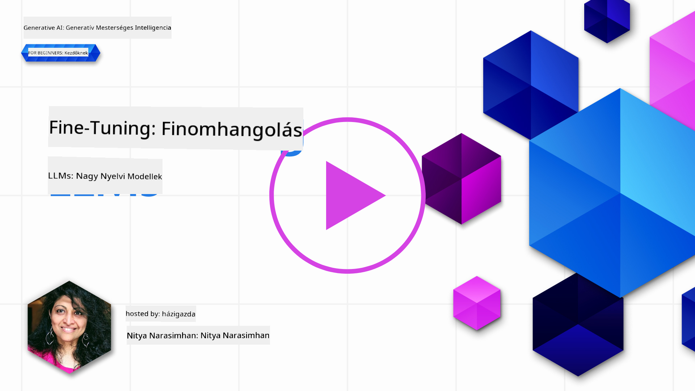
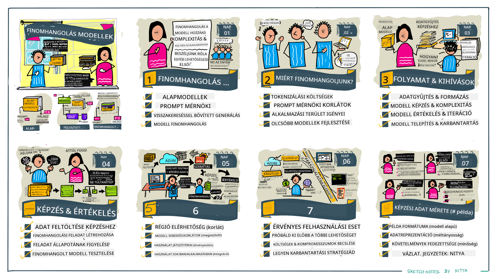

<!--
CO_OP_TRANSLATOR_METADATA:
{
  "original_hash": "68664f7e754a892ae1d8d5e2b7bd2081",
  "translation_date": "2025-07-09T17:48:16+00:00",
  "source_file": "18-fine-tuning/README.md",
  "language_code": "hu"
}
-->

# LLM finomhangolása

Nagy nyelvi modellek használata generatív AI alkalmazások építéséhez új kihívásokat hoz magával. Egy kulcskérdés a válaszok minőségének (pontosság és relevancia) biztosítása a modell által egy adott felhasználói kérésre generált tartalomban. Korábbi leckékben olyan technikákat tárgyaltunk, mint a prompt tervezés és a lekérdezés-alapú generálás, amelyek a problémát azzal próbálják megoldani, hogy _módosítják a prompt bemenetét_ a meglévő modellen.

A mai leckében egy harmadik technikát, a **finomhangolást** mutatjuk be, amely a kihívást úgy próbálja kezelni, hogy _magát a modellt újra betanítja_ további adatokkal. Merüljünk el a részletekben.

## Tanulási célok

Ez a lecke bevezeti a finomhangolás fogalmát az előre betanított nyelvi modelleknél, feltárja ennek az eljárásnak az előnyeit és kihívásait, valamint útmutatást ad arra, mikor és hogyan érdemes finomhangolást alkalmazni generatív AI modellek teljesítményének javítására.

A lecke végére képes leszel válaszolni az alábbi kérdésekre:

- Mi a finomhangolás nyelvi modelleknél?
- Mikor és miért hasznos a finomhangolás?
- Hogyan lehet finomhangolni egy előre betanított modellt?
- Milyen korlátai vannak a finomhangolásnak?

Készen állsz? Kezdjük!

## Illusztrált útmutató

Szeretnéd átlátni a leckében tárgyaltakat, mielőtt belevágnánk? Nézd meg ezt az illusztrált útmutatót, amely bemutatja a tanulási folyamatot – a finomhangolás alapfogalmainak és motivációjának megismerésétől a finomhangolási feladat végrehajtásának folyamatán és legjobb gyakorlataikon át. Ez egy izgalmas téma, ezért ne felejtsd el megnézni a [Források](./RESOURCES.md?WT.mc_id=academic-105485-koreyst) oldalt további linkekért, amelyek támogatják az önálló tanulási utadat!

## Mi a finomhangolás nyelvi modelleknél?

Definíció szerint a nagy nyelvi modelleket _előre betanítják_ nagy mennyiségű, különböző forrásból származó szövegen, beleértve az internetet is. Ahogy korábbi leckékben tanultuk, szükségünk van olyan technikákra, mint a _prompt tervezés_ és a _lekérdezés-alapú generálás_, hogy javítsuk a modell válaszainak minőségét a felhasználói kérdésekre ("promptra").

Egy népszerű prompt-tervezési technika, hogy a modellnek több iránymutatást adunk arról, mit várunk el a válaszban, akár _utasításokkal_ (explicit iránymutatás), akár _néhány példával_ (implicit iránymutatás). Ezt hívjuk _few-shot learningnek_, de ennek két korlátja van:

- A modell token-korlátai megszabhatják, hány példát adhatsz meg, és ezzel a hatékonyságot is korlátozzák.
- A token-költségek miatt drága lehet minden promptba példákat tenni, ami csökkenti a rugalmasságot.

A finomhangolás egy gyakori gyakorlat a gépi tanulásban, amikor egy előre betanított modellt új adatokkal újratanítunk, hogy javítsuk a teljesítményét egy adott feladaton. Nyelvi modellek esetén finomhangolhatjuk az előre betanított modellt _egy gondosan összeállított példakészlettel egy adott feladathoz vagy alkalmazási területhez_, így létrehozva egy **egyedi modellt**, amely pontosabb és relevánsabb lehet az adott feladatra vagy területre. A finomhangolás mellékhatása, hogy csökkentheti a few-shot learninghez szükséges példák számát – ezáltal kevesebb token használatával és költséggel jár.

## Mikor és miért érdemes finomhangolni a modelleket?

Ebben a kontextusban, amikor finomhangolásról beszélünk, akkor **felügyelt** finomhangolásról van szó, ahol az újratanítás úgy történik, hogy **új adatokat adunk hozzá**, amelyek nem voltak részei az eredeti tanító adathalmaznak. Ez eltér az önfelügyelt finomhangolástól, ahol a modellt az eredeti adatokon újratanítják, de más hiperparaméterekkel.

A legfontosabb, hogy a finomhangolás egy haladó technika, amely bizonyos szintű szakértelmet igényel a kívánt eredmények eléréséhez. Ha helytelenül végzik, nem biztos, hogy hozza a várt javulást, sőt, akár ronthatja is a modell teljesítményét a célzott területen.

Ezért mielőtt megtanulnád, "hogyan" finomhangolj nyelvi modelleket, tudnod kell, "miért" érdemes ezt az utat választani, és "mikor" kezd el a finomhangolási folyamatot. Tedd fel magadnak a következő kérdéseket:

- **Használati eset**: Mi a te _használati eseted_ a finomhangoláshoz? Melyik aspektusát szeretnéd javítani a jelenlegi előre betanított modellnek?
- **Alternatívák**: Próbáltál már _más technikákat_ a kívánt eredmények elérésére? Használd ezeket alapvonalnak az összehasonlításhoz.
  - Prompt tervezés: Próbálj ki olyan technikákat, mint a few-shot promptolás releváns példákkal. Értékeld a válaszok minőségét.
  - Lekérdezés-alapú generálás: Próbáld meg kiegészíteni a promptokat a lekérdezések eredményeivel, amelyeket az adataidban keresel. Értékeld a válaszok minőségét.
- **Költségek**: Azonosítottad a finomhangolás költségeit?
  - Finomhangolhatóság – elérhető-e az előre betanított modell finomhangolásra?
  - Erőforrás – az oktató adatok előkészítése, a modell értékelése és finomítása.
  - Számítási kapacitás – a finomhangolási feladatok futtatásához és a finomhangolt modell üzemeltetéséhez.
  - Adat – elegendő minőségű példa elérhetősége a finomhangolás hatásához.
- **Előnyök**: Megerősítetted a finomhangolás előnyeit?
  - Minőség – a finomhangolt modell felülmúlta az alapmodellt?
  - Költség – csökkenti a tokenhasználatot az egyszerűsített promptokkal?
  - Kiterjeszthetőség – új területekre is át tudod alakítani az alapmodellt?

Ezekre a kérdésekre válaszolva eldöntheted, hogy a finomhangolás a megfelelő megközelítés-e az adott használati esetedhez. Ideális esetben csak akkor érdemes belevágni, ha az előnyök meghaladják a költségeket. Ha eldöntötted, hogy folytatod, akkor gondolkodj el azon, _hogyan_ tudod finomhangolni az előre betanított modellt.

Szeretnél mélyebb betekintést a döntési folyamatba? Nézd meg a [To fine-tune or not to fine-tune](https://www.youtube.com/watch?v=0Jo-z-MFxJs) videót.

## Hogyan finomhangolhatunk egy előre betanított modellt?

Egy előre betanított modell finomhangolásához szükséged van:

- egy előre betanított modellre, amit finomhangolhatsz
- egy adathalmazra, amit a finomhangoláshoz használsz
- egy környezetre, ahol lefuttathatod a finomhangolási feladatot
- egy környezetre, ahol üzemeltetheted a finomhangolt modellt

## Finomhangolás a gyakorlatban

Az alábbi források lépésről lépésre vezetnek végig egy valós példán, ahol egy kiválasztott modellt finomhangolunk egy gondosan összeállított adathalmazon. Ezekhez a bemutatókhoz szükséged lesz egy fiókra az adott szolgáltatónál, valamint hozzáférésre a releváns modellhez és adathalmazokhoz.

| Szolgáltató | Bemutató                                                                                                                                                                       | Leírás                                                                                                                                                                                                                                                                                                                                                                                                                           |
| ----------- | ----------------------------------------------------------------------------------------------------------------------------------------------------------------------------- | -------------------------------------------------------------------------------------------------------------------------------------------------------------------------------------------------------------------------------------------------------------------------------------------------------------------------------------------------------------------------------------------------------------------------------- |
| OpenAI      | [Hogyan finomhangoljuk a chat modelleket](https://github.com/openai/openai-cookbook/blob/main/examples/How_to_finetune_chat_models.ipynb?WT.mc_id=academic-105485-koreyst)      | Tanuld meg, hogyan finomhangolj egy `gpt-35-turbo` modellt egy adott területre ("recept asszisztens") az oktató adatok előkészítésével, a finomhangolási feladat futtatásával, és a finomhangolt modell használatával az inferenciához.                                                                                                                                                                                        |
| Azure OpenAI| [GPT 3.5 Turbo finomhangolási útmutató](https://learn.microsoft.com/azure/ai-services/openai/tutorials/fine-tune?tabs=python-new%2Ccommand-line?WT.mc_id=academic-105485-koreyst) | Tanuld meg, hogyan finomhangolj egy `gpt-35-turbo-0613` modellt **Azure-on**, lépésről lépésre az oktató adatok létrehozásával és feltöltésével, a finomhangolási feladat futtatásával, majd az új modell telepítésével és használatával.                                                                                                                                                                                           |
| Hugging Face| [LLM-ek finomhangolása Hugging Face segítségével](https://www.philschmid.de/fine-tune-llms-in-2024-with-trl?WT.mc_id=academic-105485-koreyst)                                  | Ez a blogbejegyzés végigvezet egy _nyílt LLM_ (pl. `CodeLlama 7B`) finomhangolásán a [transformers](https://huggingface.co/docs/transformers/index?WT.mc_id=academic-105485-koreyst) könyvtár és a [Transformer Reinforcement Learning (TRL)](https://huggingface.co/docs/trl/index?WT.mc_id=academic-105485-koreyst) használatával, nyílt [adathalmazokon](https://huggingface.co/docs/datasets/index?WT.mc_id=academic-105485-koreyst) a Hugging Face-en. |
|             |                                                                                                                                                                               |                                                                                                                                                                                                                                                                                                                                                                                                                                 |
| 🤗 AutoTrain| [LLM-ek finomhangolása AutoTrain-nel](https://github.com/huggingface/autotrain-advanced/?WT.mc_id=academic-105485-koreyst)                                                     | Az AutoTrain (vagy AutoTrain Advanced) egy Hugging Face által fejlesztett Python könyvtár, amely sokféle feladathoz, köztük LLM finomhangoláshoz is lehetőséget ad. Az AutoTrain egy kód nélküli megoldás, és a finomhangolás végezhető a saját felhődben, Hugging Face Spaces-en vagy helyileg. Támogatja a webes GUI-t, CLI-t és a yaml konfigurációs fájlokon keresztüli tanítást is.                                                                                 |
|             |                                                                                                                                                                               |                                                                                                                                                                                                                                                                                                                                                                                                                                 |

## Feladat

Válassz ki egy fenti bemutatót, és dolgozd végig. _Lehetséges, hogy ezekből a bemutatókból készítünk egy verziót Jupyter Notebook formátumban ebben a repóban csak referenciaként. Kérjük, az eredeti forrásokat használd a legfrissebb verziókért._

## Szép munka! Folytasd a tanulást.

A lecke elvégzése után nézd meg a [Generatív AI tanulási gyűjteményünket](https://aka.ms/genai-collection?WT.mc_id=academic-105485-koreyst), hogy tovább fejleszd generatív AI ismereteidet!

Gratulálunk!! Ezzel befejezted a kurzus v2-es sorozatának utolsó leckéjét! Ne hagyd abba a tanulást és az építkezést. \*\*Nézd meg a [FORRÁSOK](RESOURCES.md?WT.mc_id=academic-105485-koreyst) oldalt további javaslatokért csak erre a témára.

A v1-es leckesorozatunkat is frissítettük több feladattal és fogalommal. Szánj egy percet a tudásod felfrissítésére – és kérjük, [oszd meg kérdéseidet és visszajelzéseidet](https://github.com/microsoft/generative-ai-for-beginners/issues?WT.mc_id=academic-105485-koreyst), hogy segítsd a közösség számára ezeknek a leckéknek a fejlesztését.

**Jogi nyilatkozat**:  
Ez a dokumentum az AI fordító szolgáltatás, a [Co-op Translator](https://github.com/Azure/co-op-translator) segítségével készült. Bár a pontosságra törekszünk, kérjük, vegye figyelembe, hogy az automatikus fordítások hibákat vagy pontatlanságokat tartalmazhatnak. Az eredeti dokumentum az anyanyelvén tekintendő hiteles forrásnak. Fontos információk esetén szakmai, emberi fordítást javaslunk. Nem vállalunk felelősséget a fordítás használatából eredő félreértésekért vagy téves értelmezésekért.