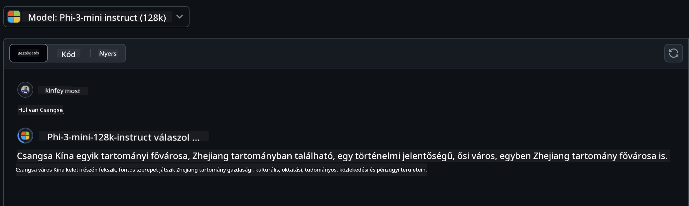
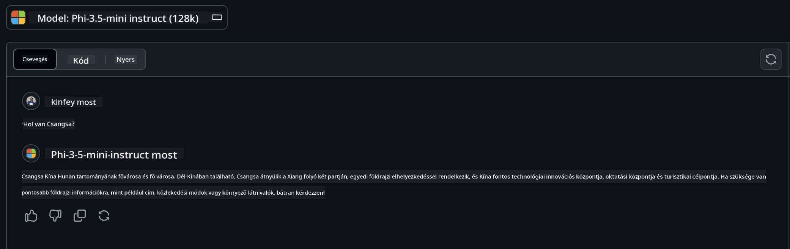

<!--
CO_OP_TRANSLATOR_METADATA:
{
  "original_hash": "124ad36cfe96f74038811b6e2bb93e9d",
  "translation_date": "2025-05-20T10:26:00+00:00",
  "source_file": "19-slm/README.md",
  "language_code": "hu"
}
-->
# Bevezetés a kis nyelvi modellekhez a generatív mesterséges intelligencia területén kezdőknek

A generatív mesterséges intelligencia az a mesterséges intelligencia egyik lenyűgöző területe, amely az új tartalom létrehozására képes rendszerek fejlesztésére összpontosít. Ez a tartalom terjedhet szövegektől és képektől zenén át egészen teljes virtuális környezetekig. A generatív mesterséges intelligencia egyik legizgalmasabb alkalmazása a nyelvi modellek területén található.

## Mik azok a kis nyelvi modellek?

A kis nyelvi modell (SLM) egy nagy nyelvi modell (LLM) lecsökkentett változatát képviseli, amely az LLM-ek számos architekturális elvét és technikáját kihasználja, miközben jelentősen csökkentett számítási lábnyommal rendelkezik. Az SLM-ek a nyelvi modellek egy olyan részhalmazát képezik, amelyeket emberi szöveghez hasonló szövegek generálására terveztek. Ellentétben nagyobb társaikkal, mint például a GPT-4, az SLM-ek kompaktabbak és hatékonyabbak, így ideálisak olyan alkalmazásokhoz, ahol korlátozottak a számítási erőforrások. Annak ellenére, hogy kisebb méretűek, még mindig képesek különféle feladatok elvégzésére. Az SLM-eket tipikusan az LLM-ek tömörítésével vagy desztillálásával építik, céljuk, hogy megőrizzék az eredeti modell funkcionalitásának és nyelvi képességeinek jelentős részét. A modell méretének csökkentése csökkenti az általános bonyolultságot, így az SLM-ek hatékonyabbak mind a memóriahasználat, mind a számítási követelmények tekintetében. Ezek az optimalizációk ellenére az SLM-ek még mindig képesek számos természetes nyelvfeldolgozási (NLP) feladat elvégzésére:

- Szöveggenerálás: Összefüggő és kontextuálisan releváns mondatok vagy bekezdések létrehozása.
- Szövegkiegészítés: Mondatok előrejelzése és kiegészítése egy adott prompt alapján.
- Fordítás: Szöveg átalakítása egyik nyelvről a másikra.
- Összegzés: Hosszú szövegek tömörítése rövidebb, könnyebben emészthető összefoglalókká.

Bár bizonyos teljesítménybeli vagy megértési mélységbeli kompromisszumokkal járnak a nagyobb társaikhoz képest.

## Hogyan működnek a kis nyelvi modellek?

Az SLM-ek hatalmas mennyiségű szövegadat alapján tanulnak. A képzés során megtanulják a nyelv mintáit és struktúráit, lehetővé téve számukra, hogy nyelvtanilag helyes és kontextuálisan megfelelő szöveget generáljanak. A képzési folyamat magában foglalja:

- Adatgyűjtés: Nagy szövegadatkészletek gyűjtése különböző forrásokból.
- Előfeldolgozás: Az adatok tisztítása és szervezése, hogy alkalmassá váljanak a képzésre.
- Képzés: Gépi tanulási algoritmusok használata a modell megtanítására, hogyan értse meg és generálja a szöveget.
- Finomhangolás: A modell teljesítményének javítása specifikus feladatokban.

Az SLM-ek fejlesztése összhangban van a modellek növekvő igényével, amelyek korlátozott erőforrásokkal rendelkező környezetekben, például mobil eszközökön vagy él számítástechnikai platformokon is telepíthetők, ahol a teljes méretű LLM-ek nehézkesek lehetnek az erőforrásigényük miatt. Az SLM-ek a hatékonyságra összpontosítva kiegyensúlyozzák a teljesítményt és a hozzáférhetőséget, lehetővé téve szélesebb körű alkalmazást különböző területeken.

## Tanulási célok

Ebben a leckében azt reméljük, hogy bevezetjük az SLM-ek ismeretét, és kombináljuk a Microsoft Phi-3-mal, hogy különböző forgatókönyveket tanuljunk meg a szövegtartalom, a látás és a MoE terén. A lecke végére képesnek kell lenned megválaszolni a következő kérdéseket:

- Mi az SLM
- Mi a különbség az SLM és az LLM között
- Mi a Microsoft Phi-3/3.5 család
- Hogyan lehet következtetni a Microsoft Phi-3/3.5 családra

Készen állsz? Kezdjük el.

## A nagy nyelvi modellek (LLM) és a kis nyelvi modellek (SLM) közötti különbségek

Mind az LLM-ek, mind az SLM-ek a valószínűségi gépi tanulás alapelveire épülnek, hasonló megközelítéseket követve az architekturális tervezésben, képzési módszerekben, adatgenerálási folyamatokban és modellértékelési technikákban. Azonban számos kulcsfontosságú tényező különbözteti meg ezt a két típusú modellt.

## A kis nyelvi modellek alkalmazásai

Az SLM-ek széles körű alkalmazási lehetőségekkel rendelkeznek, többek között:

- Chatbotok: Ügyfélszolgálat biztosítása és felhasználókkal való beszélgetés.
- Tartalomkészítés: Írók segítése ötletek generálásával vagy akár teljes cikkek megírásával.
- Oktatás: Diákok segítése írásbeli feladatokban vagy új nyelvek tanulásában.
- Hozzáférhetőség: Eszközök létrehozása fogyatékkal élő személyek számára, például szövegfelolvasó rendszerek.

**Méret**

Az LLM-ek és az SLM-ek közötti elsődleges különbség a modellek méretében rejlik. Az LLM-ek, mint például a ChatGPT (GPT-4), becslések szerint 1,76 billió paraméterből állhatnak, míg az olyan nyílt forráskódú SLM-ek, mint a Mistral 7B, jelentősen kevesebb paraméterrel rendelkeznek - körülbelül 7 milliárd. Ez a különbség elsősorban a modellarchitektúra és a képzési folyamatok különbségeinek köszönhető. Például a ChatGPT egy önfigyelési mechanizmust alkalmaz egy kódoló-dekódoló keretrendszerben, míg a Mistral 7B csúszóablak figyelmet használ, amely lehetővé teszi a hatékonyabb képzést egy csak dekódoló modellben. Ez az architekturális különbség mélyreható következményekkel jár a modellek bonyolultságára és teljesítményére nézve.

**Megértés**

Az SLM-eket tipikusan specifikus területeken való teljesítményre optimalizálják, így rendkívül specializáltak, de potenciálisan korlátozottak a több tudásterületen való széles körű kontextuális megértési képességükben. Ezzel szemben az LLM-ek célja, hogy emberi intelligenciát szimuláljanak átfogóbb szinten. Az LLM-eket nagy, változatos adatkészleteken képezik ki, hogy jól teljesítsenek különböző területeken, nagyobb sokoldalúságot és alkalmazkodóképességet kínálva. Ennek eredményeként az LLM-ek alkalmasabbak szélesebb körű downstream feladatokra, mint például a természetes nyelvfeldolgozás és programozás.

**Számítási igény**

Az LLM-ek képzése és telepítése erőforrásigényes folyamatok, gyakran jelentős számítási infrastruktúrát igényelnek, beleértve a nagyszabású GPU klasztereket. Például egy olyan modell, mint a ChatGPT, a semmiből történő képzése több ezer GPU-t igényelhet hosszabb időszakokon keresztül. Ezzel szemben az SLM-ek kisebb paraméterszáma miatt hozzáférhetőbbek számítási erőforrások szempontjából. Az olyan modellek, mint a Mistral 7B, helyi gépeken is képezhetők és futtathatók, mérsékelt GPU-kapacitásokkal, bár a képzés még mindig több órát igényel több GPU-n.

**Elfogultság**

Az elfogultság ismert probléma az LLM-ek esetében, elsősorban a képzési adatok természete miatt. Ezek a modellek gyakran nyers, nyíltan elérhető internetes adatokra támaszkodnak, amelyek alulreprezentálhatnak vagy félrevezethetnek bizonyos csoportokat, helytelen címkézést vezethetnek be, vagy nyelvi elfogultságokat tükrözhetnek, amelyeket dialektus, földrajzi eltérések és nyelvtani szabályok befolyásolhatnak. Továbbá, az LLM architektúrák bonyolultsága akaratlanul is súlyosbíthatja az elfogultságot, amely észrevétlen maradhat gondos finomhangolás nélkül. Másrészt az SLM-ek, mivel korlátozottabb, területspecifikus adatkészleteken képezik őket, kevésbé hajlamosak az ilyen elfogultságokra, bár nem immunisak rájuk.

**Következtetés**

Az SLM-ek csökkentett mérete jelentős előnyt biztosít számukra a következtetési sebesség tekintetében, lehetővé téve számukra, hogy hatékonyan generáljanak kimeneteket helyi hardveren anélkül, hogy kiterjedt párhuzamos feldolgozásra lenne szükség. Ezzel szemben az LLM-ek, méretük és bonyolultságuk miatt, gyakran jelentős párhuzamos számítási erőforrásokat igényelnek az elfogadható következtetési idők eléréséhez. A több egyidejű felhasználó jelenléte tovább lassítja az LLM-ek válaszidejét, különösen nagy léptékű telepítés esetén.

Összefoglalva, bár mind az LLM-ek, mind az SLM-ek gépi tanulás alapjaira épülnek, jelentősen különböznek modellméret, erőforrásigény, kontextuális megértés, elfogultságra való hajlam és következtetési sebesség tekintetében. Ezek a különbségek tükrözik azok alkalmasságát különböző felhasználási esetekre, az LLM-ek sokoldalúbbak, de erőforrás-igényesebbek, míg az SLM-ek hatékonyabbak a területspecifikus feladatokban, csökkentett számítási igényekkel.

***Megjegyzés: Ebben a fejezetben a Microsoft Phi-3 / 3.5 példáján keresztül mutatjuk be az SLM-et.***

## Phi-3 / Phi-3.5 család bemutatása

A Phi-3 / 3.5 család elsősorban szöveg-, látás- és ügynök (MoE) alkalmazási forgatókönyvekre összpontosít:

### Phi-3 / 3.5 Instruct

Elsősorban szöveggenerálásra, chat kiegészítésre és tartalominformáció kinyerésére stb.

**Phi-3-mini**

A 3,8 milliárd paraméteres nyelvi modell elérhető a Microsoft Azure AI Stúdióban, a Hugging Face-en és az Ollamán. A Phi-3 modellek jelentősen felülmúlják az egyenlő és nagyobb méretű nyelvi modelleket a kulcsfontosságú benchmarkokon (lásd az alábbi benchmark számokat, a magasabb számok jobbak). A Phi-3-mini felülmúlja a kétszer akkora méretű modelleket, míg a Phi-3-kis és Phi-3-közepes felülmúlja a nagyobb modelleket, beleértve a GPT-3.5-öt is.

**Phi-3-kis & közepes**

Mindössze 7 milliárd paraméterrel a Phi-3-kis felülmúlja a GPT-3.5T-t számos nyelvi, érvelési, kódolási és matematikai benchmarkon. A Phi-3-közepes 14 milliárd paraméterrel folytatja ezt a trendet, és felülmúlja a Gemini 1.0 Pro-t.

**Phi-3.5-mini**

Gondolhatunk rá úgy, mint a Phi-3-mini frissítésére. Bár a paraméterek változatlanok maradnak, javítja a több nyelv támogatásának képességét (20+ nyelv támogatása: arab, kínai, cseh, dán, holland, angol, finn, francia, német, héber, magyar, olasz, japán, koreai, norvég, lengyel, portugál, orosz, spanyol, svéd, thai, török, ukrán) és erősebb támogatást ad a hosszú kontextushoz. A Phi-3.5-mini 3,8 milliárd paraméterrel felülmúlja az azonos méretű nyelvi modelleket, és egyenrangú a kétszer akkora méretű modellekkel.

### Phi-3 / 3.5 Vision

Gondolhatunk az Instruct modellre a Phi-3/3.5 esetében úgy, mint Phi képességére a megértéshez, és a Vision az, ami szemet ad Phi-nek a világ megértéséhez.

**Phi-3-Vision**

A Phi-3-vision, mindössze 4,2 milliárd paraméterrel, folytatja ezt a trendet, és felülmúlja a nagyobb modelleket, mint például a Claude-3 Haiku és a Gemini 1.0 Pro V az általános vizuális érvelési feladatok, az OCR, valamint a táblázatok és diagramok megértési feladatai terén.

**Phi-3.5-Vision**

A Phi-3.5-Vision szintén a Phi-3-Vision frissítése, amely több kép támogatását adja hozzá. Gondolhatunk rá úgy, mint a látás javítására, nemcsak képeket, hanem videókat is láthat. A Phi-3.5-vision felülmúlja a nagyobb modelleket, mint például a Claude-3.5 Sonnet és a Gemini 1.5 Flash az OCR, táblázatok és diagramok megértési feladatai terén, és egyenrangú az általános vizuális tudásérvelési feladatok terén. Támogatja a többkeretes bemenetet, azaz több bemeneti képen végzett érvelést.

### Phi-3.5-MoE

***Szakértők keveréke (MoE)*** lehetővé teszi a modellek előképzését sokkal kevesebb számítással, ami azt jelenti, hogy drámaian növelheted a modell vagy adatkészlet méretét ugyanazzal a számítási költségvetéssel, mint egy sűrű modell esetében. Különösen egy MoE modellnek sokkal gyorsabban kell elérnie ugyanolyan minőséget, mint a sűrű párja az előképzés során. A Phi-3.5-MoE 16x3.8B szakértői modult tartalmaz. A Phi-3.5-MoE mindössze 6,6 milliárd aktív paraméterrel hasonló szintű érvelést, nyelvmegértést és matematikát ér el, mint a sokkal nagyobb modellek.

Különböző forgatókönyvek alapján használhatjuk a Phi-3/3.5 család modellt. Ellentétben az LLM-mel, a Phi-3/3.5-mini vagy a Phi-3/3.5-Vision edge eszközökön is telepíthető.

## Hogyan használjuk a Phi-3/3.5 család modelleket

Reméljük, hogy különböző forgatókönyvekben használhatjuk a Phi-3/3.5-öt. Ezután különböző forgatókönyvek alapján fogjuk használni a Phi-3/3.5-öt.

### Következtetési különbség

Cloud API

**GitHub Modellek** GitHub
A modellek a legközvetlenebb módja. Gyorsan hozzáférhet a Phi-3/3.5-Instruct modellhez a GitHub Modellek segítségével. Az Azure AI Inference SDK / OpenAI SDK kombinálásával kóddal érheti el az API-t a Phi-3/3.5-Instruct hívásának befejezéséhez. Különböző hatásokat is tesztelhet a Playground segítségével. - Demó: A Phi-3-mini és Phi-3.5-mini hatásainak összehasonlítása kínai szcenáriókban   **Azure AI Studio** Vagy ha a vision és MoE modelleket szeretnénk használni, az Azure AI Studio segítségével is elvégezheti a hívást. Ha érdekli, olvassa el a Phi-3 Cookbook-ot, hogy megtudja, hogyan hívhatja a Phi-3/3.5 Instruct, Vision, MoE-t az Azure AI Studio-n keresztül [Kattintson erre a linkre](https://github.com/microsoft/Phi-3CookBook/blob/main/md/02.QuickStart/AzureAIStudio_QuickStart.md?WT.mc_id=academic-105485-koreyst) **NVIDIA NIM** Az Azure és a GitHub által biztosított felhőalapú Model Catalog megoldások mellett a [Nivida NIM](https://developer.nvidia.com/nim?WT.mc_id=academic-105485-koreyst) segítségével is elvégezheti a kapcsolódó hívásokat. Látogasson el a NIVIDA NIM oldalára, hogy befejezze a Phi-3/3.5 Család API hívásait. Az NVIDIA NIM (NVIDIA Inference Microservices) egy gyorsított inferencia mikroszolgáltatás-készlet, amely segíti a fejlesztőket AI modellek hatékony telepítésében különböző környezetekben, beleértve a felhőket, adatközpontokat és munkaállomásokat. Az NVIDIA NIM néhány kulcsfontosságú jellemzője: - **Egyszerű telepítés:** A NIM lehetővé teszi az AI modellek egyetlen paranccsal történő telepítését, így könnyen integrálható a meglévő munkafolyamatokba. - **Optimalizált teljesítmény:** Az NVIDIA előre optimalizált inferencia motorjait, például a TensorRT-t és a TensorRT-LLM-et használja, hogy alacsony késleltetést és magas átviteli sebességet biztosítson. - **Skálázhatóság:** A NIM támogatja az autoskálázást Kubernetes-en, lehetővé téve a változó munkaterhelések hatékony kezelését. - **Biztonság és irányítás:** A szervezetek saját infrastruktúrájukon önállóan üzemeltetett NIM mikroszolgáltatásokkal fenntarthatják az irányítást adataik és alkalmazásaik felett. - **Szabványos API-k:** A NIM ipari szabványú API-kat biztosít, megkönnyítve az AI alkalmazások, például chatbotok, AI asszisztensek és mások építését és integrálását. A NIM az NVIDIA AI Enterprise része, amely célja az AI modellek telepítésének és működtetésének egyszerűsítése, biztosítva, hogy hatékonyan működjenek az NVIDIA GPU-kon. - Demó: A Nividia NIM használata a Phi-3.5-Vision-API hívására [[Kattintson erre a linkre](../../../19-slm/python/Phi-3-Vision-Nividia-NIM.ipynb)] ### Inference Phi-3/3.5 helyi környezetben Az inferencia a Phi-3 vagy bármely nyelvi modell, mint például a GPT-3 esetében arra a folyamatra utal, amely során válaszokat vagy előrejelzéseket generál a kapott bemenet alapján. Amikor egy utasítást vagy kérdést ad meg a Phi-3-nak, az a betanított neurális hálózatát használja, hogy a legvalószínűbb és legrelevánsabb választ megállapítsa az adatokban található minták és kapcsolatok elemzése révén. **Hugging Face Transformer** A Hugging Face Transformers egy erőteljes könyvtár, amelyet természetes nyelvfeldolgozási (NLP) és más gépi tanulási feladatokra terveztek. Néhány kulcsfontosságú pont róla: 1. **Előképzett modellek**: Több ezer előképzett modellt kínál, amelyek különböző feladatokra használhatók, például szövegklasszifikáció, névelem-felismerés, kérdés-válasz, összefoglalás, fordítás és szöveggenerálás. 2. **Keretrendszer interoperabilitás**: A könyvtár több mély tanulási keretrendszert támogat, beleértve a PyTorch-ot, a TensorFlow-t és a JAX-et. Ez lehetővé teszi, hogy egy modellt az egyik keretrendszerben képezzen ki, és egy másikban használjon. 3. **Multimodális képességek**: Az NLP mellett a Hugging Face Transformers támogatja a számítógépes látás (pl. képosztályozás, objektumfelismerés) és az audiofeldolgozás (pl. beszédfelismerés, hangosztályozás) feladatait is. 4. **Használat egyszerűsége**: A könyvtár API-kat és eszközöket kínál a modellek egyszerű letöltésére és finomhangolására, így mind a kezdők, mind a szakértők számára elérhető. 5. **Közösség és források**: A Hugging Face-nek élénk közössége és kiterjedt dokumentációja, útmutatói és oktatóanyagai vannak, amelyek segítenek a felhasználóknak elkezdeni és a könyvtár lehetőségeit maximálisan kihasználni. [hivatalos dokumentáció](https://huggingface.co/docs/transformers/index?WT.mc_id=academic-105485-koreyst) vagy a [GitHub tárhelyük](https://github.com/huggingface/transformers?WT.mc_id=academic-105485-koreyst). Ez a leggyakrabban használt módszer, de GPU gyorsítást is igényel. Végül is az olyan jelenetek, mint a Vision és a MoE, sok számítást igényelnek, amelyek nagyon korlátozottak lesznek a CPU-ban, ha nem kvantáltak. - Demó: Transformer használata a Phi-3.5-Instuct hívására [Kattintson erre a linkre](../../../19-slm/python/phi35-instruct-demo.ipynb) - Demó: Transformer használata a Phi-3.5-Vision hívására [Kattintson erre a linkre](../../../19-slm/python/phi35-vision-demo.ipynb) - Demó: Transformer használata a Phi-3.5-MoE hívására [Kattintson erre a linkre](../../../19-slm/python/phi35_moe_demo.ipynb) **Ollama** [Ollama](https://ollama.com/?WT.mc_id=academic-105485-koreyst) egy platform, amelyet arra terveztek, hogy megkönnyítse a nagy nyelvi modellek (LLM) helyi futtatását a gépén. Támogat különböző modelleket, mint például a Llama 3.1, Phi 3, Mistral és Gemma 2, többek között. A platform egyszerűsíti a folyamatot azáltal, hogy a modell súlyait, konfigurációját és adatait egyetlen csomagba foglalja, így hozzáférhetőbbé téve a felhasználók számára a saját modellek testreszabását és létrehozását. Az Ollama elérhető macOS, Linux és Windows rendszerekre. Ez egy nagyszerű eszköz, ha LLM-ekkel szeretne kísérletezni vagy azokat telepíteni anélkül, hogy felhőszolgáltatásokra támaszkodna. Az Ollama a legközvetlenebb módja, csak végre kell hajtania a következő utasítást. ```bash

ollama run phi3.5

``` **ONNX Runtime for GenAI** [ONNX Runtime](https://github.com/microsoft/onnxruntime-genai?WT.mc_id=academic-105485-koreyst) egy többplatformos inferencia és képzés gépi tanulási gyorsító. Az ONNX Runtime for Generative AI (GENAI) egy erőteljes eszköz, amely segít a generatív AI modellek hatékony futtatásában különböző platformokon. ## Mi az ONNX Runtime? Az ONNX Runtime egy nyílt forráskódú projekt, amely lehetővé teszi a gépi tanulási modellek nagy teljesítményű inferenciáját. Támogatja az Open Neural Network Exchange (ONNX) formátumban lévő modelleket, amely a gépi tanulási modellek ábrázolásának szabványa. Az ONNX Runtime inferencia gyorsabb ügyfélélményeket és alacsonyabb költségeket tehet lehetővé, támogatva a mély tanulási keretrendszerek, például a PyTorch és a TensorFlow/Keras, valamint a klasszikus gépi tanulási könyvtárak, mint például a scikit-learn, a LightGBM, az XGBoost stb. modelljeit. Az ONNX Runtime kompatibilis különböző hardverekkel, meghajtókkal és operációs rendszerekkel, és optimális teljesítményt biztosít, ahol alkalmazható, a hardvergyorsítók mellett a grafikus optimalizálások és átalakítások révén. ## Mi az a Generatív AI? A generatív AI olyan AI rendszerekre utal, amelyek új tartalmakat, például szöveget, képeket vagy zenét képesek generálni az általuk betanított adatok alapján. Példák közé tartoznak a nyelvi modellek, mint a GPT-3 és a képgenerálási modellek, mint a Stable Diffusion. Az ONNX Runtime for GenAI könyvtár biztosítja az ONNX modellek generatív AI ciklusát, beleértve az inferenciát az ONNX Runtime segítségével, a logitok feldolgozását, a keresést és mintavételezést, valamint a KV cache kezelését. ## ONNX Runtime for GENAI Az ONNX Runtime for GENAI kiterjeszti az ONNX Runtime képességeit, hogy támogassa a generatív AI modelleket. Néhány kulcsfontosságú jellemzője: - **Széles platformtámogatás:** Működik különböző platformokon, beleértve a Windows, Linux, macOS, Android és iOS rendszereket. - **Modelltámogatás:** Számos népszerű generatív AI modellt támogat, mint például a LLaMA, GPT-Neo, BLOOM és mások. - **Teljesítményoptimalizálás:** Optimalizálásokat tartalmaz különböző hardvergyorsítókhoz, mint például az NVIDIA GPU-k, AMD GPU-k és mások2. - **Használat egyszerűsége:** API-kat biztosít az alkalmazásokba való egyszerű integráláshoz, lehetővé téve a szöveg, képek és más tartalmak generálását minimális kóddal. - A felhasználók magas szintű generate() metódust hívhatnak, vagy a modell minden iterációját futtathatják egy ciklusban, egy token generálásával egyszerre, és opcionálisan frissíthetik a generálási paramétereket a cikluson belül. - Az ONNX runtime támogatja a mohó/sugárkeresést és a TopP, TopK mintavételezést is token sorozatok generálásához és beépített logit feldolgozást, mint például az ismétlési büntetéseket. Egyéni pontozást is könnyen hozzáadhat. ## Kezdés Az ONNX Runtime for GENAI használatának megkezdéséhez kövesse ezeket a lépéseket: ### Telepítse az ONNX Runtime-ot: ```Python
pip install onnxruntime
``` ### Telepítse a Generative AI Extensions-t: ```Python
pip install onnxruntime-genai
``` ### Futtasson egy modellt: Íme egy egyszerű példa Pythonban: ```Python
import onnxruntime_genai as og

model = og.Model('path_to_your_model.onnx')

tokenizer = og.Tokenizer(model)

input_text = "Hello, how are you?"

input_tokens = tokenizer.encode(input_text)

output_tokens = model.generate(input_tokens)

output_text = tokenizer.decode(output_tokens)

print(output_text) 
``` ### Demó: Az ONNX Runtime GenAI használata a Phi-3.5-Vision hívására ```python

import onnxruntime_genai as og

model_path = './Your Phi-3.5-vision-instruct ONNX Path'

img_path = './Your Image Path'

model = og.Model(model_path)

processor = model.create_multimodal_processor()

tokenizer_stream = processor.create_stream()

text = "Your Prompt"

prompt = "<|user|>\n"

prompt += "<|image_1|>\n"

prompt += f"{text}<|end|>\n"

prompt += "<|assistant|>\n"

image = og.Images.open(img_path)

inputs = processor(prompt, images=image)

params = og.GeneratorParams(model)

params.set_inputs(inputs)

params.set_search_options(max_length=3072)

generator = og.Generator(model, params)

while not generator.is_done():

    generator.compute_logits()
    
    generator.generate_next_token()

    new_token = generator.get_next_tokens()[0]
    
    code += tokenizer_stream.decode(new_token)
    
    print(tokenizer_stream.decode(new_token), end='', flush=True)

``` **Egyéb** Az ONNX Runtime és az Ollama referencia módszerein kívül a különböző gyártók által biztosított modell referencia módszerek alapján is elvégezhetjük a kvantitatív modellek referenciáját. Ilyenek például az Apple MLX keretrendszer az Apple Metal-lal, a Qualcomm QNN az NPU-val, az Intel OpenVINO a CPU/GPU-val stb. További tartalmakat is találhat a [Phi-3 Cookbook](https://github.com/microsoft/phi-3cookbook?WT.mc_id=academic-105485-koreyst) oldalon. ## Továbbiak Megtanultuk a Phi-3/3.5 Család alapjait, de az SLM további megismeréséhez több tudásra van szükség. A válaszokat megtalálhatja a Phi-3 Cookbook-ban. Ha többet szeretne megtudni, látogassa meg a [Phi-3 Cookbook](https://github.com/microsoft/phi-3cookbook?WT.mc_id=academic-105485-koreyst) oldalt.

**Felelősség kizárása**:  
Ezt a dokumentumot a [Co-op Translator](https://github.com/Azure/co-op-translator) AI fordítási szolgáltatással fordították le. Bár törekszünk a pontosságra, kérjük, vegye figyelembe, hogy az automatikus fordítások hibákat vagy pontatlanságokat tartalmazhatnak. Az eredeti dokumentum az eredeti nyelvén tekintendő hiteles forrásnak. Kritikus információk esetén javasolt a professzionális emberi fordítás. Nem vállalunk felelősséget a fordítás használatából eredő félreértésekért vagy félreértelmezésekért.