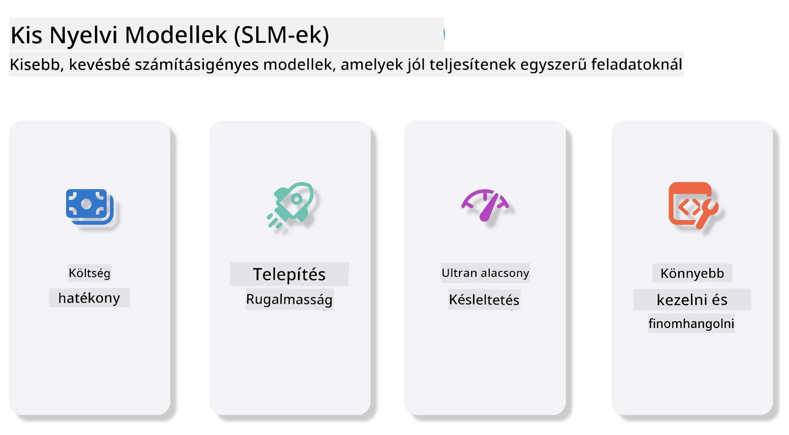
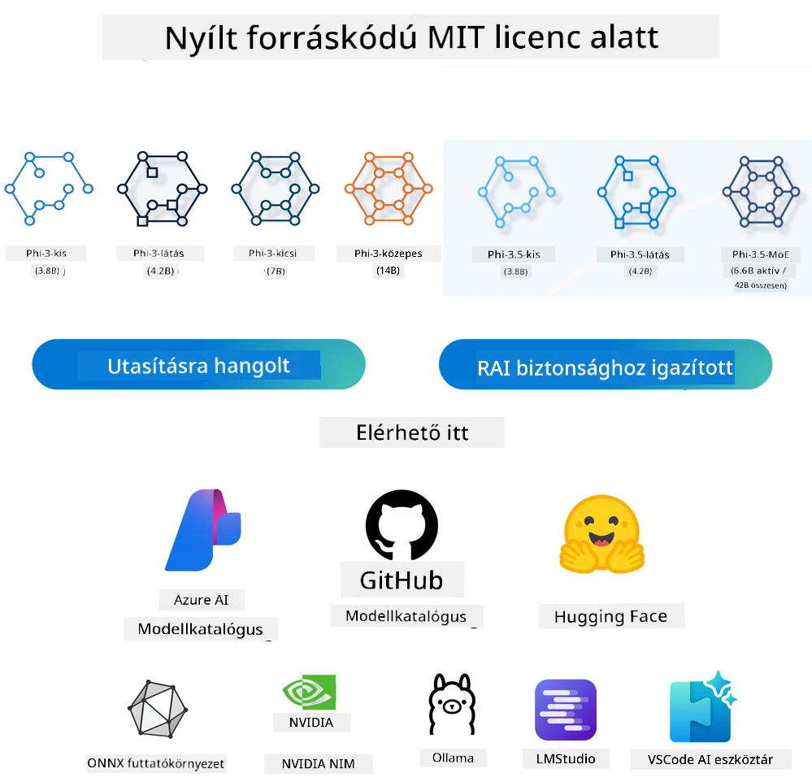
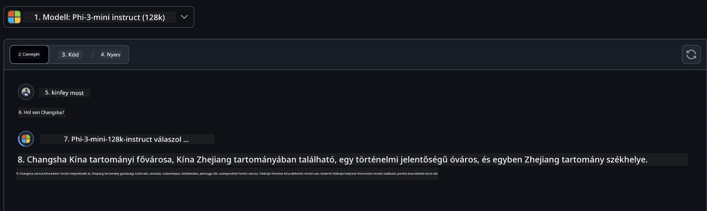
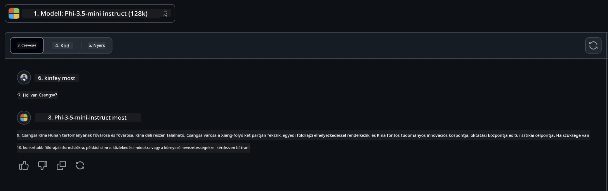

# Bevezetés a kis nyelvi modellekhez generatív MI-ben kezdőknek
A generatív MI a mesterséges intelligencia egy lenyűgöző területe, amely olyan rendszerek létrehozására összpontosít, amelyek képesek új tartalom generálására. Ez a tartalom szövegtől és képektől kezdve zenén át akár teljes virtuális környezetekig terjedhet. A generatív MI egyik legizgalmasabb alkalmazási területe a nyelvi modelleké.

## Mik azok a kis nyelvi modellek?

A Kis Nyelvi Modell (SLM) a nagy nyelvi modell (LLM) egy leegyszerűsített változatát jelenti, amely sok LLM-architektúrabeli elvet és technikát használ, miközben jelentősen csökkentett számítási erőforrásigénnyel rendelkezik.

Az SLM-ek nyelvi modellek egy alcsoportja, amelyeket emberhez hasonló szöveg generálására terveztek. A nagyobb társaikkal, például a GPT-4-gyel ellentétben az SLM-ek kompaktabbak és hatékonyabbak, ezért ideálisak olyan alkalmazásokban, ahol korlátozottak a számítási erőforrások. Kis méretük ellenére számos feladatot el tudnak végezni. Tipikusan az SLM-eket LLM-ek tömörítésével vagy desztillálásával hozzák létre, céljuk, hogy megőrizzék az eredeti modell funkcionalitásának és nyelvi képességeinek jelentős részét. A modellméret csökkentése mérsékli az összetettséget, így az SLM-ek memória- és számítási igény szempontjából is hatékonyabbak. Ezek az optimalizációk mellett az SLM-ek továbbra is széleskörű természetes nyelvfeldolgozási (NLP) feladatokat képesek ellátni:

- Szöveggenerálás: Koherens és kontextusban releváns mondatok vagy bekezdések létrehozása.
- Szöveg kiegészítése: Mondatok előrejelzése és befejezése adott kiinduló szöveg alapján.
- Fordítás: Szöveg átalakítása egyik nyelvről a másikra.
- Összefoglalás: Hosszú szövegek tömörebb, könnyebben fogyasztható összegzésbe foglalása.

Bár bizonyos kompromisszumokkal jár a teljesítmény vagy a mélyebb megértés tekintetében a nagyobb modellekhez képest.

## Hogyan működnek a kis nyelvi modellek?
Az SLM-ek hatalmas mennyiségű szöveges adatból tanulnak. A képzés során megtanulják a nyelv mintázatait és szerkezetét, lehetővé téve, hogy nyelvtanilag helyes és kontextusban megfelelő szöveget generáljanak. A képzési folyamat a következő lépéseket foglalja magában:

- Adatgyűjtés: Nagy szövegállományok összegyűjtése különféle forrásokból.
- Előfeldolgozás: Az adatok tisztítása és rendezése, hogy alkalmasak legyenek a képzéshez.
- Képzés: Gépi tanulási algoritmusok használata a modell tanítására a szöveg megértésére és generálására.
- Finomhangolás: A modell teljesítményének javítása specifikus feladatokon.

Az SLM-ek fejlesztése összhangban áll azzal az egyre növekvő igénnyel, hogy olyan modellek legyenek elérhetők, amelyeket korlátozott erőforrású környezetekben, például mobil eszközökön vagy él-számítástechnikai platformokon lehet használni, ahol a teljes méretű LLM-ek túl nagy erőforrásigényűek lehetnek. Az SLM-ek hatékonyságra fókuszáló megközelítése lehetővé teszi a teljesítmény és az elérhetőség egyensúlyát, így szélesebb körben alkalmazhatók különféle területeken.



## Tanulási célok

Ebben a leckében szeretnénk bemutatni az SLM-ek ismeretét, és azt a Microsoft Phi-3-mal ötvözni, hogy különféle szöveges tartalomra, látásra és MoE-re (Mixture of Experts) vonatkozó szcenáriókat tanuljunk.

A lecke végére képes lesz válaszolni az alábbi kérdésekre:

- Mi az SLM?
- Mi a különbség az SLM és az LLM között?
- Mi a Microsoft Phi-3/3.5 család?
- Hogyan futtathatunk lekérdezést a Microsoft Phi-3/3.5 családdal?

Készen áll? Kezdjünk bele.

## A különbségek a nagy (LLM) és kis nyelvi modellek (SLM) között

Mind az LLM-ek, mind az SLM-ek a valószínűségi gépi tanulás alapelvein alapulnak, és hasonló megközelítéseket követnek architektúrájuk, képzési módszereik, adatgenerálási folyamataik és modellértékeléseik tekintetében. Ugyanakkor több kulcsfontosságú tényező megkülönbözteti ezeket a modelleket.

## A kis nyelvi modellek alkalmazási területei

Az SLM-ek számos területen alkalmazhatók, többek között:

- Chatbotok: Ügyfélszolgálat nyújtása és a felhasználókkal folytatott párbeszéd.
- Tartalomkészítés: Írók segítése ötletek generálásában vagy akár teljes cikkek megírásában.
- Oktatás: Diákok segítése írási feladatokban vagy új nyelvek tanulásában.
- Akadálymentesítés: Eszközök készítése fogyatékkal élők számára, például szöveg-beszéd átalakító rendszerek.

**Méret**

Az LLM-ek és SLM-ek elsődleges különbsége a modell méretében rejlik. Az LLM-ek, mint például a ChatGPT (GPT-4), körülbelül 1,76 billió paraméterrel rendelkezhetnek, míg az open-source SLM-ek, mint a Mistral 7B, jelentősen kevesebb, körülbelül 7 milliárd paraméterrel rendelkeznek. Ez a különbség elsősorban a modellarchitektúra és a képzési folyamatok eltéréseiből ered. Például a ChatGPT egy önfigyelő mechanizmust használ egy kódoló-dekódoló keretrendszeren belül, míg a Mistral 7B csúszó ablakos figyelmet alkalmaz, ami hatékonyabb képzést tesz lehetővé egy dekódoló-alapú modellben. Ez az architekturális különbség mély hatással van a modellek összetettségére és teljesítményére.

**Megértés**

Az SLM-ek általában egy adott szakterületen optimalizáltak, ezért specializáltak, de korlátozottabbak lehetnek abban, hogy széles kontextuális megértést nyújtsanak több tudományterületen átívelően. Ezzel szemben az LLM-ek célja, hogy átfogóbb szinten szimulálják az emberi intelligenciát. Hatalmas, sokféle adatbázison tanítva az LLM-ek képesek többféle területen jól teljesíteni, ami nagyobb sokoldalúságot és alkalmazkodóképességet eredményez. Ennek megfelelően az LLM-ek szélesebb körű feladatokra alkalmasak, mint például a természetes nyelvfeldolgozás vagy programozás.

**Számítás**

Az LLM-ek képzése és működtetése erőforrásigényes, gyakran nagy számítási infrastruktúrát igényel, például nagyméretű GPU klasztereket. Például egy ChatGPT-hez hasonló modell nulláról történő képzése akár több ezer GPU-t is igényelhet hosszú időn keresztül. Ezzel szemben az SLM-ek, kisebb paraméterszámaik miatt, számítási erőforrás szempontjából megfizethetőbbek. Például a Mistral 7B modellt helyi gépeken is lehet tanítani és futtatni, amelyek mérsékelt GPU kapacitással rendelkeznek, bár a képzéshez így is több órányi munka szükséges több GPU-n.

**Elfogultság**

Az elfogultság ismert probléma az LLM-eknél, amely főként a képzési adatok természetéből fakad. Ezek a modellek gyakran nyers, nyílt internetes adatokon alapulnak, amelyek alul- vagy félre reprezentálhatnak bizonyos csoportokat, hibás címkézést tartalmazhatnak, vagy nyelvi torzításokat tükröznek (például dialektus, földrajzi változatosság, nyelvtani szabályok). Ezen túlmenően az LLM-ek összetett architektúrái véletlenül felerősíthetik az elfogultságot, amely nem mindig kerül észrevételre alapos finomhangolás nélkül. Az SLM-ek, amelyeket viszont szűkebb, szakterület-specifikus adatbázisokon képeznek, kevésbé érzékenyek ezekre az elfogultságokra, de nem teljesen immunisak rájuk.

**Lekérdezés (Inference)**

Az SLM-ek kisebb mérete jelentős előnyt jelent a lekérdezés sebessége szempontjából, lehetővé téve, hogy a kimeneteket hatékonyan generálják helyi hardveren, párhuzamos feldolgozás nélkül. Ezzel szemben az LLM-ek mérete és összetettsége miatt jelentős párhuzamos számítási erőforrásokat igényelnek a megfelelő lekérdezési idők eléréséhez. Több egyidejű felhasználó jelenléte tovább lassítja az LLM-ek válaszidejét, különösen nagy skálán történő üzemeltetés esetén.

Összefoglalva, míg az LLM-ek és SLM-ek egyaránt gépi tanuláson alapulnak, jelentősen különböznek modellméret, erőforrásigény, kontextuális megértés, elfogultságra való érzékenység és lekérdezési sebesség tekintetében. Ezek a különbségek tükrözik alkalmaságukat különböző felhasználási esetekre: az LLM-ek sokoldalúbbak, de erőforrásigényesek, az SLM-ek pedig szakterületspecifikusabb hatékonyságot kínálnak csökkentett számítási igénnyel.

***Megjegyzés: Ebben a leckében az SLM-et a Microsoft Phi-3 / 3.5 család példáján keresztül mutatjuk be.***

## Bemutatjuk a Phi-3 / Phi-3.5 családot

A Phi-3 / 3.5 család főként szöveges, látási és Agent (MoE) alkalmazási szcenáriókra céloz:

### Phi-3 / 3.5 Instruct

Főként szöveggenerálásra, chat kiegészítésre és tartalminformáció kinyerésére.

**Phi-3-mini**

A 3,8 milliárd paraméteres nyelvi modell elérhető a Microsoft Azure AI Studión, a Hugging Face-en és az Ollama platformon. A Phi-3 modellek jelentősen felülmúlják az ugyanakkora vagy nagyobb modelleket kulcsfontosságú mérőszámok alapján (lásd az alábbi benchmark számokat, a magasabb érték jobb). A Phi-3-mini megelőzi a kétszer ekkora méretű modelleket, míg a Phi-3-small és Phi-3-medium nagyobb modelleket is túlszárnyalnak, beleértve a GPT-3.5-et is.

**Phi-3-small & medium**

Mindössze 7 milliárd paraméterrel a Phi-3-small legyőzi a GPT-3.5T-t számos nyelvi, logikai, kódolási és matematikai mérőszámban.

A Phi-3-medium, amely 14 milliárd paraméterrel rendelkezik, folytatja ezt a trendet, és felülmúlja a Gemini 1.0 Pro modellt.

**Phi-3.5-mini**

Ezt tekinthetjük a Phi-3-mini továbbfejlesztett változatának. A paraméterek száma változatlan, viszont javult a többnyelvű támogatás (20+ nyelv támogatása: arab, kínai, cseh, dán, holland, angol, finn, francia, német, héber, magyar, olasz, japán, koreai, norvég, lengyel, portugál, orosz, spanyol, svéd, thaiföldi, török, ukrán), és erősebb támogatást kap a hosszú kontextus kezelésére.

A 3,8 milliárd paraméteres Phi-3.5-mini felülmúlja az ugyanakkora méretű nyelvi modelleket, és vetekszik a kétszer ekkora méretű modellekkel.

### Phi-3 / 3.5 Vision

A Phi-3/3.5 Instruct modellt úgy is tekinthetjük, mint Phi képességét a megértésre, és a Vision az, ami „szemeket” ad Phi-nak, hogy megértse a világot.

**Phi-3-Vision**

A Phi-3-vision, amelynek csak 4,2 milliárd paramétere van, tovább viszi ezt a trendet, és jobban teljesít, mint nagyobb modellek, például Claude-3 Haiku és Gemini 1.0 Pro V általános vizuális érvelési feladatokban, OCR-ben, valamint táblázat- és diagramértésben.

**Phi-3.5-Vision**

A Phi-3.5-Vision a Phi-3-Vision fejlesztett változata, amely több kép támogatását teszi lehetővé. Ezt úgy is tekinthetjük, mint a látás képességének javulását: nemcsak képeket, hanem videókat is képes feldolgozni.

A Phi-3.5-vision jobb teljesítményt nyújt nagyobb modelleknél, például Claude-3.5 Sonnet és Gemini 1.5 Flash esetében OCR, táblázatok és diagramok értelmezésében, és egyenértékű a generalizált vizuális tudást igénylő érvelési feladatokban. Több képkockás bemenet támogatásával több bemeneti kép alapján is képes következtetéseket levonni.

### Phi-3.5-MoE

***Mixture of Experts (MoE)*** lehetővé teszi, hogy a modelleket kevesebb számítási kapacitással tanítsuk elő, ami azt jelenti, hogy jelentősen megnövelhető a modell vagy az adatkészlet mérete ugyanazzal a számítási költségvetéssel, mint egy sűrű modell esetében. Különösen egy MoE modell sokkal gyorsabban érheti el azonos minőségi szintet előképzés során, mint sűrű (dense) megfelelője.

A Phi-3.5-MoE 16 darab 3,8 milliárd paraméteres szakértő modult tartalmaz. Mindössze 6,6 milliárd aktív paraméterrel a Phi-3.5-MoE hasonló szintű érvelést, nyelvi megértést és matematikai képességeket ér el, mint sokkal nagyobb modellek.

A Phi-3/3.5 család modelljeit különböző szcenáriókban használhatjuk. Az LLM-től eltérően a Phi-3/3.5-mini vagy a Phi-3/3.5-Vision a végponton (edge devices) is telepíthető.

## Hogyan használjuk a Phi-3/3.5 család modelleket

Azt szeretnénk elérni, hogy a Phi-3/3.5 különböző szcenáriókban használható legyen. Következő lépésként különböző esetekben fogjuk használni a Phi-3/3.5-öt.



### Lekérdezés felhő API-kon keresztül

**GitHub Modellek**

A GitHub Modellek a legközvetlenebb módja ennek. Gyorsan elérheti a Phi-3/3.5-Instruct modellt a GitHub Modelleken keresztül. Együttesen az Azure AI Inference SDK-val vagy az OpenAI SDK-val API hívásokat végezhet kódból, hogy megvalósítsa a Phi-3/3.5-Instruct meghívását. Különböző eredményeket közvetlenül a Playground-ban is tesztelhet.

- Bemutató: A Phi-3-mini és Phi-3.5-mini hatásainak összehasonlítása kínai nyelvi szcenáriókban






**Azure AI Studio**

Ha viszont a látási vagy MoE modelleket szeretnénk használni, választhatjuk az Azure AI Studio-t is a hívások végrehajtására. Ha érdekli, elolvashatja a Phi-3 Cookbook-ot, amelyből megtanulhatja, hogyan lehet meghívni Phi-3/3.5 Instruct, Vision, MoE modelleket Azure AI Studio-n keresztül. [Kattintson erre a linkre](https://github.com/microsoft/Phi-3CookBook/blob/main/md/02.QuickStart/AzureAIStudio_QuickStart.md?WT.mc_id=academic-105485-koreyst)


**NVIDIA NIM**

Az Azure és GitHub által kínált felhőalapú Model Catalog megoldások mellett használhatja a [NVIDIA NIM](https://developer.nvidia.com/nim?WT.mc_id=academic-105485-koreyst) szolgáltatást is a modellhívásokhoz. Az NVIDIA NIM (NVIDIA Inference Microservices) egy gyorsított inferencia mikroszolgáltatásokból álló csomag, amely segíti a fejlesztőket AI modellek hatékony telepítésében különféle környezetekben, beleértve a felhőket, adatközpontokat és munkaállomásokat.

Íme néhány fontos jellemzője az NVIDIA NIM-nek:
- **Telepítés egyszerűsége:** A NIM lehetővé teszi az AI modellek egyetlen parancsos telepítését, így könnyen integrálható a meglévő munkafolyamatokba.
- **Optimalizált teljesítmény:** Az NVIDIA előre optimalizált inferencia motorjait használja, mint például a TensorRT és a TensorRT-LLM, hogy alacsony késleltetést és nagy áteresztőképességet biztosítson.
- **Skálázhatóság:** A NIM támogatja az automatikus skálázást Kubernetes-en, lehetővé téve a változó munkaterhelések hatékony kezelését.
- **Biztonság és irányítás:** A szervezetek saját kezükben tarthatják adataik és alkalmazásaik feletti irányítást, ha a NIM mikroszolgáltatásokat saját kezelt infrastruktúrájukon üzemeltetik.
- **Szabványos API-k:** A NIM iparági szabvány API-kat biztosít, így könnyű AI alkalmazásokat, például chatbotokat, AI asszisztenseket és egyebeket építeni és integrálni.

A NIM az NVIDIA AI Enterprise része, amely célja az AI modellek telepítésének és üzemeltetésének egyszerűsítése, biztosítva, hogy hatékonyan fussanak NVIDIA GPU-kon.

- Demó: NVIDIA NIM használata Phi-3.5-Vision-API hívásához [[Kattintson ide](./python/Phi-3-Vision-Nividia-NIM.ipynb?WT.mc_id=academic-105485-koreyst)]


### Phi-3/3.5 helyi futtatása
A Phi-3-mal vagy bármely GPT-3-hoz hasonló nyelvi modellel kapcsolatos inferencia a bemeneti adatok alapján válaszok vagy előrejelzések generálását jelenti. Amikor egy kérdést vagy bemeneti szöveget adsz a Phi-3-nak, a tanult neurális hálózatot használja arra, hogy a bemeneti minták és adatok alapján a legvalószínűbb és legrelevánsabb választ előállítsa.

**Hugging Face Transformer**
A Hugging Face Transformers egy erőteljes könyvtár természetes nyelvfeldolgozáshoz (NLP) és más gépi tanulási feladatokhoz. Íme néhány fontos pont róla:

1. **Előre betanított modellek:** Több ezer előre betanított modellt kínál különféle feladatokhoz, mint például szövegosztályozás, névazonosítás, kérdés-válasz, összefoglalás, fordítás és szöveggenerálás.

2. **Keretrendszer interoperabilitás:** Több mélytanulási keretrendszert támogat, beleértve a PyTorch-ot, TensorFlow-t és JAX-t. Ez lehetővé teszi, hogy egy modellt az egyik keretrendszerben taníts, majd a másikban használd.

3. **Multimodális képességek:** Az NLP mellett támogatja a számítógépes látás feladatait (pl. képosztályozás, objektumfelismerés) és az audió feldolgozást (pl. beszédfelismerés, audió osztályozás).

4. **Egyszerű használat:** API-kat és eszközöket kínál a modellek letöltéséhez és finomhangolásához, így kezdők és szakértők számára is hozzáférhető.

5. **Közösség és források:** A Hugging Face élénk közösséggel rendelkezik, rengeteg dokumentációval, oktatóanyaggal és útmutatóval segítve a felhasználókat.
[Hivatalos dokumentáció](https://huggingface.co/docs/transformers/index?WT.mc_id=academic-105485-koreyst) vagy GitHub könyvtáruk: [GitHub repository](https://github.com/huggingface/transformers?WT.mc_id=academic-105485-koreyst).

Ez a leggyakrabban használt módszer, de GPU gyorsítást igényel. Végül is a Vision és MoE szcenáriók sok számítást igényelnek, amelyek CPU-n nagyon lassúak lennének, ha nincsenek kvantáltak.

- Demó: Transformer használata Phi-3.5-Instruct hívásához [Kattints ide](./python/phi35-instruct-demo.ipynb?WT.mc_id=academic-105485-koreyst)

- Demó: Transformer használata Phi-3.5-Vision hívásához [Kattints ide](./python/phi35-vision-demo.ipynb?WT.mc_id=academic-105485-koreyst)

- Demó: Transformer használata Phi-3.5-MoE hívásához [Kattints ide](./python/phi35_moe_demo.ipynb?WT.mc_id=academic-105485-koreyst)

**Ollama**
Az [Ollama](https://ollama.com/?WT.mc_id=academic-105485-koreyst) olyan platform, amely megkönnyíti nagy nyelvi modellek (LLM-ek) helyi futtatását a gépeden. Sok modellt támogat, például Llama 3.1-et, Phi 3-at, Mistralt és Gemma 2-t, többek között. A platform egy csomagba foglalja a modell súlyokat, konfigurációt és adatokat, így könnyebben testreszabható és létrehozhatók saját modellek. Ollama elérhető macOS-re, Linuxra és Windowsra. Kiváló eszköz, ha LLM-ekkel szeretnél kísérletezni vagy telepíteni anélkül, hogy felhőszolgáltatásokra támaszkodnál. Az Ollama a legközvetlenebb megoldás, csak végre kell hajtani a következő parancsot.


```bash

ollama run phi3.5

```


**ONNX Runtime a Generatív AI-hoz**

Az [ONNX Runtime](https://github.com/microsoft/onnxruntime-genai?WT.mc_id=academic-105485-koreyst) egy platformfüggetlen inferencia és tanulásgyorsító gépi tanulási rendszer. Az ONNX Runtime Generatív AI-hoz (GENAI) egy hatékony eszköz, amely segít generatív AI modelleket hatékonyan futtatni különféle platformokon.

## Mi az az ONNX Runtime?
Az ONNX Runtime egy nyílt forráskódú projekt, amely nagy teljesítményű inferenciát tesz lehetővé gépi tanulási modelleknél. Támogatja az Open Neural Network Exchange (ONNX) formátumú modelleket, amely szabvány a gépi tanulási modellek ábrázolására. Az ONNX Runtime inferencia gyorsabb ügyfélélményt és alacsonyabb költségeket tesz lehetővé, támogatva a mélytanulási keretrendszerekből, mint a PyTorch és TensorFlow/Keras, valamint a klasszikus gépi tanulási könyvtárakból származó modelleket, például scikit-learn, LightGBM, XGBoost stb. Az ONNX Runtime kompatibilis különböző hardverekkel, driverekkel és operációs rendszerekkel, és az optimális teljesítmény érdekében kihasználja a hardvergyorsítókat, emellett gráfoptimalizációkat és transzformációkat alkalmaz.

## Mi az a Generatív AI?
A generatív AI azokat az MI rendszereket jelenti, amelyek új tartalmakat hoznak létre, például szöveget, képeket vagy zenét az alapján, amire betanították őket. Példák erre a GPT-3 nyelvi modell és a Stable Diffusion képgeneráló modell. Az ONNX Runtime a GenAI könyvtár egy generatív AI folyamatot biztosít ONNX modellekhez, beleértve az inferenciát, logit feldolgozást, keresést és mintavételezést, valamint a KV cache kezelését.

## ONNX Runtime a GENAI-hoz
Az ONNX Runtime a GENAI-hoz kiterjeszti az ONNX Runtime funkcionalitását, hogy generatív AI modelleket támogasson. Néhány fontos jellemző:

- **Széles körű platform támogatás:** Működik Windows, Linux, macOS, Android és iOS rendszereken.
- **Modelltámogatás:** Sok népszerű generatív AI modellt támogat, például LLaMA, GPT-Neo, BLOOM és másokat.
- **Teljesítmény optimalizálás:** Optimalizációkat tartalmaz különböző hardvergyorsítókhoz, mint NVIDIA GPU-k, AMD GPU-k, stb.
- **Egyszerű használat:** API-kat kínál könnyű integrációhoz alkalmazásokban, lehetővé téve szöveg, képek és egyéb tartalmak generálását minimális kóddal.
- A felhasználók meghívhatnak egy magas szintű generate() metódust, vagy ciklikusan futtathatják a modellt, egy token generálásával egyszerre, opcionálisan frissítve a generálási paramétereket a cikluson belül.
- Az ONNX runtime támogatja a greedy/beam keresést, valamint TopP és TopK mintavételezést token-sorrendek generálásához, illetve beépített logit feldolgozást, például ismétlési büntetéseket. Egyéni pontozásokat is könnyen hozzáadhatsz.

## Első lépések
Az ONNX Runtime a GENAI-hoz való induláshoz az alábbi lépéseket követheted:

### ONNX Runtime telepítése:
```Python
pip install onnxruntime
```
### Generatív AI kiterjesztések telepítése:
```Python
pip install onnxruntime-genai
```

### Modell futtatása: Íme egy egyszerű példa Pythonban:
```Python
import onnxruntime_genai as og

model = og.Model('path_to_your_model.onnx')

tokenizer = og.Tokenizer(model)

input_text = "Hello, how are you?"

input_tokens = tokenizer.encode(input_text)

output_tokens = model.generate(input_tokens)

output_text = tokenizer.decode(output_tokens)

print(output_text) 
```
### Demó: ONNX Runtime GenAI használata Phi-3.5-Vision híváshoz


```python

import onnxruntime_genai as og

model_path = './Your Phi-3.5-vision-instruct ONNX Path'

img_path = './Your Image Path'

model = og.Model(model_path)

processor = model.create_multimodal_processor()

tokenizer_stream = processor.create_stream()

text = "Your Prompt"

prompt = "<|user|>\n"

prompt += "<|image_1|>\n"

prompt += f"{text}<|end|>\n"

prompt += "<|assistant|>\n"

image = og.Images.open(img_path)

inputs = processor(prompt, images=image)

params = og.GeneratorParams(model)

params.set_inputs(inputs)

params.set_search_options(max_length=3072)

generator = og.Generator(model, params)

while not generator.is_done():

    generator.compute_logits()
    
    generator.generate_next_token()

    new_token = generator.get_next_tokens()[0]
    
    output = tokenizer_stream.decode(new_token)
    
    print(tokenizer_stream.decode(new_token), end='', flush=True)

```


**Egyebek**

Az ONNX Runtime és az Ollama referenciamódszerek mellett a kvantum modellek referencia implementációját a különböző gyártók által adott modell referencia módszerei alapján is elvégezhetjük. Például Apple MLX keretrendszer az Apple Metal-lal, Qualcomm QNN az NPU-val, Intel OpenVINO CPU/GPU-val stb. Több tartalmat találsz a [Phi-3 Cookbook](https://github.com/microsoft/phi-3cookbook?WT.mc_id=academic-105485-koreyst) oldalán.


## Továbbiak

Megismertük a Phi-3/3.5 család alapjait, de az SLM mélyebb megértéséhez további ismeretek szükségesek. A válaszokat megtalálod a Phi-3 Cookbook-ban. Ha többet szeretnél megtudni, kérjük, látogass el a [Phi-3 Cookbook](https://github.com/microsoft/phi-3cookbook?WT.mc_id=academic-105485-koreyst) oldalra.

---

<!-- CO-OP TRANSLATOR DISCLAIMER START -->
**Jogi nyilatkozat**:  
Ezt a dokumentumot az AI fordítószolgáltatás, a [Co-op Translator](https://github.com/Azure/co-op-translator) segítségével fordítottuk le. Bár törekszünk a pontosságra, kérjük, vegye figyelembe, hogy az automatikus fordítások hibákat vagy pontatlanságokat tartalmazhatnak. Az eredeti dokumentum az anyanyelvén tekintendő hiteles forrásnak. Kritikus információk esetén javasolt szakmai emberi fordítást igénybe venni. Nem vállalunk felelősséget az e fordítás használatából eredő félreértésekért vagy félreértelmezésekért.
<!-- CO-OP TRANSLATOR DISCLAIMER END -->