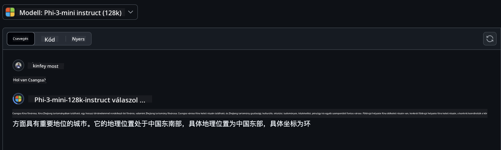
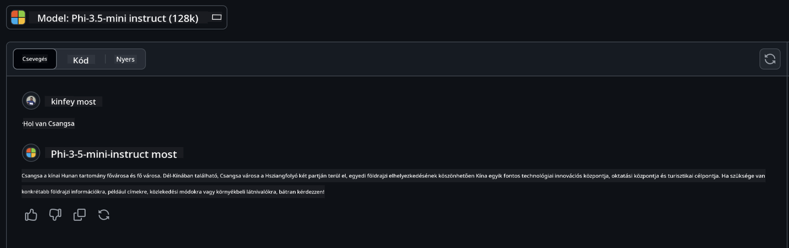

<!--
CO_OP_TRANSLATOR_METADATA:
{
  "original_hash": "124ad36cfe96f74038811b6e2bb93e9d",
  "translation_date": "2025-06-26T02:45:48+00:00",
  "source_file": "19-slm/README.md",
  "language_code": "hu"
}
-->

A modellek a legközvetlenebb módja. Gyorsan hozzáférhet a Phi-3/3.5-Instruct modellhez a GitHub Modellek segítségével. Az Azure AI Inference SDK / OpenAI SDK-val kombinálva kódon keresztül elérheti az API-t a Phi-3/3.5-Instruct hívásának befejezéséhez. Különböző hatásokat is tesztelhet a Playground segítségével. - Demo: A Phi-3-mini és Phi-3.5-mini hatásainak összehasonlítása kínai szcenáriókban   **Azure AI Studio** Vagy ha a látás és MoE modelleket szeretnénk használni, az Azure AI Studio segítségével befejezhetjük a hívást. Ha érdekel, elolvashatja a Phi-3 Cookbook-ot, hogy megtudja, hogyan hívhatja meg a Phi-3/3.5 Instruct, Vision, MoE-t az Azure AI Studio segítségével [Kattintson erre a linkre](https://github.com/microsoft/Phi-3CookBook/blob/main/md/02.QuickStart/AzureAIStudio_QuickStart.md?WT.mc_id=academic-105485-koreyst) **NVIDIA NIM** Az Azure és a GitHub által biztosított felhőalapú Modell Katalógus megoldások mellett használhatja a [Nivida NIM](https://developer.nvidia.com/nim?WT.mc_id=academic-105485-koreyst) segítségével a kapcsolódó hívások befejezéséhez. Felkeresheti a NIVIDA NIM-et a Phi-3/3.5 Család API-hívásainak befejezéséhez. Az NVIDIA NIM (NVIDIA Inference Microservices) egy sor gyorsított inferencia mikroszolgáltatás, amely segít a fejlesztőknek AI modellek hatékony telepítésében különböző környezetekben, beleértve a felhőket, adatközpontokat és munkaállomásokat. Íme néhány kulcsfontosságú jellemzője az NVIDIA NIM-nek: - **Könnyű telepítés:** A NIM lehetővé teszi az AI modellek telepítését egyetlen parancs segítségével, ami egyszerűvé teszi az integrációt a meglévő munkafolyamatokba. - **Optimalizált teljesítmény:** Az NVIDIA előre optimalizált inferencia motorjait, mint például a TensorRT és TensorRT-LLM, használja, hogy alacsony késleltetést és magas áteresztőképességet biztosítson. - **Skálázhatóság:** A NIM támogatja az automatikus skálázást a Kubernetes-en, lehetővé téve a változó munkaterhelések hatékony kezelését. - **Biztonság és kontroll:** A szervezetek saját infrastruktúrájukon önállóan üzemeltethetik a NIM mikroszolgáltatásokat, így megőrizhetik az irányítást adataik és alkalmazásaik felett. - **Standard API-k:** A NIM iparági szabványú API-kat biztosít, amelyek megkönnyítik az AI alkalmazások, például chatbotok, AI asszisztensek és mások építését és integrálását. A NIM része az NVIDIA AI Enterprise-nek, amely célja az AI modellek telepítésének és működtetésének egyszerűsítése, biztosítva, hogy hatékonyan működjenek az NVIDIA GPU-kon. - Demo: A Nividia NIM használata a Phi-3.5-Vision-API hívására [[Kattintson erre a linkre](../../../19-slm/python/Phi-3-Vision-Nividia-NIM.ipynb)] ### Inferencia Phi-3/3.5 helyi környezetben Az inferencia a Phi-3 vagy bármely nyelvi modell, mint a GPT-3 esetében arra utal, hogy válaszokat vagy előrejelzéseket generál az általa kapott bemenetek alapján. Amikor megad egy promptot vagy kérdést a Phi-3-nak, az a tanított neurális hálózatát használja a legvalószínűbb és releváns válasz kikövetkeztetésére, az általa tanult adatok mintáinak és kapcsolódásainak elemzésével. **Hugging Face Transformer** A Hugging Face Transformers egy erőteljes könyvtár, amelyet természetes nyelvi feldolgozásra (NLP) és más gépi tanulási feladatokra terveztek. Íme néhány kulcsfontosságú pont róla: 1. **Előre tanított modellek**: Több ezer előre tanított modellt biztosít, amelyeket különböző feladatokra lehet használni, például szöveg osztályozás, névjegy felismerés, kérdés-válasz, összefoglalás, fordítás és szöveg generálás. 2. **Keretrendszer interoperabilitás**: A könyvtár több mély tanulási keretrendszert támogat, köztük a PyTorch, TensorFlow és JAX. Ez lehetővé teszi, hogy egy modellt egy keretrendszerben képezzen ki, majd egy másikban használjon. 3. **Multimodális képességek**: Az NLP mellett a Hugging Face Transformers támogatja a számítógépes látás (például kép osztályozás, objektum felismerés) és audio feldolgozás (például beszédfelismerés, audio osztályozás) feladatait is. 4. **Könnyű használat**: A könyvtár API-kat és eszközöket kínál a modellek könnyű letöltésére és finomhangolására, így hozzáférhető mind a kezdők, mind a szakértők számára. 5. **Közösség és erőforrások**: A Hugging Face egy élénk közösséggel és kiterjedt dokumentációval, oktatóanyagokkal és útmutatókkal rendelkezik, hogy segítsen a felhasználóknak elkezdeni és a könyvtár lehetőségeit maximálisan kihasználni. [hivatalos dokumentáció](https://huggingface.co/docs/transformers/index?WT.mc_id=academic-105485-koreyst) vagy a [GitHub tárolójuk](https://github.com/huggingface/transformers?WT.mc_id=academic-105485-koreyst). Ez a leggyakrabban használt módszer, de GPU gyorsítást igényel. Végül is a Vision és MoE jelenetek sok számítást igényelnek, ami nagyon korlátozott lesz a CPU-ban, ha nincsenek kvantálva. - Demo: Transformer használata a Phi-3.5-Instuct hívására [Kattintson erre a linkre](../../../19-slm/python/phi35-instruct-demo.ipynb) - Demo: Transformer használata a Phi-3.5-Vision hívására [Kattintson erre a linkre](../../../19-slm/python/phi35-vision-demo.ipynb) - Demo: Transformer használata a Phi-3.5-MoE hívására [Kattintson erre a linkre](../../../19-slm/python/phi35_moe_demo.ipynb) **Ollama** [Ollama](https://ollama.com/?WT.mc_id=academic-105485-koreyst) egy platform, amely megkönnyíti a nagy nyelvi modellek (LLM) helyi futtatását a saját gépén. Támogat különböző modelleket, mint a Llama 3.1, Phi 3, Mistral és Gemma 2, többek között. A platform egyszerűsíti a folyamatot azáltal, hogy egyetlen csomagba összegyűjti a modell súlyait, konfigurációját és adatait, így hozzáférhetőbbé teszi a felhasználók számára saját modellek testreszabását és létrehozását. Az Ollama elérhető macOS, Linux és Windows operációs rendszerekre. Nagyszerű eszköz, ha LLM-ekkel szeretne kísérletezni vagy telepíteni anélkül, hogy felhőszolgáltatásokra támaszkodna. Az Ollama a legközvetlenebb módja, csak végre kell hajtania a következő utasítást. ```bash

ollama run phi3.5

``` **ONNX Runtime for GenAI** [ONNX Runtime](https://github.com/microsoft/onnxruntime-genai?WT.mc_id=academic-105485-koreyst) egy platformközi inferencia és gépi tanulási gyorsító. Az ONNX Runtime for Generative AI (GENAI) egy erőteljes eszköz, amely segít generatív AI modellek hatékony futtatásában különböző platformokon. ## Mi az ONNX Runtime? Az ONNX Runtime egy nyílt forráskódú projekt, amely lehetővé teszi a gépi tanulási modellek nagy teljesítményű inferenciáját. Támogatja az Open Neural Network Exchange (ONNX) formátumú modelleket, amely egy szabvány a gépi tanulási modellek reprezentálására. Az ONNX Runtime inferencia gyorsabb ügyfélélményeket és alacsonyabb költségeket tesz lehetővé, támogatva a mély tanulási keretrendszerek, mint a PyTorch és TensorFlow/Keras, valamint a klasszikus gépi tanulási könyvtárak, mint a scikit-learn, LightGBM, XGBoost stb. Az ONNX Runtime kompatibilis különböző hardverekkel, illesztőprogramokkal és operációs rendszerekkel, és optimális teljesítményt biztosít hardvergyorsítók alkalmazásával, ahol lehetséges, a grafikus optimalizációk és átalakítások mellett. ## Mi az a generatív AI? A generatív AI olyan AI rendszerekre utal, amelyek képesek új tartalmak, például szöveg, kép vagy zene generálására az általuk tanított adatok alapján. Példák közé tartoznak a nyelvi modellek, mint a GPT-3, és kép generáló modellek, mint a Stable Diffusion. Az ONNX Runtime for GenAI könyvtár biztosítja a generatív AI hurkot az ONNX modellekhez, beleértve az inferenciát az ONNX Runtime-mal, logitok feldolgozását, keresést és mintavételt, valamint a KV gyorsítótár kezelését. ## ONNX Runtime for GENAI Az ONNX Runtime for GENAI kiterjeszti az ONNX Runtime képességeit a generatív AI modellek támogatására. Íme néhány kulcsfontosságú jellemző: - **Széles platform támogatás:** Különböző platformokon működik, beleértve a Windows, Linux, macOS, Android és iOS rendszereket. - **Modell támogatás:** Támogat számos népszerű generatív AI modellt, mint például LLaMA, GPT-Neo, BLOOM és mások. - **Teljesítmény optimalizálás:** Tartalmaz optimalizációkat különböző hardvergyorsítókhoz, mint az NVIDIA GPU-k, AMD GPU-k és mások. - **Könnyű használat:** API-kat biztosít a könnyű integrációhoz az alkalmazásokba, lehetővé téve szöveg, kép és más tartalmak generálását minimális kóddal. - A felhasználók magas szintű generate() módszert hívhatnak meg, vagy futtathatják a modell minden iterációját egy hurokban, egy-egy token generálásával, és opcionálisan frissíthetik a generálási paramétereket a hurokban. - Az ONNX Runtime támogatja a mohó/sugaras keresést és TopP, TopK mintavételt a token sorozatok generálásához, valamint beépített logit feldolgozást, mint az ismétlési büntetések. Könnyen hozzáadhat saját pontozást is. ## Kezdés Az ONNX Runtime for GENAI használatának megkezdéséhez kövesse ezeket a lépéseket: ### Telepítse az ONNX Runtime-t: ```Python
pip install onnxruntime
``` ### Telepítse a generatív AI kiterjesztéseket: ```Python
pip install onnxruntime-genai
``` ### Futasson egy modellt: Íme egy egyszerű példa Pythonban: ```Python
import onnxruntime_genai as og

model = og.Model('path_to_your_model.onnx')

tokenizer = og.Tokenizer(model)

input_text = "Hello, how are you?"

input_tokens = tokenizer.encode(input_text)

output_tokens = model.generate(input_tokens)

output_text = tokenizer.decode(output_tokens)

print(output_text) 
``` ### Demo: Az ONNX Runtime GenAI használata a Phi-3.5-Vision hívására ```python

import onnxruntime_genai as og

model_path = './Your Phi-3.5-vision-instruct ONNX Path'

img_path = './Your Image Path'

model = og.Model(model_path)

processor = model.create_multimodal_processor()

tokenizer_stream = processor.create_stream()

text = "Your Prompt"

prompt = "<|user|>\n"

prompt += "<|image_1|>\n"

prompt += f"{text}<|end|>\n"

prompt += "<|assistant|>\n"

image = og.Images.open(img_path)

inputs = processor(prompt, images=image)

params = og.GeneratorParams(model)

params.set_inputs(inputs)

params.set_search_options(max_length=3072)

generator = og.Generator(model, params)

while not generator.is_done():

    generator.compute_logits()
    
    generator.generate_next_token()

    new_token = generator.get_next_tokens()[0]
    
    code += tokenizer_stream.decode(new_token)
    
    print(tokenizer_stream.decode(new_token), end='', flush=True)

``` **Egyebek** Az ONNX Runtime és Ollama referencia módszerek mellett a különböző gyártók által biztosított modell referencia módszerek alapján is elvégezhetjük a kvantitatív modellek referenciáját. Ilyen például az Apple MLX keretrendszer az Apple Metallal, Qualcomm QNN NPU-val, Intel OpenVINO CPU/GPU-val stb. További tartalmat is találhat a [Phi-3 Cookbook](https://github.com/microsoft/phi-3cookbook?WT.mc_id=academic-105485-koreyst) oldalon. ## Továbbiak Megtanultuk a Phi-3/3.5 Család alapjait, de az SLM további megismeréséhez több tudásra van szükségünk. A válaszokat a Phi-3 Cookbook-ban találhatja meg. Ha többet szeretne megtudni, látogasson el a [Phi-3 Cookbook](https://github.com/microsoft/phi-3cookbook?WT.mc_id=academic-105485-koreyst) oldalra.

**Jogi nyilatkozat**:  
Ez a dokumentum az [Co-op Translator](https://github.com/Azure/co-op-translator) AI fordítószolgáltatással készült. Bár igyekszünk a pontosságra törekedni, kérjük, vegye figyelembe, hogy az automatikus fordítások hibákat vagy pontatlanságokat tartalmazhatnak. Az eredeti dokumentum eredeti nyelvén tekintendő a hiteles forrásnak. Fontos információk esetén javasolt a professzionális emberi fordítás igénybevétele. Nem vállalunk felelősséget az ezen fordítás használatából eredő félreértésekért vagy félreértelmezésekért.