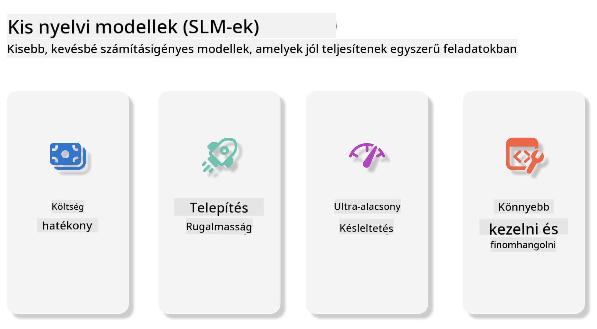
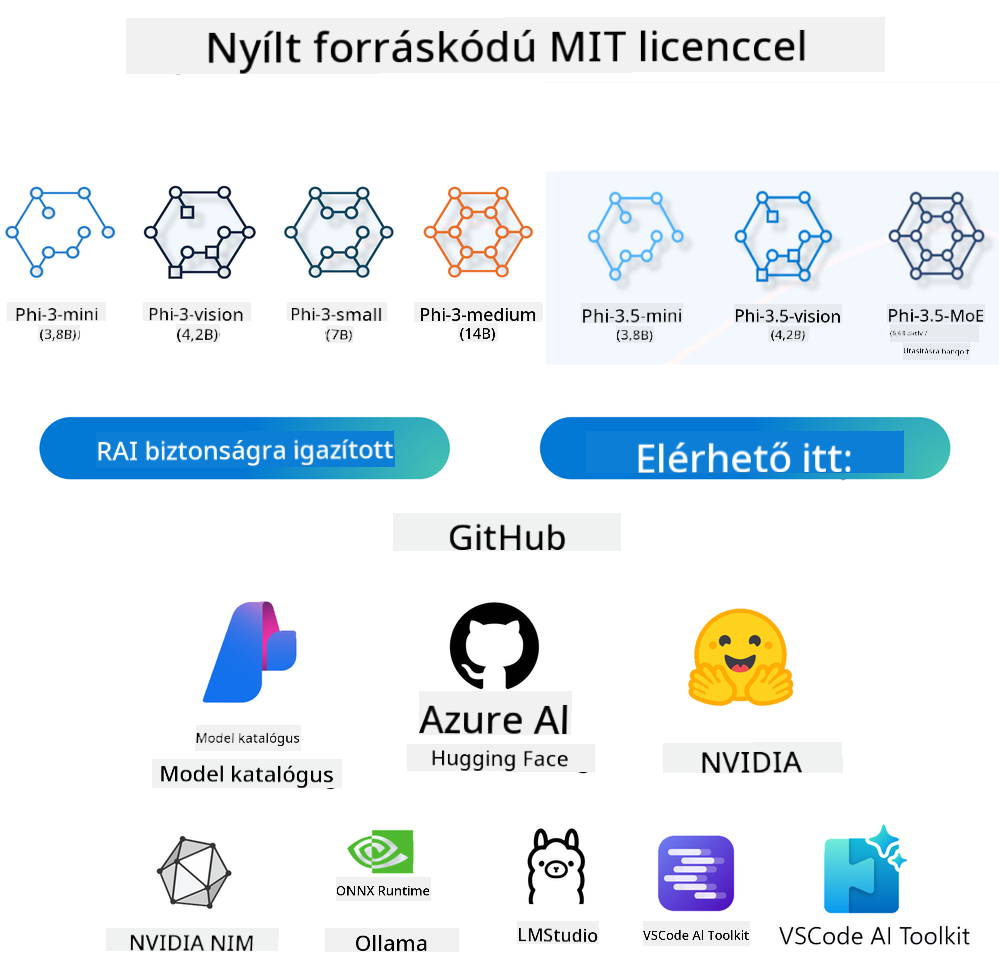

<!--
CO_OP_TRANSLATOR_METADATA:
{
  "original_hash": "124ad36cfe96f74038811b6e2bb93e9d",
  "translation_date": "2025-07-09T18:44:38+00:00",
  "source_file": "19-slm/README.md",
  "language_code": "hu"
}
-->
# Bevezetés a kis nyelvi modellekbe a generatív MI kezdőknek
A generatív MI az a mesterséges intelligencia izgalmas területe, amely olyan rendszerek létrehozására fókuszál, amelyek képesek új tartalmak generálására. Ezek a tartalmak lehetnek szövegek, képek, zene vagy akár teljes virtuális környezetek is. A generatív MI egyik legizgalmasabb alkalmazási területe a nyelvi modellek világa.

## Mik azok a kis nyelvi modellek?

A kis nyelvi modell (SLM) a nagy nyelvi modellek (LLM) egy kisebb, egyszerűsített változata, amely sok LLM-hez hasonló architekturális elvet és technikát használ, miközben jelentősen csökkentett számítási igénnyel rendelkezik.

Az SLM-ek olyan nyelvi modellek, amelyek emberhez hasonló szövegek generálására készültek. A nagyobb modellekkel, például a GPT-4-gyel ellentétben az SLM-ek kompaktabbak és hatékonyabbak, így ideálisak olyan alkalmazásokhoz, ahol korlátozottak a számítási erőforrások. Méretük ellenére számos feladatot képesek ellátni. Általában az SLM-eket LLM-ek tömörítésével vagy desztillálásával hozzák létre, céljuk, hogy megőrizzék az eredeti modell funkcionalitásának és nyelvi képességeinek jelentős részét. A modell méretének csökkentése egyszerűsíti a komplexitást, így az SLM-ek hatékonyabbak mind memóriahasználat, mind számítási igény szempontjából. Ezek az optimalizációk ellenére az SLM-ek széles körű természetes nyelvfeldolgozási (NLP) feladatokat képesek ellátni:

- Szöveg generálás: Koherens és kontextusban releváns mondatok vagy bekezdések létrehozása.
- Szöveg kiegészítés: Mondatok előrejelzése és befejezése adott kiinduló szöveg alapján.
- Fordítás: Szöveg átalakítása egyik nyelvről a másikra.
- Összefoglalás: Hosszú szövegek tömörítése rövidebb, könnyebben emészthető összefoglalókká.

Bár teljesítményük vagy mélyebb megértésük terén némi kompromisszumot kell kötniük a nagyobb modellekhez képest.

## Hogyan működnek a kis nyelvi modellek?
Az SLM-eket hatalmas mennyiségű szöveges adaton tanítják. A tanulás során elsajátítják a nyelv mintázatait és szerkezetét, így képesek olyan szövegeket generálni, amelyek nyelvtanilag helyesek és kontextusban is megfelelőek. A tanítási folyamat a következő lépésekből áll:

- Adatgyűjtés: Nagy szöveges adatbázisok összegyűjtése különböző forrásokból.
- Előfeldolgozás: Az adatok tisztítása és rendszerezése, hogy alkalmasak legyenek a tanításra.
- Tanítás: Gépi tanulási algoritmusok alkalmazása a modell szövegértési és generálási képességeinek fejlesztésére.
- Finomhangolás: A modell teljesítményének javítása specifikus feladatokra.

Az SLM-ek fejlesztése összhangban áll azzal a növekvő igénnyel, hogy olyan modelleket hozzunk létre, amelyek erőforrás-korlátozott környezetekben, például mobil eszközökön vagy élő számítástechnikai platformokon is használhatók, ahol a teljes méretű LLM-ek túl erőforrás-igényesek lennének. Az SLM-ek az erőforrás-hatékonyságra fókuszálva egyensúlyt teremtenek a teljesítmény és az elérhetőség között, így szélesebb körben alkalmazhatók különböző területeken.



## Tanulási célok

Ebben a leckében szeretnénk bemutatni az SLM-ekkel kapcsolatos ismereteket, és összekapcsolni azokat a Microsoft Phi-3-mal, hogy különböző szöveges tartalmak, látás és MoE (Mixture of Experts) szcenáriókat tanuljunk meg.

A lecke végére képesnek kell lenned válaszolni az alábbi kérdésekre:

- Mi az az SLM?
- Mi a különbség az SLM és az LLM között?
- Mi a Microsoft Phi-3/3.5 család?
- Hogyan lehet használni a Microsoft Phi-3/3.5 családot?

Készen állsz? Kezdjünk neki!

## A nagy nyelvi modellek (LLM) és a kis nyelvi modellek (SLM) közötti különbségek

Mind az LLM-ek, mind az SLM-ek a valószínűségi gépi tanulás alapelveire épülnek, hasonló megközelítéseket követnek architektúrájuk, tanítási módszereik, adatgenerálási folyamataik és modellértékelési technikáik terén. Ugyanakkor több kulcsfontosságú tényező megkülönbözteti ezt a két modelltípust.

## Kis nyelvi modellek alkalmazási területei

Az SLM-ek számos területen alkalmazhatók, többek között:

- Chatbotok: Ügyfélszolgálat nyújtása és felhasználókkal való interaktív kommunikáció.
- Tartalomkészítés: Írók segítése ötletek generálásában vagy akár teljes cikkek megírásában.
- Oktatás: Diákok támogatása írásbeli feladatokban vagy új nyelvek tanulásában.
- Akadálymentesítés: Segédeszközök létrehozása fogyatékkal élők számára, például szövegfelolvasó rendszerek.

**Méret**

Az LLM-ek és az SLM-ek közötti egyik legfőbb különbség a modell mérete. Az LLM-ek, mint például a ChatGPT (GPT-4), becslések szerint akár 1,76 billió paraméterből állhatnak, míg az olyan nyílt forráskódú SLM-ek, mint a Mistral 7B, jelentősen kevesebb paraméterrel, körülbelül 7 milliárddal rendelkeznek. Ez a különbség elsősorban a modellarchitektúrában és a tanítási folyamatokban rejlik. Például a ChatGPT önfigyelő mechanizmust alkalmaz egy kódoló-dekódoló keretrendszerben, míg a Mistral 7B csúszó ablakos figyelmet használ, ami hatékonyabb tanítást tesz lehetővé egy csak dekódolós modellben. Ez az architekturális eltérés mély hatással van a modellek komplexitására és teljesítményére.

**Megértés**

Az SLM-ek általában adott szakterületekre optimalizáltak, így nagyon specializáltak, de korlátozottabbak lehetnek abban, hogy széles körű kontextuális megértést nyújtsanak több tudományterületen. Ezzel szemben az LLM-ek célja, hogy emberi intelligenciához hasonló képességeket szimuláljanak átfogóbb szinten. Nagy, változatos adatbázisokon tanítva az LLM-ek jól teljesítenek különféle területeken, nagyobb sokoldalúságot és alkalmazkodóképességet kínálva. Ennek eredményeként az LLM-ek alkalmasabbak szélesebb körű feladatokra, például természetes nyelvfeldolgozásra és programozásra.

**Számítási igény**

Az LLM-ek tanítása és üzemeltetése erőforrás-igényes folyamat, gyakran jelentős számítási infrastruktúrát igényel, beleértve nagy GPU klasztereket. Például egy ChatGPT-szerű modell teljes körű tanítása több ezer GPU-t igényelhet hosszú időn keresztül. Ezzel szemben az SLM-ek, kisebb paraméterszámuk miatt, könnyebben elérhetők számítási erőforrások szempontjából. Olyan modellek, mint a Mistral 7B, helyi gépeken is taníthatók és futtathatók mérsékelt GPU kapacitással, bár a tanítás még így is több órát igényel több GPU-n.

**Elfogultság**

Az elfogultság ismert probléma az LLM-eknél, főként a tanító adatok jellege miatt. Ezek a modellek gyakran nyers, nyilvánosan elérhető internetes adatokat használnak, amelyek alul- vagy félreprezentálhatnak bizonyos csoportokat, hibás címkézést tartalmazhatnak, vagy nyelvi elfogultságokat tükrözhetnek, amelyeket a dialektusok, földrajzi eltérések és nyelvtani szabályok befolyásolnak. Emellett az LLM-ek összetett architektúrája véletlenül felerősítheti az elfogultságot, amely finomhangolás nélkül rejtve maradhat. Ezzel szemben az SLM-ek, mivel szűkebb, adott szakterületre fókuszáló adatbázisokon tanulnak, kevésbé hajlamosak ilyen elfogultságokra, bár nem teljesen mentesek tőlük.

**Inferálás**

Az SLM-ek kisebb mérete jelentős előnyt jelent az inferálási sebesség terén, lehetővé téve, hogy helyi hardveren hatékonyan generáljanak kimeneteket anélkül, hogy kiterjedt párhuzamos feldolgozásra lenne szükség. Ezzel szemben az LLM-ek méretük és komplexitásuk miatt gyakran jelentős párhuzamos számítási erőforrásokat igényelnek elfogadható inferálási idő eléréséhez. Több egyidejű felhasználó jelenléte tovább lassíthatja az LLM-ek válaszidejét, különösen nagy léptékű üzemeltetés esetén.

Összefoglalva, bár az LLM-ek és az SLM-ek alapvetően a gépi tanulás elveire épülnek, jelentős különbségek vannak közöttük a modellméret, az erőforrásigény, a kontextuális megértés, az elfogultságra való hajlam és az inferálási sebesség tekintetében. Ezek a különbségek tükrözik, hogy mely felhasználási területekre alkalmasak leginkább: az LLM-ek sokoldalúbbak, de erőforrás-igényesek, míg az SLM-ek adott szakterületeken hatékonyabbak, kevesebb számítási igénnyel.

***Megjegyzés: Ebben a fejezetben a Microsoft Phi-3 / 3.5 példáján keresztül mutatjuk be az SLM-eket.***

## Bemutatkozik a Phi-3 / Phi-3.5 család

A Phi-3 / 3.5 család elsősorban szöveges, látási és Agent (MoE) alkalmazási szcenáriókra fókuszál:

### Phi-3 / 3.5 Instruct

Főként szöveg generálásra, csevegés befejezésére és tartalmi információk kinyerésére használatos.

**Phi-3-mini**

A 3,8 milliárd paraméteres nyelvi modell elérhető a Microsoft Azure AI Studio-ban, a Hugging Face-en és az Ollama platformon. A Phi-3 modellek jelentősen felülmúlják az azonos vagy nagyobb méretű nyelvi modelleket kulcsfontosságú benchmarkokon (lásd az alábbi benchmark számokat, ahol a magasabb érték jobb). A Phi-3-mini kétszer akkora méretű modelleket is felülmúl, míg a Phi-3-small és Phi-3-medium még nagyobb modelleket, köztük a GPT-3.5-öt is.

**Phi-3-small & medium**

Mindössze 7 milliárd paraméterrel a Phi-3-small több nyelvi, érvelési, kódolási és matematikai benchmarkon is legyőzi a GPT-3.5T-t.

A 14 milliárd paraméteres Phi-3-medium folytatja ezt a trendet, és felülmúlja a Gemini 1.0 Pro modellt.

**Phi-3.5-mini**

Ezt tekinthetjük a Phi-3-mini továbbfejlesztett változatának. Bár a paraméterek száma nem változott, javult a többnyelvű támogatás (több mint 20 nyelv: arab, kínai, cseh, dán, holland, angol, finn, francia, német, héber, magyar, olasz, japán, koreai, norvég, lengyel, portugál, orosz, spanyol, svéd, thai, török, ukrán), és erősebb támogatást kapott a hosszú kontextus kezelésére.

A 3,8 milliárd paraméteres Phi-3.5-mini felülmúlja az azonos méretű nyelvi modelleket, és vetekszik a kétszer akkora modellekkel.

### Phi-3 / 3.5 Vision

A Phi-3/3.5 Instruct modellt tekinthetjük Phi értelmező képességének, míg a Vision adja meg Phi számára a „szemeket”, hogy megértse a világot.

**Phi-3-Vision**

A Phi-3-vision, mindössze 4,2 milliárd paraméterrel, folytatja ezt a trendet, és felülmúlja a nagyobb modelleket, mint például a Claude-3 Haiku és a Gemini 1.0 Pro V általános vizuális érvelési feladatokban, OCR-ben, valamint táblázatok és diagramok értelmezésében.

**Phi-3.5-Vision**

A Phi-3.5-Vision a Phi-3-Vision továbbfejlesztett változata, amely több kép támogatását is lehetővé teszi. Ezt úgy is felfoghatjuk, mint a látás képességének fejlesztését: nemcsak képeket, hanem videókat is képes „látni”.

A Phi-3.5-vision felülmúlja a nagyobb modelleket, mint a Claude-3.5 Sonnet és a Gemini 1.5 Flash OCR, táblázat- és diagramértési feladatokban, és vetekszik velük az általános vizuális tudásalapú érvelési feladatokban. Több képkockás bemenetet támogat, azaz több kép együttes elemzését is képes elvégezni.

### Phi-3.5-MoE

***Mixture of Experts (MoE)*** lehetővé teszi, hogy a modelleket sokkal kevesebb számítással tanítsák elő, ami azt jelenti, hogy ugyanazzal a számítási költségvetéssel drámaian megnövelhető a modell vagy az adathalmaz mérete egy sűrű modellhez képest. Különösen egy MoE modell sokkal gyorsabban érheti el ugyanazt a minőséget az előtanítás során, mint sűrű megfelelője.

A Phi-3.5-MoE 16x3,8 milliárd paraméteres szakértői modult tartalmaz. A Phi-3.5-MoE, amelynek aktív paraméterszáma mindössze 6,6 milliárd, hasonló szintű érvelési, nyelvi megértési és matematikai képességeket ér el, mint sokkal nagyobb modellek.

A Phi-3/3.5 család modelljeit különböző szcenáriókban használhatjuk. Az LLM-ekkel ellentétben a Phi-3/3.5-mini vagy a Phi-3/3.5-Vision telepíthető élő eszközökre is.

## Hogyan használjuk a Phi-3/3.5 család modelljeit

Szeretnénk a Phi-3/3.5-öt különböző szcenáriókban használni. Ezután különböző helyzetekben fogjuk alkalmazni a Phi-3/3.5-öt.



### Inferálás különbsége a felhő API-jával

**GitHub modellek**

A GitHub modellek a legközvetlenebb módot jelentik. Gyorsan hozzáférhetsz a Phi-3/3.5-Instruct modellhez a GitHub modelleken keresztül. Az Azure AI Inference SDK / OpenAI SDK-val kombinálva kódon keresztül is elérheted az API-t, hogy vég
- **Biztonság és irányítás:** A szervezetek megőrizhetik az adataik és alkalmazásaik feletti kontrollt, ha saját maguk üzemeltetik a NIM mikroszolgáltatásokat a saját kezelt infrastruktúrájukon.
- **Szabványos API-k:** A NIM iparági szabványos API-kat kínál, így könnyű AI alkalmazásokat, például chatbotokat, AI asszisztenseket és egyebeket fejleszteni és integrálni.

A NIM az NVIDIA AI Enterprise része, amelynek célja az AI modellek telepítésének és működtetésének egyszerűsítése, biztosítva, hogy hatékonyan fussanak NVIDIA GPU-kon.

- Demó: Nividia NIM használata Phi-3.5-Vision-API hívásához [[Kattints ide](../../../19-slm/python/Phi-3-Vision-Nividia-NIM.ipynb)]


### Phi-3/3.5 következtetés helyi környezetben
A Phi-3 vagy bármely nyelvi modell, például a GPT-3 esetében a következtetés azt a folyamatot jelenti, amikor a modell a bemenet alapján válaszokat vagy előrejelzéseket generál. Amikor egy kérdést vagy promptot adsz a Phi-3-nak, a betanított neurális hálózat segítségével elemzi az adatmintákat és összefüggéseket, hogy a legvalószínűbb és legrelevánsabb választ adja.

**Hugging Face Transformer**  
A Hugging Face Transformers egy erőteljes könyvtár, amely természetes nyelvfeldolgozáshoz (NLP) és más gépi tanulási feladatokhoz készült. Íme néhány fontos tudnivaló róla:

1. **Előre betanított modellek:** Több ezer előre betanított modellt kínál, amelyeket különféle feladatokra lehet használni, például szöveg osztályozásra, név szerinti entitás felismerésre, kérdés-válaszra, összefoglalásra, fordításra és szöveggenerálásra.

2. **Keretrendszer interoperabilitás:** Több mélytanulási keretrendszert támogat, például PyTorch, TensorFlow és JAX. Ez lehetővé teszi, hogy egy modellt az egyik keretrendszerben taníts meg, majd egy másikban használd.

3. **Multimodális képességek:** Az NLP mellett támogatja a számítógépes látás (pl. képosztályozás, objektumfelismerés) és hangfeldolgozás (pl. beszédfelismerés, hangosztályozás) feladatokat is.

4. **Könnyű használat:** API-kat és eszközöket kínál a modellek egyszerű letöltéséhez és finomhangolásához, így kezdők és szakértők számára egyaránt hozzáférhető.

5. **Közösség és források:** A Hugging Face élénk közösséggel rendelkezik, valamint kiterjedt dokumentációval, oktatóanyagokkal és útmutatókkal, amelyek segítik a felhasználókat a kezdésben és a könyvtár hatékony használatában.  
[Hivatalos dokumentáció](https://huggingface.co/docs/transformers/index?WT.mc_id=academic-105485-koreyst) vagy a [GitHub tárhely](https://github.com/huggingface/transformers?WT.mc_id=academic-105485-koreyst).

Ez a leggyakrabban használt módszer, de GPU gyorsítást igényel. Végül is a Vision és MoE jelenetek sok számítást igényelnek, amit CPU-n kvantálás nélkül nagyon korlátozottan lehet csak végezni.


- Demó: Transformer használata Phi-3.5-Instuct hívásához [Kattints ide](../../../19-slm/python/phi35-instruct-demo.ipynb)

- Demó: Transformer használata Phi-3.5-Vision hívásához [Kattints ide](../../../19-slm/python/phi35-vision-demo.ipynb)

- Demó: Transformer használata Phi-3.5-MoE hívásához [Kattints ide](../../../19-slm/python/phi35_moe_demo.ipynb)

**Ollama**  
Az [Ollama](https://ollama.com/?WT.mc_id=academic-105485-koreyst) egy platform, amely megkönnyíti a nagy nyelvi modellek (LLM-ek) helyi futtatását a gépeden. Támogat több modellt, például Llama 3.1, Phi 3, Mistral és Gemma 2, többek között. A platform leegyszerűsíti a folyamatot azáltal, hogy a modell súlyokat, konfigurációt és adatokat egy csomagba foglalja, így könnyebben testreszabható és létrehozható saját modell. Az Ollama elérhető macOS, Linux és Windows rendszerekre. Kiváló eszköz, ha szeretnél kísérletezni vagy telepíteni LLM-eket anélkül, hogy felhőszolgáltatásokra támaszkodnál. Az Ollama a legközvetlenebb mód, csak futtatnod kell a következő parancsot.


```bash

ollama run phi3.5

```


**ONNX Runtime a GenAI-hoz**

Az [ONNX Runtime](https://github.com/microsoft/onnxruntime-genai?WT.mc_id=academic-105485-koreyst) egy platformok közötti gépi tanulási gyorsító, amely támogatja az inferenciát és a tanítást. Az ONNX Runtime a Generatív AI-hoz (GENAI) egy erőteljes eszköz, amely segít hatékonyan futtatni generatív AI modelleket különböző platformokon.

## Mi az az ONNX Runtime?  
Az ONNX Runtime egy nyílt forráskódú projekt, amely lehetővé teszi a gépi tanulási modellek nagy teljesítményű inferenciáját. Támogatja az Open Neural Network Exchange (ONNX) formátumú modelleket, amely egy szabvány a gépi tanulási modellek ábrázolására. Az ONNX Runtime inferencia gyorsabb ügyfélélményt és alacsonyabb költségeket tesz lehetővé, támogatva a mélytanulási keretrendszerekből, például PyTorch és TensorFlow/Keras, valamint klasszikus gépi tanulási könyvtárakból, mint a scikit-learn, LightGBM, XGBoost származó modelleket. Az ONNX Runtime kompatibilis különböző hardverekkel, driverekkel és operációs rendszerekkel, és optimális teljesítményt nyújt a hardvergyorsítók kihasználásával, valamint gráfoptimalizációkkal és transzformációkkal.

## Mi az a Generatív AI?  
A generatív AI olyan AI rendszerekre utal, amelyek képesek új tartalmakat létrehozni, például szöveget, képeket vagy zenét, a betanított adatok alapján. Példák erre a nyelvi modellek, mint a GPT-3, vagy képgeneráló modellek, mint a Stable Diffusion. Az ONNX Runtime a GenAI-hoz könyvtár biztosítja a generatív AI ciklust az ONNX modellekhez, beleértve az ONNX Runtime inferenciát, logit feldolgozást, keresést és mintavételezést, valamint a KV cache kezelését.

## ONNX Runtime a GENAI-hoz  
Az ONNX Runtime a GENAI-hoz kiterjeszti az ONNX Runtime képességeit, hogy támogassa a generatív AI modelleket. Néhány fő jellemző:

- **Széles platformtámogatás:** Működik Windows, Linux, macOS, Android és iOS rendszereken.
- **Modelltámogatás:** Számos népszerű generatív AI modellt támogat, például LLaMA, GPT-Neo, BLOOM és másokat.
- **Teljesítményoptimalizálás:** Tartalmaz optimalizációkat különböző hardvergyorsítókhoz, mint az NVIDIA GPU-k, AMD GPU-k és mások.
- **Könnyű használat:** API-kat biztosít az egyszerű integrációhoz, lehetővé téve szöveg, képek és egyéb tartalmak generálását minimális kóddal.
- A felhasználók hívhatnak egy magas szintű generate() metódust, vagy futtathatják a modellt ciklusban, egy token generálásával egyszerre, és opcionálisan frissíthetik a generálási paramétereket a cikluson belül.
- Az ONNX runtime támogatja a greedy/beam keresést és a TopP, TopK mintavételezést token sorozatok generálásához, valamint beépített logit feldolgozást, például ismétlődési büntetéseket. Egyedi pontozás is könnyen hozzáadható.

## Első lépések  
Az ONNX Runtime a GENAI-hoz használatának megkezdéséhez kövesd az alábbi lépéseket:

### ONNX Runtime telepítése:  
```Python
pip install onnxruntime
```  
### Generatív AI kiterjesztések telepítése:  
```Python
pip install onnxruntime-genai
```

### Modell futtatása: Íme egy egyszerű példa Pythonban:  
```Python
import onnxruntime_genai as og

model = og.Model('path_to_your_model.onnx')

tokenizer = og.Tokenizer(model)

input_text = "Hello, how are you?"

input_tokens = tokenizer.encode(input_text)

output_tokens = model.generate(input_tokens)

output_text = tokenizer.decode(output_tokens)

print(output_text) 
```  
### Demó: ONNX Runtime GenAI használata Phi-3.5-Vision hívásához


```python

import onnxruntime_genai as og

model_path = './Your Phi-3.5-vision-instruct ONNX Path'

img_path = './Your Image Path'

model = og.Model(model_path)

processor = model.create_multimodal_processor()

tokenizer_stream = processor.create_stream()

text = "Your Prompt"

prompt = "<|user|>\n"

prompt += "<|image_1|>\n"

prompt += f"{text}<|end|>\n"

prompt += "<|assistant|>\n"

image = og.Images.open(img_path)

inputs = processor(prompt, images=image)

params = og.GeneratorParams(model)

params.set_inputs(inputs)

params.set_search_options(max_length=3072)

generator = og.Generator(model, params)

while not generator.is_done():

    generator.compute_logits()
    
    generator.generate_next_token()

    new_token = generator.get_next_tokens()[0]
    
    code += tokenizer_stream.decode(new_token)
    
    print(tokenizer_stream.decode(new_token), end='', flush=True)

```


**Egyebek**

Az ONNX Runtime és az Ollama referencia módszerein túlmenően a különböző gyártók által biztosított modell referencia módszerek alapján kvantitatív modellek referenciáját is elkészíthetjük. Ilyenek például az Apple MLX keretrendszer Apple Metal-lel, Qualcomm QNN NPU-val, Intel OpenVINO CPU/GPU-val stb. További tartalmakat találhatsz a [Phi-3 Cookbook](https://github.com/microsoft/phi-3cookbook?WT.mc_id=academic-105485-koreyst) oldalon.


## Továbbiak

Megismertük a Phi-3/3.5 család alapjait, de az SLM mélyebb megértéséhez további ismeretekre van szükség. A válaszokat megtalálod a Phi-3 Cookbookban. Ha többet szeretnél megtudni, látogass el a [Phi-3 Cookbook](https://github.com/microsoft/phi-3cookbook?WT.mc_id=academic-105485-koreyst) oldalra.

**Jogi nyilatkozat**:  
Ez a dokumentum az AI fordító szolgáltatás, a [Co-op Translator](https://github.com/Azure/co-op-translator) segítségével készült. Bár a pontosságra törekszünk, kérjük, vegye figyelembe, hogy az automatikus fordítások hibákat vagy pontatlanságokat tartalmazhatnak. Az eredeti dokumentum az anyanyelvén tekintendő hiteles forrásnak. Kritikus információk esetén professzionális emberi fordítást javaslunk. Nem vállalunk felelősséget a fordítás használatából eredő félreértésekért vagy téves értelmezésekért.