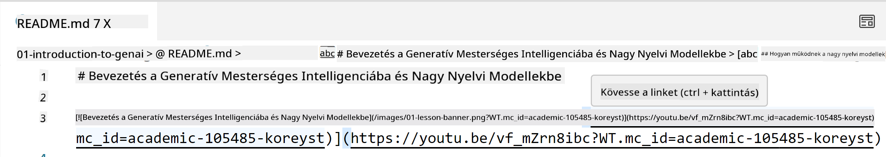
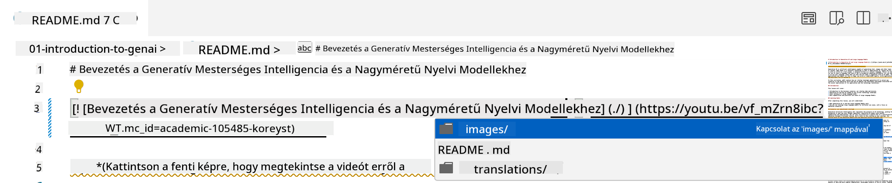
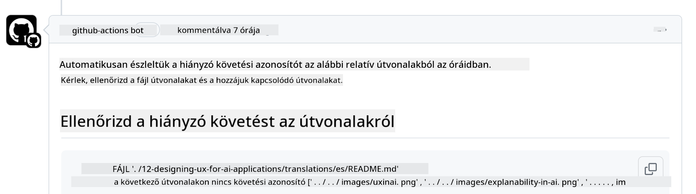
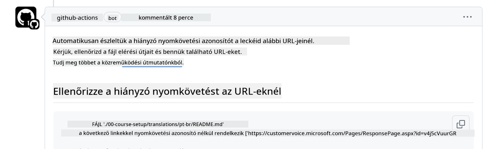
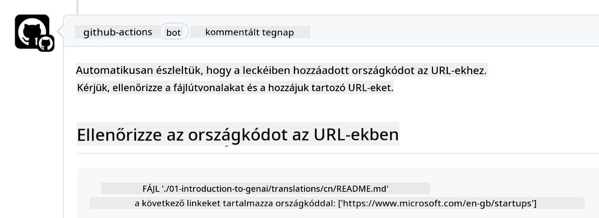

<!--
CO_OP_TRANSLATOR_METADATA:
{
  "original_hash": "57c41f2af71001a2cff9d8eb797cb843",
  "translation_date": "2025-05-19T11:23:08+00:00",
  "source_file": "CONTRIBUTING.md",
  "language_code": "hu"
}
-->
# Közreműködés

Ez a projekt örömmel fogadja a hozzájárulásokat és javaslatokat. A legtöbb hozzájárulás megköveteli, hogy beleegyezzen egy Közreműködői Licencszerződésbe (CLA), amely kijelenti, hogy jogában áll, és ténylegesen megadja nekünk a jogokat a hozzájárulása használatához. További részletekért látogasson el a <https://cla.microsoft.com> oldalra.

> Fontos: amikor szöveget fordít ebben a repóban, kérjük, ügyeljen arra, hogy ne használjon gépi fordítást. A fordításokat a közösség ellenőrzi, ezért kérjük, csak olyan nyelveken vállaljon fordítást, amelyeken jártas.

Amikor benyújt egy pull requestet, a CLA-bot automatikusan meghatározza, hogy szükséges-e CLA-t biztosítania, és ennek megfelelően díszíti a PR-t (például címkével, megjegyzéssel). Egyszerűen kövesse a bot által megadott utasításokat. Ezt csak egyszer kell megtennie az összes repó esetében, amelyik a CLA-t használja.

## Magatartási kódex

Ez a projekt elfogadta a [Microsoft Nyílt Forráskódú Magatartási Kódexét](https://opensource.microsoft.com/codeofconduct/?WT.mc_id=academic-105485-koreyst).
További információkért olvassa el a [Magatartási Kódex GYIK-et](https://opensource.microsoft.com/codeofconduct/faq/?WT.mc_id=academic-105485-koreyst) vagy lépjen kapcsolatba az [opencode@microsoft.com](mailto:opencode@microsoft.com) címen bármilyen további kérdéssel vagy megjegyzéssel.

## Kérdés vagy probléma?

Kérjük, ne nyisson GitHub problémákat általános támogatási kérdésekre, mivel a GitHub listát funkciókérésekre és hibajelentésekre kell használni. Így könnyebben nyomon követhetjük a tényleges problémákat vagy hibákat a kódból, és elkülöníthetjük az általános vitát a tényleges kódtól.

## Hibák, problémák, bugok és hozzájárulások

Amikor bármilyen változtatást benyújt a Generatív AI Kezdőknek repóba, kérjük, kövesse ezeket az ajánlásokat.

* Mindig forkolja a repót a saját fiókjába, mielőtt módosításokat végezne
* Ne kombináljon több változtatást egy pull requestbe. Például külön PR-ben nyújtson be bármilyen hibajavítást és dokumentációfrissítést
* Ha a pull requestje ütközéseket mutat, győződjön meg arról, hogy frissíti a helyi main-t, hogy tükrözze a fő repóban lévő állapotot, mielőtt módosításokat végezne
* Ha fordítást nyújt be, kérjük, hozzon létre egy PR-t az összes lefordított fájlhoz, mivel nem fogadunk el részleges fordításokat a tartalomhoz
* Ha hibát vagy dokumentációjavítást nyújt be, egyetlen PR-ben kombinálhatja a módosításokat, ahol megfelelő

## Általános útmutató az íráshoz

- Győződjön meg arról, hogy minden URL-je szögletes zárójelekbe van foglalva, majd zárójel követi, anélkül, hogy felesleges szóköz lenne körülötte vagy benne ``.
- Győződjön meg arról, hogy minden relatív link (azaz a repóban lévő más fájlokhoz és mappákhoz vezető linkek) `./`-val kezdődik, amely a jelenlegi munkakönyvtárban lévő fájlra vagy mappára utal, vagy `../`-vel, amely egy szülő munkakönyvtárban lévő fájlra vagy mappára utal.
- Győződjön meg arról, hogy minden relatív link (azaz a repóban lévő más fájlokhoz és mappákhoz vezető linkek) rendelkezik nyomkövetési azonosítóval (azaz `?` vagy `&`, majd `wt.mc_id=` vagy `WT.mc_id=`) a végén.
- Győződjön meg arról, hogy a következő domainekről származó URL-ek _github.com, microsoft.com, visualstudio.com, aka.ms, és azure.com_ rendelkeznek nyomkövetési azonosítóval (azaz `?` vagy `&`, majd `wt.mc_id=` vagy `WT.mc_id=`) a végén.
- Győződjön meg arról, hogy a linkjei nem tartalmaznak ország-specifikus nyelvi kódot (azaz `/en-us/` vagy `/en/`).
- Győződjön meg arról, hogy minden kép a `./images` mappában van tárolva.
- Győződjön meg arról, hogy a képek leíró neveket tartalmaznak angol karakterekkel, számokkal és kötőjelekkel a kép nevében.

## GitHub Munkafolyamatok

Amikor benyújt egy pull requestet, négy különböző munkafolyamat aktiválódik, hogy ellenőrizze a korábbi szabályokat.
Egyszerűen kövesse az itt felsorolt utasításokat, hogy teljesítse a munkafolyamat ellenőrzéseit.

- [Ellenőrizze a hibás relatív útvonalakat](../..)
- [Ellenőrizze, hogy az útvonalak rendelkeznek-e nyomkövetéssel](../..)
- [Ellenőrizze, hogy az URL-ek rendelkeznek-e nyomkövetéssel](../..)
- [Ellenőrizze, hogy az URL-ek nem tartalmaznak-e nyelvi kódot](../..)

### Ellenőrizze a hibás relatív útvonalakat

Ez a munkafolyamat biztosítja, hogy bármely relatív útvonal a fájljaiban működjön.
Ez a repó a GitHub oldalakra van telepítve, ezért nagyon óvatosnak kell lennie, amikor a linkeket írja, amelyek mindent összekapcsolnak, hogy ne irányítsa senkit rossz helyre.

Annak biztosítása érdekében, hogy a linkjei megfelelően működjenek, egyszerűen használja a VS code-t, hogy ellenőrizze azt.

Például, amikor bármely link fölé viszi az egeret a fájljaiban, a rendszer felkéri, hogy kövesse a linket az **ctrl + kattintás** megnyomásával

Ha rákattint egy linkre és az nem működik helyben, akkor biztosan aktiválja a munkafolyamatot, és nem fog működni a GitHubon.

A probléma megoldásához próbálja meg a linket a VS code segítségével beírni.

Amikor beírja `./` vagy `../`, a VS code felkéri, hogy válasszon a rendelkezésre álló lehetőségek közül az alapján, amit beírt.

Kövesse az útvonalat a kívánt fájlra vagy mappára kattintva, és biztos lehet benne, hogy az útvonala nem törött.

Miután hozzáadta a helyes relatív útvonalat, mentse el, és nyomja meg a változtatásait, a munkafolyamat újra aktiválódik, hogy ellenőrizze a változtatásait.
Ha átmegy az ellenőrzésen, akkor minden rendben van.

### Ellenőrizze, hogy az útvonalak rendelkeznek-e nyomkövetéssel

Ez a munkafolyamat biztosítja, hogy bármely relatív útvonal rendelkezik nyomkövetéssel.
Ez a repó a GitHub oldalakra van telepítve, ezért nyomon kell követnünk a mozgást a különböző fájlok és mappák között.

Annak biztosítása érdekében, hogy a relatív útvonalak rendelkeznek nyomkövetéssel, egyszerűen ellenőrizze a következő szöveget `?wt.mc_id=` az útvonal végén.
Ha hozzá van fűzve a relatív útvonalaihoz, akkor átmegy az ellenőrzésen.

Ha nem, akkor a következő hibát kaphatja.

A probléma megoldásához próbálja meg megnyitni a fájl útvonalát, amelyet a munkafolyamat kiemelt, és adja hozzá a nyomkövetési azonosítót a relatív útvonalak végéhez.

Miután hozzáadta a nyomkövetési azonosítót, mentse el, és nyomja meg a változtatásait, a munkafolyamat újra aktiválódik, hogy ellenőrizze a változtatásait.
Ha átmegy az ellenőrzésen, akkor minden rendben van.

### Ellenőrizze, hogy az URL-ek rendelkeznek-e nyomkövetéssel

Ez a munkafolyamat biztosítja, hogy bármely webes URL rendelkezik nyomkövetéssel.
Ez a repó mindenki számára elérhető, ezért biztosítania kell, hogy nyomon kövesse a hozzáférést, hogy tudja, honnan érkezik a forgalom.

Annak biztosítása érdekében, hogy az URL-ek rendelkeznek nyomkövetéssel, egyszerűen ellenőrizze a következő szöveget `?wt.mc_id=` az URL végén.
Ha hozzá van fűzve az URL-jeihez, akkor átmegy az ellenőrzésen.

Ha nem, akkor a következő hibát kaphatja.

A probléma megoldásához próbálja meg megnyitni a fájl útvonalát, amelyet a munkafolyamat kiemelt, és adja hozzá a nyomkövetési azonosítót az URL-ek végéhez.

Miután hozzáadta a nyomkövetési azonosítót, mentse el, és nyomja meg a változtatásait, a munkafolyamat újra aktiválódik, hogy ellenőrizze a változtatásait.
Ha átmegy az ellenőrzésen, akkor minden rendben van.

### Ellenőrizze, hogy az URL-ek nem tartalmaznak-e nyelvi kódot

Ez a munkafolyamat biztosítja, hogy bármely webes URL nem tartalmaz ország-specifikus nyelvi kódot.
Ez a repó mindenki számára elérhető világszerte, ezért ügyelnie kell arra, hogy ne tartalmazza az ország nyelvi kódját az URL-ekben.

Annak biztosítása érdekében, hogy az URL-ek nem tartalmaznak ország nyelvi kódot, egyszerűen ellenőrizze a következő szöveget `/en-us/` vagy `/en/` vagy bármely más nyelvi kódot bárhol az URL-ben.
Ha nincs jelen az URL-jeiben, akkor átmegy az ellenőrzésen.

Ha nem, akkor a következő hibát kaphatja.

A probléma megoldásához próbálja meg megnyitni a fájl útvonalát, amelyet a munkafolyamat kiemelt, és távolítsa el az ország nyelvi kódot az URL-ekből.

Miután eltávolította az ország nyelvi kódot, mentse el, és nyomja meg a változtatásait, a munkafolyamat újra aktiválódik, hogy ellenőrizze a változtatásait.
Ha átmegy az ellenőrzésen, akkor minden rendben van.

Gratulálunk! A lehető leghamarabb visszajelzést adunk a hozzájárulásáról.

**Jogi nyilatkozat**:  
Ez a dokumentum az [Co-op Translator](https://github.com/Azure/co-op-translator) mesterséges intelligencia fordítószolgáltatás segítségével lett lefordítva. Bár törekszünk a pontosságra, kérjük, vegye figyelembe, hogy az automatikus fordítások hibákat vagy pontatlanságokat tartalmazhatnak. Az eredeti dokumentum az eredeti nyelvén tekintendő hiteles forrásnak. Kritikus információk esetén javasolt a professzionális emberi fordítás igénybevétele. Nem vállalunk felelősséget a fordítás használatából eredő félreértésekért vagy félreértelmezésekért.