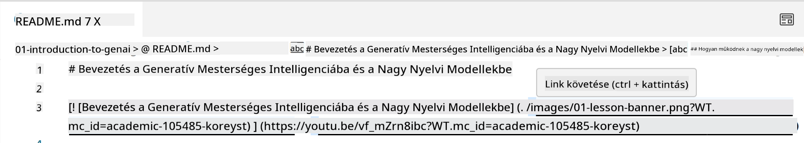
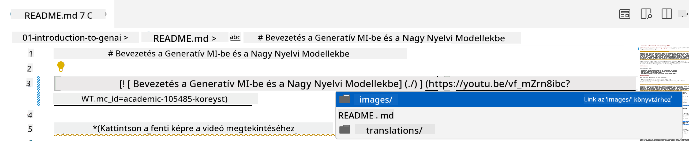
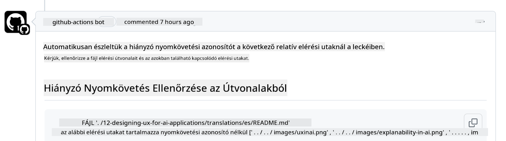
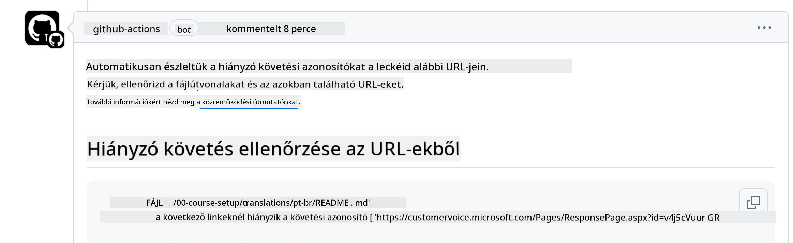
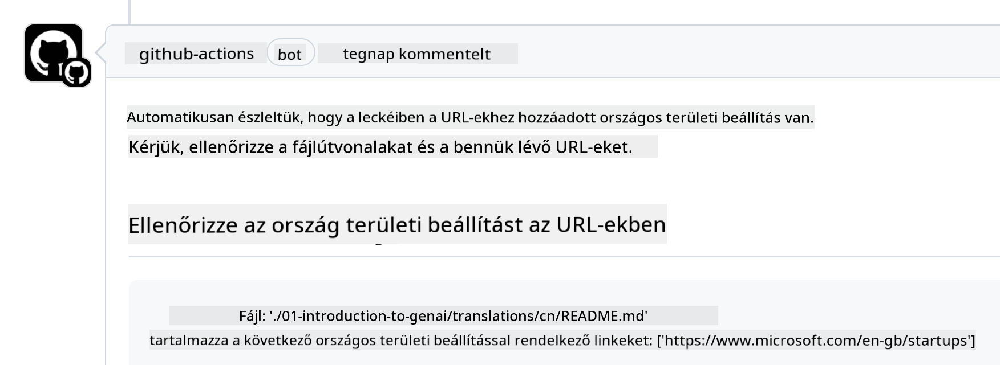

<!--
CO_OP_TRANSLATOR_METADATA:
{
  "original_hash": "57c41f2af71001a2cff9d8eb797cb843",
  "translation_date": "2025-06-25T07:17:34+00:00",
  "source_file": "CONTRIBUTING.md",
  "language_code": "hu"
}
-->
# Hozzájárulás

Ez a projekt örömmel fogad hozzájárulásokat és javaslatokat. A legtöbb hozzájárulás esetében szükséges, hogy elfogadj egy Hozzájárulói Licencszerződést (CLA), amely kijelenti, hogy jogod van, és ténylegesen meg is adod nekünk a jogot, hogy felhasználjuk a hozzájárulásodat. Részletekért látogasd meg a <https://cla.microsoft.com> oldalt.

> Fontos: amikor szöveget fordítasz ebben a repóban, kérjük, győződj meg róla, hogy nem használsz gépi fordítást. A fordításokat a közösség által fogjuk ellenőrizni, ezért csak olyan nyelveken vállalj fordítást, amelyeken jártas vagy.

Amikor pull requestet nyújtasz be, egy CLA-bot automatikusan meghatározza, hogy szükséges-e CLA-t benyújtanod, és ennek megfelelően megjelöli a PR-t (pl. címke, megjegyzés). Egyszerűen kövesd a bot által adott utasításokat. Ezt csak egyszer kell megtenned minden olyan repóban, amely a CLA-nkat használja.

## Magatartási kódex

Ez a projekt a [Microsoft Nyílt Forráskódú Magatartási Kódexét](https://opensource.microsoft.com/codeofconduct/?WT.mc_id=academic-105485-koreyst) fogadta el. További információért olvasd el a [Magatartási Kódex GYIK-et](https://opensource.microsoft.com/codeofconduct/faq/?WT.mc_id=academic-105485-koreyst), vagy lépj kapcsolatba az [opencode@microsoft.com](mailto:opencode@microsoft.com) címmel bármilyen további kérdés vagy észrevétel esetén.

## Kérdés vagy probléma?

Kérjük, ne nyiss GitHub hibajegyet általános támogatási kérdések miatt, mivel a GitHub listát a funkciókérések és hibajelentések számára kell használni. Így könnyebben nyomon követhetjük a tényleges problémákat vagy hibákat a kódból, és külön tarthatjuk az általános megbeszéléseket a tényleges kódtól.

## Elírások, problémák, hibák és hozzájárulások

Amikor bármilyen módosítást nyújtasz be a Generatív AI Kezdőknek repóba, kérjük, kövesd ezeket az ajánlásokat.

* Mindig forkolj a saját fiókodba, mielőtt módosítanál
* Ne kombinálj több módosítást egy pull requestbe. Például külön PR-ben nyújtsd be a hibajavításokat és a dokumentáció frissítéseit
* Ha a pull requested összeolvasztási konfliktusokat mutat, győződj meg róla, hogy a helyi main tükrözi a fő repóban lévőt, mielőtt módosítanál
* Ha fordítást nyújtasz be, kérjük, hozz létre egy PR-t az összes lefordított fájlhoz, mivel nem fogadunk el részleges fordításokat a tartalomra
* Ha elírást vagy dokumentációs javítást nyújtasz be, kombinálhatod a módosításokat egyetlen PR-be, ahol alkalmas

## Általános útmutatás az íráshoz

- Győződj meg róla, hogy az összes URL-ed szögletes zárójelben van, amelyet zárójel követ, és nincsenek extra szóközök körülöttük vagy bennük ``.
- Győződj meg róla, hogy bármilyen relatív hivatkozás (azaz hivatkozások a repó más fájljaira és mappáira) egy `./`-val kezdődik, amely egy fájlra vagy mappára utal az aktuális munkakönyvtárban, vagy egy `../`-val, amely egy fájlra vagy mappára utal egy szülő munkakönyvtárban.
- Győződj meg róla, hogy bármilyen relatív hivatkozás (azaz hivatkozások a repó más fájljaira és mappáira) rendelkezik nyomkövetési azonosítóval (azaz `?` vagy `&`, majd `wt.mc_id=` vagy `WT.mc_id=`) a végén.
- Győződj meg róla, hogy bármilyen URL a következő domainekről _github.com, microsoft.com, visualstudio.com, aka.ms, és azure.com_ rendelkezik nyomkövetési azonosítóval (azaz `?` vagy `&`, majd `wt.mc_id=` vagy `WT.mc_id=`) a végén.
- Győződj meg róla, hogy a hivatkozásaidban nincs ország specifikus lokalizáció (azaz `/en-us/` vagy `/en/`).
- Győződj meg róla, hogy az összes kép a `./images` mappában van tárolva.
- Győződj meg róla, hogy a képek leíró neveket használnak angol karakterekkel, számokkal és kötőjelekkel a kép nevében.

## GitHub munkafolyamatok

Amikor pull requestet nyújtasz be, négy különböző munkafolyamat indul el az előző szabályok érvényesítésére.
Egyszerűen kövesd az itt felsorolt utasításokat, hogy átmenj a munkafolyamat ellenőrzéseken.

- [Törött relatív utak ellenőrzése](../..)
- [Utak nyomkövetésének ellenőrzése](../..)
- [URL-ek nyomkövetésének ellenőrzése](../..)
- [URL-ek lokalizáció nélküli ellenőrzése](../..)

### Törött relatív utak ellenőrzése

Ez a munkafolyamat biztosítja, hogy bármilyen relatív út a fájljaidban működjön.
Ez a repó GitHub oldalakra van telepítve, ezért nagyon óvatosnak kell lenned, amikor beírod a hivatkozásokat, hogy ne irányíts senkit rossz helyre.

Hogy megbizonyosodj róla, hogy a hivatkozásaid megfelelően működnek, egyszerűen használd a VS kódot az ellenőrzéshez.

Például, amikor bármilyen hivatkozás fölé viszed az egeret a fájljaidban, akkor fel lesz kérve, hogy kövesd a hivatkozást a **ctrl + kattintás** megnyomásával.

Ha rákattintasz egy hivatkozásra, és az nem működik helyileg, akkor biztosan kiváltja a munkafolyamatot, és nem fog működni a GitHubon.

A probléma megoldásához próbáld meg beírni a hivatkozást a VS kód segítségével.

Amikor beírod a `./` vagy `../`-t, a VS kód felkér, hogy válassz a rendelkezésre álló lehetőségek közül az alapján, amit beírtál.

Kövesd az utat azáltal, hogy rákattintasz a kívánt fájlra vagy mappára, és biztos lehetsz benne, hogy az utad nem törött.

Miután hozzáadtad a helyes relatív utat, mentsd el, és told fel a változtatásaidat, a munkafolyamat újraindul, hogy ellenőrizze a változtatásaidat.
Ha átmentél az ellenőrzésen, akkor jó úton jársz.

### Utak nyomkövetésének ellenőrzése

Ez a munkafolyamat biztosítja, hogy bármilyen relatív út nyomkövetéssel rendelkezzen.
Ez a repó GitHub oldalakra van telepítve, ezért nyomon kell követnünk a különböző fájlok és mappák közötti mozgást.

Hogy megbizonyosodj róla, hogy a relatív útjaid rendelkeznek nyomkövetéssel, egyszerűen ellenőrizd a következő szöveget `?wt.mc_id=` az út végén.
Ha hozzá van adva a relatív útjaidhoz, akkor át fogsz menni ezen az ellenőrzésen.

Ha nem, akkor a következő hibát kaphatod.

A probléma megoldásához próbáld meg megnyitni a munkafolyamat által kiemelt fájl utat, és add hozzá a nyomkövetési azonosítót a relatív utak végéhez.

Miután hozzáadtad a nyomkövetési azonosítót, mentsd el, és told fel a változtatásaidat, a munkafolyamat újraindul, hogy ellenőrizze a változtatásaidat.
Ha átmentél az ellenőrzésen, akkor jó úton jársz.

### URL-ek nyomkövetésének ellenőrzése

Ez a munkafolyamat biztosítja, hogy bármilyen webes URL rendelkezzen nyomkövetéssel.
Ez a repó mindenki számára elérhető, ezért meg kell győződnöd róla, hogy nyomon követed a hozzáférést, hogy tudd, honnan jön a forgalom.

Hogy megbizonyosodj róla, hogy az URL-jeid rendelkeznek nyomkövetéssel, egyszerűen ellenőrizd a következő szöveget `?wt.mc_id=` az URL végén.
Ha hozzá van adva az URL-jeidhez, akkor át fogsz menni ezen az ellenőrzésen.

Ha nem, akkor a következő hibát kaphatod.

A probléma megoldásához próbáld meg megnyitni a munkafolyamat által kiemelt fájl utat, és add hozzá a nyomkövetési azonosítót az URL-ek végéhez.

Miután hozzáadtad a nyomkövetési azonosítót, mentsd el, és told fel a változtatásaidat, a munkafolyamat újraindul, hogy ellenőrizze a változtatásaidat.
Ha átmentél az ellenőrzésen, akkor jó úton jársz.

### URL-ek lokalizáció nélküli ellenőrzése

Ez a munkafolyamat biztosítja, hogy bármilyen webes URL ne tartalmazzon ország specifikus lokalizációt.
Ez a repó mindenki számára elérhető világszerte, ezért meg kell győződnöd róla, hogy nem tartalmazod az országod lokalizációját az URL-ekben.

Hogy megbizonyosodj róla, hogy az URL-jeid nem tartalmaznak ország lokalizációt, egyszerűen ellenőrizd a következő szöveget `/en-us/` vagy `/en/` vagy bármilyen más nyelvi lokalizációt bárhol az URL-ben.
Ha nincs jelen az URL-jeidben, akkor át fogsz menni ezen az ellenőrzésen.

Ha nem, akkor a következő hibát kaphatod.

A probléma megoldásához próbáld meg megnyitni a munkafolyamat által kiemelt fájl utat, és távolítsd el az ország lokalizációt az URL-ekből.

Miután eltávolítottad az ország lokalizációt, mentsd el, és told fel a változtatásaidat, a munkafolyamat újraindul, hogy ellenőrizze a változtatásaidat.
Ha átmentél az ellenőrzésen, akkor jó úton jársz.

Gratulálunk! A lehető leghamarabb visszajelzést adunk a hozzájárulásodról.

**Felelősség kizárása**:  
Ez a dokumentum a [Co-op Translator](https://github.com/Azure/co-op-translator) mesterséges intelligencia fordítószolgáltatással készült. Bár törekszünk a pontosságra, kérjük, vegye figyelembe, hogy az automatikus fordítások hibákat vagy pontatlanságokat tartalmazhatnak. Az eredeti dokumentum eredeti nyelvén tekintendő a hiteles forrásnak. Fontos információk esetén javasolt a professzionális emberi fordítás igénybevétele. Nem vállalunk felelősséget a fordítás használatából eredő félreértésekért vagy félreértelmezésekért.