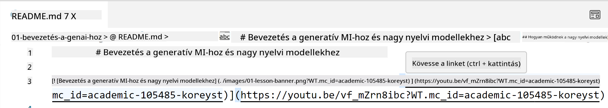
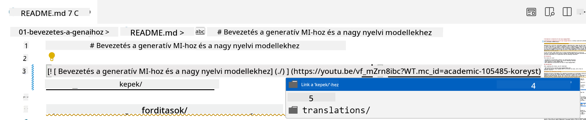
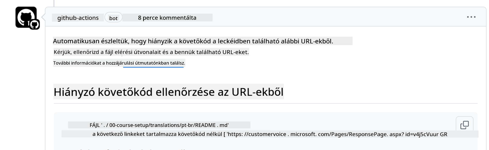

<!--
CO_OP_TRANSLATOR_METADATA:
{
  "original_hash": "57c41f2af71001a2cff9d8eb797cb843",
  "translation_date": "2025-07-09T06:11:21+00:00",
  "source_file": "CONTRIBUTING.md",
  "language_code": "hu"
}
-->
# Hozzájárulás

Ez a projekt szívesen fogad hozzájárulásokat és javaslatokat. A legtöbb hozzájáruláshoz el kell fogadnod egy Contributor License Agreement (CLA) licencszerződést, amelyben kijelented, hogy jogodban áll, és ténylegesen megadod nekünk a jogot a hozzájárulásod felhasználására. Részletekért látogass el a <https://cla.microsoft.com> oldalra.

> Fontos: amikor ebben a tárolóban szöveget fordítasz, kérjük, ne használj gépi fordítást. A fordításokat a közösség ellenőrzi, ezért csak olyan nyelvekre vállalj önkéntes fordítást, amelyben jártas vagy.

Amikor pull request-et nyújtas be, egy CLA-bot automatikusan megállapítja, hogy szükséges-e CLA-t benyújtanod, és ennek megfelelően jelöli meg a PR-t (pl. címkével, hozzászólással). Egyszerűen kövesd a bot utasításait. Ezt csak egyszer kell megtenned az összes CLA-t használó tárolóban.

## Magatartási kódex

Ez a projekt elfogadta a [Microsoft Open Source Code of Conduct](https://opensource.microsoft.com/codeofconduct/?WT.mc_id=academic-105485-koreyst) magatartási kódexet.  
További információért olvasd el a [Code of Conduct GYIK-et](https://opensource.microsoft.com/codeofconduct/faq/?WT.mc_id=academic-105485-koreyst), vagy írj az [opencode@microsoft.com](mailto:opencode@microsoft.com) címre, ha kérdésed vagy észrevételed van.

## Kérdés vagy probléma?

Kérjük, ne nyiss GitHub issue-t általános támogatási kérdések miatt, mivel a GitHub lista funkciókérések és hibajelentések kezelésére szolgál. Így könnyebben nyomon követhetjük a tényleges problémákat vagy hibákat a kódban, és a közös beszélgetést elkülöníthetjük a kódtól.

## Elírások, problémák, hibák és hozzájárulások

Amikor bármilyen módosítást küldesz be a Generative AI for Beginners tárolóba, kérjük, kövesd az alábbi ajánlásokat.

* Mindig forkold a tárolót a saját fiókodba, mielőtt módosításokat végzel
* Ne egyesíts több változtatást egy pull request-be. Például hibajavítást és dokumentáció frissítést külön PR-ben nyújts be
* Ha a pull request-ed összeolvadási konfliktust jelez, frissítsd a helyi main ágat úgy, hogy tükrözze a fő tároló main ágát, mielőtt módosítasz
* Ha fordítást nyújtasz be, kérjük, egy PR-ben add be az összes lefordított fájlt, mivel részleges fordításokat nem fogadunk el
* Ha elírást vagy dokumentációs javítást küldesz be, akkor megfelelő esetben egy PR-ben is egyesítheted a módosításokat

## Általános iránymutatás íráshoz

- Győződj meg róla, hogy minden URL szögletes zárójelben van, amit kerek zárójel követ, és nincs bennük vagy körülöttük felesleges szóköz ``.
- Biztosítsd, hogy minden relatív hivatkozás (azaz a tároló más fájljaira és mappáira mutató linkek) `./`-vel kezdődjön, ami az aktuális munkakönyvtárban lévő fájlra vagy mappára utal, vagy `../`-vel, ami a szülő munkakönyvtárban lévő fájlra vagy mappára.
- Biztosítsd, hogy minden relatív hivatkozás végén legyen követőkód (azaz `?` vagy `&` után `wt.mc_id=` vagy `WT.mc_id=`).
- Biztosítsd, hogy az alábbi domainekről származó URL-ek (_github.com, microsoft.com, visualstudio.com, aka.ms, és azure.com_) végén legyen követőkód (azaz `?` vagy `&` után `wt.mc_id=` vagy `WT.mc_id=`).
- Győződj meg róla, hogy a linkjeid nem tartalmaznak ország-specifikus nyelvi beállítást (pl. `/en-us/` vagy `/en/`).
- Biztosítsd, hogy minden kép a `./images` mappában legyen tárolva.
- Biztosítsd, hogy a képek nevei leíró jellegűek legyenek, angol karaktereket, számokat és kötőjeleket tartalmazzanak.

## GitHub munkafolyamatok

Amikor pull request-et nyújtasz be, négy különböző munkafolyamat indul el az előző szabályok ellenőrzésére.  
Egyszerűen kövesd az itt felsorolt utasításokat, hogy átmenj a munkafolyamat ellenőrzéseken.

- [Törött relatív útvonalak ellenőrzése](../..)
- [Útvonalak követőkódjának ellenőrzése](../..)
- [URL-ek követőkódjának ellenőrzése](../..)
- [URL-ek nyelvi beállításának ellenőrzése](../..)

### Törött relatív útvonalak ellenőrzése

Ez a munkafolyamat biztosítja, hogy a fájljaidban szereplő relatív útvonalak működőképesek legyenek.  
Ez a tároló GitHub Pages-re van telepítve, ezért nagyon figyelj arra, hogy a linkeket helyesen írd, nehogy valakit rossz helyre irányítsanak.

Annak ellenőrzésére, hogy a linkjeid megfelelően működnek, egyszerűen használd a VS Code-ot.

Például, ha az egérrel egy link fölé viszed a kurzort, megjelenik egy lehetőség, hogy a **ctrl + kattintás** segítségével kövesd a linket.

Ha rákattintasz egy linkre, és az helyileg nem működik, akkor biztosan a munkafolyamat is hibát jelez majd, és a GitHub-on sem fog működni.

A probléma megoldásához próbáld meg a linket a VS Code segítségével beírni.

Amikor beírod a `./` vagy `../` karaktereket, a VS Code felajánlja a választható lehetőségeket az alapján, amit beírtál.

Kattints a kívánt fájlra vagy mappára, így biztos lehetsz benne, hogy az útvonalad nem törött.

Ha megadtad a helyes relatív útvonalat, mentsd el, és push-old a változtatásokat, a munkafolyamat újra lefut, hogy ellenőrizze a módosításokat.  
Ha átmentél az ellenőrzésen, mehetsz tovább.

### Útvonalak követőkódjának ellenőrzése

Ez a munkafolyamat biztosítja, hogy minden relatív útvonal tartalmazzon követőkódot.  
Ez a tároló GitHub Pages-re van telepítve, ezért nyomon kell követnünk a fájlok és mappák közötti mozgást.

Annak ellenőrzésére, hogy a relatív útvonalak tartalmaznak-e követőkódot, egyszerűen keresd a `?wt.mc_id=` szöveget az útvonal végén.  
Ha ez szerepel az útvonalakon, át fogsz menni az ellenőrzésen.

Ha nem, a következő hibaüzenetet kaphatod.

A probléma megoldásához nyisd meg a munkafolyamat által kiemelt fájlútvonalat, és add hozzá a követőkódot a relatív útvonalak végéhez.

Ha hozzáadtad a követőkódot, mentsd el, és push-old a változtatásokat, a munkafolyamat újra lefut, hogy ellenőrizze a módosításokat.  
Ha átmentél az ellenőrzésen, mehetsz tovább.

### URL-ek követőkódjának ellenőrzése

Ez a munkafolyamat biztosítja, hogy minden webes URL tartalmazzon követőkódot.  
Ez a tároló mindenki számára elérhető, ezért nyomon kell követnünk a hozzáféréseket, hogy tudjuk, honnan érkezik a forgalom.

Annak ellenőrzésére, hogy az URL-ek tartalmaznak-e követőkódot, egyszerűen keresd a `?wt.mc_id=` szöveget az URL végén.  
Ha ez szerepel az URL-ek végén, át fogsz menni az ellenőrzésen.

Ha nem, a következő hibaüzenetet kaphatod.

A probléma megoldásához nyisd meg a munkafolyamat által kiemelt fájlútvonalat, és add hozzá a követőkódot az URL-ek végéhez.

Ha hozzáadtad a követőkódot, mentsd el, és push-old a változtatásokat, a munkafolyamat újra lefut, hogy ellenőrizze a módosításokat.  
Ha átmentél az ellenőrzésen, mehetsz tovább.

### URL-ek nyelvi beállításának ellenőrzése

Ez a munkafolyamat biztosítja, hogy a webes URL-ek ne tartalmazzanak ország-specifikus nyelvi beállítást.  
Ez a tároló világszerte elérhető, ezért ügyelni kell arra, hogy ne kerüljön be az adott ország nyelvi beállítása az URL-ekbe.

Annak ellenőrzésére, hogy az URL-ek nem tartalmaznak ország-specifikus nyelvi beállítást, keresd a `/en-us/`, `/en/` vagy bármilyen más nyelvi beállítást az URL-ekben.  
Ha nincs ilyen az URL-ekben, át fogsz menni az ellenőrzésen.

Ha van, a következő hibaüzenetet kaphatod.

A probléma megoldásához nyisd meg a munkafolyamat által kiemelt fájlútvonalat, és távolítsd el az ország-specifikus nyelvi beállítást az URL-ekből.

Ha eltávolítottad a nyelvi beállítást, mentsd el, és push-old a változtatásokat, a munkafolyamat újra lefut, hogy ellenőrizze a módosításokat.  
Ha átmentél az ellenőrzésen, mehetsz tovább.

Gratulálunk! Hamarosan visszajelzést adunk a hozzájárulásodról.

**Jogi nyilatkozat**:  
Ez a dokumentum az AI fordító szolgáltatás, a [Co-op Translator](https://github.com/Azure/co-op-translator) segítségével készült. Bár a pontosságra törekszünk, kérjük, vegye figyelembe, hogy az automatikus fordítások hibákat vagy pontatlanságokat tartalmazhatnak. Az eredeti dokumentum az anyanyelvén tekintendő hiteles forrásnak. Fontos információk esetén szakmai, emberi fordítást javaslunk. Nem vállalunk felelősséget a fordítás használatából eredő félreértésekért vagy téves értelmezésekért.