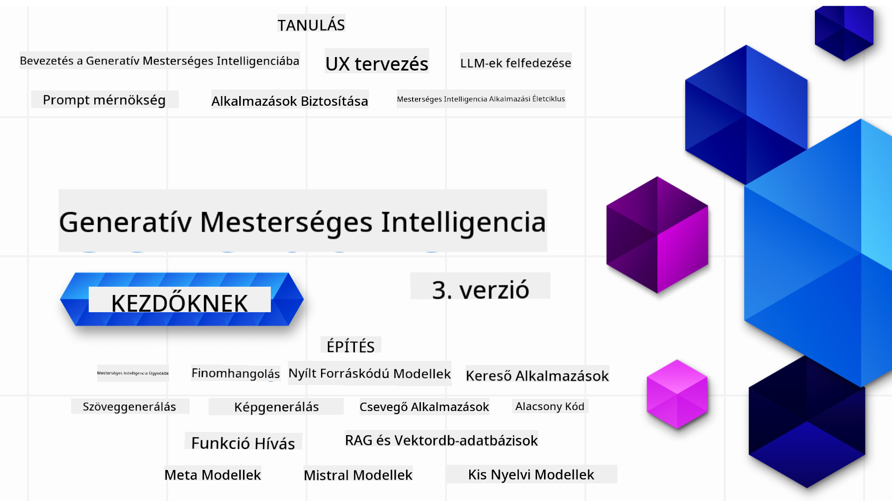

<!--
CO_OP_TRANSLATOR_METADATA:
{
  "original_hash": "c2ee25895ebbfa1a52868bb6eab686fc",
  "translation_date": "2025-05-19T11:58:20+00:00",
  "source_file": "README.md",
  "language_code": "hu"
}
-->

### 21 Lecke, amelyek megtanítanak mindent, amit tudnod kell a Generatív AI alkalmazások építésének megkezdéséhez

### 🌐 Többnyelvű támogatás

#### Támogatott GitHub Action által (Automatikus és mindig naprakész)
[Francia](../fr/README.md) | [Spanyol](../es/README.md) | [Német](../de/README.md) | [Orosz](../ru/README.md) | [Arab](../ar/README.md) | [Perzsa (Farsi)](../fa/README.md) | [Urdu](../ur/README.md) | [Kínai (egyszerűsített)](../zh/README.md) | [Kínai (hagyományos, Makaó)](../mo/README.md) | [Kínai (hagyományos, Hongkong)](../hk/README.md) | [Kínai (hagyományos, Tajvan)](../tw/README.md) | [Japán](../ja/README.md) | [Koreai](../ko/README.md) | [Hindi](../hi/README.md) | [Bengáli](../bn/README.md) | [Marathi](../mr/README.md) | [Nepáli](../ne/README.md) | [Pandzsábi (Gurmukhi)](../pa/README.md) | [Portugál (Portugália)](../pt/README.md) | [Portugál (Brazília)](../br/README.md) | [Olasz](../it/README.md) | [Lengyel](../pl/README.md) | [Török](../tr/README.md) | [Görög](../el/README.md) | [Thai](../th/README.md) | [Svéd](../sv/README.md) | [Dán](../da/README.md) | [Norvég](../no/README.md) | [Finn](../fi/README.md) | [Holland](../nl/README.md) | [Héber](../he/README.md) | [Vietnami](../vi/README.md) | [Indonéz](../id/README.md) | [Maláj](../ms/README.md) | [Tagalog (Filippínó)](../tl/README.md) | [Szuahéli](../sw/README.md) | [Magyar](./README.md) | [Cseh](../cs/README.md) | [Szlovák](../sk/README.md) | [Román](../ro/README.md) | [Bolgár](../bg/README.md) | [Szerb (cirill)](../sr/README.md) | [Horvát](../hr/README.md) | [Szlovén](../sl/README.md)
# Generatív AI Kezdőknek (3. verzió) - Egy Tanfolyam

Tanulja meg a generatív AI alkalmazások építésének alapjait a Microsoft Cloud Advocates 21 leckés átfogó tanfolyamával.

## 🌱 Kezdés

Ez a tanfolyam 21 leckéből áll. Minden lecke egy saját témát fed le, így kezdje, ahol szeretné!

A leckék vagy "Learn" (Tanulás) leckék, amelyek egy generatív AI fogalmat magyaráznak, vagy "Build" (Építés) leckék, amelyek egy fogalmat és kód példákat magyaráznak mind **Python**, mind **TypeScript** nyelven, amikor lehetséges.

.NET fejlesztők számára nézze meg a [Generatív AI Kezdőknek (.NET kiadás)](https://github.com/microsoft/Generative-AI-for-beginners-dotnet?WT.mc_id=academic-105485-koreyst)!

Minden lecke tartalmaz egy "Keep Learning" (Továbbtanulás) szekciót további tanulási eszközökkel.

## Amire szüksége van
### A tanfolyam kódjának futtatásához használhatja:
 - [Azure OpenAI Service](https://aka.ms/genai-beginners/azure-open-ai?WT.mc_id=academic-105485-koreyst) - **Leckék:** "aoai-assignment"
 - [GitHub Marketplace Model Catalog](https://aka.ms/genai-beginners/gh-models?WT.mc_id=academic-105485-koreyst) - **Leckék:** "githubmodels"
 - [OpenAI API](https://aka.ms/genai-beginners/open-ai?WT.mc_id=academic-105485-koreyst) - **Leckék:** "oai-assignment" 
   
- Alapvető Python vagy TypeScript ismeretek hasznosak - \*Teljesen kezdők számára nézze meg ezeket a [Python](https://aka.ms/genai-beginners/python?WT.mc_id=academic-105485-koreyst) és [TypeScript](https://aka.ms/genai-beginners/typescript?WT.mc_id=academic-105485-koreyst) tanfolyamokat
- Egy GitHub fiók, hogy [forkolja ezt a teljes repót](https://aka.ms/genai-beginners/github?WT.mc_id=academic-105485-koreyst) a saját GitHub fiókjába

Létrehoztunk egy **[Tanfolyam Beállítása](./00-course-setup/README.md?WT.mc_id=academic-105485-koreyst)** leckét, hogy segítsünk a fejlesztői környezet beállításában.

Ne felejtse el [csillagozni (🌟) ezt a repót](https://docs.github.com/en/get-started/exploring-projects-on-github/saving-repositories-with-stars?WT.mc_id=academic-105485-koreyst), hogy később könnyebben megtalálja.

## 🧠 Készen áll a telepítésre?

Ha fejlettebb kódmintákat keres, nézze meg a [Generatív AI Kódminták gyűjteményünket](https://aka.ms/genai-beg-code?WT.mc_id=academic-105485-koreyst) mind **Python**, mind **TypeScript** nyelven.

## 🗣️ Ismerje meg a többi tanulót, kérjen támogatást

Csatlakozzon a [hivatalos Azure AI Foundry Discord szerverünkhöz](https://aka.ms/genai-discord?WT.mc_id=academic-105485-koreyst), hogy találkozzon és hálózatot építsen más tanulókkal, akik ezt a tanfolyamot végzik, és kérjen támogatást.

Tegyen fel kérdéseket vagy ossza meg a termékkel kapcsolatos visszajelzéseit az [Azure AI Foundry Fejlesztői Fórumunkon](https://aka.ms/azureaifoundry/forum) a Githubon.

## 🚀 Startupot épít?

Iratkozzon fel a [Microsoft for Startups Founders Hubra](https://aka.ms/genai-foundershub?WT.mc_id=academic-105485-koreyst), hogy **ingyenes OpenAI krediteket** és akár **150 000 USD értékű Azure kreditet kapjon az OpenAI modellek eléréséhez az Azure OpenAI Szolgáltatásokon keresztül**.

## 🙏 Szeretne segíteni?

Van javaslata vagy talált helyesírási vagy kódhibát? [Emeljen ki egy hibát](https://github.com/microsoft/generative-ai-for-beginners/issues?WT.mc_id=academic-105485-koreyst) vagy [Hozzon létre egy pull requestet](https://github.com/microsoft/generative-ai-for-beginners/pulls?WT.mc_id=academic-105485-koreyst)

## 📂 Minden lecke tartalmazza:

- Egy rövid videós bevezetőt a témához
- Egy írásos leckét a README-ben
- Python és TypeScript kódmintákat az Azure OpenAI és OpenAI API támogatásával
- Linkeket további forrásokhoz a tanulás folytatásához

## 🗃️ Leckék

| #   | **Lecke Link**                                                                                                                              | **Leírás**                                                                                       | **Videó**                                                                   | **További Tanulás**                                                             |
| --- | -------------------------------------------------------------------------------------------------------------------------------------------- | ------------------------------------------------------------------------------------------------ | --------------------------------------------------------------------------- | ------------------------------------------------------------------------------ |
| 00  | [Tanfolyam Beállítása](./00-course-setup/README.md?WT.mc_id=academic-105485-koreyst)                                                         | **Tanulás:** Hogyan állítsuk be a fejlesztői környezetet                                         | Videó hamarosan                                                             | [Tudjon meg többet](https://aka.ms/genai-collection?WT.mc_id=academic-105485-koreyst) |
| 01  | [Bevezetés a Generatív AI-ba és az LLM-ekbe](./01-introduction-to-genai/README.md?WT.mc_id=academic-105485-koreyst)                          | **Tanulás:** Megérteni, mi a Generatív AI és hogyan működnek a Nagy Nyelvi Modellek (LLM-ek).   | [Videó](https://aka.ms/gen-ai-lesson-1-gh?WT.mc_id=academic-105485-koreyst) | [Tudjon meg többet](https://aka.ms/genai-collection?WT.mc_id=academic-105485-koreyst) |
| 02  | [Különböző LLM-ek felfedezése és összehasonlítása](./02-exploring-and-comparing-different-llms/README.md?WT.mc_id=academic-105485-koreyst)   | **Tanulás:** Hogyan válasszuk ki a megfelelő modellt az Ön esetéhez                              | [Videó](https://aka.ms/gen-ai-lesson2-gh?WT.mc_id=academic-105485-koreyst)  | [Tudjon meg többet](https://aka.ms/genai-collection?WT.mc_id=academic-105485-koreyst) |
| 03  | [Generatív AI felelősségteljes használata](./03-using-generative-ai-responsibly/README.md?WT.mc_id=academic-105485-koreyst)                  | **Tanulás:** Hogyan építsünk felelősségteljesen Generatív AI alkalmazásokat                       | [Videó](https://aka.ms/gen-ai-lesson3-gh?WT.mc_id=academic-105485-koreyst)  | [Tudjon meg többet](https://aka.ms/genai-collection?WT.mc_id=academic-105485-koreyst) |
| 04  | [Prompt Engineering Alapjainak megértése](./04-prompt-engineering-fundamentals/README.md?WT.mc_id=academic-105485-koreyst)                  | **Tanulás:** Gyakorlati Prompt Engineering legjobb gyakorlatok                                   | [Videó](https://aka.ms/gen-ai-lesson4-gh?WT.mc_id=academic-105485-koreyst)  | [Tudjon meg többet](https://aka.ms/genai-collection?WT.mc_id=academic-105485-koreyst) |
| 05  | [Haladó Promptok Létrehozása](./05-advanced-prompts/README.md?WT.mc_id=academic-105485-koreyst)                                                | **Tanulj:** Hogyan alkalmazz prompt tervezési technikákat, amelyek javítják a promptjaid eredményét. | [Videó](https://aka.ms/gen-ai-lesson5-gh?WT.mc_id=academic-105485-koreyst)  | [Tudj meg többet](https://aka.ms/genai-collection?WT.mc_id=academic-105485-koreyst) |
| 06  | [Szöveg Generálási Alkalmazások Készítése](./06-text-generation-apps/README.md?WT.mc_id=academic-105485-koreyst)                                | **Készíts:** Egy szöveg generáló alkalmazást Azure OpenAI / OpenAI API használatával                                | [Videó](https://aka.ms/gen-ai-lesson6-gh?WT.mc_id=academic-105485-koreyst)  | [Tudj meg többet](https://aka.ms/genai-collection?WT.mc_id=academic-105485-koreyst) |
| 07  | [Chat Alkalmazások Készítése](./07-building-chat-applications/README.md?WT.mc_id=academic-105485-koreyst)                                     | **Készíts:** Technikák hatékony chat alkalmazások építésére és integrálására.               | [Videó](https://aka.ms/gen-ai-lessons7-gh?WT.mc_id=academic-105485-koreyst) | [Tudj meg többet](https://aka.ms/genai-collection?WT.mc_id=academic-105485-koreyst) |
| 08  | [Keresési Alkalmazások Építése Vektor Adatbázisokkal](./08-building-search-applications/README.md?WT.mc_id=academic-105485-koreyst)                        | **Készíts:** Egy keresési alkalmazást, amely Beágyazásokat használ az adatok keresésére.                        | [Videó](https://aka.ms/gen-ai-lesson8-gh?WT.mc_id=academic-105485-koreyst)  | [Tudj meg többet](https://aka.ms/genai-collection?WT.mc_id=academic-105485-koreyst) |
| 09  | [Kép Generálási Alkalmazások Készítése](./09-building-image-applications/README.md?WT.mc_id=academic-105485-koreyst)                        | **Készíts:** Egy kép generáló alkalmazást                                                       | [Videó](https://aka.ms/gen-ai-lesson9-gh?WT.mc_id=academic-105485-koreyst)  | [Tudj meg többet](https://aka.ms/genai-collection?WT.mc_id=academic-105485-koreyst) |
| 10  | [Alacsony Kódú AI Alkalmazások Készítése](./10-building-low-code-ai-applications/README.md?WT.mc_id=academic-105485-koreyst)                       | **Készíts:** Egy Generatív AI alkalmazást Alacsony Kódú eszközök használatával                                     | [Videó](https://aka.ms/gen-ai-lesson10-gh?WT.mc_id=academic-105485-koreyst) | [Tudj meg többet](https://aka.ms/genai-collection?WT.mc_id=academic-105485-koreyst) |
| 11  | [Külső Alkalmazások Integrálása Funkció Hívással](./11-integrating-with-function-calling/README.md?WT.mc_id=academic-105485-koreyst) | **Készíts:** Mi a funkció hívás és milyen alkalmazási esetei vannak                          | [Videó](https://aka.ms/gen-ai-lesson11-gh?WT.mc_id=academic-105485-koreyst) | [Tudj meg többet](https://aka.ms/genai-collection?WT.mc_id=academic-105485-koreyst) |
| 12  | [UX Tervezése AI Alkalmazásokhoz](./12-designing-ux-for-ai-applications/README.md?WT.mc_id=academic-105485-koreyst)                         | **Tanulj:** Hogyan alkalmazd az UX tervezési elveket Generatív AI Alkalmazások fejlesztésekor         | [Videó](https://aka.ms/gen-ai-lesson12-gh?WT.mc_id=academic-105485-koreyst) | [Tudj meg többet](https://aka.ms/genai-collection?WT.mc_id=academic-105485-koreyst) |
| 13  | [Generatív AI Alkalmazásaid Biztonságának Megőrzése](./13-securing-ai-applications/README.md?WT.mc_id=academic-105485-koreyst)                         | **Tanulj:** Az AI rendszereket fenyegető veszélyek és kockázatok, valamint ezek biztonságának módszerei.             | [Videó](https://aka.ms/gen-ai-lesson13-gh?WT.mc_id=academic-105485-koreyst) | [Tudj meg többet](https://aka.ms/genai-collection?WT.mc_id=academic-105485-koreyst) |
| 14  | [A Generatív AI Alkalmazások Életciklusa](./14-the-generative-ai-application-lifecycle/README.md?WT.mc_id=academic-105485-koreyst)           | **Tanulj:** Az eszközök és metrikák az LLM Életciklus és LLMOps kezelésére                         | [Videó](https://aka.ms/gen-ai-lesson14-gh?WT.mc_id=academic-105485-koreyst) | [Tudj meg többet](https://aka.ms/genai-collection?WT.mc_id=academic-105485-koreyst) |
| 15  | [Visszakeresésen alapuló generálás (RAG) és vektor adatbázisok](./15-rag-and-vector-databases/README.md?WT.mc_id=academic-105485-koreyst)        | **Készíts:** Egy alkalmazást RAG keretrendszerrel, amely vektor adatbázisokból kér le beágyazásokat  | [Videó](https://aka.ms/gen-ai-lesson15-gh?WT.mc_id=academic-105485-koreyst) | [Tudj meg többet](https://aka.ms/genai-collection?WT.mc_id=academic-105485-koreyst) |
| 16  | [Nyílt forráskódú modellek és Hugging Face](./16-open-source-models/README.md?WT.mc_id=academic-105485-koreyst)                                    | **Készíts:** Egy alkalmazást, amely nyílt forráskódú modelleket használ a Hugging Face-en                    | [Videó](https://aka.ms/gen-ai-lesson16-gh?WT.mc_id=academic-105485-koreyst) | [Tudj meg többet](https://aka.ms/genai-collection?WT.mc_id=academic-105485-koreyst) |
| 17  | [AI ügynökök](./17-ai-agents/README.md?WT.mc_id=academic-105485-koreyst)                                                                       | **Készíts:** Egy alkalmazást AI ügynök keretrendszerrel                                           | [Videó](https://aka.ms/gen-ai-lesson17-gh?WT.mc_id=academic-105485-koreyst) | [Tudj meg többet](https://aka.ms/genai-collection?WT.mc_id=academic-105485-koreyst) |
| 18  | [LLM-ek finomhangolása](./18-fine-tuning/README.md?WT.mc_id=academic-105485-koreyst)                                                              | **Tanuld meg:** Mit, miért és hogyan kell finomhangolni az LLM-eket                                            | [Videó](https://aka.ms/gen-ai-lesson18-gh?WT.mc_id=academic-105485-koreyst) | [Tudj meg többet](https://aka.ms/genai-collection?WT.mc_id=academic-105485-koreyst) |
| 19  | [SLM-ekkel való építés](./19-slm/README.md?WT.mc_id=academic-105485-koreyst)                                                              | **Tanuld meg:** Az előnyeit annak, hogy kisméretű nyelvi modellekkel építünk                                            | Hamarosan elérhető videó | [Tudj meg többet](https://aka.ms/genai-collection?WT.mc_id=academic-105485-koreyst) |
| 20  | [Mistral modellekkel való építés](./20-mistral/README.md?WT.mc_id=academic-105485-koreyst)                                                              | **Tanuld meg:** A Mistral család modelleinek jellemzőit és különbségeit                                           | Hamarosan elérhető videó | [Tudj meg többet](https://aka.ms/genai-collection?WT.mc_id=academic-105485-koreyst) |
| 21  | [Meta modellekkel való építés](./21-meta/README.md?WT.mc_id=academic-105485-koreyst)                                                              | **Tanuld meg:** A Meta család modelleinek jellemzőit és különbségeit                                           | Hamarosan elérhető videó | [Tudj meg többet](https://aka.ms/genai-collection?WT.mc_id=academic-105485-koreyst) |

### 🌟 Külön köszönet

Külön köszönet [**John Aziz**](https://www.linkedin.com/in/john0isaac/) számára, aki létrehozta az összes GitHub akciót és munkafolyamatot.

[**Bernhard Merkle**](https://www.linkedin.com/in/bernhard-merkle-738b73/) számára, aki kulcsfontosságú hozzájárulásokat tett minden leckéhez, hogy javítsa a tanulói és kódolási élményt. 

## 🎒 Egyéb kurzusok

Csapatunk más kurzusokat is készít! Nézd meg:

- [**ÚJ** AI ügynökök kezdőknek](https://github.com/microsoft/ai-agents-for-beginners?WT.mc_id=academic-105485-koreyst)
- [**ÚJ** Generatív AI kezdőknek .NET használatával](https://github.com/microsoft/Generative-AI-for-beginners-dotnet?WT.mc_id=academic-105485-koreyst)
- [**ÚJ** Generatív AI kezdőknek JavaScript használatával](https://aka.ms/genai-js-course?WT.mc_id=academic-105485-koreyst)
- [ML kezdőknek](https://aka.ms/ml-beginners?WT.mc_id=academic-105485-koreyst)
- [Adattudomány kezdőknek](https://aka.ms/datascience-beginners?WT.mc_id=academic-105485-koreyst)
- [AI kezdőknek](https://aka.ms/ai-beginners?WT.mc_id=academic-105485-koreyst)
- [Kiberbiztonság kezdőknek](https://github.com/microsoft/Security-101??WT.mc_id=academic-96948-sayoung)
- [Webfejlesztés kezdőknek](https://aka.ms/webdev-beginners?WT.mc_id=academic-105485-koreyst)
- [IoT kezdőknek](https://aka.ms/iot-beginners?WT.mc_id=academic-105485-koreyst)
- [XR fejlesztés kezdőknek](https://github.com/microsoft/xr-development-for-beginners?WT.mc_id=academic-105485-koreyst)
- [GitHub Copilot mesteri szintű használata AI páros programozáshoz](https://aka.ms/GitHubCopilotAI?WT.mc_id=academic-105485-koreyst)
- [GitHub Copilot mesteri szintű használata C#/.NET fejlesztők számára](https://github.com/microsoft/mastering-github-copilot-for-dotnet-csharp-developers?WT.mc_id=academic-105485-koreyst)
- [Válaszd ki a saját Copilot kalandodat](https://github.com/microsoft/CopilotAdventures?WT.mc_id=academic-105485-koreyst)

**Jogi nyilatkozat**:  
Ezt a dokumentumot az [Co-op Translator](https://github.com/Azure/co-op-translator) AI fordítószolgáltatás segítségével fordítottuk le. Bár törekszünk a pontosságra, kérjük, vegye figyelembe, hogy az automatikus fordítások hibákat vagy pontatlanságokat tartalmazhatnak. Az eredeti dokumentum az anyanyelvén tekintendő hiteles forrásnak. Kritikus információk esetén javasolt a professzionális emberi fordítás. Nem vállalunk felelősséget a fordítás használatából eredő félreértésekért vagy téves értelmezésekért.