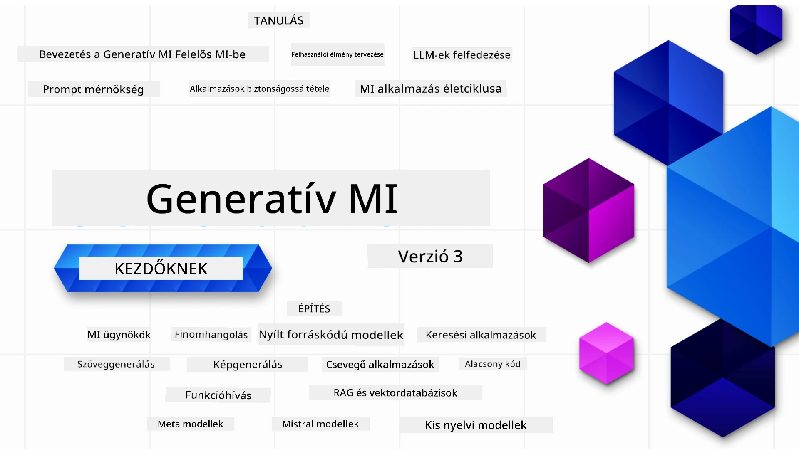

### 21 Lecke, amely megtanít mindent, amit a Generatív AI alkalmazások építésének megkezdéséhez tudni kell

[](https://github.com/microsoft/Generative-AI-For-Beginners/blob/master/LICENSE?WT.mc_id=academic-105485-koreyst)
[](https://GitHub.com/microsoft/Generative-AI-For-Beginners/graphs/contributors/?WT.mc_id=academic-105485-koreyst)
[](https://GitHub.com/microsoft/Generative-AI-For-Beginners/issues/?WT.mc_id=academic-105485-koreyst)
[](https://GitHub.com/microsoft/Generative-AI-For-Beginners/pulls/?WT.mc_id=academic-105485-koreyst)
[](http://makeapullrequest.com?WT.mc_id=academic-105485-koreyst)

[](https://GitHub.com/microsoft/Generative-AI-For-Beginners/watchers/?WT.mc_id=academic-105485-koreyst)
[](https://GitHub.com/microsoft/Generative-AI-For-Beginners/network/?WT.mc_id=academic-105485-koreyst)
[](https://GitHub.com/microsoft/Generative-AI-For-Beginners/stargazers/?WT.mc_id=academic-105485-koreyst)

[](https://discord.gg/nTYy5BXMWG)

### 🌐 Többnyelvű támogatás

#### GitHub Action által támogatott (Automatikus és Mindig Naprakész)

<!-- CO-OP TRANSLATOR LANGUAGES TABLE START -->
[Arabic](../ar/README.md) | [Bengali](../bn/README.md) | [Bulgarian](../bg/README.md) | [Burmese (Myanmar)](../my/README.md) | [Chinese (Simplified)](../zh-CN/README.md) | [Chinese (Traditional, Hong Kong)](../zh-HK/README.md) | [Chinese (Traditional, Macau)](../zh-MO/README.md) | [Chinese (Traditional, Taiwan)](../zh-TW/README.md) | [Croatian](../hr/README.md) | [Czech](../cs/README.md) | [Danish](../da/README.md) | [Dutch](../nl/README.md) | [Estonian](../et/README.md) | [Finnish](../fi/README.md) | [French](../fr/README.md) | [German](../de/README.md) | [Greek](../el/README.md) | [Hebrew](../he/README.md) | [Hindi](../hi/README.md) | [Hungarian](./README.md) | [Indonesian](../id/README.md) | [Italian](../it/README.md) | [Japanese](../ja/README.md) | [Kannada](../kn/README.md) | [Korean](../ko/README.md) | [Lithuanian](../lt/README.md) | [Malay](../ms/README.md) | [Malayalam](../ml/README.md) | [Marathi](../mr/README.md) | [Nepali](../ne/README.md) | [Nigerian Pidgin](../pcm/README.md) | [Norwegian](../no/README.md) | [Persian (Farsi)](../fa/README.md) | [Polish](../pl/README.md) | [Portuguese (Brazil)](../pt-BR/README.md) | [Portuguese (Portugal)](../pt-PT/README.md) | [Punjabi (Gurmukhi)](../pa/README.md) | [Romanian](../ro/README.md) | [Russian](../ru/README.md) | [Serbian (Cyrillic)](../sr/README.md) | [Slovak](../sk/README.md) | [Slovenian](../sl/README.md) | [Spanish](../es/README.md) | [Swahili](../sw/README.md) | [Swedish](../sv/README.md) | [Tagalog (Filipino)](../tl/README.md) | [Tamil](../ta/README.md) | [Telugu](../te/README.md) | [Thai](../th/README.md) | [Turkish](../tr/README.md) | [Ukrainian](../uk/README.md) | [Urdu](../ur/README.md) | [Vietnamese](../vi/README.md)

> **Szeretnéd helyben klónozni?**

> Ez a tároló 50+ nyelvi fordítást tartalmaz, ami jelentősen megnöveli a letöltési méretet. Fordítások nélküli klónozáshoz használj sparse checkoutot:
> ```bash
> git clone --filter=blob:none --sparse https://github.com/microsoft/generative-ai-for-beginners.git
> cd generative-ai-for-beginners
> git sparse-checkout set --no-cone '/*' '!translations' '!translated_images'
> ```
> Így megkapod mindazt, ami a kurzus elvégzéséhez szükséges, de sokkal gyorsabb letöltéssel.
<!-- CO-OP TRANSLATOR LANGUAGES TABLE END -->

# Generatív AI kezdőknek (3. kiadás) - Egy tanfolyam

Ismerkedj meg a Generatív AI alkalmazások építésének alapjaival a Microsoft Cloud Advocates által készített 21 leckés átfogó tanfolyammal.

## 🌱 Kezdés

Ez a tanfolyam 21 leckéből áll. Minden lecke egy adott témát fed le, tehát kezdj akárhol, ahol szeretnéd!

A leckék vagy „Learn” (Tanulj) leckék, amelyek egy generatív AI koncepciót magyaráznak el, vagy „Build” (Építs) leckék, amelyek egy koncepciót és kódpéldákat is bemutatnak mind **Python**, mind **TypeScript** nyelven, ha lehetséges.

.NET fejlesztőknek ajánljuk a [Generative AI for Beginners (.NET Edition)](https://github.com/microsoft/Generative-AI-for-beginners-dotnet?WT.mc_id=academic-105485-koreyst) kurzust!

Minden leckéhez tartozik egy "Keep Learning" (Folytasd a tanulást) szakasz további tanulási eszközökkel.

## Mire lesz szükséged
### A kurzus kódjának futtatásához használhatod: 
 - [Azure OpenAI Service](https://aka.ms/genai-beginners/azure-open-ai?WT.mc_id=academic-105485-koreyst) - **Leckék:** "aoai-assignment"
 - [GitHub Marketplace Modellszótár](https://aka.ms/genai-beginners/gh-models?WT.mc_id=academic-105485-koreyst) - **Leckék:** "githubmodels"
 - [OpenAI API](https://aka.ms/genai-beginners/open-ai?WT.mc_id=academic-105485-koreyst) - **Leckék:** "oai-assignment"

- Alapvető Python vagy TypeScript ismeretek hasznosak - \*Teljesen kezdőknek ajánljuk ezeket a [Python](https://aka.ms/genai-beginners/python?WT.mc_id=academic-105485-koreyst) és [TypeScript](https://aka.ms/genai-beginners/typescript?WT.mc_id=academic-105485-koreyst) kurzusokat
- Egy GitHub fiók, hogy ezt a teljes tárolót [forkold](https://aka.ms/genai-beginners/github?WT.mc_id=academic-105485-koreyst) a saját GitHub fiókodba

Készítettünk egy **[Kurzus Beállítás](./00-course-setup/README.md?WT.mc_id=academic-105485-koreyst)** leckét, amely segít a fejlesztői környezeted beállításában.

Ne felejtsd el [megcsillagozni (🌟) ezt a tárolót](https://docs.github.com/en/get-started/exploring-projects-on-github/saving-repositories-with-stars?WT.mc_id=academic-105485-koreyst), hogy később könnyebben megtaláld.

## 🧠 Készen állsz a telepítésre?

Ha fejlettebb kód példákat keresel, nézd meg [Generatív AI kód példák gyűjteményét](https://aka.ms/genai-beg-code?WT.mc_id=academic-105485-koreyst) mind **Python**, mind **TypeScript** nyelven.

## 🗣️ Ismerkedj meg más tanulókkal, szerezz támogatást

Csatlakozz az [Azure AI Foundry hivatalos Discord szerveréhez](https://aka.ms/genai-discord?WT.mc_id=academic-105485-koreyst), hogy találkozz más tanulókkal, hálózatot építs, és támogatást kapj.

Tegyél fel kérdéseket vagy ossz meg visszajelzést a termékről az [Azure AI Foundry Fejlesztői Fórumon](https://aka.ms/azureaifoundry/forum) a GitHubon.

## 🚀 Startup építésen gondolkodsz?

Látogass el a [Microsoft for Startups](https://www.microsoft.com/startups) oldalra, hogy megtudd, hogyan kezdhetsz el Azure kreditekkel ma építeni.

## 🙏 Szeretnél segíteni?

Van javaslatod, vagy hibás helyesírásra vagy kódhibára bukkantál? [Hibajegyet nyithatsz](https://github.com/microsoft/generative-ai-for-beginners/issues?WT.mc_id=academic-105485-koreyst) vagy [Pull request-et küldhetsz](https://github.com/microsoft/generative-ai-for-beginners/pulls?WT.mc_id=academic-105485-koreyst)

## 📂 Minden lecke tartalmaz:

- Egy rövid videós bevezetést a témába
- Egy írásos leckét a README fájlban
- Python és TypeScript kódmintákat, amelyek támogatják az Azure OpenAI-t és az OpenAI API-t
- Linkeket további erőforrásokhoz a tanulás folytatásához

## 🗃️ Leckék

| #   | **Lecke link**                                                                                                                                | **Leírás**                                                                                     | **Videó**                                                                   | **További tananyag**                                                           |
| --- | -------------------------------------------------------------------------------------------------------------------------------------------- | --------------------------------------------------------------------------------------------- | --------------------------------------------------------------------------- | ------------------------------------------------------------------------------ |
| 00  | [Kurzus Beállítás](./00-course-setup/README.md?WT.mc_id=academic-105485-koreyst)                                                              | **Tanulj:** Hogyan állítsd be a fejlesztői környezeted                                        | Videó hamarosan                                                                | [További információ](https://aka.ms/genai-collection?WT.mc_id=academic-105485-koreyst) |
| 01  | [Bevezetés a Generatív AI és a nagy nyelvi modellek világába](./01-introduction-to-genai/README.md?WT.mc_id=academic-105485-koreyst)            | **Tanulj:** Megérteni, hogy mi az a Generatív AI és hogyan működnek a Nagy Nyelvi Modellek.   | [Videó](https://aka.ms/gen-ai-lesson-1-gh?WT.mc_id=academic-105485-koreyst) | [További információ](https://aka.ms/genai-collection?WT.mc_id=academic-105485-koreyst) |
| 02  | [Különböző LLM-ek felfedezése és összehasonlítása](./02-exploring-and-comparing-different-llms/README.md?WT.mc_id=academic-105485-koreyst)      | **Tanulj:** Hogyan válassz megfelelő modellt a használati esetedhez                          | [Videó](https://aka.ms/gen-ai-lesson2-gh?WT.mc_id=academic-105485-koreyst)  | [További információ](https://aka.ms/genai-collection?WT.mc_id=academic-105485-koreyst) |
| 03  | [Felelős Generatív AI használat](./03-using-generative-ai-responsibly/README.md?WT.mc_id=academic-105485-koreyst)                               | **Tanulj:** Hogyan építs Generatív AI alkalmazásokat felelősségteljesen                      | [Videó](https://aka.ms/gen-ai-lesson3-gh?WT.mc_id=academic-105485-koreyst)  | [További információ](https://aka.ms/genai-collection?WT.mc_id=academic-105485-koreyst) |
| 04  | [A Prompt Mérnökség Alapjainak Megértése](./04-prompt-engineering-fundamentals/README.md?WT.mc_id=academic-105485-koreyst)             | **Tanulj:** Gyakorlati Prompt Mérnökségi Legjobb Gyakorlatok                                           | [Videó](https://aka.ms/gen-ai-lesson4-gh?WT.mc_id=academic-105485-koreyst)  | [Tudj meg többet](https://aka.ms/genai-collection?WT.mc_id=academic-105485-koreyst) |
| 05  | [Fejlett Promptek Létrehozása](./05-advanced-prompts/README.md?WT.mc_id=academic-105485-koreyst)                                                | **Tanulj:** Hogyan alkalmazd a prompt mérnökségi technikákat, amelyek javítják a promtok eredményét. | [Videó](https://aka.ms/gen-ai-lesson5-gh?WT.mc_id=academic-105485-koreyst)  | [Tudj meg többet](https://aka.ms/genai-collection?WT.mc_id=academic-105485-koreyst) |
| 06  | [Szöveggeneráló Alkalmazások Készítése](./06-text-generation-apps/README.md?WT.mc_id=academic-105485-koreyst)                                | **Építs:** Egy szöveggeneráló alkalmazást Azure OpenAI / OpenAI API használatával                                | [Videó](https://aka.ms/gen-ai-lesson6-gh?WT.mc_id=academic-105485-koreyst)  | [Tudj meg többet](https://aka.ms/genai-collection?WT.mc_id=academic-105485-koreyst) |
| 07  | [Csevegőalkalmazások Készítése](./07-building-chat-applications/README.md?WT.mc_id=academic-105485-koreyst)                                     | **Építs:** Technikák a hatékony csevegőalkalmazások építéséhez és integrálásához.               | [Videó](https://aka.ms/gen-ai-lessons7-gh?WT.mc_id=academic-105485-koreyst) | [Tudj meg többet](https://aka.ms/genai-collection?WT.mc_id=academic-105485-koreyst) |
| 08  | [Keresőalkalmazások Építése Vektoros Adatbázisokkal](./08-building-search-applications/README.md?WT.mc_id=academic-105485-koreyst)                        | **Építs:** Egy keresőalkalmazást, amely Beágyazásokat használ adatkereséshez.                        | [Videó](https://aka.ms/gen-ai-lesson8-gh?WT.mc_id=academic-105485-koreyst)  | [Tudj meg többet](https://aka.ms/genai-collection?WT.mc_id=academic-105485-koreyst) |
| 09  | [Képgeneráló Alkalmazások Készítése](./09-building-image-applications/README.md?WT.mc_id=academic-105485-koreyst)                        | **Építs:** Egy képgeneráló alkalmazást                                                       | [Videó](https://aka.ms/gen-ai-lesson9-gh?WT.mc_id=academic-105485-koreyst)  | [Tudj meg többet](https://aka.ms/genai-collection?WT.mc_id=academic-105485-koreyst) |
| 10  | [Alacsony Kódú MI Alkalmazások Készítése](./10-building-low-code-ai-applications/README.md?WT.mc_id=academic-105485-koreyst)                       | **Építs:** Egy generatív MI alkalmazást alacsony kódú eszközökkel                                     | [Videó](https://aka.ms/gen-ai-lesson10-gh?WT.mc_id=academic-105485-koreyst) | [Tudj meg többet](https://aka.ms/genai-collection?WT.mc_id=academic-105485-koreyst) |
| 11  | [Külső Alkalmazások Integrálása Függvényhívással](./11-integrating-with-function-calling/README.md?WT.mc_id=academic-105485-koreyst) | **Építs:** Mi a függvényhívás és milyen alkalmazási esetei vannak                                    | [Videó](https://aka.ms/gen-ai-lesson11-gh?WT.mc_id=academic-105485-koreyst) | [Tudj meg többet](https://aka.ms/genai-collection?WT.mc_id=academic-105485-koreyst) |
| 12  | [UX Tervezése MI Alkalmazásokhoz](./12-designing-ux-for-ai-applications/README.md?WT.mc_id=academic-105485-koreyst)                         | **Tanulj:** Hogyan alkalmazzuk az UX tervezési alapelveket generatív MI alkalmazások fejlesztésekor         | [Videó](https://aka.ms/gen-ai-lesson12-gh?WT.mc_id=academic-105485-koreyst) | [Tudj meg többet](https://aka.ms/genai-collection?WT.mc_id=academic-105485-koreyst) |
| 13  | [Generatív MI Alkalmazások Biztonságossá Tétele](./13-securing-ai-applications/README.md?WT.mc_id=academic-105485-koreyst)                         | **Tanulj:** Az MI rendszerek fenyegetései és veszélyei, valamint a rendszerek védelmének módszerei.             | [Videó](https://aka.ms/gen-ai-lesson13-gh?WT.mc_id=academic-105485-koreyst) | [Tudj meg többet](https://aka.ms/genai-collection?WT.mc_id=academic-105485-koreyst) |
| 14  | [A Generatív MI Alkalmazás Életciklusa](./14-the-generative-ai-application-lifecycle/README.md?WT.mc_id=academic-105485-koreyst)           | **Tanulj:** Az eszközök és mutatók az LLM életciklus és LLMOps kezeléséhez                         | [Videó](https://aka.ms/gen-ai-lesson14-gh?WT.mc_id=academic-105485-koreyst) | [Tudj meg többet](https://aka.ms/genai-collection?WT.mc_id=academic-105485-koreyst) |
| 15  | [Retrieval Augmented Generation (RAG) és Vektoros Adatbázisok](./15-rag-and-vector-databases/README.md?WT.mc_id=academic-105485-koreyst)        | **Építs:** Egy alkalmazást RAG keretrendszerrel, amely vektoros adatbázisokból kérdez beágyazásokat  | [Videó](https://aka.ms/gen-ai-lesson15-gh?WT.mc_id=academic-105485-koreyst) | [Tudj meg többet](https://aka.ms/genai-collection?WT.mc_id=academic-105485-koreyst) |
| 16  | [Nyílt Forráskódú Modellek és Hugging Face](./16-open-source-models/README.md?WT.mc_id=academic-105485-koreyst)                                    | **Építs:** Egy alkalmazást a Hugging Face-en elérhető nyílt forráskódú modellek használatával                    | [Videó](https://aka.ms/gen-ai-lesson16-gh?WT.mc_id=academic-105485-koreyst) | [Tudj meg többet](https://aka.ms/genai-collection?WT.mc_id=academic-105485-koreyst) |
| 17  | [MI Ügynökök](./17-ai-agents/README.md?WT.mc_id=academic-105485-koreyst)                                                                       | **Építs:** Egy alkalmazást egy MI ügynök keretrendszerével                                           | [Videó](https://aka.ms/gen-ai-lesson17-gh?WT.mc_id=academic-105485-koreyst) | [Tudj meg többet](https://aka.ms/genai-collection?WT.mc_id=academic-105485-koreyst) |
| 18  | [LLM-ek Finomhangolása](./18-fine-tuning/README.md?WT.mc_id=academic-105485-koreyst)                                                              | **Tanulj:** Mi, miért és hogyan finomhangoljuk az LLM-eket                                            | [Videó](https://aka.ms/gen-ai-lesson18-gh?WT.mc_id=academic-105485-koreyst) | [Tudj meg többet](https://aka.ms/genai-collection?WT.mc_id=academic-105485-koreyst) |
| 19  | [Kis Nyelvi Modellekkel Építés](./19-slm/README.md?WT.mc_id=academic-105485-koreyst)                                                              | **Tanulj:** A kis nyelvi modellekkel való építés előnyei                                            | Hamarosan videó | [Tudj meg többet](https://aka.ms/genai-collection?WT.mc_id=academic-105485-koreyst) |
| 20  | [Mistral Modellekkel Építés](./20-mistral/README.md?WT.mc_id=academic-105485-koreyst)                                                              | **Tanulj:** A Mistral család modelljeinek jellemzői és különbségei                                           | Hamarosan videó | [Tudj meg többet](https://aka.ms/genai-collection?WT.mc_id=academic-105485-koreyst) |
| 21  | [Meta Modellekkel Építés](./21-meta/README.md?WT.mc_id=academic-105485-koreyst)                                                              | **Tanulj:** A Meta család modelljeinek jellemzői és különbségei                                           | Hamarosan videó | [Tudj meg többet](https://aka.ms/genai-collection?WT.mc_id=academic-105485-koreyst) |

### 🌟 Külön köszönet

Külön köszönet [**John Aziznak**](https://www.linkedin.com/in/john0isaac/) az összes GitHub Actions és munkafolyamat létrehozásáért

[**Bernhard Merkle-nek**](https://www.linkedin.com/in/bernhard-merkle-738b73/) az egyes leckékhez tett kulcsfontosságú hozzájárulásaiért, amelyek javították a tanulói és kódélményt. 

## 🎒 Egyéb tanfolyamok

Csapatunk más tanfolyamokat is készít! Nézd meg:

<!-- CO-OP TRANSLATOR OTHER COURSES START -->
### LangChain
[](https://aka.ms/langchain4j-for-beginners)
[](https://aka.ms/langchainjs-for-beginners?WT.mc_id=m365-94501-dwahlin)

---

### Azure / Edge / MCP / Ügynökök
[](https://github.com/microsoft/AZD-for-beginners?WT.mc_id=academic-105485-koreyst)
[](https://github.com/microsoft/edgeai-for-beginners?WT.mc_id=academic-105485-koreyst)
[](https://github.com/microsoft/mcp-for-beginners?WT.mc_id=academic-105485-koreyst)
[](https://github.com/microsoft/ai-agents-for-beginners?WT.mc_id=academic-105485-koreyst)

---
 
### Generatív MI Sorozat
[](https://github.com/microsoft/generative-ai-for-beginners?WT.mc_id=academic-105485-koreyst)
[-9333EA?style=for-the-badge&labelColor=E5E7EB&color=9333EA)](https://github.com/microsoft/Generative-AI-for-beginners-dotnet?WT.mc_id=academic-105485-koreyst)
[-C084FC?style=for-the-badge&labelColor=E5E7EB&color=C084FC)](https://github.com/microsoft/generative-ai-for-beginners-java?WT.mc_id=academic-105485-koreyst)
[-E879F9?style=for-the-badge&labelColor=E5E7EB&color=E879F9)](https://github.com/microsoft/generative-ai-with-javascript?WT.mc_id=academic-105485-koreyst)

---
 
### Alapvető Tanulás
[](https://aka.ms/ml-beginners?WT.mc_id=academic-105485-koreyst)
[](https://aka.ms/datascience-beginners?WT.mc_id=academic-105485-koreyst)
[](https://aka.ms/ai-beginners?WT.mc_id=academic-105485-koreyst)
[](https://github.com/microsoft/Security-101?WT.mc_id=academic-96948-sayoung)
[](https://aka.ms/webdev-beginners?WT.mc_id=academic-105485-koreyst)
[](https://aka.ms/iot-beginners?WT.mc_id=academic-105485-koreyst)
[](https://github.com/microsoft/xr-development-for-beginners?WT.mc_id=academic-105485-koreyst)

---
 
### Copilot sorozat
[](https://aka.ms/GitHubCopilotAI?WT.mc_id=academic-105485-koreyst)
[](https://github.com/microsoft/mastering-github-copilot-for-dotnet-csharp-developers?WT.mc_id=academic-105485-koreyst)
[](https://github.com/microsoft/CopilotAdventures?WT.mc_id=academic-105485-koreyst)
<!-- CO-OP TRANSLATOR OTHER COURSES END -->

## Segítség kérése

Ha elakadsz, vagy bármilyen kérdésed van AI alkalmazások fejlesztésével kapcsolatban, csatlakozz a többi tanulóhoz és tapasztalt fejlesztőkhöz az MCP-vel kapcsolatos beszélgetésekben. Ez egy támogató közösség, ahol a kérdések kedvesen fogadottak, és a tudás szabadon megosztott.

[](https://discord.gg/nTYy5BXMWG)

Ha termék visszajelzésed vagy hibák fordulnak elő a fejlesztés során, látogass el ide:

[](https://aka.ms/foundry/forum)

---

<!-- CO-OP TRANSLATOR DISCLAIMER START -->
**Jogi nyilatkozat**:
Ez a dokumentum a [Co-op Translator](https://github.com/Azure/co-op-translator) AI fordítási szolgáltatásával készült. Bár az pontosságra törekszünk, kérjük, vegye figyelembe, hogy az automatikus fordítások tartalmazhatnak hibákat vagy pontatlanságokat. Az eredeti, anyanyelvi dokumentum tekintendő hivatalos forrásnak. Fontos információk esetén professzionális emberi fordítást javaslunk. Nem vállalunk felelősséget a fordítás használatából eredő félreértésekért vagy értelmezési hibákért.
<!-- CO-OP TRANSLATOR DISCLAIMER END -->