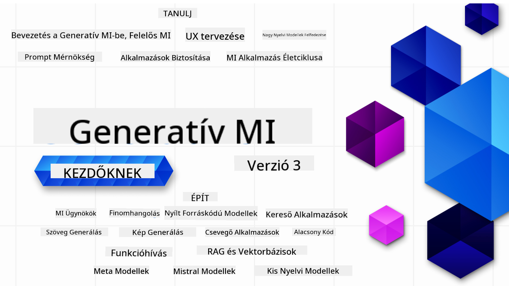

<!--
CO_OP_TRANSLATOR_METADATA:
{
  "original_hash": "ca2afa136ed9aca0634f39f51239746e",
  "translation_date": "2025-08-27T08:51:01+00:00",
  "source_file": "README.md",
  "language_code": "hu"
}
-->

### 21 lecke, amely megtanít mindent, amit tudnod kell a Generatív AI alkalmazások fejlesztésének elkezdéséhez

### 🌐 Többnyelvű támogatás

#### GitHub Action által támogatott (Automatikus és mindig naprakész)

[Francia](../fr/README.md) | [Spanyol](../es/README.md) | [Német](../de/README.md) | [Orosz](../ru/README.md) | [Arab](../ar/README.md) | [Perzsa (Farsi)](../fa/README.md) | [Urdu](../ur/README.md) | [Kínai (Egyszerűsített)](../zh/README.md) | [Kínai (Hagyományos, Makaó)](../mo/README.md) | [Kínai (Hagyományos, Hongkong)](../hk/README.md) | [Kínai (Hagyományos, Tajvan)](../tw/README.md) | [Japán](../ja/README.md) | [Koreai](../ko/README.md) | [Hindi](../hi/README.md) | [Bengáli](../bn/README.md) | [Maráthi](../mr/README.md) | [Nepáli](../ne/README.md) | [Pandzsábi (Gurmukhi)](../pa/README.md) | [Portugál (Portugália)](../pt/README.md) | [Portugál (Brazília)](../br/README.md) | [Olasz](../it/README.md) | [Litván](../lt/README.md) | [Lengyel](../pl/README.md) | [Török](../tr/README.md) | [Görög](../el/README.md) | [Thai](../th/README.md) | [Svéd](../sv/README.md) | [Dán](../da/README.md) | [Norvég](../no/README.md) | [Finn](../fi/README.md) | [Holland](../nl/README.md) | [Héber](../he/README.md) | [Vietnámi](../vi/README.md) | [Indonéz](../id/README.md) | [Maláj](../ms/README.md) | [Tagalog (Filippínó)](../tl/README.md) | [Szuahéli](../sw/README.md) | [Magyar](./README.md) | [Cseh](../cs/README.md) | [Szlovák](../sk/README.md) | [Román](../ro/README.md) | [Bolgár](../bg/README.md) | [Szerb (Cirill)](../sr/README.md) | [Horvát](../hr/README.md) | [Szlovén](../sl/README.md) | [Ukrán](../uk/README.md) | [Burmai (Mianmar)](../my/README.md)

# Generatív AI kezdőknek (3. verzió) - Egy kurzus

Tanuld meg a Generatív AI alkalmazások fejlesztésének alapjait a Microsoft Cloud Advocates 21 leckéből álló átfogó kurzusával.

## 🌱 Első lépések

Ez a kurzus 21 leckéből áll. Minden lecke egy-egy témát fed le, így kezdhetsz bárhol, ahol szeretnél!

A leckék "Tanulj" típusúak, amelyek egy Generatív AI koncepciót magyaráznak, vagy "Építs" típusúak, amelyek egy koncepciót és kódpéldákat magyaráznak **Python** és **TypeScript** nyelven, amikor lehetséges.

.NET fejlesztőknek ajánljuk a [Generatív AI kezdőknek (.NET kiadás)](https://github.com/microsoft/Generative-AI-for-beginners-dotnet?WT.mc_id=academic-105485-koreyst) kurzust!

Minden lecke tartalmaz egy "Továbbtanulás" szekciót további tanulási eszközökkel.

## Amire szükséged lesz
### A kurzus kódjának futtatásához használhatod:
 - [Azure OpenAI Service](https://aka.ms/genai-beginners/azure-open-ai?WT.mc_id=academic-105485-koreyst) - **Leckék:** "aoai-assignment"
 - [GitHub Marketplace Model Catalog](https://aka.ms/genai-beginners/gh-models?WT.mc_id=academic-105485-koreyst) - **Leckék:** "githubmodels"
 - [OpenAI API](https://aka.ms/genai-beginners/open-ai?WT.mc_id=academic-105485-koreyst) - **Leckék:** "oai-assignment" 
   
- Alapvető Python vagy TypeScript ismeretek hasznosak lehetnek - \*Teljesen kezdőknek ajánljuk ezeket a [Python](https://aka.ms/genai-beginners/python?WT.mc_id=academic-105485-koreyst) és [TypeScript](https://aka.ms/genai-beginners/typescript?WT.mc_id=academic-105485-koreyst) kurzusokat
- Egy GitHub fiók, hogy [forkold az egész repót](https://aka.ms/genai-beginners/github?WT.mc_id=academic-105485-koreyst) a saját GitHub fiókodba

Készítettünk egy **[Kurzus beállítása](./00-course-setup/README.md?WT.mc_id=academic-105485-koreyst)** leckét, hogy segítsünk a fejlesztési környezet beállításában.

Ne felejtsd el [csillagozni (🌟) ezt a repót](https://docs.github.com/en/get-started/exploring-projects-on-github/saving-repositories-with-stars?WT.mc_id=academic-105485-koreyst), hogy később könnyebben megtaláld.

## 🧠 Készen állsz a telepítésre?

Ha fejlettebb kódmintákat keresel, nézd meg a [Generatív AI kódminták gyűjteményét](https://aka.ms/genai-beg-code?WT.mc_id=academic-105485-koreyst) **Python** és **TypeScript** nyelven.

## 🗣️ Találkozz más tanulókkal, kérj segítséget

Csatlakozz az [Azure AI Foundry hivatalos Discord szerveréhez](https://aka.ms/genai-discord?WT.mc_id=academic-105485-koreyst), hogy találkozz és kapcsolatba lépj más tanulókkal, akik ezt a kurzust végzik, és kérj segítséget.

Tegyél fel kérdéseket vagy ossz meg termék visszajelzéseket az [Azure AI Foundry fejlesztői fórumon](https://aka.ms/azureaifoundry/forum) a Githubon.

## 🚀 Startupot építesz?

Látogass el a [Microsoft for Startups](https://www.microsoft.com/startups) oldalra, hogy megtudd, hogyan kezdhetsz el építkezni Azure kreditekkel.

## 🙏 Szeretnél segíteni?

Van javaslatod vagy találtál helyesírási vagy kódhibát? [Nyiss egy hibajegyet](https://github.com/microsoft/generative-ai-for-beginners/issues?WT.mc_id=academic-105485-koreyst) vagy [Hozz létre egy pull requestet](https://github.com/microsoft/generative-ai-for-beginners/pulls?WT.mc_id=academic-105485-koreyst)

## 📂 Minden lecke tartalmaz:

- Egy rövid videós bevezetőt a témához
- Egy írott leckét a README-ben
- Python és TypeScript kódmintákat, amelyek támogatják az Azure OpenAI-t és az OpenAI API-t
- Linkeket további tanulási forrásokhoz

## 🗃️ Leckék

| #   | **Lecke linkje**                                                                                                                              | **Leírás**                                                                                 | **Videó**                                                                   | **További tanulás**                                                             |
| --- | -------------------------------------------------------------------------------------------------------------------------------------------- | ----------------------------------------------------------------------------------------------- | --------------------------------------------------------------------------- | ------------------------------------------------------------------------------ |
| 00  | [Kurzus beállítása](./00-course-setup/README.md?WT.mc_id=academic-105485-koreyst)                                                                 | **Tanulj:** Hogyan állítsd be a fejlesztési környezeted                                            | Videó hamarosan                                                                 | [További tanulás](https://aka.ms/genai-collection?WT.mc_id=academic-105485-koreyst) |
| 01  | [Bevezetés a Generatív AI-ba és LLM-ekbe](./01-introduction-to-genai/README.md?WT.mc_id=academic-105485-koreyst)                              | **Tanulj:** Megérteni, mi az a Generatív AI és hogyan működnek a Nagy Nyelvi Modellek (LLM-ek).       | [Videó](https://aka.ms/gen-ai-lesson-1-gh?WT.mc_id=academic-105485-koreyst) | [További tanulás](https://aka.ms/genai-collection?WT.mc_id=academic-105485-koreyst) |
| 02  | [Különböző LLM-ek felfedezése és összehasonlítása](./02-exploring-and-comparing-different-llms/README.md?WT.mc_id=academic-105485-koreyst)             | **Tanulj:** Hogyan válaszd ki a megfelelő modellt az esetedhez                                      | [Videó](https://aka.ms/gen-ai-lesson2-gh?WT.mc_id=academic-105485-koreyst)  | [További tanulás](https://aka.ms/genai-collection?WT.mc_id=academic-105485-koreyst) |
| 03  | [Generatív AI felelősségteljes használata](./03-using-generative-ai-responsibly/README.md?WT.mc_id=academic-105485-koreyst)                           | **Tanulj:** Hogyan építs felelősségteljes Generatív AI alkalmazásokat                                  | [Videó](https://aka.ms/gen-ai-lesson3-gh?WT.mc_id=academic-105485-koreyst)  | [További tanulás](https://aka.ms/genai-collection?WT.mc_id=academic-105485-koreyst) |
| 04  | [Prompt Engineering alapjainak megértése](./04-prompt-engineering-fundamentals/README.md?WT.mc_id=academic-105485-koreyst)             | **Tanulj:** Gyakorlati Prompt Engineering legjobb gyakorlatok                                           | [Videó](https://aka.ms/gen-ai-lesson4-gh?WT.mc_id=academic-105485-koreyst)  | [További tanulás](https://aka.ms/genai-collection?WT.mc_id=academic-105485-koreyst) |
| 05  | [Haladó promptok létrehozása](./05-advanced-prompts/README.md?WT.mc_id=academic-105485-koreyst)                                                | **Tanulj:** Hogyan alkalmazz prompt engineering technikákat, amelyek javítják a promptok eredményét. | [Videó](https://aka.ms/gen-ai-lesson5-gh?WT.mc_id=academic-105485-koreyst)  | [További tanulás](https://aka.ms/genai-collection?WT.mc_id=academic-105485-koreyst) |
| 06  | [Szöveggeneráló alkalmazások építése](./06-text-generation-apps/README.md?WT.mc_id=academic-105485-koreyst)                                | **Építés:** Szöveggeneráló alkalmazás Azure OpenAI / OpenAI API használatával                   | [Videó](https://aka.ms/gen-ai-lesson6-gh?WT.mc_id=academic-105485-koreyst)  | [További információ](https://aka.ms/genai-collection?WT.mc_id=academic-105485-koreyst) |
| 07  | [Csevegőalkalmazások építése](./07-building-chat-applications/README.md?WT.mc_id=academic-105485-koreyst)                                     | **Építés:** Hatékony csevegőalkalmazások fejlesztésének és integrálásának technikái             | [Videó](https://aka.ms/gen-ai-lessons7-gh?WT.mc_id=academic-105485-koreyst) | [További információ](https://aka.ms/genai-collection?WT.mc_id=academic-105485-koreyst) |
| 08  | [Keresőalkalmazások építése vektoralapú adatbázisokkal](./08-building-search-applications/README.md?WT.mc_id=academic-105485-koreyst)        | **Építés:** Keresőalkalmazás, amely beágyazásokat használ az adatok kereséséhez                 | [Videó](https://aka.ms/gen-ai-lesson8-gh?WT.mc_id=academic-105485-koreyst)  | [További információ](https://aka.ms/genai-collection?WT.mc_id=academic-105485-koreyst) |
| 09  | [Képgeneráló alkalmazások építése](./09-building-image-applications/README.md?WT.mc_id=academic-105485-koreyst)                              | **Építés:** Képgeneráló alkalmazás                                                              | [Videó](https://aka.ms/gen-ai-lesson9-gh?WT.mc_id=academic-105485-koreyst)  | [További információ](https://aka.ms/genai-collection?WT.mc_id=academic-105485-koreyst) |
| 10  | [Low Code AI alkalmazások építése](./10-building-low-code-ai-applications/README.md?WT.mc_id=academic-105485-koreyst)                       | **Építés:** Generatív AI alkalmazás Low Code eszközök használatával                             | [Videó](https://aka.ms/gen-ai-lesson10-gh?WT.mc_id=academic-105485-koreyst) | [További információ](https://aka.ms/genai-collection?WT.mc_id=academic-105485-koreyst) |
| 11  | [Külső alkalmazások integrálása funkcióhívással](./11-integrating-with-function-calling/README.md?WT.mc_id=academic-105485-koreyst)         | **Építés:** Mi az a funkcióhívás, és hogyan használható alkalmazásokban                         | [Videó](https://aka.ms/gen-ai-lesson11-gh?WT.mc_id=academic-105485-koreyst) | [További információ](https://aka.ms/genai-collection?WT.mc_id=academic-105485-koreyst) |
| 12  | [UX tervezése AI alkalmazásokhoz](./12-designing-ux-for-ai-applications/README.md?WT.mc_id=academic-105485-koreyst)                         | **Tanulás:** Hogyan alkalmazzuk az UX tervezési elveket generatív AI alkalmazások fejlesztésekor | [Videó](https://aka.ms/gen-ai-lesson12-gh?WT.mc_id=academic-105485-koreyst) | [További információ](https://aka.ms/genai-collection?WT.mc_id=academic-105485-koreyst) |
| 13  | [Generatív AI alkalmazások biztonságossá tétele](./13-securing-ai-applications/README.md?WT.mc_id=academic-105485-koreyst)                  | **Tanulás:** Az AI rendszereket fenyegető kockázatok és ezek biztonságossá tételének módszerei  | [Videó](https://aka.ms/gen-ai-lesson13-gh?WT.mc_id=academic-105485-koreyst) | [További információ](https://aka.ms/genai-collection?WT.mc_id=academic-105485-koreyst) |
| 14  | [A generatív AI alkalmazások életciklusa](./14-the-generative-ai-application-lifecycle/README.md?WT.mc_id=academic-105485-koreyst)          | **Tanulás:** Az LLM életciklusának és LLMOps kezeléséhez szükséges eszközök és metrikák         | [Videó](https://aka.ms/gen-ai-lesson14-gh?WT.mc_id=academic-105485-koreyst) | [További információ](https://aka.ms/genai-collection?WT.mc_id=academic-105485-koreyst) |
| 15  | [Retrieval Augmented Generation (RAG) és vektoralapú adatbázisok](./15-rag-and-vector-databases/README.md?WT.mc_id=academic-105485-koreyst) | **Építés:** Alkalmazás RAG keretrendszer használatával, amely beágyazásokat nyer ki vektoralapú adatbázisokból | [Videó](https://aka.ms/gen-ai-lesson15-gh?WT.mc_id=academic-105485-koreyst) | [További információ](https://aka.ms/genai-collection?WT.mc_id=academic-105485-koreyst) |
| 16  | [Nyílt forráskódú modellek és Hugging Face](./16-open-source-models/README.md?WT.mc_id=academic-105485-koreyst)                             | **Építés:** Alkalmazás nyílt forráskódú modellek használatával, amelyek elérhetők a Hugging Face-en | [Videó](https://aka.ms/gen-ai-lesson16-gh?WT.mc_id=academic-105485-koreyst) | [További információ](https://aka.ms/genai-collection?WT.mc_id=academic-105485-koreyst) |
| 17  | [AI ügynökök](./17-ai-agents/README.md?WT.mc_id=academic-105485-koreyst)                                                                    | **Építés:** Alkalmazás AI ügynök keretrendszer használatával                                    | [Videó](https://aka.ms/gen-ai-lesson17-gh?WT.mc_id=academic-105485-koreyst) | [További információ](https://aka.ms/genai-collection?WT.mc_id=academic-105485-koreyst) |
| 18  | [LLM-ek finomhangolása](./18-fine-tuning/README.md?WT.mc_id=academic-105485-koreyst)                                                        | **Tanulás:** Miért, hogyan és mikor érdemes finomhangolni az LLM-eket                           | [Videó](https://aka.ms/gen-ai-lesson18-gh?WT.mc_id=academic-105485-koreyst) | [További információ](https://aka.ms/genai-collection?WT.mc_id=academic-105485-koreyst) |
| 19  | [SLM-ekkel való építés](./19-slm/README.md?WT.mc_id=academic-105485-koreyst)                                                                | **Tanulás:** Az SLM-ekkel való építés előnyei                                                   | Videó hamarosan | [További információ](https://aka.ms/genai-collection?WT.mc_id=academic-105485-koreyst) |
| 20  | [Mistral modellekkel való építés](./20-mistral/README.md?WT.mc_id=academic-105485-koreyst)                                                  | **Tanulás:** A Mistral modellcsalád jellemzői és különbségei                                    | Videó hamarosan | [További információ](https://aka.ms/genai-collection?WT.mc_id=academic-105485-koreyst) |
| 21  | [Meta modellekkel való építés](./21-meta/README.md?WT.mc_id=academic-105485-koreyst)                                                        | **Tanulás:** A Meta modellcsalád jellemzői és különbségei                                       | Videó hamarosan | [További információ](https://aka.ms/genai-collection?WT.mc_id=academic-105485-koreyst) |

### 🌟 Külön köszönet

Külön köszönet [**John Aziz**](https://www.linkedin.com/in/john0isaac/) számára, aki elkészítette az összes GitHub Actiont és munkafolyamatot.

[**Bernhard Merkle**](https://www.linkedin.com/in/bernhard-merkle-738b73/) számára, aki minden leckéhez kulcsfontosságú hozzájárulásokat tett, hogy javítsa a tanulási és kódolási élményt.

## 🎒 Egyéb kurzusok

Csapatunk más kurzusokat is készít! Nézd meg:

- [**ÚJ** Model Context Protocol kezdőknek](https://github.com/microsoft/mcp-for-beginners)
- [AI ügynökök kezdőknek](https://github.com/microsoft/ai-agents-for-beginners)
- [Generatív AI kezdőknek .NET használatával](https://github.com/microsoft/Generative-AI-for-beginners-dotnet)
- [Generatív AI kezdőknek JavaScript használatával](https://aka.ms/genai-js-course)
- [Generatív AI kezdőknek Java használatával](https://aka.ms/genaijava)
- [ML kezdőknek](https://aka.ms/ml-beginners)
- [Adattudomány kezdőknek](https://aka.ms/datascience-beginners)
- [AI kezdőknek](https://aka.ms/ai-beginners)
- [Kiberbiztonság kezdőknek](https://github.com/microsoft/Security-101)
- [Webfejlesztés kezdőknek](https://aka.ms/webdev-beginners)
- [IoT kezdőknek](https://aka.ms/iot-beginners)
- [XR fejlesztés kezdőknek](https://github.com/microsoft/xr-development-for-beginners)
- [GitHub Copilot mesterfokon AI páros programozáshoz](https://aka.ms/GitHubCopilotAI)
- [GitHub Copilot mesterfokon C#/.NET fejlesztőknek](https://github.com/microsoft/mastering-github-copilot-for-dotnet-csharp-developers)
- [Válaszd ki a saját Copilot kalandodat](https://github.com/microsoft/CopilotAdventures)

---

**Felelősségkizárás**:  
Ez a dokumentum az [Co-op Translator](https://github.com/Azure/co-op-translator) AI fordítási szolgáltatás segítségével készült. Bár törekszünk a pontosságra, kérjük, vegye figyelembe, hogy az automatikus fordítások hibákat vagy pontatlanságokat tartalmazhatnak. Az eredeti dokumentum az eredeti nyelvén tekintendő hiteles forrásnak. Kritikus információk esetén javasolt a professzionális, emberi fordítás igénybevétele. Nem vállalunk felelősséget a fordítás használatából eredő félreértésekért vagy téves értelmezésekért.