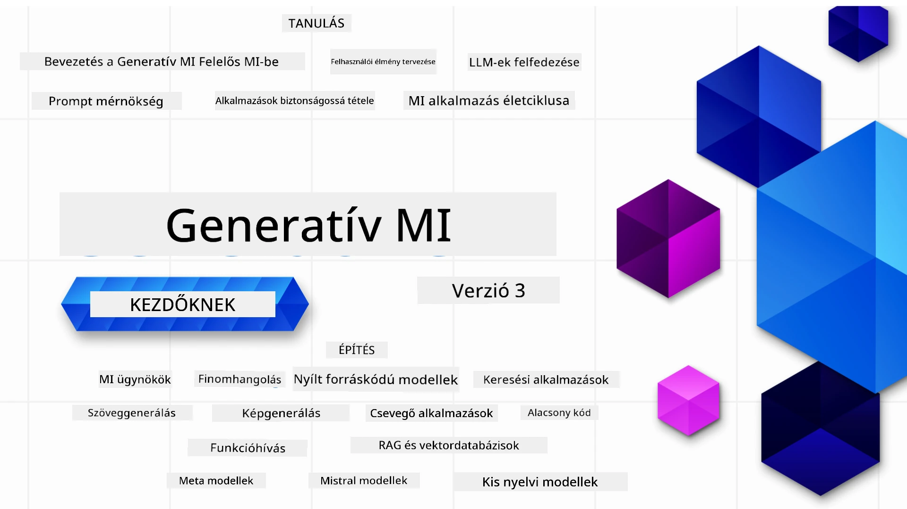

### 21 lecke, amely megtanít mindent, amit tudnod kell a generatív MI alkalmazások fejlesztésének megkezdéséhez

[](https://github.com/microsoft/Generative-AI-For-Beginners/blob/master/LICENSE?WT.mc_id=academic-105485-koreyst)
[](https://GitHub.com/microsoft/Generative-AI-For-Beginners/graphs/contributors/?WT.mc_id=academic-105485-koreyst)
[](https://GitHub.com/microsoft/Generative-AI-For-Beginners/issues/?WT.mc_id=academic-105485-koreyst)
[](https://GitHub.com/microsoft/Generative-AI-For-Beginners/pulls/?WT.mc_id=academic-105485-koreyst)
[](http://makeapullrequest.com?WT.mc_id=academic-105485-koreyst)

[](https://GitHub.com/microsoft/Generative-AI-For-Beginners/watchers/?WT.mc_id=academic-105485-koreyst)
[](https://GitHub.com/microsoft/Generative-AI-For-Beginners/network/?WT.mc_id=academic-105485-koreyst)
[](https://GitHub.com/microsoft/Generative-AI-For-Beginners/stargazers/?WT.mc_id=academic-105485-koreyst)

[](https://discord.gg/nTYy5BXMWG)

### 🌐 Többnyelvű támogatás

#### GitHub Action segítségével (Automatikus és Mindig Naprakész)

<!-- CO-OP TRANSLATOR LANGUAGES TABLE START -->
[Arab](../ar/README.md) | [Bengáli](../bn/README.md) | [Bolgár](../bg/README.md) | [Burmai (Myanmar)](../my/README.md) | [Kínai (Egyszerűsített)](../zh-CN/README.md) | [Kínai (Hagyományos, Hongkong)](../zh-HK/README.md) | [Kínai (Hagyományos, Makaó)](../zh-MO/README.md) | [Kínai (Hagyományos, Tajvan)](../zh-TW/README.md) | [Horvát](../hr/README.md) | [Cseh](../cs/README.md) | [Dán](../da/README.md) | [Holland](../nl/README.md) | [Észt](../et/README.md) | [Finn](../fi/README.md) | [Francia](../fr/README.md) | [Német](../de/README.md) | [Görög](../el/README.md) | [Héber](../he/README.md) | [Hindi](../hi/README.md) | [Magyar](./README.md) | [Indonéz](../id/README.md) | [Olasz](../it/README.md) | [Japán](../ja/README.md) | [Kannada](../kn/README.md) | [Khmer](../km/README.md) | [Koreai](../ko/README.md) | [Litván](../lt/README.md) | [Maláj](../ms/README.md) | [Malajálam](../ml/README.md) | [Maráthi](../mr/README.md) | [Nepáli](../ne/README.md) | [Nigériai pidgin](../pcm/README.md) | [Norvég](../no/README.md) | [Perzsa (Fárszi)](../fa/README.md) | [Lengyel](../pl/README.md) | [Portugál (Brazília)](../pt-BR/README.md) | [Portugál (Portugália)](../pt-PT/README.md) | [Pandzsábi (Gurmukhi)](../pa/README.md) | [Román](../ro/README.md) | [Orosz](../ru/README.md) | [Szerb (Cirill)](../sr/README.md) | [Szlovák](../sk/README.md) | [Szlovén](../sl/README.md) | [Spanyol](../es/README.md) | [Szuahéli](../sw/README.md) | [Svéd](../sv/README.md) | [Tagalog (Filippínó)](../tl/README.md) | [Tamil](../ta/README.md) | [Telugu](../te/README.md) | [Thai](../th/README.md) | [Török](../tr/README.md) | [Ukrán](../uk/README.md) | [Urdu](../ur/README.md) | [Vietnámi](../vi/README.md)

> **Szeretnél helyben klónozni?**
>
> Ez a tároló több mint 50 nyelv fordítását tartalmazza, ami jelentősen megnöveli a letöltési méretet. Ha fordítások nélkül szeretnéd klónozni, használd a spars checkout-ot:
>
> **Bash / macOS / Linux:**
> ```bash
> git clone --filter=blob:none --sparse https://github.com/microsoft/generative-ai-for-beginners.git
> cd generative-ai-for-beginners
> git sparse-checkout set --no-cone '/*' '!translations' '!translated_images'
> ```
>
> **CMD (Windows):**
> ```cmd
> git clone --filter=blob:none --sparse https://github.com/microsoft/generative-ai-for-beginners.git
> cd generative-ai-for-beginners
> git sparse-checkout set --no-cone "/*" "!translations" "!translated_images"
> ```
>
> Ez mindent megad ahhoz, hogy a kurzust sokkal gyorsabban tudjad elvégezni.
<!-- CO-OP TRANSLATOR LANGUAGES TABLE END -->

# Generatív MI kezdőknek (3. kiadás) – Tanfolyam

Tanuld meg a generatív MI alkalmazások fejlesztésének alapjait a Microsoft Cloud Advocates 21 leckéből álló átfogó tanfolyamával.

## 🌱 Kezdés

A tanfolyam 21 leckéből áll. Minden lecke külön témát fed le, szóval kezdj el onnan, ahol szeretnéd!

A leckék „Learn” címkével vannak ellátva, amelyek a generatív MI fogalmát magyarázzák, vagy „Build” címkével, amelyek egy fogalmat és kódpéldákat mutatnak be, ahol lehetséges, **Python** és **TypeScript** nyelveken.

.NET fejlesztőknek ajánljuk a [Generative AI for Beginners (.NET Edition)](https://github.com/microsoft/Generative-AI-for-beginners-dotnet?WT.mc_id=academic-105485-koreyst) verziót!

Minden lecke tartalmaz egy „Keep Learning” részt is további tanulási eszközökkel.

## Mire van szükséged?
### A kurzus kódjának futtatásához használhatod az alábbiakat:
 - [Azure OpenAI Szolgáltatás](https://aka.ms/genai-beginners/azure-open-ai?WT.mc_id=academic-105485-koreyst) – **Leckék:** "aoai-assignment"
 - [GitHub Marketplace Modell Katalógus](https://aka.ms/genai-beginners/gh-models?WT.mc_id=academic-105485-koreyst) – **Leckék:** "githubmodels"
 - [OpenAI API](https://aka.ms/genai-beginners/open-ai?WT.mc_id=academic-105485-koreyst) – **Leckék:** "oai-assignment"
   
- Az alapvető Python vagy TypeScript ismeretek hasznosak – \*Teljesen kezdőknek ajánlottak ezek a [Python](https://aka.ms/genai-beginners/python?WT.mc_id=academic-105485-koreyst) és [TypeScript](https://aka.ms/genai-beginners/typescript?WT.mc_id=academic-105485-koreyst) tanfolyamok
- Egy GitHub fiók, hogy [forkold ezt a tárolót](https://aka.ms/genai-beginners/github?WT.mc_id=academic-105485-koreyst) a saját GitHub fiókodba

Készítettünk egy **[Tanfolyam Beállítása](./00-course-setup/README.md?WT.mc_id=academic-105485-koreyst)** leckét, hogy segítsünk a fejlesztői környezet beállításában.

Ne felejts el rá [csillagozni (🌟) ezt a tárolót](https://docs.github.com/en/get-started/exploring-projects-on-github/saving-repositories-with-stars?WT.mc_id=academic-105485-koreyst), hogy később könnyebben megtaláld.

## 🧠 Készen állsz a telepítésre?

Ha fejlettebb kódpéldákat keresel, nézd meg a [Generatív MI Kódminták gyűjteményét](https://aka.ms/genai-beg-code?WT.mc_id=academic-105485-koreyst) Python és TypeScript nyelven egyaránt.

## 🗣️ Találkozz más tanulókkal, és kapj támogatást

Csatlakozz az [hivatalos Azure AI Foundry Discord szerverhez](https://aka.ms/genai-discord?WT.mc_id=academic-105485-koreyst), hogy találkozhass más tanfolyamot végzőkkel és támogatást kapj.

Tegyük fel kérdéseidet vagy oszd meg termék-visszajelzéseidet az [Azure AI Foundry Fejlesztői Fórumon](https://aka.ms/azureaifoundry/forum) GitHub-on.

## 🚀 Startupot építesz?

Látogass el a [Microsoft for Startups](https://www.microsoft.com/startups) oldalra, hogy megtudd, hogyan kezdhetsz el az Azure kreditekkel építkezni már ma.

## 🙏 Szeretnél segíteni?

Van javaslatod vagy találtál helyesírási vagy kódhibát? [Hozz létre egy hibajegyet](https://github.com/microsoft/generative-ai-for-beginners/issues?WT.mc_id=academic-105485-koreyst) vagy [küldj egy húzási kérelmet](https://github.com/microsoft/generative-ai-for-beginners/pulls?WT.mc_id=academic-105485-koreyst)

## 📂 Minden lecke tartalmaz:

- Egy rövid videós bevezetőt a témához
- Egy írott leckét a README fájlban
- Python és TypeScript kódpéldákat, amelyek támogatják az Azure OpenAI és az OpenAI API-t
- Linkeket további forrásokhoz a tanulás folytatásához

## 🗃️ Leckék

| #   | **Lecke linkje**                                                                                                                                | **Leírás**                                                                                      | **Videó**                                                                   | **További tanulás**                                                            |
| --- | ------------------------------------------------------------------------------------------------------------------------------------------------ | ---------------------------------------------------------------------------------------------- | --------------------------------------------------------------------------- | ------------------------------------------------------------------------------ |
| 00  | [Tanfolyam beállítása](./00-course-setup/README.md?WT.mc_id=academic-105485-koreyst)                                                             | **Tanuld meg:** Hogyan állítsd be a fejlesztői környezetedet                                   | Videó hamarosan                                                                 | [Tudj meg többet](https://aka.ms/genai-collection?WT.mc_id=academic-105485-koreyst) |
| 01  | [Bevezetés a generatív MI-be és a nagy nyelvi modellekbe (LLM-ekbe)](./01-introduction-to-genai/README.md?WT.mc_id=academic-105485-koreyst)        | **Tanuld meg:** Mi a generatív MI, és hogyan működnek a nagy nyelvi modellek (LLM-ek).          | [Videó](https://aka.ms/gen-ai-lesson-1-gh?WT.mc_id=academic-105485-koreyst) | [Tudj meg többet](https://aka.ms/genai-collection?WT.mc_id=academic-105485-koreyst) |
| 02  | [Különböző LLM-ek felfedezése és összehasonlítása](./02-exploring-and-comparing-different-llms/README.md?WT.mc_id=academic-105485-koreyst)           | **Tanuld meg:** Hogyan válassz ki a felhasználási esethez megfelelő modellt                     | [Videó](https://aka.ms/gen-ai-lesson2-gh?WT.mc_id=academic-105485-koreyst)  | [Tudj meg többet](https://aka.ms/genai-collection?WT.mc_id=academic-105485-koreyst) |
| 03  | [A generatív MI felelősségteljes használata](./03-using-generative-ai-responsibly/README.md?WT.mc_id=academic-105485-koreyst)                       | **Tanuld meg:** Hogyan építs felelősségteljes generatív MI alkalmazásokat                      | [Videó](https://aka.ms/gen-ai-lesson3-gh?WT.mc_id=academic-105485-koreyst)  | [Tudj meg többet](https://aka.ms/genai-collection?WT.mc_id=academic-105485-koreyst) |
| 04  | [A promptmérnökség alapjainak megértése](./04-prompt-engineering-fundamentals/README.md?WT.mc_id=academic-105485-koreyst)                     | **Tanulj:** Gyakorlati promptmérnökségi bevált gyakorlatok                                      | [Videó](https://aka.ms/gen-ai-lesson4-gh?WT.mc_id=academic-105485-koreyst) | [Tudj meg többet](https://aka.ms/genai-collection?WT.mc_id=academic-105485-koreyst) |
| 05  | [Haladó promptok létrehozása](./05-advanced-prompts/README.md?WT.mc_id=academic-105485-koreyst)                                               | **Tanulj:** Hogyan alkalmazzuk a promptmérnökségi technikákat a promptok eredményének javítására | [Videó](https://aka.ms/gen-ai-lesson5-gh?WT.mc_id=academic-105485-koreyst) | [Tudj meg többet](https://aka.ms/genai-collection?WT.mc_id=academic-105485-koreyst) |
| 06  | [Szöveg generáló alkalmazások építése](./06-text-generation-apps/README.md?WT.mc_id=academic-105485-koreyst)                                 | **Építs:** Egy szöveg generáló alkalmazást Azure OpenAI / OpenAI API használatával              | [Videó](https://aka.ms/gen-ai-lesson6-gh?WT.mc_id=academic-105485-koreyst) | [Tudj meg többet](https://aka.ms/genai-collection?WT.mc_id=academic-105485-koreyst) |
| 07  | [Csevegőalkalmazások építése](./07-building-chat-applications/README.md?WT.mc_id=academic-105485-koreyst)                                     | **Építs:** Hatékony csevegőalkalmazások építési és integrálási technikái                        | [Videó](https://aka.ms/gen-ai-lessons7-gh?WT.mc_id=academic-105485-koreyst) | [Tudj meg többet](https://aka.ms/genai-collection?WT.mc_id=academic-105485-koreyst) |
| 08  | [Keresőalkalmazások építése vektoralapú adatbázisokkal](./08-building-search-applications/README.md?WT.mc_id=academic-105485-koreyst)           | **Építs:** Egy keresőalkalmazást, amely beágyazásokat használ az adatok kereséséhez             | [Videó](https://aka.ms/gen-ai-lesson8-gh?WT.mc_id=academic-105485-koreyst) | [Tudj meg többet](https://aka.ms/genai-collection?WT.mc_id=academic-105485-koreyst) |
| 09  | [Képalkotó alkalmazások építése](./09-building-image-applications/README.md?WT.mc_id=academic-105485-koreyst)                                  | **Építs:** Egy képalkotó alkalmazást                                                         | [Videó](https://aka.ms/gen-ai-lesson9-gh?WT.mc_id=academic-105485-koreyst) | [Tudj meg többet](https://aka.ms/genai-collection?WT.mc_id=academic-105485-koreyst) |
| 10  | [Alacsony kódú AI alkalmazások építése](./10-building-low-code-ai-applications/README.md?WT.mc_id=academic-105485-koreyst)                     | **Építs:** Egy generatív AI alkalmazást alacsony kódú eszközök használatával                   | [Videó](https://aka.ms/gen-ai-lesson10-gh?WT.mc_id=academic-105485-koreyst) | [Tudj meg többet](https://aka.ms/genai-collection?WT.mc_id=academic-105485-koreyst) |
| 11  | [Külső alkalmazások integrálása függvényhívással](./11-integrating-with-function-calling/README.md?WT.mc_id=academic-105485-koreyst)           | **Építs:** Mi a függvényhívás és alkalmazási esetei                                          | [Videó](https://aka.ms/gen-ai-lesson11-gh?WT.mc_id=academic-105485-koreyst) | [Tudj meg többet](https://aka.ms/genai-collection?WT.mc_id=academic-105485-koreyst) |
| 12  | [Felhasználói élmény tervezése AI alkalmazásokhoz](./12-designing-ux-for-ai-applications/README.md?WT.mc_id=academic-105485-koreyst)             | **Tanulj:** Hogyan alkalmazzuk a UX tervezési elveket generatív AI alkalmazások fejlesztésekor| [Videó](https://aka.ms/gen-ai-lesson12-gh?WT.mc_id=academic-105485-koreyst) | [Tudj meg többet](https://aka.ms/genai-collection?WT.mc_id=academic-105485-koreyst) |
| 13  | [Generatív AI alkalmazások biztonságossá tétele](./13-securing-ai-applications/README.md?WT.mc_id=academic-105485-koreyst)                     | **Tanulj:** Az AI rendszerek fenyegetései és kockázatai, valamint ezek biztonságossá tételének módszerei | [Videó](https://aka.ms/gen-ai-lesson13-gh?WT.mc_id=academic-105485-koreyst) | [Tudj meg többet](https://aka.ms/genai-collection?WT.mc_id=academic-105485-koreyst) |
| 14  | [A generatív AI alkalmazások élettartama](./14-the-generative-ai-application-lifecycle/README.md?WT.mc_id=academic-105485-koreyst)               | **Tanulj:** Eszközök és metrikák az LLM életciklus és LLMOps kezeléséhez                     | [Videó](https://aka.ms/gen-ai-lesson14-gh?WT.mc_id=academic-105485-koreyst) | [Tudj meg többet](https://aka.ms/genai-collection?WT.mc_id=academic-105485-koreyst) |
| 15  | [Visszakeresés-alapú generálás (RAG) és vektoralapú adatbázisok](./15-rag-and-vector-databases/README.md?WT.mc_id=academic-105485-koreyst)      | **Építs:** Egy alkalmazást RAG keretrendszer használatával, amely vektor adatbázisokból keres beágyazásokat | [Videó](https://aka.ms/gen-ai-lesson15-gh?WT.mc_id=academic-105485-koreyst) | [Tudj meg többet](https://aka.ms/genai-collection?WT.mc_id=academic-105485-koreyst) |
| 16  | [Nyílt forráskódú modellek és Hugging Face](./16-open-source-models/README.md?WT.mc_id=academic-105485-koreyst)                                | **Építs:** Egy alkalmazást a Hugging Face nyílt forráskódú modelljeinek használatával         | [Videó](https://aka.ms/gen-ai-lesson16-gh?WT.mc_id=academic-105485-koreyst) | [Tudj meg többet](https://aka.ms/genai-collection?WT.mc_id=academic-105485-koreyst) |
| 17  | [AI ügynökök](./17-ai-agents/README.md?WT.mc_id=academic-105485-koreyst)                                                                     | **Építs:** Egy alkalmazást AI ügynök keretrendszer használatával                              | [Videó](https://aka.ms/gen-ai-lesson17-gh?WT.mc_id=academic-105485-koreyst) | [Tudj meg többet](https://aka.ms/genai-collection?WT.mc_id=academic-105485-koreyst) |
| 18  | [LLM-ek finomhangolása](./18-fine-tuning/README.md?WT.mc_id=academic-105485-koreyst)                                                          | **Tanulj:** Mit, miért és hogyan finomhangoljuk az LLM-eket                                  | [Videó](https://aka.ms/gen-ai-lesson18-gh?WT.mc_id=academic-105485-koreyst) | [Tudj meg többet](https://aka.ms/genai-collection?WT.mc_id=academic-105485-koreyst) |
| 19  | [Kisnyelvi modellekkel való építés](./19-slm/README.md?WT.mc_id=academic-105485-koreyst)                                                        | **Tanulj:** Kisnyelvi modellekkel való építés előnyei                                       | Videó hamarosan | [Tudj meg többet](https://aka.ms/genai-collection?WT.mc_id=academic-105485-koreyst) |
| 20  | [Mistral modellekkel való építés](./20-mistral/README.md?WT.mc_id=academic-105485-koreyst)                                                      | **Tanulj:** A Mistral család modelleinek jellemzői és különbségei                           | Videó hamarosan | [Tudj meg többet](https://aka.ms/genai-collection?WT.mc_id=academic-105485-koreyst) |
| 21  | [Meta modellekkel való építés](./21-meta/README.md?WT.mc_id=academic-105485-koreyst)                                                          | **Tanulj:** A Meta család modelleinek jellemzői és különbségei                            | Videó hamarosan | [Tudj meg többet](https://aka.ms/genai-collection?WT.mc_id=academic-105485-koreyst) |

### 🌟 Külön köszönet

Külön köszönet [**John Aziz**](https://www.linkedin.com/in/john0isaac/) számára az összes GitHub Actions és munkafolyamat létrehozásáért.

[**Bernhard Merkle**](https://www.linkedin.com/in/bernhard-merkle-738b73/) részére, aki kulcsfontosságú hozzájárulásokat tett az egyes leckékhez, hogy javítsa a tanulói és kódélményt.

## 🎒 Egyéb kurzusok

Csapatunk más kurzusokat is készít! Nézd meg:

<!-- CO-OP TRANSLATOR OTHER COURSES START -->
### LangChain
[](https://aka.ms/langchain4j-for-beginners)
[](https://aka.ms/langchainjs-for-beginners?WT.mc_id=m365-94501-dwahlin)
[](https://github.com/microsoft/langchain-for-beginners?WT.mc_id=m365-94501-dwahlin)
---

### Azure / Edge / MCP / Ügynökök
[](https://github.com/microsoft/AZD-for-beginners?WT.mc_id=academic-105485-koreyst)
[](https://github.com/microsoft/edgeai-for-beginners?WT.mc_id=academic-105485-koreyst)
[](https://github.com/microsoft/mcp-for-beginners?WT.mc_id=academic-105485-koreyst)
[](https://github.com/microsoft/ai-agents-for-beginners?WT.mc_id=academic-105485-koreyst)

---
 
### Generatív AI sorozat
[](https://github.com/microsoft/generative-ai-for-beginners?WT.mc_id=academic-105485-koreyst)
[-9333EA?style=for-the-badge&labelColor=E5E7EB&color=9333EA)](https://github.com/microsoft/Generative-AI-for-beginners-dotnet?WT.mc_id=academic-105485-koreyst)
[-C084FC?style=for-the-badge&labelColor=E5E7EB&color=C084FC)](https://github.com/microsoft/generative-ai-for-beginners-java?WT.mc_id=academic-105485-koreyst)
[-E879F9?style=for-the-badge&labelColor=E5E7EB&color=E879F9)](https://github.com/microsoft/generative-ai-with-javascript?WT.mc_id=academic-105485-koreyst)

---
 
### Alapvető tanulás
[](https://aka.ms/ml-beginners?WT.mc_id=academic-105485-koreyst)
[](https://aka.ms/datascience-beginners?WT.mc_id=academic-105485-koreyst)
[](https://aka.ms/ai-beginners?WT.mc_id=academic-105485-koreyst)
[](https://github.com/microsoft/Security-101?WT.mc_id=academic-96948-sayoung)
[](https://aka.ms/webdev-beginners?WT.mc_id=academic-105485-koreyst)
[](https://aka.ms/iot-beginners?WT.mc_id=academic-105485-koreyst)
[](https://github.com/microsoft/xr-development-for-beginners?WT.mc_id=academic-105485-koreyst)

---
 
### Copilot sorozat
[](https://aka.ms/GitHubCopilotAI?WT.mc_id=academic-105485-koreyst)
[](https://github.com/microsoft/mastering-github-copilot-for-dotnet-csharp-developers?WT.mc_id=academic-105485-koreyst)
[](https://github.com/microsoft/CopilotAdventures?WT.mc_id=academic-105485-koreyst)
<!-- CO-OP TRANSLATOR OTHER COURSES END -->

## Segítségkérés

Ha elakad vagy kérdése van az AI alkalmazások fejlesztésével kapcsolatban. Csatlakozz tanulótársaidhoz és tapasztalt fejlesztőkhöz az MCP-vel kapcsolatos beszélgetésekben. Ez egy támogató közösség, ahol a kérdések szívesen látottak, és a tudás szabadon megosztott.

[](https://discord.gg/nTYy5BXMWG)

Ha termék visszajelzése vagy hibák vannak a fejlesztés során, látogasson el:

[](https://aka.ms/foundry/forum)

---

<!-- CO-OP TRANSLATOR DISCLAIMER START -->
**Jogi nyilatkozat**:  
Ezt a dokumentumot az AI fordító szolgáltatás, a [Co-op Translator](https://github.com/Azure/co-op-translator) használatával fordítottuk. Bár az pontosságra törekszünk, kérjük, vegye figyelembe, hogy az automatikus fordítások hibákat vagy pontatlanságokat tartalmazhatnak. Az eredeti dokumentum anyanyelvű változata tekintendő hiteles forrásnak. Kritikus információk esetén professzionális, emberi fordítást javaslunk. Nem vállalunk felelősséget a fordítás használatából eredő félreértésekért vagy félreértelmezésekért.
<!-- CO-OP TRANSLATOR DISCLAIMER END -->