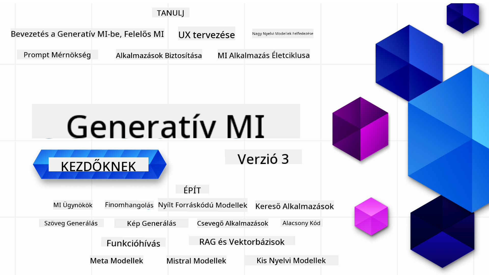

<!--
CO_OP_TRANSLATOR_METADATA:
{
  "original_hash": "6e3f4c8a4f323b8eab1cf11ded304b0f",
  "translation_date": "2025-06-25T08:11:47+00:00",
  "source_file": "README.md",
  "language_code": "hu"
}
-->

### 21 Lecke, amelyek mindent megtanítanak, amit tudnod kell a Generatív AI alkalmazások építésének elkezdéséhez

    

  

### 🌐 Többnyelvű támogatás

#### Támogatott a GitHub Action által (Automatikus és Mindig Naprakész)

# Generatív AI kezdőknek (3. verzió) - Egy kurzus

Tanulja meg a generatív AI alkalmazások építésének alapjait a Microsoft Cloud Advocates által készített 21 leckéből álló átfogó kurzusunkkal.

## 🌱 Kezdetek

Ez a kurzus 21 leckéből áll. Minden lecke saját témát tárgyal, így kezdheted ott, ahol csak szeretnéd!

A leckék vagy "Tanulj" leckék, amelyek egy generatív AI koncepciót magyaráznak, vagy "Építs" leckék, amelyek egy koncepciót és kódpéldákat magyaráznak mind **Python**, mind **TypeScript** nyelven, amikor lehetséges.

.NET fejlesztők számára nézd meg a [Generatív AI kezdőknek (.NET kiadás)](https://github.com/microsoft/Generative-AI-for-beginners-dotnet?WT.mc_id=academic-105485-koreyst)!

Minden lecke tartalmaz egy "Folytasd a tanulást" részt további tanulási eszközökkel.

## Amire szükséged van
### A kurzus kódjának futtatásához használhatod:
- [Azure OpenAI Service](https://aka.ms/genai-beginners/azure-open-ai?WT.mc_id=academic-105485-koreyst) - **Leckék:** "aoai-assignment"
- [GitHub Marketplace Model Catalog](https://aka.ms/genai-beginners/gh-models?WT.mc_id=academic-105485-koreyst) - **Leckék:** "githubmodels"
- [OpenAI API](https://aka.ms/genai-beginners/open-ai?WT.mc_id=academic-105485-koreyst) - **Leckék:** "oai-assignment"

- Alapvető Python vagy TypeScript ismeretek hasznosak - \*Teljesen kezdők számára nézd meg ezeket a [Python](https://aka.ms/genai-beginners/python?WT.mc_id=academic-105485-koreyst) és [TypeScript](https://aka.ms/genai-beginners/typescript?WT.mc_id=academic-105485-koreyst) kurzusokat
- Egy GitHub fiók, hogy [forkold ezt a teljes repót](https://aka.ms/genai-beginners/github?WT.mc_id=academic-105485-koreyst) a saját GitHub fiókodba

Létrehoztunk egy **[Kurzus beállítása](./00-course-setup/README.md?WT.mc_id=academic-105485-koreyst)** leckét, hogy segítsen a fejlesztési környezet beállításában.

Ne felejtsd el [csillagozni (🌟) ezt a repót](https://docs.github.com/en/get-started/exploring-projects-on-github/saving-repositories-with-stars?WT.mc_id=academic-105485-koreyst), hogy később könnyebben megtaláld.

## 🧠 Készen állsz a telepítésre?

Ha további fejlett kódmintákat keresel, nézd meg a [Generatív AI kódaminták gyűjteményét](https://aka.ms/genai-beg-code?WT.mc_id=academic-105485-koreyst) mind **Python**, mind **TypeScript** nyelven.

## 🗣️ Találkozz más tanulókkal, kérj támogatást

Csatlakozz a [hivatalos Azure AI Foundry Discord szerverünkhöz](https://aka.ms/genai-discord?WT.mc_id=academic-105485-koreyst), hogy találkozz és hálózatot építs más tanulókkal, akik ezt a kurzust veszik, és támogatást kapj.

Tegyél fel kérdéseket vagy oszd meg termék visszajelzéseidet az [Azure AI Foundry Developer Forum](https://aka.ms/azureaifoundry/forum) oldalon a Githubon.

## 🚀 Startup építésén dolgozol?

Regisztrálj a [Microsoft for Startups Founders Hub](https://aka.ms/genai-foundershub?WT.mc_id=academic-105485-koreyst) oldalán, hogy **ingyenes OpenAI krediteket** és akár **150 ezer dollárt Azure kreditekhez** kapj, hogy hozzáférj az OpenAI modellekhez az Azure OpenAI Services-en keresztül.

## 🙏 Szeretnél segíteni?

Van javaslatod vagy hibát találtál a helyesírásban vagy a kódban? [Jelents egy hibát](https://github.com/microsoft/generative-ai-for-beginners/issues?WT.mc_id=academic-105485-koreyst) vagy [Hozz létre egy pull kérést](https://github.com/microsoft/generative-ai-for-beginners/pulls?WT.mc_id=academic-105485-koreyst)

## 📂 Minden lecke tartalmaz:

- Egy rövid videós bevezetőt a témához
- Egy írott leckét a README-ben
- Python és TypeScript kódpéldákat, amelyek támogatják az Azure OpenAI és OpenAI API-t
- Linkeket további forrásokhoz a tanulás folytatásához

## 🗃️ Leckék

| #   | **Lecke linkje**                                                                                                                              | **Leírás**                                                                                 | **Videó**                                                                   | **További tanulás**                                                             |
| --- | -------------------------------------------------------------------------------------------------------------------------------------------- | ----------------------------------------------------------------------------------------------- | --------------------------------------------------------------------------- | ------------------------------------------------------------------------------ |
| 00  | [Kurzus beállítása](./00-course-setup/README.md?WT.mc_id=academic-105485-koreyst)                                                                 | **Tanulj:** Hogyan állítsd be a fejlesztési környezeted                                            | Videó hamarosan                                                                 | [Tudj meg többet](https://aka.ms/genai-collection?WT.mc_id=academic-105485-koreyst) |
| 01  | [Bevezetés a Generatív AI és LLM-ek világába](./01-introduction-to-genai/README.md?WT.mc_id=academic-105485-koreyst)                              | **Tanulj:** Megérteni, mi az a Generatív AI és hogyan működnek a Nagy Nyelvi Modellek (LLM-ek).       | [Videó](https://aka.ms/gen-ai-lesson-1-gh?WT.mc_id=academic-105485-koreyst) | [Tudj meg többet](https://aka.ms/genai-collection?WT.mc_id=academic-105485-koreyst) |
| 02  | [Különböző LLM-ek felfedezése és összehasonlítása](./02-exploring-and-comparing-different-llms/README.md?WT.mc_id=academic-105485-koreyst)             | **Tanulj:** Hogyan válasszuk ki a megfelelő modellt az adott felhasználási esethez                                      | [Videó](https://aka.ms/gen-ai-lesson2-gh?WT.mc_id=academic-105485-koreyst)  | [Tudj meg többet](https://aka.ms/genai-collection?WT.mc_id=academic-105485-koreyst) |
| 03  | [Generatív AI felelősségteljes használata](./03-using-generative-ai-responsibly/README.md?WT.mc_id=academic-105485-koreyst)                           | **Tanulj:** Hogyan építsünk felelősségteljesen Generatív AI alkalmazásokat                                  | [Videó](https://aka.ms/gen-ai-lesson3-gh?WT.mc_id=academic-105485-koreyst)  | [Tudj meg többet](https://aka.ms/genai-collection?WT.mc_id=academic-105485-koreyst) |
| 04  | [Prompt Engineering alapjainak megértése](./04-prompt-engineering-fundamentals/README.md?WT.mc_id=academic-105485-koreyst)             | **Tanulj:** Gyakorlati Prompt Engineering legjobb gyakorlatok                                           | [Videó](https://aka.ms/gen-ai-lesson4-gh?WT.mc_id=academic-105485-koreyst)  | [Tudj meg többet](https://aka.ms/genai-collection?WT.mc_id=academic-105485-koreyst) |
| 05  | [Haladó promptok létrehozása](./05-advanced-prompts/README.md?WT.mc_id=academic-105485-koreyst)                                                | **Tanulj:** Hogyan alkalmazz prompt mérnöki technikákat a promptjaid eredményének javítása érdekében. | [Videó](https://aka.ms/gen-ai-lesson5-gh?WT.mc_id=academic-105485-koreyst)  | [Tudj meg többet](https://aka.ms/genai-collection?WT.mc_id=academic-105485-koreyst) |
| 06  | [Szöveg generáló alkalmazások építése](./06-text-generation-apps/README.md?WT.mc_id=academic-105485-koreyst)                                | **Építs:** Egy szöveg generáló alkalmazás az Azure OpenAI / OpenAI API használatával                                | [Videó](https://aka.ms/gen-ai-lesson6-gh?WT.mc_id=academic-105485-koreyst)  | [Tudj meg többet](https://aka.ms/genai-collection?WT.mc_id=academic-105485-koreyst) |
| 07  | [Chat alkalmazások építése](./07-building-chat-applications/README.md?WT.mc_id=academic-105485-koreyst)                                     | **Építs:** Technikák a chat alkalmazások hatékony építéséhez és integrálásához.               | [Videó](https://aka.ms/gen-ai-lessons7-gh?WT.mc_id=academic-105485-koreyst) | [Tudj meg többet](https://aka.ms/genai-collection?WT.mc_id=academic-105485-koreyst) |
| 08  | [Kereső alkalmazások építése vektor adatbázisokkal](./08-building-search-applications/README.md?WT.mc_id=academic-105485-koreyst)                        | **Építs:** Egy kereső alkalmazás, amely beágyazásokat használ az adatok keresésére.                        | [Videó](https://aka.ms/gen-ai-lesson8-gh?WT.mc_id=academic-105485-koreyst)  | [Tudj meg többet](https://aka.ms/genai-collection?WT.mc_id=academic-105485-koreyst) |
| 09  | [Kép generáló alkalmazások építése](./09-building-image-applications/README.md?WT.mc_id=academic-105485-koreyst)                        | **Építs:** Egy kép generáló alkalmazás                                                       | [Videó](https://aka.ms/gen-ai-lesson9-gh?WT.mc_id=academic-105485-koreyst)  | [Tudj meg többet](https://aka.ms/genai-collection?WT.mc_id=academic-105485-koreyst) |
| 10  | [Alacsony kódú AI alkalmazások építése](./10-building-low-code-ai-applications/README.md?WT.mc_id=academic-105485-koreyst)                       | **Építs:** Egy Generatív AI alkalmazás alacsony kódú eszközök használatával                                     | [Videó](https://aka.ms/gen-ai-lesson10-gh?WT.mc_id=academic-105485-koreyst) | [Tudj meg többet](https://aka.ms/genai-collection?WT.mc_id=academic-105485-koreyst) |
| 11  | [Külső alkalmazások integrálása funkcióhívással](./11-integrating-with-function-calling/README.md?WT.mc_id=academic-105485-koreyst) | **Építs:** Mi az a funkcióhívás és hogyan használható az alkalmazásokban                          | [Videó](https://aka.ms/gen-ai-lesson11-gh?WT.mc_id=academic-105485-koreyst) | [Tudj meg többet](https://aka.ms/genai-collection?WT.mc_id=academic-105485-koreyst) |
| 12  | [UX tervezés AI alkalmazásokhoz](./12-designing-ux-for-ai-applications/README.md?WT.mc_id=academic-105485-koreyst)                         | **Tanulj:** Hogyan alkalmazzuk az UX tervezési elveket a Generatív AI alkalmazások fejlesztése során         | [Videó](https://aka.ms/gen-ai-lesson12-gh?WT.mc_id=academic-105485-koreyst) | [Tudj meg többet](https://aka.ms/genai-collection?WT.mc_id=academic-105485-koreyst) |
| 13  | [Generatív AI alkalmazások védelme](./13-securing-ai-applications/README.md?WT.mc_id=academic-105485-koreyst)                         | **Tanulj:** Az AI rendszereket fenyegető veszélyek és kockázatok, valamint ezeknek a rendszereknek a védelmi módszerei.             | [Videó](https://aka.ms/gen-ai-lesson13-gh?WT.mc_id=academic-105485-koreyst) | [Tudj meg többet](https://aka.ms/genai-collection?WT.mc_id=academic-105485-koreyst) |
| 14  | [A Generatív AI alkalmazás életciklusa](./14-the-generative-ai-application-lifecycle/README.md?WT.mc_id=academic-105485-koreyst)           | **Tanulj:** Az eszközök és mérőszámok az LLM életciklus és LLMOps kezelésére                         | [Videó](https://aka.ms/gen-ai-lesson14-gh?WT.mc_id=academic-105485-koreyst) | [Tudj meg többet](https://aka.ms/genai-collection?WT.mc_id=academic-105485-koreyst) |
| 15  | [Keresés Kiterjesztett Generálás (RAG) és Vektor Adatbázisok](./15-rag-and-vector-databases/README.md?WT.mc_id=academic-105485-koreyst)        | **Építés:** Alkalmazás létrehozása RAG keretrendszer segítségével, hogy vektor adatbázisokból lekérje a beágyazásokat  | [Videó](https://aka.ms/gen-ai-lesson15-gh?WT.mc_id=academic-105485-koreyst) | [További információ](https://aka.ms/genai-collection?WT.mc_id=academic-105485-koreyst) |
| 16  | [Nyílt Forráskódú Modellek és Hugging Face](./16-open-source-models/README.md?WT.mc_id=academic-105485-koreyst)                                    | **Építés:** Alkalmazás létrehozása a Hugging Face-en elérhető nyílt forráskódú modellek segítségével                    | [Videó](https://aka.ms/gen-ai-lesson16-gh?WT.mc_id=academic-105485-koreyst) | [További információ](https://aka.ms/genai-collection?WT.mc_id=academic-105485-koreyst) |
| 17  | [AI Ügynökök](./17-ai-agents/README.md?WT.mc_id=academic-105485-koreyst)                                                                       | **Építés:** Alkalmazás létrehozása AI Ügynök Keretrendszer segítségével                                           | [Videó](https://aka.ms/gen-ai-lesson17-gh?WT.mc_id=academic-105485-koreyst) | [További információ](https://aka.ms/genai-collection?WT.mc_id=academic-105485-koreyst) |
| 18  | [LLM-ek Finomhangolása](./18-fine-tuning/README.md?WT.mc_id=academic-105485-koreyst)                                                              | **Tanulás:** Mit, miért és hogyan finomhangoljuk az LLM-eket                                            | [Videó](https://aka.ms/gen-ai-lesson18-gh?WT.mc_id=academic-105485-koreyst) | [További információ](https://aka.ms/genai-collection?WT.mc_id=academic-105485-koreyst) |
| 19  | [Építés Kisméretű Nyelvi Modellekkel](./19-slm/README.md?WT.mc_id=academic-105485-koreyst)                                                              | **Tanulás:** A kisméretű nyelvi modellekkel való építés előnyei                                            | Videó hamarosan | [További információ](https://aka.ms/genai-collection?WT.mc_id=academic-105485-koreyst) |
| 20  | [Építés Mistral Modellekkel](./20-mistral/README.md?WT.mc_id=academic-105485-koreyst)                                                              | **Tanulás:** A Mistral család modellek jellemzői és különbségei                                           | Videó hamarosan | [További információ](https://aka.ms/genai-collection?WT.mc_id=academic-105485-koreyst) |
| 21  | [Építés Meta Modellekkel](./21-meta/README.md?WT.mc_id=academic-105485-koreyst)                                                              | **Tanulás:** A Meta család modellek jellemzői és különbségei                                           | Videó hamarosan | [További információ](https://aka.ms/genai-collection?WT.mc_id=academic-105485-koreyst) |

### 🌟 Külön köszönet

Külön köszönet [**John Aziz**](https://www.linkedin.com/in/john0isaac/) számára az összes GitHub Actions és munkafolyamat létrehozásáért

[**Bernhard Merkle**](https://www.linkedin.com/in/bernhard-merkle-738b73/) számára, hogy minden leckéhez kulcsfontosságú hozzájárulásokat tett a tanulói és kódolási élmény javítása érdekében.

## 🎒 Egyéb tanfolyamok

Csapatunk más tanfolyamokat is készít! Nézd meg:

- [**ÚJ** Modell Kontextus Protokoll Kezdőknek](https://github.com/microsoft/mcp-for-beginners?WT.mc_id=academic-105485-koreyst)
- [AI Ügynökök Kezdőknek](https://github.com/microsoft/ai-agents-for-beginners?WT.mc_id=academic-105485-koreyst)
- [Generatív AI Kezdőknek .NET használatával](https://github.com/microsoft/Generative-AI-for-beginners-dotnet?WT.mc_id=academic-105485-koreyst)
- [Generatív AI Kezdőknek JavaScript használatával](https://aka.ms/genai-js-course?WT.mc_id=academic-105485-koreyst)
- [ML Kezdőknek](https://aka.ms/ml-beginners?WT.mc_id=academic-105485-koreyst)
- [Adattudomány Kezdőknek](https://aka.ms/datascience-beginners?WT.mc_id=academic-105485-koreyst)
- [AI Kezdőknek](https://aka.ms/ai-beginners?WT.mc_id=academic-105485-koreyst)
- [Kiberbiztonság Kezdőknek](https://github.com/microsoft/Security-101??WT.mc_id=academic-96948-sayoung)
- [Webfejlesztés Kezdőknek](https://aka.ms/webdev-beginners?WT.mc_id=academic-105485-koreyst)
- [IoT Kezdőknek](https://aka.ms/iot-beginners?WT.mc_id=academic-105485-koreyst)
- [XR fejlesztés kezdőknek](https://github.com/microsoft/xr-development-for-beginners?WT.mc_id=academic-105485-koreyst)
- [GitHub Copilot elsajátítása AI páros programozáshoz](https://aka.ms/GitHubCopilotAI?WT.mc_id=academic-105485-koreyst)
- [GitHub Copilot elsajátítása C#/.NET fejlesztőknek](https://github.com/microsoft/mastering-github-copilot-for-dotnet-csharp-developers?WT.mc_id=academic-105485-koreyst)
- [Válaszd ki a saját Copilot kalandodat](https://github.com/microsoft/CopilotAdventures?WT.mc_id=academic-105485-koreyst)

**Felelősség kizárása**:  
Ezt a dokumentumot az AI fordítási szolgáltatás [Co-op Translator](https://github.com/Azure/co-op-translator) segítségével fordították le. Bár törekszünk a pontosságra, kérjük, vegye figyelembe, hogy az automatikus fordítások hibákat vagy pontatlanságokat tartalmazhatnak. Az eredeti dokumentum az eredeti nyelvén tekinthető a hiteles forrásnak. Fontos információk esetén javasolt a professzionális emberi fordítás igénybevétele. Nem vállalunk felelősséget semmilyen félreértésért vagy félremagyarázásért, amely a fordítás használatából ered.