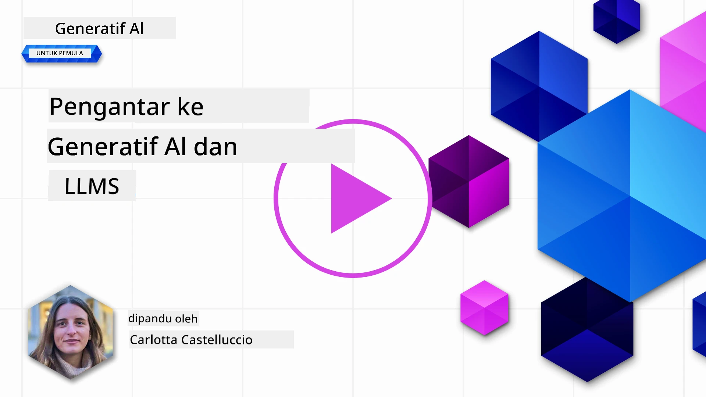
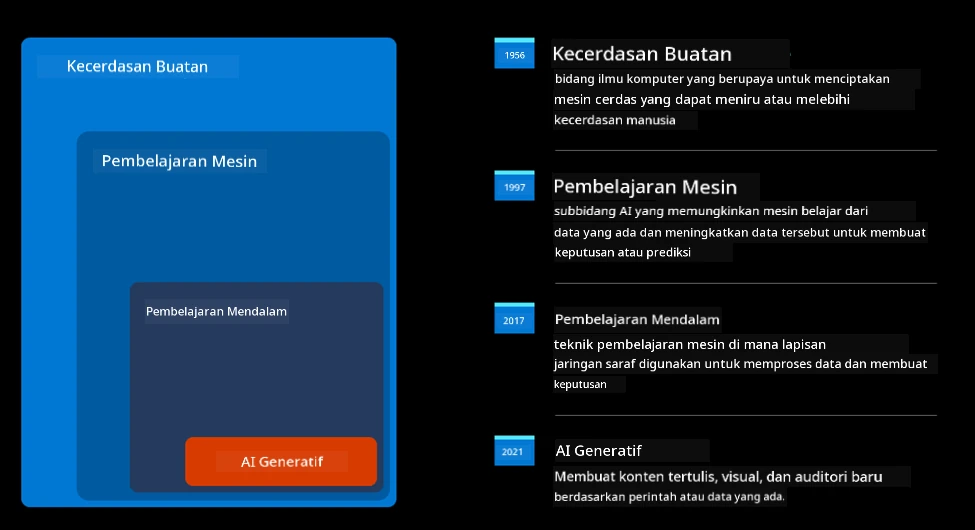
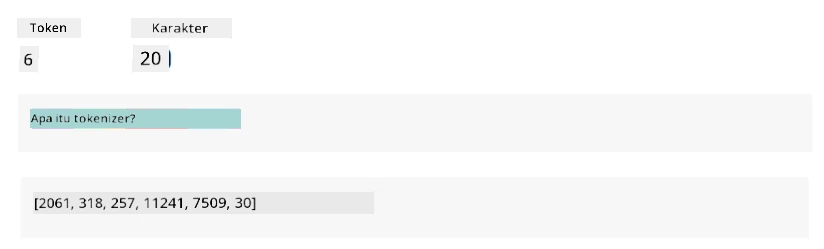
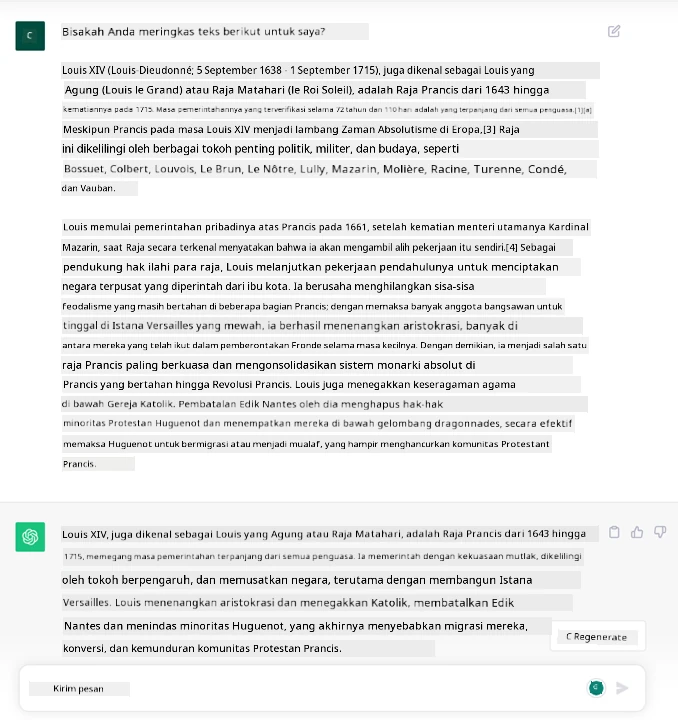
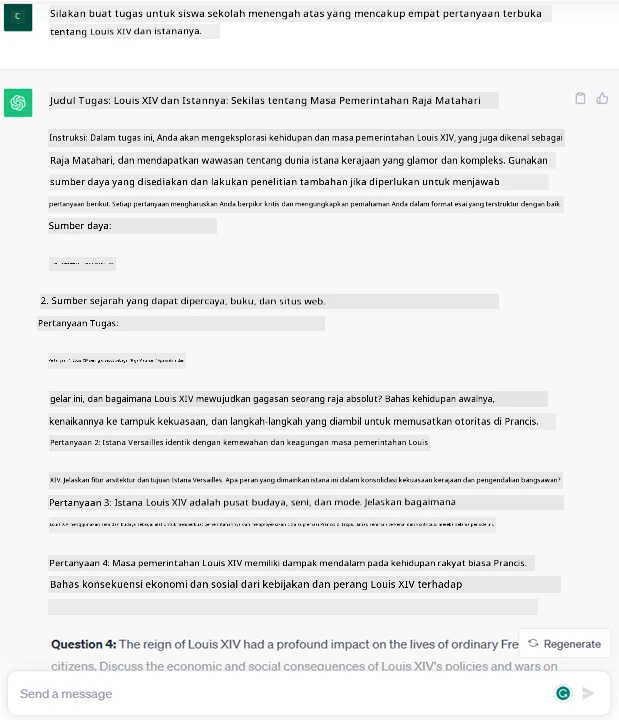
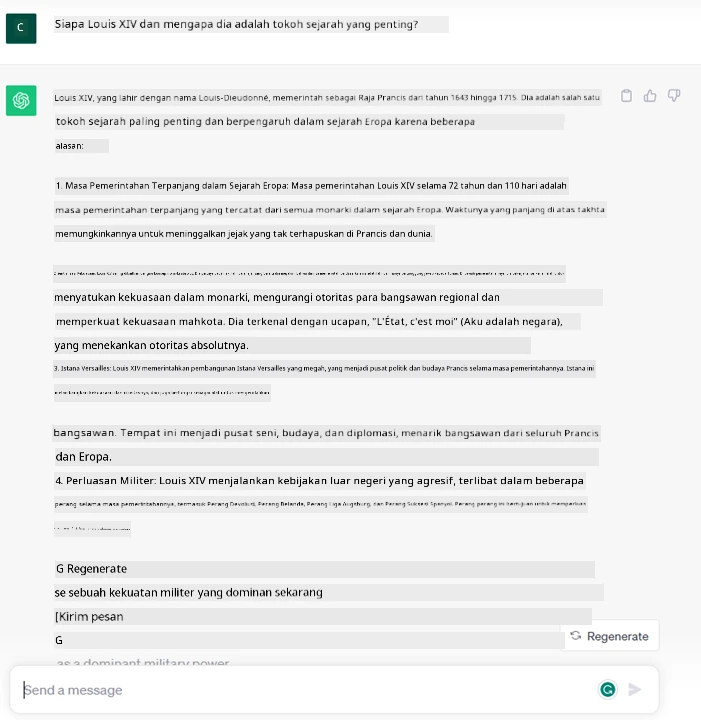
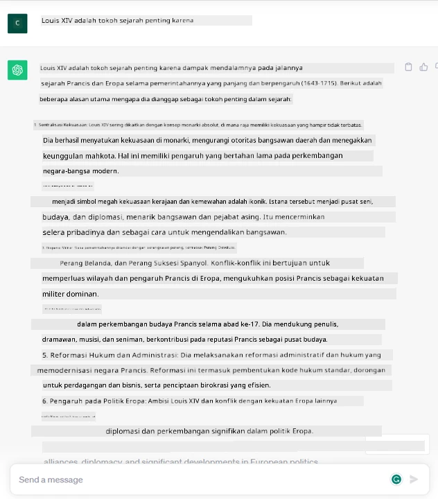
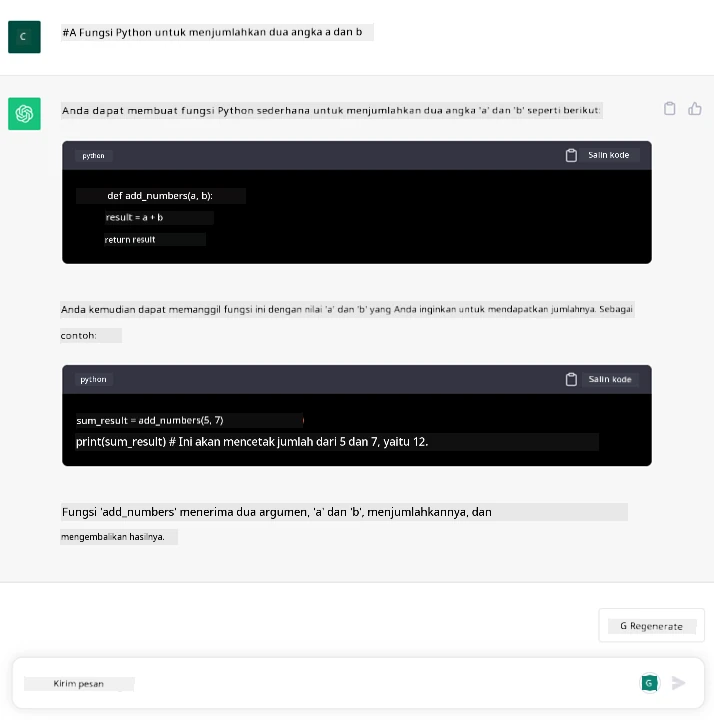

# Pengenalan AI Generatif dan Model Bahasa Besar

_(Klik gambar di atas untuk menonton video pelajaran ini)_

AI Generatif adalah kecerdasan buatan yang mampu menghasilkan teks, gambar, dan jenis konten lainnya. Yang membuatnya menjadi teknologi yang fantastis adalah bahwa teknologi ini mendemokratisasikan AI, siapa saja dapat menggunakannya dengan hanya sedikit perintah teks, sebuah kalimat yang ditulis dalam bahasa alami. Anda tidak perlu belajar bahasa seperti Java atau SQL untuk melakukan sesuatu yang berarti, yang Anda butuhkan hanyalah menggunakan bahasa Anda, menyatakan apa yang Anda inginkan dan keluarannya adalah saran dari model AI. Aplikasi dan dampaknya sangat besar, Anda dapat menulis atau memahami laporan, menulis aplikasi dan banyak lagi, semua dalam hitungan detik.

Dalam kurikulum ini, kita akan mengeksplorasi bagaimana startup kami memanfaatkan AI generatif untuk membuka skenario baru di dunia pendidikan dan bagaimana kami mengatasi tantangan yang tak terhindarkan terkait implikasi sosial dari penerapannya serta keterbatasan teknologinya.

## Pengenalan

Pelajaran ini akan membahas:

- Pengenalan skenario bisnis: ide dan misi startup kami.
- AI generatif dan bagaimana kami sampai pada lanskap teknologi saat ini.
- Cara kerja internal sebuah model bahasa besar.
- Kemampuan utama dan kasus penggunaan praktis dari Model Bahasa Besar.

## Tujuan Pembelajaran

Setelah menyelesaikan pelajaran ini, Anda akan memahami:

- Apa itu AI generatif dan bagaimana Model Bahasa Besar bekerja.
- Bagaimana Anda dapat memanfaatkan model bahasa besar untuk berbagai kasus penggunaan, dengan fokus pada skenario pendidikan.

## Skenario: startup pendidikan kami

Kecerdasan Buatan (AI) Generatif mewakili puncak teknologi AI, mendorong batas apa yang sebelumnya dianggap mustahil. Model AI generatif memiliki beberapa kemampuan dan aplikasi, tetapi untuk kurikulum ini kita akan menjelajahi bagaimana teknologi ini merevolusi pendidikan melalui sebuah startup fiksi. Kami akan menyebutnya sebagai _startup kami_. Startup kami bergerak dalam domain pendidikan dengan pernyataan misi ambisius

> _meningkatkan aksesibilitas dalam pembelajaran, dalam skala global, memastikan akses pendidikan yang adil dan memberikan pengalaman belajar yang dipersonalisasi kepada setiap pelajar, sesuai dengan kebutuhan mereka_.

Tim startup kami sadar bahwa kami tidak akan dapat mencapai tujuan ini tanpa memanfaatkan salah satu alat paling kuat di zaman modern – Model Bahasa Besar (LLM).

AI Generatif diharapkan merevolusi cara kita belajar dan mengajar saat ini, dengan siswa mendapatkan guru virtual 24 jam sehari yang menyediakan informasi dan contoh dalam jumlah besar, dan guru dapat memanfaatkan alat inovatif untuk menilai siswa mereka dan memberikan umpan balik.

Untuk memulai, mari kita definisikan beberapa konsep dasar dan terminologi yang akan kita gunakan sepanjang kurikulum.

## Bagaimana kita mendapatkan AI Generatif?

Terlepas dari _hype_ luar biasa yang baru-baru ini dibuat oleh pengumuman model AI generatif, teknologi ini telah bertahun-tahun dibangun, dengan upaya penelitian pertama yang dimulai pada tahun 60-an. Kini kita berada pada titik di mana AI memiliki kemampuan kognitif manusia, seperti percakapan seperti yang ditunjukkan oleh misalnya [OpenAI ChatGPT](https://openai.com/chatgpt) atau [Microsoft Copilot](https://copilot.microsoft.com/?WT.mc_id=academic-105485-koreyst), yang juga menggunakan model GPT untuk pengalaman pencarian web percakapan.

Sebelumnya, prototipe pertama AI terdiri dari chatbot yang diketik, bergantung pada basis pengetahuan yang diambil dari sekelompok ahli dan direpresentasikan ke dalam komputer. Jawaban dalam basis pengetahuan dipicu oleh kata kunci yang muncul dalam teks input.
Namun, segera menjadi jelas bahwa pendekatan seperti itu, menggunakan chatbot yang diketik, tidak skalabel.

### Pendekatan statistik untuk AI: Pembelajaran Mesin

Titik balik terjadi pada tahun 90-an, dengan penerapan pendekatan statistik terhadap analisis teks. Ini mengarah pada pengembangan algoritma baru – dikenal sebagai pembelajaran mesin – yang mampu mempelajari pola dari data tanpa diprogram secara eksplisit. Pendekatan ini memungkinkan mesin mensimulasikan pemahaman bahasa manusia: sebuah model statistik dilatih pada pasangan teks-label, memungkinkan model mengklasifikasikan teks input yang tidak diketahui dengan label yang sudah ditentukan mewakili maksud pesan.

### Jaringan saraf dan asisten virtual modern

Dalam beberapa tahun terakhir, evolusi teknologi perangkat keras yang mampu menangani jumlah data yang lebih besar dan komputasi yang lebih kompleks, mendorong penelitian di bidang AI, yang mengarah pada pengembangan algoritma pembelajaran mesin canggih yang dikenal sebagai jaringan saraf atau algoritma pembelajaran mendalam.

Jaringan saraf (dan khususnya Jaringan Saraf Rekursif – RNN) secara signifikan meningkatkan pemrosesan bahasa alami, memungkinkan representasi makna teks dengan cara yang lebih bermakna, menghargai konteks sebuah kata dalam kalimat.

Ini adalah teknologi yang menggerakkan asisten virtual yang lahir pada dekade pertama abad baru ini, sangat mahir dalam menginterpretasikan bahasa manusia, mengidentifikasi kebutuhan, dan melakukan tindakan untuk memenuhinya – seperti menjawab dengan skrip yang sudah ditentukan atau menggunakan layanan pihak ketiga.

### Saat ini, AI Generatif

Begitulah cara kita sampai pada AI Generatif hari ini, yang bisa dilihat sebagai subset dari pembelajaran mendalam.

Setelah beberapa dekade penelitian di bidang AI, arsitektur model baru – yang disebut _Transformer_ – mengatasi keterbatasan RNN, mampu mengambil urutan teks yang jauh lebih panjang sebagai input. Transformer didasarkan pada mekanisme perhatian, memungkinkan model memberikan bobot berbeda pada input yang diterima, 'memberi perhatian lebih' di mana informasi paling relevan terkonsentrasi, terlepas dari urutannya dalam urutan teks.

Sebagian besar model AI generatif terbaru – juga dikenal sebagai Model Bahasa Besar (LLM), karena mereka bekerja dengan input dan output tekstual – memang didasarkan pada arsitektur ini. Yang menarik tentang model-model ini – dilatih pada sejumlah besar data tanpa label dari berbagai sumber seperti buku, artikel, dan situs web – adalah bahwa mereka dapat diadaptasi untuk berbagai tugas dan menghasilkan teks yang secara tata bahasa benar dengan kesan kreativitas. Jadi, tidak hanya mereka sangat meningkatkan kapasitas mesin untuk ‘memahami’ teks input, tetapi juga memungkinkan kapasitas mereka untuk menghasilkan respons asli dalam bahasa manusia.

## Bagaimana cara kerja model bahasa besar?

Pada bab berikutnya kita akan mengeksplorasi berbagai jenis model AI generatif, tetapi untuk saat ini mari kita lihat bagaimana model bahasa besar bekerja, dengan fokus pada model OpenAI GPT (Generative Pre-trained Transformer).

- **Tokenizer, teks ke angka**: Model Bahasa Besar menerima teks sebagai input dan menghasilkan teks sebagai output. Namun, karena merupakan model statistik, mereka bekerja jauh lebih baik dengan angka daripada urutan teks. Itulah sebabnya setiap input ke model diproses oleh tokenizer, sebelum digunakan oleh model inti. Token adalah potongan teks – terdiri dari jumlah karakter yang bervariasi, jadi tugas utama tokenizer adalah memecah input menjadi array token. Kemudian, setiap token dipetakan dengan indeks token, yang merupakan pengkodean integer dari potongan teks asli.

- **Memprediksi token output**: Diberikan n token sebagai input (dengan nilai maksimum n berbeda dari satu model ke model lain), model mampu memprediksi satu token sebagai output. Token ini kemudian dimasukkan ke dalam input iterasi berikutnya, dengan pola jendela yang berkembang, memungkinkan pengalaman pengguna yang lebih baik untuk mendapatkan satu (atau beberapa) kalimat sebagai jawaban. Ini menjelaskan mengapa, jika Anda pernah mencoba ChatGPT, Anda mungkin pernah menyadari bahwa kadang-kadang tampak berhenti di tengah kalimat.

- **Proses seleksi, distribusi probabilitas**: Token output dipilih oleh model sesuai probabilitas kemunculannya setelah urutan teks saat ini. Ini karena model memprediksi distribusi probabilitas atas semua 'token berikutnya' yang mungkin, dihitung berdasarkan pelatihannya. Namun, tidak selalu token dengan probabilitas tertinggi dipilih dari distribusi hasil. Sebuah tingkat randomisasi ditambahkan ke pilihan ini, dengan cara model bertindak secara non-deterministik - kita tidak mendapatkan output yang sama persis untuk input yang sama. Tingkat randomisasi ini ditambahkan untuk mensimulasikan proses berpikir kreatif dan dapat diatur menggunakan parameter model yang disebut temperature.

## Bagaimana startup kami dapat memanfaatkan Model Bahasa Besar?

Sekarang kita memiliki pemahaman yang lebih baik tentang cara kerja internal model bahasa besar, mari kita lihat beberapa contoh praktis dari tugas paling umum yang bisa mereka lakukan dengan baik, dengan perhatian pada skenario bisnis kita.
Kami mengatakan bahwa kemampuan utama Model Bahasa Besar adalah _menghasilkan teks dari nol, mulai dari input tekstual, yang ditulis dalam bahasa alami_.

Tapi jenis input dan output teks apa itu?
Input dari model bahasa besar dikenal sebagai prompt, sedangkan output dikenal sebagai completion, istilah yang merujuk pada mekanisme model dalam menghasilkan token berikutnya untuk melengkapi input saat ini. Kita akan menyelami apa itu prompt dan bagaimana merancangnya agar mendapatkan hasil maksimal dari model kita. Tapi untuk saat ini, kita hanya katakan bahwa prompt dapat mencakup:

- Sebuah **instruksi** yang menentukan jenis output yang kita harapkan dari model. Instruksi ini kadang kala mungkin menyertakan beberapa contoh atau data tambahan.

  1. Ringkasan artikel, buku, ulasan produk, dan lainnya, beserta ekstraksi wawasan dari data tidak terstruktur.
    
    
  
  2. Ide kreatif dan desain artikel, esai, tugas, atau lainnya.
      
     

- Sebuah **pertanyaan**, diajukan dalam bentuk percakapan dengan agen.
  
  

- Sebuah potongan **teks yang harus dilengkapi**, yang secara implisit merupakan permintaan bantuan menulis.
  
  

- Sebuah potongan **kode** bersama permintaan untuk menjelaskannya dan mendokumentasikannya, atau komentar yang meminta untuk menghasilkan sepotong kode yang melakukan tugas tertentu.
  
  

Contoh-contoh di atas cukup sederhana dan tidak dimaksudkan sebagai demonstrasi menyeluruh dari kemampuan Model Bahasa Besar. Mereka dimaksudkan untuk menunjukkan potensi penggunaan AI generatif, khususnya namun tidak terbatas pada konteks pendidikan.

Juga, output dari model AI generatif tidak sempurna dan terkadang kreativitas model dapat bekerja melawannya, menghasilkan output yang merupakan kombinasi kata-kata yang dapat diinterpretasikan oleh pengguna manusia sebagai mistifikasi realitas, atau bisa juga menyinggung. AI generatif bukanlah cerdas - setidaknya tidak dalam definisi kecerdasan yang lebih komprehensif, termasuk alasan kritis dan kreatif atau kecerdasan emosional; ia tidak deterministik, dan tidak bisa dipercaya, karena rekayasa seperti referensi, konten, dan pernyataan yang salah dapat dikombinasikan dengan informasi yang benar, dan disajikan dengan cara yang meyakinkan dan percaya diri. Dalam pelajaran berikutnya, kita akan menangani semua keterbatasan ini dan melihat apa yang bisa kita lakukan untuk menguranginya.

## Tugas

Tugas Anda adalah membaca lebih lanjut tentang [AI generatif](https://en.wikipedia.org/wiki/Generative_artificial_intelligence?WT.mc_id=academic-105485-koreyst) dan mencoba mengidentifikasi area di mana Anda akan menambahkan AI generatif hari ini yang belum memilikinya. Bagaimana dampaknya berbeda dari melakukan dengan "cara lama", apakah Anda bisa melakukan sesuatu yang sebelumnya tidak bisa, atau apakah Anda lebih cepat? Tulislah ringkasan 300 kata tentang bagaimana startup AI impian Anda dan sertakan header seperti "Masalah", "Bagaimana Saya Akan Menggunakan AI", "Dampak" dan opsional rencana bisnis.

Jika Anda melakukan tugas ini, Anda bahkan mungkin siap untuk mendaftar ke inkubator Microsoft, [Microsoft for Startups Founders Hub](https://www.microsoft.com/startups?WT.mc_id=academic-105485-koreyst) kami menawarkan kredit untuk Azure, OpenAI, mentoring dan banyak lagi, cek sekarang!

## Cek Pengetahuan

Apa yang benar tentang model bahasa besar?

1. Anda mendapatkan respons yang sama persis setiap kali.
1. Model melakukan segalanya dengan sempurna, hebat dalam menjumlahkan angka, menghasilkan kode yang bekerja, dll.
1. Respons dapat bervariasi meskipun menggunakan prompt yang sama. Model ini juga hebat untuk memberikan draf pertama sesuatu, baik itu teks atau kode. Tetapi Anda perlu memperbaiki hasilnya.

A: 3, LLM adalah non-deterministik, responsnya bervariasi, namun Anda dapat mengontrol variasinya melalui pengaturan temperature. Anda juga tidak boleh mengharapkan model ini melakukan semuanya dengan sempurna, model ini ada untuk melakukan pekerjaan berat untuk Anda yang sering berarti Anda mendapatkan upaya pertama yang baik dari sesuatu yang perlu Anda tingkatkan secara bertahap.

## Kerja Hebat! Lanjutkan Perjalanan

Setelah menyelesaikan pelajaran ini, periksa koleksi kami tentang [Pembelajaran AI Generatif](https://aka.ms/genai-collection?WT.mc_id=academic-105485-koreyst) untuk terus meningkatkan pengetahuan Anda tentang AI Generatif!

Lanjut ke Pelajaran 2 di mana kita akan melihat cara [menjelajahi dan membandingkan berbagai jenis LLM](../02-exploring-and-comparing-different-llms/README.md?WT.mc_id=academic-105485-koreyst)!

---

<!-- CO-OP TRANSLATOR DISCLAIMER START -->
**Penafian**:
Dokumen ini telah diterjemahkan menggunakan layanan terjemahan AI [Co-op Translator](https://github.com/Azure/co-op-translator). Meskipun kami berupaya untuk mencapai akurasi, harap diketahui bahwa terjemahan otomatis mungkin mengandung kesalahan atau ketidakakuratan. Dokumen asli dalam bahasa aslinya harus dianggap sebagai sumber yang sah. Untuk informasi penting, disarankan menggunakan terjemahan profesional oleh manusia. Kami tidak bertanggung jawab atas kesalahpahaman atau penafsiran yang keliru yang timbul dari penggunaan terjemahan ini.
<!-- CO-OP TRANSLATOR DISCLAIMER END -->