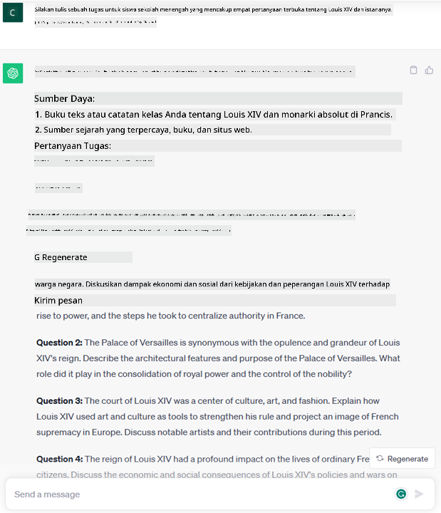

<!--
CO_OP_TRANSLATOR_METADATA:
{
  "original_hash": "f53ba0fa49164f9323043f1c6b11f2b1",
  "translation_date": "2025-07-09T07:58:04+00:00",
  "source_file": "01-introduction-to-genai/README.md",
  "language_code": "id"
}
-->
# Pengenalan tentang Generative AI dan Large Language Models

_(Klik gambar di atas untuk menonton video pelajaran ini)_

Generative AI adalah kecerdasan buatan yang mampu menghasilkan teks, gambar, dan jenis konten lainnya. Yang membuatnya menjadi teknologi luar biasa adalah kemampuannya untuk mendemokratisasi AI, siapa saja bisa menggunakannya hanya dengan sebuah prompt teks, sebuah kalimat yang ditulis dalam bahasa alami. Tidak perlu belajar bahasa pemrograman seperti Java atau SQL untuk mencapai sesuatu yang berarti, yang Anda butuhkan hanyalah menggunakan bahasa Anda, menyatakan apa yang Anda inginkan, dan keluarannya adalah saran dari model AI. Aplikasi dan dampaknya sangat besar, Anda bisa menulis atau memahami laporan, membuat aplikasi, dan banyak lagi, semua dalam hitungan detik.

Dalam kurikulum ini, kita akan mengeksplorasi bagaimana startup kami memanfaatkan generative AI untuk membuka skenario baru di dunia pendidikan dan bagaimana kami mengatasi tantangan yang tak terhindarkan terkait implikasi sosial dari penerapannya serta keterbatasan teknologinya.

## Pengenalan

Pelajaran ini akan membahas:

- Pengenalan skenario bisnis: ide dan misi startup kami.
- Generative AI dan bagaimana kami sampai pada lanskap teknologi saat ini.
- Cara kerja internal dari large language model.
- Kemampuan utama dan kasus penggunaan praktis dari Large Language Models.

## Tujuan Pembelajaran

Setelah menyelesaikan pelajaran ini, Anda akan memahami:

- Apa itu generative AI dan bagaimana Large Language Models bekerja.
- Bagaimana Anda dapat memanfaatkan large language models untuk berbagai kasus penggunaan, dengan fokus pada skenario pendidikan.

## Skenario: startup pendidikan kami

Generative Artificial Intelligence (AI) mewakili puncak teknologi AI, mendorong batasan apa yang dulu dianggap mustahil. Model generative AI memiliki berbagai kemampuan dan aplikasi, namun dalam kurikulum ini kita akan mengeksplorasi bagaimana teknologi ini merevolusi pendidikan melalui sebuah startup fiksi. Kita akan menyebut startup ini sebagai _our startup_. Startup kami bergerak di bidang pendidikan dengan pernyataan misi ambisius:

> _meningkatkan aksesibilitas dalam pembelajaran, secara global, memastikan akses pendidikan yang adil dan menyediakan pengalaman belajar yang dipersonalisasi untuk setiap pelajar, sesuai dengan kebutuhan mereka_.

Tim startup kami sadar bahwa kami tidak akan bisa mencapai tujuan ini tanpa memanfaatkan salah satu alat paling kuat di zaman modern – Large Language Models (LLMs).

Generative AI diperkirakan akan merevolusi cara kita belajar dan mengajar saat ini, dengan siswa memiliki guru virtual 24 jam sehari yang menyediakan informasi dan contoh dalam jumlah besar, dan guru dapat memanfaatkan alat inovatif untuk menilai siswa mereka dan memberikan umpan balik.

Untuk memulai, mari kita definisikan beberapa konsep dan terminologi dasar yang akan kita gunakan sepanjang kurikulum.

## Bagaimana kita mendapatkan Generative AI?

Meskipun ada _hype_ luar biasa yang muncul baru-baru ini setelah pengumuman model generative AI, teknologi ini telah dikembangkan selama beberapa dekade, dengan upaya riset pertama yang dimulai sejak tahun 60-an. Saat ini kita berada pada titik di mana AI memiliki kemampuan kognitif manusia, seperti percakapan yang ditunjukkan oleh misalnya [OpenAI ChatGPT](https://openai.com/chatgpt) atau [Bing Chat](https://www.microsoft.com/edge/features/bing-chat?WT.mc_id=academic-105485-koreyst), yang juga menggunakan model GPT untuk percakapan pencarian web Bing.

Jika mundur sedikit, prototipe AI pertama berupa chatbot yang diketik, mengandalkan basis pengetahuan yang diambil dari sekelompok ahli dan direpresentasikan ke dalam komputer. Jawaban dalam basis pengetahuan dipicu oleh kata kunci yang muncul dalam teks input. Namun, segera menjadi jelas bahwa pendekatan seperti ini, menggunakan chatbot yang diketik, tidak dapat berkembang dengan baik.

### Pendekatan statistik pada AI: Machine Learning

Titik balik terjadi pada tahun 90-an, dengan penerapan pendekatan statistik pada analisis teks. Ini menghasilkan pengembangan algoritma baru – yang dikenal sebagai machine learning – yang mampu mempelajari pola dari data tanpa diprogram secara eksplisit. Pendekatan ini memungkinkan mesin untuk mensimulasikan pemahaman bahasa manusia: sebuah model statistik dilatih pada pasangan teks-label, memungkinkan model mengklasifikasikan teks input yang tidak dikenal dengan label yang sudah ditentukan yang mewakili maksud pesan.

### Neural networks dan asisten virtual modern

Dalam beberapa tahun terakhir, evolusi teknologi hardware yang mampu menangani data dalam jumlah besar dan komputasi yang lebih kompleks mendorong riset AI, menghasilkan pengembangan algoritma machine learning canggih yang dikenal sebagai neural networks atau deep learning.

Neural networks (khususnya Recurrent Neural Networks – RNNs) secara signifikan meningkatkan pemrosesan bahasa alami, memungkinkan representasi makna teks dengan cara yang lebih bermakna, menghargai konteks kata dalam sebuah kalimat.

Inilah teknologi yang mendukung asisten virtual yang lahir pada dekade pertama abad baru ini, sangat mahir dalam menginterpretasikan bahasa manusia, mengidentifikasi kebutuhan, dan melakukan tindakan untuk memenuhinya – seperti menjawab dengan skrip yang sudah ditentukan atau menggunakan layanan pihak ketiga.

### Saat ini, Generative AI

Begitulah kita sampai pada Generative AI saat ini, yang bisa dianggap sebagai subset dari deep learning.

Setelah puluhan tahun riset di bidang AI, sebuah arsitektur model baru – yang disebut _Transformer_ – mengatasi keterbatasan RNN, mampu menerima urutan teks yang jauh lebih panjang sebagai input. Transformer didasarkan pada mekanisme attention, yang memungkinkan model memberikan bobot berbeda pada input yang diterimanya, ‘memberi perhatian lebih’ pada bagian yang mengandung informasi paling relevan, tanpa memedulikan urutan dalam rangkaian teks.

Sebagian besar model generative AI terbaru – yang juga dikenal sebagai Large Language Models (LLMs), karena mereka bekerja dengan input dan output teks – memang berbasis arsitektur ini. Yang menarik dari model-model ini – yang dilatih dengan jumlah data tak berlabel yang sangat besar dari berbagai sumber seperti buku, artikel, dan situs web – adalah mereka dapat disesuaikan untuk berbagai tugas dan menghasilkan teks yang secara tata bahasa benar dengan kesan kreativitas. Jadi, mereka tidak hanya secara luar biasa meningkatkan kemampuan mesin untuk ‘memahami’ teks input, tetapi juga memungkinkan kemampuan mereka untuk menghasilkan respons asli dalam bahasa manusia.

## Bagaimana cara kerja large language models?

Di bab berikutnya kita akan mengeksplorasi berbagai jenis model Generative AI, tapi untuk sekarang mari kita lihat bagaimana large language models bekerja, dengan fokus pada model OpenAI GPT (Generative Pre-trained Transformer).

- **Tokenizer, mengubah teks menjadi angka**: Large Language Models menerima teks sebagai input dan menghasilkan teks sebagai output. Namun, karena mereka adalah model statistik, mereka bekerja jauh lebih baik dengan angka daripada urutan teks. Itulah sebabnya setiap input ke model diproses oleh tokenizer sebelum digunakan oleh model inti. Token adalah potongan teks – yang terdiri dari sejumlah karakter yang bervariasi, jadi tugas utama tokenizer adalah memecah input menjadi array token. Kemudian, setiap token dipetakan dengan indeks token, yaitu pengkodean bilangan bulat dari potongan teks asli.

- **Memprediksi token output**: Diberikan n token sebagai input (dengan maksimum n yang berbeda-beda tergantung model), model mampu memprediksi satu token sebagai output. Token ini kemudian dimasukkan ke dalam input iterasi berikutnya, dalam pola jendela yang berkembang, memungkinkan pengalaman pengguna yang lebih baik dengan mendapatkan satu (atau beberapa) kalimat sebagai jawaban. Ini menjelaskan mengapa, jika Anda pernah mencoba ChatGPT, terkadang terlihat seperti berhenti di tengah kalimat.

- **Proses pemilihan, distribusi probabilitas**: Token output dipilih oleh model berdasarkan probabilitas kemunculannya setelah urutan teks saat ini. Ini karena model memprediksi distribusi probabilitas atas semua kemungkinan ‘token berikutnya’, yang dihitung berdasarkan pelatihannya. Namun, tidak selalu token dengan probabilitas tertinggi yang dipilih dari distribusi tersebut. Sebuah tingkat acak ditambahkan pada pilihan ini, sehingga model bertindak secara non-deterministik – kita tidak mendapatkan output yang sama persis untuk input yang sama. Tingkat acak ini ditambahkan untuk mensimulasikan proses berpikir kreatif dan dapat diatur menggunakan parameter model yang disebut temperature.

## Bagaimana startup kami dapat memanfaatkan Large Language Models?

Sekarang kita sudah memahami cara kerja internal large language model, mari kita lihat beberapa contoh praktis dari tugas paling umum yang dapat mereka lakukan dengan baik, dengan fokus pada skenario bisnis kami.  
Kami mengatakan bahwa kemampuan utama Large Language Model adalah _menghasilkan teks dari nol, dimulai dari input teks yang ditulis dalam bahasa alami_.

Tapi seperti apa input dan output teksnya?  
Input dari large language model dikenal sebagai prompt, sedangkan outputnya dikenal sebagai completion, istilah yang merujuk pada mekanisme model dalam menghasilkan token berikutnya untuk melengkapi input saat ini. Kita akan membahas lebih dalam apa itu prompt dan bagaimana merancangnya agar mendapatkan hasil terbaik dari model. Tapi untuk sekarang, mari kita katakan bahwa prompt dapat mencakup:

- Sebuah **instruksi** yang menentukan jenis output yang kita harapkan dari model. Instruksi ini terkadang bisa menyertakan beberapa contoh atau data tambahan.

  1. Merangkum artikel, buku, ulasan produk, dan lainnya, serta mengekstrak wawasan dari data tidak terstruktur.
    
    
  
  2. Ide kreatif dan desain artikel, esai, tugas, dan lainnya.
      
     

- Sebuah **pertanyaan**, yang diajukan dalam bentuk percakapan dengan agen.
  
  

- Sebuah potongan **teks untuk dilengkapi**, yang secara implisit merupakan permintaan bantuan menulis.
  
  

- Sebuah potongan **kode** beserta permintaan untuk menjelaskan dan mendokumentasikannya, atau komentar yang meminta untuk menghasilkan potongan kode yang melakukan tugas tertentu.
  
  

Contoh-contoh di atas cukup sederhana dan tidak dimaksudkan sebagai demonstrasi lengkap dari kemampuan Large Language Models. Mereka dimaksudkan untuk menunjukkan potensi penggunaan generative AI, khususnya tapi tidak terbatas pada konteks pendidikan.

Selain itu, output dari model generative AI tidak sempurna dan terkadang kreativitas model bisa menjadi kontra-produktif, menghasilkan keluaran yang merupakan kombinasi kata-kata yang bisa diinterpretasikan oleh pengguna manusia sebagai distorsi realitas, atau bahkan bisa menyinggung. Generative AI bukanlah cerdas – setidaknya dalam definisi kecerdasan yang lebih luas, termasuk penalaran kritis dan kreatif atau kecerdasan emosional; ia tidak deterministik, dan tidak dapat sepenuhnya dipercaya, karena fabrikasi seperti referensi yang salah, konten, dan pernyataan bisa bercampur dengan informasi yang benar, dan disajikan dengan cara yang meyakinkan dan penuh percaya diri. Dalam pelajaran berikutnya, kita akan membahas semua keterbatasan ini dan melihat apa yang bisa kita lakukan untuk menguranginya.

## Tugas

Tugas Anda adalah membaca lebih lanjut tentang [generative AI](https://en.wikipedia.org/wiki/Generative_artificial_intelligence?WT.mc_id=academic-105485-koreyst) dan mencoba mengidentifikasi area di mana Anda akan menambahkan generative AI hari ini yang belum memilikinya. Bagaimana dampaknya berbeda dibandingkan dengan cara "lama", apakah Anda bisa melakukan sesuatu yang sebelumnya tidak bisa, atau apakah Anda lebih cepat? Tulislah ringkasan 300 kata tentang seperti apa startup AI impian Anda dan sertakan judul seperti "Masalah", "Bagaimana Saya Menggunakan AI", "Dampak" dan opsional rencana bisnis.

Jika Anda menyelesaikan tugas ini, Anda bahkan mungkin siap untuk mendaftar ke inkubator Microsoft, [Microsoft for Startups Founders Hub](https://www.microsoft.com/startups?WT.mc_id=academic-105485-koreyst) yang menawarkan kredit untuk Azure, OpenAI, mentoring, dan banyak lagi, cek sekarang!

## Pemeriksaan Pengetahuan

Apa yang benar tentang large language models?

1. Anda mendapatkan respons yang sama persis setiap kali.  
2. Model ini melakukan segalanya dengan sempurna, hebat dalam menjumlahkan angka, menghasilkan kode yang berfungsi, dll.  
3. Respons bisa berbeda meskipun menggunakan prompt yang sama. Model ini juga hebat dalam memberikan draf pertama sesuatu, baik teks maupun kode. Namun Anda perlu memperbaiki hasilnya.

Jawaban: 3, LLM bersifat non-deterministik, responsnya bervariasi, namun Anda dapat mengontrol variansinya melalui pengaturan temperature. Anda juga tidak boleh mengharapkan model ini melakukan segalanya dengan sempurna, model ini hadir untuk melakukan pekerjaan berat bagi Anda yang sering berarti Anda mendapatkan upaya pertama yang baik yang perlu Anda tingkatkan secara bertahap.

## Kerja Bagus! Lanjutkan Perjalanan

Setelah menyelesaikan pelajaran ini, lihat koleksi [Generative AI Learning](https://aka.ms/genai-collection?WT.mc_id=academic-105485-koreyst) kami untuk terus meningkatkan pengetahuan Anda tentang Generative AI!
Lanjut ke Pelajaran 2 di mana kita akan mempelajari cara [menjelajahi dan membandingkan berbagai jenis LLM](../02-exploring-and-comparing-different-llms/README.md?WT.mc_id=academic-105485-koreyst)!

**Penafian**:  
Dokumen ini telah diterjemahkan menggunakan layanan terjemahan AI [Co-op Translator](https://github.com/Azure/co-op-translator). Meskipun kami berupaya untuk mencapai akurasi, harap diingat bahwa terjemahan otomatis mungkin mengandung kesalahan atau ketidakakuratan. Dokumen asli dalam bahasa aslinya harus dianggap sebagai sumber yang sahih. Untuk informasi penting, disarankan menggunakan terjemahan profesional oleh manusia. Kami tidak bertanggung jawab atas kesalahpahaman atau penafsiran yang keliru yang timbul dari penggunaan terjemahan ini.