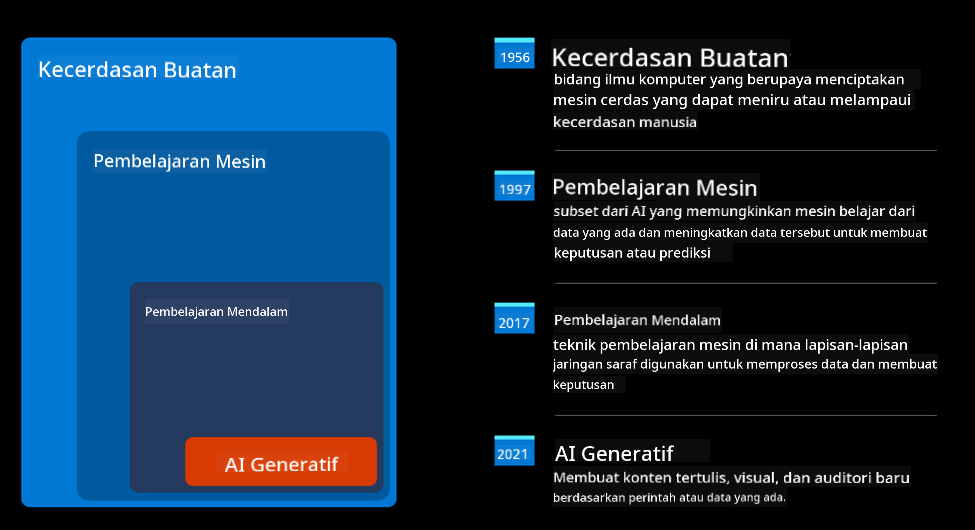
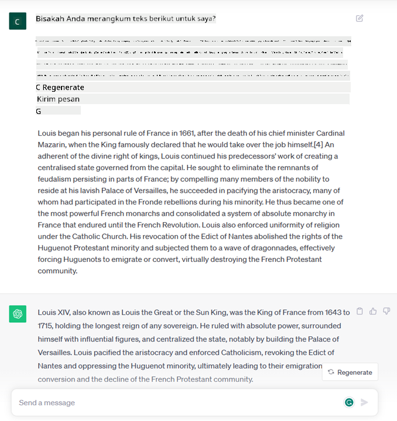
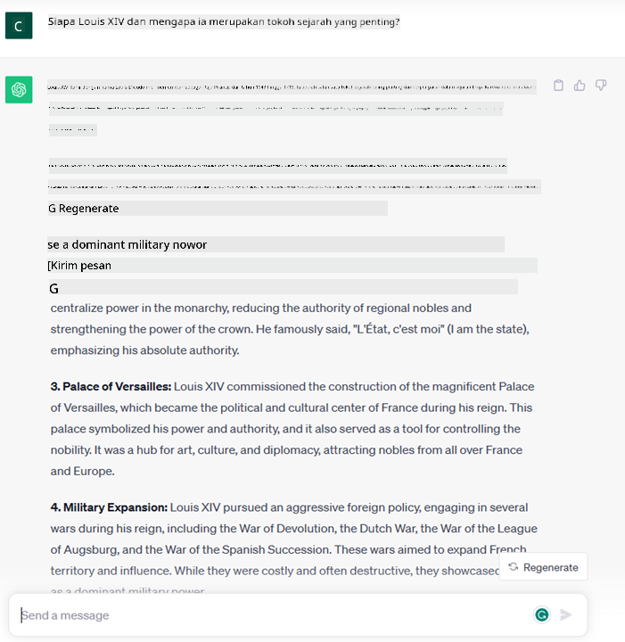
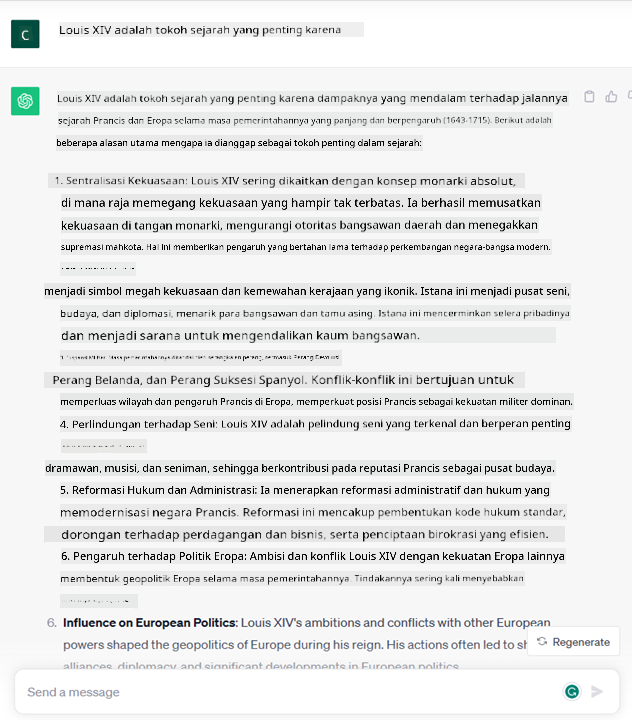

<!--
CO_OP_TRANSLATOR_METADATA:
{
  "original_hash": "bfb7901bdbece1ba3e9f35c400ca33e8",
  "translation_date": "2025-10-17T20:47:58+00:00",
  "source_file": "01-introduction-to-genai/README.md",
  "language_code": "id"
}
-->
# Pengantar AI Generatif dan Model Bahasa Besar

_(Klik gambar di atas untuk menonton video pelajaran ini)_

AI Generatif adalah kecerdasan buatan yang mampu menghasilkan teks, gambar, dan jenis konten lainnya. Teknologi ini luar biasa karena mendemokratisasi AI, siapa pun dapat menggunakannya hanya dengan sebuah perintah teks, sebuah kalimat yang ditulis dalam bahasa alami. Anda tidak perlu mempelajari bahasa seperti Java atau SQL untuk mencapai sesuatu yang berharga, cukup gunakan bahasa Anda, nyatakan apa yang Anda inginkan, dan AI akan memberikan saran. Aplikasi dan dampaknya sangat besar, Anda dapat menulis atau memahami laporan, membuat aplikasi, dan banyak lagi, semuanya dalam hitungan detik.

Dalam kurikulum ini, kita akan mengeksplorasi bagaimana startup kita memanfaatkan AI generatif untuk membuka skenario baru di dunia pendidikan dan bagaimana kita menghadapi tantangan yang tak terhindarkan terkait implikasi sosial dari penerapannya serta keterbatasan teknologi.

## Pengantar

Pelajaran ini akan mencakup:

- Pengantar skenario bisnis: ide dan misi startup kita.
- AI generatif dan bagaimana kita sampai pada lanskap teknologi saat ini.
- Cara kerja internal model bahasa besar.
- Kemampuan utama dan kasus penggunaan praktis Model Bahasa Besar.

## Tujuan Pembelajaran

Setelah menyelesaikan pelajaran ini, Anda akan memahami:

- Apa itu AI generatif dan bagaimana Model Bahasa Besar bekerja.
- Bagaimana Anda dapat memanfaatkan model bahasa besar untuk berbagai kasus penggunaan, dengan fokus pada skenario pendidikan.

## Skenario: startup pendidikan kita

Kecerdasan Buatan Generatif (AI) mewakili puncak teknologi AI, mendorong batasan yang sebelumnya dianggap mustahil. Model AI generatif memiliki berbagai kemampuan dan aplikasi, tetapi untuk kurikulum ini kita akan mengeksplorasi bagaimana teknologi ini merevolusi pendidikan melalui sebuah startup fiktif. Kita akan menyebut startup ini sebagai _startup kita_. Startup kita bekerja di bidang pendidikan dengan pernyataan misi ambisius:

> _meningkatkan aksesibilitas dalam pembelajaran, secara global, memastikan akses pendidikan yang adil dan memberikan pengalaman pembelajaran yang dipersonalisasi kepada setiap pelajar, sesuai dengan kebutuhan mereka_.

Tim startup kita menyadari bahwa kita tidak akan dapat mencapai tujuan ini tanpa memanfaatkan salah satu alat paling kuat di zaman modern – Model Bahasa Besar (LLM).

AI generatif diperkirakan akan merevolusi cara kita belajar dan mengajar saat ini, dengan siswa memiliki guru virtual yang tersedia 24 jam sehari yang menyediakan sejumlah besar informasi dan contoh, serta guru yang dapat memanfaatkan alat inovatif untuk menilai siswa mereka dan memberikan umpan balik.

Untuk memulai, mari kita definisikan beberapa konsep dasar dan terminologi yang akan kita gunakan sepanjang kurikulum.

## Bagaimana kita mendapatkan AI Generatif?

Meskipun _hype_ luar biasa yang baru-baru ini diciptakan oleh pengumuman model AI generatif, teknologi ini telah dikembangkan selama beberapa dekade, dengan upaya penelitian pertama dimulai pada tahun 60-an. Kita sekarang berada di titik di mana AI memiliki kemampuan kognitif manusia, seperti percakapan yang ditunjukkan oleh, misalnya, [OpenAI ChatGPT](https://openai.com/chatgpt) atau [Bing Chat](https://www.microsoft.com/edge/features/bing-chat?WT.mc_id=academic-105485-koreyst), yang juga menggunakan model GPT untuk percakapan pencarian web Bing.

Melihat ke belakang, prototipe AI pertama terdiri dari chatbot yang diketik, mengandalkan basis pengetahuan yang diekstraksi dari sekelompok ahli dan direpresentasikan ke dalam komputer. Jawaban dalam basis pengetahuan dipicu oleh kata kunci yang muncul dalam teks input. Namun, segera menjadi jelas bahwa pendekatan seperti itu, menggunakan chatbot yang diketik, tidak dapat berkembang dengan baik.

### Pendekatan statistik terhadap AI: Pembelajaran Mesin

Titik balik terjadi pada tahun 90-an, dengan penerapan pendekatan statistik terhadap analisis teks. Hal ini mengarah pada pengembangan algoritma baru – yang dikenal sebagai pembelajaran mesin – yang mampu mempelajari pola dari data tanpa diprogram secara eksplisit. Pendekatan ini memungkinkan mesin untuk mensimulasikan pemahaman bahasa manusia: model statistik dilatih pada pasangan teks-label, memungkinkan model untuk mengklasifikasikan teks input yang tidak dikenal dengan label yang telah ditentukan sebelumnya yang mewakili maksud pesan.

### Jaringan saraf dan asisten virtual modern

Dalam beberapa tahun terakhir, evolusi teknologi perangkat keras, yang mampu menangani jumlah data yang lebih besar dan perhitungan yang lebih kompleks, mendorong penelitian dalam AI, yang mengarah pada pengembangan algoritma pembelajaran mesin canggih yang dikenal sebagai jaringan saraf atau algoritma pembelajaran mendalam.

Jaringan saraf (dan khususnya Jaringan Saraf Rekurens – RNN) secara signifikan meningkatkan pemrosesan bahasa alami, memungkinkan representasi makna teks dengan cara yang lebih bermakna, menghargai konteks kata dalam sebuah kalimat.

Ini adalah teknologi yang mendukung asisten virtual yang lahir pada dekade pertama abad baru, sangat mahir dalam menafsirkan bahasa manusia, mengidentifikasi kebutuhan, dan melakukan tindakan untuk memenuhinya – seperti menjawab dengan skrip yang telah ditentukan atau menggunakan layanan pihak ketiga.

### Hari ini, AI Generatif

Begitulah cara kita sampai pada AI Generatif hari ini, yang dapat dilihat sebagai subset dari pembelajaran mendalam.

Setelah puluhan tahun penelitian di bidang AI, arsitektur model baru – yang disebut _Transformer_ – mengatasi batasan RNN, mampu menerima urutan teks yang jauh lebih panjang sebagai input. Transformer didasarkan pada mekanisme perhatian, memungkinkan model untuk memberikan bobot yang berbeda pada input yang diterimanya, ‘lebih memperhatikan’ di mana informasi yang paling relevan terkonsentrasi, terlepas dari urutannya dalam urutan teks.

Sebagian besar model AI generatif terbaru – juga dikenal sebagai Model Bahasa Besar (LLM), karena mereka bekerja dengan input dan output tekstual – memang didasarkan pada arsitektur ini. Yang menarik dari model-model ini – dilatih pada sejumlah besar data yang tidak berlabel dari berbagai sumber seperti buku, artikel, dan situs web – adalah bahwa mereka dapat disesuaikan dengan berbagai tugas dan menghasilkan teks yang secara tata bahasa benar dengan kesan kreativitas. Jadi, tidak hanya mereka secara luar biasa meningkatkan kapasitas mesin untuk ‘memahami’ teks input, tetapi mereka juga memungkinkan kapasitasnya untuk menghasilkan respons asli dalam bahasa manusia.

## Bagaimana model bahasa besar bekerja?

Dalam bab berikutnya kita akan mengeksplorasi berbagai jenis model AI Generatif, tetapi untuk saat ini mari kita lihat bagaimana model bahasa besar bekerja, dengan fokus pada model OpenAI GPT (Generative Pre-trained Transformer).

- **Tokenizer, teks ke angka**: Model Bahasa Besar menerima teks sebagai input dan menghasilkan teks sebagai output. Namun, sebagai model statistik, mereka bekerja jauh lebih baik dengan angka daripada urutan teks. Itulah mengapa setiap input ke model diproses oleh tokenizer, sebelum digunakan oleh model inti. Token adalah potongan teks – terdiri dari sejumlah karakter yang bervariasi, sehingga tugas utama tokenizer adalah membagi input menjadi array token. Kemudian, setiap token dipetakan dengan indeks token, yang merupakan pengkodean bilangan bulat dari potongan teks asli.

- **Memprediksi token output**: Diberikan n token sebagai input (dengan max n bervariasi dari satu model ke model lainnya), model mampu memprediksi satu token sebagai output. Token ini kemudian dimasukkan ke dalam input iterasi berikutnya, dalam pola jendela yang berkembang, memungkinkan pengalaman pengguna yang lebih baik untuk mendapatkan satu (atau beberapa) kalimat sebagai jawaban. Ini menjelaskan mengapa, jika Anda pernah bermain dengan ChatGPT, Anda mungkin memperhatikan bahwa terkadang terlihat seperti berhenti di tengah kalimat.

- **Proses seleksi, distribusi probabilitas**: Token output dipilih oleh model sesuai dengan probabilitasnya untuk muncul setelah urutan teks saat ini. Hal ini karena model memprediksi distribusi probabilitas atas semua ‘token berikutnya’ yang mungkin, yang dihitung berdasarkan pelatihannya. Namun, tidak selalu token dengan probabilitas tertinggi yang dipilih dari distribusi yang dihasilkan. Tingkat keacakan ditambahkan ke pilihan ini, sehingga model bertindak dengan cara yang tidak deterministik - kita tidak mendapatkan output yang persis sama untuk input yang sama. Tingkat keacakan ini ditambahkan untuk mensimulasikan proses berpikir kreatif dan dapat disesuaikan menggunakan parameter model yang disebut suhu.

## Bagaimana startup kita dapat memanfaatkan Model Bahasa Besar?

Sekarang kita memiliki pemahaman yang lebih baik tentang cara kerja internal model bahasa besar, mari kita lihat beberapa contoh praktis dari tugas-tugas paling umum yang dapat mereka lakukan dengan cukup baik, dengan fokus pada skenario bisnis kita. Kita mengatakan bahwa kemampuan utama Model Bahasa Besar adalah _menghasilkan teks dari awal, dimulai dari input tekstual, yang ditulis dalam bahasa alami_.

Tetapi jenis input dan output tekstual apa?
Input dari model bahasa besar dikenal sebagai prompt, sedangkan outputnya dikenal sebagai completion, istilah yang merujuk pada mekanisme model untuk menghasilkan token berikutnya untuk melengkapi input saat ini. Kita akan mendalami apa itu prompt dan bagaimana merancangnya agar mendapatkan hasil maksimal dari model kita. Tetapi untuk saat ini, mari kita katakan bahwa prompt dapat mencakup:

- **Instruksi** yang menentukan jenis output yang kita harapkan dari model. Instruksi ini terkadang dapat menyertakan beberapa contoh atau data tambahan.

  1. Ringkasan artikel, buku, ulasan produk, dan lainnya, bersama dengan ekstraksi wawasan dari data yang tidak terstruktur.
    
    
  
  2. Ide kreatif dan desain artikel, esai, tugas, atau lainnya.
      
     

- **Pertanyaan**, yang diajukan dalam bentuk percakapan dengan agen.
  
  

- Potongan **teks untuk dilengkapi**, yang secara implisit adalah permintaan untuk bantuan penulisan.
  
  

- Potongan **kode** bersama dengan permintaan untuk menjelaskan dan mendokumentasikannya, atau komentar yang meminta untuk menghasilkan potongan kode yang melakukan tugas tertentu.
  
  

Contoh-contoh di atas cukup sederhana dan tidak dimaksudkan sebagai demonstrasi lengkap kemampuan Model Bahasa Besar. Mereka dimaksudkan untuk menunjukkan potensi penggunaan AI generatif, khususnya tetapi tidak terbatas pada konteks pendidikan.

Selain itu, output dari model AI generatif tidak sempurna dan terkadang kreativitas model dapat menjadi bumerang, menghasilkan output yang merupakan kombinasi kata-kata yang dapat diinterpretasikan oleh pengguna manusia sebagai distorsi realitas, atau bahkan dapat menjadi ofensif. AI generatif tidaklah cerdas - setidaknya dalam definisi kecerdasan yang lebih komprehensif, termasuk penalaran kritis dan kreatif atau kecerdasan emosional; ia tidak deterministik, dan tidak sepenuhnya dapat dipercaya, karena fabrikasi, seperti referensi yang salah, konten, dan pernyataan, dapat digabungkan dengan informasi yang benar, dan disajikan dengan cara yang meyakinkan dan percaya diri. Dalam pelajaran berikutnya, kita akan membahas semua keterbatasan ini dan melihat apa yang dapat kita lakukan untuk mengatasinya.

## Tugas

Tugas Anda adalah membaca lebih lanjut tentang [AI generatif](https://en.wikipedia.org/wiki/Generative_artificial_intelligence?WT.mc_id=academic-105485-koreyst) dan mencoba mengidentifikasi area di mana Anda dapat menambahkan AI generatif saat ini yang belum memilikinya. Bagaimana dampaknya berbeda dari melakukannya dengan cara "lama", apakah Anda dapat melakukan sesuatu yang sebelumnya tidak bisa, atau apakah Anda lebih cepat? Tuliskan ringkasan 300 kata tentang seperti apa startup AI impian Anda dan sertakan header seperti "Masalah", "Bagaimana Saya Akan Menggunakan AI", "Dampak" dan opsional rencana bisnis.

Jika Anda menyelesaikan tugas ini, Anda mungkin bahkan siap untuk mendaftar ke inkubator Microsoft, [Microsoft for Startups Founders Hub](https://www.microsoft.com/startups?WT.mc_id=academic-105485-koreyst) kami menawarkan kredit untuk Azure, OpenAI, mentoring, dan banyak lagi, cek sekarang!

## Tes Pengetahuan

Apa yang benar tentang model bahasa besar?

1. Anda mendapatkan respons yang persis sama setiap saat.
1. Model ini melakukan segalanya dengan sempurna, hebat dalam menambahkan angka, menghasilkan kode yang berfungsi, dll.
1. Respons dapat bervariasi meskipun menggunakan prompt yang sama. Model ini juga sangat baik dalam memberikan draf pertama sesuatu, baik itu teks atau kode. Namun, Anda perlu meningkatkan hasilnya.

A: 3, LLM bersifat non-deterministik, responsnya bervariasi, namun, Anda dapat mengontrol variansnya melalui pengaturan suhu. Anda juga tidak boleh mengharapkan model ini melakukan segalanya dengan sempurna, model ini ada untuk membantu Anda melakukan pekerjaan berat yang sering kali berarti Anda mendapatkan upaya pertama yang baik yang perlu Anda tingkatkan secara bertahap.

## Kerja Hebat! Lanjutkan Perjalanan Anda

Setelah menyelesaikan pelajaran ini, lihat [koleksi pembelajaran AI Generatif kami](https://aka.ms/genai-collection?WT.mc_id=academic-105485-koreyst) untuk terus meningkatkan pengetahuan Anda tentang AI Generatif!
Pergilah ke Pelajaran 2 di mana kita akan melihat cara [menjelajahi dan membandingkan berbagai jenis LLM](../02-exploring-and-comparing-different-llms/README.md?WT.mc_id=academic-105485-koreyst)!

---

**Penafian**:  
Dokumen ini telah diterjemahkan menggunakan layanan penerjemahan AI [Co-op Translator](https://github.com/Azure/co-op-translator). Meskipun kami berupaya untuk memberikan hasil yang akurat, harap diketahui bahwa terjemahan otomatis mungkin mengandung kesalahan atau ketidakakuratan. Dokumen asli dalam bahasa aslinya harus dianggap sebagai sumber yang otoritatif. Untuk informasi yang penting, disarankan menggunakan jasa penerjemahan manusia profesional. Kami tidak bertanggung jawab atas kesalahpahaman atau penafsiran yang timbul dari penggunaan terjemahan ini.