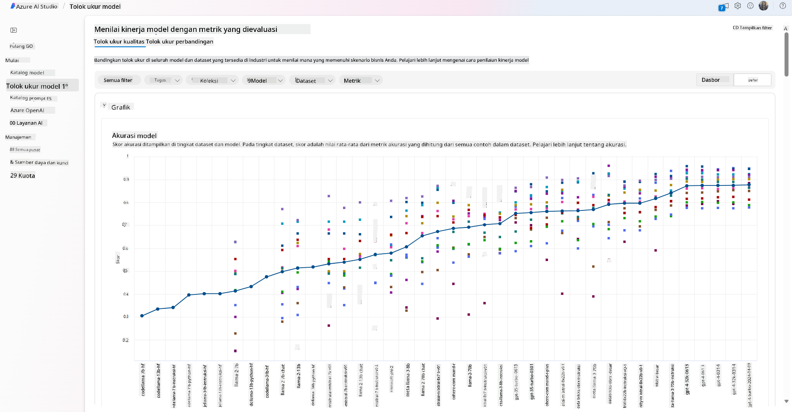
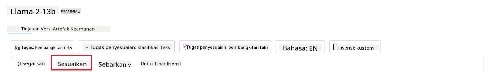
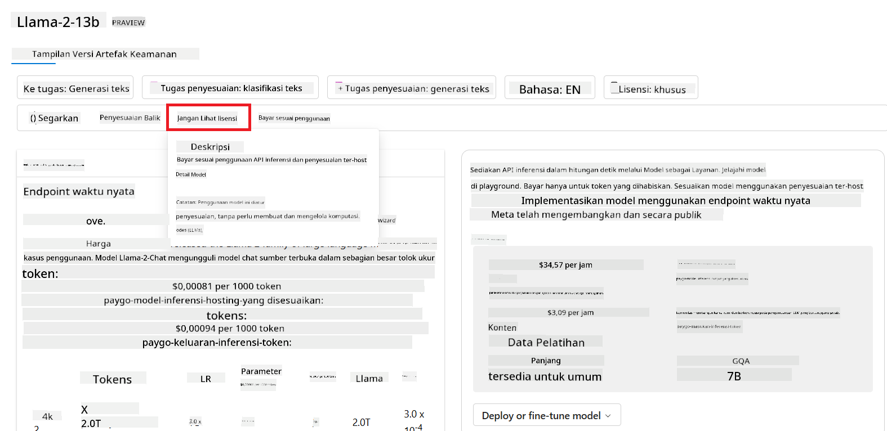
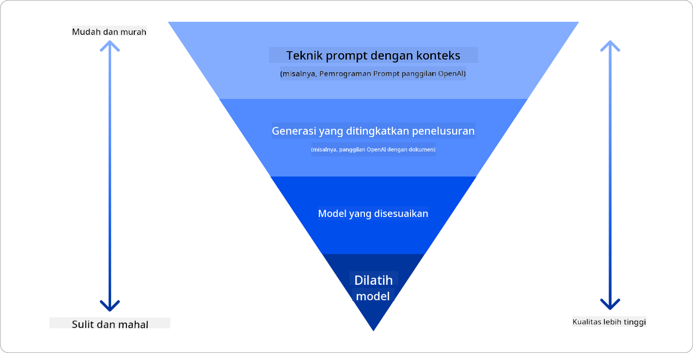

<!--
CO_OP_TRANSLATOR_METADATA:
{
  "original_hash": "e2f686f2eb794941761252ac5e8e090b",
  "translation_date": "2025-05-19T14:13:45+00:00",
  "source_file": "02-exploring-and-comparing-different-llms/README.md",
  "language_code": "id"
}
-->
# Menjelajahi dan Membandingkan LLM yang Berbeda

> _Klik gambar di atas untuk menonton video dari pelajaran ini_

Pada pelajaran sebelumnya, kita telah melihat bagaimana AI Generatif mengubah lanskap teknologi, bagaimana Model Bahasa Besar (LLM) bekerja dan bagaimana sebuah bisnis - seperti startup kita - dapat menerapkannya pada kasus penggunaan mereka dan berkembang! Dalam bab ini, kita akan membandingkan dan membedakan berbagai jenis model bahasa besar (LLM) untuk memahami kelebihan dan kekurangannya.

Langkah selanjutnya dalam perjalanan startup kita adalah menjelajahi lanskap LLM saat ini dan memahami mana yang cocok untuk kasus penggunaan kita.

## Pengantar

Pelajaran ini akan mencakup:

- Berbagai jenis LLM dalam lanskap saat ini.
- Menguji, mengiterasi, dan membandingkan berbagai model untuk kasus penggunaan Anda di Azure.
- Cara menerapkan LLM.

## Tujuan Pembelajaran

Setelah menyelesaikan pelajaran ini, Anda akan dapat:

- Memilih model yang tepat untuk kasus penggunaan Anda.
- Memahami cara menguji, mengiterasi, dan meningkatkan kinerja model Anda.
- Mengetahui bagaimana bisnis menerapkan model.

## Memahami Berbagai Jenis LLM

LLM dapat memiliki berbagai pengkategorian berdasarkan arsitektur, data pelatihan, dan kasus penggunaan. Memahami perbedaan ini akan membantu startup kita memilih model yang tepat untuk skenario, dan memahami cara menguji, mengiterasi, dan meningkatkan kinerja.

Ada banyak jenis model LLM yang berbeda, pilihan model Anda tergantung pada tujuan penggunaan, data Anda, berapa banyak yang siap Anda bayar, dan lainnya.

Tergantung pada apakah Anda bertujuan menggunakan model untuk teks, audio, video, pembuatan gambar, dan sebagainya, Anda mungkin memilih jenis model yang berbeda.

- **Pengakuan audio dan ucapan**. Untuk tujuan ini, model tipe Whisper adalah pilihan yang baik karena mereka bersifat umum dan ditujukan untuk pengakuan ucapan. Ini dilatih pada audio yang beragam dan dapat melakukan pengakuan ucapan multibahasa. Pelajari lebih lanjut tentang [model tipe Whisper di sini](https://platform.openai.com/docs/models/whisper?WT.mc_id=academic-105485-koreyst).

- **Pembuatan gambar**. Untuk pembuatan gambar, DALL-E dan Midjourney adalah dua pilihan yang sangat terkenal. DALL-E ditawarkan oleh Azure OpenAI. [Baca lebih lanjut tentang DALL-E di sini](https://platform.openai.com/docs/models/dall-e?WT.mc_id=academic-105485-koreyst) dan juga di Bab 9 dari kurikulum ini.

- **Pembuatan teks**. Sebagian besar model dilatih untuk pembuatan teks dan Anda memiliki banyak pilihan dari GPT-3.5 hingga GPT-4. Mereka hadir dengan biaya yang berbeda dengan GPT-4 menjadi yang paling mahal. Ada baiknya melihat ke [Azure OpenAI playground](https://oai.azure.com/portal/playground?WT.mc_id=academic-105485-koreyst) untuk mengevaluasi model mana yang paling sesuai dengan kebutuhan Anda dalam hal kemampuan dan biaya.

- **Multi-modality**. Jika Anda ingin menangani berbagai jenis data dalam input dan output, Anda mungkin ingin melihat model seperti [gpt-4 turbo dengan visi atau gpt-4o](https://learn.microsoft.com/azure/ai-services/openai/concepts/models#gpt-4-and-gpt-4-turbo-models?WT.mc_id=academic-105485-koreyst) - rilis terbaru dari model OpenAI - yang mampu menggabungkan pemrosesan bahasa alami dengan pemahaman visual, memungkinkan interaksi melalui antarmuka multi-modal.

Memilih model berarti Anda mendapatkan beberapa kemampuan dasar, yang mungkin tidak cukup. Sering kali Anda memiliki data spesifik perusahaan yang harus Anda sampaikan kepada LLM. Ada beberapa pilihan tentang bagaimana mendekati itu, lebih lanjut tentang itu di bagian mendatang.

### Model Dasar versus LLM

Istilah Model Dasar [diciptakan oleh peneliti Stanford](https://arxiv.org/abs/2108.07258?WT.mc_id=academic-105485-koreyst) dan didefinisikan sebagai model AI yang mengikuti beberapa kriteria, seperti:

- **Mereka dilatih menggunakan pembelajaran tanpa pengawasan atau pembelajaran mandiri**, artinya mereka dilatih pada data multi-modal yang tidak diberi label, dan mereka tidak memerlukan anotasi atau pelabelan data oleh manusia untuk proses pelatihan mereka.
- **Mereka adalah model yang sangat besar**, berdasarkan jaringan saraf yang sangat dalam yang dilatih pada miliaran parameter.
- **Mereka biasanya dimaksudkan untuk menjadi 'dasar' bagi model lain**, artinya mereka dapat digunakan sebagai titik awal untuk model lain yang akan dibangun di atasnya, yang dapat dilakukan dengan penyesuaian lebih lanjut.

Untuk lebih memperjelas perbedaan ini, mari kita ambil ChatGPT sebagai contoh. Untuk membangun versi pertama ChatGPT, sebuah model yang disebut GPT-3.5 berfungsi sebagai model dasar. Ini berarti bahwa OpenAI menggunakan beberapa data khusus obrolan untuk membuat versi yang disesuaikan dari GPT-3.5 yang dioptimalkan untuk berkinerja baik dalam skenario percakapan, seperti chatbot.

### Model Open Source versus Proprietary

Cara lain untuk mengkategorikan LLM adalah apakah mereka open source atau proprietary.

Model open source adalah model yang tersedia untuk umum dan dapat digunakan oleh siapa saja. Mereka sering kali disediakan oleh perusahaan yang membuatnya, atau oleh komunitas penelitian. Model-model ini dapat diperiksa, dimodifikasi, dan disesuaikan untuk berbagai kasus penggunaan dalam LLM. Namun, mereka tidak selalu dioptimalkan untuk penggunaan produksi, dan mungkin tidak seperforman model proprietary. Selain itu, pendanaan untuk model open source bisa terbatas, dan mereka mungkin tidak dipelihara dalam jangka panjang atau mungkin tidak diperbarui dengan penelitian terbaru. Contoh model open source yang populer termasuk [Alpaca](https://crfm.stanford.edu/2023/03/13/alpaca.html?WT.mc_id=academic-105485-koreyst), [Bloom](https://huggingface.co/bigscience/bloom) dan [LLaMA](https://llama.meta.com).

Model proprietary adalah model yang dimiliki oleh perusahaan dan tidak tersedia untuk umum. Model-model ini sering kali dioptimalkan untuk penggunaan produksi. Namun, mereka tidak dapat diperiksa, dimodifikasi, atau disesuaikan untuk kasus penggunaan yang berbeda. Selain itu, mereka tidak selalu tersedia secara gratis, dan mungkin memerlukan langganan atau pembayaran untuk digunakan. Juga, pengguna tidak memiliki kontrol atas data yang digunakan untuk melatih model, yang berarti mereka harus mempercayai pemilik model untuk memastikan komitmen terhadap privasi data dan penggunaan AI yang bertanggung jawab. Contoh model proprietary yang populer termasuk [model OpenAI](https://platform.openai.com/docs/models/overview?WT.mc_id=academic-105485-koreyst), [Google Bard](https://sapling.ai/llm/bard?WT.mc_id=academic-105485-koreyst) atau [Claude 2](https://www.anthropic.com/index/claude-2?WT.mc_id=academic-105485-koreyst).

### Embedding versus Pembuatan Gambar versus Pembuatan Teks dan Kode

LLM juga dapat dikategorikan berdasarkan output yang mereka hasilkan.

Embedding adalah serangkaian model yang dapat mengubah teks menjadi bentuk numerik, yang disebut embedding, yang merupakan representasi numerik dari teks input. Embedding memudahkan mesin untuk memahami hubungan antara kata atau kalimat dan dapat digunakan sebagai input oleh model lain, seperti model klasifikasi, atau model klaster yang memiliki kinerja lebih baik pada data numerik. Model embedding sering digunakan untuk pembelajaran transfer, di mana model dibangun untuk tugas pengganti yang memiliki banyak data, dan kemudian bobot model (embedding) digunakan kembali untuk tugas-tugas lain. Contoh dari kategori ini adalah [OpenAI embeddings](https://platform.openai.com/docs/models/embeddings?WT.mc_id=academic-105485-koreyst).

Model pembuatan gambar adalah model yang menghasilkan gambar. Model-model ini sering digunakan untuk pengeditan gambar, sintesis gambar, dan terjemahan gambar. Model pembuatan gambar sering dilatih pada kumpulan data gambar yang besar, seperti [LAION-5B](https://laion.ai/blog/laion-5b/?WT.mc_id=academic-105485-koreyst), dan dapat digunakan untuk menghasilkan gambar baru atau mengedit gambar yang ada dengan teknik inpainting, super-resolusi, dan pewarnaan. Contohnya termasuk [DALL-E-3](https://openai.com/dall-e-3?WT.mc_id=academic-105485-koreyst) dan [model Stable Diffusion](https://github.com/Stability-AI/StableDiffusion?WT.mc_id=academic-105485-koreyst).

Model pembuatan teks dan kode adalah model yang menghasilkan teks atau kode. Model-model ini sering digunakan untuk meringkas teks, terjemahan, dan menjawab pertanyaan. Model pembuatan teks sering dilatih pada kumpulan data teks yang besar, seperti [BookCorpus](https://www.cv-foundation.org/openaccess/content_iccv_2015/html/Zhu_Aligning_Books_and_ICCV_2015_paper.html?WT.mc_id=academic-105485-koreyst), dan dapat digunakan untuk menghasilkan teks baru, atau menjawab pertanyaan. Model pembuatan kode, seperti [CodeParrot](https://huggingface.co/codeparrot?WT.mc_id=academic-105485-koreyst), sering dilatih pada kumpulan data kode yang besar, seperti GitHub, dan dapat digunakan untuk menghasilkan kode baru, atau memperbaiki bug dalam kode yang ada.

### Encoder-Decoder versus Hanya Decoder

Untuk membicarakan tentang berbagai jenis arsitektur LLM, mari gunakan analogi.

Bayangkan manajer Anda memberi Anda tugas untuk menulis kuis untuk siswa. Anda memiliki dua rekan kerja; satu bertanggung jawab membuat konten dan yang lainnya bertanggung jawab untuk meninjaunya.

Pembuat konten seperti model Hanya Decoder, mereka dapat melihat topik dan melihat apa yang sudah Anda tulis dan kemudian dia bisa menulis kursus berdasarkan itu. Mereka sangat baik dalam menulis konten yang menarik dan informatif, tetapi mereka tidak terlalu baik dalam memahami topik dan tujuan pembelajaran. Beberapa contoh model Decoder adalah model keluarga GPT, seperti GPT-3.

Peninjau seperti model Hanya Encoder, mereka melihat kursus yang ditulis dan jawaban, memperhatikan hubungan antara mereka dan memahami konteks, tetapi mereka tidak baik dalam menghasilkan konten. Contoh model Hanya Encoder adalah BERT.

Bayangkan kita juga dapat memiliki seseorang yang bisa membuat dan meninjau kuis, ini adalah model Encoder-Decoder. Beberapa contohnya adalah BART dan T5.

### Layanan versus Model

Sekarang, mari kita bicarakan perbedaan antara layanan dan model. Layanan adalah produk yang ditawarkan oleh Penyedia Layanan Cloud, dan sering kali merupakan kombinasi dari model, data, dan komponen lainnya. Model adalah komponen inti dari layanan, dan sering kali merupakan model dasar, seperti LLM.

Layanan sering kali dioptimalkan untuk penggunaan produksi dan sering kali lebih mudah digunakan daripada model, melalui antarmuka pengguna grafis. Namun, layanan tidak selalu tersedia secara gratis, dan mungkin memerlukan langganan atau pembayaran untuk digunakan, sebagai imbalan untuk memanfaatkan peralatan dan sumber daya pemilik layanan, mengoptimalkan biaya dan mudah untuk meningkatkan skala. Contoh layanan adalah [Azure OpenAI Service](https://learn.microsoft.com/azure/ai-services/openai/overview?WT.mc_id=academic-105485-koreyst), yang menawarkan rencana tarif bayar sesuai pemakaian, artinya pengguna dikenakan biaya secara proporsional dengan seberapa banyak mereka menggunakan layanan tersebut. Selain itu, Azure OpenAI Service menawarkan keamanan kelas perusahaan dan kerangka kerja AI yang bertanggung jawab di atas kemampuan model.

Model hanyalah Jaringan Saraf, dengan parameter, bobot, dan lainnya. Memungkinkan perusahaan untuk menjalankannya secara lokal, namun, akan perlu membeli peralatan, membangun struktur untuk skala, dan membeli lisensi atau menggunakan model open source. Model seperti LLaMA tersedia untuk digunakan, membutuhkan daya komputasi untuk menjalankan model.

## Cara Menguji dan Mengiterasi dengan Berbagai Model untuk Memahami Kinerja di Azure

Setelah tim kami menjelajahi lanskap LLM saat ini dan mengidentifikasi beberapa kandidat yang baik untuk skenario mereka, langkah selanjutnya adalah mengujinya pada data dan beban kerja mereka. Ini adalah proses iteratif, dilakukan melalui eksperimen dan pengukuran. Sebagian besar model yang kami sebutkan dalam paragraf sebelumnya (model OpenAI, model open source seperti Llama2, dan transformer Hugging Face) tersedia di [Model Catalog](https://learn.microsoft.com/azure/ai-studio/how-to/model-catalog-overview?WT.mc_id=academic-105485-koreyst) di [Azure AI Studio](https://ai.azure.com/?WT.mc_id=academic-105485-koreyst).

[Azure AI Studio](https://learn.microsoft.com/azure/ai-studio/what-is-ai-studio?WT.mc_id=academic-105485-koreyst) adalah Platform Cloud yang dirancang untuk pengembang untuk membangun aplikasi AI generatif dan mengelola seluruh siklus pengembangan - dari eksperimen hingga evaluasi - dengan menggabungkan semua layanan AI Azure ke dalam satu hub dengan GUI yang praktis. Model Catalog di Azure AI Studio memungkinkan pengguna untuk:

- Menemukan Model Dasar yang diminati dalam katalog - baik proprietary atau open source, memfilter berdasarkan tugas, lisensi, atau nama. Untuk meningkatkan pencarian, model-model ini diorganisasikan ke dalam koleksi, seperti koleksi Azure OpenAI, koleksi Hugging Face, dan lainnya.

- Meninjau kartu model, termasuk deskripsi rinci tentang penggunaan yang dimaksudkan dan data pelatihan, contoh kode, dan hasil evaluasi pada perpustakaan evaluasi internal.
- Bandingkan tolok ukur di berbagai model dan dataset yang tersedia di industri untuk menilai mana yang memenuhi skenario bisnis, melalui panel [Model Benchmarks](https://learn.microsoft.com/azure/ai-studio/how-to/model-benchmarks?WT.mc_id=academic-105485-koreyst).

- Sesuaikan model pada data pelatihan khusus untuk meningkatkan kinerja model dalam beban kerja tertentu, memanfaatkan kemampuan eksperimen dan pelacakan dari Azure AI Studio.

- Terapkan model pra-latih asli atau versi yang telah disesuaikan ke inferensi waktu nyata jarak jauh - komputasi terkelola - atau titik akhir api tanpa server - [bayar sesuai penggunaan](https://learn.microsoft.com/azure/ai-studio/how-to/model-catalog-overview#model-deployment-managed-compute-and-serverless-api-pay-as-you-go?WT.mc_id=academic-105485-koreyst) - untuk memungkinkan aplikasi menggunakannya.

> [!NOTE]
> Tidak semua model dalam katalog saat ini tersedia untuk penyetelan lebih lanjut dan/atau penerapan bayar sesuai penggunaan. Periksa kartu model untuk detail tentang kemampuan dan batasan model.

## Meningkatkan hasil LLM

Kami telah menjelajahi dengan tim startup kami berbagai jenis LLM dan Platform Cloud (Azure Machine Learning) yang memungkinkan kami membandingkan berbagai model, mengevaluasinya pada data uji, meningkatkan kinerja, dan menerapkannya pada titik akhir inferensi.

Tetapi kapan mereka harus mempertimbangkan untuk menyetel ulang model daripada menggunakan yang pra-latih? Apakah ada pendekatan lain untuk meningkatkan kinerja model pada beban kerja tertentu?

Ada beberapa pendekatan yang dapat digunakan bisnis untuk mendapatkan hasil yang mereka butuhkan dari LLM. Anda dapat memilih berbagai jenis model dengan berbagai tingkat pelatihan saat menerapkan LLM dalam produksi, dengan tingkat kompleksitas, biaya, dan kualitas yang berbeda. Berikut beberapa pendekatan yang berbeda:

- **Rekayasa prompt dengan konteks**. Idenya adalah memberikan konteks yang cukup saat Anda meminta untuk memastikan Anda mendapatkan respons yang Anda butuhkan.

- **Retrieval Augmented Generation, RAG**. Data Anda mungkin ada di database atau titik akhir web misalnya, untuk memastikan data ini, atau subsetnya, dimasukkan pada saat meminta, Anda dapat mengambil data yang relevan dan menjadikannya bagian dari prompt pengguna.

- **Model yang telah disesuaikan**. Di sini, Anda melatih model lebih lanjut pada data Anda sendiri yang menyebabkan model menjadi lebih tepat dan responsif terhadap kebutuhan Anda tetapi mungkin mahal.

Sumber gambar: [Empat Cara yang Digunakan Perusahaan untuk Menerapkan LLM | Blog Fiddler AI](https://www.fiddler.ai/blog/four-ways-that-enterprises-deploy-llms?WT.mc_id=academic-105485-koreyst)

### Rekayasa Prompt dengan Konteks

LLM yang pra-latih bekerja sangat baik pada tugas-tugas bahasa alami yang umum, bahkan dengan memanggilnya dengan prompt pendek, seperti kalimat untuk dilengkapi atau pertanyaan – yang disebut pembelajaran "zero-shot".

Namun, semakin pengguna dapat membingkai pertanyaan mereka, dengan permintaan dan contoh yang terperinci – Konteks – semakin akurat dan mendekati harapan pengguna jawabannya. Dalam kasus ini, kita berbicara tentang pembelajaran "one-shot" jika prompt hanya mencakup satu contoh dan "few shot learning" jika mencakup beberapa contoh. Rekayasa prompt dengan konteks adalah pendekatan yang paling hemat biaya untuk memulai.

### Retrieval Augmented Generation (RAG)

LLM memiliki keterbatasan bahwa mereka hanya dapat menggunakan data yang telah digunakan selama pelatihan mereka untuk menghasilkan jawaban. Ini berarti bahwa mereka tidak tahu apa-apa tentang fakta yang terjadi setelah proses pelatihan mereka, dan mereka tidak dapat mengakses informasi non-publik (seperti data perusahaan). Ini dapat diatasi melalui RAG, teknik yang menambah prompt dengan data eksternal dalam bentuk potongan dokumen, dengan mempertimbangkan batas panjang prompt. Ini didukung oleh alat basis data Vektor (seperti [Azure Vector Search](https://learn.microsoft.com/azure/search/vector-search-overview?WT.mc_id=academic-105485-koreyst)) yang mengambil potongan yang berguna dari berbagai sumber data yang telah ditentukan dan menambahkannya ke Konteks prompt.

Teknik ini sangat membantu ketika bisnis tidak memiliki cukup data, cukup waktu, atau sumber daya untuk menyetel ulang LLM, tetapi tetap ingin meningkatkan kinerja pada beban kerja tertentu dan mengurangi risiko fabrikasi, yaitu, mistifikasi realitas atau konten berbahaya.

### Model yang telah disesuaikan

Penyetelan adalah proses yang memanfaatkan transfer learning untuk 'mengadaptasi' model ke tugas hilir atau untuk menyelesaikan masalah tertentu. Berbeda dengan pembelajaran few-shot dan RAG, ini menghasilkan model baru yang dihasilkan, dengan bobot dan bias yang diperbarui. Ini membutuhkan serangkaian contoh pelatihan yang terdiri dari satu input (prompt) dan output terkaitnya (penyelesaian). Ini akan menjadi pendekatan yang disukai jika:

- **Menggunakan model yang telah disesuaikan**. Bisnis ingin menggunakan model yang telah disesuaikan yang kurang mampu (seperti model embedding) daripada model berkinerja tinggi, menghasilkan solusi yang lebih hemat biaya dan cepat.

- **Mempertimbangkan latensi**. Latensi penting untuk kasus penggunaan tertentu, sehingga tidak mungkin menggunakan prompt yang sangat panjang atau jumlah contoh yang harus dipelajari dari model tidak sesuai dengan batas panjang prompt.

- **Tetap up to date**. Bisnis memiliki banyak data berkualitas tinggi dan label kebenaran dasar serta sumber daya yang diperlukan untuk mempertahankan data ini tetap up to date dari waktu ke waktu.

### Model terlatih

Melatih LLM dari awal adalah tanpa diragukan lagi pendekatan yang paling sulit dan paling kompleks untuk diadopsi, membutuhkan jumlah data yang besar, sumber daya yang terampil, dan daya komputasi yang tepat. Opsi ini harus dipertimbangkan hanya dalam skenario di mana bisnis memiliki kasus penggunaan khusus domain dan sejumlah besar data yang berpusat pada domain.

## Pemeriksaan pengetahuan

Apa pendekatan yang baik untuk meningkatkan hasil penyelesaian LLM?

1. Rekayasa prompt dengan konteks
1. RAG
1. Model yang telah disesuaikan

A:3, jika Anda memiliki waktu dan sumber daya serta data berkualitas tinggi, penyetelan adalah pilihan yang lebih baik untuk tetap up to date. Namun, jika Anda mencari perbaikan dan kekurangan waktu, ada baiknya mempertimbangkan RAG terlebih dahulu.

## 🚀 Tantangan

Baca lebih lanjut tentang bagaimana Anda dapat [menggunakan RAG](https://learn.microsoft.com/azure/search/retrieval-augmented-generation-overview?WT.mc_id=academic-105485-koreyst) untuk bisnis Anda.

## Kerja Hebat, Lanjutkan Pembelajaran Anda

Setelah menyelesaikan pelajaran ini, lihat [koleksi Pembelajaran AI Generatif](https://aka.ms/genai-collection?WT.mc_id=academic-105485-koreyst) kami untuk terus meningkatkan pengetahuan AI Generatif Anda!

Lanjutkan ke Pelajaran 3 di mana kita akan melihat bagaimana [membangun dengan AI Generatif secara Bertanggung Jawab](../03-using-generative-ai-responsibly/README.md?WT.mc_id=academic-105485-koreyst)!

**Penafian**:  
Dokumen ini telah diterjemahkan menggunakan layanan terjemahan AI [Co-op Translator](https://github.com/Azure/co-op-translator). Meskipun kami berusaha untuk mencapai ketepatan, harap diingat bahwa terjemahan otomatis mungkin mengandung kesalahan atau ketidakakuratan. Dokumen asli dalam bahasa aslinya harus dianggap sebagai sumber yang berwenang. Untuk informasi penting, disarankan menggunakan terjemahan manusia profesional. Kami tidak bertanggung jawab atas kesalahpahaman atau penafsiran yang salah yang timbul dari penggunaan terjemahan ini.