<!--
CO_OP_TRANSLATOR_METADATA:
{
  "original_hash": "e2f686f2eb794941761252ac5e8e090b",
  "translation_date": "2025-06-25T10:51:48+00:00",
  "source_file": "02-exploring-and-comparing-different-llms/README.md",
  "language_code": "id"
}
-->
# Menjelajahi dan Membandingkan Berbagai LLM

[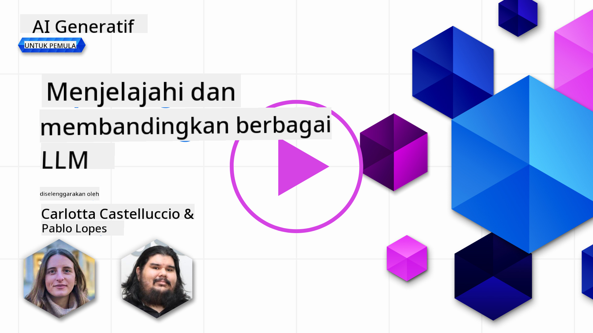](https://aka.ms/gen-ai-lesson2-gh?WT.mc_id=academic-105485-koreyst)

> _Klik gambar di atas untuk menonton video pelajaran ini_

Pada pelajaran sebelumnya, kita telah melihat bagaimana AI Generatif mengubah lanskap teknologi, bagaimana Model Bahasa Besar (LLM) bekerja, dan bagaimana sebuah bisnis - seperti startup kita - dapat menerapkannya pada kasus penggunaan mereka dan berkembang! Dalam bab ini, kita akan membandingkan dan mempertentangkan berbagai jenis model bahasa besar (LLM) untuk memahami kelebihan dan kekurangannya.

Langkah berikutnya dalam perjalanan startup kita adalah menjelajahi lanskap LLM saat ini dan memahami mana yang cocok untuk kasus penggunaan kita.

## Pengantar

Pelajaran ini akan mencakup:

- Berbagai jenis LLM dalam lanskap saat ini.
- Menguji, mengulangi, dan membandingkan berbagai model untuk kasus penggunaan Anda di Azure.
- Bagaimana menerapkan LLM.

## Tujuan Pembelajaran

Setelah menyelesaikan pelajaran ini, Anda akan dapat:

- Memilih model yang tepat untuk kasus penggunaan Anda.
- Memahami bagaimana menguji, mengulangi, dan meningkatkan kinerja model Anda.
- Mengetahui bagaimana bisnis menerapkan model.

## Memahami Berbagai Jenis LLM

LLM dapat memiliki beberapa kategorisasi berdasarkan arsitektur, data pelatihan, dan kasus penggunaan mereka. Memahami perbedaan ini akan membantu startup kita memilih model yang tepat untuk skenario, dan memahami bagaimana menguji, mengulangi, dan meningkatkan kinerja.

Ada banyak jenis model LLM yang berbeda, pilihan model Anda tergantung pada apa yang Anda tuju untuk digunakan, data Anda, berapa banyak yang Anda siap bayar, dan lainnya.

Tergantung pada apakah Anda ingin menggunakan model untuk teks, audio, video, pembuatan gambar, dan sebagainya, Anda mungkin memilih jenis model yang berbeda.

- **Pengakuan audio dan ucapan**. Untuk tujuan ini, model tipe Whisper adalah pilihan yang bagus karena bersifat serba guna dan ditujukan untuk pengenalan ucapan. Ini dilatih pada audio yang beragam dan dapat melakukan pengenalan ucapan multibahasa. Pelajari lebih lanjut tentang [model tipe Whisper di sini](https://platform.openai.com/docs/models/whisper?WT.mc_id=academic-105485-koreyst).

- **Pembuatan gambar**. Untuk pembuatan gambar, DALL-E dan Midjourney adalah dua pilihan yang sangat terkenal. DALL-E ditawarkan oleh Azure OpenAI. [Baca lebih lanjut tentang DALL-E di sini](https://platform.openai.com/docs/models/dall-e?WT.mc_id=academic-105485-koreyst) dan juga di Bab 9 dari kurikulum ini.

- **Pembuatan teks**. Sebagian besar model dilatih untuk pembuatan teks dan Anda memiliki banyak pilihan dari GPT-3.5 hingga GPT-4. Mereka datang dengan biaya yang berbeda dengan GPT-4 menjadi yang paling mahal. Ada baiknya melihat ke dalam [Azure OpenAI playground](https://oai.azure.com/portal/playground?WT.mc_id=academic-105485-koreyst) untuk mengevaluasi model mana yang paling sesuai dengan kebutuhan Anda dalam hal kemampuan dan biaya.

- **Multi-modalitas**. Jika Anda ingin menangani berbagai jenis data dalam input dan output, Anda mungkin ingin melihat model seperti [gpt-4 turbo dengan visi atau gpt-4o](https://learn.microsoft.com/azure/ai-services/openai/concepts/models#gpt-4-and-gpt-4-turbo-models?WT.mc_id=academic-105485-koreyst) - rilis terbaru dari model OpenAI - yang mampu menggabungkan pemrosesan bahasa alami dengan pemahaman visual, memungkinkan interaksi melalui antarmuka multi-modal.

Memilih model berarti Anda mendapatkan beberapa kemampuan dasar, yang mungkin tidak cukup. Seringkali Anda memiliki data spesifik perusahaan yang perlu Anda sampaikan kepada LLM. Ada beberapa pilihan berbeda tentang bagaimana mendekati itu, lebih lanjut tentang itu di bagian berikutnya.

### Model Dasar versus LLM

Istilah Model Dasar [diciptakan oleh peneliti Stanford](https://arxiv.org/abs/2108.07258?WT.mc_id=academic-105485-koreyst) dan didefinisikan sebagai model AI yang mengikuti beberapa kriteria, seperti:

- **Mereka dilatih menggunakan pembelajaran tanpa pengawasan atau pembelajaran mandiri**, artinya mereka dilatih pada data multi-modal yang tidak berlabel, dan mereka tidak memerlukan anotasi atau pelabelan data manusia untuk proses pelatihan mereka.
- **Mereka adalah model yang sangat besar**, berdasarkan jaringan saraf yang sangat dalam yang dilatih pada miliaran parameter.
- **Mereka biasanya dimaksudkan untuk berfungsi sebagai 'dasar' untuk model lain**, artinya mereka dapat digunakan sebagai titik awal untuk model lain yang akan dibangun di atasnya, yang dapat dilakukan dengan penyesuaian.

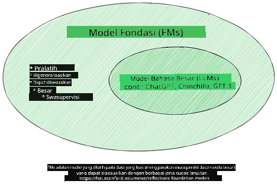

Sumber gambar: [Panduan Penting untuk Model Dasar dan Model Bahasa Besar | oleh Babar M Bhatti | Medium
](https://thebabar.medium.com/essential-guide-to-foundation-models-and-large-language-models-27dab58f7404)

Untuk memperjelas perbedaan ini, mari kita ambil ChatGPT sebagai contoh. Untuk membangun versi pertama ChatGPT, model bernama GPT-3.5 berfungsi sebagai model dasar. Ini berarti bahwa OpenAI menggunakan beberapa data khusus chat untuk membuat versi GPT-3.5 yang disesuaikan yang dikhususkan untuk berkinerja baik dalam skenario percakapan, seperti chatbot.

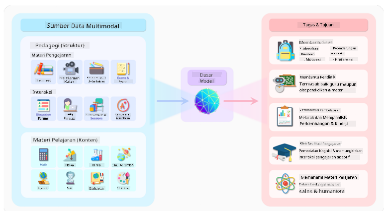

Sumber gambar: [2108.07258.pdf (arxiv.org)](https://arxiv.org/pdf/2108.07258.pdf?WT.mc_id=academic-105485-koreyst)

### Open Source versus Model Proprietary

Cara lain untuk mengkategorikan LLM adalah apakah mereka open source atau proprietary.

Model open source adalah model yang dibuat tersedia untuk umum dan dapat digunakan oleh siapa saja. Mereka sering dibuat tersedia oleh perusahaan yang membuatnya, atau oleh komunitas riset. Model-model ini diizinkan untuk diperiksa, dimodifikasi, dan disesuaikan untuk berbagai kasus penggunaan dalam LLM. Namun, mereka tidak selalu dioptimalkan untuk penggunaan produksi, dan mungkin tidak sebaik model proprietary. Selain itu, pendanaan untuk model open source dapat terbatas, dan mereka mungkin tidak dipelihara jangka panjang atau mungkin tidak diperbarui dengan penelitian terbaru. Contoh model open source populer termasuk [Alpaca](https://crfm.stanford.edu/2023/03/13/alpaca.html?WT.mc_id=academic-105485-koreyst), [Bloom](https://huggingface.co/bigscience/bloom) dan [LLaMA](https://llama.meta.com).

Model proprietary adalah model yang dimiliki oleh perusahaan dan tidak dibuat tersedia untuk umum. Model-model ini sering dioptimalkan untuk penggunaan produksi. Namun, mereka tidak diizinkan untuk diperiksa, dimodifikasi, atau disesuaikan untuk kasus penggunaan yang berbeda. Selain itu, mereka tidak selalu tersedia secara gratis, dan mungkin memerlukan langganan atau pembayaran untuk digunakan. Juga, pengguna tidak memiliki kontrol atas data yang digunakan untuk melatih model, yang berarti mereka harus mempercayakan pemilik model dengan memastikan komitmen terhadap privasi data dan penggunaan AI yang bertanggung jawab. Contoh model proprietary populer termasuk [model OpenAI](https://platform.openai.com/docs/models/overview?WT.mc_id=academic-105485-koreyst), [Google Bard](https://sapling.ai/llm/bard?WT.mc_id=academic-105485-koreyst) atau [Claude 2](https://www.anthropic.com/index/claude-2?WT.mc_id=academic-105485-koreyst).

### Embedding versus Pembuatan Gambar versus Pembuatan Teks dan Kode

LLM juga dapat dikategorikan berdasarkan output yang mereka hasilkan.

Embedding adalah satu set model yang dapat mengonversi teks menjadi bentuk numerik, disebut embedding, yang merupakan representasi numerik dari teks input. Embedding memudahkan mesin untuk memahami hubungan antara kata atau kalimat dan dapat dikonsumsi sebagai input oleh model lain, seperti model klasifikasi, atau model pengelompokan yang memiliki kinerja lebih baik pada data numerik. Model embedding sering digunakan untuk pembelajaran transfer, di mana model dibangun untuk tugas pengganti yang memiliki banyak data, dan kemudian bobot model (embedding) digunakan kembali untuk tugas hilir lainnya. Contoh dari kategori ini adalah [OpenAI embeddings](https://platform.openai.com/docs/models/embeddings?WT.mc_id=academic-105485-koreyst).

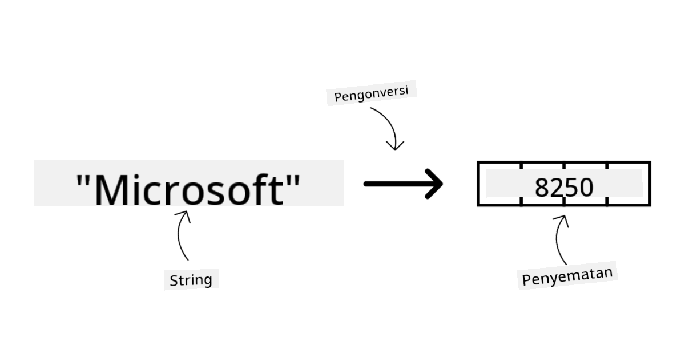

Model pembuatan gambar adalah model yang menghasilkan gambar. Model-model ini sering digunakan untuk pengeditan gambar, sintesis gambar, dan penerjemahan gambar. Model pembuatan gambar sering dilatih pada dataset besar gambar, seperti [LAION-5B](https://laion.ai/blog/laion-5b/?WT.mc_id=academic-105485-koreyst), dan dapat digunakan untuk menghasilkan gambar baru atau untuk mengedit gambar yang ada dengan teknik inpainting, super-resolusi, dan pewarnaan. Contohnya termasuk [DALL-E-3](https://openai.com/dall-e-3?WT.mc_id=academic-105485-koreyst) dan [model Stable Diffusion](https://github.com/Stability-AI/StableDiffusion?WT.mc_id=academic-105485-koreyst).

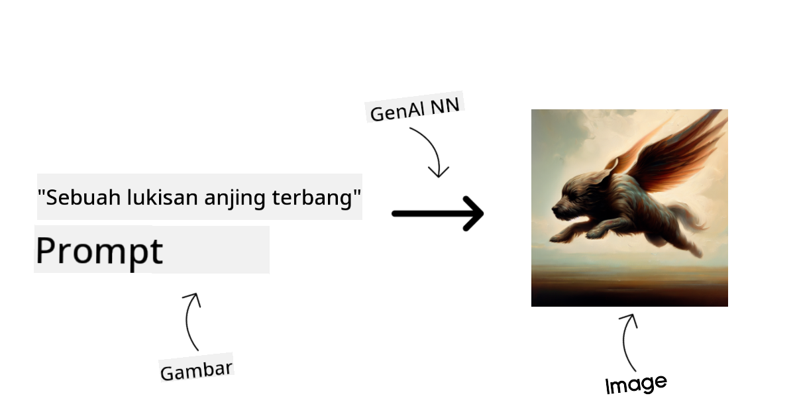

Model pembuatan teks dan kode adalah model yang menghasilkan teks atau kode. Model-model ini sering digunakan untuk ringkasan teks, penerjemahan, dan menjawab pertanyaan. Model pembuatan teks sering dilatih pada dataset besar teks, seperti [BookCorpus](https://www.cv-foundation.org/openaccess/content_iccv_2015/html/Zhu_Aligning_Books_and_ICCV_2015_paper.html?WT.mc_id=academic-105485-koreyst), dan dapat digunakan untuk menghasilkan teks baru, atau untuk menjawab pertanyaan. Model pembuatan kode, seperti [CodeParrot](https://huggingface.co/codeparrot?WT.mc_id=academic-105485-koreyst), sering dilatih pada dataset besar kode, seperti GitHub, dan dapat digunakan untuk menghasilkan kode baru, atau untuk memperbaiki bug dalam kode yang ada.

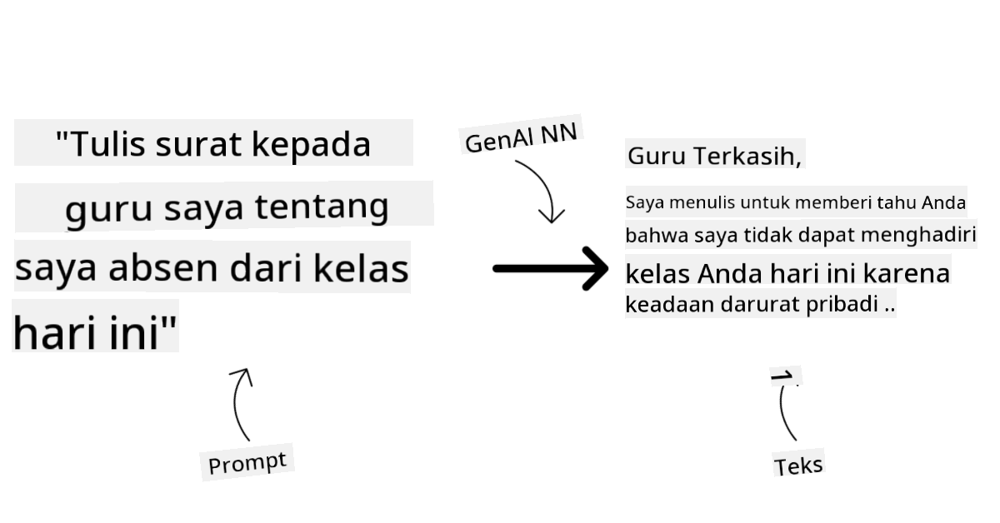

### Encoder-Decoder versus Hanya Decoder

Untuk membahas jenis arsitektur LLM yang berbeda, mari kita gunakan analogi.

Bayangkan manajer Anda memberi Anda tugas untuk menulis kuis untuk siswa. Anda memiliki dua rekan; satu bertanggung jawab untuk membuat konten dan yang lainnya bertanggung jawab untuk meninjau mereka.

Pembuat konten seperti model Hanya Decoder, mereka dapat melihat topik dan melihat apa yang sudah Anda tulis dan kemudian dia dapat menulis kursus berdasarkan itu. Mereka sangat pandai menulis konten yang menarik dan informatif, tetapi mereka tidak terlalu pandai memahami topik dan tujuan pembelajaran. Beberapa contoh model Decoder adalah model keluarga GPT, seperti GPT-3.

Peninjau seperti model Hanya Encoder, mereka melihat kursus yang ditulis dan jawaban, memperhatikan hubungan di antara mereka dan memahami konteks, tetapi mereka tidak pandai menghasilkan konten. Contoh model Hanya Encoder adalah BERT.

Bayangkan bahwa kita juga dapat memiliki seseorang yang dapat membuat dan meninjau kuis, ini adalah model Encoder-Decoder. Beberapa contohnya adalah BART dan T5.

### Layanan versus Model

Sekarang, mari kita bicara tentang perbedaan antara layanan dan model. Layanan adalah produk yang ditawarkan oleh Penyedia Layanan Cloud, dan sering kali merupakan kombinasi dari model, data, dan komponen lainnya. Model adalah komponen inti dari layanan, dan sering kali merupakan model dasar, seperti LLM.

Layanan sering dioptimalkan untuk penggunaan produksi dan sering kali lebih mudah digunakan daripada model, melalui antarmuka pengguna grafis. Namun, layanan tidak selalu tersedia secara gratis, dan mungkin memerlukan langganan atau pembayaran untuk digunakan, sebagai imbalan untuk memanfaatkan peralatan dan sumber daya pemilik layanan, mengoptimalkan pengeluaran, dan mudah melakukan penskalaan. Contoh layanan adalah [Azure OpenAI Service](https://learn.microsoft.com/azure/ai-services/openai/overview?WT.mc_id=academic-105485-koreyst), yang menawarkan rencana tarif bayar sesuai pemakaian, yang berarti pengguna dikenakan biaya secara proporsional dengan seberapa banyak mereka menggunakan layanan. Selain itu, Azure OpenAI Service menawarkan keamanan tingkat perusahaan dan kerangka kerja AI yang bertanggung jawab di atas kemampuan model.

Model hanyalah Jaringan Saraf, dengan parameter, bobot, dan lainnya. Memungkinkan perusahaan untuk menjalankan secara lokal, namun, akan perlu membeli peralatan, membangun struktur untuk penskalaan, dan membeli lisensi atau menggunakan model open source. Model seperti LLaMA tersedia untuk digunakan, memerlukan daya komputasi untuk menjalankan model.

## Bagaimana Menguji dan Mengulangi dengan Model yang Berbeda untuk Memahami Kinerja di Azure

Setelah tim kami menjelajahi lanskap LLM saat ini dan mengidentifikasi beberapa kandidat yang baik untuk skenario mereka, langkah selanjutnya adalah menguji mereka pada data dan beban kerja mereka. Ini adalah proses iteratif, dilakukan dengan eksperimen dan pengukuran. Sebagian besar model yang kami sebutkan di paragraf sebelumnya (model OpenAI, model open source seperti Llama2, dan transformer Hugging Face) tersedia di [Model Catalog](https://learn.microsoft.com/azure/ai-studio/how-to/model-catalog-overview?WT.mc_id=academic-105485-koreyst) di [Azure AI Studio](https://ai.azure.com/?WT.mc_id=academic-105485-koreyst).

[Azure AI Studio](https://learn.microsoft.com/azure/ai-studio/what-is-ai-studio?WT.mc_id=academic-105485-koreyst) adalah Platform Cloud yang dirancang untuk pengembang untuk membangun aplikasi AI generatif dan mengelola seluruh siklus pengembangan - dari eksperimen hingga evaluasi - dengan menggabungkan semua layanan AI Azure menjadi satu pusat dengan GUI yang praktis. Model Catalog di Azure AI Studio memungkinkan pengguna untuk:

- Menemukan Model Dasar yang diminati dalam katalog - baik proprietary atau open source, memfilter berdasarkan tugas, lisensi, atau nama. Untuk meningkatkan kemampuan pencarian, model-model diatur dalam koleksi, seperti koleksi Azure OpenAI, koleksi Hugging Face, dan lainnya.

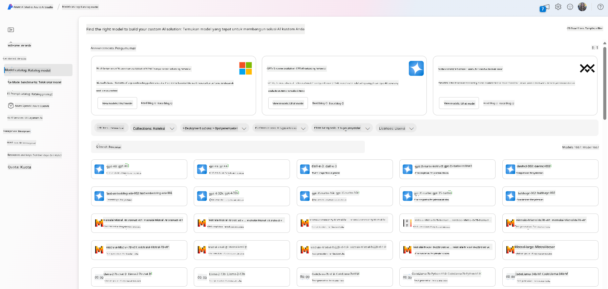

- Meninjau kartu model, termasuk deskripsi rinci tentang penggunaan yang dimaksudkan dan data pelatihan, contoh kode, dan hasil evaluasi pada perpustakaan evaluasi internal.

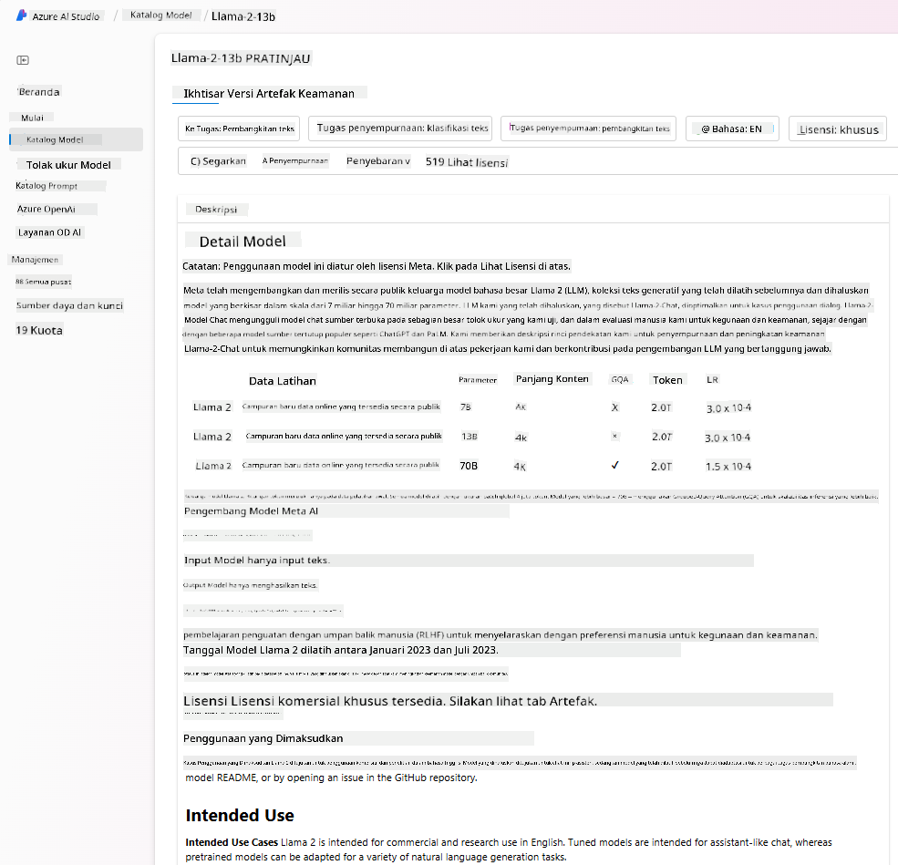
- Bandingkan tolok ukur di berbagai model dan dataset yang tersedia di industri untuk menilai mana yang memenuhi skenario bisnis, melalui panel [Model Benchmarks](https://learn.microsoft.com/azure/ai-studio/how-to/model-benchmarks?WT.mc_id=academic-105485-koreyst).

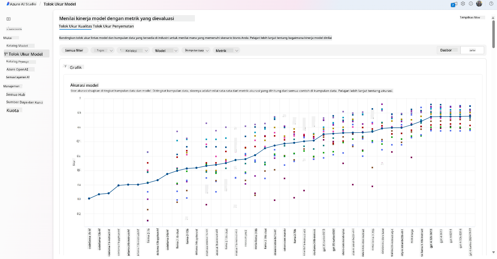

- Sesuaikan model pada data pelatihan khusus untuk meningkatkan kinerja model dalam beban kerja tertentu, memanfaatkan kemampuan eksperimen dan pelacakan dari Azure AI Studio.

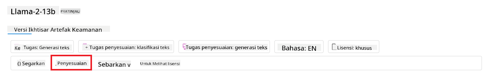

- Sebarkan model pra-terlatih asli atau versi yang sudah disesuaikan ke inferensi waktu nyata jarak jauh - komputasi terkelola - atau endpoint api tanpa server - [bayar sesuai pemakaian](https://learn.microsoft.com/azure/ai-studio/how-to/model-catalog-overview#model-deployment-managed-compute-and-serverless-api-pay-as-you-go?WT.mc_id=academic-105485-koreyst) - untuk memungkinkan aplikasi menggunakannya.

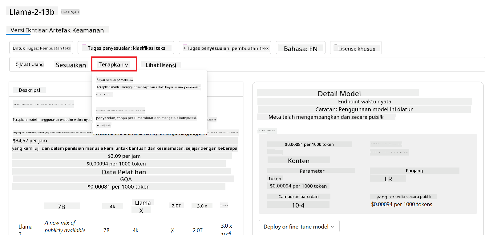

> [!NOTE]
> Tidak semua model dalam katalog saat ini tersedia untuk penyesuaian dan/atau penyebaran bayar sesuai pemakaian. Periksa kartu model untuk detail mengenai kemampuan dan keterbatasan model.

## Meningkatkan hasil LLM

Kami telah menjelajahi dengan tim startup kami berbagai jenis LLM dan Platform Cloud (Azure Machine Learning) yang memungkinkan kami untuk membandingkan berbagai model, mengevaluasinya pada data uji, meningkatkan kinerja, dan menyebarkannya pada endpoint inferensi.

Namun kapan mereka harus mempertimbangkan untuk menyesuaikan model daripada menggunakan yang pra-terlatih? Apakah ada pendekatan lain untuk meningkatkan kinerja model pada beban kerja tertentu?

Ada beberapa pendekatan yang dapat digunakan bisnis untuk mendapatkan hasil yang mereka butuhkan dari LLM. Anda dapat memilih berbagai jenis model dengan tingkat pelatihan yang berbeda saat menyebarkan LLM dalam produksi, dengan tingkat kompleksitas, biaya, dan kualitas yang berbeda. Berikut beberapa pendekatan yang berbeda:

- **Rekayasa prompt dengan konteks**. Idenya adalah memberikan konteks yang cukup saat Anda memprompt untuk memastikan Anda mendapatkan respons yang Anda butuhkan.

- **Retrieval Augmented Generation, RAG**. Data Anda mungkin ada dalam database atau endpoint web misalnya, untuk memastikan data ini, atau sebagian darinya, dimasukkan saat pemromptan, Anda dapat mengambil data yang relevan dan menjadikannya bagian dari prompt pengguna.

- **Model yang disesuaikan**. Di sini, Anda melatih model lebih lanjut pada data Anda sendiri yang membuat model menjadi lebih tepat dan responsif terhadap kebutuhan Anda tetapi mungkin mahal.

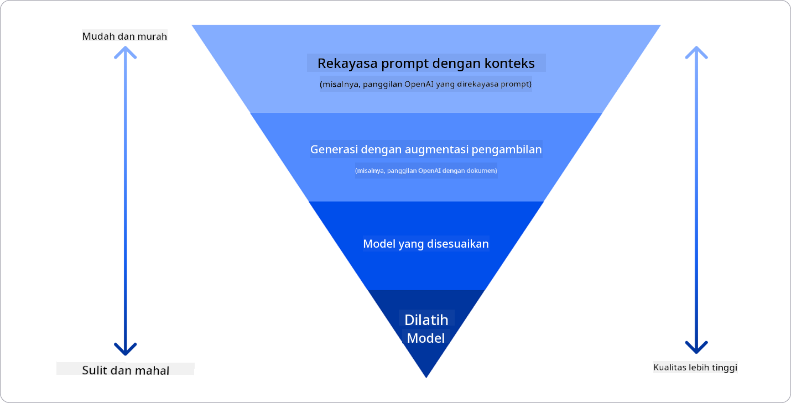

Sumber gambar: [Empat Cara Perusahaan Menyebarkan LLM | Blog Fiddler AI](https://www.fiddler.ai/blog/four-ways-that-enterprises-deploy-llms?WT.mc_id=academic-105485-koreyst)

### Rekayasa Prompt dengan Konteks

LLM pra-terlatih bekerja sangat baik pada tugas bahasa alami yang umum, bahkan dengan memanggilnya dengan prompt singkat, seperti kalimat untuk diselesaikan atau pertanyaan – yang disebut pembelajaran "zero-shot".

Namun, semakin banyak pengguna dapat membingkai kueri mereka, dengan permintaan dan contoh yang rinci – Konteks – semakin akurat dan mendekati harapan pengguna jawabannya. Dalam kasus ini, kita berbicara tentang pembelajaran "one-shot" jika prompt hanya mencakup satu contoh dan "pembelajaran beberapa contoh" jika mencakup beberapa contoh. Rekayasa prompt dengan konteks adalah pendekatan paling hemat biaya untuk memulai.

### Retrieval Augmented Generation (RAG)

LLM memiliki keterbatasan bahwa mereka hanya dapat menggunakan data yang telah digunakan selama pelatihan mereka untuk menghasilkan jawaban. Ini berarti bahwa mereka tidak tahu apa-apa tentang fakta yang terjadi setelah proses pelatihan mereka, dan mereka tidak dapat mengakses informasi non-publik (seperti data perusahaan). Ini dapat diatasi melalui RAG, teknik yang menambah prompt dengan data eksternal dalam bentuk potongan dokumen, mempertimbangkan batas panjang prompt. Ini didukung oleh alat database Vektor (seperti [Azure Vector Search](https://learn.microsoft.com/azure/search/vector-search-overview?WT.mc_id=academic-105485-koreyst)) yang mengambil potongan berguna dari berbagai sumber data yang telah ditentukan dan menambahkannya ke Konteks prompt.

Teknik ini sangat membantu ketika bisnis tidak memiliki cukup data, waktu, atau sumber daya untuk menyesuaikan LLM, tetapi masih ingin meningkatkan kinerja pada beban kerja tertentu dan mengurangi risiko fabrikasi, yaitu, pemalsuan realitas atau konten berbahaya.

### Model yang disesuaikan

Penyesuaian adalah proses yang memanfaatkan pembelajaran transfer untuk 'menyesuaikan' model dengan tugas hilir atau untuk menyelesaikan masalah tertentu. Berbeda dengan pembelajaran beberapa contoh dan RAG, ini menghasilkan model baru yang dihasilkan, dengan bobot dan bias yang diperbarui. Ini memerlukan serangkaian contoh pelatihan yang terdiri dari satu input (prompt) dan output yang terkait (penyelesaian). Ini akan menjadi pendekatan yang disukai jika:

- **Menggunakan model yang disesuaikan**. Bisnis ingin menggunakan model yang disesuaikan yang kurang mampu (seperti model embedding) daripada model berkinerja tinggi, menghasilkan solusi yang lebih hemat biaya dan cepat.

- **Mempertimbangkan latensi**. Latensi penting untuk kasus penggunaan tertentu, jadi tidak mungkin menggunakan prompt yang sangat panjang atau jumlah contoh yang harus dipelajari dari model tidak sesuai dengan batas panjang prompt.

- **Tetap terbaru**. Bisnis memiliki banyak data berkualitas tinggi dan label kebenaran dasar dan sumber daya yang diperlukan untuk menjaga data ini tetap terbaru dari waktu ke waktu.

### Model yang dilatih

Melatih LLM dari awal adalah tanpa diragukan lagi pendekatan yang paling sulit dan paling kompleks untuk diadopsi, memerlukan sejumlah besar data, sumber daya yang terampil, dan kekuatan komputasi yang sesuai. Opsi ini harus dipertimbangkan hanya dalam skenario di mana bisnis memiliki kasus penggunaan spesifik domain dan sejumlah besar data yang berpusat pada domain.

## Pemeriksaan Pengetahuan

Apa pendekatan yang baik untuk meningkatkan hasil penyelesaian LLM?

1. Rekayasa prompt dengan konteks
1. RAG
1. Model yang disesuaikan

A:3, jika Anda memiliki waktu dan sumber daya serta data berkualitas tinggi, penyesuaian adalah opsi yang lebih baik untuk tetap terbaru. Namun, jika Anda ingin meningkatkan sesuatu dan Anda kekurangan waktu, ada baiknya mempertimbangkan RAG terlebih dahulu.

## 🚀 Tantangan

Baca lebih lanjut tentang bagaimana Anda dapat [menggunakan RAG](https://learn.microsoft.com/azure/search/retrieval-augmented-generation-overview?WT.mc_id=academic-105485-koreyst) untuk bisnis Anda.

## Kerja Bagus, Lanjutkan Pembelajaran Anda

Setelah menyelesaikan pelajaran ini, lihat [koleksi Pembelajaran AI Generatif](https://aka.ms/genai-collection?WT.mc_id=academic-105485-koreyst) kami untuk terus meningkatkan pengetahuan AI Generatif Anda!

Lanjutkan ke Pelajaran 3 di mana kita akan melihat bagaimana [membangun dengan AI Generatif Secara Bertanggung Jawab](../03-using-generative-ai-responsibly/README.md?WT.mc_id=academic-105485-koreyst)!

**Penafian**:  
Dokumen ini telah diterjemahkan menggunakan layanan penerjemahan AI [Co-op Translator](https://github.com/Azure/co-op-translator). Meskipun kami berusaha untuk memberikan terjemahan yang akurat, harap diingat bahwa terjemahan otomatis mungkin mengandung kesalahan atau ketidakakuratan. Dokumen asli dalam bahasa aslinya harus dianggap sebagai sumber yang berwenang. Untuk informasi yang penting, disarankan menggunakan terjemahan manusia profesional. Kami tidak bertanggung jawab atas kesalahpahaman atau penafsiran yang salah yang timbul dari penggunaan terjemahan ini.