# Menjelajahi dan membandingkan berbagai LLM

> _Klik gambar di atas untuk menonton video pelajaran ini_

Dengan pelajaran sebelumnya, kita telah melihat bagaimana Generative AI mengubah lanskap teknologi, bagaimana Large Language Models (LLM) bekerja dan bagaimana sebuah bisnis - seperti startup kita - dapat menerapkannya pada kasus penggunaan mereka dan berkembang! Dalam bab ini, kita akan membandingkan dan membedakan berbagai jenis model bahasa besar (LLM) untuk memahami kelebihan dan kekurangannya.

Langkah berikutnya dalam perjalanan startup kita adalah menjelajahi lanskap LLM saat ini dan memahami mana yang cocok untuk kasus penggunaan kita.

## Pendahuluan

Pelajaran ini akan membahas:

- Berbagai jenis LLM dalam lanskap saat ini.
- Menguji, mengulangi, dan membandingkan berbagai model untuk kasus penggunaan Anda di Azure.
- Cara menerapkan LLM.

## Tujuan Pembelajaran

Setelah menyelesaikan pelajaran ini, Anda akan dapat:

- Memilih model yang tepat untuk kasus penggunaan Anda.
- Memahami cara menguji, mengulangi, dan meningkatkan performa model Anda.
- Mengetahui cara bisnis menerapkan model.

## Memahami berbagai jenis LLM

LLM dapat memiliki berbagai kategorisasi berdasarkan arsitektur, data pelatihan, dan kasus penggunaannya. Memahami perbedaan ini akan membantu startup kita memilih model yang tepat untuk skenario, dan memahami cara menguji, mengulangi, dan meningkatkan performa.

Ada banyak jenis model LLM yang berbeda, pilihan model Anda tergantung pada apa yang ingin Anda gunakan, data Anda, berapa banyak yang siap Anda bayar, dan lainnya.

Tergantung apakah Anda ingin menggunakan model untuk teks, audio, video, generasi gambar dan sebagainya, Anda mungkin memilih jenis model yang berbeda.

- **Pengakuan audio dan suara**. Model bergaya Whisper masih berguna sebagai model pengenalan suara tujuan umum, tetapi pilihan produksi sekarang juga termasuk model speech-to-text terbaru seperti `gpt-4o-transcribe`, `gpt-4o-mini-transcribe`, dan varian diarization. Evaluasi cakupan bahasa, diarization, dukungan real-time, latensi, dan biaya untuk skenario Anda. Pelajari lebih lanjut di dokumentasi [OpenAI speech-to-text](https://platform.openai.com/docs/guides/speech-to-text?WT.mc_id=academic-105485-koreyst).

- **Generasi gambar**. DALL-E dan Midjourney adalah pilihan terkenal untuk generasi gambar, tetapi API gambar OpenAI saat ini berpusat pada model GPT Image seperti `gpt-image-2`, sementara Stable Diffusion, Imagen, Flux, dan keluarga model lainnya juga merupakan pilihan umum. Bandingkan ketepatan prompt, dukungan pengeditan, kontrol gaya, persyaratan keamanan, dan lisensi. Pelajari lebih lanjut di panduan [OpenAI image generation](https://platform.openai.com/docs/guides/images?WT.mc_id=academic-105485-koreyst) dan Bab 9 dari kurikulum ini.

- **Generasi teks**. Model teks sekarang mencakup model frontier, model penalaran, model kecil dengan latensi rendah, dan model dengan bobot terbuka. Contoh saat ini termasuk model OpenAI GPT-5.x, model Anthropic Claude 4.x, model Google Gemini 3.x, model Meta Llama 4, dan model Mistral. Jangan memilih hanya berdasarkan tanggal rilis atau harga; bandingkan kualitas tugas, latensi, jendela konteks, penggunaan alat, perilaku keamanan, ketersediaan regional, dan total biaya. [Katalog model Microsoft Foundry](https://ai.azure.com/catalog?WT.mc_id=academic-105485-koreyst) adalah tempat yang baik untuk membandingkan model yang tersedia di Azure.

- **Multi-modality**. Banyak model saat ini dapat memproses lebih dari teks. Beberapa menerima masukan gambar, audio, atau video; beberapa dapat memanggil alat; dan model khusus dapat menghasilkan gambar, audio, atau video. Misalnya, model OpenAI saat ini mendukung input teks dan gambar, model Gemini dapat mendukung teks, kode, gambar, audio, dan input video tergantung variannya, dan Llama 4 Scout dan Maverick adalah model multimodal dengan bobot terbuka secara native. Selalu periksa kartu model masing-masing untuk modalitas input dan output yang didukung sebelum membangun alur kerja di sekitarnya.

Memilih model berarti Anda mendapatkan beberapa kemampuan dasar, yang mungkin tidak selalu cukup. Sering kali Anda memiliki data khusus perusahaan yang harus Anda sampaikan kepada LLM. Ada beberapa pilihan berbeda tentang cara mendekati hal tersebut, akan dibahas lebih lanjut di bagian berikutnya.

### Foundation Models versus LLMs

Istilah Foundation Model [diciptakan oleh peneliti Stanford](https://arxiv.org/abs/2108.07258?WT.mc_id=academic-105485-koreyst) dan didefinisikan sebagai model AI yang mengikuti beberapa kriteria, seperti:

- **Mereka dilatih menggunakan pembelajaran tanpa pengawasan atau pembelajaran swadaya**, artinya dilatih pada data multi-modal tanpa label, dan tidak memerlukan anotasi atau pelabelan manusia untuk proses pelatihannya.
- **Mereka adalah model yang sangat besar**, berdasarkan jaringan saraf yang sangat dalam dengan miliaran parameter.
- **Mereka biasanya dimaksudkan sebagai ‘fundasi’ bagi model lain**, artinya dapat digunakan sebagai titik awal untuk membangun model lain di atasnya, yang dapat dilakukan dengan fine-tuning.

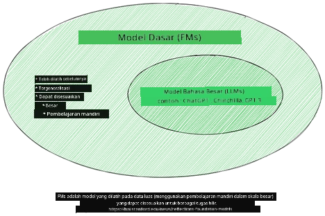

Sumber gambar: [Essential Guide to Foundation Models and Large Language Models | oleh Babar M Bhatti | Medium
](https://thebabar.medium.com/essential-guide-to-foundation-models-and-large-language-models-27dab58f7404)

Untuk memperjelas perbedaan ini, mari kita ambil ChatGPT sebagai contoh historis. Versi awal ChatGPT menggunakan GPT-3.5 sebagai foundation model. OpenAI kemudian menggunakan data khusus chat dan teknik alignment untuk membuat versi yang disetel yang berkinerja lebih baik dalam skenario percakapan, seperti chatbot. Layanan AI modern sering mengarah ke beberapa varian model, jadi nama layanan dan nama model di bawahnya tidak selalu sama.

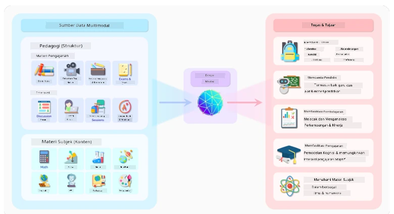

Sumber gambar: [2108.07258.pdf (arxiv.org)](https://arxiv.org/pdf/2108.07258.pdf?WT.mc_id=academic-105485-koreyst)

### Open-Weight/Open-Source versus Model Proprietary

Cara lain untuk mengkategorikan LLM adalah apakah mereka open-weight, open-source, atau proprietary.

Model open-source dan open-weight menyediakan artefak model untuk inspeksi, unduhan, atau kustomisasi, tetapi lisensinya berbeda-beda. Beberapa sepenuhnya open source, sementara yang lain adalah model open-weight dengan batasan penggunaan. Mereka berguna ketika bisnis membutuhkan kontrol lebih atas penerapan, lokalitas data, biaya, atau kustomisasi. Namun, tim tetap harus meninjau syarat lisensi, biaya layanan, pemeliharaan, pembaruan keamanan, dan kualitas evaluasi sebelum menggunakannya di produksi. Contohnya termasuk [Meta Llama 4](https://ai.meta.com/blog/llama-4-multimodal-intelligence/?WT.mc_id=academic-105485-koreyst), beberapa [model Mistral](https://docs.mistral.ai/models/overview?WT.mc_id=academic-105485-koreyst), dan banyak model yang dihosting di [Hugging Face](https://huggingface.co/models?WT.mc_id=academic-105485-koreyst).

Model proprietary dimiliki dan dihosting oleh penyedia. Model-model ini sering dioptimalkan untuk penggunaan produksi terkelola dan dapat menawarkan dukungan kuat, sistem keamanan, integrasi alat, dan skala. Namun, pelanggan biasanya tidak dapat memeriksa atau mengubah bobot model, dan harus meninjau persyaratan penyedia untuk privasi, retensi, kepatuhan, dan penggunaan yang dapat diterima. Contohnya termasuk [model OpenAI](https://platform.openai.com/docs/models?WT.mc_id=academic-105485-koreyst), [Google Gemini](https://deepmind.google/models/gemini/pro/?WT.mc_id=academic-105485-koreyst), dan [Anthropic Claude](https://platform.claude.com/docs/en/about-claude/models/overview?WT.mc_id=academic-105485-koreyst).

### Embedding versus Generasi Gambar versus Generasi Teks dan Kode

LLM juga dapat dikategorikan berdasarkan output yang mereka hasilkan.

Embedding adalah sekumpulan model yang dapat mengubah teks menjadi bentuk numerik, disebut embedding, yang merupakan representasi numerik dari teks input. Embedding memudahkan mesin memahami hubungan antar kata atau kalimat dan dapat digunakan sebagai input oleh model lain, seperti model klasifikasi, atau model klaster yang memiliki performa lebih baik pada data numerik. Model embedding sering digunakan untuk transfer learning, di mana sebuah model dibangun untuk tugas pengganti yang memiliki banyak data, lalu bobot model (embedding) digunakan kembali untuk tugas-bawah lainnya. Contohnya termasuk [OpenAI embeddings](https://platform.openai.com/docs/models/embeddings?WT.mc_id=academic-105485-koreyst).

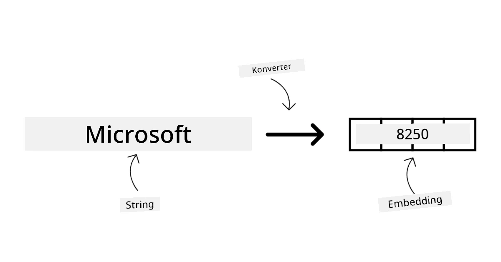

Model generasi gambar adalah model yang menghasilkan gambar. Model ini sering digunakan untuk pengeditan gambar, sintesis gambar, dan terjemahan gambar. Model generasi gambar sering dilatih pada dataset besar gambar, seperti [LAION-5B](https://laion.ai/blog/laion-5b/?WT.mc_id=academic-105485-koreyst), dan dapat digunakan untuk menghasilkan gambar baru atau mengedit gambar yang ada dengan teknik inpainting, super-resolution, dan pewarnaan. Contohnya termasuk [Model GPT Image](https://platform.openai.com/docs/guides/images?WT.mc_id=academic-105485-koreyst), [Model Stable Diffusion](https://github.com/Stability-AI/StableDiffusion?WT.mc_id=academic-105485-koreyst), dan model Imagen.

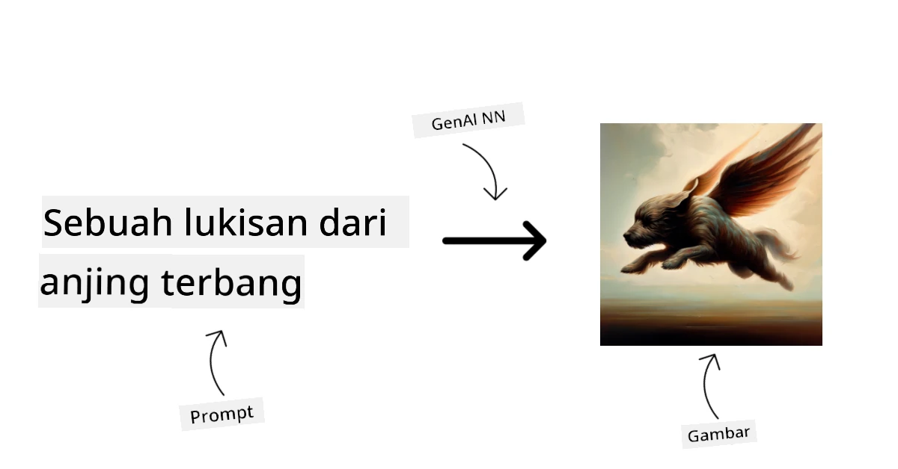

Model generasi teks dan kode adalah model yang menghasilkan teks atau kode. Model ini sering digunakan untuk rangkuman teks, penerjemahan, dan menjawab pertanyaan. Model generasi teks sering dilatih pada dataset besar teks, seperti [BookCorpus](https://www.cv-foundation.org/openaccess/content_iccv_2015/html/Zhu_Aligning_Books_and_ICCV_2015_paper.html?WT.mc_id=academic-105485-koreyst), dan dapat digunakan untuk menghasilkan teks baru, atau menjawab pertanyaan. Model generasi kode, seperti [CodeParrot](https://huggingface.co/codeparrot?WT.mc_id=academic-105485-koreyst), sering dilatih pada dataset besar kode, seperti GitHub, dan dapat digunakan untuk menghasilkan kode baru, atau memperbaiki bug dalam kode yang ada.

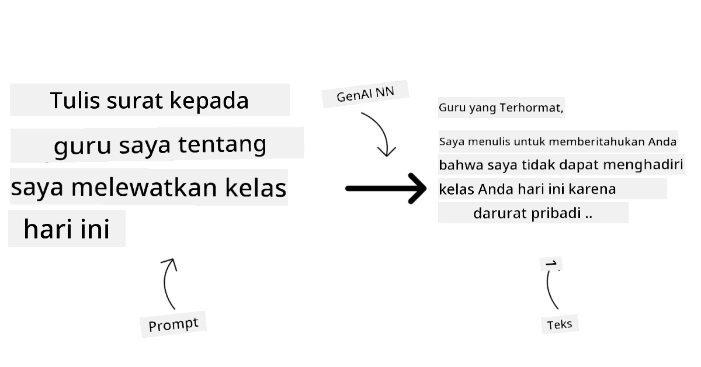

### Encoder-Decoder versus Decoder-only

Untuk membahas berbagai jenis arsitektur LLM, mari gunakan sebuah analogi.

Bayangkan manajer Anda memberi tugas menulis kuis untuk para siswa. Anda memiliki dua rekan kerja; satu mengawasi pembuatan konten dan yang lain mengawasi peninjauannya.

Pembuat kontennya seperti model hanya decoder: mereka dapat melihat topik, melihat apa yang sudah Anda tulis, lalu melanjutkan menghasilkan konten berdasarkan konteks itu. Mereka sangat baik dalam menulis konten yang menarik dan informatif, namun tidak selalu pilihan terbaik ketika tugas hanya mengklasifikasikan, mengambil, atau mengenkode informasi. Contoh keluarga model decoder-only termasuk model GPT dan Llama.

Peninjau seperti model hanya encoder, mereka melihat pelajaran yang ditulis dan jawaban, memperhatikan hubungan di antara keduanya serta memahami konteks, namun mereka tidak pandai menghasilkan konten. Contoh model hanya encoder adalah BERT.

Bayangkan kita juga memiliki seseorang yang bisa membuat sekaligus meninjau kuis, ini adalah model Encoder-Decoder. Beberapa contoh adalah BART dan T5.

### Layanan versus Model

Sekarang, mari kita bahas perbedaan antara layanan dan model. Layanan adalah produk yang ditawarkan oleh Penyedia Layanan Cloud, dan sering kali merupakan gabungan dari model, data, dan komponen lain. Model adalah komponen inti dari layanan, dan sering kali berupa foundation model, seperti LLM.

Layanan biasanya dioptimalkan untuk penggunaan produksi dan sering kali lebih mudah digunakan daripada model, melalui antarmuka pengguna grafis. Namun, layanan tidak selalu tersedia gratis, dan mungkin memerlukan langganan atau pembayaran untuk digunakan, sebagai imbalan atas pemanfaatan perangkat dan sumber daya pemilik layanan, mengoptimalkan biaya dan skala dengan mudah. Contoh layanan adalah [Azure OpenAI Service](https://learn.microsoft.com/azure/ai-services/openai/overview?WT.mc_id=academic-105485-koreyst), yang menawarkan rencana tarif bayar sesuai pemakaian, artinya pengguna dikenai biaya sebanding dengan pemakaian layanan. Azure OpenAI Service juga menawarkan keamanan kelas perusahaan dan kerangka kerja AI yang bertanggung jawab di atas kemampuan model.

Model adalah artefak jaringan saraf: parameter, bobot, arsitektur, tokenizer, dan konfigurasi pendukung. Menjalankan model secara lokal atau di lingkungan privat memerlukan perangkat keras yang sesuai, infrastruktur layanan, pemantauan, dan lisensi open-source/open-weight kompatibel atau lisensi komersial. Model open-weight seperti Llama 4 atau model Mistral dapat dihosting sendiri, tetapi masih memerlukan tenaga komputasi dan keahlian operasional.

## Cara menguji dan mengulangi dengan model berbeda untuk memahami performa di Azure

Setelah tim kami mengeksplorasi lanskap LLM saat ini dan mengidentifikasi beberapa kandidat bagus untuk skenario mereka, langkah berikutnya adalah mengujinya pada data mereka dan pada beban kerja mereka. Ini adalah proses iteratif, dilakukan melalui eksperimen dan pengukuran.
Sebagian besar model yang kami sebutkan di paragraf sebelumnya (model OpenAI, model open-weight seperti Llama 4 dan Mistral, serta model Hugging Face) tersedia di [Microsoft Foundry Models](https://learn.microsoft.com/azure/foundry/concepts/foundry-models-overview?WT.mc_id=academic-105485-koreyst).

[Microsoft Foundry](https://learn.microsoft.com/azure/foundry/what-is-foundry?WT.mc_id=academic-105485-koreyst), sebelumnya Azure AI Studio/Azure AI Foundry, adalah platform Azure terpadu untuk membangun aplikasi dan agen AI. Ini membantu pengembang mengelola siklus hidup mulai dari eksperimen dan evaluasi hingga penerapan, pemantauan, dan tata kelola. Katalog model di Microsoft Foundry memungkinkan pengguna untuk:

- Menemukan model dasar yang diminati dalam katalog, termasuk model yang dijual oleh Azure dan model dari mitra serta penyedia komunitas. Pengguna dapat memfilter berdasarkan tugas, penyedia, lisensi, opsi penerapan, atau nama.

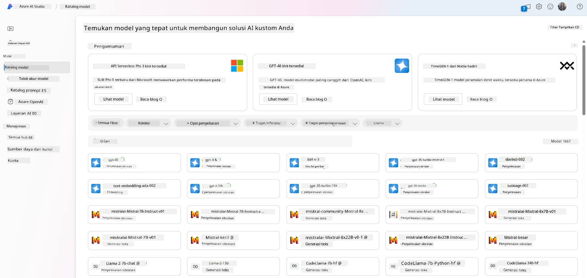

- Meninjau kartu model, termasuk deskripsi rinci tentang penggunaan yang dimaksudkan dan data pelatihan, contoh kode dan hasil evaluasi pada perpustakaan evaluasi internal.

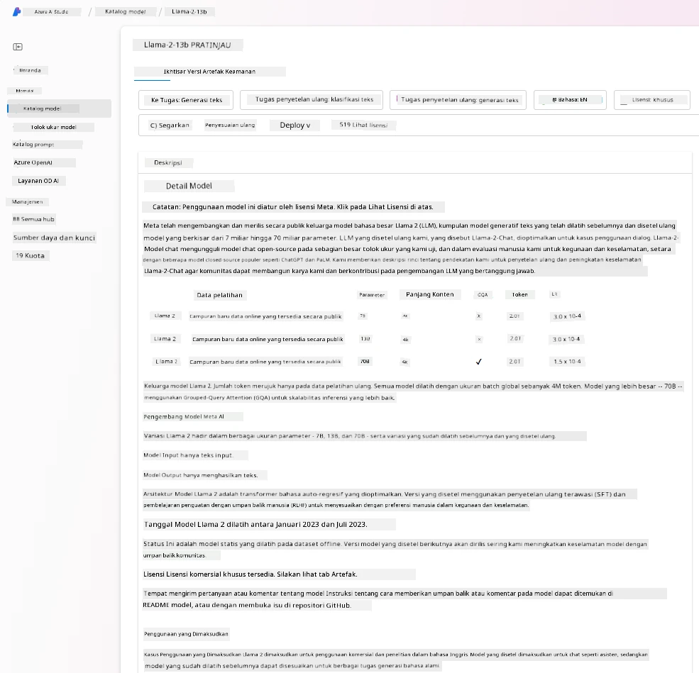

- Membandingkan tolok ukur di berbagai model dan dataset yang tersedia di industri untuk menilai mana yang memenuhi skenario bisnis, melalui panel [Model Benchmarks](https://learn.microsoft.com/azure/ai-studio/how-to/model-benchmarks?WT.mc_id=academic-105485-koreyst).

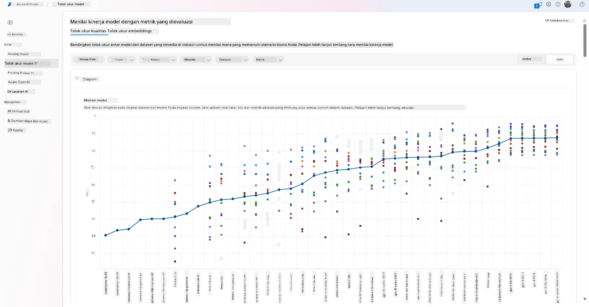

- Melakukan fine-tune pada model yang didukung dengan data pelatihan khusus untuk meningkatkan kinerja model dalam beban kerja tertentu, memanfaatkan kemampuan eksperimen dan pelacakan Microsoft Foundry.

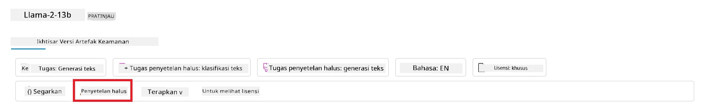

- Menerapkan model asli yang sudah dilatih sebelumnya atau versi fine-tuned ke endpoint inferensi waktu nyata jarak jauh, menggunakan opsi komputasi terkelola atau serverless, agar aplikasi dapat mengonsumsinya.

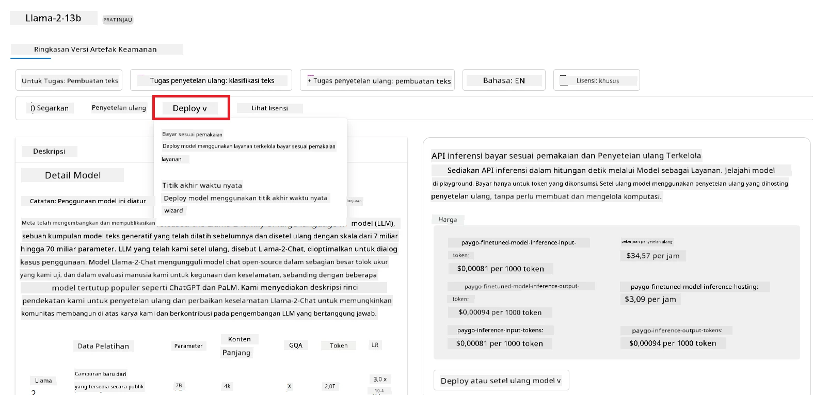

> [!NOTE]
> Tidak semua model dalam katalog saat ini tersedia untuk fine-tuning dan/atau penerapan bayar sesuai penggunaan. Periksa kartu model untuk rincian kemampuan dan keterbatasan model tersebut.

## Meningkatkan hasil LLM

Kami telah mengeksplorasi dengan tim startup kami berbagai jenis LLM dan sebuah platform cloud (Microsoft Foundry) yang memungkinkan kami membandingkan berbagai model, mengevaluasi pada data uji, meningkatkan kinerja, dan menerapkannya pada endpoint inferensi.

Tetapi kapan mereka harus mempertimbangkan untuk melakukan fine-tuning sebuah model daripada menggunakan model yang sudah dilatih sebelumnya? Apakah ada pendekatan lain untuk meningkatkan kinerja model pada beban kerja tertentu?

Ada beberapa pendekatan yang dapat digunakan bisnis untuk mendapatkan hasil yang mereka butuhkan dari sebuah LLM. Anda dapat memilih jenis model yang berbeda dengan tingkat pelatihan berbeda saat menerapkan LLM di produksi, dengan tingkat kompleksitas, biaya, dan kualitas yang berbeda. Berikut beberapa pendekatan yang berbeda:

- **Prompt engineering dengan konteks**. Idinya adalah memberikan konteks yang cukup saat Anda memberikan perintah (prompt) untuk memastikan Anda mendapatkan respons yang Anda butuhkan.

- **Retrieval Augmented Generation, RAG**. Data Anda mungkin ada di database atau endpoint web misalnya, untuk memastikan data ini, atau subsetnya, disertakan saat pemberian perintah, Anda dapat mengambil data relevan dan menjadikannya bagian dari prompt pengguna.

- **Model fine-tuned**. Di sini, Anda melatih model lebih lanjut dengan data Anda sendiri yang membuat model menjadi lebih tepat dan responsif terhadap kebutuhan Anda tetapi mungkin lebih mahal.

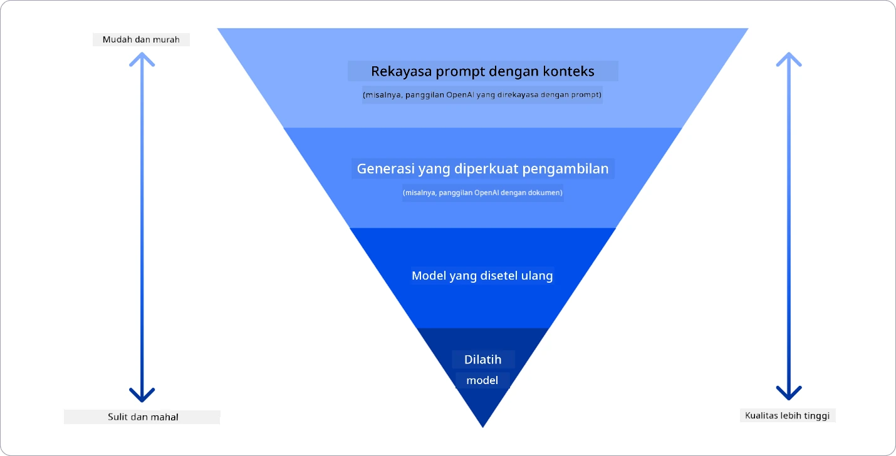

Sumber gambar: [Four Ways that Enterprises Deploy LLMs | Fiddler AI Blog](https://www.fiddler.ai/blog/four-ways-that-enterprises-deploy-llms?WT.mc_id=academic-105485-koreyst)

### Prompt Engineering dengan Konteks

LLM pra-latih bekerja sangat baik pada tugas bahasa alami umum, bahkan dengan hanya memanggilnya menggunakan prompt singkat, seperti kalimat untuk diselesaikan atau sebuah pertanyaan – yang disebut pembelajaran “zero-shot”.

Namun, semakin banyak pengguna membingkai kueri mereka, dengan permintaan yang terperinci dan contoh – yaitu Konteks – maka semakin akurat dan mendekati harapan pengguna jawaban yang diberikan. Dalam kasus ini, kita bicara tentang pembelajaran “one-shot” jika prompt hanya mencakup satu contoh dan “few-shot learning” jika mencakup beberapa contoh.
Prompt engineering dengan konteks adalah pendekatan yang paling efektif biaya untuk memulai.

### Retrieval Augmented Generation (RAG)

LLM memiliki keterbatasan bahwa mereka hanya dapat menggunakan data yang telah digunakan selama pelatihan untuk menghasilkan jawaban. Ini berarti mereka tidak mengetahui fakta yang terjadi setelah proses pelatihan, dan mereka tidak dapat mengakses informasi non-publik (seperti data perusahaan).
Ini dapat diatasi melalui RAG, sebuah teknik yang memperkaya prompt dengan data eksternal dalam bentuk potongan dokumen, dengan memperhatikan batas panjang prompt. Teknik ini didukung oleh alat basis data Vektor (seperti [Azure Vector Search](https://learn.microsoft.com/azure/search/vector-search-overview?WT.mc_id=academic-105485-koreyst)) yang mengambil potongan berguna dari berbagai sumber data yang telah ditentukan dan menambahkannya ke Konteks prompt.

Teknik ini sangat membantu ketika sebuah bisnis tidak memiliki cukup data, waktu, atau sumber daya untuk melakukan fine-tune pada LLM, namun tetap ingin meningkatkan kinerja pada beban kerja tertentu dan mengurangi risiko jawaban yang mengada-ada, usang, atau tidak didukung.

### Model fine-tuned

Fine-tuning adalah proses yang memanfaatkan pembelajaran transfer untuk ‘mengadaptasi’ model ke tugas hilir atau untuk menyelesaikan masalah spesifik. Berbeda dari few-shot learning dan RAG, ini menghasilkan model baru yang dihasilkan, dengan bobot dan bias yang diperbarui. Ini membutuhkan set contoh pelatihan yang terdiri dari satu input (prompt) dan output terkait (penyelesaian).
Ini akan menjadi pendekatan yang diutamakan jika:

- **Menggunakan model spesifik tugas yang lebih kecil**. Sebuah bisnis ingin melakukan fine-tune pada model yang lebih kecil untuk tugas sempit daripada terus-menerus memberikan prompt pada model frontier besar, menghasilkan solusi yang lebih cost-effective dan lebih cepat.

- **Mempertimbangkan latensi**. Latensi penting untuk kasus penggunaan tertentu, sehingga tidak memungkinkan menggunakan prompt yang sangat panjang atau jumlah contoh yang harus dipelajari model tidak sesuai dengan batas panjang prompt.

- **Mengadaptasi perilaku stabil**. Sebuah bisnis memiliki banyak contoh berkualitas tinggi dan ingin model secara konsisten mengikuti pola tugas, format output, nada suara, atau gaya domain spesifik. Jika masalah utama adalah fakta terbaru atau pengetahuan privat yang sering berubah, gunakan RAG daripada hanya mengandalkan fine-tuning.

### Model dilatih dari awal

Melatih LLM dari awal tanpa diragukan lagi adalah pendekatan paling sulit dan paling kompleks untuk diterapkan, membutuhkan data dalam jumlah besar, sumber daya terampil, dan daya komputasi yang memadai. Opsi ini sebaiknya dipertimbangkan hanya dalam skenario di mana bisnis memiliki kasus penggunaan domain-spesifik dan data domain-sentris yang besar.

## Pemeriksaan Pengetahuan

Apa pendekatan yang baik untuk meningkatkan hasil penyelesaian LLM?

1. Prompt engineering dengan konteks
1. RAG
1. Model fine-tuned

A: Ketiganya dapat membantu. Mulailah dengan prompt engineering dan konteks untuk perbaikan cepat, dan gunakan RAG ketika model membutuhkan fakta terkini atau data bisnis privat. Pilih fine-tuning saat Anda memiliki cukup contoh berkualitas tinggi dan membutuhkan model untuk secara konsisten mengikuti pola tugas, format, nada, atau domain.

## 🚀 Tantangan

Baca lebih lanjut tentang bagaimana Anda dapat [menggunakan RAG](https://learn.microsoft.com/azure/search/retrieval-augmented-generation-overview?WT.mc_id=academic-105485-koreyst) untuk bisnis Anda.

## Kerja Bagus, Lanjutkan Pembelajaran Anda

Setelah menyelesaikan pelajaran ini, cek koleksi [Pembelajaran AI Generatif kami](https://aka.ms/genai-collection?WT.mc_id=academic-105485-koreyst) untuk melanjutkan peningkatan pengetahuan AI Generatif Anda!

Pergi ke Pelajaran 3 di mana kita akan melihat bagaimana [membangun dengan AI Generatif secara Bertanggung Jawab](../03-using-generative-ai-responsibly/README.md?WT.mc_id=academic-105485-koreyst)!

---

<!-- CO-OP TRANSLATOR DISCLAIMER START -->
**Penafian**:
Dokumen ini telah diterjemahkan menggunakan layanan terjemahan AI [Co-op Translator](https://github.com/Azure/co-op-translator). Meskipun kami berupaya untuk mencapai akurasi, harap diketahui bahwa terjemahan otomatis mungkin mengandung kesalahan atau ketidakakuratan. Dokumen asli dalam bahasa aslinya harus dianggap sebagai sumber yang sah. Untuk informasi penting, disarankan menggunakan terjemahan profesional oleh manusia. Kami tidak bertanggung jawab atas kesalahpahaman atau penafsiran yang keliru yang timbul dari penggunaan terjemahan ini.
<!-- CO-OP TRANSLATOR DISCLAIMER END -->