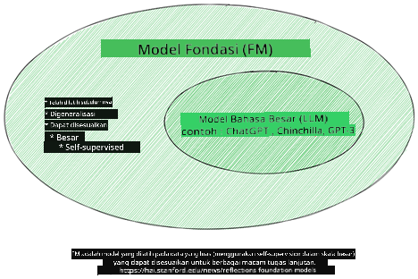
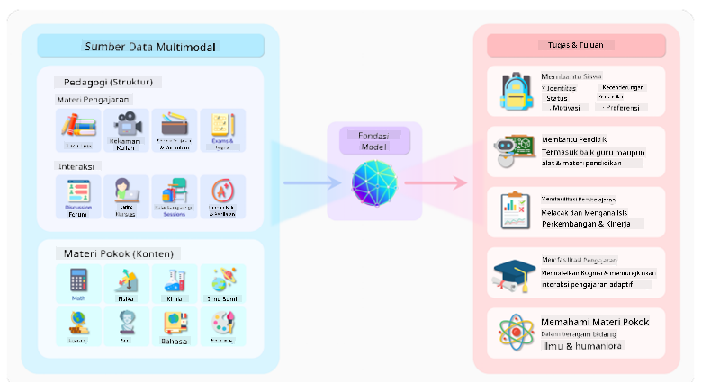
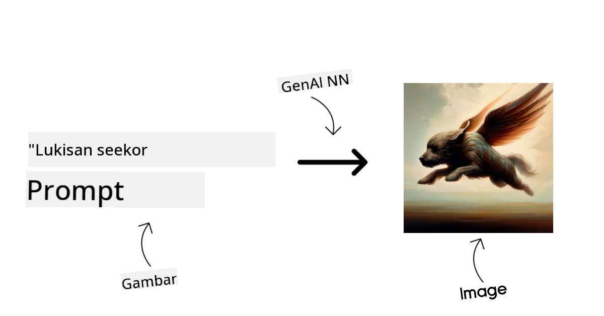
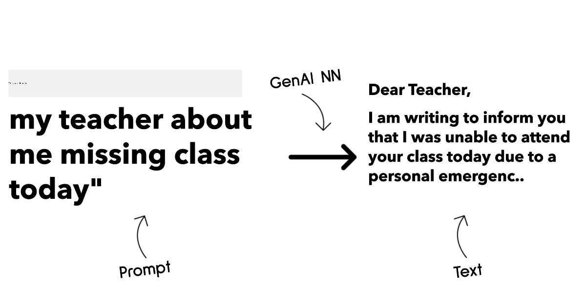
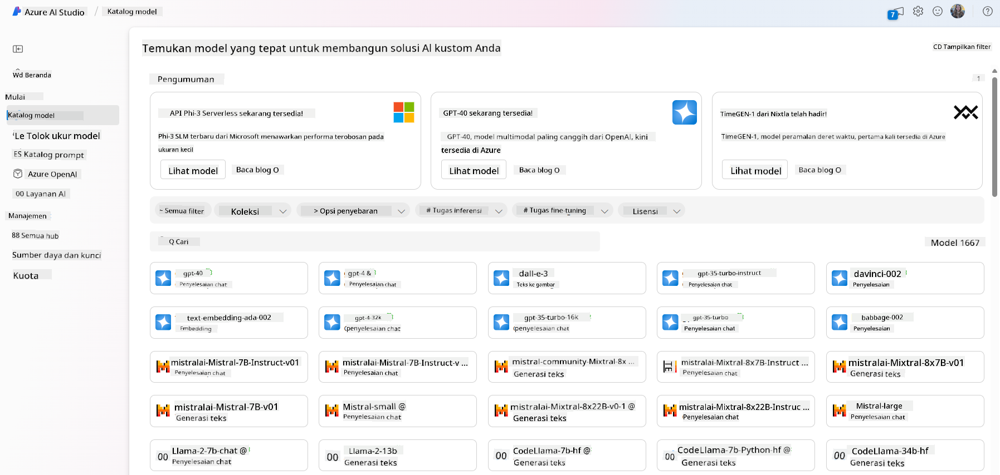

<!--
CO_OP_TRANSLATOR_METADATA:
{
  "original_hash": "6b7629b8ee4d7d874a27213e903d86a7",
  "translation_date": "2025-10-17T20:45:19+00:00",
  "source_file": "02-exploring-and-comparing-different-llms/README.md",
  "language_code": "id"
}
-->
# Menjelajahi dan Membandingkan Berbagai LLM

> _Klik gambar di atas untuk menonton video pelajaran ini_

Pada pelajaran sebelumnya, kita telah melihat bagaimana AI Generatif mengubah lanskap teknologi, bagaimana Model Bahasa Besar (LLM) bekerja, dan bagaimana sebuah bisnis - seperti startup kita - dapat menerapkannya pada kasus penggunaan mereka dan berkembang! Dalam bab ini, kita akan membandingkan dan mengontraskan berbagai jenis model bahasa besar (LLM) untuk memahami kelebihan dan kekurangannya.

Langkah berikutnya dalam perjalanan startup kita adalah menjelajahi lanskap LLM saat ini dan memahami mana yang cocok untuk kasus penggunaan kita.

## Pendahuluan

Pelajaran ini akan mencakup:

- Berbagai jenis LLM dalam lanskap saat ini.
- Menguji, mengiterasi, dan membandingkan berbagai model untuk kasus penggunaan Anda di Azure.
- Cara menerapkan LLM.

## Tujuan Pembelajaran

Setelah menyelesaikan pelajaran ini, Anda akan dapat:

- Memilih model yang tepat untuk kasus penggunaan Anda.
- Memahami cara menguji, mengiterasi, dan meningkatkan kinerja model Anda.
- Mengetahui bagaimana bisnis menerapkan model.

## Memahami Berbagai Jenis LLM

LLM dapat dikategorikan berdasarkan arsitektur, data pelatihan, dan kasus penggunaannya. Memahami perbedaan ini akan membantu startup kita memilih model yang tepat untuk skenario tersebut, serta memahami cara menguji, mengiterasi, dan meningkatkan kinerja.

Ada banyak jenis model LLM, pilihan Anda bergantung pada tujuan penggunaannya, data Anda, berapa banyak yang siap Anda bayar, dan lainnya.

Bergantung pada apakah Anda ingin menggunakan model untuk teks, audio, video, generasi gambar, dan sebagainya, Anda mungkin memilih jenis model yang berbeda.

- **Pengakuan audio dan ucapan**. Untuk tujuan ini, model tipe Whisper adalah pilihan yang bagus karena bersifat serbaguna dan ditujukan untuk pengakuan ucapan. Model ini dilatih pada audio yang beragam dan dapat melakukan pengakuan ucapan multibahasa. Pelajari lebih lanjut tentang [model tipe Whisper di sini](https://platform.openai.com/docs/models/whisper?WT.mc_id=academic-105485-koreyst).

- **Generasi gambar**. Untuk generasi gambar, DALL-E dan Midjourney adalah dua pilihan yang sangat terkenal. DALL-E ditawarkan oleh Azure OpenAI. [Baca lebih lanjut tentang DALL-E di sini](https://platform.openai.com/docs/models/dall-e?WT.mc_id=academic-105485-koreyst) dan juga di Bab 9 dari kurikulum ini.

- **Generasi teks**. Sebagian besar model dilatih untuk generasi teks dan Anda memiliki banyak pilihan dari GPT-3.5 hingga GPT-4. Mereka hadir dengan biaya yang berbeda, dengan GPT-4 menjadi yang paling mahal. Ada baiknya melihat [Azure OpenAI playground](https://oai.azure.com/portal/playground?WT.mc_id=academic-105485-koreyst) untuk mengevaluasi model mana yang paling sesuai dengan kebutuhan Anda dalam hal kemampuan dan biaya.

- **Multi-modalitas**. Jika Anda ingin menangani berbagai jenis data dalam input dan output, Anda mungkin ingin melihat model seperti [gpt-4 turbo dengan vision atau gpt-4o](https://learn.microsoft.com/azure/ai-services/openai/concepts/models#gpt-4-and-gpt-4-turbo-models?WT.mc_id=academic-105485-koreyst) - rilis terbaru dari model OpenAI - yang mampu menggabungkan pemrosesan bahasa alami dengan pemahaman visual, memungkinkan interaksi melalui antarmuka multi-modal.

Memilih model berarti Anda mendapatkan beberapa kemampuan dasar, yang mungkin tidak cukup. Sering kali Anda memiliki data spesifik perusahaan yang perlu Anda sampaikan kepada LLM. Ada beberapa pilihan berbeda tentang cara mendekati hal ini, lebih lanjut tentang itu di bagian berikutnya.

### Model Dasar versus LLM

Istilah Model Dasar [diciptakan oleh peneliti Stanford](https://arxiv.org/abs/2108.07258?WT.mc_id=academic-105485-koreyst) dan didefinisikan sebagai model AI yang mengikuti beberapa kriteria, seperti:

- **Dilatih menggunakan pembelajaran tanpa pengawasan atau pembelajaran mandiri**, artinya dilatih pada data multi-modal yang tidak berlabel, dan tidak memerlukan anotasi atau pelabelan data oleh manusia untuk proses pelatihannya.
- **Model yang sangat besar**, berdasarkan jaringan saraf yang sangat dalam yang dilatih pada miliaran parameter.
- **Biasanya dimaksudkan untuk menjadi 'dasar' bagi model lain**, artinya dapat digunakan sebagai titik awal untuk membangun model lain di atasnya, yang dapat dilakukan dengan penyesuaian lebih lanjut.

Sumber gambar: [Panduan Penting untuk Model Dasar dan Model Bahasa Besar | oleh Babar M Bhatti | Medium
](https://thebabar.medium.com/essential-guide-to-foundation-models-and-large-language-models-27dab58f7404)

Untuk memperjelas perbedaan ini, mari kita ambil ChatGPT sebagai contoh. Untuk membangun versi pertama ChatGPT, model yang disebut GPT-3.5 berfungsi sebagai model dasar. Ini berarti bahwa OpenAI menggunakan beberapa data spesifik percakapan untuk membuat versi GPT-3.5 yang disesuaikan dan dioptimalkan untuk berkinerja baik dalam skenario percakapan, seperti chatbot.

Sumber gambar: [2108.07258.pdf (arxiv.org)](https://arxiv.org/pdf/2108.07258.pdf?WT.mc_id=academic-105485-koreyst)

### Model Sumber Terbuka versus Proprietary

Cara lain untuk mengkategorikan LLM adalah apakah mereka bersifat sumber terbuka atau proprietary.

Model sumber terbuka adalah model yang tersedia untuk umum dan dapat digunakan oleh siapa saja. Model ini sering kali disediakan oleh perusahaan yang menciptakannya, atau oleh komunitas penelitian. Model ini dapat diperiksa, dimodifikasi, dan disesuaikan untuk berbagai kasus penggunaan dalam LLM. Namun, model ini tidak selalu dioptimalkan untuk penggunaan produksi, dan mungkin tidak sebaik model proprietary. Selain itu, pendanaan untuk model sumber terbuka bisa terbatas, dan mungkin tidak dipelihara dalam jangka panjang atau tidak diperbarui dengan penelitian terbaru. Contoh model sumber terbuka yang populer termasuk [Alpaca](https://crfm.stanford.edu/2023/03/13/alpaca.html?WT.mc_id=academic-105485-koreyst), [Bloom](https://huggingface.co/bigscience/bloom) dan [LLaMA](https://llama.meta.com).

Model proprietary adalah model yang dimiliki oleh perusahaan dan tidak tersedia untuk umum. Model ini sering kali dioptimalkan untuk penggunaan produksi. Namun, model ini tidak dapat diperiksa, dimodifikasi, atau disesuaikan untuk berbagai kasus penggunaan. Selain itu, model ini tidak selalu tersedia secara gratis, dan mungkin memerlukan langganan atau pembayaran untuk digunakan. Pengguna juga tidak memiliki kendali atas data yang digunakan untuk melatih model, yang berarti mereka harus mempercayai pemilik model untuk memastikan komitmen terhadap privasi data dan penggunaan AI yang bertanggung jawab. Contoh model proprietary yang populer termasuk [model OpenAI](https://platform.openai.com/docs/models/overview?WT.mc_id=academic-105485-koreyst), [Google Bard](https://sapling.ai/llm/bard?WT.mc_id=academic-105485-koreyst) atau [Claude 2](https://www.anthropic.com/index/claude-2?WT.mc_id=academic-105485-koreyst).

### Embedding versus Generasi Gambar versus Generasi Teks dan Kode

LLM juga dapat dikategorikan berdasarkan output yang dihasilkan.

Embedding adalah serangkaian model yang dapat mengubah teks menjadi bentuk numerik, yang disebut embedding, yaitu representasi numerik dari teks input. Embedding mempermudah mesin untuk memahami hubungan antara kata atau kalimat dan dapat digunakan sebagai input oleh model lain, seperti model klasifikasi atau model pengelompokan yang memiliki kinerja lebih baik pada data numerik. Model embedding sering digunakan untuk pembelajaran transfer, di mana model dibangun untuk tugas pengganti yang memiliki banyak data, dan kemudian bobot model (embedding) digunakan kembali untuk tugas-tugas lain. Contoh kategori ini adalah [OpenAI embeddings](https://platform.openai.com/docs/models/embeddings?WT.mc_id=academic-105485-koreyst).

Model generasi gambar adalah model yang menghasilkan gambar. Model ini sering digunakan untuk pengeditan gambar, sintesis gambar, dan terjemahan gambar. Model generasi gambar sering dilatih pada dataset besar gambar, seperti [LAION-5B](https://laion.ai/blog/laion-5b/?WT.mc_id=academic-105485-koreyst), dan dapat digunakan untuk menghasilkan gambar baru atau mengedit gambar yang ada dengan teknik inpainting, super-resolution, dan colorization. Contoh termasuk [DALL-E-3](https://openai.com/dall-e-3?WT.mc_id=academic-105485-koreyst) dan [Stable Diffusion models](https://github.com/Stability-AI/StableDiffusion?WT.mc_id=academic-105485-koreyst).

Model generasi teks dan kode adalah model yang menghasilkan teks atau kode. Model ini sering digunakan untuk ringkasan teks, terjemahan, dan menjawab pertanyaan. Model generasi teks sering dilatih pada dataset besar teks, seperti [BookCorpus](https://www.cv-foundation.org/openaccess/content_iccv_2015/html/Zhu_Aligning_Books_and_ICCV_2015_paper.html?WT.mc_id=academic-105485-koreyst), dan dapat digunakan untuk menghasilkan teks baru, atau menjawab pertanyaan. Model generasi kode, seperti [CodeParrot](https://huggingface.co/codeparrot?WT.mc_id=academic-105485-koreyst), sering dilatih pada dataset besar kode, seperti GitHub, dan dapat digunakan untuk menghasilkan kode baru, atau memperbaiki bug dalam kode yang ada.

### Encoder-Decoder versus Decoder-only

Untuk membahas berbagai jenis arsitektur LLM, mari gunakan analogi.

Bayangkan manajer Anda memberi Anda tugas untuk menulis kuis untuk siswa. Anda memiliki dua rekan kerja; satu bertugas membuat konten dan yang lainnya bertugas meninjau konten tersebut.

Pembuat konten seperti model Decoder-only, mereka dapat melihat topik dan apa yang sudah Anda tulis, lalu menulis kursus berdasarkan itu. Mereka sangat baik dalam menulis konten yang menarik dan informatif, tetapi tidak terlalu baik dalam memahami topik dan tujuan pembelajaran. Beberapa contoh model Decoder adalah model keluarga GPT, seperti GPT-3.

Peninjau seperti model Encoder-only, mereka melihat kursus yang ditulis dan jawabannya, memperhatikan hubungan di antara mereka dan memahami konteks, tetapi mereka tidak baik dalam menghasilkan konten. Contoh model Encoder-only adalah BERT.

Bayangkan kita juga memiliki seseorang yang dapat membuat dan meninjau kuis, ini adalah model Encoder-Decoder. Beberapa contohnya adalah BART dan T5.

### Layanan versus Model

Sekarang, mari kita bahas perbedaan antara layanan dan model. Layanan adalah produk yang ditawarkan oleh Penyedia Layanan Cloud, dan sering kali merupakan kombinasi dari model, data, dan komponen lainnya. Model adalah komponen inti dari layanan, dan sering kali merupakan model dasar, seperti LLM.

Layanan sering dioptimalkan untuk penggunaan produksi dan sering kali lebih mudah digunakan daripada model, melalui antarmuka pengguna grafis. Namun, layanan tidak selalu tersedia secara gratis, dan mungkin memerlukan langganan atau pembayaran untuk digunakan, sebagai imbalan atas pemanfaatan peralatan dan sumber daya pemilik layanan, pengoptimalan biaya, dan skalabilitas yang mudah. Contoh layanan adalah [Azure OpenAI Service](https://learn.microsoft.com/azure/ai-services/openai/overview?WT.mc_id=academic-105485-koreyst), yang menawarkan rencana tarif pay-as-you-go, artinya pengguna dikenakan biaya secara proporsional dengan seberapa banyak mereka menggunakan layanan tersebut. Selain itu, Azure OpenAI Service menawarkan keamanan tingkat perusahaan dan kerangka kerja AI yang bertanggung jawab di atas kemampuan model.

Model hanyalah Jaringan Saraf, dengan parameter, bobot, dan lainnya. Memungkinkan perusahaan untuk menjalankan secara lokal, namun, akan membutuhkan pembelian peralatan, membangun struktur untuk skalabilitas, dan membeli lisensi atau menggunakan model sumber terbuka. Model seperti LLaMA tersedia untuk digunakan, membutuhkan daya komputasi untuk menjalankan model.

## Cara Menguji dan Mengiterasi dengan Berbagai Model untuk Memahami Kinerja di Azure

Setelah tim kita menjelajahi lanskap LLM saat ini dan mengidentifikasi beberapa kandidat yang baik untuk skenario mereka, langkah berikutnya adalah menguji mereka pada data dan beban kerja mereka. Ini adalah proses iteratif, dilakukan melalui eksperimen dan pengukuran.
Sebagian besar model yang kami sebutkan dalam paragraf sebelumnya (model OpenAI, model open source seperti Llama2, dan Hugging Face transformers) tersedia di [Model Catalog](https://learn.microsoft.com/azure/ai-studio/how-to/model-catalog-overview?WT.mc_id=academic-105485-koreyst) di [Azure AI Studio](https://ai.azure.com/?WT.mc_id=academic-105485-koreyst).

[Azure AI Studio](https://learn.microsoft.com/azure/ai-studio/what-is-ai-studio?WT.mc_id=academic-105485-koreyst) adalah platform cloud yang dirancang untuk pengembang membangun aplikasi AI generatif dan mengelola seluruh siklus pengembangan - mulai dari eksperimen hingga evaluasi - dengan menggabungkan semua layanan Azure AI ke dalam satu hub dengan antarmuka grafis yang mudah digunakan. Model Catalog di Azure AI Studio memungkinkan pengguna untuk:

- Menemukan Foundation Model yang diinginkan dalam katalog - baik yang bersifat proprietary maupun open source, dengan memfilter berdasarkan tugas, lisensi, atau nama. Untuk meningkatkan pencarian, model-model ini diorganisasi ke dalam koleksi, seperti koleksi Azure OpenAI, koleksi Hugging Face, dan lainnya.

- Meninjau model card, termasuk deskripsi rinci tentang penggunaan yang dimaksudkan dan data pelatihan, contoh kode, serta hasil evaluasi pada pustaka evaluasi internal.

- Membandingkan benchmark antar model dan dataset yang tersedia di industri untuk menilai mana yang memenuhi skenario bisnis, melalui panel [Model Benchmarks](https://learn.microsoft.com/azure/ai-studio/how-to/model-benchmarks?WT.mc_id=academic-105485-koreyst).

- Melakukan fine-tuning pada model dengan data pelatihan khusus untuk meningkatkan kinerja model dalam beban kerja tertentu, memanfaatkan kemampuan eksperimen dan pelacakan dari Azure AI Studio.

- Mendeploy model pra-latih asli atau versi yang telah di-fine-tune ke inference real-time jarak jauh - managed compute - atau endpoint API tanpa server - [pay-as-you-go](https://learn.microsoft.com/azure/ai-studio/how-to/model-catalog-overview#model-deployment-managed-compute-and-serverless-api-pay-as-you-go?WT.mc_id=academic-105485-koreyst) - untuk memungkinkan aplikasi mengonsumsinya.

> [!NOTE]
> Tidak semua model dalam katalog saat ini tersedia untuk fine-tuning dan/atau deployment pay-as-you-go. Periksa model card untuk detail tentang kemampuan dan keterbatasan model.

## Meningkatkan Hasil LLM

Kami telah mengeksplorasi dengan tim startup kami berbagai jenis LLM dan platform cloud (Azure Machine Learning) yang memungkinkan kami membandingkan berbagai model, mengevaluasi mereka pada data uji, meningkatkan kinerja, dan mendeploy mereka pada endpoint inference.

Namun, kapan mereka harus mempertimbangkan untuk melakukan fine-tuning pada model daripada menggunakan model pra-latih? Apakah ada pendekatan lain untuk meningkatkan kinerja model pada beban kerja tertentu?

Ada beberapa pendekatan yang dapat digunakan bisnis untuk mendapatkan hasil yang mereka butuhkan dari LLM. Anda dapat memilih berbagai jenis model dengan tingkat pelatihan yang berbeda saat mendeploy LLM dalam produksi, dengan tingkat kompleksitas, biaya, dan kualitas yang berbeda. Berikut adalah beberapa pendekatan yang berbeda:

- **Prompt engineering dengan konteks**. Ide utamanya adalah memberikan cukup konteks saat Anda memberikan prompt untuk memastikan Anda mendapatkan respons yang Anda butuhkan.

- **Retrieval Augmented Generation, RAG**. Data Anda mungkin ada di database atau endpoint web, misalnya, untuk memastikan data ini, atau sebagian darinya, disertakan pada saat memberikan prompt, Anda dapat mengambil data yang relevan dan menjadikannya bagian dari prompt pengguna.

- **Model yang di-fine-tune**. Di sini, Anda melatih model lebih lanjut dengan data Anda sendiri yang membuat model menjadi lebih tepat dan responsif terhadap kebutuhan Anda, tetapi mungkin memerlukan biaya yang lebih besar.

Sumber gambar: [Four Ways that Enterprises Deploy LLMs | Fiddler AI Blog](https://www.fiddler.ai/blog/four-ways-that-enterprises-deploy-llms?WT.mc_id=academic-105485-koreyst)

### Prompt Engineering dengan Konteks

LLM pra-latih bekerja sangat baik pada tugas-tugas bahasa alami yang umum, bahkan dengan hanya memberikan prompt singkat, seperti kalimat untuk dilengkapi atau pertanyaan – yang disebut pembelajaran “zero-shot”.

Namun, semakin banyak pengguna dapat merumuskan pertanyaan mereka, dengan permintaan yang lebih rinci dan contoh – Konteks – semakin akurat dan sesuai dengan harapan pengguna jawaban yang akan diberikan. Dalam kasus ini, kita berbicara tentang pembelajaran “one-shot” jika prompt hanya mencakup satu contoh dan “few-shot learning” jika mencakup beberapa contoh. Prompt engineering dengan konteks adalah pendekatan yang paling hemat biaya untuk memulai.

### Retrieval Augmented Generation (RAG)

LLM memiliki keterbatasan bahwa mereka hanya dapat menggunakan data yang telah digunakan selama pelatihan mereka untuk menghasilkan jawaban. Ini berarti mereka tidak tahu apa pun tentang fakta yang terjadi setelah proses pelatihan mereka, dan mereka tidak dapat mengakses informasi non-publik (seperti data perusahaan). 

Hal ini dapat diatasi melalui RAG, sebuah teknik yang memperkuat prompt dengan data eksternal dalam bentuk potongan dokumen, dengan mempertimbangkan batas panjang prompt. Teknik ini didukung oleh alat database vektor (seperti [Azure Vector Search](https://learn.microsoft.com/azure/search/vector-search-overview?WT.mc_id=academic-105485-koreyst)) yang mengambil potongan-potongan yang berguna dari berbagai sumber data yang telah ditentukan sebelumnya dan menambahkannya ke Konteks prompt.

Teknik ini sangat membantu ketika sebuah bisnis tidak memiliki cukup data, waktu, atau sumber daya untuk melakukan fine-tuning pada LLM, tetapi tetap ingin meningkatkan kinerja pada beban kerja tertentu dan mengurangi risiko fabrikasi, yaitu mistifikasi realitas atau konten yang berbahaya.

### Model yang di-fine-tune

Fine-tuning adalah proses yang memanfaatkan transfer learning untuk ‘mengadaptasi’ model ke tugas lanjutan atau untuk menyelesaikan masalah tertentu. Berbeda dengan few-shot learning dan RAG, ini menghasilkan model baru yang dihasilkan, dengan bobot dan bias yang diperbarui. Proses ini membutuhkan serangkaian contoh pelatihan yang terdiri dari satu input (prompt) dan output terkaitnya (completion). 

Pendekatan ini akan menjadi pilihan yang disukai jika:

- **Menggunakan model yang di-fine-tune**. Sebuah bisnis ingin menggunakan model yang di-fine-tune dengan kemampuan lebih rendah (seperti model embedding) daripada model berkinerja tinggi, menghasilkan solusi yang lebih hemat biaya dan cepat.

- **Mempertimbangkan latensi**. Latensi penting untuk kasus penggunaan tertentu, sehingga tidak memungkinkan untuk menggunakan prompt yang sangat panjang atau jumlah contoh yang harus dipelajari oleh model tidak sesuai dengan batas panjang prompt.

- **Tetap terkini**. Sebuah bisnis memiliki banyak data berkualitas tinggi dan label kebenaran dasar serta sumber daya yang diperlukan untuk menjaga data ini tetap terkini dari waktu ke waktu.

### Model yang Dilatih

Melatih LLM dari awal tanpa diragukan lagi adalah pendekatan yang paling sulit dan paling kompleks untuk diadopsi, membutuhkan jumlah data yang sangat besar, sumber daya yang terampil, dan daya komputasi yang sesuai. Opsi ini hanya boleh dipertimbangkan dalam skenario di mana sebuah bisnis memiliki kasus penggunaan spesifik domain dan sejumlah besar data yang berpusat pada domain.

## Uji Pengetahuan

Apa pendekatan yang baik untuk meningkatkan hasil penyelesaian LLM?

1. Prompt engineering dengan konteks  
1. RAG  
1. Model yang di-fine-tune  

A:3, jika Anda memiliki waktu, sumber daya, dan data berkualitas tinggi, fine-tuning adalah pilihan yang lebih baik untuk tetap terkini. Namun, jika Anda ingin meningkatkan hasil tetapi kekurangan waktu, ada baiknya mempertimbangkan RAG terlebih dahulu.

## 🚀 Tantangan

Pelajari lebih lanjut tentang bagaimana Anda dapat [menggunakan RAG](https://learn.microsoft.com/azure/search/retrieval-augmented-generation-overview?WT.mc_id=academic-105485-koreyst) untuk bisnis Anda.

## Kerja Bagus, Lanjutkan Pembelajaran Anda

Setelah menyelesaikan pelajaran ini, lihat [koleksi pembelajaran AI Generatif kami](https://aka.ms/genai-collection?WT.mc_id=academic-105485-koreyst) untuk terus meningkatkan pengetahuan Anda tentang AI Generatif!

Lanjutkan ke Pelajaran 3 di mana kita akan melihat bagaimana [membangun dengan AI Generatif secara Bertanggung Jawab](../03-using-generative-ai-responsibly/README.md?WT.mc_id=academic-105485-koreyst)!

---

**Penafian**:  
Dokumen ini telah diterjemahkan menggunakan layanan penerjemahan AI [Co-op Translator](https://github.com/Azure/co-op-translator). Meskipun kami berusaha untuk memberikan hasil yang akurat, harap diperhatikan bahwa terjemahan otomatis dapat mengandung kesalahan atau ketidakakuratan. Dokumen asli dalam bahasa aslinya harus dianggap sebagai sumber yang otoritatif. Untuk informasi yang bersifat kritis, disarankan menggunakan jasa penerjemahan manusia profesional. Kami tidak bertanggung jawab atas kesalahpahaman atau interpretasi yang salah yang timbul dari penggunaan terjemahan ini.