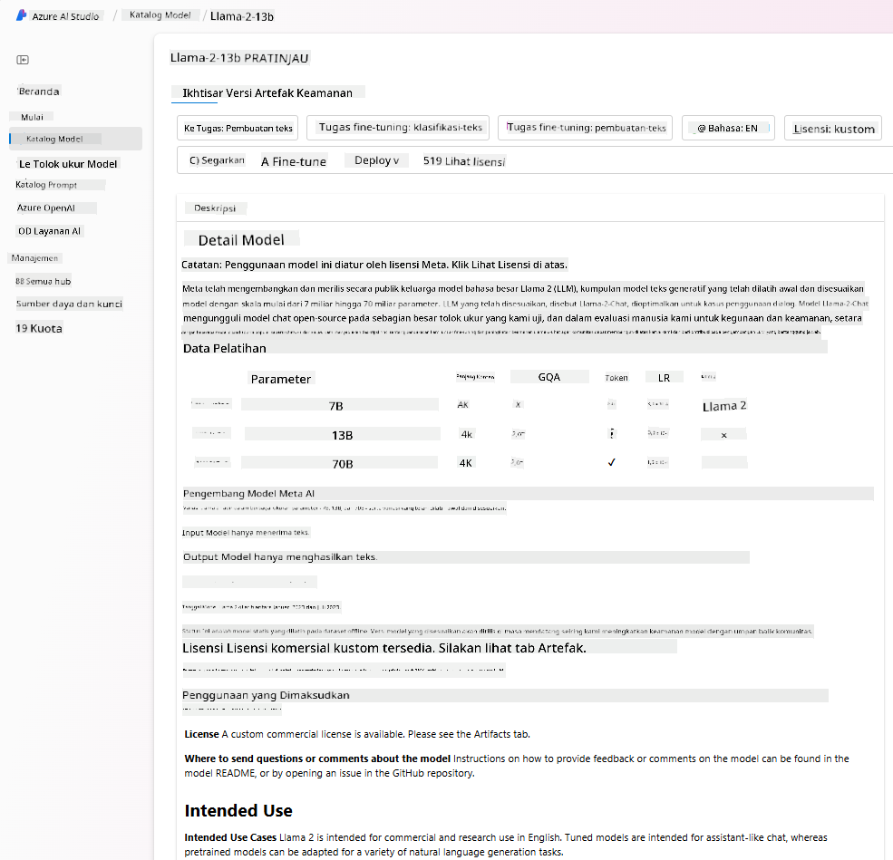
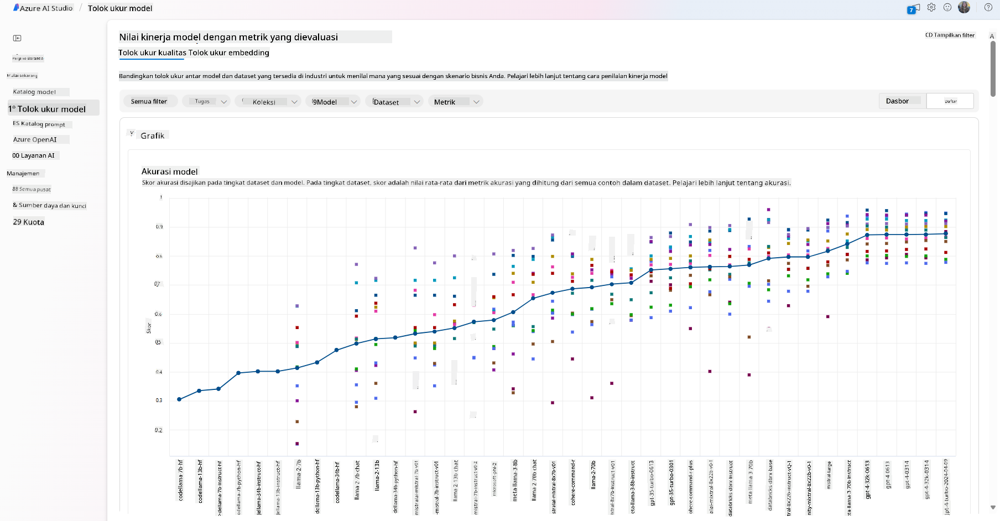
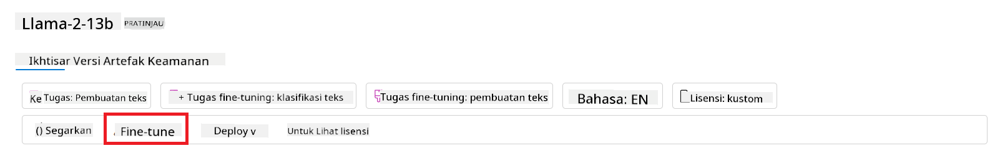
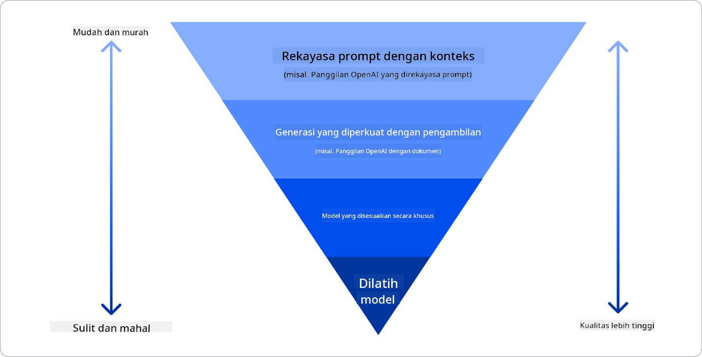

<!--
CO_OP_TRANSLATOR_METADATA:
{
  "original_hash": "e2f686f2eb794941761252ac5e8e090b",
  "translation_date": "2025-07-09T08:33:55+00:00",
  "source_file": "02-exploring-and-comparing-different-llms/README.md",
  "language_code": "id"
}
-->
# Menjelajahi dan membandingkan berbagai LLM

> _Klik gambar di atas untuk menonton video pelajaran ini_

Dalam pelajaran sebelumnya, kita telah melihat bagaimana Generative AI mengubah lanskap teknologi, bagaimana Large Language Models (LLM) bekerja, dan bagaimana sebuah bisnis—seperti startup kita—dapat menerapkannya pada kasus penggunaan mereka dan berkembang! Dalam bab ini, kita akan membandingkan dan mengontraskan berbagai jenis large language models (LLM) untuk memahami kelebihan dan kekurangannya.

Langkah berikutnya dalam perjalanan startup kita adalah menjelajahi lanskap LLM saat ini dan memahami mana yang cocok untuk kasus penggunaan kita.

## Pendahuluan

Pelajaran ini akan membahas:

- Berbagai jenis LLM dalam lanskap saat ini.
- Menguji, mengulangi, dan membandingkan berbagai model untuk kasus penggunaan Anda di Azure.
- Cara menerapkan sebuah LLM.

## Tujuan Pembelajaran

Setelah menyelesaikan pelajaran ini, Anda akan dapat:

- Memilih model yang tepat untuk kasus penggunaan Anda.
- Memahami cara menguji, mengulangi, dan meningkatkan performa model Anda.
- Mengetahui bagaimana bisnis menerapkan model.

## Memahami berbagai jenis LLM

LLM dapat dikategorikan berdasarkan arsitektur, data pelatihan, dan kasus penggunaannya. Memahami perbedaan ini akan membantu startup kita memilih model yang tepat untuk skenario tertentu, serta memahami cara menguji, mengulangi, dan meningkatkan performa.

Ada banyak jenis model LLM, pilihan model Anda tergantung pada tujuan penggunaan, data yang dimiliki, berapa banyak yang siap Anda bayar, dan lainnya.

Tergantung pada apakah Anda ingin menggunakan model untuk teks, audio, video, generasi gambar, dan sebagainya, Anda mungkin memilih jenis model yang berbeda.

- **Pengolahan audio dan pengenalan suara**. Untuk tujuan ini, model tipe Whisper adalah pilihan yang bagus karena bersifat serbaguna dan ditujukan untuk pengenalan suara. Model ini dilatih dengan berbagai audio dan dapat melakukan pengenalan suara multibahasa. Pelajari lebih lanjut tentang [model tipe Whisper di sini](https://platform.openai.com/docs/models/whisper?WT.mc_id=academic-105485-koreyst).

- **Generasi gambar**. Untuk generasi gambar, DALL-E dan Midjourney adalah dua pilihan yang sangat dikenal. DALL-E ditawarkan oleh Azure OpenAI. [Baca lebih lanjut tentang DALL-E di sini](https://platform.openai.com/docs/models/dall-e?WT.mc_id=academic-105485-koreyst) dan juga di Bab 9 dari kurikulum ini.

- **Generasi teks**. Sebagian besar model dilatih untuk generasi teks dan Anda memiliki banyak pilihan mulai dari GPT-3.5 hingga GPT-4. Model-model ini memiliki biaya yang berbeda, dengan GPT-4 sebagai yang paling mahal. Ada baiknya mencoba [Azure OpenAI playground](https://oai.azure.com/portal/playground?WT.mc_id=academic-105485-koreyst) untuk mengevaluasi model mana yang paling sesuai dengan kebutuhan Anda dari segi kemampuan dan biaya.

- **Multi-modality**. Jika Anda ingin menangani berbagai jenis data dalam input dan output, Anda mungkin ingin melihat model seperti [gpt-4 turbo dengan vision atau gpt-4o](https://learn.microsoft.com/azure/ai-services/openai/concepts/models#gpt-4-and-gpt-4-turbo-models?WT.mc_id=academic-105485-koreyst) — rilis terbaru dari model OpenAI — yang mampu menggabungkan pemrosesan bahasa alami dengan pemahaman visual, memungkinkan interaksi melalui antarmuka multi-modal.

Memilih model berarti Anda mendapatkan kemampuan dasar, yang mungkin belum cukup. Seringkali Anda memiliki data khusus perusahaan yang perlu Anda sampaikan ke LLM. Ada beberapa pilihan cara untuk melakukan itu, yang akan dibahas lebih lanjut di bagian berikutnya.

### Foundation Models versus LLMs

Istilah Foundation Model diperkenalkan oleh [peneliti Stanford](https://arxiv.org/abs/2108.07258?WT.mc_id=academic-105485-koreyst) dan didefinisikan sebagai model AI yang memenuhi beberapa kriteria, seperti:

- **Dilatih menggunakan pembelajaran tanpa pengawasan atau pembelajaran swadaya**, artinya dilatih pada data multi-modal tanpa label, dan tidak memerlukan anotasi atau pelabelan manusia untuk proses pelatihannya.
- **Model yang sangat besar**, berdasarkan jaringan saraf yang sangat dalam dan dilatih pada miliaran parameter.
- **Biasanya dimaksudkan sebagai ‘fondasi’ untuk model lain**, artinya dapat digunakan sebagai titik awal untuk membangun model lain di atasnya, yang dapat dilakukan dengan fine-tuning.

Sumber gambar: [Essential Guide to Foundation Models and Large Language Models | oleh Babar M Bhatti | Medium](https://thebabar.medium.com/essential-guide-to-foundation-models-and-large-language-models-27dab58f7404)

Untuk memperjelas perbedaan ini, mari ambil contoh ChatGPT. Untuk membangun versi pertama ChatGPT, model bernama GPT-3.5 digunakan sebagai foundation model. Ini berarti OpenAI menggunakan data khusus chat untuk membuat versi GPT-3.5 yang disesuaikan agar unggul dalam skenario percakapan, seperti chatbot.

Sumber gambar: [2108.07258.pdf (arxiv.org)](https://arxiv.org/pdf/2108.07258.pdf?WT.mc_id=academic-105485-koreyst)

### Open Source versus Proprietary Models

Cara lain untuk mengkategorikan LLM adalah apakah model tersebut open source atau proprietary.

Model open source adalah model yang tersedia untuk umum dan dapat digunakan oleh siapa saja. Biasanya disediakan oleh perusahaan pembuatnya atau komunitas riset. Model ini dapat diperiksa, dimodifikasi, dan disesuaikan untuk berbagai kasus penggunaan LLM. Namun, model ini tidak selalu dioptimalkan untuk penggunaan produksi, dan mungkin tidak seefisien model proprietary. Selain itu, pendanaan untuk model open source bisa terbatas, dan model tersebut mungkin tidak dipelihara dalam jangka panjang atau tidak diperbarui dengan riset terbaru. Contoh model open source populer termasuk [Alpaca](https://crfm.stanford.edu/2023/03/13/alpaca.html?WT.mc_id=academic-105485-koreyst), [Bloom](https://huggingface.co/bigscience/bloom), dan [LLaMA](https://llama.meta.com).

Model proprietary adalah model yang dimiliki oleh perusahaan dan tidak tersedia untuk umum. Model ini biasanya dioptimalkan untuk penggunaan produksi. Namun, model ini tidak boleh diperiksa, dimodifikasi, atau disesuaikan untuk berbagai kasus penggunaan. Selain itu, model ini tidak selalu tersedia secara gratis dan mungkin memerlukan langganan atau pembayaran untuk digunakan. Pengguna juga tidak memiliki kontrol atas data yang digunakan untuk melatih model, sehingga mereka harus mempercayakan pemilik model untuk menjaga privasi data dan penggunaan AI yang bertanggung jawab. Contoh model proprietary populer termasuk [model OpenAI](https://platform.openai.com/docs/models/overview?WT.mc_id=academic-105485-koreyst), [Google Bard](https://sapling.ai/llm/bard?WT.mc_id=academic-105485-koreyst), atau [Claude 2](https://www.anthropic.com/index/claude-2?WT.mc_id=academic-105485-koreyst).

### Embedding versus Generasi Gambar versus Generasi Teks dan Kode

LLM juga dapat dikategorikan berdasarkan output yang dihasilkan.

Embedding adalah sekumpulan model yang dapat mengubah teks menjadi bentuk numerik, yang disebut embedding, yaitu representasi numerik dari teks input. Embedding memudahkan mesin memahami hubungan antar kata atau kalimat dan dapat digunakan sebagai input oleh model lain, seperti model klasifikasi atau klasterisasi yang memiliki performa lebih baik pada data numerik. Model embedding sering digunakan untuk transfer learning, di mana model dibangun untuk tugas pengganti yang memiliki banyak data, kemudian bobot model (embedding) digunakan kembali untuk tugas-tugas lain. Contoh kategori ini adalah [OpenAI embeddings](https://platform.openai.com/docs/models/embeddings?WT.mc_id=academic-105485-koreyst).

Model generasi gambar adalah model yang menghasilkan gambar. Model ini sering digunakan untuk pengeditan gambar, sintesis gambar, dan terjemahan gambar. Model generasi gambar biasanya dilatih pada dataset besar gambar, seperti [LAION-5B](https://laion.ai/blog/laion-5b/?WT.mc_id=academic-105485-koreyst), dan dapat digunakan untuk menghasilkan gambar baru atau mengedit gambar yang sudah ada dengan teknik inpainting, super-resolution, dan pewarnaan. Contohnya termasuk [DALL-E-3](https://openai.com/dall-e-3?WT.mc_id=academic-105485-koreyst) dan [Stable Diffusion models](https://github.com/Stability-AI/StableDiffusion?WT.mc_id=academic-105485-koreyst).

Model generasi teks dan kode adalah model yang menghasilkan teks atau kode. Model ini sering digunakan untuk ringkasan teks, terjemahan, dan menjawab pertanyaan. Model generasi teks biasanya dilatih pada dataset besar teks, seperti [BookCorpus](https://www.cv-foundation.org/openaccess/content_iccv_2015/html/Zhu_Aligning_Books_and_ICCV_2015_paper.html?WT.mc_id=academic-105485-koreyst), dan dapat digunakan untuk menghasilkan teks baru atau menjawab pertanyaan. Model generasi kode, seperti [CodeParrot](https://huggingface.co/codeparrot?WT.mc_id=academic-105485-koreyst), biasanya dilatih pada dataset besar kode, seperti GitHub, dan dapat digunakan untuk menghasilkan kode baru atau memperbaiki bug pada kode yang ada.

### Encoder-Decoder versus Decoder-only

Untuk membahas berbagai jenis arsitektur LLM, mari gunakan analogi.

Bayangkan manajer Anda memberi tugas untuk membuat kuis bagi para siswa. Anda memiliki dua rekan kerja; satu bertugas membuat konten dan yang lain bertugas meninjau konten tersebut.

Pembuat konten seperti model Decoder-only, mereka bisa melihat topik dan apa yang sudah Anda tulis, lalu menulis materi berdasarkan itu. Mereka sangat baik dalam menulis konten yang menarik dan informatif, tapi kurang bagus dalam memahami topik dan tujuan pembelajaran. Contoh model Decoder adalah keluarga GPT, seperti GPT-3.

Peninjau seperti model Encoder-only, mereka melihat materi yang ditulis dan jawaban, memperhatikan hubungan antar keduanya dan memahami konteks, tapi tidak pandai menghasilkan konten. Contoh model Encoder-only adalah BERT.

Bayangkan kita memiliki seseorang yang bisa membuat dan meninjau kuis, ini adalah model Encoder-Decoder. Contohnya adalah BART dan T5.

### Service versus Model

Sekarang, mari kita bahas perbedaan antara service dan model. Service adalah produk yang ditawarkan oleh Cloud Service Provider, dan biasanya merupakan kombinasi dari model, data, dan komponen lain. Model adalah komponen inti dari sebuah service, dan biasanya merupakan foundation model, seperti LLM.

Service biasanya dioptimalkan untuk penggunaan produksi dan lebih mudah digunakan dibandingkan model, melalui antarmuka pengguna grafis. Namun, service tidak selalu tersedia secara gratis, dan mungkin memerlukan langganan atau pembayaran untuk digunakan, sebagai imbalan atas pemanfaatan peralatan dan sumber daya milik penyedia layanan, mengoptimalkan biaya dan memudahkan skala. Contoh service adalah [Azure OpenAI Service](https://learn.microsoft.com/azure/ai-services/openai/overview?WT.mc_id=academic-105485-koreyst), yang menawarkan skema bayar sesuai pemakaian, artinya pengguna dikenakan biaya proporsional dengan penggunaan layanan. Selain itu, Azure OpenAI Service menawarkan keamanan tingkat perusahaan dan kerangka kerja AI yang bertanggung jawab di atas kemampuan model.

Model hanyalah Neural Network, dengan parameter, bobot, dan lainnya. Perusahaan dapat menjalankan model secara lokal, namun perlu membeli peralatan, membangun infrastruktur untuk skala, dan membeli lisensi atau menggunakan model open source. Model seperti LLaMA tersedia untuk digunakan, namun memerlukan daya komputasi untuk menjalankan model.

## Cara menguji dan mengulangi dengan berbagai model untuk memahami performa di Azure

Setelah tim kita menjelajahi lanskap LLM saat ini dan mengidentifikasi beberapa kandidat yang cocok untuk skenario mereka, langkah berikutnya adalah menguji model tersebut dengan data dan beban kerja mereka. Ini adalah proses iteratif yang dilakukan melalui eksperimen dan pengukuran.
Sebagian besar model yang kami sebutkan di paragraf sebelumnya (model OpenAI, model open source seperti Llama2, dan transformer Hugging Face) tersedia di [Model Catalog](https://learn.microsoft.com/azure/ai-studio/how-to/model-catalog-overview?WT.mc_id=academic-105485-koreyst) di [Azure AI Studio](https://ai.azure.com/?WT.mc_id=academic-105485-koreyst).

[Azure AI Studio](https://learn.microsoft.com/azure/ai-studio/what-is-ai-studio?WT.mc_id=academic-105485-koreyst) adalah Platform Cloud yang dirancang untuk pengembang membangun aplikasi AI generatif dan mengelola seluruh siklus pengembangan - dari eksperimen hingga evaluasi - dengan menggabungkan semua layanan Azure AI ke dalam satu pusat dengan GUI yang mudah digunakan. Model Catalog di Azure AI Studio memungkinkan pengguna untuk:

- Menemukan Foundation Model yang diminati dalam katalog - baik yang proprietary maupun open source, dengan filter berdasarkan tugas, lisensi, atau nama. Untuk meningkatkan kemudahan pencarian, model-model diorganisir ke dalam koleksi, seperti koleksi Azure OpenAI, koleksi Hugging Face, dan lainnya.

- Meninjau model card, termasuk deskripsi rinci tentang penggunaan yang dimaksudkan dan data pelatihan, contoh kode, serta hasil evaluasi pada perpustakaan evaluasi internal.

- Membandingkan benchmark antar model dan dataset yang tersedia di industri untuk menilai mana yang sesuai dengan skenario bisnis, melalui panel [Model Benchmarks](https://learn.microsoft.com/azure/ai-studio/how-to/model-benchmarks?WT.mc_id=academic-105485-koreyst).

- Melakukan fine-tuning model dengan data pelatihan khusus untuk meningkatkan performa model pada beban kerja tertentu, memanfaatkan kemampuan eksperimen dan pelacakan dari Azure AI Studio.

- Mendeploy model pre-trained asli atau versi yang sudah di-fine-tune ke endpoint inferensi real-time jarak jauh - managed compute - atau serverless API endpoint - [pay-as-you-go](https://learn.microsoft.com/azure/ai-studio/how-to/model-catalog-overview#model-deployment-managed-compute-and-serverless-api-pay-as-you-go?WT.mc_id=academic-105485-koreyst) - agar aplikasi dapat menggunakannya.

> [!NOTE]
> Tidak semua model dalam katalog saat ini tersedia untuk fine-tuning dan/atau deployment pay-as-you-go. Periksa model card untuk detail tentang kemampuan dan keterbatasan model tersebut.

## Meningkatkan hasil LLM

Kami telah mengeksplorasi bersama tim startup kami berbagai jenis LLM dan Platform Cloud (Azure Machine Learning) yang memungkinkan kami membandingkan berbagai model, mengevaluasi mereka dengan data uji, meningkatkan performa, dan mendeploy ke endpoint inferensi.

Namun, kapan sebaiknya mereka mempertimbangkan untuk melakukan fine-tuning model daripada menggunakan model pre-trained? Apakah ada pendekatan lain untuk meningkatkan performa model pada beban kerja tertentu?

Ada beberapa pendekatan yang bisa digunakan bisnis untuk mendapatkan hasil yang mereka butuhkan dari LLM. Anda dapat memilih berbagai jenis model dengan tingkat pelatihan yang berbeda saat mendeploy LLM di produksi, dengan tingkat kompleksitas, biaya, dan kualitas yang berbeda. Berikut beberapa pendekatan yang berbeda:

- **Prompt engineering dengan konteks**. Idemya adalah memberikan konteks yang cukup saat memberikan prompt agar mendapatkan respons yang diinginkan.

- **Retrieval Augmented Generation, RAG**. Data Anda mungkin tersimpan di database atau endpoint web misalnya, untuk memastikan data ini, atau sebagian darinya, disertakan saat memberikan prompt, Anda bisa mengambil data relevan tersebut dan menjadikannya bagian dari prompt pengguna.

- **Model yang di-fine-tune**. Di sini, Anda melatih model lebih lanjut dengan data Anda sendiri sehingga model menjadi lebih tepat dan responsif terhadap kebutuhan Anda, meskipun mungkin biayanya lebih tinggi.

Sumber gambar: [Four Ways that Enterprises Deploy LLMs | Fiddler AI Blog](https://www.fiddler.ai/blog/four-ways-that-enterprises-deploy-llms?WT.mc_id=academic-105485-koreyst)

### Prompt Engineering dengan Konteks

LLM pre-trained bekerja sangat baik pada tugas bahasa alami yang umum, bahkan hanya dengan memanggilnya menggunakan prompt singkat, seperti kalimat yang harus dilengkapi atau pertanyaan – yang disebut “zero-shot” learning.

Namun, semakin banyak pengguna dapat membingkai pertanyaan mereka dengan permintaan yang rinci dan contoh – yaitu Konteks – maka jawaban yang diberikan akan semakin akurat dan sesuai dengan harapan pengguna. Dalam hal ini, kita menyebutnya “one-shot” learning jika prompt hanya berisi satu contoh dan “few-shot learning” jika berisi beberapa contoh.
Prompt engineering dengan konteks adalah pendekatan yang paling hemat biaya untuk memulai.

### Retrieval Augmented Generation (RAG)

LLM memiliki keterbatasan bahwa mereka hanya dapat menggunakan data yang telah digunakan selama pelatihan untuk menghasilkan jawaban. Ini berarti mereka tidak mengetahui fakta yang terjadi setelah proses pelatihan, dan tidak dapat mengakses informasi non-publik (seperti data perusahaan).
Hal ini dapat diatasi dengan RAG, teknik yang menambahkan data eksternal dalam bentuk potongan dokumen ke dalam prompt, dengan memperhatikan batas panjang prompt. Ini didukung oleh alat database vektor (seperti [Azure Vector Search](https://learn.microsoft.com/azure/search/vector-search-overview?WT.mc_id=academic-105485-koreyst)) yang mengambil potongan data berguna dari berbagai sumber data yang telah ditentukan dan menambahkannya ke Konteks prompt.

Teknik ini sangat membantu ketika bisnis tidak memiliki cukup data, waktu, atau sumber daya untuk melakukan fine-tuning LLM, tetapi tetap ingin meningkatkan performa pada beban kerja tertentu dan mengurangi risiko fabrikasi, yaitu distorsi realitas atau konten berbahaya.

### Model yang di-fine-tune

Fine-tuning adalah proses yang memanfaatkan transfer learning untuk ‘mengadaptasi’ model ke tugas lanjutan atau untuk menyelesaikan masalah spesifik. Berbeda dengan few-shot learning dan RAG, ini menghasilkan model baru dengan bobot dan bias yang diperbarui. Proses ini membutuhkan set contoh pelatihan yang terdiri dari satu input (prompt) dan output terkait (completion).
Ini adalah pendekatan yang disarankan jika:

- **Menggunakan model yang di-fine-tune**. Bisnis ingin menggunakan model yang di-fine-tune dengan kemampuan lebih rendah (seperti model embedding) daripada model berperforma tinggi, sehingga menghasilkan solusi yang lebih hemat biaya dan cepat.

- **Memperhatikan latensi**. Latensi penting untuk kasus penggunaan tertentu, sehingga tidak memungkinkan menggunakan prompt yang sangat panjang atau jumlah contoh yang harus dipelajari model tidak sesuai dengan batas panjang prompt.

- **Tetap up to date**. Bisnis memiliki banyak data berkualitas tinggi dan label ground truth serta sumber daya yang diperlukan untuk menjaga data ini tetap terbaru dari waktu ke waktu.

### Model yang dilatih

Melatih LLM dari awal jelas merupakan pendekatan yang paling sulit dan kompleks, membutuhkan data dalam jumlah besar, sumber daya terampil, dan daya komputasi yang memadai. Opsi ini sebaiknya dipertimbangkan hanya dalam skenario di mana bisnis memiliki kasus penggunaan domain-spesifik dan data domain yang sangat banyak.

## Pemeriksaan Pengetahuan

Apa pendekatan yang baik untuk meningkatkan hasil completion LLM?

1. Prompt engineering dengan konteks  
2. RAG  
3. Model yang di-fine-tune

Jawaban: 3, jika Anda memiliki waktu, sumber daya, dan data berkualitas tinggi, fine-tuning adalah opsi terbaik untuk tetap up to date. Namun, jika Anda ingin meningkatkan hasil dan kekurangan waktu, ada baiknya mempertimbangkan RAG terlebih dahulu.

## 🚀 Tantangan

Pelajari lebih lanjut tentang bagaimana Anda dapat [menggunakan RAG](https://learn.microsoft.com/azure/search/retrieval-augmented-generation-overview?WT.mc_id=academic-105485-koreyst) untuk bisnis Anda.

## Kerja Bagus, Lanjutkan Pembelajaran Anda

Setelah menyelesaikan pelajaran ini, lihat koleksi [Generative AI Learning](https://aka.ms/genai-collection?WT.mc_id=academic-105485-koreyst) kami untuk terus meningkatkan pengetahuan Anda tentang Generative AI!

Lanjut ke Pelajaran 3 di mana kita akan membahas cara [membangun dengan Generative AI secara Bertanggung Jawab](../03-using-generative-ai-responsibly/README.md?WT.mc_id=academic-105485-koreyst)!

**Penafian**:  
Dokumen ini telah diterjemahkan menggunakan layanan terjemahan AI [Co-op Translator](https://github.com/Azure/co-op-translator). Meskipun kami berupaya untuk akurasi, harap diingat bahwa terjemahan otomatis mungkin mengandung kesalahan atau ketidakakuratan. Dokumen asli dalam bahasa aslinya harus dianggap sebagai sumber yang sahih. Untuk informasi penting, disarankan menggunakan terjemahan profesional oleh manusia. Kami tidak bertanggung jawab atas kesalahpahaman atau penafsiran yang salah yang timbul dari penggunaan terjemahan ini.