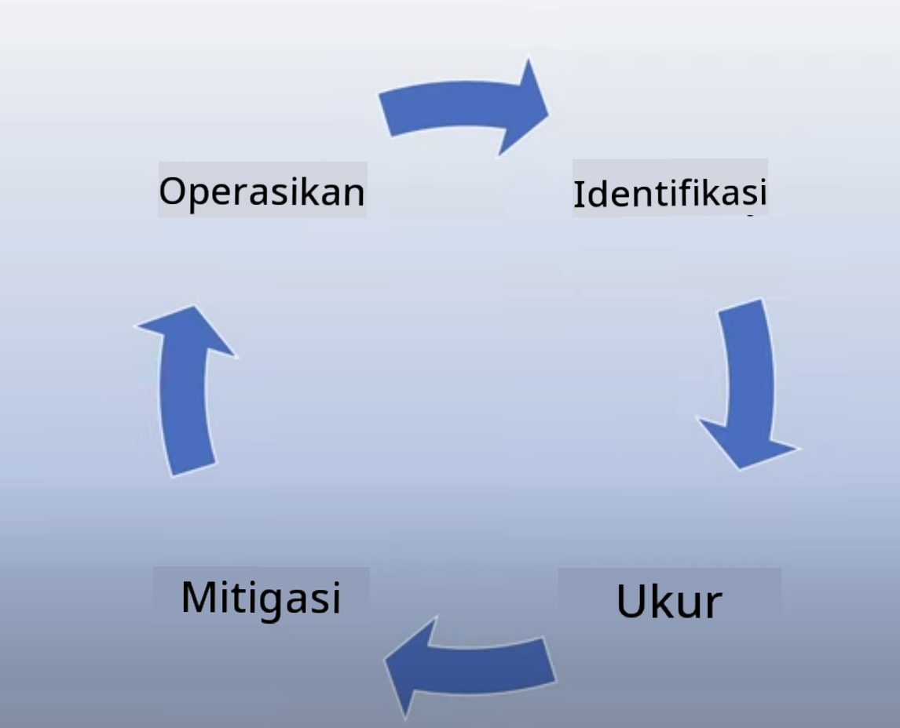

<!--
CO_OP_TRANSLATOR_METADATA:
{
  "original_hash": "7f8f4c11f8c1cb6e1794442dead414ea",
  "translation_date": "2025-07-09T09:00:02+00:00",
  "source_file": "03-using-generative-ai-responsibly/README.md",
  "language_code": "id"
}
-->
# Menggunakan Generative AI dengan Bertanggung Jawab

> _Klik gambar di atas untuk menonton video pelajaran ini_

Mudah untuk terpesona dengan AI, terutama Generative AI, tapi kamu perlu mempertimbangkan bagaimana menggunakannya secara bertanggung jawab. Kamu harus memikirkan hal-hal seperti bagaimana memastikan hasilnya adil, tidak merugikan, dan lainnya. Bab ini bertujuan memberikan konteks tersebut, apa yang perlu dipertimbangkan, dan bagaimana mengambil langkah aktif untuk meningkatkan penggunaan AI-mu.

## Pendahuluan

Pelajaran ini akan membahas:

- Mengapa kamu harus memprioritaskan Responsible AI saat membangun aplikasi Generative AI.
- Prinsip inti Responsible AI dan bagaimana kaitannya dengan Generative AI.
- Cara menerapkan prinsip Responsible AI ini melalui strategi dan alat.

## Tujuan Pembelajaran

Setelah menyelesaikan pelajaran ini, kamu akan mengetahui:

- Pentingnya Responsible AI saat membangun aplikasi Generative AI.
- Kapan harus memikirkan dan menerapkan prinsip inti Responsible AI saat membangun aplikasi Generative AI.
- Alat dan strategi apa saja yang tersedia untuk menerapkan konsep Responsible AI.

## Prinsip Responsible AI

Antusiasme terhadap Generative AI belum pernah sebesar ini. Antusiasme ini membawa banyak pengembang baru, perhatian, dan pendanaan ke bidang ini. Meskipun ini sangat positif bagi siapa saja yang ingin membangun produk dan perusahaan menggunakan Generative AI, penting juga untuk melangkah dengan penuh tanggung jawab.

Sepanjang kursus ini, kita fokus membangun startup dan produk edukasi AI kita. Kita akan menggunakan prinsip Responsible AI: Fairness, Inclusiveness, Reliability/Safety, Security & Privacy, Transparency, dan Accountability. Dengan prinsip-prinsip ini, kita akan mengeksplorasi bagaimana kaitannya dengan penggunaan Generative AI dalam produk kita.

## Mengapa Kamu Harus Memprioritaskan Responsible AI

Saat membangun produk, mengambil pendekatan yang berpusat pada manusia dengan mengutamakan kepentingan terbaik pengguna akan menghasilkan hasil terbaik.

Keunikan Generative AI adalah kemampuannya menciptakan jawaban, informasi, panduan, dan konten yang bermanfaat bagi pengguna. Ini bisa dilakukan tanpa banyak langkah manual yang biasanya menghasilkan hasil yang mengesankan. Namun tanpa perencanaan dan strategi yang tepat, hal ini juga bisa berujung pada hasil yang merugikan pengguna, produk, dan masyarakat secara keseluruhan.

Mari kita lihat beberapa (namun bukan semua) potensi hasil yang merugikan ini:

### Halusinasi

Halusinasi adalah istilah yang digunakan untuk menggambarkan ketika sebuah LLM menghasilkan konten yang sama sekali tidak masuk akal atau sesuatu yang kita tahu salah secara faktual berdasarkan sumber informasi lain.

Misalnya kita membangun fitur untuk startup kita yang memungkinkan siswa bertanya tentang sejarah ke model. Seorang siswa bertanya, `Siapa satu-satunya penyintas Titanic?`

Model menghasilkan jawaban seperti berikut:

> _(Sumber: [Flying bisons](https://flyingbisons.com?WT.mc_id=academic-105485-koreyst))_

Ini adalah jawaban yang sangat percaya diri dan lengkap. Sayangnya, jawaban ini salah. Dengan sedikit riset saja, kita akan menemukan bahwa ada lebih dari satu penyintas dari bencana Titanic. Bagi siswa yang baru mulai meneliti topik ini, jawaban ini bisa cukup meyakinkan untuk tidak dipertanyakan dan dianggap fakta. Konsekuensinya, sistem AI bisa menjadi tidak dapat diandalkan dan berdampak negatif pada reputasi startup kita.

Dengan setiap iterasi LLM, kita telah melihat peningkatan performa dalam meminimalkan halusinasi. Namun meskipun ada peningkatan ini, kita sebagai pembangun aplikasi dan pengguna tetap harus sadar akan keterbatasan ini.

### Konten Merugikan

Kita sudah membahas sebelumnya ketika LLM menghasilkan jawaban yang salah atau tidak masuk akal. Risiko lain yang harus kita waspadai adalah ketika model merespons dengan konten yang merugikan.

Konten merugikan dapat didefinisikan sebagai:

- Memberikan instruksi atau mendorong tindakan menyakiti diri sendiri atau kelompok tertentu.
- Konten yang penuh kebencian atau merendahkan.
- Membimbing perencanaan serangan atau tindakan kekerasan.
- Memberikan instruksi cara menemukan konten ilegal atau melakukan tindakan ilegal.
- Menampilkan konten seksual eksplisit.

Untuk startup kita, kita ingin memastikan memiliki alat dan strategi yang tepat untuk mencegah jenis konten ini terlihat oleh siswa.

### Kurangnya Keadilan

Keadilan didefinisikan sebagai “memastikan bahwa sistem AI bebas dari bias dan diskriminasi serta memperlakukan semua orang secara adil dan setara.” Dalam dunia Generative AI, kita ingin memastikan bahwa pandangan dunia yang mengecualikan kelompok marjinal tidak diperkuat oleh output model.

Jenis output seperti ini tidak hanya merusak pengalaman produk yang positif bagi pengguna, tapi juga menyebabkan kerugian sosial lebih lanjut. Sebagai pembangun aplikasi, kita harus selalu mengingat basis pengguna yang luas dan beragam saat membangun solusi dengan Generative AI.

## Cara Menggunakan Generative AI dengan Bertanggung Jawab

Setelah kita mengidentifikasi pentingnya Responsible Generative AI, mari kita lihat 4 langkah yang bisa kita ambil untuk membangun solusi AI secara bertanggung jawab:

### Mengukur Potensi Bahaya

Dalam pengujian perangkat lunak, kita menguji tindakan yang diharapkan dari pengguna pada aplikasi. Demikian juga, menguji berbagai prompt yang kemungkinan besar akan digunakan pengguna adalah cara yang baik untuk mengukur potensi bahaya.

Karena startup kita membangun produk edukasi, akan baik untuk menyiapkan daftar prompt terkait pendidikan. Ini bisa mencakup subjek tertentu, fakta sejarah, dan prompt tentang kehidupan siswa.

### Mengurangi Potensi Bahaya

Saatnya mencari cara untuk mencegah atau membatasi potensi bahaya yang disebabkan oleh model dan responsnya. Kita bisa melihat ini dalam 4 lapisan berbeda:

- **Model**. Memilih model yang tepat untuk kasus penggunaan yang tepat. Model yang lebih besar dan kompleks seperti GPT-4 bisa menimbulkan risiko konten merugikan lebih besar jika diterapkan pada kasus penggunaan yang lebih kecil dan spesifik. Menggunakan data pelatihan untuk fine-tune juga mengurangi risiko konten merugikan.

- **Sistem Keamanan**. Sistem keamanan adalah kumpulan alat dan konfigurasi pada platform yang melayani model untuk membantu mengurangi bahaya. Contohnya adalah sistem penyaringan konten pada layanan Azure OpenAI. Sistem juga harus mendeteksi serangan jailbreak dan aktivitas tidak diinginkan seperti permintaan dari bot.

- **Metaprompt**. Metaprompt dan grounding adalah cara kita mengarahkan atau membatasi model berdasarkan perilaku dan informasi tertentu. Ini bisa berupa penggunaan input sistem untuk menetapkan batasan tertentu pada model. Selain itu, memberikan output yang lebih relevan dengan ruang lingkup atau domain sistem.

Ini juga bisa menggunakan teknik seperti Retrieval Augmented Generation (RAG) agar model hanya mengambil informasi dari sumber terpercaya yang dipilih. Ada pelajaran di kursus ini tentang [membangun aplikasi pencarian](../08-building-search-applications/README.md?WT.mc_id=academic-105485-koreyst).

- **Pengalaman Pengguna**. Lapisan terakhir adalah di mana pengguna berinteraksi langsung dengan model melalui antarmuka aplikasi kita. Dengan cara ini kita bisa merancang UI/UX untuk membatasi jenis input yang bisa dikirim pengguna ke model serta teks atau gambar yang ditampilkan. Saat meluncurkan aplikasi AI, kita juga harus transparan tentang apa yang bisa dan tidak bisa dilakukan aplikasi Generative AI kita.

Kita memiliki pelajaran khusus tentang [Merancang UX untuk Aplikasi AI](../12-designing-ux-for-ai-applications/README.md?WT.mc_id=academic-105485-koreyst).

- **Evaluasi model**. Bekerja dengan LLM bisa menantang karena kita tidak selalu mengontrol data yang digunakan untuk melatih model. Namun, kita harus selalu mengevaluasi performa dan output model. Penting untuk mengukur akurasi, kesamaan, keterhubungan, dan relevansi output model. Ini membantu memberikan transparansi dan kepercayaan kepada pemangku kepentingan dan pengguna.

### Mengoperasikan Solusi Generative AI yang Bertanggung Jawab

Membangun praktik operasional di sekitar aplikasi AI-mu adalah tahap akhir. Ini termasuk bekerja sama dengan bagian lain dari startup seperti Legal dan Security untuk memastikan kepatuhan terhadap semua kebijakan regulasi. Sebelum peluncuran, kita juga ingin membuat rencana terkait pengiriman, penanganan insiden, dan rollback untuk mencegah kerugian yang berkembang pada pengguna.

## Alat

Meskipun pekerjaan mengembangkan solusi Responsible AI mungkin terasa berat, ini adalah usaha yang sangat berharga. Seiring berkembangnya bidang Generative AI, semakin banyak alat yang membantu pengembang mengintegrasikan tanggung jawab secara efisien ke dalam alur kerja mereka. Misalnya, [Azure AI Content Safety](https://learn.microsoft.com/azure/ai-services/content-safety/overview?WT.mc_id=academic-105485-koreyst) dapat membantu mendeteksi konten dan gambar berbahaya melalui permintaan API.

## Pemeriksaan Pengetahuan

Apa saja hal yang perlu kamu perhatikan untuk memastikan penggunaan AI yang bertanggung jawab?

1. Jawaban yang diberikan benar.
1. Penggunaan yang merugikan, bahwa AI tidak digunakan untuk tujuan kriminal.
1. Memastikan AI bebas dari bias dan diskriminasi.

A: 2 dan 3 benar. Responsible AI membantu kamu mempertimbangkan cara mengurangi efek merugikan dan bias, serta lainnya.

## 🚀 Tantangan

Baca tentang [Azure AI Content Safety](https://learn.microsoft.com/azure/ai-services/content-safety/overview?WT.mc_id=academic-105485-koreyst) dan lihat apa yang bisa kamu terapkan untuk penggunaanmu.

## Kerja Bagus, Lanjutkan Pembelajaranmu

Setelah menyelesaikan pelajaran ini, lihat koleksi [Generative AI Learning](https://aka.ms/genai-collection?WT.mc_id=academic-105485-koreyst) untuk terus meningkatkan pengetahuanmu tentang Generative AI!

Lanjut ke Pelajaran 4 di mana kita akan membahas [Dasar-dasar Prompt Engineering](../04-prompt-engineering-fundamentals/README.md?WT.mc_id=academic-105485-koreyst)!

**Penafian**:  
Dokumen ini telah diterjemahkan menggunakan layanan terjemahan AI [Co-op Translator](https://github.com/Azure/co-op-translator). Meskipun kami berupaya untuk mencapai akurasi, harap diperhatikan bahwa terjemahan otomatis mungkin mengandung kesalahan atau ketidakakuratan. Dokumen asli dalam bahasa aslinya harus dianggap sebagai sumber yang sahih. Untuk informasi penting, disarankan menggunakan terjemahan profesional oleh manusia. Kami tidak bertanggung jawab atas kesalahpahaman atau penafsiran yang keliru yang timbul dari penggunaan terjemahan ini.