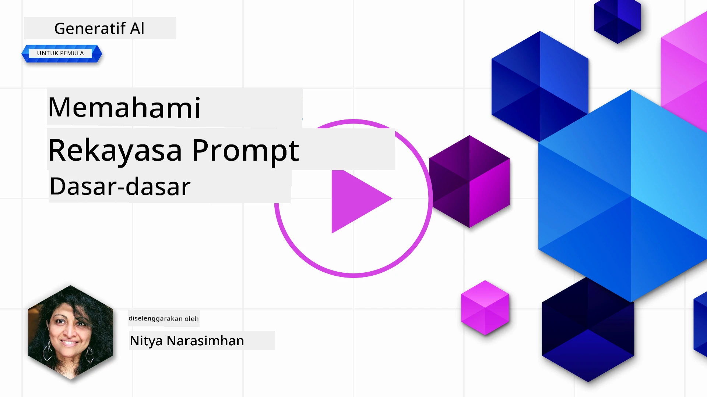
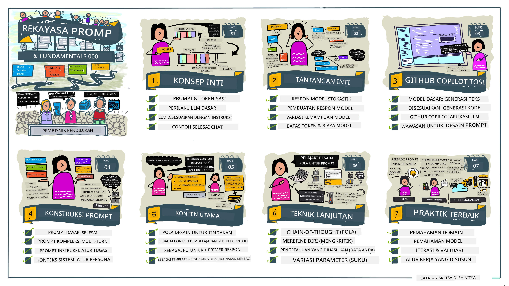
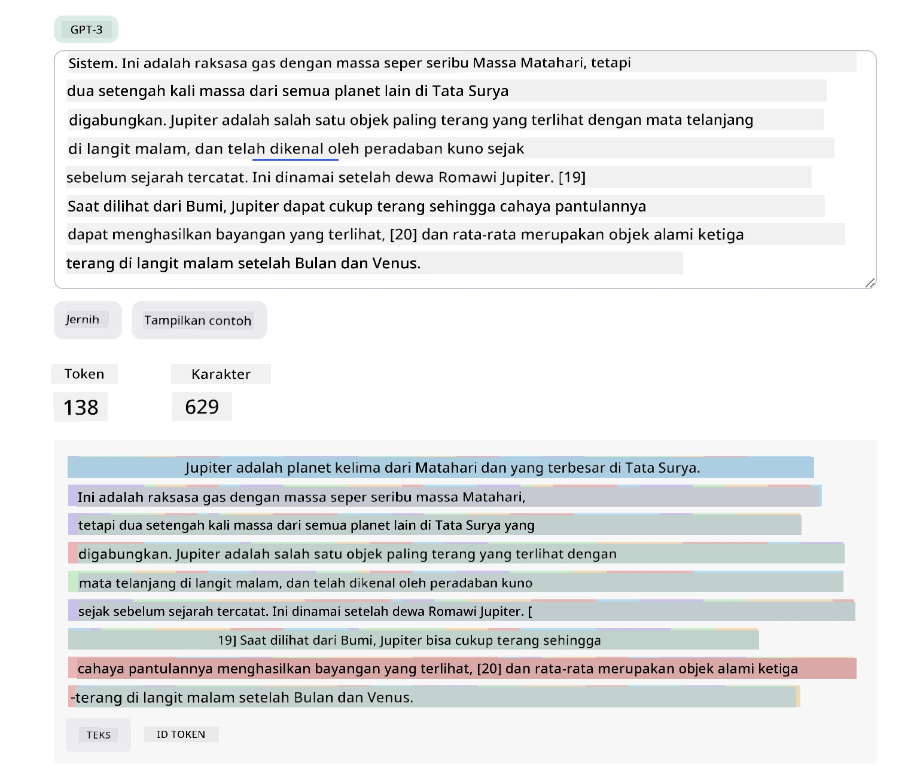
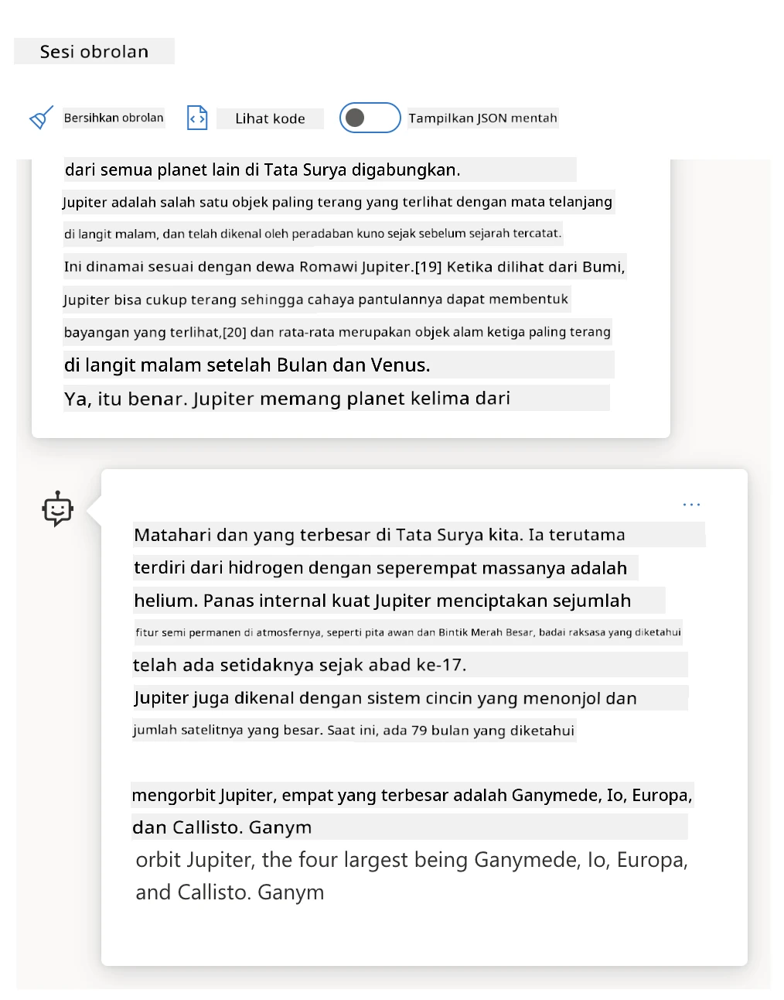
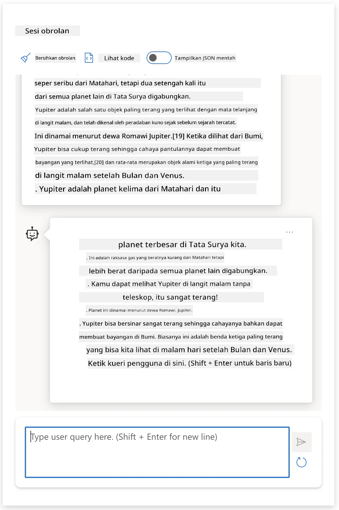
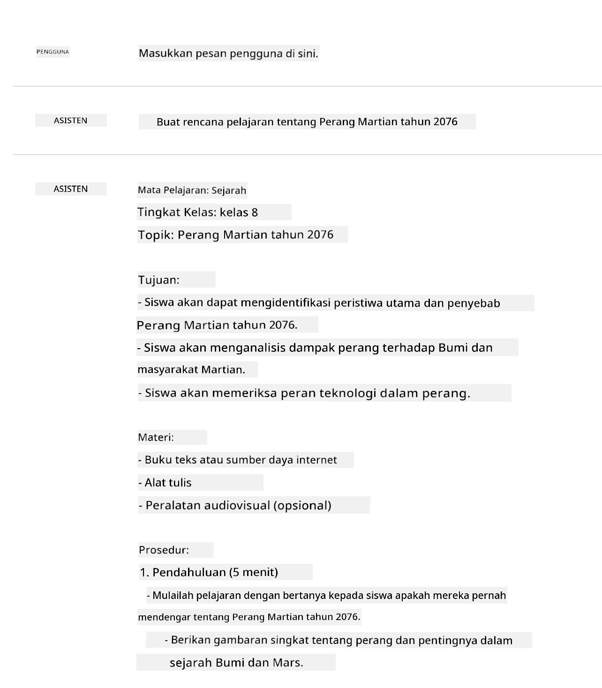
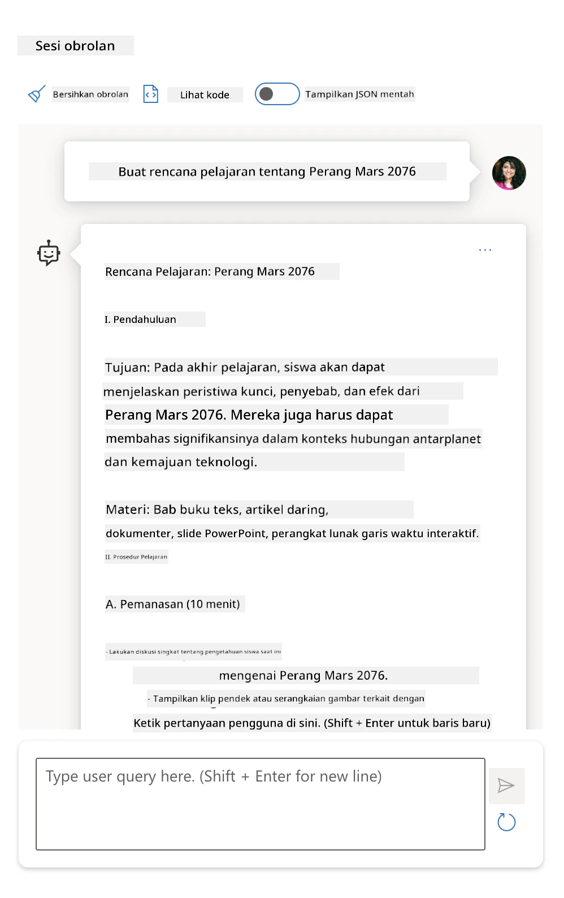
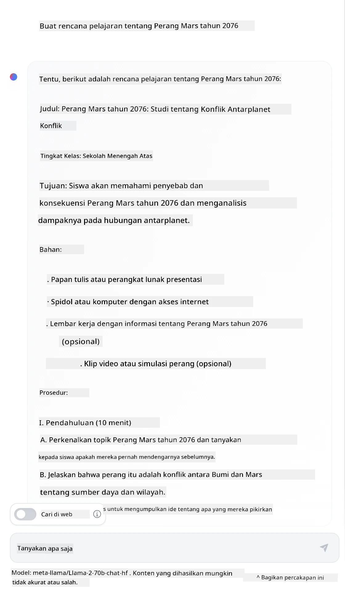

# Dasar-Dasar Rekayasa Prompt

[](https://youtu.be/GElCu2kUlRs?si=qrXsBvXnCW12epb8)

## Pendahuluan
Modul ini membahas konsep dan teknik penting untuk membuat prompt yang efektif dalam model AI generatif. Cara Anda menulis prompt untuk LLM juga penting. Prompt yang dibuat dengan cermat dapat menghasilkan kualitas respons yang lebih baik. Tapi apa sebenarnya arti istilah seperti _prompt_ dan _rekayasa prompt_? Dan bagaimana cara saya meningkatkan _input_ prompt yang saya kirim ke LLM? Inilah pertanyaan yang akan kita coba jawab dalam bab ini dan bab berikutnya.

_AI Generatif_ mampu menciptakan konten baru (misalnya, teks, gambar, audio, kode, dll.) sebagai respons terhadap permintaan pengguna. Ini dicapai menggunakan _Large Language Models_ seperti seri GPT OpenAI ("Generative Pre-trained Transformer") yang dilatih untuk menggunakan bahasa alami dan kode.

Pengguna kini dapat berinteraksi dengan model-model ini menggunakan paradigma yang familiar seperti chat, tanpa perlu keahlian teknis atau pelatihan. Model-model ini berbasis _prompt_ - pengguna mengirim input teks (prompt) dan menerima kembali respons AI (completion). Mereka kemudian dapat "bercakap dengan AI" secara iteratif, dalam percakapan multi-putaran, menyempurnakan prompt mereka sampai respons sesuai dengan harapan mereka.

"Prompt" kini menjadi antarmuka _pemrograman utama_ bagi aplikasi AI generatif, memberi tahu model apa yang harus dilakukan dan memengaruhi kualitas respons yang dikembalikan. "Rekayasa Prompt" adalah bidang studi yang berkembang pesat yang berfokus pada _desain dan optimasi_ prompt untuk memberikan respons yang konsisten dan berkualitas dalam skala besar.

## Tujuan Pembelajaran

Dalam pelajaran ini, kita akan mempelajari apa itu Rekayasa Prompt, mengapa itu penting, dan bagaimana kita dapat merancang prompt yang lebih efektif untuk model dan tujuan aplikasi tertentu. Kita akan memahami konsep inti dan praktik terbaik untuk rekayasa prompt - serta belajar tentang lingkungan "sandbox" interaktif Jupyter Notebooks di mana kita dapat melihat konsep-konsep ini diterapkan pada contoh nyata.

Pada akhir pelajaran ini kita akan dapat:

1. Menjelaskan apa itu rekayasa prompt dan mengapa itu penting.
2. Mendeskripsikan komponen sebuah prompt dan bagaimana cara penggunaannya.
3. Mempelajari praktik terbaik dan teknik untuk rekayasa prompt.
4. Menerapkan teknik yang dipelajari ke contoh nyata, menggunakan endpoint OpenAI.

## Istilah Kunci

Rekayasa Prompt: Praktik merancang dan menyempurnakan input untuk mengarahkan model AI menghasilkan output yang diinginkan.  
Tokenisasi: Proses mengubah teks menjadi unit-unit yang lebih kecil, disebut token, yang dapat dipahami dan diproses oleh model.  
Instruction-Tuned LLMs: Large Language Models (LLM) yang telah disesuaikan dengan instruksi khusus untuk meningkatkan akurasi dan relevansi respons mereka.

## Sandbox Pembelajaran

Rekayasa prompt saat ini lebih merupakan seni daripada ilmu pasti. Cara terbaik untuk meningkatkan intuisi kita adalah dengan _berlatih lebih banyak_ dan mengadopsi pendekatan coba-coba yang menggabungkan keahlian domain aplikasi dengan teknik yang direkomendasikan dan optimasi spesifik model.

Jupyter Notebook yang menyertai pelajaran ini menyediakan lingkungan _sandbox_ di mana Anda dapat mencoba apa yang Anda pelajari - seiring berjalan atau sebagai bagian dari tantangan kode di akhir. Untuk menjalankan latihan, Anda memerlukan:

1. **Kunci API Azure OpenAI** - endpoint layanan untuk LLM yang sudah dideploy.  
2. **Runtime Python** - tempat Notebook dapat dieksekusi.  
3. **Variabel Lingkungan Lokal** - _selesaikan langkah [SETUP](./../00-course-setup/02-setup-local.md?WT.mc_id=academic-105485-koreyst) sekarang untuk bersiap-siap_.

Notebook ini hadir dengan latihan _pemula_ - namun Anda didorong untuk menambahkan bagian _Markdown_ (deskripsi) dan _Kode_ (permintaan prompt) Anda sendiri untuk mencoba lebih banyak contoh atau ide - dan membangun intuisi Anda tentang desain prompt.

## Panduan Bergambar

Ingin mendapatkan gambaran besar tentang apa yang dibahas pelajaran ini sebelum Anda masuk lebih dalam? Lihat panduan bergambar ini, yang memberi Anda gambaran mengenai topik utama yang dibahas dan poin-poin penting untuk dipikirkan dalam masing-masingnya. Peta jalan pelajaran membawa Anda dari memahami konsep inti dan tantangan menuju mengatasinya dengan teknik rekayasa prompt dan praktik terbaik yang relevan. Perlu dicatat bahwa bagian "Teknik Lanjutan" dalam panduan ini merujuk pada konten yang dibahas dalam bab berikutnya dari kurikulum ini.



## Startup Kami

Sekarang, mari kita bahas bagaimana _topik ini_ berkaitan dengan misi startup kami untuk [membawa inovasi AI ke pendidikan](https://educationblog.microsoft.com/2023/06/collaborating-to-bring-ai-innovation-to-education?WT.mc_id=academic-105485-koreyst). Kami ingin membangun aplikasi berbasis AI untuk _pembelajaran yang dipersonalisasi_ - jadi mari kita pikirkan bagaimana pengguna yang berbeda dari aplikasi kami mungkin "merancang" prompt:

- **Administrator** mungkin meminta AI untuk _menganalisis data kurikulum untuk mengidentifikasi celah dalam cakupan_. AI dapat merangkum hasil atau memvisualisasikannya dengan kode.  
- **Pendidik** mungkin meminta AI untuk _menghasilkan rencana pelajaran untuk audiens dan topik tertentu_. AI dapat membangun rencana yang dipersonalisasi dalam format yang ditentukan.  
- **Siswa** mungkin meminta AI untuk _membimbing mereka dalam subjek yang sulit_. AI kini dapat membimbing siswa dengan pelajaran, petunjuk, dan contoh yang disesuaikan dengan tingkat mereka.

Itu baru sebagian kecil dari kemungkinannya. Lihat [Prompts For Education](https://github.com/microsoft/prompts-for-edu/tree/main?WT.mc_id=academic-105485-koreyst) - perpustakaan prompt sumber terbuka yang dikurasi oleh para ahli pendidikan - untuk mendapatkan gambaran yang lebih luas tentang kemungkinan-kemungkinan! _Coba jalankan beberapa prompt tersebut di sandbox atau menggunakan OpenAI Playground untuk melihat apa yang terjadi!_

<!--
LESSON TEMPLATE:
This unit should cover core concept #1.
Reinforce the concept with examples and references.

CONCEPT #1:
Prompt Engineering.
Define it and explain why it is needed.
-->

## Apa Itu Rekayasa Prompt?

Kita mulai pelajaran ini dengan mendefinisikan **Rekayasa Prompt** sebagai proses _merancang dan mengoptimalkan_ input teks (prompt) untuk mengirimkan respons (completion) yang konsisten dan berkualitas sesuai tujuan aplikasi dan model. Kita dapat memandang ini sebagai proses dua langkah:

- _merancang_ prompt awal untuk model dan tujuan tertentu  
- _menyempurnakan_ prompt secara iteratif untuk meningkatkan kualitas respons

Ini merupakan proses coba-coba yang memerlukan intuisi dan usaha pengguna untuk mendapatkan hasil optimal. Jadi mengapa ini penting? Untuk menjawab pertanyaan itu, kita perlu memahami tiga konsep:

- _Tokenisasi_ = bagaimana model "melihat" prompt  
- _Base LLMs_ = bagaimana model dasar memproses sebuah prompt  
- _Instruction-Tuned LLMs_ = bagaimana model kini dapat memahami "tugas"

### Tokenisasi

Sebuah LLM melihat prompt sebagai _urutan token_ di mana model yang berbeda (atau versi model yang berbeda) dapat melakukan tokenisasi terhadap prompt yang sama dengan cara berbeda. Karena LLM dilatih menggunakan token (bukan teks mentah), cara prompt di-tokenisasi memiliki dampak langsung pada kualitas respons yang dihasilkan.

Untuk mendapatkan intuisi tentang cara tokenisasi bekerja, coba gunakan alat seperti [OpenAI Tokenizer](https://platform.openai.com/tokenizer?WT.mc_id=academic-105485-koreyst) yang ditampilkan di bawah. Salin prompt Anda - dan lihat bagaimana itu diubah menjadi token, perhatikan bagaimana karakter spasi dan tanda baca ditangani. Perhatikan bahwa contoh ini menunjukkan LLM lama (GPT-3) - jadi mencoba ini dengan model yang lebih baru mungkin menghasilkan hasil yang berbeda.



### Konsep: Model Dasar

Setelah prompt di-tokenisasi, fungsi utama dari ["Base LLM"](https://blog.gopenai.com/an-introduction-to-base-and-instruction-tuned-large-language-models-8de102c785a6?WT.mc_id=academic-105485-koreyst) (atau model dasar) adalah memprediksi token berikutnya dalam urutan tersebut. Karena LLM dilatih menggunakan dataset teks masif, mereka memiliki pemahaman statistik yang baik antara token dan dapat membuat prediksi itu dengan keyakinan tertentu. Perlu diingat bahwa mereka tidak memahami _makna_ kata-kata dalam prompt atau token; mereka hanya melihat pola yang dapat "dilanjutkan" dengan prediksi berikutnya. Mereka dapat terus memprediksi urutan hingga dihentikan oleh intervensi pengguna atau kondisi yang telah ditetapkan.

Ingin melihat bagaimana penyelesaian berbasis prompt bekerja? Masukkan prompt di atas ke dalam Azure OpenAI Studio [_Chat Playground_](https://oai.azure.com/playground?WT.mc_id=academic-105485-koreyst) dengan pengaturan default. Sistem dikonfigurasikan untuk memperlakukan prompt sebagai permintaan informasi - jadi Anda harus melihat sebuah hasil yang sesuai konteks ini.

Namun bagaimana jika pengguna ingin melihat sesuatu yang spesifik yang memenuhi kriteria atau tujuan tugas tertentu? Di sinilah LLM _instruction-tuned_ berperan.



### Konsep: Instruction Tuned LLMs

[Instruction Tuned LLM](https://blog.gopenai.com/an-introduction-to-base-and-instruction-tuned-large-language-models-8de102c785a6?WT.mc_id=academic-105485-koreyst) dimulai dari model dasar dan melakukan fine-tuning menggunakan contoh atau pasangan input/output (misalnya, "pesan" multi-putaran) yang dapat mengandung instruksi jelas - dan respons AI mencoba mengikuti instruksi tersebut.

Ini menggunakan teknik seperti Reinforcement Learning with Human Feedback (RLHF) yang dapat melatih model untuk _mengikuti instruksi_ dan _belajar dari umpan balik_ sehingga menghasilkan respons yang lebih sesuai untuk aplikasi praktis dan lebih relevan dengan tujuan pengguna.

Mari coba - kembali ke prompt di atas, namun sekarang ubah _pesan sistem_ untuk memberikan instruksi berikut sebagai konteks:

> _Ringkaslah konten yang diberikan untuk siswa kelas dua. Jaga hasilnya dalam satu paragraf dengan 3-5 poin penting._

Lihat bagaimana hasilnya kini disesuaikan untuk mencerminkan tujuan dan format yang diinginkan? Seorang pendidik kini dapat langsung menggunakan respons ini dalam slide untuk kelas tersebut.



## Mengapa Kita Membutuhkan Rekayasa Prompt?

Setelah kita tahu bagaimana prompt diproses oleh LLM, mari kita bahas _mengapa_ kita membutuhkan rekayasa prompt. Jawabannya terletak pada fakta bahwa LLM saat ini memiliki sejumlah tantangan yang membuat _penyelesaian yang andal dan konsisten_ lebih sulit dicapai tanpa usaha dalam konstruksi dan optimasi prompt. Misalnya:

1. **Respons model bersifat stokastik.** _Prompt yang sama_ kemungkinan akan menghasilkan respons berbeda pada model atau versi model yang berbeda. Bahkan bisa menghasilkan hasil berbeda pada _model yang sama_ di waktu yang berbeda. _Teknik rekayasa prompt dapat membantu meminimalkan variasi ini dengan menyediakan panduan yang lebih baik_.

1. **Model dapat mengarang respons.** Model dilatih dengan dataset _besar namun terbatas_, artinya mereka tidak memiliki pengetahuan tentang konsep di luar cakupan pelatihan. Akibatnya, mereka bisa menghasilkan penyelesaian yang tidak akurat, imajinatif, atau bertentangan langsung dengan fakta yang diketahui. _Teknik rekayasa prompt membantu pengguna mengidentifikasi dan mengurangi karangan seperti ini, misalnya dengan meminta kutipan atau penalaran dari AI_.

1. **Kemampuan model akan bervariasi.** Model atau generasi model yang lebih baru akan memiliki kemampuan lebih kaya namun juga membawa kekhasan unik dan pertukaran dalam biaya & kompleksitas. _Rekayasa prompt dapat membantu kita mengembangkan praktik terbaik dan alur kerja yang mengabstraksi perbedaan serta menyesuaikan dengan kebutuhan spesifik model dengan cara yang scalable dan mulus_.

Mari lihat ini dalam aksi di OpenAI atau Azure OpenAI Playground:

- Gunakan prompt yang sama dengan deployment LLM yang berbeda (misalnya, OpenAI, Azure OpenAI, Hugging Face) - apakah Anda melihat variasinya?  
- Gunakan prompt yang sama berulang kali dengan deployment LLM yang _sama_ (misalnya, Azure OpenAI playground) - bagaimana perbedaan variasi ini?

### Contoh Karangan

Dalam kursus ini, kami menggunakan istilah **"karangan"** untuk merujuk pada fenomena di mana LLM terkadang menghasilkan informasi yang secara faktual salah karena keterbatasan dalam pelatihan mereka atau kendala lainnya. Anda mungkin juga pernah mendengar ini disebut _"halusinasi"_ dalam artikel populer atau makalah penelitian. Namun, kami sangat menyarankan menggunakan istilah _"karangan"_ agar tidak secara tidak sengaja mengantropomorfiskan perilaku ini dengan memberi sifat manusiawi pada hasil yang digerakkan mesin. Ini juga memperkuat [pedoman AI yang Bertanggung Jawab](https://www.microsoft.com/ai/responsible-ai?WT.mc_id=academic-105485-koreyst) dari perspektif terminologi, menghilangkan istilah yang juga mungkin dianggap ofensif atau tidak inklusif dalam beberapa konteks.

Ingin mendapatkan gambaran bagaimana karangan bekerja? Pikirkan sebuah prompt yang menginstruksikan AI untuk membuat konten tentang topik yang tidak ada (untuk memastikan itu tidak ditemukan dalam dataset pelatihan). Misalnya - saya mencoba prompt ini:

> **Prompt:** buatlah rencana pelajaran tentang Perang Mars tahun 2076.
Sebuah pencarian web menunjukkan bahwa ada kisah fiksi (misalnya, serial televisi atau buku) tentang perang Mars - tetapi tidak ada yang terjadi pada tahun 2076. Akal sehat juga memberitahu kita bahwa 2076 adalah _masa depan_ dan oleh karena itu, tidak bisa dikaitkan dengan peristiwa nyata.

Jadi apa yang terjadi ketika kita menjalankan prompt ini dengan penyedia LLM yang berbeda?

> **Respons 1**: OpenAI Playground (GPT-35)



> **Respons 2**: Azure OpenAI Playground (GPT-35)



> **Respons 3**: : Hugging Face Chat Playground (LLama-2)



Seperti yang diharapkan, setiap model (atau versi model) menghasilkan respons yang sedikit berbeda berkat perilaku stokastik dan variasi kemampuan model. Misalnya, satu model menargetkan audiens kelas 8 sedangkan yang lain mengasumsikan siswa sekolah menengah. Namun ketiga model tersebut menghasilkan respons yang bisa membuat pengguna yang tidak tahu yakin bahwa peristiwa itu nyata.

Teknik rekayasa prompt seperti _metaprompting_ dan _konfigurasi suhu_ mungkin dapat mengurangi fabrikasi model sampai batas tertentu. Arsitektur rekayasa prompt baru juga memasukkan alat dan teknik baru secara mulus ke dalam alur prompt, untuk mengurangi atau mengatasi beberapa efek ini.

## Studi Kasus: GitHub Copilot

Mari kita akhiri bagian ini dengan mendapatkan gambaran tentang bagaimana rekayasa prompt digunakan dalam solusi dunia nyata dengan melihat satu Studi Kasus: [GitHub Copilot](https://github.com/features/copilot?WT.mc_id=academic-105485-koreyst).

GitHub Copilot adalah "Programmer Pasangan AI" Anda - ia mengubah prompt teks menjadi pelengkapan kode dan terintegrasi ke dalam lingkungan pengembangan Anda (misalnya, Visual Studio Code) untuk pengalaman pengguna yang mulus. Seperti yang didokumentasikan dalam rangkaian blog di bawah ini, versi awal didasarkan pada model OpenAI Codex - dengan para insinyur dengan cepat menyadari kebutuhan untuk penyetelan ulang model dan mengembangkan teknik rekayasa prompt yang lebih baik, guna meningkatkan kualitas kode. Pada bulan Juli, mereka [memperkenalkan model AI yang ditingkatkan yang melampaui Codex](https://github.blog/2023-07-28-smarter-more-efficient-coding-github-copilot-goes-beyond-codex-with-improved-ai-model/?WT.mc_id=academic-105485-koreyst) untuk saran yang lebih cepat lagi.

Bacalah postingan secara berurutan, untuk mengikuti perjalanan pembelajaran mereka.

- **Mei 2023** | [GitHub Copilot semakin baik memahami kode Anda](https://github.blog/2023-05-17-how-github-copilot-is-getting-better-at-understanding-your-code/?WT.mc_id=academic-105485-koreyst)
- **Mei 2023** | [Di dalam GitHub: Bekerja dengan LLM di balik GitHub Copilot](https://github.blog/2023-05-17-inside-github-working-with-the-llms-behind-github-copilot/?WT.mc_id=academic-105485-koreyst)
- **Jun 2023** | [Cara menulis prompt yang lebih baik untuk GitHub Copilot](https://github.blog/2023-06-20-how-to-write-better-prompts-for-github-copilot/?WT.mc_id=academic-105485-koreyst)
- **Jul 2023** | [.. GitHub Copilot melampaui Codex dengan model AI yang ditingkatkan](https://github.blog/2023-07-28-smarter-more-efficient-coding-github-copilot-goes-beyond-codex-with-improved-ai-model/?WT.mc_id=academic-105485-koreyst)
- **Jul 2023** | [Panduan Pengembang untuk Rekayasa Prompt dan LLM](https://github.blog/2023-07-17-prompt-engineering-guide-generative-ai-llms/?WT.mc_id=academic-105485-koreyst)
- **Sep 2023** | [Cara membangun aplikasi LLM perusahaan: Pelajaran dari GitHub Copilot](https://github.blog/2023-09-06-how-to-build-an-enterprise-llm-application-lessons-from-github-copilot/?WT.mc_id=academic-105485-koreyst)

Anda juga dapat menelusuri [blog Engineering mereka](https://github.blog/category/engineering/?WT.mc_id=academic-105485-koreyst) untuk lebih banyak posting seperti [ini](https://github.blog/2023-09-27-how-i-used-github-copilot-chat-to-build-a-reactjs-gallery-prototype/?WT.mc_id=academic-105485-koreyst) yang menunjukkan bagaimana model dan teknik ini _diterapkan_ untuk menggerakkan aplikasi dunia nyata.

---

<!--
LESSON TEMPLATE:
This unit should cover core concept #2.
Reinforce the concept with examples and references.

CONCEPT #2:
Prompt Design.
Illustrated with examples.
-->

## Konstruk Prompt

Kita telah melihat mengapa rekayasa prompt itu penting - sekarang mari kita pahami bagaimana prompt _dibangun_ sehingga kita dapat mengevaluasi berbagai teknik untuk desain prompt yang lebih efektif.

### Prompt Dasar

Mari kita mulai dengan prompt dasar: sebuah input teks yang dikirim ke model tanpa konteks lain. Berikut contoh - ketika kita mengirim beberapa kata pertama lagu kebangsaan AS ke OpenAI [Completion API](https://platform.openai.com/docs/api-reference/completions?WT.mc_id=academic-105485-koreyst) ia langsung _melengkapi_ respons dengan beberapa baris berikutnya, menggambarkan perilaku prediksi dasar.

| Prompt (Input)     | Completion (Output)                                                                                                                        |
| :----------------- | :----------------------------------------------------------------------------------------------------------------------------------------- |
| Oh say can you see | Sepertinya Anda memulai lirik "The Star-Spangled Banner," lagu kebangsaan Amerika Serikat. Lirik lengkapnya adalah ... |

### Prompt Kompleks

Sekarang mari tambahkan konteks dan instruksi ke prompt dasar itu. [Chat Completion API](https://learn.microsoft.com/azure/ai-services/openai/how-to/chatgpt?WT.mc_id=academic-105485-koreyst) memungkinkan kita membangun prompt kompleks sebagai kumpulan _pesan_ dengan:

- Pasangan input/output yang mencerminkan input _user_ dan respons _asisten_.
- Pesan sistem yang menetapkan konteks untuk perilaku atau kepribadian asisten.

Permintaan sekarang berbentuk seperti di bawah ini, di mana _tokenisasi_ secara efektif menangkap informasi relevan dari konteks dan percakapan. Sekarang, mengubah konteks sistem bisa sama berdampaknya terhadap kualitas pelengkapan seperti input pengguna yang diberikan.

```python
response = openai.chat.completions.create(
    model="gpt-3.5-turbo",
    messages=[
        {"role": "system", "content": "You are a helpful assistant."},
        {"role": "user", "content": "Who won the world series in 2020?"},
        {"role": "assistant", "content": "The Los Angeles Dodgers won the World Series in 2020."},
        {"role": "user", "content": "Where was it played?"}
    ]
)
```

### Prompt Instruksi

Dalam contoh-contoh di atas, prompt pengguna adalah kueri teks sederhana yang dapat diartikan sebagai permintaan informasi. Dengan prompt _instruksi_, kita dapat menggunakan teks itu untuk menentukan tugas secara lebih rinci, memberikan panduan yang lebih baik kepada AI. Berikut contoh:

| Prompt (Input)                                                                                                                                                                                                                         | Completion (Output)                                                                                                        | Jenis Instruksi    |
| :------------------------------------------------------------------------------------------------------------------------------------------------------------------------------------------------------------------------------------- | :------------------------------------------------------------------------------------------------------------------------- | :------------------ |
| Tuliskan deskripsi Perang Saudara                                                                                                                                                                                                   | _mengembalikan paragraf sederhana_                                                                                        | Sederhana          |
| Tuliskan deskripsi Perang Saudara. Berikan tanggal dan kejadian penting dan jelaskan maknanya                                                                                                                                         | _mengembalikan paragraf diikuti daftar tanggal kejadian penting dengan deskripsi_                                          | Kompleks           |
| Tuliskan deskripsi Perang Saudara dalam 1 paragraf. Berikan 3 poin peluru dengan tanggal penting dan maknanya. Berikan 3 poin peluru lagi dengan tokoh sejarah utama dan kontribusinya. Kembalikan hasil sebagai file JSON | _mengembalikan rincian lebih luas dalam kotak teks, diformat sebagai JSON yang dapat Anda salin-tempel ke file dan validasi sesuai kebutuhan_ | Kompleks. Terformat.|

## Konten Utama

Dalam contoh-contoh di atas, prompt masih cukup terbuka, membiarkan LLM memutuskan bagian mana dari dataset pra-latihan yang relevan. Dengan pola desain _konten utama_, teks input dibagi menjadi dua bagian:

- instruksi (aksi)
- konten relevan (yang memengaruhi aksi)

Berikut contoh di mana instruksinya adalah "ringkas ini dalam 2 kalimat".

| Prompt (Input)                                                                                                                                                                                                                                                                                                                                                                                                                                                                                                                                                                                                                                                                                      | Completion (Output)                                                                                                                                                                                                                                                                             |
| :-------------------------------------------------------------------------------------------------------------------------------------------------------------------------------------------------------------------------------------------------------------------------------------------------------------------------------------------------------------------------------------------------------------------------------------------------------------------------------------------------------------------------------------------------------------------------------------------------------------------------------------------------------------------------------------------------- | :---------------------------------------------------------------------------------------------------------------------------------------------------------------------------------------------------------------------------------------------------------------------------------------------- |
| Jupiter adalah planet kelima dari Matahari dan yang terbesar dalam Tata Surya. Ini adalah raksasa gas dengan massa seper seribu dari Matahari, tetapi dua setengah kali massa semua planet lain di Tata Surya digabungkan. Jupiter adalah salah satu objek paling terang yang terlihat dengan mata telanjang di langit malam, dan telah dikenal oleh peradaban kuno sebelum sejarah tercatat. Dinamai menurut dewa Romawi Jupiter.[19] Ketika dilihat dari Bumi, Jupiter bisa cukup terang sehingga cahaya pantulannya dapat menyebabkan bayangan yang terlihat,[20] dan rata-rata merupakan objek alami paling terang ketiga di langit malam setelah Bulan dan Venus. <br/> **Ringkas ini dalam 2 kalimat singkat** | Jupiter, planet kelima dari Matahari, adalah yang terbesar dalam Tata Surya dan dikenal sebagai salah satu objek paling terang di langit malam. Dinamai menurut dewa Romawi Jupiter, ini adalah raksasa gas dengan massa dua setengah kali dari semua planet lain di Tata Surya digabungkan. |

Segmen konten utama dapat digunakan dalam berbagai cara untuk menghasilkan instruksi yang lebih efektif:

- **Contoh** - daripada memberitahu model apa yang harus dilakukan dengan instruksi eksplisit, berikan contoh tentang apa yang harus dilakukan dan biarkan ia menafsirkan polanya.
- **Isyarat** - ikuti instruksi dengan "isyarat" yang mempriming pelengkapan, membimbing model ke respons yang lebih relevan.
- **Templat** - ini adalah 'resep' yang dapat diulang untuk prompt dengan placeholder (variabel) yang dapat disesuaikan dengan data untuk kasus penggunaan tertentu.

Mari kita jelajahi ini dalam praktik.

### Menggunakan Contoh

Ini adalah pendekatan di mana Anda menggunakan konten utama untuk "memberi makan model" beberapa contoh keluaran yang diinginkan untuk instruksi yang diberikan, dan membiarkannya menafsirkan pola keluaran yang diinginkan. Berdasarkan jumlah contoh yang diberikan, kita bisa memiliki zero-shot prompting, one-shot prompting, few-shot prompting, dll.

Prompt sekarang terdiri dari tiga komponen:

- Deskripsi tugas
- Beberapa contoh keluaran yang diinginkan
- Awal contoh baru (yang menjadi deskripsi tugas implisit)

| Jenis Pembelajaran | Prompt (Input)                                                                                                                                        | Completion (Output)         |
| :----------------- | :---------------------------------------------------------------------------------------------------------------------------------------------------- | :-------------------------- |
| Zero-shot          | "The Sun is Shining". Terjemahkan ke Bahasa Spanyol                                                                                                 | "El Sol está brillando".    |
| One-shot           | "The Sun is Shining" => ""El Sol está brillando". <br> "It's a Cold and Windy Day" =>                                                                 | "Es un día frío y ventoso". |
| Few-shot           | The player ran the bases => Baseball <br/> The player hit an ace => Tennis <br/> The player hit a six => Cricket <br/> The player made a slam-dunk => | Basket                     |
|                    |                                                                                                                                                       |                             |

Perhatikan bagaimana kita harus memberikan instruksi eksplisit ("Terjemahkan ke Bahasa Spanyol") dalam zero-shot prompting, namun instruksi itu ditafsirkan dalam contoh one-shot prompting. Contoh few-shot menunjukkan bagaimana menambahkan lebih banyak contoh memungkinkan model membuat penafsiran yang lebih akurat tanpa instruksi tambahan.

### Isyarat Prompt

Teknik lain untuk menggunakan konten utama adalah memberikan _isyarat_ daripada contoh. Dalam kasus ini, kita memberikan dorongan kepada model dengan _memulai_ sebuah cuplikan yang mencerminkan format respons yang diinginkan. Model kemudian "mengambil isyarat" untuk melanjutkan dengan cara tersebut.

| Jumlah Isyarat | Prompt (Input)                                                                                                                                                                                                                                                                                                                                                                                                                                               | Completion (Output)                                                                                                                                                                                                                                                                                       |
| :-------------- | :------------------------------------------------------------------------------------------------------------------------------------------------------------------------------------------------------------------------------------------------------------------------------------------------------------------------------------------------------------------------------------------------------------------------------------------------------------ | :-------------------------------------------------------------------------------------------------------------------------------------------------------------------------------------------------------------------------------------------------------------------------------------------------------- |
| 0               | Jupiter adalah planet kelima dari Matahari dan yang terbesar dalam Tata Surya. Ini adalah raksasa gas dengan massa seper seribu dari Matahari, tetapi dua setengah kali massa semua planet lain di Tata Surya digabungkan. Jupiter adalah salah satu objek paling terang yang terlihat dengan mata telanjang di langit malam, dan telah dikenal oleh peradaban kuno sebelum sejarah tercatat. <br/>**Ringkas Ini**                                       | Jupiter adalah planet terbesar di Tata Surya kita dan planet kelima dari Matahari. Ia adalah raksasa gas dengan massa 1/1000 dari Matahari, tapi lebih berat dibandingkan semua planet lain jika digabungkan. Peradaban kuno telah lama mengenal Jupiter, dan planet ini mudah terlihat di langit malam. |
| 1              | Jupiter adalah planet kelima dari Matahari dan yang terbesar di Tata Surya. Ini adalah raksasa gas dengan massa seper seribu dari Matahari, tetapi dua setengah kali massa dari semua planet lain di Tata Surya digabungkan. Jupiter adalah salah satu objek paling terang yang terlihat dengan mata telanjang di langit malam, dan telah dikenal oleh peradaban kuno sejak sebelum sejarah tercatat. <br/>**Ringkas Ini** <br/> Apa yang kami pelajari adalah bahwa Jupiter | adalah planet kelima dari Matahari dan yang terbesar di Tata Surya. Ini adalah raksasa gas dengan massa seper seribu dari Matahari, tetapi dua setengah kali massa dari semua planet lain digabungkan. Ini mudah terlihat dengan mata telanjang dan telah dikenal sejak zaman kuno.                        |
| 2              | Jupiter adalah planet kelima dari Matahari dan yang terbesar di Tata Surya. Ini adalah raksasa gas dengan massa seper seribu dari Matahari, tetapi dua setengah kali massa dari semua planet lain di Tata Surya digabungkan. Jupiter adalah salah satu objek paling terang yang terlihat dengan mata telanjang di langit malam, dan telah dikenal oleh peradaban kuno sejak sebelum sejarah tercatat. <br/>**Ringkas Ini** <br/> 3 Fakta Teratas yang Kami Pelajari:         | 1. Jupiter adalah planet kelima dari Matahari dan yang terbesar di Tata Surya. <br/> 2. Ini adalah raksasa gas dengan massa seper seribu dari Matahari...<br/> 3. Jupiter telah terlihat dengan mata telanjang sejak zaman kuno ...                                                                       |
|                |                                                                                                                                                                                                                                                                                                                                                                                                                                                              |                                                                                                                                                                                                                                                                                                           |

### Prompt Templates

Template prompt adalah _resep yang telah ditentukan sebelumnya untuk sebuah prompt_ yang dapat disimpan dan digunakan ulang sesuai kebutuhan, untuk menghasilkan pengalaman pengguna yang lebih konsisten secara skala. Dalam bentuk paling sederhana, ini hanyalah kumpulan contoh prompt seperti [yang ini dari OpenAI](https://platform.openai.com/examples?WT.mc_id=academic-105485-koreyst) yang menyediakan komponen prompt interaktif (pesan pengguna dan sistem) dan format permintaan yang digerakkan oleh API - untuk mendukung penggunaan ulang.

Dalam bentuk yang lebih kompleks seperti [contoh ini dari LangChain](https://python.langchain.com/docs/concepts/prompt_templates/?WT.mc_id=academic-105485-koreyst) mengandung _placeholder_ yang dapat diganti dengan data dari berbagai sumber (input pengguna, konteks sistem, sumber data eksternal, dll.) untuk menghasilkan prompt secara dinamis. Ini memungkinkan kita membuat perpustakaan prompt yang dapat digunakan ulang untuk menghasilkan pengalaman pengguna yang konsisten secara **programatik** dalam skala besar.

Akhirnya, nilai sebenarnya dari template terletak pada kemampuan untuk membuat dan mempublikasikan _perpustakaan prompt_ untuk domain aplikasi vertikal - dimana template prompt sekarang _dioptimalkan_ sesuai dengan konteks aplikasi khusus atau contoh yang membuat respons lebih relevan dan akurat untuk audiens pengguna yang ditargetkan. Repositori [Prompts For Edu](https://github.com/microsoft/prompts-for-edu?WT.mc_id=academic-105485-koreyst) adalah contoh bagus dari pendekatan ini, mengkurasi perpustakaan prompt untuk domain pendidikan dengan penekanan pada tujuan utama seperti perencanaan pelajaran, desain kurikulum, bimbingan siswa, dan lain-lain.

## Supporting Content

Jika kita memikirkan konstruksi prompt sebagai memiliki instruksi (tugas) dan target (konten utama), maka _konten sekunder_ seperti konteks tambahan yang kita berikan untuk **mempengaruhi keluaran dengan cara tertentu**. Ini bisa berupa parameter penyetelan, instruksi format, taksonomi topik, dll. yang dapat membantu model _menyesuaikan_ respons agar sesuai dengan tujuan atau ekspektasi pengguna yang diinginkan.

Misalnya: Diberikan katalog kursus dengan metadata ekstensif (nama, deskripsi, tingkat, tag metadata, instruktur, dll.) pada semua kursus yang tersedia dalam kurikulum:

- kita bisa mendefinisikan instruksi untuk "membuat ringkasan katalog kursus untuk Musim Gugur 2023"
- kita bisa menggunakan konten utama untuk memberikan beberapa contoh keluaran yang diinginkan
- kita bisa menggunakan konten sekunder untuk mengidentifikasi 5 "tag" teratas yang menarik.

Sekarang, model dapat memberikan ringkasan dalam format yang ditunjukkan oleh beberapa contoh - tetapi jika suatu hasil memiliki banyak tag, ia dapat memprioritaskan 5 tag yang diidentifikasi dalam konten sekunder.

---

<!--
LESSON TEMPLATE:
This unit should cover core concept #1.
Reinforce the concept with examples and references.

CONCEPT #3:
Prompt Engineering Techniques.
What are some basic techniques for prompt engineering?
Illustrate it with some exercises.
-->

## Prompting Best Practices

Sekarang kita tahu bagaimana prompt dapat _dibangun_, kita dapat mulai memikirkan bagaimana _merancang_ prompt tersebut agar mencerminkan praktik terbaik. Kita dapat memikirkan ini dalam dua bagian - memiliki _pola pikir_ yang tepat dan menerapkan _teknik_ yang tepat.

### Pola Pikir Prompt Engineering

Prompt Engineering adalah proses coba-coba jadi ingat tiga faktor panduan utama ini:

1. **Pemahaman Domain Penting.** Akurasi dan relevansi respons adalah fungsi dari _domain_ tempat aplikasi atau pengguna itu beroperasi. Terapkan intuisi dan keahlian domain Anda untuk **menyesuaikan teknik** lebih lanjut. Misalnya, mendefinisikan _kepribadian spesifik domain_ dalam prompt sistem Anda, atau menggunakan _template spesifik domain_ dalam prompt pengguna. Berikan konten sekunder yang mencerminkan konteks spesifik domain, atau gunakan _petunjuk dan contoh spesifik domain_ untuk membimbing model ke pola penggunaan yang lebih familiar.

2. **Pemahaman Model Penting.** Kita tahu model bersifat stokastik secara alami. Tapi implementasi model juga bisa berbeda dari segi dataset pelatihan yang digunakan (pengetahuan pra-latih), kemampuan yang diberi (misalnya, melalui API atau SDK) dan tipe konten yang dioptimalkan (misalnya, kode vs gambar vs teks). Pahami kekuatan dan keterbatasan model yang Anda gunakan, dan gunakan pengetahuan itu untuk _memprioritaskan tugas_ atau membangun _template khusus_ yang dioptimalkan untuk kemampuan model tersebut.

3. **Iterasi & Validasi Penting.** Model berkembang dengan cepat, begitu juga teknik untuk prompt engineering. Sebagai ahli domain, Anda mungkin memiliki konteks atau kriteria lain untuk _aplikasi spesifik Anda_, yang mungkin tidak berlaku untuk komunitas yang lebih luas. Gunakan alat & teknik prompt engineering untuk "memulai" konstruksi prompt, lalu iterasi dan validasi hasil dengan intuisi dan keahlian domain Anda sendiri. Catat wawasan Anda dan buat **basis pengetahuan** (misalnya, perpustakaan prompt) yang dapat digunakan sebagai baseline baru oleh orang lain, untuk iterasi yang lebih cepat di masa depan.

## Praktik Terbaik

Sekarang mari kita lihat praktik terbaik umum yang direkomendasikan oleh praktisi [OpenAI](https://help.openai.com/en/articles/6654000-best-practices-for-prompt-engineering-with-openai-api?WT.mc_id=academic-105485-koreyst) dan [Azure OpenAI](https://learn.microsoft.com/azure/ai-services/openai/concepts/prompt-engineering#best-practices?WT.mc_id=academic-105485-koreyst).

| Apa                              | Mengapa                                                                                                                                                                                                                                             |
| :-------------------------------- | :-------------------------------------------------------------------------------------------------------------------------------------------------------------------------------------------------------------------------------------------------- |
| Evaluasi model terbaru.           | Generasi model baru kemungkinan memiliki fitur dan kualitas yang lebih baik - tetapi mungkin juga memerlukan biaya lebih tinggi. Evaluasi dampaknya, lalu buat keputusan migrasi.                                                                 |
| Pisahkan instruksi & konteks     | Periksa apakah model/penyedia Anda mendefinisikan _delimiter_ untuk membedakan instruksi, konten utama dan konten sekunder dengan lebih jelas. Ini dapat membantu model memberikan bobot token lebih akurat.                                         |
| Jadilah spesifik dan jelas        | Berikan detail lebih pada konteks, hasil, panjang, format, gaya yang diinginkan. Ini akan meningkatkan kualitas dan konsistensi respons. Simpan resep dalam template yang dapat digunakan ulang.                                                   |
| Gunakan deskripsi, berikan contoh | Model mungkin merespons lebih baik dengan pendekatan "tunjukkan dan ceritakan". Mulailah dengan pendekatan `zero-shot` di mana Anda memberikan instruksi (tanpa contoh) lalu coba `few-shot` sebagai penyempurnaan, memberikan beberapa contoh keluaran. Gunakan analogi. |
| Gunakan petunjuk untuk memulai respons | Dorong model menuju hasil yang diinginkan dengan memberikan beberapa kata atau frasa pembuka yang bisa digunakan sebagai titik awal respons.                                                                                                     |
| Perkuat dengan pengulangan       | Kadang-kadang Anda perlu mengulangi instruksi ke model. Berikan instruksi sebelum dan sesudah konten utama Anda, gunakan instruksi dan petunjuk, dll. Iterasi & validasi untuk melihat apa yang berhasil.                                           |
| Urutan Penting                   | Urutan penyajian informasi ke model dapat memengaruhi keluaran, termasuk dalam contoh pembelajaran, karena bias terkini. Coba berbagai opsi untuk melihat mana yang terbaik.                                                                       |
| Beri model "jalan keluar"         | Berikan model respons penyelesaian _fallback_ jika model tidak dapat menyelesaikan tugas karena alasan apapun. Ini dapat mengurangi kemungkinan model menghasilkan respons palsu atau dibuat-buat.                                                   |
|                                 |                                                                                                                                                                                                                                                    |

Seperti praktik terbaik lainnya, ingat bahwa _hasil Anda bisa berbeda_ berdasarkan model, tugas, dan domain. Gunakan ini sebagai titik awal, dan iterasi untuk menemukan apa yang terbaik untuk Anda. Terus evaluasi ulang proses prompt engineering Anda saat model dan alat baru tersedia, dengan fokus pada skalabilitas proses dan kualitas respons.

<!--
LESSON TEMPLATE:
This unit should provide a code challenge if applicable

CHALLENGE:
Link to a Jupyter Notebook with only the code comments in the instructions (code sections are empty).

SOLUTION:
Link to a copy of that Notebook with the prompts filled in and run, showing what one example could be.
-->

## Tugas

Selamat! Anda telah sampai di akhir pelajaran! Saatnya menguji beberapa konsep dan teknik itu dengan contoh nyata!

Untuk tugas kita, kita akan menggunakan sebuah Jupyter Notebook dengan latihan yang bisa Anda selesaikan secara interaktif. Anda juga dapat memperluas Notebook dengan sel Markdown dan Kode sendiri untuk mengeksplorasi ide dan teknik secara mandiri.

### Untuk memulai, fork repo, kemudian

- (Disarankan) Jalankan GitHub Codespaces
- (Alternatif) Clone repo ke perangkat lokal Anda dan gunakan dengan Docker Desktop
- (Alternatif) Buka Notebook dengan lingkungan runtime Notebook pilihan Anda.

### Selanjutnya, konfigurasi variabel lingkungan Anda

- Salin file `.env.copy` di root repo ke `.env` dan isi nilai `AZURE_OPENAI_API_KEY`, `AZURE_OPENAI_ENDPOINT`, dan `AZURE_OPENAI_DEPLOYMENT`. Kembali ke bagian [Learning Sandbox](../../../04-prompt-engineering-fundamentals) untuk belajar caranya.

### Selanjutnya, buka Jupyter Notebook

- Pilih kernel runtime. Jika menggunakan opsi 1 atau 2, cukup pilih kernel Python 3.10.x default yang disediakan oleh dev container.

Anda siap menjalankan latihan. Perlu dicatat bahwa tidak ada jawaban _benar atau salah_ di sini - hanya eksplorasi opsi melalui coba-coba dan membangun intuisi untuk apa yang berhasil pada model dan domain aplikasi tertentu.

_Untuk alasan ini tidak ada segmen Solusi Kode dalam pelajaran ini. Sebagai gantinya, Notebook akan memiliki sel Markdown berjudul "Solusi Saya:" yang menampilkan satu contoh keluaran sebagai referensi._

 <!--
LESSON TEMPLATE:
Wrap the section with a summary and resources for self-guided learning.
-->

## Pemeriksaan Pengetahuan

Manakah dari berikut ini adalah prompt yang baik mengikuti beberapa praktik terbaik yang wajar?

1. Tunjukkan gambar mobil merah
2. Tunjukkan gambar mobil merah merek Volvo dan model XC90 yang diparkir di tepi tebing dengan matahari terbenam
3. Tunjukkan gambar mobil merah merek Volvo dan model XC90

A: 2, ini adalah prompt terbaik karena memberikan detail tentang "apa" dan menjelaskan spesifikasinya (bukan mobil sembarangan tapi dengan merek dan model tertentu) serta juga menggambarkan setting keseluruhan. 3 berikutnya terbaik karena juga mengandung banyak deskripsi.

## 🚀 Tantangan

Coba gunakan teknik "petunjuk" dengan prompt: Selesaikan kalimat "Tunjukkan gambar mobil merah merek Volvo dan ". Apa hasil responsnya, dan bagaimana Anda akan memperbaikinya?

## Kerja Bagus! Lanjutkan Pembelajaran Anda

Ingin belajar lebih banyak tentang berbagai konsep Prompt Engineering? Kunjungi [halaman pembelajaran lanjutan](https://aka.ms/genai-collection?WT.mc_id=academic-105485-koreyst) untuk menemukan sumber daya hebat lainnya tentang topik ini.

Lanjut ke Pelajaran 5 di mana kita akan melihat [teknik prompting lanjutan](../05-advanced-prompts/README.md?WT.mc_id=academic-105485-koreyst)!

---

<!-- CO-OP TRANSLATOR DISCLAIMER START -->
**Penafian**:  
Dokumen ini telah diterjemahkan menggunakan layanan terjemahan AI [Co-op Translator](https://github.com/Azure/co-op-translator). Meskipun kami berusaha untuk akurasi, harap diketahui bahwa terjemahan otomatis mungkin mengandung kesalahan atau ketidakakuratan. Dokumen asli dalam bahasa aslinya harus dianggap sebagai sumber yang sah. Untuk informasi yang penting, disarankan menggunakan terjemahan profesional oleh manusia. Kami tidak bertanggung jawab atas kesalahpahaman atau salah tafsir yang timbul dari penggunaan terjemahan ini.
<!-- CO-OP TRANSLATOR DISCLAIMER END -->