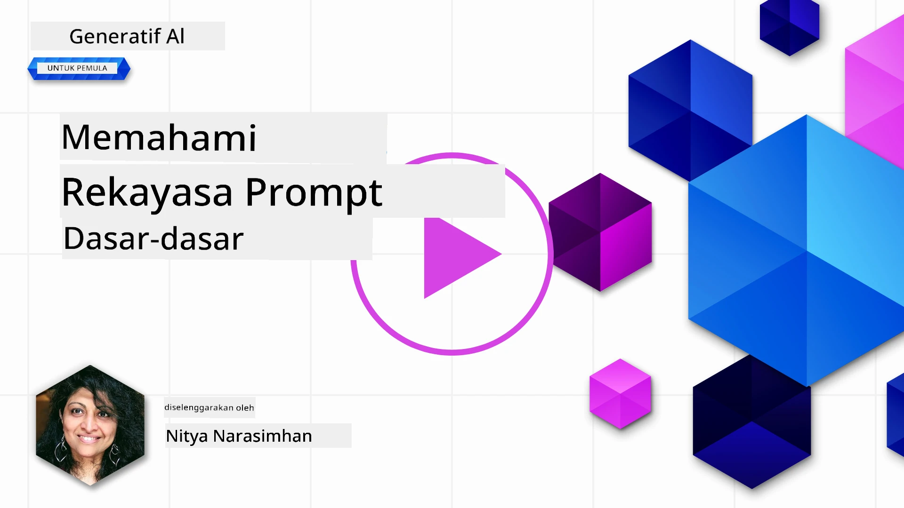
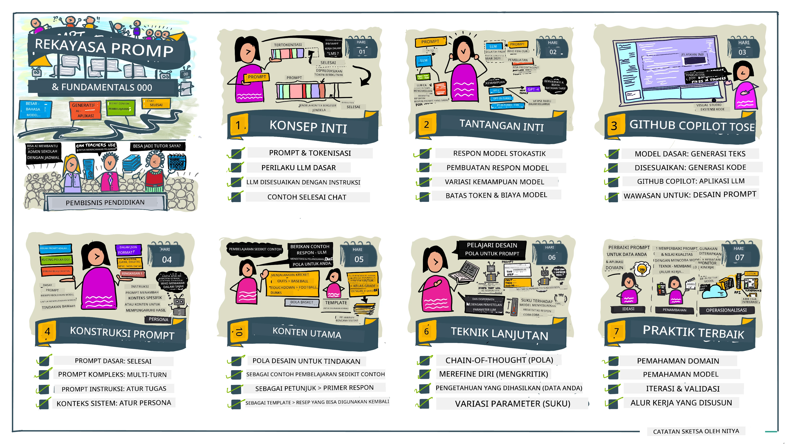
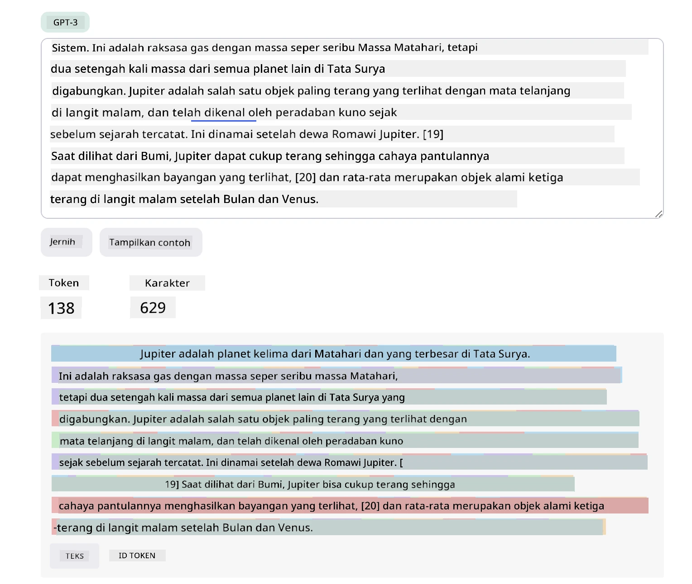
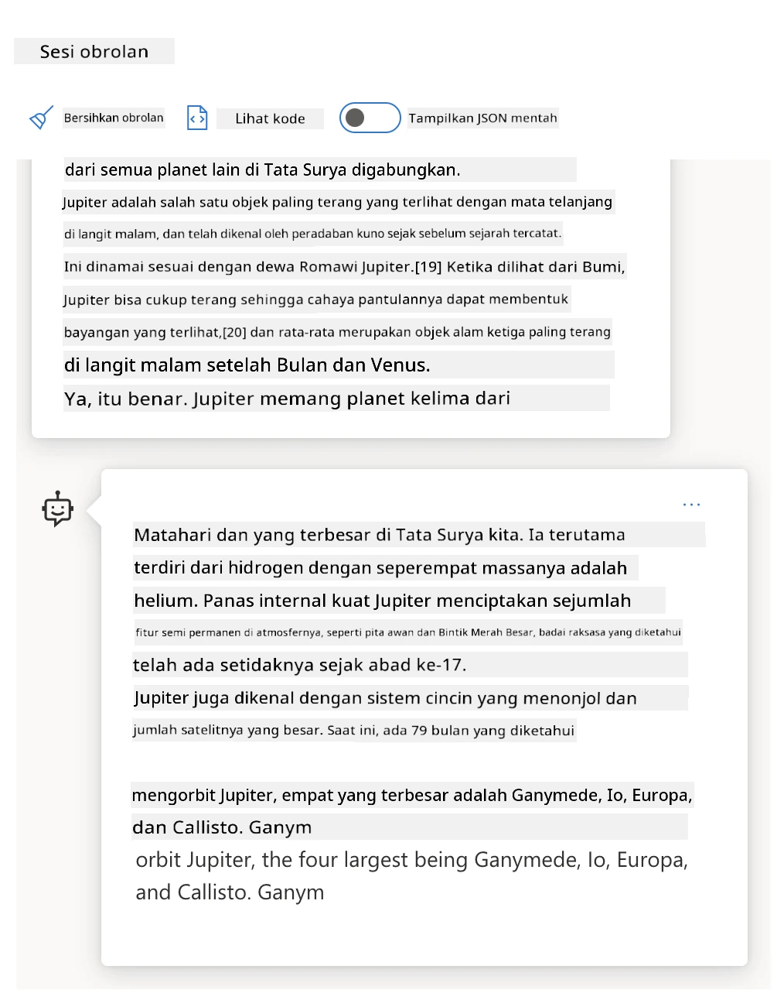
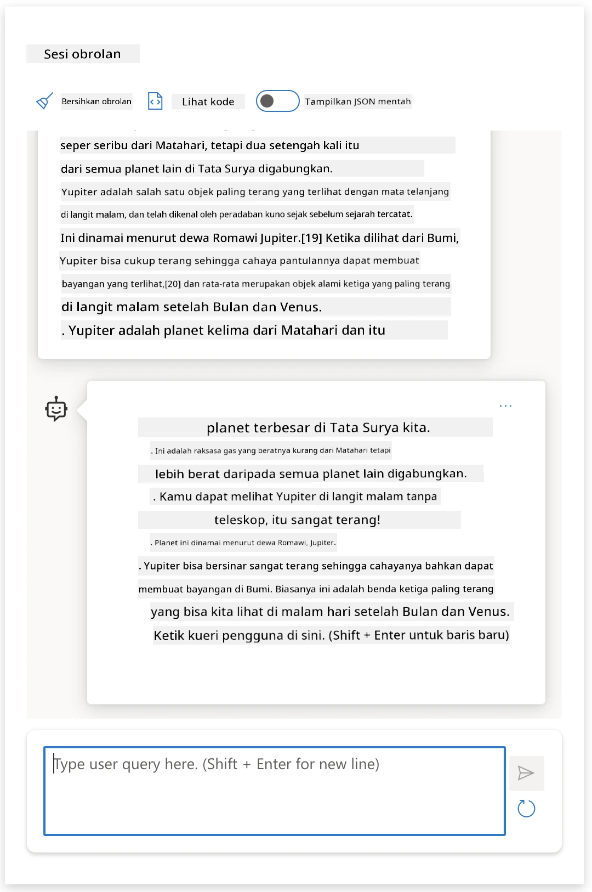
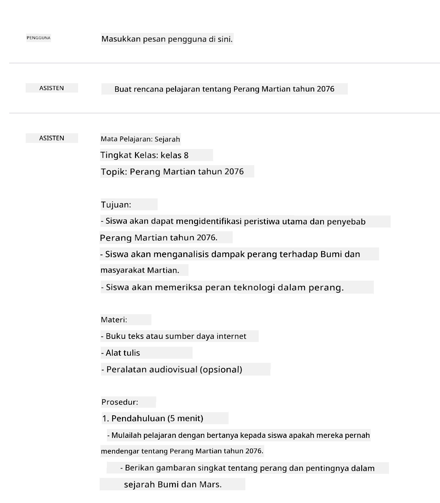
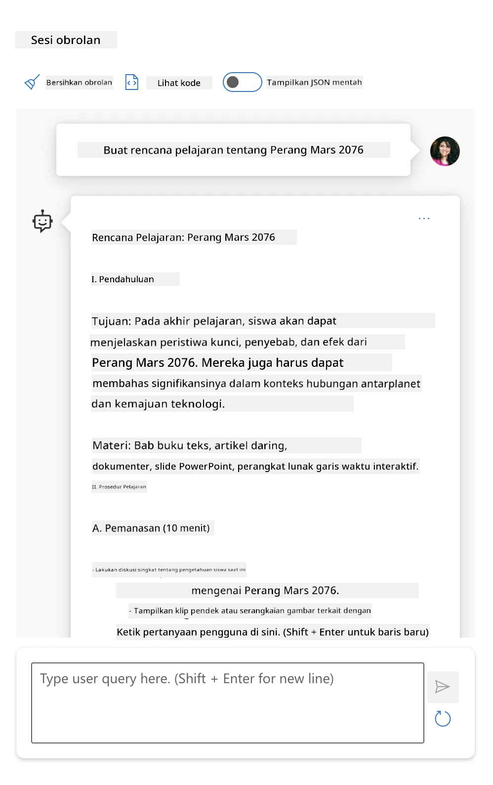
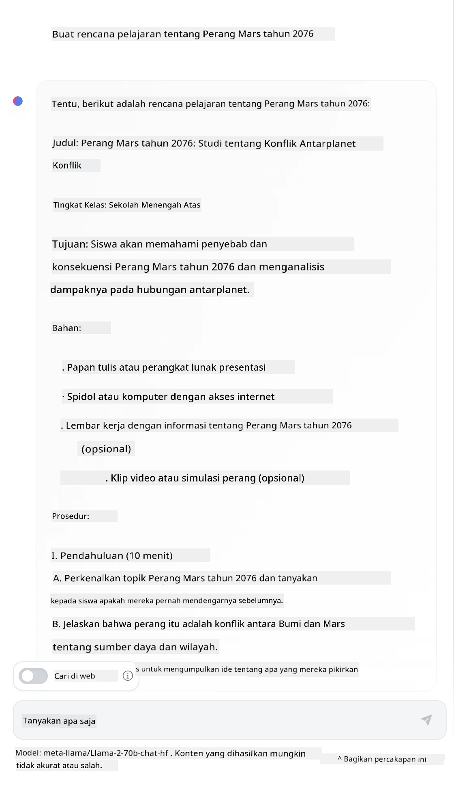

# Dasar-dasar Rekayasa Prompt

[](https://youtu.be/GElCu2kUlRs?si=qrXsBvXnCW12epb8)

## Pendahuluan
Modul ini membahas konsep dan teknik penting untuk membuat prompt yang efektif dalam model AI generatif. Cara Anda menulis prompt kepada LLM juga penting. Prompt yang dibuat dengan cermat dapat menghasilkan respons yang lebih berkualitas. Tetapi apa sebenarnya arti istilah seperti _prompt_ dan _rekayasa prompt_? Dan bagaimana saya dapat meningkatkan _input_ prompt yang saya kirim ke LLM? Pertanyaan-pertanyaan ini akan kita coba jawab dalam bab ini dan bab berikutnya.

_AI Generatif_ mampu menciptakan konten baru (misalnya, teks, gambar, audio, kode, dll.) sebagai respons terhadap permintaan pengguna. Hal ini dicapai dengan menggunakan _Model Bahasa Besar_ seperti seri GPT ("Generative Pre-trained Transformer") dari OpenAI yang dilatih menggunakan bahasa alami dan kode.

Pengguna kini dapat berinteraksi dengan model-model ini menggunakan paradigma yang familier seperti chat, tanpa memerlukan keahlian teknis atau pelatihan. Model tersebut _berbasis prompt_ - pengguna mengirimkan input teks (prompt) dan menerima tanggapan AI (penyelesaian). Mereka kemudian dapat "mengobrol dengan AI" secara iteratif, dalam percakapan multi-putaran, menyempurnakan prompt mereka hingga respons memenuhi harapan mereka.

"Prompt" kini menjadi _antarmuka pemrograman_ utama untuk aplikasi AI generatif, memberi tahu model apa yang harus dilakukan dan memengaruhi kualitas respons yang dikembalikan. "Rekayasa Prompt" adalah bidang studi yang berkembang pesat yang berfokus pada _perancangan dan pengoptimalan_ prompt untuk menghasilkan respons yang konsisten dan berkualitas dalam skala besar.

## Tujuan Pembelajaran

Dalam pelajaran ini, kita akan belajar apa itu Rekayasa Prompt, mengapa hal itu penting, dan bagaimana kita dapat merancang prompt yang lebih efektif untuk model dan tujuan aplikasi tertentu. Kita akan memahami konsep inti dan praktik terbaik dalam rekayasa prompt - serta belajar tentang lingkungan "sandbox" interaktif Jupyter Notebooks di mana konsep-konsep ini dapat diterapkan pada contoh nyata.

Pada akhir pelajaran ini kita akan dapat:

1. Menjelaskan apa itu rekayasa prompt dan mengapa itu penting.
2. Mendeskripsikan komponen prompt dan bagaimana mereka digunakan.
3. Mempelajari praktik terbaik dan teknik rekayasa prompt.
4. Menerapkan teknik yang dipelajari pada contoh nyata, menggunakan endpoint OpenAI.

## Istilah Kunci

Rekayasa Prompt: Praktik merancang dan menyempurnakan input untuk mengarahkan model AI agar menghasilkan output yang diinginkan.
Tokenisasi: Proses mengubah teks menjadi unit-unit lebih kecil, yang disebut token, yang dapat dipahami dan diproses oleh model.
LLM yang Disetel Instruksi: Model Bahasa Besar (LLM) yang telah disetel dengan instruksi spesifik untuk meningkatkan akurasi dan relevansi responsnya.

## Sandbox Pembelajaran

Rekayasa prompt saat ini lebih merupakan seni daripada ilmu. Cara terbaik untuk meningkatkan intuisi kita adalah dengan _berlatih lebih banyak_ dan mengadopsi pendekatan coba-coba yang menggabungkan keahlian domain aplikasi dengan teknik yang direkomendasikan dan pengoptimalan khusus model.

Jupyter Notebook yang menyertai pelajaran ini menyediakan lingkungan _sandbox_ di mana Anda dapat mencoba apa yang Anda pelajari - sambil berjalan atau sebagai bagian dari tantangan kode di akhir. Untuk menjalankan latihan, Anda memerlukan:

1. **Kunci API Azure OpenAI** - endpoint layanan untuk LLM yang sudah dipasang.
2. **Runtime Python** - tempat di mana Notebook dapat dijalankan.
3. **Variabel Lingkungan Lokal** - _selesaikan langkah-langkah [SETUP](./../00-course-setup/02-setup-local.md?WT.mc_id=academic-105485-koreyst) sekarang untuk bersiap-siap_.

Notebook ini dilengkapi dengan latihan _starter_ - tapi Anda didorong untuk menambahkan bagian _Markdown_ (deskripsi) dan _Code_ (permintaan prompt) Anda sendiri untuk mencoba lebih banyak contoh atau ide - dan membangun intuisi Anda tentang desain prompt.

## Panduan Bergambar

Ingin mendapatkan gambaran besar tentang apa yang dibahas pelajaran ini sebelum Anda menyelam masuk? Lihat panduan bergambar ini, yang memberi Anda pemahaman tentang topik utama yang dibahas dan poin-poin kunci untuk dipikirkan dalam setiap topik. Roadmap pelajaran membawa Anda dari pemahaman konsep inti dan tantangan hingga mengatasinya dengan teknik rekayasa prompt dan praktik terbaik yang relevan. Perhatikan bahwa bagian "Teknik Lanjutan" dalam panduan ini merujuk pada konten yang dibahas dalam bab _berikutnya_ dari kurikulum ini.



## Startup Kami

Sekarang, mari kita bicarakan bagaimana _topik ini_ terkait dengan misi startup kami untuk [membawa inovasi AI ke pendidikan](https://educationblog.microsoft.com/2023/06/collaborating-to-bring-ai-innovation-to-education?WT.mc_id=academic-105485-koreyst). Kami ingin membangun aplikasi bertenaga AI untuk _pembelajaran yang dipersonalisasi_ - jadi mari kita pikirkan bagaimana pengguna berbeda dari aplikasi kami mungkin "merancang" prompt:

- **Administrator** mungkin meminta AI untuk _menganalisis data kurikulum guna mengidentifikasi kekurangan dalam cakupan_. AI dapat meringkas hasil atau memvisualisasikannya dengan kode.
- **Pendidik** mungkin meminta AI untuk _menghasilkan rencana pelajaran untuk audiens dan topik tertentu_. AI dapat membangun rencana personalisasi dalam format yang ditentukan.
- **Siswa** mungkin meminta AI untuk _membimbing mereka dalam mata pelajaran yang sulit_. AI kini dapat membimbing siswa dengan pelajaran, petunjuk & contoh yang disesuaikan dengan tingkat mereka.

Itu baru permulaan. Lihat [Prompts For Education](https://github.com/microsoft/prompts-for-edu/tree/main?WT.mc_id=academic-105485-koreyst) - perpustakaan prompt open-source yang dikurasi oleh para ahli pendidikan - untuk mendapatkan gambaran lebih luas tentang kemungkinannya! _Cobalah menjalankan beberapa prompt tersebut di sandbox atau menggunakan OpenAI Playground untuk melihat apa yang terjadi!_

<!--
TEMPLATE PELAJARAN:
Unit ini harus membahas konsep inti #1.
Perkuat konsep dengan contoh dan referensi.

KONSEP #1:
Rekayasa Prompt.
Definisikan dan jelaskan mengapa itu diperlukan.
-->

## Apa itu Rekayasa Prompt?

Kita memulai pelajaran ini dengan mendefinisikan **Rekayasa Prompt** sebagai proses _merancang dan mengoptimalkan_ input teks (prompt) untuk menghasilkan respons (penyelesaian) yang konsisten dan berkualitas sesuai tujuan aplikasi dan model tertentu. Kita bisa menganggap ini sebagai proses dua langkah:

- _merancang_ prompt awal untuk model dan tujuan tertentu
- _menyempurnakan_ prompt secara iteratif untuk meningkatkan kualitas respons

Ini adalah proses coba-coba yang memerlukan intuisi pengguna dan upaya untuk mendapatkan hasil optimal. Jadi mengapa ini penting? Untuk menjawab pertanyaan itu, kita perlu memahami tiga konsep:

- _Tokenisasi_ = bagaimana model "melihat" prompt
- _Base LLMs_ = bagaimana model dasar "memproses" prompt
- _Instruction-Tuned LLMs_ = bagaimana model kini dapat melihat "tugas"

### Tokenisasi

Sebuah LLM melihat prompt sebagai _urutan token_ di mana model yang berbeda (atau versi model) dapat meng-tokenisasi prompt yang sama dengan cara berbeda. Karena LLM dilatih berdasarkan token (bukan teks mentah), cara prompt di-tokenisasi berpengaruh langsung pada kualitas respons yang dihasilkan.

Untuk mendapatkan intuisi tentang cara kerja tokenisasi, coba alat seperti [OpenAI Tokenizer](https://platform.openai.com/tokenizer?WT.mc_id=academic-105485-koreyst) yang ditunjukkan di bawah. Salin prompt Anda - dan lihat bagaimana prompt tersebut diubah menjadi token, perhatikan bagaimana karakter spasi dan tanda baca ditangani. Perlu dicatat bahwa contoh ini menunjukkan LLM yang lebih lama (GPT-3) - jadi mencoba ini dengan model yang lebih baru mungkin menghasilkan hasil yang berbeda.



### Konsep: Model Fondasi

Setelah prompt di-tokenisasi, fungsi utama ["Base LLM"](https://blog.gopenai.com/an-introduction-to-base-and-instruction-tuned-large-language-models-8de102c785a6?WT.mc_id=academic-105485-koreyst) (atau model fondasi) adalah memprediksi token berikutnya dalam urutan itu. Karena LLM dilatih pada dataset teks besar, mereka memiliki pemahaman statistik yang baik tentang hubungan antar token dan dapat membuat prediksi dengan tingkat keyakinan tertentu. Perlu dicatat bahwa mereka tidak memahami _makna_ dari kata-kata dalam prompt atau token; mereka hanya melihat pola yang dapat mereka "selesaikan" dengan prediksi berikutnya. Mereka dapat terus memprediksi urutan hingga dihentikan oleh intervensi pengguna atau kondisi yang telah ditentukan.

Ingin melihat bagaimana penyelesaian berbasis prompt bekerja? Masukkan prompt di atas ke [Microsoft Foundry playground](https://ai.azure.com?WT.mc_id=academic-105485-koreyst) dengan pengaturan default. Sistem dikonfigurasi untuk memperlakukan prompt sebagai permintaan informasi - jadi Anda akan melihat penyelesaian yang sesuai dengan konteks ini.

Tapi bagaimana jika pengguna ingin melihat sesuatu yang spesifik yang memenuhi kriteria atau tujuan tugas tertentu? Di sinilah LLM yang _disetel instruksi_ masuk ke gambar.



### Konsep: LLM yang Disetel Instruksi

Sebuah [Instruction Tuned LLM](https://blog.gopenai.com/an-introduction-to-base-and-instruction-tuned-large-language-models-8de102c785a6?WT.mc_id=academic-105485-koreyst) dimulai dengan model fondasi dan menyetel ulang dengan contoh atau pasangan input/output (misalnya, "pesan" multi-putaran) yang dapat berisi instruksi jelas - dan respons dari AI berusaha mengikuti instruksi tersebut.

Ini menggunakan teknik seperti Reinforcement Learning with Human Feedback (RLHF) yang dapat melatih model untuk _mengikuti instruksi_ dan _belajar dari umpan balik_ sehingga menghasilkan respons yang lebih cocok untuk aplikasi praktis dan lebih relevan dengan tujuan pengguna.

Mari coba - ulangi prompt di atas, tetapi sekarang ubah _pesan sistem_ untuk memberikan instruksi berikut sebagai konteks:

> _Ringkas konten yang Anda berikan untuk siswa kelas dua. Batasi hasilnya menjadi satu paragraf dengan 3-5 poin peluru._

Lihat bagaimana hasilnya kini disesuaikan untuk mencerminkan tujuan dan format yang diinginkan? Seorang pendidik dapat langsung menggunakan respons ini dalam slide mereka untuk kelas tersebut.



## Mengapa kita membutuhkan Rekayasa Prompt?

Sekarang kita tahu bagaimana prompt diproses oleh LLM, mari kita bahas _mengapa_ kita membutuhkan rekayasa prompt. Jawabannya terletak pada fakta bahwa LLM saat ini menghadapi sejumlah tantangan yang membuat _penyelesaian yang dapat diandalkan dan konsisten_ sulit diperoleh tanpa usaha dalam konstruksi dan pengoptimalan prompt. Misalnya:

1. **Respons model bersifat stokastik.** _Prompt yang sama_ kemungkinan akan menghasilkan respons berbeda dengan model atau versi model yang berbeda. Dan bahkan dapat menghasilkan hasil berbeda dengan _model yang sama_ pada waktu yang berbeda. _Teknik rekayasa prompt dapat membantu meminimalkan variasi ini dengan menyediakan pembatas yang lebih baik_.

1. **Model dapat membuat respons palsu.** Model dilatih dengan dataset _besar tapi terbatas_, artinya mereka tidak mengetahui konsep di luar ruang lingkup pelatihan tersebut. Akibatnya, mereka dapat menghasilkan penyelesaian yang tidak akurat, imajinatif, atau bahkan bertentangan langsung dengan fakta yang diketahui. _Teknik rekayasa prompt membantu pengguna mengidentifikasi dan mengatasi fabrikasi semacam itu, misalnya dengan meminta AI untuk menyertakan kutipan atau alasan_.

1. **Kemampuan model akan bervariasi.** Model atau generasi model terbaru akan memiliki kemampuan lebih kaya namun juga membawa keunikan dan kompromi dalam biaya & kompleksitas. _Rekayasa prompt dapat membantu kita mengembangkan praktik terbaik dan alur kerja yang mengabstraksi perbedaan dan beradaptasi dengan kebutuhan spesifik model secara skala besar dan mulus_.

Mari lihat ini dalam aksi di OpenAI atau Azure OpenAI Playground:

- Gunakan prompt yang sama dengan deployment LLM berbeda (misal, OpenAI, Azure OpenAI, Hugging Face) - apakah Anda melihat variasinya?
- Gunakan prompt yang sama berulang kali dengan _deployment_ LLM yang _sama_ (misal, playground Azure OpenAI) - bagaimana variasi tersebut berbeda?

### Contoh Fabrikasi

Dalam kursus ini, kami menggunakan istilah **"fabrikasi"** untuk merujuk pada fenomena di mana LLM kadang menghasilkan informasi yang secara faktual salah karena keterbatasan pelatihan atau kendala lainnya. Anda mungkin juga pernah mendengar ini disebut sebagai _"halusinasi"_ dalam artikel populer atau makalah riset. Namun, kami sangat menyarankan menggunakan istilah _"fabrikasi"_ agar kita tidak keliru memberikannya sifat manusiawi pada hasil mesin. Ini juga memperkuat [panduan AI yang Bertanggung Jawab](https://www.microsoft.com/ai/responsible-ai?WT.mc_id=academic-105485-koreyst) dari sudut pandang terminologi, menghapus istilah yang mungkin dianggap ofensif atau tidak inklusif dalam beberapa konteks.

Ingin merasakan bagaimana fabrikasi bekerja? Pikirkan sebuah prompt yang menginstruksikan AI untuk membuat konten tentang topik yang tidak ada (agar tidak ditemukan dalam dataset pelatihan). Misalnya - saya mencoba prompt ini:

> **Prompt:** buat rencana pelajaran tentang Perang Mars pada tahun 2076.

Pencarian web menunjukkan bahwa ada cerita fiksi (misalnya, seri televisi atau buku) tentang perang Mars - tapi tidak ada yang terjadi pada tahun 2076. Akal sehat juga memberitahu kita bahwa 2076 adalah _masa depan_ sehingga tidak bisa dikaitkan dengan peristiwa nyata.


Jadi apa yang terjadi ketika kita menjalankan prompt ini dengan penyedia LLM yang berbeda?

> **Respon 1**: OpenAI Playground (GPT-35)



> **Respon 2**: Azure OpenAI Playground (GPT-35)



> **Respon 3**: : Hugging Face Chat Playground (LLama-2)



Seperti yang diharapkan, setiap model (atau versi model) menghasilkan respon yang sedikit berbeda berkat perilaku stokastik dan variasi kemampuan model. Misalnya, satu model menargetkan audiens kelas 8 sementara yang lain mengasumsikan siswa sekolah menengah. Namun ketiga model tersebut menghasilkan respon yang dapat meyakinkan pengguna yang tidak terinformasi bahwa peristiwa tersebut nyata.

Teknik rekayasa prompt seperti _metaprompting_ dan _konfigurasi temperature_ dapat mengurangi fabrikasi model sampai tingkat tertentu. Arsitektur rekayasa prompt baru juga memasukkan alat dan teknik baru secara mulus ke dalam alur prompt, untuk mengurangi atau memitigasi beberapa efek tersebut.

## Studi Kasus: GitHub Copilot

Mari kita tutup bagian ini dengan mendapatkan gambaran tentang bagaimana rekayasa prompt digunakan dalam solusi dunia nyata dengan melihat satu Studi Kasus: [GitHub Copilot](https://github.com/features/copilot?WT.mc_id=academic-105485-koreyst).

GitHub Copilot adalah "Pasangan Pemrogram AI" Anda - mengubah prompt teks menjadi penyelesaian kode dan terintegrasi dalam lingkungan pengembangan Anda (misalnya, Visual Studio Code) untuk pengalaman pengguna yang mulus. Seperti yang didokumentasikan dalam rangkaian blog di bawah ini, versi awalnya didasarkan pada model OpenAI Codex - dengan insinyur yang dengan cepat menyadari kebutuhan untuk menyempurnakan model dan mengembangkan teknik rekayasa prompt yang lebih baik, untuk meningkatkan kualitas kode. Pada bulan Juli, mereka [memperkenalkan model AI yang ditingkatkan yang melampaui Codex](https://github.blog/2023-07-28-smarter-more-efficient-coding-github-copilot-goes-beyond-codex-with-improved-ai-model/?WT.mc_id=academic-105485-koreyst) untuk saran yang lebih cepat.

Baca postingan secara berurutan, untuk mengikuti perjalanan pembelajaran mereka.

- **Mei 2023** | [GitHub Copilot Semakin Baik Memahami Kode Anda](https://github.blog/2023-05-17-how-github-copilot-is-getting-better-at-understanding-your-code/?WT.mc_id=academic-105485-koreyst)
- **Mei 2023** | [Inside GitHub: Bekerja dengan LLM di balik GitHub Copilot](https://github.blog/2023-05-17-inside-github-working-with-the-llms-behind-github-copilot/?WT.mc_id=academic-105485-koreyst).
- **Jun 2023** | [Cara menulis prompt yang lebih baik untuk GitHub Copilot](https://github.blog/2023-06-20-how-to-write-better-prompts-for-github-copilot/?WT.mc_id=academic-105485-koreyst).
- **Jul 2023** | [.. GitHub Copilot melampaui Codex dengan model AI yang ditingkatkan](https://github.blog/2023-07-28-smarter-more-efficient-coding-github-copilot-goes-beyond-codex-with-improved-ai-model/?WT.mc_id=academic-105485-koreyst)
- **Jul 2023** | [Panduan Pengembang untuk Rekayasa Prompt dan LLM](https://github.blog/2023-07-17-prompt-engineering-guide-generative-ai-llms/?WT.mc_id=academic-105485-koreyst)
- **Sep 2023** | [Cara membangun aplikasi LLM perusahaan: Pelajaran dari GitHub Copilot](https://github.blog/2023-09-06-how-to-build-an-enterprise-llm-application-lessons-from-github-copilot/?WT.mc_id=academic-105485-koreyst)

Anda juga dapat menjelajahi [blog Rekayasa mereka](https://github.blog/category/engineering/?WT.mc_id=academic-105485-koreyst) untuk lebih banyak posting seperti [ini](https://github.blog/2023-09-27-how-i-used-github-copilot-chat-to-build-a-reactjs-gallery-prototype/?WT.mc_id=academic-105485-koreyst) yang menunjukkan bagaimana model dan teknik ini _diterapkan_ untuk mendorong aplikasi dunia nyata.

---

<!--
TEMPLATE PELAJARAN:
Unit ini harus mencakup konsep inti #2.
Perkuat konsep dengan contoh dan referensi.

KONSEP #2:
Desain Prompt.
Diilustrasikan dengan contoh.
-->

## Konstruksi Prompt

Kita telah melihat mengapa rekayasa prompt itu penting - sekarang mari kita pahami bagaimana prompt _dibangun_ sehingga kita dapat mengevaluasi berbagai teknik untuk desain prompt yang lebih efektif.

### Prompt Dasar

Mari mulai dengan prompt dasar: input teks yang dikirim ke model tanpa konteks lain. Berikut contohnya - ketika kita mengirimkan beberapa kata pertama dari lagu kebangsaan AS ke OpenAI [Completion API](https://platform.openai.com/docs/api-reference/completions?WT.mc_id=academic-105485-koreyst) model langsung _melengkapi_ respon dengan beberapa baris berikutnya, menggambarkan perilaku prediksi dasar.

| Prompt (Input)     | Penyelesaian (Output)                                                                                                                        |
| :----------------- | :----------------------------------------------------------------------------------------------------------------------------------------- |
| Oh say can you see | Kelihatannya kamu mulai menyanyikan lirik "The Star-Spangled Banner," lagu kebangsaan Amerika Serikat. Lirik lengkapnya adalah ...           |

### Prompt Kompleks

Sekarang mari tambahkan konteks dan instruksi ke prompt dasar tersebut. [Chat Completion API](https://learn.microsoft.com/azure/ai-services/openai/how-to/chatgpt?WT.mc_id=academic-105485-koreyst) memungkinkan kita membangun prompt kompleks sebagai kumpulan _pesan_ dengan:

- Pasangan input/output yang mencerminkan input _pengguna_ dan respon _asisten_.
- Pesan sistem yang menetapkan konteks untuk perilaku atau kepribadian asisten.

Permintaan sekarang dalam bentuk di bawah ini, di mana _tokenisasi_ secara efektif menangkap informasi relevan dari konteks dan percakapan. Kini, mengubah konteks sistem dapat sepenting kualitas penyelesaian, seperti juga input pengguna yang diberikan.

```python
response = client.responses.create(
    model="gpt-4o-mini",
    input=[
        {"role": "system", "content": "You are a helpful assistant."},
        {"role": "user", "content": "Who won the world series in 2020?"},
        {"role": "assistant", "content": "The Los Angeles Dodgers won the World Series in 2020."},
        {"role": "user", "content": "Where was it played?"}
    ]
)
```

### Prompt Instruksi

Dalam contoh di atas, prompt pengguna adalah kueri teks sederhana yang dapat diartikan sebagai permintaan informasi. Dengan prompt _instruksi_, kita dapat menggunakan teks tersebut untuk menentukan tugas secara lebih rinci, memberikan panduan yang lebih baik kepada AI. Berikut contohnya:

| Prompt (Input)                                                                                                                                                                                                                         | Penyelesaian (Output)                                                                                                        | Jenis Instruksi    |
| :------------------------------------------------------------------------------------------------------------------------------------------------------------------------------------------------------------------------------------- | :------------------------------------------------------------------------------------------------------------------------- | :------------------ |
| Tulislah deskripsi Perang Saudara                                                                                                                                                                                                   | _mengembalikan paragraf sederhana_                                                                                          | Sederhana           |
| Tulislah deskripsi Perang Saudara. Berikan tanggal dan peristiwa kunci serta jelaskan pentingnya                                                                                                                                    | _mengembalikan paragraf diikuti daftar tanggal peristiwa penting dengan deskripsi_                                           | Kompleks            |
| Tulislah deskripsi Perang Saudara dalam 1 paragraf. Berikan 3 poin dengan tanggal dan pentingnya. Berikan 3 poin lagi dengan tokoh sejarah utama dan kontribusinya. Kembalikan hasil sebagai file JSON | _mengembalikan detail lebih luas dalam kotak teks, diformat sebagai JSON yang bisa Anda salin-tempel ke file dan validasi sesuai kebutuhan_ | Kompleks. Diformat.|

## Konten Utama

Dalam contoh di atas, prompt masih cukup terbuka, membiarkan LLM memilih bagian dataset latihannya yang relevan. Dengan pola desain _konten utama_, teks input dibagi menjadi dua bagian:

- sebuah instruksi (aksi)
- konten relevan (yang mempengaruhi aksi)

Berikut contohnya di mana instruksinya adalah "ringkas ini dalam 2 kalimat".

| Prompt (Input)                                                                                                                                                                                                                                                                                                                                                                                                                                                                                                                                                                                                                                                                                      | Penyelesaian (Output)                                                                                                                                                                                                                                                                             |
| :-------------------------------------------------------------------------------------------------------------------------------------------------------------------------------------------------------------------------------------------------------------------------------------------------------------------------------------------------------------------------------------------------------------------------------------------------------------------------------------------------------------------------------------------------------------------------------------------------------------------------------------------------------------------------------------------------- | :---------------------------------------------------------------------------------------------------------------------------------------------------------------------------------------------------------------------------------------------------------------------------------------------- |
| Jupiter adalah planet kelima dari Matahari dan terbesar di Tata Surya. Ini adalah raksasa gas dengan massa seribu kali lebih kecil dari Matahari, namun dua setengah kali massa semua planet lain di Tata Surya digabungkan. Jupiter adalah salah satu objek paling terang yang terlihat mata telanjang di langit malam, dan dikenal oleh peradaban kuno sejak sebelum sejarah tercatat. Dinamakan dari dewa Romawi Jupiter.[19] Saat dilihat dari Bumi, Jupiter bisa cukup terang sehingga cahaya pantulannya dapat memunculkan bayangan yang terlihat,[20] dan rata-rata merupakan objek alami ketiga terterang di langit malam setelah Bulan dan Venus. <br/> **Ringkas ini dalam 2 kalimat singkat** | Jupiter, planet kelima dari Matahari, adalah yang terbesar di Tata Surya dan dikenal sebagai salah satu objek paling terang di langit malam. Dinamakan dari dewa Romawi Jupiter, itu adalah raksasa gas dengan massa dua setengah kali dari semua planet lain di Tata Surya digabungkan. |

Segmen konten utama dapat digunakan dengan berbagai cara untuk mendorong instruksi yang lebih efektif:

- **Contoh** - bukan memberitahu model apa yang harus dilakukan dengan instruksi eksplisit, berikan contoh apa yang harus dilakukan dan biarkan ia menebak pola.
- **Isyarat** - ikuti instruksi dengan "isyarat" yang memicu penyelesaian, mengarahkan model ke respon yang lebih relevan.
- **Template** - ini adalah 'resep' berulang untuk prompt dengan placeholder (variabel) yang bisa disesuaikan dengan data untuk kasus penggunaan tertentu.

Mari kita jelajahi ini dalam praktek.

### Menggunakan Contoh

Ini adalah pendekatan di mana Anda menggunakan konten utama untuk "memberi makan model" beberapa contoh output yang diinginkan untuk instruksi tertentu, dan membiarkannya menebak pola output yang diinginkan. Berdasarkan jumlah contoh yang diberikan, kita dapat memiliki prompting nol tembakan, satu tembakan, beberapa tembakan, dll.

Prompt sekarang terdiri dari tiga komponen:

- Deskripsi tugas
- Beberapa contoh output yang diinginkan
- Awal contoh baru (yang menjadi deskripsi tugas implisit)

| Jenis Pembelajaran | Prompt (Input)                                                                                                                                        | Penyelesaian (Output)         |
| :----------------- | :---------------------------------------------------------------------------------------------------------------------------------------------------- | :---------------------------- |
| Nol tembakan       | "The Sun is Shining". Terjemahkan ke dalam bahasa Spanyol                                                                                           | "El Sol está brillando".      |
| Satu tembakan      | "The Sun is Shining" => ""El Sol está brillando". <br> "It's a Cold and Windy Day" =>                                                                 | "Es un día frío y ventoso".   |
| Beberapa tembakan  | The player ran the bases => Baseball <br/> The player hit an ace => Tennis <br/> The player hit a six => Cricket <br/> The player made a slam-dunk =>    | Basketball                    |
|                   |                                                                                                                                                       |                              |

Perhatikan bagaimana kita harus memberikan instruksi eksplisit ("Terjemahkan ke Spanyol") dalam prompting nol tembakan, tapi itu ditangkap secara implisit dalam contoh satu tembakan. Contoh beberapa tembakan menunjukkan bagaimana menambahkan lebih banyak contoh memungkinkan model membuat inferensi yang lebih akurat tanpa instruksi tambahan.

### Isyarat Prompt

Teknik lain untuk menggunakan konten utama adalah memberikan _isyarat_ alih-alih contoh. Dalam kasus ini, kita memberi dorongan kepada model dengan _memulainya_ dengan cuplikan yang mencerminkan format jawaban yang diinginkan. Model kemudian "mengikuti isyarat" tersebut untuk melanjutkan dengan pola yang sama.

| Jumlah Isyarat | Prompt (Input)                                                                                                                                                                                                                                                                                                                                                                                                                                               | Penyelesaian (Output)                                                                                                                                                                                                                                                                                       |
| :------------- | :----------------------------------------------------------------------------------------------------------------------------------------------------------------------------------------------------------------------------------------------------------------------------------------------------------------------------------------------------------------------------------------------------------------------------------------------------------- | :-------------------------------------------------------------------------------------------------------------------------------------------------------------------------------------------------------------------------------------------------------------------------------------------------------- |
| 0              | Jupiter adalah planet kelima dari Matahari dan terbesar di Tata Surya. Ini adalah raksasa gas dengan massa seribu kali lebih kecil dari Matahari, namun dua setengah kali massa semua planet lain di Tata Surya digabungkan. Jupiter adalah salah satu objek paling terang yang terlihat mata telanjang di langit malam, dan dikenal oleh peradaban kuno sejak sebelum sejarah tercatat. <br/>**Ringkas Ini**                                       | Jupiter adalah planet terbesar di Tata Surya kita dan yang kelima dari Matahari. Ia adalah raksasa gas dengan massa 1/1000 dari Matahari, tapi lebih berat daripada semua planet lain digabungkan. Peradaban kuno telah lama mengenal Jupiter, dan planet ini mudah terlihat di langit malam. |
| 1              | Jupiter adalah planet kelima dari Matahari dan terbesar di Tata Surya. Ini adalah raksasa gas dengan massa seribu kali lebih kecil dari Matahari, namun dua setengah kali massa semua planet lain di Tata Surya digabungkan. Jupiter adalah salah satu objek paling terang yang terlihat mata telanjang di langit malam, dan dikenal oleh peradaban kuno sejak sebelum sejarah tercatat. <br/>**Ringkas Ini** <br/> Apa yang kita pelajari adalah bahwa Jupiter | adalah planet kelima dari Matahari dan terbesar di Tata Surya. Ini adalah raksasa gas dengan massa seribu kali lebih kecil dari Matahari, namun dua setengah kali massa semua planet lain digabungkan. Ia mudah terlihat dengan mata telanjang dan telah dikenal sejak zaman kuno.                        |

| 2              | Jupiter adalah planet kelima dari Matahari dan terbesar di Tata Surya. Ia adalah raksasa gas dengan massa seper seribu dari Matahari, tetapi dua setengah kali massa semua planet lain di Tata Surya jika digabungkan. Jupiter adalah salah satu objek paling terang yang terlihat dengan mata telanjang di langit malam, dan telah dikenal oleh peradaban kuno sejak sebelum sejarah tercatat. <br/>**Ringkas Ini** <br/> 3 Fakta Teratas yang Kami Pelajari:         | 1. Jupiter adalah planet kelima dari Matahari dan terbesar di Tata Surya. <br/> 2. Ia adalah raksasa gas dengan massa seper seribu dari Matahari...<br/> 3. Jupiter telah terlihat dengan mata telanjang sejak zaman kuno ...                                                                       |
|                |                                                                                                                                                                                                                                                                                                                                                                                                                                                              |                                                                                                                                                                                                                                                                                                           |

### Prompt Templates

Template prompt adalah _resep yang telah ditentukan sebelumnya untuk sebuah prompt_ yang dapat disimpan dan digunakan kembali sesuai kebutuhan, untuk mengarahkan pengalaman pengguna yang lebih konsisten dalam skala besar. Dalam bentuk paling sederhana, ini hanyalah kumpulan contoh prompt seperti [yang satu ini dari OpenAI](https://cookbook.openai.com/examples/gpt4-1_prompting_guide?WT.mc_id=academic-105485-koreyst) yang menyediakan komponen prompt interaktif (pesan pengguna dan sistem) serta format permintaan yang didorong oleh API - untuk mendukung penggunaan ulang.

Dalam bentuk yang lebih kompleks seperti [contoh ini dari LangChain](https://python.langchain.com/docs/concepts/prompt_templates/?WT.mc_id=academic-105485-koreyst) berisi _placeholder_ yang dapat diganti dengan data dari berbagai sumber (masukan pengguna, konteks sistem, sumber data eksternal, dll.) untuk menghasilkan prompt secara dinamis. Ini memungkinkan kita membuat perpustakaan prompt yang dapat digunakan kembali yang dapat digunakan untuk mengarahkan pengalaman pengguna yang konsisten secara **programatik** dalam skala.

Akhirnya, nilai sesungguhnya dari template terletak pada kemampuannya untuk membuat dan menerbitkan _perpustakaan prompt_ untuk domain aplikasi vertikal - di mana template prompt sekarang _dioptimalkan_ untuk mencerminkan konteks atau contoh khusus aplikasi yang membuat tanggapan lebih relevan dan akurat untuk audiens pengguna yang ditargetkan. Repositori [Prompts For Edu](https://github.com/microsoft/prompts-for-edu?WT.mc_id=academic-105485-koreyst) adalah contoh hebat dari pendekatan ini, mengkurasi perpustakaan prompt untuk domain pendidikan dengan penekanan pada tujuan utama seperti perencanaan pelajaran, desain kurikulum, pembimbingan siswa, dll.

## Supporting Content

Jika kita memikirkan konstruksi prompt sebagai memiliki instruksi (tugas) dan target (konten utama), maka _konten sekunder_ seperti konteks tambahan yang kita berikan untuk **mempengaruhi keluaran dengan cara tertentu**. Bisa berupa parameter pengaturan, instruksi format, taksonomi topik, dll. yang dapat membantu model _menyesuaikan_ responsnya agar sesuai dengan tujuan atau ekspektasi pengguna yang diinginkan.

Contohnya: Diberikan katalog mata kuliah dengan metadata lengkap (nama, deskripsi, tingkat, tag metadata, instruktur, dll.) pada semua mata kuliah yang tersedia dalam kurikulum:

- kita dapat menentukan instruksi untuk "meringkas katalog mata kuliah untuk Musim Gugur 2023"
- kita dapat menggunakan konten utama untuk memberi beberapa contoh keluaran yang diinginkan
- kita dapat menggunakan konten sekunder untuk mengidentifikasi 5 "tag" utama yang diminati.

Sekarang, model dapat memberikan ringkasan dalam format yang ditunjukkan oleh beberapa contoh tersebut - tetapi jika hasil memiliki beberapa tag, model dapat memprioritaskan 5 tag yang diidentifikasi dalam konten sekunder.

---

<!--
TEMPLATE PELAJARAN:
Unit ini harus mencakup konsep inti #1.
Perkuat konsep dengan contoh dan referensi.

KONSEP #3:
Teknik Rekayasa Prompt.
Apa saja teknik dasar untuk rekayasa prompt?
Ilustrasikan dengan beberapa latihan.
-->

## Praktik Terbaik dalam Prompting

Sekarang kita tahu bagaimana prompt dapat _dibangun_, kita dapat mulai memikirkan bagaimana _merancang_ mereka untuk mencerminkan praktik terbaik. Kita dapat memikirkannya dalam dua bagian - memiliki _pola pikir_ yang tepat dan menerapkan _teknik_ yang tepat.

### Pola Pikir Rekayasa Prompt

Rekayasa prompt adalah proses coba-coba jadi ingat tiga faktor panduan luas ini:

1. **Pemahaman Domain Penting.** Akurasi dan relevansi respons bergantung pada _domain_ di mana aplikasi atau pengguna beroperasi. Terapkan intuisi dan keahlian domain Anda untuk **menyesuaikan teknik** lebih lanjut. Misalnya, definisikan _kepribadian khusus domain_ dalam prompt sistem Anda, atau gunakan _template khusus domain_ dalam prompt pengguna Anda. Berikan konten sekunder yang mencerminkan konteks khusus domain, atau gunakan _petunjuk dan contoh khusus domain_ untuk mengarahkan model ke pola penggunaan yang familiar.

2. **Pemahaman Model Penting.** Kita tahu model bersifat stokastik secara alami. Tetapi implementasi model juga dapat bervariasi dalam hal dataset pelatihan yang mereka gunakan (pengetahuan pra-pelatihan), kemampuan yang mereka sediakan (misal, lewat API atau SDK) dan jenis konten yang mereka optimalkan (misalnya, kode vs. gambar vs. teks). Pahami kekuatan dan keterbatasan model yang Anda gunakan, dan gunakan pengetahuan itu untuk _memprioritaskan tugas_ atau membangun _template khusus_ yang dioptimalkan untuk kemampuan model.

3. **Iterasi & Validasi Penting.** Model terus berkembang pesat, begitu juga teknik rekayasa prompt. Sebagai ahli domain, Anda mungkin memiliki konteks atau kriteria lain untuk aplikasi _Anda_ secara khusus, yang mungkin tidak berlaku untuk komunitas luas. Gunakan alat & teknik rekayasa prompt untuk "memulai" konstruksi prompt, lalu iterasikan dan validasi hasil menggunakan intuisi dan keahlian domain Anda sendiri. Catat wawasan dan buatlah **basis pengetahuan** (misal, perpustakaan prompt) yang dapat digunakan sebagai baseline baru oleh orang lain, untuk iterasi lebih cepat di masa depan.

## Praktik Terbaik

Sekarang mari kita lihat praktik terbaik yang umum direkomendasikan oleh para praktisi [OpenAI](https://help.openai.com/en/articles/6654000-best-practices-for-prompt-engineering-with-openai-api?WT.mc_id=academic-105485-koreyst) dan [Azure OpenAI](https://learn.microsoft.com/azure/ai-services/openai/concepts/prompt-engineering#best-practices?WT.mc_id=academic-105485-koreyst).

| Apa                              | Mengapa                                                                                                                                                                                                                                                |
| :-------------------------------- | :------------------------------------------------------------------------------------------------------------------------------------------------------------------------------------------------------------------------------------------------- |
| Evaluasi model terbaru.       | Generasi model baru kemungkinan memiliki fitur dan kualitas yang lebih baik - tetapi juga dapat menyebabkan biaya lebih tinggi. Evaluasi dampaknya, lalu buat keputusan migrasi.                                                                     |
| Pisahkan instruksi & konteks   | Periksa apakah model/penyedia Anda mendefinisikan _delimiter_ untuk membedakan instruksi, konten utama dan konten sekunder dengan lebih jelas. Ini dapat membantu model memberi bobot lebih akurat pada token.                                    |
| Jadilah spesifik dan jelas             | Berikan lebih banyak detail tentang konteks yang diinginkan, hasil, panjang, format, gaya dll. Ini akan meningkatkan kualitas dan konsistensi respons. Tangkap resep dalam template yang dapat digunakan ulang.                                     |
| Jadilah deskriptif, gunakan contoh      | Model mungkin merespons lebih baik dengan pendekatan "tunjukkan dan ceritakan". Mulailah dengan pendekatan `zero-shot` di mana Anda memberikan instruksi (tapi tanpa contoh) lalu coba `few-shot` sebagai penyempurnaan, memberikan beberapa contoh output. Gunakan analogi. |
| Gunakan petunjuk untuk memulai penyelesaian | Dorong ke hasil yang diinginkan dengan memberinya kata atau frasa pembuka yang dapat digunakan sebagai titik awal untuk respons.                                                                                                                |
| Gandakan                  | Kadang-kadang Anda perlu mengulangi instruksi ke model. Berikan instruksi sebelum dan sesudah konten utama Anda, gunakan instruksi dan petunjuk, dll. Iterasi & validasi untuk melihat apa yang berhasil.                                          |
| Urutan Penting                     | Urutan Anda menyajikan informasi ke model dapat memengaruhi keluaran, bahkan dalam contoh pembelajaran, berkat bias terkini. Coba berbagai opsi untuk melihat mana yang terbaik.                                                                      |
| Berikan model sebuah “keluar”           | Berikan model respons _fallback_ yang dapat diberikan jika model tidak dapat menyelesaikan tugas karena alasan apapun. Ini bisa mengurangi kemungkinan model menghasilkan respons palsu atau dibuat-buat.                                              |
|                                   |                                                                                                                                                                                                                                                    |

Seperti praktik terbaik apapun, ingat bahwa _hasil Anda mungkin berbeda_ berdasarkan model, tugas dan domain. Gunakan ini sebagai titik awal, dan iterasikan untuk menemukan apa yang terbaik untuk Anda. Evaluasi ulang terus proses rekayasa prompt Anda saat model dan alat baru tersedia, dengan fokus pada skalabilitas proses dan kualitas respons.

<!--
TEMPLATE PELAJARAN:
Unit ini harus menyediakan tantangan kode jika berlaku

TANTANGAN:
Tautkan ke Jupyter Notebook dengan hanya komentar kode di instruksi (bagian kode kosong).

SOLUSI:
Tautkan ke salinan Notebook itu dengan prompt yang telah diisi dan dijalankan, menunjukkan contoh keluaran.
-->

## Tugas

Selamat! Anda telah sampai di akhir pelajaran! Saatnya menguji beberapa konsep dan teknik tersebut dengan contoh nyata!

Untuk tugas kita, kita akan menggunakan Jupyter Notebook dengan latihan yang dapat Anda selesaikan secara interaktif. Anda juga bisa memperluas Notebook dengan sel Markdown dan Kode Anda sendiri untuk mengeksplorasi ide dan teknik secara mandiri.

### Untuk memulai, buat fork repo, lalu

- (Disarankan) Mulai GitHub Codespaces
- (Alternatif) Clone repo ke perangkat lokal Anda dan gunakan dengan Docker Desktop
- (Alternatif) Buka Notebook dengan lingkungan runtime Notebook pilihan Anda.

### Selanjutnya, konfigurasikan variabel lingkungan Anda

- Salin file `.env.copy` di root repo ke `.env` dan isi nilai `AZURE_OPENAI_API_KEY`, `AZURE_OPENAI_ENDPOINT` dan `AZURE_OPENAI_DEPLOYMENT`. Kembali ke bagian [Learning Sandbox](#sandbox-pembelajaran) untuk mempelajari caranya.

### Selanjutnya, buka Jupyter Notebook

- Pilih kernel runtime. Jika menggunakan opsi 1 atau 2, cukup pilih kernel Python 3.10.x default yang disediakan oleh dev container.

Anda sudah siap menjalankan latihan. Perhatikan bahwa tidak ada jawaban yang _benar dan salah_ di sini - hanya mencoba-coba dan membangun intuisi untuk apa yang bekerja untuk model dan domain aplikasi tertentu.

_Untuk alasan ini tidak ada segmen Solusi Kode dalam pelajaran ini. Sebagai gantinya, Notebook akan memiliki sel Markdown berjudul "Solusi Saya:" yang menunjukkan satu contoh keluaran sebagai referensi._

 <!--
TEMPLATE PELAJARAN:
Bungkus bagian dengan ringkasan dan sumber untuk pembelajaran mandiri.
-->

## Pemeriksaan Pengetahuan

Manakah dari berikut ini yang merupakan prompt bagus sesuai beberapa praktik terbaik yang wajar?

1. Tunjukkan gambar mobil merah
2. Tunjukkan gambar mobil merah merek Volvo dan model XC90 yang diparkir di tepi tebing dengan matahari terbenam
3. Tunjukkan gambar mobil merah merek Volvo dan model XC90

A: 2, itu prompt terbaik karena menyediakan detail tentang "apa" dan masuk ke spesifik (bukan hanya mobil biasa tapi merek dan model tertentu) dan juga mendeskripsikan keseluruhan latar. 3 adalah yang terbaik berikutnya karena juga mengandung banyak deskripsi.

## 🚀 Tantangan

Lihat apakah Anda dapat memanfaatkan teknik "petunjuk" dengan prompt: Lengkapi kalimat "Tunjukkan gambar mobil merah merek Volvo dan ". Apa yang dijawab, dan bagaimana Anda akan meningkatkannya?

## Kerja Bagus! Lanjutkan Pembelajaran Anda

Ingin belajar lebih lanjut tentang konsep Rekayasa Prompt yang berbeda? Pergi ke [halaman pembelajaran lanjutan](https://aka.ms/genai-collection?WT.mc_id=academic-105485-koreyst) untuk menemukan sumber hebat lainnya tentang topik ini.

Lanjut ke Pelajaran 5 di mana kita akan melihat [teknik prompting lanjutan](../05-advanced-prompts/README.md?WT.mc_id=academic-105485-koreyst)!

---

<!-- CO-OP TRANSLATOR DISCLAIMER START -->
**Penafian**:
Dokumen ini telah diterjemahkan menggunakan layanan terjemahan AI [Co-op Translator](https://github.com/Azure/co-op-translator). Meskipun kami berupaya untuk mencapai akurasi, harap diketahui bahwa terjemahan otomatis mungkin mengandung kesalahan atau ketidakakuratan. Dokumen asli dalam bahasa aslinya harus dianggap sebagai sumber yang sah. Untuk informasi penting, disarankan menggunakan terjemahan profesional oleh manusia. Kami tidak bertanggung jawab atas kesalahpahaman atau penafsiran yang keliru yang timbul dari penggunaan terjemahan ini.
<!-- CO-OP TRANSLATOR DISCLAIMER END -->