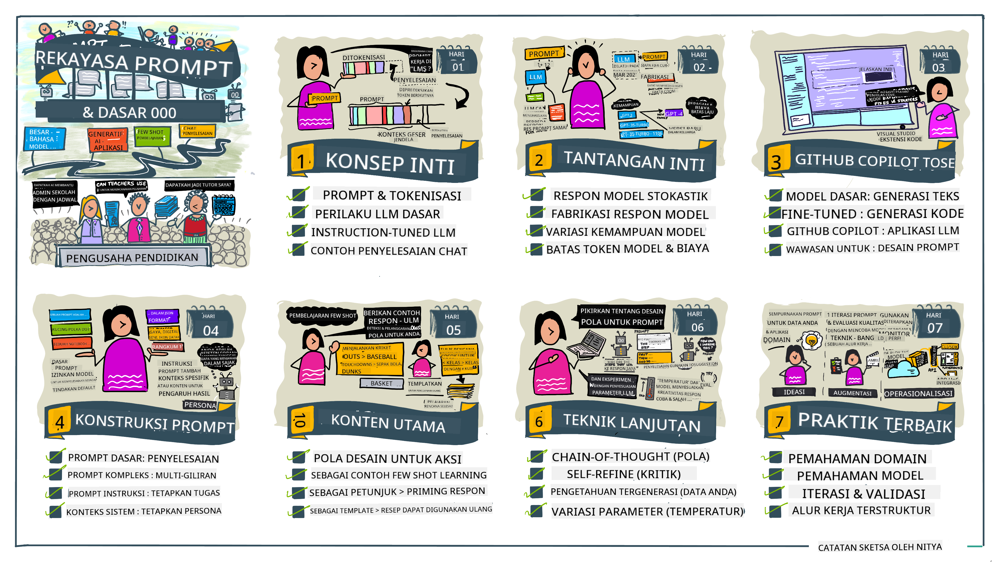
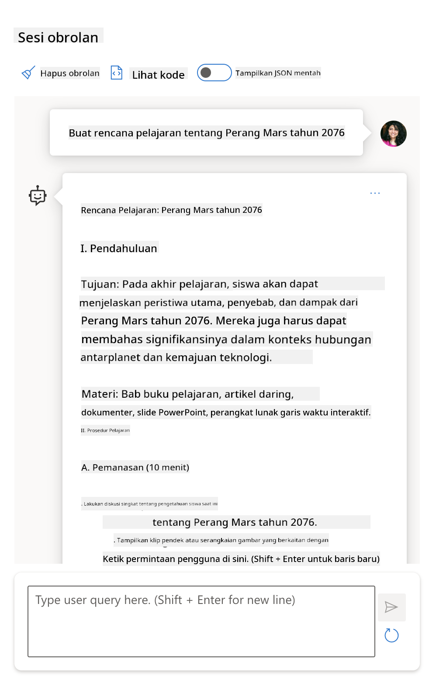

<!--
CO_OP_TRANSLATOR_METADATA:
{
  "original_hash": "dcbaaae026cb50fee071e690685b5843",
  "translation_date": "2025-08-26T18:18:22+00:00",
  "source_file": "04-prompt-engineering-fundamentals/README.md",
  "language_code": "id"
}
-->
# Dasar-dasar Prompt Engineering

[](https://aka.ms/gen-ai-lesson4-gh?WT.mc_id=academic-105485-koreyst)

## Pendahuluan
Modul ini membahas konsep dan teknik penting untuk membuat prompt yang efektif pada model AI generatif. Cara kamu menulis prompt ke LLM juga sangat berpengaruh. Prompt yang dirancang dengan baik bisa menghasilkan respons yang lebih berkualitas. Tapi apa sebenarnya arti istilah _prompt_ dan _prompt engineering_? Dan bagaimana cara memperbaiki _input prompt_ yang kita kirim ke LLM? Pertanyaan-pertanyaan ini akan kita bahas di bab ini dan berikutnya.

_Generative AI_ mampu membuat konten baru (misalnya, teks, gambar, audio, kode, dll.) sebagai respons atas permintaan pengguna. Kemampuan ini didapatkan dengan menggunakan _Large Language Models_ seperti seri GPT ("Generative Pre-trained Transformer") dari OpenAI yang dilatih untuk memahami bahasa alami dan kode.

Pengguna sekarang bisa berinteraksi dengan model-model ini menggunakan cara yang sudah familiar seperti chat, tanpa perlu keahlian teknis atau pelatihan khusus. Model-model ini berbasis _prompt_ - pengguna mengirimkan input teks (prompt) dan mendapatkan respons AI (completion). Mereka bisa "mengobrol dengan AI" secara berulang, dalam percakapan multi-putaran, memperbaiki prompt sampai responsnya sesuai harapan.

"Prompt" kini menjadi _antarmuka pemrograman_ utama untuk aplikasi AI generatif, memberi tahu model apa yang harus dilakukan dan memengaruhi kualitas respons yang dihasilkan. "Prompt Engineering" adalah bidang studi yang berkembang pesat yang fokus pada _desain dan optimasi_ prompt agar menghasilkan respons yang konsisten dan berkualitas dalam skala besar.

## Tujuan Pembelajaran

Di pelajaran ini, kita akan belajar apa itu Prompt Engineering, mengapa hal ini penting, dan bagaimana kita bisa membuat prompt yang lebih efektif untuk model dan tujuan aplikasi tertentu. Kita akan memahami konsep inti dan praktik terbaik dalam prompt engineering - serta mengenal lingkungan "sandbox" interaktif di Jupyter Notebooks untuk melihat penerapan konsep ini pada contoh nyata.

Setelah menyelesaikan pelajaran ini, kita akan bisa:

1. Menjelaskan apa itu prompt engineering dan mengapa hal ini penting.
2. Mendeskripsikan komponen-komponen prompt dan cara penggunaannya.
3. Mempelajari praktik terbaik dan teknik dalam prompt engineering.
4. Menerapkan teknik yang dipelajari pada contoh nyata, menggunakan endpoint OpenAI.

## Istilah Kunci

Prompt Engineering: Praktik mendesain dan menyempurnakan input untuk membimbing model AI agar menghasilkan output yang diinginkan.
Tokenization: Proses mengubah teks menjadi unit-unit kecil yang disebut token, agar bisa dipahami dan diproses oleh model.
Instruction-Tuned LLMs: Large Language Models (LLMs) yang telah dioptimasi dengan instruksi khusus untuk meningkatkan akurasi dan relevansi responsnya.

## Sandbox Pembelajaran

Prompt engineering saat ini lebih mirip seni daripada sains. Cara terbaik untuk meningkatkan intuisi kita adalah dengan _banyak berlatih_ dan menggunakan pendekatan trial-and-error yang menggabungkan keahlian domain aplikasi dengan teknik yang direkomendasikan serta optimasi khusus model.

Jupyter Notebook yang menyertai pelajaran ini menyediakan lingkungan _sandbox_ di mana kamu bisa mencoba apa yang sudah dipelajari - baik langsung maupun sebagai bagian dari tantangan kode di akhir. Untuk menjalankan latihan, kamu membutuhkan:

1. **API key Azure OpenAI** - endpoint layanan untuk LLM yang sudah dideploy.
2. **Python Runtime** - untuk menjalankan Notebook.
3. **Variabel Lingkungan Lokal** - _selesaikan langkah-langkah [SETUP](./../00-course-setup/02-setup-local.md?WT.mc_id=academic-105485-koreyst) sekarang agar siap digunakan_.

Notebook ini sudah dilengkapi dengan latihan _starter_ - tapi kamu sangat dianjurkan untuk menambahkan bagian _Markdown_ (deskripsi) dan _Code_ (permintaan prompt) sendiri untuk mencoba lebih banyak contoh atau ide - dan membangun intuisi dalam mendesain prompt.

## Panduan Bergambar

Ingin mendapatkan gambaran besar tentang apa saja yang dibahas di pelajaran ini sebelum mulai? Lihat panduan bergambar berikut, yang memberikan gambaran topik utama dan poin-poin penting yang perlu kamu pikirkan di setiap bagian. Roadmap pelajaran ini membawamu dari pemahaman konsep inti dan tantangan, hingga cara mengatasinya dengan teknik dan praktik terbaik prompt engineering yang relevan. Perlu dicatat bahwa bagian "Advanced Techniques" di panduan ini merujuk pada materi yang akan dibahas di bab _selanjutnya_ dari kurikulum ini.



## Startup Kita

Sekarang, mari kita bahas bagaimana _topik ini_ berkaitan dengan misi startup kita untuk [membawa inovasi AI ke dunia pendidikan](https://educationblog.microsoft.com/2023/06/collaborating-to-bring-ai-innovation-to-education?WT.mc_id=academic-105485-koreyst). Kita ingin membangun aplikasi pembelajaran _personalized_ berbasis AI - jadi mari kita pikirkan bagaimana pengguna yang berbeda dari aplikasi kita bisa "mendesain" prompt:

- **Administrator** mungkin meminta AI untuk _menganalisis data kurikulum dan mengidentifikasi kekurangan cakupan_. AI bisa merangkum hasilnya atau memvisualisasikannya dengan kode.
- **Pendidik** mungkin meminta AI untuk _membuat rencana pelajaran untuk audiens dan topik tertentu_. AI bisa membangun rencana personalisasi dalam format yang sudah ditentukan.
- **Siswa** mungkin meminta AI untuk _membimbing mereka dalam mata pelajaran yang sulit_. AI sekarang bisa membimbing siswa dengan pelajaran, petunjuk & contoh yang disesuaikan dengan level mereka.

Itu baru permulaan. Lihat [Prompts For Education](https://github.com/microsoft/prompts-for-edu/tree/main?WT.mc_id=academic-105485-koreyst) - pustaka prompt open-source yang dikurasi oleh para ahli pendidikan - untuk mendapatkan gambaran lebih luas tentang kemungkinannya! _Coba jalankan beberapa prompt tersebut di sandbox atau gunakan OpenAI Playground untuk melihat hasilnya!_

<!--
TEMPLATE PELAJARAN:
Unit ini harus membahas konsep inti #1.
Perkuat konsep dengan contoh dan referensi.

KONSEP #1:
Prompt Engineering.
Definisikan dan jelaskan mengapa dibutuhkan.
-->

## Apa itu Prompt Engineering?

Kita memulai pelajaran ini dengan mendefinisikan **Prompt Engineering** sebagai proses _mendesain dan mengoptimasi_ input teks (prompt) untuk menghasilkan respons (completion) yang konsisten dan berkualitas sesuai tujuan aplikasi dan model yang digunakan. Kita bisa menganggapnya sebagai proses dua langkah:

- _mendesain_ prompt awal untuk model dan tujuan tertentu
- _menyempurnakan_ prompt secara bertahap untuk meningkatkan kualitas respons

Proses ini memang membutuhkan trial-and-error, intuisi, dan usaha dari pengguna agar hasilnya optimal. Lalu, mengapa hal ini penting? Untuk menjawabnya, kita perlu memahami tiga konsep berikut:

- _Tokenization_ = bagaimana model "melihat" prompt
- _Base LLMs_ = bagaimana model dasar "memproses" prompt
- _Instruction-Tuned LLMs_ = bagaimana model bisa "melihat" tugas

### Tokenization

LLM melihat prompt sebagai _urutan token_ di mana model yang berbeda (atau versi berbeda dari satu model) bisa melakukan tokenisasi pada prompt yang sama dengan cara yang berbeda. Karena LLM dilatih menggunakan token (bukan teks mentah), cara prompt di-tokenisasi sangat memengaruhi kualitas respons yang dihasilkan.

Untuk memahami cara kerja tokenisasi, coba gunakan alat seperti [OpenAI Tokenizer](https://platform.openai.com/tokenizer?WT.mc_id=academic-105485-koreyst) di bawah ini. Salin prompt kamu - dan lihat bagaimana prompt tersebut diubah menjadi token, perhatikan juga bagaimana karakter spasi dan tanda baca diproses. Perlu diingat, contoh ini menggunakan LLM lama (GPT-3) - jadi jika kamu mencoba dengan model yang lebih baru, hasilnya bisa berbeda.


### Konsep: Foundation Models

Setelah prompt di-tokenisasi, fungsi utama dari ["Base LLM"](https://blog.gopenai.com/an-introduction-to-base-and-instruction-tuned-large-language-models-8de102c785a6?WT.mc_id=academic-105485-koreyst) (atau Foundation model) adalah memprediksi token berikutnya dalam urutan tersebut. Karena LLM dilatih dengan dataset teks yang sangat besar, mereka punya pemahaman statistik yang baik tentang hubungan antar token dan bisa membuat prediksi dengan tingkat kepercayaan tertentu. Perlu dicatat bahwa mereka tidak memahami _makna_ kata dalam prompt atau token; mereka hanya melihat pola yang bisa mereka "lanjutkan" dengan prediksi berikutnya. Model akan terus memprediksi urutan sampai dihentikan oleh intervensi pengguna atau kondisi yang sudah ditetapkan.

Ingin melihat bagaimana proses completion berbasis prompt bekerja? Masukkan prompt di atas ke [_Chat Playground_](https://oai.azure.com/playground?WT.mc_id=academic-105485-koreyst) Azure OpenAI Studio dengan pengaturan default. Sistem dikonfigurasi untuk memperlakukan prompt sebagai permintaan informasi - jadi kamu akan melihat completion yang sesuai dengan konteks ini.

Tapi bagaimana jika pengguna ingin melihat sesuatu yang spesifik sesuai kriteria atau tujuan tugas? Di sinilah LLM yang _instruction-tuned_ berperan.


### Konsep: Instruction Tuned LLMs

[Instruction Tuned LLM](https://blog.gopenai.com/an-introduction-to-base-and-instruction-tuned-large-language-models-8de102c785a6?WT.mc_id=academic-105485-koreyst) dimulai dari foundation model dan dioptimasi dengan contoh atau pasangan input/output (misalnya, "pesan" multi-putaran) yang berisi instruksi jelas - dan respons dari AI berusaha mengikuti instruksi tersebut.

Teknik yang digunakan seperti Reinforcement Learning with Human Feedback (RLHF) melatih model untuk _mengikuti instruksi_ dan _belajar dari umpan balik_ sehingga menghasilkan respons yang lebih relevan untuk aplikasi nyata dan lebih sesuai dengan tujuan pengguna.

Mari kita coba - ulangi prompt di atas, tapi sekarang ubah _system message_ untuk memberikan instruksi berikut sebagai konteks:

> _Ringkaslah konten yang diberikan untuk siswa kelas dua. Hasilkan satu paragraf dengan 3-5 poin bullet._

Lihat bagaimana hasilnya sekarang disesuaikan dengan tujuan dan format yang diinginkan? Seorang pendidik bisa langsung menggunakan respons ini di slide kelasnya.


## Mengapa kita membutuhkan Prompt Engineering?

Setelah kita tahu bagaimana prompt diproses oleh LLM, mari kita bahas _mengapa_ prompt engineering dibutuhkan. Jawabannya terletak pada kenyataan bahwa LLM saat ini memiliki sejumlah tantangan yang membuat _completion yang konsisten dan dapat diandalkan_ sulit dicapai tanpa usaha dalam membangun dan mengoptimasi prompt. Contohnya:

1. **Respons model bersifat stokastik.** _Prompt yang sama_ kemungkinan besar akan menghasilkan respons berbeda pada model atau versi model yang berbeda. Bahkan bisa menghasilkan hasil berbeda pada _model yang sama_ di waktu berbeda. _Teknik prompt engineering bisa membantu meminimalkan variasi ini dengan memberikan batasan yang lebih baik_.

1. **Model bisa membuat respons yang tidak nyata.** Model dilatih dengan dataset yang _besar tapi terbatas_, artinya mereka tidak tahu tentang konsep di luar cakupan pelatihan tersebut. Akibatnya, mereka bisa menghasilkan completion yang tidak akurat, imajinatif, atau bahkan bertentangan dengan fakta yang diketahui. _Teknik prompt engineering membantu pengguna mengidentifikasi dan mengurangi respons seperti ini, misalnya dengan meminta AI untuk memberikan referensi atau penjelasan_.

1. **Kemampuan model akan berbeda-beda.** Model yang lebih baru atau generasi berikutnya punya kemampuan lebih kaya, tapi juga membawa keunikan dan trade-off dalam biaya & kompleksitas. _Prompt engineering membantu kita mengembangkan praktik terbaik dan alur kerja yang bisa mengatasi perbedaan ini dan menyesuaikan kebutuhan spesifik model dengan cara yang skalabel dan mulus_.

Mari kita lihat langsung di OpenAI atau Azure OpenAI Playground:

- Gunakan prompt yang sama pada deployment LLM yang berbeda (misalnya, OpenAI, Azure OpenAI, Hugging Face) - apakah kamu melihat variasinya?
- Gunakan prompt yang sama berulang kali pada deployment LLM _yang sama_ (misalnya, Azure OpenAI playground) - bagaimana variasi hasilnya?

### Contoh Fabrications

Di kursus ini, kita menggunakan istilah **"fabrication"** untuk merujuk pada fenomena di mana LLM kadang menghasilkan informasi yang tidak benar secara faktual karena keterbatasan pelatihan atau kendala lain. Kamu mungkin juga pernah mendengar istilah _"hallucinations"_ di artikel populer atau makalah penelitian. Namun, kami sangat menyarankan menggunakan istilah _"fabrication"_ agar kita tidak secara tidak sengaja mengaitkan perilaku mesin dengan sifat manusia. Hal ini juga memperkuat [pedoman Responsible AI](https://www.microsoft.com/ai/responsible-ai?WT.mc_id=academic-105485-koreyst) dari sisi terminologi, menghilangkan istilah yang bisa dianggap ofensif atau tidak inklusif di beberapa konteks.

Ingin tahu bagaimana fabrication terjadi? Coba buat prompt yang menginstruksikan AI untuk menghasilkan konten tentang topik yang tidak ada (agar tidak ditemukan di dataset pelatihan). Misalnya - saya mencoba prompt berikut:
# Rencana Pelajaran: Perang Mars Tahun 2076

## Tujuan Pembelajaran

- Memahami latar belakang dan penyebab terjadinya Perang Mars tahun 2076.
- Menganalisis dampak sosial, politik, dan teknologi dari konflik tersebut.
- Mengembangkan keterampilan berpikir kritis melalui diskusi dan simulasi.

## Pendahuluan

Perang Mars tahun 2076 adalah salah satu peristiwa paling penting dalam sejarah kolonisasi luar angkasa. Konflik ini melibatkan koloni manusia di Mars dan pemerintah Bumi, serta berdampak besar pada hubungan antarplanet dan perkembangan teknologi.

## Materi Pokok

1. **Latar Belakang Perang Mars**
   - Sejarah kolonisasi Mars
   - Ketegangan antara koloni Mars dan pemerintah Bumi
   - Faktor ekonomi, politik, dan sumber daya

2. **Kronologi Perang**
   - Awal mula konflik
   - Pertempuran besar dan strategi yang digunakan
   - Tokoh-tokoh penting dalam perang

3. **Dampak Perang**
   - Perubahan sosial di Mars dan Bumi
   - Kemajuan teknologi militer dan sipil
   - Perjanjian damai dan masa depan hubungan antarplanet

## Kegiatan Pembelajaran

- **Diskusi Kelompok:** Siswa dibagi menjadi beberapa kelompok untuk membahas penyebab utama Perang Mars dan kemungkinan solusi damai.
- **Simulasi Perundingan:** Siswa berperan sebagai perwakilan Mars dan Bumi untuk mencoba mencapai kesepakatan damai.
- **Analisis Sumber:** Siswa mempelajari dokumen sejarah, pidato, dan laporan media dari masa perang.

## Penilaian

- Partisipasi dalam diskusi dan simulasi
- Laporan tertulis tentang dampak Perang Mars tahun 2076
- Presentasi kelompok mengenai solusi konflik

## Penutup

Perang Mars tahun 2076 memberikan pelajaran penting tentang diplomasi, teknologi, dan pentingnya kerja sama antarplanet. Melalui pembelajaran ini, siswa diharapkan dapat memahami kompleksitas konflik dan pentingnya perdamaian dalam masyarakat masa depan.
Pencarian web menunjukkan bahwa ada kisah fiksi (misalnya, serial televisi atau buku) tentang perang di Mars – tapi tidak ada yang terjadi di tahun 2076. Logika juga mengatakan bahwa tahun 2076 itu _masih di masa depan_ dan karena itu, tidak mungkin dikaitkan dengan kejadian nyata.

Jadi, apa yang terjadi jika kita menjalankan prompt ini dengan penyedia LLM yang berbeda?

> **Respons 1**: OpenAI Playground (GPT-35)


> **Respons 2**: Azure OpenAI Playground (GPT-35)



> **Respons 3**: : Hugging Face Chat Playground (LLama-2)


Seperti yang diduga, setiap model (atau versi model) menghasilkan respons yang sedikit berbeda berkat perilaku stokastik dan variasi kemampuan model. Misalnya, satu model menargetkan audiens kelas 8 sementara yang lain mengasumsikan siswa SMA. Namun ketiga model tersebut menghasilkan jawaban yang bisa membuat pengguna yang tidak tahu menjadi percaya bahwa kejadian itu nyata.

Teknik rekayasa prompt seperti _metaprompting_ dan _pengaturan temperatur_ bisa mengurangi fabrikasi model sampai batas tertentu. Arsitektur rekayasa prompt yang baru juga mengintegrasikan alat dan teknik baru ke dalam alur prompt, untuk mengurangi atau memitigasi efek-efek ini.

## Studi Kasus: GitHub Copilot

Mari kita tutup bagian ini dengan melihat bagaimana rekayasa prompt digunakan dalam solusi nyata melalui satu Studi Kasus: [GitHub Copilot](https://github.com/features/copilot?WT.mc_id=academic-105485-koreyst).

GitHub Copilot adalah "AI Pair Programmer" Anda – ia mengubah prompt teks menjadi pelengkapan kode dan terintegrasi langsung ke lingkungan pengembangan Anda (misalnya, Visual Studio Code) untuk pengalaman pengguna yang mulus. Seperti yang didokumentasikan dalam rangkaian blog di bawah, versi awalnya berbasis model OpenAI Codex – dengan para engineer segera menyadari perlunya melakukan fine-tuning pada model dan mengembangkan teknik rekayasa prompt yang lebih baik, demi meningkatkan kualitas kode. Pada bulan Juli, mereka [memperkenalkan model AI yang lebih baik, melampaui Codex](https://github.blog/2023-07-28-smarter-more-efficient-coding-github-copilot-goes-beyond-codex-with-improved-ai-model/?WT.mc_id=academic-105485-koreyst) untuk saran yang lebih cepat.

Baca postingan di bawah ini secara berurutan untuk mengikuti perjalanan pembelajaran mereka.

- **Mei 2023** | [GitHub Copilot Semakin Baik dalam Memahami Kode Anda](https://github.blog/2023-05-17-how-github-copilot-is-getting-better-at-understanding-your-code/?WT.mc_id=academic-105485-koreyst)
- **Mei 2023** | [Inside GitHub: Bekerja dengan LLM di balik GitHub Copilot](https://github.blog/2023-05-17-inside-github-working-with-the-llms-behind-github-copilot/?WT.mc_id=academic-105485-koreyst).
- **Juni 2023** | [Cara Menulis Prompt yang Lebih Baik untuk GitHub Copilot](https://github.blog/2023-06-20-how-to-write-better-prompts-for-github-copilot/?WT.mc_id=academic-105485-koreyst).
- **Juli 2023** | [.. GitHub Copilot melampaui Codex dengan model AI yang lebih baik](https://github.blog/2023-07-28-smarter-more-efficient-coding-github-copilot-goes-beyond-codex-with-improved-ai-model/?WT.mc_id=academic-105485-koreyst)
- **Juli 2023** | [Panduan Developer untuk Prompt Engineering dan LLM](https://github.blog/2023-07-17-prompt-engineering-guide-generative-ai-llms/?WT.mc_id=academic-105485-koreyst)
- **September 2023** | [Cara membangun aplikasi LLM untuk perusahaan: Pelajaran dari GitHub Copilot](https://github.blog/2023-09-06-how-to-build-an-enterprise-llm-application-lessons-from-github-copilot/?WT.mc_id=academic-105485-koreyst)

Anda juga bisa menjelajahi [blog Engineering mereka](https://github.blog/category/engineering/?WT.mc_id=academic-105485-koreyst) untuk postingan lain seperti [yang ini](https://github.blog/2023-09-27-how-i-used-github-copilot-chat-to-build-a-reactjs-gallery-prototype/?WT.mc_id=academic-105485-koreyst) yang menunjukkan bagaimana model dan teknik ini _diaplikasikan_ untuk mendorong aplikasi nyata.

---

<!--
TEMPLATE PELAJARAN:
Unit ini harus membahas konsep inti #2.
Perkuat konsep dengan contoh dan referensi.

KONSEP #2:
Desain Prompt.
Diilustrasikan dengan contoh.
-->

## Konstruksi Prompt

Kita sudah melihat mengapa rekayasa prompt itu penting – sekarang mari pahami bagaimana prompt _dibangun_ agar kita bisa mengevaluasi berbagai teknik untuk desain prompt yang lebih efektif.

### Prompt Dasar

Mari mulai dengan prompt dasar: input teks yang dikirim ke model tanpa konteks lain. Berikut contohnya – ketika kita mengirim beberapa kata pertama dari lagu kebangsaan Amerika Serikat ke [Completion API OpenAI](https://platform.openai.com/docs/api-reference/completions?WT.mc_id=academic-105485-koreyst), ia langsung _melengkapi_ respons dengan baris berikutnya, menunjukkan perilaku prediksi dasar.

| Prompt (Input)     | Completion (Output)                                                                                                                        |
| :----------------- | :----------------------------------------------------------------------------------------------------------------------------------------- |
| Oh say can you see | Sepertinya Anda sedang memulai lirik "The Star-Spangled Banner," lagu kebangsaan Amerika Serikat. Lirik lengkapnya adalah ... |

### Prompt Kompleks

Sekarang mari tambahkan konteks dan instruksi ke prompt dasar itu. [Chat Completion API](https://learn.microsoft.com/azure/ai-services/openai/how-to/chatgpt?WT.mc_id=academic-105485-koreyst) memungkinkan kita membangun prompt kompleks sebagai kumpulan _pesan_ dengan:

- Pasangan input/output yang mencerminkan input _user_ dan respons _asisten_.
- Pesan sistem yang mengatur konteks perilaku atau kepribadian asisten.

Permintaan sekarang berbentuk seperti di bawah ini, di mana _tokenisasi_ secara efektif menangkap informasi relevan dari konteks dan percakapan. Mengubah konteks sistem bisa sama berdampaknya terhadap kualitas pelengkapan, seperti input pengguna yang diberikan.

```python
response = openai.chat.completions.create(
    model="gpt-3.5-turbo",
    messages=[
        {"role": "system", "content": "You are a helpful assistant."},
        {"role": "user", "content": "Who won the world series in 2020?"},
        {"role": "assistant", "content": "The Los Angeles Dodgers won the World Series in 2020."},
        {"role": "user", "content": "Where was it played?"}
    ]
)
```

### Prompt Instruksi

Pada contoh di atas, prompt pengguna adalah kueri teks sederhana yang bisa diartikan sebagai permintaan informasi. Dengan prompt _instruksi_, kita bisa menggunakan teks itu untuk merinci tugas, memberikan panduan yang lebih baik ke AI. Berikut contohnya:

| Prompt (Input)                                                                                                                                                                                                                         | Completion (Output)                                                                                                        | Instruction Type    |
| :------------------------------------------------------------------------------------------------------------------------------------------------------------------------------------------------------------------------------------- | :------------------------------------------------------------------------------------------------------------------------- | :------------------ |
| Tulis deskripsi tentang Perang Saudara Amerika                                                                                                                                                                                         | _menghasilkan paragraf sederhana_                                                                                          | Sederhana           |
| Tulis deskripsi tentang Perang Saudara Amerika. Sertakan tanggal dan peristiwa penting serta jelaskan signifikansinya                                                                                                                  | _menghasilkan paragraf diikuti daftar tanggal peristiwa penting beserta penjelasannya_                                     | Kompleks            |
| Tulis deskripsi tentang Perang Saudara Amerika dalam 1 paragraf. Berikan 3 poin penting dengan tanggal dan signifikansinya. Berikan 3 poin lagi tentang tokoh sejarah utama dan kontribusinya. Kembalikan output dalam format JSON      | _menghasilkan detail lebih lengkap dalam kotak teks, diformat sebagai JSON yang bisa Anda salin ke file dan validasi_      | Kompleks. Terformat. |

## Konten Utama

Pada contoh di atas, prompt masih cukup terbuka, membiarkan LLM memutuskan bagian mana dari dataset pra-latihannya yang relevan. Dengan pola desain _konten utama_, teks input dibagi menjadi dua bagian:

- instruksi (aksi)
- konten relevan (yang memengaruhi aksi)

Berikut contoh di mana instruksinya adalah "ringkas ini dalam 2 kalimat".

| Prompt (Input)                                                                                                                                                                                                                                                                                                                                                                                                                                                                                                                                                                                                                                                                                      | Completion (Output)                                                                                                                                                                                                                                                                             |
| :-------------------------------------------------------------------------------------------------------------------------------------------------------------------------------------------------------------------------------------------------------------------------------------------------------------------------------------------------------------------------------------------------------------------------------------------------------------------------------------------------------------------------------------------------------------------------------------------------------------------------------------------------------------------------------------------------- | :---------------------------------------------------------------------------------------------------------------------------------------------------------------------------------------------------------------------------------------------------------------------------------------------- |
| Jupiter adalah planet kelima dari Matahari dan yang terbesar di Tata Surya. Ia merupakan planet gas raksasa dengan massa seperseribu dari Matahari, tetapi dua setengah kali dari gabungan massa semua planet lain di Tata Surya. Jupiter adalah salah satu objek paling terang yang terlihat dengan mata telanjang di langit malam, dan telah dikenal oleh peradaban kuno sejak sebelum sejarah tercatat. Namanya diambil dari dewa Romawi Jupiter.[19] Jika dilihat dari Bumi, Jupiter bisa cukup terang sehingga cahaya pantulannya dapat menimbulkan bayangan yang terlihat,[20] dan rata-rata merupakan objek alami ketiga paling terang di langit malam setelah Bulan dan Venus. <br/> **Ringkas ini dalam 2 kalimat pendek** | Jupiter, planet kelima dari Matahari, adalah yang terbesar di Tata Surya dan dikenal sebagai salah satu objek paling terang di langit malam. Dinamai dari dewa Romawi Jupiter, ia adalah planet gas raksasa dengan massa dua setengah kali gabungan semua planet lain di Tata Surya. |

Segmen konten utama bisa digunakan dengan berbagai cara untuk menghasilkan instruksi yang lebih efektif:

- **Contoh** – alih-alih memberi tahu model apa yang harus dilakukan dengan instruksi eksplisit, berikan contoh hasil yang diinginkan dan biarkan model menyimpulkan polanya.
- **Cue** – ikuti instruksi dengan "cue" yang memancing pelengkapan, mengarahkan model ke respons yang lebih relevan.
- **Template** – ini adalah 'resep' prompt yang bisa diulang dengan placeholder (variabel) yang dapat disesuaikan dengan data untuk kasus penggunaan tertentu.

Mari kita lihat penerapannya.

### Menggunakan Contoh

Ini adalah pendekatan di mana Anda menggunakan konten utama untuk "memberi makan model" beberapa contoh output yang diinginkan untuk instruksi tertentu, dan biarkan model menyimpulkan polanya. Berdasarkan jumlah contoh yang diberikan, kita bisa punya zero-shot prompting, one-shot prompting, few-shot prompting, dll.

Prompt sekarang terdiri dari tiga komponen:

- Deskripsi tugas
- Beberapa contoh output yang diinginkan
- Awal contoh baru (yang menjadi deskripsi tugas implisit)

| Learning Type | Prompt (Input)                                                                                                                                        | Completion (Output)         |
| :------------ | :---------------------------------------------------------------------------------------------------------------------------------------------------- | :-------------------------- |
| Zero-shot     | "The Sun is Shining". Translate to Spanish                                                                                                            | "El Sol está brillando".    |
| One-shot      | "The Sun is Shining" => ""El Sol está brillando". <br> "It's a Cold and Windy Day" =>                                                                 | "Es un día frío y ventoso". |
| Few-shot      | The player ran the bases => Baseball <br/> The player hit an ace => Tennis <br/> The player hit a six => Cricket <br/> The player made a slam-dunk => | Basketball                  |
|               |                                                                                                                                                       |                             |

Perhatikan bahwa kita harus memberikan instruksi eksplisit ("Translate to Spanish") pada zero-shot prompting, tapi instruksi itu bisa disimpulkan pada contoh one-shot. Contoh few-shot menunjukkan bahwa menambah jumlah contoh memungkinkan model membuat inferensi yang lebih akurat tanpa instruksi tambahan.

### Prompt Cue

Teknik lain untuk menggunakan konten utama adalah dengan memberikan _cue_ daripada contoh. Dalam hal ini, kita memberi model dorongan ke arah yang benar dengan _memulai_ respons menggunakan cuplikan yang mencerminkan format jawaban yang diinginkan. Model kemudian "mengambil cue" untuk melanjutkan dengan gaya yang sama.

| Jumlah Cue    | Prompt (Input)                                                                                                                                                                                                                                                                                                                                                                                                                                               | Completion (Output)                                                                                                                                                                                                                                                                                       |
| :------------- | :----------------------------------------------------------------------------------------------------------------------------------------------------------------------------------------------------------------------------------------------------------------------------------------------------------------------------------------------------------------------------------------------------------------------------------------------------------- | :-------------------------------------------------------------------------------------------------------------------------------------------------------------------------------------------------------------------------------------------------------------------------------------------------------- |
| 0              | Jupiter adalah planet kelima dari Matahari dan yang terbesar di Tata Surya. Ia merupakan planet gas raksasa dengan massa seperseribu dari Matahari, tetapi dua setengah kali dari gabungan massa semua planet lain di Tata Surya. Jupiter adalah salah satu objek paling terang yang terlihat dengan mata telanjang di langit malam, dan telah dikenal oleh peradaban kuno sejak sebelum sejarah tercatat.

**Ringkas Ini**                                       | Jupiter adalah planet terbesar di Tata Surya kita dan planet kelima dari Matahari. Jupiter merupakan planet gas raksasa dengan massa 1/1000 dari Matahari, namun lebih berat dari gabungan semua planet lain. Peradaban kuno telah lama mengenal Jupiter, dan planet ini mudah terlihat di langit malam. |
| 1              | Jupiter adalah planet kelima dari Matahari dan yang terbesar di Tata Surya. Jupiter merupakan planet gas raksasa dengan massa seperseribu dari Matahari, namun dua setengah kali lebih berat dari gabungan semua planet lain di Tata Surya. Jupiter adalah salah satu objek paling terang yang bisa dilihat dengan mata telanjang di langit malam, dan telah dikenal oleh peradaban kuno sejak sebelum sejarah tercatat. <br/>**Ringkas Ini** <br/> Yang kita pelajari adalah bahwa Jupiter | adalah planet kelima dari Matahari dan yang terbesar di Tata Surya. Jupiter merupakan planet gas raksasa dengan massa seperseribu dari Matahari, namun dua setengah kali lebih berat dari gabungan semua planet lain. Jupiter mudah terlihat dengan mata telanjang dan telah dikenal sejak zaman kuno.                        |
| 2              | Jupiter adalah planet kelima dari Matahari dan yang terbesar di Tata Surya. Jupiter merupakan planet gas raksasa dengan massa seperseribu dari Matahari, namun dua setengah kali lebih berat dari gabungan semua planet lain di Tata Surya. Jupiter adalah salah satu objek paling terang yang bisa dilihat dengan mata telanjang di langit malam, dan telah dikenal oleh peradaban kuno sejak sebelum sejarah tercatat. <br/>**Ringkas Ini** <br/> 3 Fakta Utama yang Kita Pelajari:         | 1. Jupiter adalah planet kelima dari Matahari dan yang terbesar di Tata Surya. <br/> 2. Jupiter merupakan planet gas raksasa dengan massa seperseribu dari Matahari...<br/> 3. Jupiter telah terlihat dengan mata telanjang sejak zaman kuno ...                                                                       |
|                |                                                                                                                                                                                                                                                                                                                                                                                                                                                              |                                                                                                                                                                                                                                                                                                           |

### Template Prompt

Template prompt adalah _resep prompt yang sudah ditentukan_ yang bisa disimpan dan digunakan kembali sesuai kebutuhan, untuk menghasilkan pengalaman pengguna yang lebih konsisten dalam skala besar. Dalam bentuk paling sederhana, ini hanyalah kumpulan contoh prompt seperti [contoh dari OpenAI ini](https://platform.openai.com/examples?WT.mc_id=academic-105485-koreyst) yang menyediakan komponen prompt interaktif (pesan pengguna dan sistem) serta format permintaan berbasis API - untuk mendukung penggunaan ulang.

Dalam bentuk yang lebih kompleks seperti [contoh dari LangChain ini](https://python.langchain.com/docs/concepts/prompt_templates/?WT.mc_id=academic-105485-koreyst), template ini berisi _placeholder_ yang bisa diganti dengan data dari berbagai sumber (input pengguna, konteks sistem, sumber data eksternal, dll.) untuk menghasilkan prompt secara dinamis. Ini memungkinkan kita membuat pustaka prompt yang dapat digunakan kembali untuk menghasilkan pengalaman pengguna yang konsisten **secara terprogram** dalam skala besar.

Nilai utama dari template terletak pada kemampuannya untuk membuat dan mempublikasikan _pustaka prompt_ untuk domain aplikasi vertikal - di mana template prompt kini _dioptimalkan_ agar sesuai dengan konteks atau contoh spesifik aplikasi sehingga respons yang dihasilkan lebih relevan dan akurat untuk audiens pengguna yang ditargetkan. Repositori [Prompts For Edu](https://github.com/microsoft/prompts-for-edu?WT.mc_id=academic-105485-koreyst) adalah contoh bagus dari pendekatan ini, mengkurasi pustaka prompt untuk bidang pendidikan dengan penekanan pada tujuan utama seperti perencanaan pelajaran, desain kurikulum, bimbingan siswa, dan sebagainya.

## Konten Pendukung

Jika kita menganggap pembuatan prompt terdiri dari instruksi (tugas) dan target (konten utama), maka _konten sekunder_ adalah konteks tambahan yang kita berikan untuk **mempengaruhi keluaran dengan cara tertentu**. Ini bisa berupa parameter pengaturan, instruksi format, taksonomi topik, dll. yang dapat membantu model _menyesuaikan_ responsnya agar sesuai dengan tujuan atau harapan pengguna.

Contoh: Diberikan katalog mata kuliah dengan metadata lengkap (nama, deskripsi, tingkat, tag metadata, pengajar, dll.) untuk semua mata kuliah yang tersedia dalam kurikulum:

- kita bisa mendefinisikan instruksi "ringkas katalog mata kuliah untuk Semester Ganjil 2023"
- kita bisa menggunakan konten utama untuk memberikan beberapa contoh keluaran yang diinginkan
- kita bisa menggunakan konten sekunder untuk mengidentifikasi 5 "tag" teratas yang menjadi fokus.

Sekarang, model dapat memberikan ringkasan dalam format yang dicontohkan - namun jika suatu hasil memiliki banyak tag, model bisa memprioritaskan 5 tag yang diidentifikasi dalam konten sekunder.

---

<!--
TEMPLATE PELAJARAN:
Unit ini harus membahas konsep inti #1.
Perkuat konsep dengan contoh dan referensi.

KONSEP #3:
Teknik Prompt Engineering.
Apa saja teknik dasar untuk prompt engineering?
Jelaskan dengan latihan.
-->

## Praktik Terbaik dalam Prompting

Sekarang kita sudah tahu bagaimana prompt bisa _dibangun_, kita bisa mulai memikirkan bagaimana _merancang_ prompt agar sesuai dengan praktik terbaik. Kita bisa membaginya menjadi dua bagian - memiliki _mindset_ yang tepat dan menerapkan _teknik_ yang tepat.

### Mindset Prompt Engineering

Prompt Engineering adalah proses coba-coba, jadi ingatlah tiga faktor utama berikut:

1. **Pemahaman Domain Penting.** Akurasi dan relevansi respons sangat dipengaruhi oleh _domain_ aplikasi atau pengguna. Gunakan intuisi dan keahlian domain Anda untuk **menyesuaikan teknik** lebih lanjut. Misalnya, tentukan _kepribadian khusus domain_ dalam prompt sistem Anda, atau gunakan _template khusus domain_ dalam prompt pengguna. Berikan konten sekunder yang mencerminkan konteks domain, atau gunakan _petunjuk dan contoh khusus domain_ untuk mengarahkan model ke pola penggunaan yang sudah dikenal.

2. **Pemahaman Model Penting.** Kita tahu model bersifat stokastik. Namun implementasi model juga bisa berbeda dalam hal dataset pelatihan yang digunakan (pengetahuan pra-latih), kemampuan yang disediakan (misal, lewat API atau SDK), dan jenis konten yang dioptimalkan (misal, kode vs gambar vs teks). Pahami kelebihan dan keterbatasan model yang Anda gunakan, dan gunakan pengetahuan itu untuk _memprioritaskan tugas_ atau membangun _template khusus_ yang dioptimalkan untuk kemampuan model.

3. **Iterasi & Validasi Penting.** Model berkembang sangat cepat, begitu juga teknik prompt engineering. Sebagai ahli domain, Anda mungkin memiliki konteks atau kriteria lain untuk aplikasi _Anda_ yang belum tentu berlaku untuk komunitas luas. Gunakan alat & teknik prompt engineering untuk "memulai" pembuatan prompt, lalu lakukan iterasi dan validasi hasilnya dengan intuisi dan keahlian Anda. Catat wawasan Anda dan buat **basis pengetahuan** (misal, pustaka prompt) yang bisa digunakan orang lain sebagai baseline baru, untuk iterasi yang lebih cepat di masa depan.

## Praktik Terbaik

Sekarang mari kita lihat praktik terbaik yang umum direkomendasikan oleh para praktisi [OpenAI](https://help.openai.com/en/articles/6654000-best-practices-for-prompt-engineering-with-openai-api?WT.mc_id=academic-105485-koreyst) dan [Azure OpenAI](https://learn.microsoft.com/azure/ai-services/openai/concepts/prompt-engineering#best-practices?WT.mc_id=academic-105485-koreyst).

| Apa                              | Mengapa                                                                                                                                                                                                                                               |
| :-------------------------------- | :------------------------------------------------------------------------------------------------------------------------------------------------------------------------------------------------------------------------------------------------ |
| Evaluasi model terbaru.       | Generasi model baru biasanya memiliki fitur dan kualitas yang lebih baik - namun mungkin juga biayanya lebih tinggi. Evaluasi dampaknya, lalu putuskan apakah akan migrasi.                                                                                |
| Pisahkan instruksi & konteks   | Periksa apakah model/penyedia Anda mendefinisikan _delimiter_ untuk membedakan instruksi, konten utama, dan konten sekunder dengan lebih jelas. Ini bisa membantu model memberikan bobot lebih akurat pada token.                                                         |
| Spesifik dan jelas             | Berikan detail lebih banyak tentang konteks, hasil, panjang, format, gaya, dll. yang diinginkan. Ini akan meningkatkan kualitas dan konsistensi respons. Simpan resep dalam template yang bisa digunakan ulang.                                                          |
| Deskriptif, gunakan contoh      | Model sering merespons lebih baik dengan pendekatan "tunjukkan dan ceritakan". Mulai dengan pendekatan `zero-shot` di mana Anda hanya memberi instruksi (tanpa contoh), lalu coba `few-shot` sebagai penyempurnaan, dengan memberikan beberapa contoh keluaran yang diinginkan. Gunakan analogi. |
| Gunakan petunjuk untuk memulai jawaban | Dorong model ke hasil yang diinginkan dengan memberikan beberapa kata atau frasa awal yang bisa digunakan sebagai titik awal respons.                                                                                                               |
| Ulangi instruksi                       | Kadang Anda perlu mengulang instruksi ke model. Berikan instruksi sebelum dan sesudah konten utama, gunakan instruksi dan petunjuk, dll. Lakukan iterasi & validasi untuk melihat mana yang paling efektif.                                                         |
| Urutan Penting                     | Urutan penyajian informasi ke model bisa memengaruhi keluaran, bahkan dalam contoh pembelajaran, karena adanya bias recency. Coba beberapa opsi untuk melihat mana yang paling baik.                                                               |
| Beri model “jalan keluar”           | Berikan model _fallback_ atau respons alternatif jika tidak bisa menyelesaikan tugas. Ini bisa mengurangi kemungkinan model menghasilkan jawaban yang salah atau mengada-ada.                                                         |
|                                   |                                                                                                                                                                                                                                                   |

Seperti halnya praktik terbaik lainnya, ingatlah bahwa _hasil Anda bisa berbeda_ tergantung model, tugas, dan domain. Gunakan ini sebagai titik awal, dan lakukan iterasi untuk menemukan yang paling cocok untuk Anda. Selalu evaluasi ulang proses prompt engineering Anda seiring munculnya model dan alat baru, dengan fokus pada skalabilitas proses dan kualitas respons.

<!--
TEMPLATE PELAJARAN:
Unit ini harus menyediakan tantangan kode jika relevan

TANTANGAN:
Tautkan ke Jupyter Notebook dengan hanya komentar kode di instruksi (bagian kode kosong).

SOLUSI:
Tautkan ke salinan Notebook tersebut dengan prompt yang sudah diisi dan dijalankan, menunjukkan satu contoh hasil.
-->

## Tugas

Selamat! Anda sudah sampai di akhir pelajaran! Saatnya mencoba beberapa konsep dan teknik tadi dengan contoh nyata!

Untuk tugas ini, kita akan menggunakan Jupyter Notebook dengan latihan yang bisa Anda kerjakan secara interaktif. Anda juga bisa memperluas Notebook dengan sel Markdown dan Kode sendiri untuk mengeksplorasi ide dan teknik lain.

### Untuk memulai, fork repo ini, lalu

- (Direkomendasikan) Jalankan GitHub Codespaces
- (Alternatif) Clone repo ke perangkat lokal Anda dan gunakan dengan Docker Desktop
- (Alternatif) Buka Notebook dengan lingkungan runtime Notebook pilihan Anda.

### Selanjutnya, atur variabel lingkungan Anda

- Salin file `.env.copy` di root repo menjadi `.env` dan isi nilai `AZURE_OPENAI_API_KEY`, `AZURE_OPENAI_ENDPOINT`, dan `AZURE_OPENAI_DEPLOYMENT`. Kembali ke [bagian Learning Sandbox](../../../04-prompt-engineering-fundamentals/04-prompt-engineering-fundamentals) untuk mempelajari caranya.

### Selanjutnya, buka Jupyter Notebook

- Pilih kernel runtime. Jika menggunakan opsi 1 atau 2, cukup pilih kernel Python 3.10.x default yang disediakan oleh dev container.

Anda siap menjalankan latihan. Perlu dicatat bahwa tidak ada jawaban _benar atau salah_ di sini - hanya eksplorasi opsi lewat coba-coba dan membangun intuisi untuk apa yang bekerja pada model dan domain aplikasi tertentu.

_Untuk alasan ini, tidak ada segmen Solusi Kode di pelajaran ini. Sebagai gantinya, Notebook akan memiliki sel Markdown berjudul "Solusi Saya:" yang menunjukkan satu contoh hasil untuk referensi._

 <!--
TEMPLATE PELAJARAN:
Akhiri bagian dengan ringkasan dan sumber belajar mandiri.
-->

## Cek Pengetahuan

Manakah dari berikut ini yang merupakan prompt yang baik sesuai beberapa praktik terbaik?

1. Tunjukkan gambar mobil merah
2. Tunjukkan gambar mobil merah merek Volvo dan model XC90 yang diparkir di tepi tebing saat matahari terbenam
3. Tunjukkan gambar mobil merah merek Volvo dan model XC90

A: 2, ini adalah prompt terbaik karena memberikan detail tentang "apa" dan sangat spesifik (bukan sembarang mobil, tapi merek dan model tertentu) serta menggambarkan suasana secara keseluruhan. 3 adalah yang terbaik berikutnya karena juga cukup deskriptif.

## 🚀 Tantangan

Coba gunakan teknik "petunjuk" dengan prompt: Lengkapi kalimat "Tunjukkan gambar mobil merah merek Volvo dan ". Apa respons yang dihasilkan, dan bagaimana Anda akan memperbaikinya?

## Kerja Bagus! Lanjutkan Belajar Anda

Ingin belajar lebih banyak tentang berbagai konsep Prompt Engineering? Kunjungi [halaman pembelajaran lanjutan](https://aka.ms/genai-collection?WT.mc_id=academic-105485-koreyst) untuk menemukan sumber daya hebat lainnya tentang topik ini.

Lanjut ke Pelajaran 5 di mana kita akan membahas [teknik prompting lanjutan](../05-advanced-prompts/README.md?WT.mc_id=academic-105485-koreyst)!

---

**Disclaimer**:
Dokumen ini telah diterjemahkan menggunakan layanan terjemahan AI [Co-op Translator](https://github.com/Azure/co-op-translator). Meskipun kami berupaya untuk memberikan terjemahan yang akurat, harap diketahui bahwa terjemahan otomatis dapat mengandung kesalahan atau ketidakakuratan. Dokumen asli dalam bahasa aslinya harus dianggap sebagai sumber yang berwenang. Untuk informasi yang bersifat kritis, disarankan menggunakan jasa penerjemah profesional. Kami tidak bertanggung jawab atas kesalahpahaman atau penafsiran yang timbul dari penggunaan terjemahan ini.