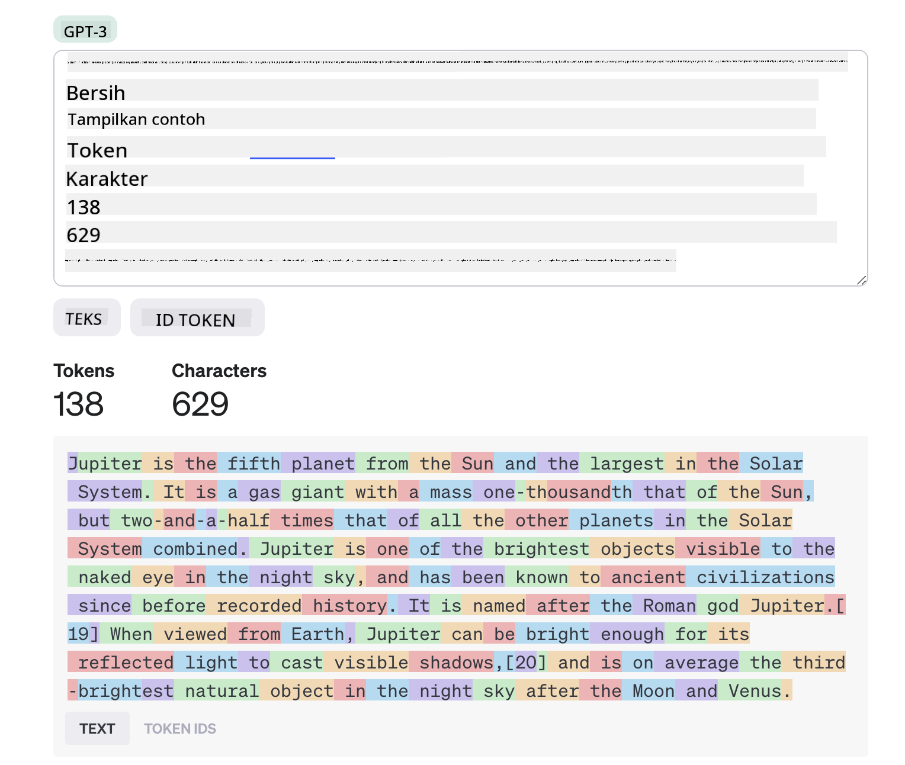
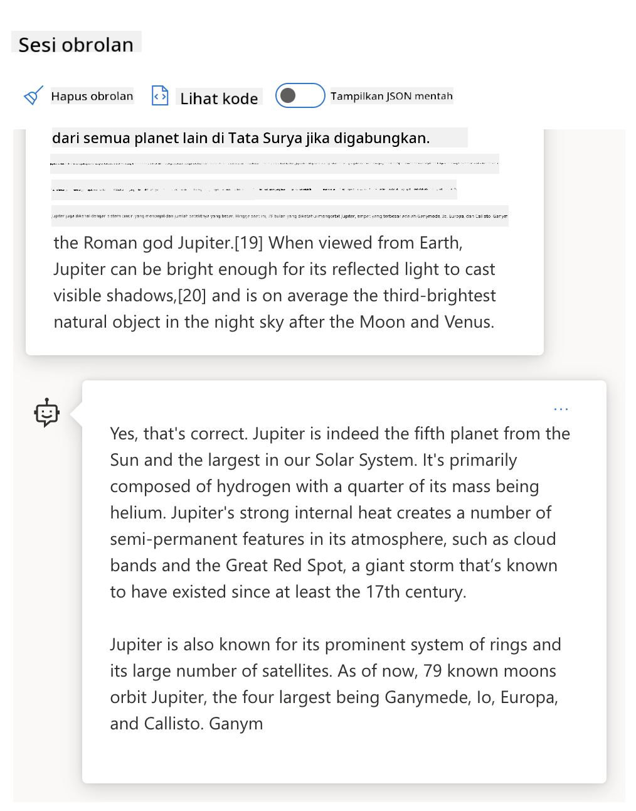
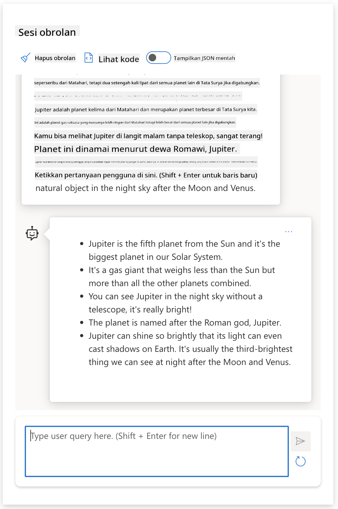
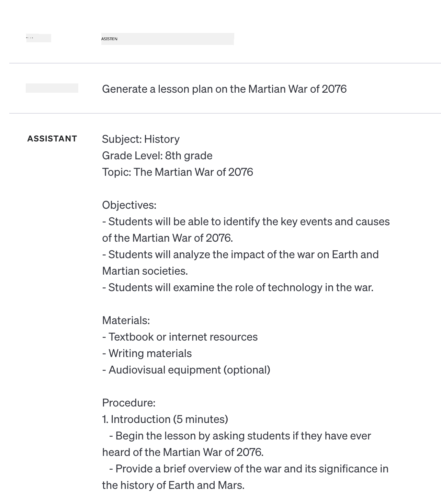
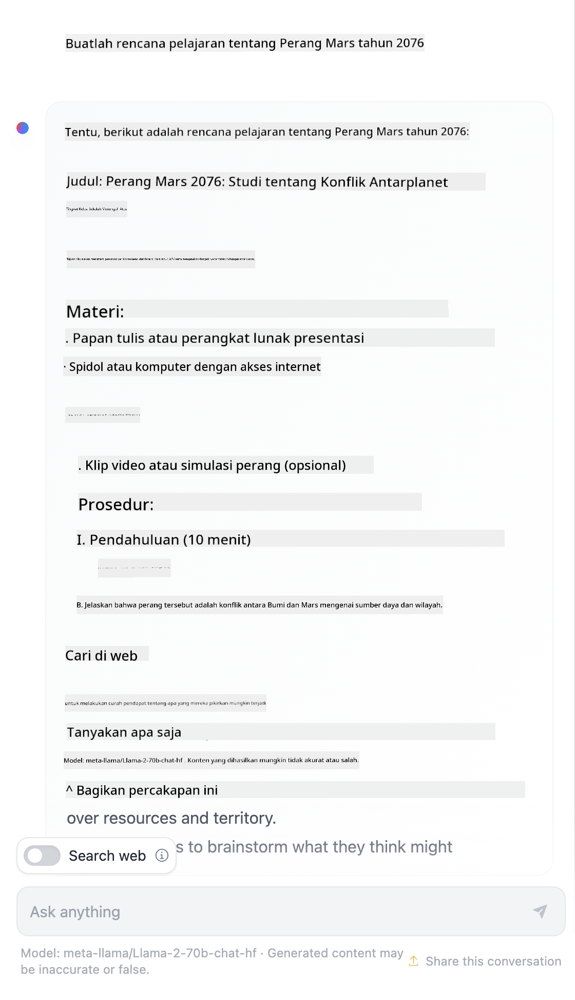

<!--
CO_OP_TRANSLATOR_METADATA:
{
  "original_hash": "a45c318dc6ebc2604f35b8b829f93af2",
  "translation_date": "2025-07-09T10:41:27+00:00",
  "source_file": "04-prompt-engineering-fundamentals/README.md",
  "language_code": "id"
}
-->
# Dasar-dasar Prompt Engineering

[](https://aka.ms/gen-ai-lesson4-gh?WT.mc_id=academic-105485-koreyst)

## Pendahuluan  
Modul ini membahas konsep dan teknik penting untuk membuat prompt yang efektif dalam model AI generatif. Cara Anda menulis prompt ke LLM juga sangat berpengaruh. Prompt yang dirancang dengan cermat dapat menghasilkan respons yang lebih berkualitas. Tapi, apa sebenarnya arti istilah seperti _prompt_ dan _prompt engineering_? Dan bagaimana saya bisa meningkatkan _input_ prompt yang saya kirim ke LLM? Pertanyaan-pertanyaan ini akan kita coba jawab dalam bab ini dan bab berikutnya.

_Generative AI_ mampu menciptakan konten baru (misalnya, teks, gambar, audio, kode, dll.) sebagai respons terhadap permintaan pengguna. Ini dicapai dengan menggunakan _Large Language Models_ seperti seri GPT dari OpenAI ("Generative Pre-trained Transformer") yang dilatih untuk menggunakan bahasa alami dan kode.

Pengguna kini dapat berinteraksi dengan model-model ini menggunakan paradigma yang sudah familiar seperti chat, tanpa perlu keahlian teknis atau pelatihan khusus. Model-model ini berbasis _prompt_ - pengguna mengirimkan input teks (prompt) dan mendapatkan respons AI (completion). Mereka kemudian dapat "bercakap-cakap dengan AI" secara iteratif, dalam percakapan multi-putaran, menyempurnakan prompt mereka sampai responsnya sesuai dengan harapan.

"Prompt" kini menjadi _antarmuka pemrograman_ utama untuk aplikasi AI generatif, memberi tahu model apa yang harus dilakukan dan memengaruhi kualitas respons yang dikembalikan. "Prompt Engineering" adalah bidang studi yang berkembang pesat yang fokus pada _perancangan dan optimasi_ prompt untuk menghasilkan respons yang konsisten dan berkualitas dalam skala besar.

## Tujuan Pembelajaran

Dalam pelajaran ini, kita akan mempelajari apa itu Prompt Engineering, mengapa hal itu penting, dan bagaimana kita dapat membuat prompt yang lebih efektif untuk model dan tujuan aplikasi tertentu. Kita akan memahami konsep inti dan praktik terbaik untuk prompt engineering - serta belajar tentang lingkungan "sandbox" interaktif Jupyter Notebooks di mana kita dapat melihat konsep-konsep ini diterapkan pada contoh nyata.

Pada akhir pelajaran ini kita akan mampu:

1. Menjelaskan apa itu prompt engineering dan mengapa hal itu penting.  
2. Mendeskripsikan komponen-komponen prompt dan bagaimana penggunaannya.  
3. Mempelajari praktik terbaik dan teknik untuk prompt engineering.  
4. Menerapkan teknik yang dipelajari pada contoh nyata, menggunakan endpoint OpenAI.

## Istilah Kunci

Prompt Engineering: Praktik merancang dan menyempurnakan input untuk mengarahkan model AI agar menghasilkan output yang diinginkan.  
Tokenization: Proses mengubah teks menjadi unit-unit kecil, yang disebut token, yang dapat dipahami dan diproses oleh model.  
Instruction-Tuned LLMs: Large Language Models (LLM) yang telah disesuaikan dengan instruksi spesifik untuk meningkatkan akurasi dan relevansi responsnya.

## Learning Sandbox

Prompt engineering saat ini lebih merupakan seni daripada ilmu pasti. Cara terbaik untuk meningkatkan intuisi kita adalah dengan _berlatih lebih banyak_ dan mengadopsi pendekatan coba-coba yang menggabungkan keahlian domain aplikasi dengan teknik yang direkomendasikan serta optimasi spesifik model.

Jupyter Notebook yang menyertai pelajaran ini menyediakan lingkungan _sandbox_ di mana Anda dapat mencoba apa yang Anda pelajari - secara langsung atau sebagai bagian dari tantangan kode di akhir. Untuk menjalankan latihan, Anda memerlukan:

1. **Kunci API Azure OpenAI** - endpoint layanan untuk LLM yang sudah dideploy.  
2. **Runtime Python** - tempat Notebook dapat dijalankan.  
3. **Variabel Lingkungan Lokal** - _selesaikan langkah [SETUP](./../00-course-setup/SETUP.md?WT.mc_id=academic-105485-koreyst) sekarang untuk bersiap_.

Notebook ini dilengkapi dengan latihan _starter_ - tapi Anda didorong untuk menambahkan bagian _Markdown_ (deskripsi) dan _Code_ (permintaan prompt) sendiri untuk mencoba lebih banyak contoh atau ide - dan membangun intuisi Anda dalam merancang prompt.

## Panduan Bergambar

Ingin mendapatkan gambaran besar tentang apa yang dibahas pelajaran ini sebelum memulai? Lihat panduan bergambar ini, yang memberi Anda gambaran tentang topik utama yang dibahas dan poin-poin penting untuk dipikirkan di setiap bagian. Peta jalan pelajaran membawa Anda dari memahami konsep inti dan tantangan hingga mengatasinya dengan teknik prompt engineering yang relevan dan praktik terbaik. Perlu dicatat bahwa bagian "Teknik Lanjutan" dalam panduan ini merujuk pada konten yang dibahas di bab _berikutnya_ dalam kurikulum ini.


## Startup Kami

Sekarang, mari kita bahas bagaimana _topik ini_ terkait dengan misi startup kami untuk [membawa inovasi AI ke pendidikan](https://educationblog.microsoft.com/2023/06/collaborating-to-bring-ai-innovation-to-education?WT.mc_id=academic-105485-koreyst). Kami ingin membangun aplikasi AI yang mendukung _pembelajaran personalisasi_ - jadi mari kita pikirkan bagaimana berbagai pengguna aplikasi kami mungkin "merancang" prompt:

- **Administrator** mungkin meminta AI untuk _menganalisis data kurikulum guna mengidentifikasi kekurangan cakupan_. AI dapat merangkum hasil atau memvisualisasikannya dengan kode.  
- **Pendidik** mungkin meminta AI untuk _menghasilkan rencana pelajaran untuk audiens dan topik tertentu_. AI dapat membuat rencana personalisasi dalam format yang ditentukan.  
- **Siswa** mungkin meminta AI untuk _membimbing mereka dalam mata pelajaran yang sulit_. AI kini dapat membimbing siswa dengan pelajaran, petunjuk, dan contoh yang disesuaikan dengan tingkat mereka.

Itu baru sebagian kecil dari kemungkinan. Lihat [Prompts For Education](https://github.com/microsoft/prompts-for-edu/tree/main?WT.mc_id=academic-105485-koreyst) - perpustakaan prompt open-source yang dikurasi oleh para ahli pendidikan - untuk mendapatkan gambaran lebih luas tentang kemungkinannya! _Cobalah menjalankan beberapa prompt tersebut di sandbox atau menggunakan OpenAI Playground untuk melihat hasilnya!_

<!--  
TEMPLATE PELAJARAN:  
Unit ini harus membahas konsep inti #1.  
Perkuat konsep dengan contoh dan referensi.  

KONSEP #1:  
Prompt Engineering.  
Definisikan dan jelaskan mengapa diperlukan.  
-->

## Apa itu Prompt Engineering?

Kita memulai pelajaran ini dengan mendefinisikan **Prompt Engineering** sebagai proses _merancang dan mengoptimalkan_ input teks (prompt) untuk menghasilkan respons (completion) yang konsisten dan berkualitas sesuai dengan tujuan aplikasi dan model yang digunakan. Kita bisa memandang ini sebagai proses dua langkah:

- _merancang_ prompt awal untuk model dan tujuan tertentu  
- _menyempurnakan_ prompt secara iteratif untuk meningkatkan kualitas respons

Ini adalah proses coba-coba yang memerlukan intuisi dan usaha pengguna untuk mendapatkan hasil optimal. Jadi, mengapa ini penting? Untuk menjawabnya, kita perlu memahami tiga konsep:

- _Tokenization_ = bagaimana model "melihat" prompt  
- _Base LLMs_ = bagaimana model dasar "memproses" prompt  
- _Instruction-Tuned LLMs_ = bagaimana model kini dapat memahami "tugas"

### Tokenization

LLM melihat prompt sebagai _urutan token_ di mana model yang berbeda (atau versi model yang berbeda) dapat melakukan tokenisasi prompt yang sama dengan cara berbeda. Karena LLM dilatih menggunakan token (bukan teks mentah), cara prompt di-tokenisasi berpengaruh langsung pada kualitas respons yang dihasilkan.

Untuk mendapatkan gambaran bagaimana tokenisasi bekerja, coba alat seperti [OpenAI Tokenizer](https://platform.openai.com/tokenizer?WT.mc_id=academic-105485-koreyst) yang ditampilkan di bawah ini. Salin prompt Anda - dan lihat bagaimana prompt tersebut diubah menjadi token, perhatikan bagaimana karakter spasi dan tanda baca diperlakukan. Perlu dicatat contoh ini menggunakan LLM versi lama (GPT-3) - jadi mencoba dengan model yang lebih baru mungkin menghasilkan hasil berbeda.



### Konsep: Foundation Models

Setelah prompt di-tokenisasi, fungsi utama dari ["Base LLM"](https://blog.gopenai.com/an-introduction-to-base-and-instruction-tuned-large-language-models-8de102c785a6?WT.mc_id=academic-105485-koreyst) (atau model dasar) adalah memprediksi token berikutnya dalam urutan tersebut. Karena LLM dilatih dengan dataset teks yang sangat besar, mereka memiliki pemahaman statistik yang baik tentang hubungan antar token dan dapat membuat prediksi tersebut dengan tingkat keyakinan tertentu. Perlu dicatat mereka tidak memahami _makna_ kata dalam prompt atau token; mereka hanya melihat pola yang bisa mereka "lengkapi" dengan prediksi berikutnya. Mereka dapat terus memprediksi urutan sampai dihentikan oleh intervensi pengguna atau kondisi yang sudah ditentukan.

Ingin melihat bagaimana penyelesaian berbasis prompt bekerja? Masukkan prompt di atas ke Azure OpenAI Studio [_Chat Playground_](https://oai.azure.com/playground?WT.mc_id=academic-105485-koreyst) dengan pengaturan default. Sistem dikonfigurasi untuk memperlakukan prompt sebagai permintaan informasi - jadi Anda akan melihat respons yang sesuai dengan konteks ini.

Tapi bagaimana jika pengguna ingin melihat sesuatu yang spesifik sesuai kriteria atau tujuan tugas? Di sinilah _instruction-tuned_ LLM berperan.



### Konsep: Instruction Tuned LLMs

[Instruction Tuned LLM](https://blog.gopenai.com/an-introduction-to-base-and-instruction-tuned-large-language-models-8de102c785a6?WT.mc_id=academic-105485-koreyst) dimulai dengan model dasar dan menyempurnakannya dengan contoh atau pasangan input/output (misalnya, "pesan" multi-putaran) yang berisi instruksi jelas - dan respons AI berusaha mengikuti instruksi tersebut.

Ini menggunakan teknik seperti Reinforcement Learning with Human Feedback (RLHF) yang dapat melatih model untuk _mengikuti instruksi_ dan _belajar dari umpan balik_ sehingga menghasilkan respons yang lebih sesuai untuk aplikasi praktis dan lebih relevan dengan tujuan pengguna.

Mari coba - ulangi prompt di atas, tapi sekarang ubah _pesan sistem_ untuk memberikan instruksi berikut sebagai konteks:

> _Ringkas konten yang diberikan untuk siswa kelas dua. Buat hasilnya dalam satu paragraf dengan 3-5 poin penting._

Lihat bagaimana hasilnya kini disesuaikan untuk mencerminkan tujuan dan format yang diinginkan? Seorang pendidik kini dapat langsung menggunakan respons ini dalam slide untuk kelas tersebut.



## Mengapa kita butuh Prompt Engineering?

Setelah kita tahu bagaimana prompt diproses oleh LLM, mari kita bahas _mengapa_ kita perlu prompt engineering. Jawabannya terletak pada fakta bahwa LLM saat ini menghadapi sejumlah tantangan yang membuat _penyelesaian yang andal dan konsisten_ lebih sulit dicapai tanpa usaha dalam membangun dan mengoptimalkan prompt. Misalnya:

1. **Respons model bersifat stokastik.** _Prompt yang sama_ kemungkinan akan menghasilkan respons berbeda pada model atau versi model yang berbeda. Bahkan bisa menghasilkan hasil berbeda pada _model yang sama_ di waktu yang berbeda. _Teknik prompt engineering dapat membantu meminimalkan variasi ini dengan memberikan batasan yang lebih baik_.

2. **Model dapat membuat respons palsu.** Model dilatih dengan dataset _besar tapi terbatas_, artinya mereka tidak memiliki pengetahuan tentang konsep di luar cakupan pelatihan tersebut. Akibatnya, mereka dapat menghasilkan respons yang tidak akurat, imajinatif, atau bahkan bertentangan langsung dengan fakta yang diketahui. _Teknik prompt engineering membantu pengguna mengidentifikasi dan mengurangi pembuatan respons palsu ini, misalnya dengan meminta AI untuk menyertakan kutipan atau alasan_.

3. **Kemampuan model akan bervariasi.** Model baru atau generasi model berikutnya akan memiliki kemampuan lebih kaya tapi juga membawa keunikan dan kompromi dalam biaya & kompleksitas. _Prompt engineering dapat membantu kita mengembangkan praktik terbaik dan alur kerja yang mengabstraksi perbedaan tersebut dan menyesuaikan dengan kebutuhan spesifik model secara skala dan mulus_.

Mari kita lihat ini dalam praktik di OpenAI atau Azure OpenAI Playground:

- Gunakan prompt yang sama dengan berbagai deployment LLM (misalnya, OpenAI, Azure OpenAI, Hugging Face) - apakah Anda melihat variasinya?  
- Gunakan prompt yang sama berulang kali dengan deployment LLM yang _sama_ (misalnya, Azure OpenAI playground) - bagaimana variasi ini berbeda?

### Contoh Fabrication

Dalam kursus ini, kami menggunakan istilah **"fabrication"** untuk merujuk pada fenomena di mana LLM kadang menghasilkan informasi yang salah secara faktual karena keterbatasan dalam pelatihan atau kendala lain. Anda mungkin juga pernah mendengar istilah ini disebut _"halusinasi"_ dalam artikel populer atau makalah riset. Namun, kami sangat menyarankan menggunakan istilah _"fabrication"_ agar kita tidak secara tidak sengaja menganggap perilaku ini sebagai sifat manusiawi dengan mengatributkan karakteristik manusia pada hasil yang dihasilkan mesin. Ini juga memperkuat [pedoman Responsible AI](https://www.microsoft.com/ai/responsible-ai?WT.mc_id=academic-105485-koreyst) dari perspektif terminologi, menghilangkan istilah yang mungkin dianggap ofensif atau tidak inklusif dalam beberapa konteks.

Ingin merasakan bagaimana fabrication bekerja? Pikirkan sebuah prompt yang menginstruksikan AI untuk menghasilkan konten tentang topik yang tidak ada (agar tidak ditemukan dalam dataset pelatihan). Misalnya - saya mencoba prompt ini:
# Rencana Pelajaran: Perang Mars 2076

## Tujuan Pembelajaran
- Memahami latar belakang dan penyebab Perang Mars 2076
- Menganalisis peristiwa utama selama konflik
- Mengevaluasi dampak perang terhadap hubungan antarplanet dan teknologi

## Materi Pelajaran

### 1. Latar Belakang Perang Mars 2076
- Kondisi politik dan sosial di Mars dan Bumi sebelum perang
- Sumber daya dan kepentingan yang memicu ketegangan
- Peran koloni Mars dan pemerintah Bumi

### 2. Kronologi Perang
- Awal konflik dan peristiwa pemicu
- Pertempuran utama dan strategi militer yang digunakan
- Peran teknologi canggih dan senjata baru dalam perang

### 3. Dampak dan Akhir Perang
- Kesepakatan damai dan perjanjian yang dihasilkan
- Perubahan politik dan sosial pasca perang
- Pengaruh perang terhadap eksplorasi luar angkasa dan hubungan antarplanet

## Metode Pengajaran
- Diskusi kelompok tentang penyebab dan dampak perang
- Analisis dokumen dan sumber sejarah fiksi terkait Perang Mars 2076
- Presentasi proyek tentang teknologi militer yang digunakan dalam perang

## Penilaian
- Kuis tentang fakta-fakta penting Perang Mars 2076
- Esai singkat mengenai pelajaran yang dapat diambil dari perang tersebut
- Presentasi kelompok tentang strategi militer dan teknologi yang digunakan

## Referensi
- Buku teks fiksi ilmiah terkait Perang Mars 2076
- Artikel dan jurnal tentang sejarah fiksi luar angkasa
- Sumber multimedia seperti dokumenter dan simulasi perang Mars
Pencarian web menunjukkan bahwa ada akun fiksi (misalnya, serial televisi atau buku) tentang perang Mars - tetapi tidak ada yang terjadi pada tahun 2076. Akal sehat juga memberitahu kita bahwa 2076 adalah _masa depan_ dan oleh karena itu, tidak bisa dikaitkan dengan peristiwa nyata.

Jadi, apa yang terjadi ketika kita menjalankan prompt ini dengan penyedia LLM yang berbeda?

> **Response 1**: OpenAI Playground (GPT-35)



> **Response 2**: Azure OpenAI Playground (GPT-35)


> **Response 3**: : Hugging Face Chat Playground (LLama-2)



Seperti yang diharapkan, setiap model (atau versi model) menghasilkan respons yang sedikit berbeda berkat perilaku stokastik dan variasi kemampuan model. Misalnya, satu model menargetkan audiens kelas 8 sementara yang lain mengasumsikan siswa sekolah menengah. Namun ketiga model tersebut menghasilkan respons yang bisa meyakinkan pengguna yang tidak tahu bahwa peristiwa itu nyata.

Teknik rekayasa prompt seperti _metaprompting_ dan _konfigurasi temperature_ dapat mengurangi fabrikasi model sampai batas tertentu. Arsitektur rekayasa prompt baru juga mengintegrasikan alat dan teknik baru secara mulus ke dalam alur prompt, untuk mengurangi atau memitigasi beberapa efek ini.

## Studi Kasus: GitHub Copilot

Mari kita tutup bagian ini dengan melihat bagaimana rekayasa prompt digunakan dalam solusi dunia nyata melalui satu Studi Kasus: [GitHub Copilot](https://github.com/features/copilot?WT.mc_id=academic-105485-koreyst).

GitHub Copilot adalah "AI Pair Programmer" Anda - mengubah prompt teks menjadi penyelesaian kode dan terintegrasi ke dalam lingkungan pengembangan Anda (misalnya, Visual Studio Code) untuk pengalaman pengguna yang mulus. Seperti yang didokumentasikan dalam serangkaian blog di bawah ini, versi awal didasarkan pada model OpenAI Codex - dengan para insinyur cepat menyadari kebutuhan untuk menyempurnakan model dan mengembangkan teknik rekayasa prompt yang lebih baik, guna meningkatkan kualitas kode. Pada bulan Juli, mereka [meluncurkan model AI yang lebih baik yang melampaui Codex](https://github.blog/2023-07-28-smarter-more-efficient-coding-github-copilot-goes-beyond-codex-with-improved-ai-model/?WT.mc_id=academic-105485-koreyst) untuk saran yang lebih cepat.

Baca postingan secara berurutan, untuk mengikuti perjalanan pembelajaran mereka.

- **Mei 2023** | [GitHub Copilot Semakin Baik dalam Memahami Kode Anda](https://github.blog/2023-05-17-how-github-copilot-is-getting-better-at-understanding-your-code/?WT.mc_id=academic-105485-koreyst)
- **Mei 2023** | [Di Dalam GitHub: Bekerja dengan LLM di Balik GitHub Copilot](https://github.blog/2023-05-17-inside-github-working-with-the-llms-behind-github-copilot/?WT.mc_id=academic-105485-koreyst)
- **Jun 2023** | [Cara Menulis Prompt yang Lebih Baik untuk GitHub Copilot](https://github.blog/2023-06-20-how-to-write-better-prompts-for-github-copilot/?WT.mc_id=academic-105485-koreyst)
- **Jul 2023** | [.. GitHub Copilot Melampaui Codex dengan Model AI yang Ditingkatkan](https://github.blog/2023-07-28-smarter-more-efficient-coding-github-copilot-goes-beyond-codex-with-improved-ai-model/?WT.mc_id=academic-105485-koreyst)
- **Jul 2023** | [Panduan Pengembang untuk Rekayasa Prompt dan LLM](https://github.blog/2023-07-17-prompt-engineering-guide-generative-ai-llms/?WT.mc_id=academic-105485-koreyst)
- **Sep 2023** | [Cara Membangun Aplikasi LLM Perusahaan: Pelajaran dari GitHub Copilot](https://github.blog/2023-09-06-how-to-build-an-enterprise-llm-application-lessons-from-github-copilot/?WT.mc_id=academic-105485-koreyst)

Anda juga bisa menjelajahi [blog Engineering mereka](https://github.blog/category/engineering/?WT.mc_id=academic-105485-koreyst) untuk lebih banyak posting seperti [ini](https://github.blog/2023-09-27-how-i-used-github-copilot-chat-to-build-a-reactjs-gallery-prototype/?WT.mc_id=academic-105485-koreyst) yang menunjukkan bagaimana model dan teknik ini _diterapkan_ untuk mendorong aplikasi dunia nyata.

---

<!--
TEMPLATE PELAJARAN:
Unit ini harus mencakup konsep inti #2.
Perkuat konsep dengan contoh dan referensi.

KONSEP #2:
Desain Prompt.
Dijelaskan dengan contoh.
-->

## Konstruksi Prompt

Kita sudah melihat mengapa rekayasa prompt itu penting - sekarang mari kita pahami bagaimana prompt _dibangun_ agar kita bisa mengevaluasi berbagai teknik untuk desain prompt yang lebih efektif.

### Prompt Dasar

Mari mulai dengan prompt dasar: input teks yang dikirim ke model tanpa konteks lain. Berikut contohnya - ketika kita mengirim beberapa kata pertama dari lagu kebangsaan AS ke OpenAI [Completion API](https://platform.openai.com/docs/api-reference/completions?WT.mc_id=academic-105485-koreyst) model langsung _melengkapi_ respons dengan beberapa baris berikutnya, menggambarkan perilaku prediksi dasar.

| Prompt (Input)     | Completion (Output)                                                                                                                        |
| :----------------- | :----------------------------------------------------------------------------------------------------------------------------------------- |
| Oh say can you see | Sepertinya Anda memulai lirik "The Star-Spangled Banner," lagu kebangsaan Amerika Serikat. Lirik lengkapnya adalah ... |

### Prompt Kompleks

Sekarang mari tambahkan konteks dan instruksi ke prompt dasar itu. [Chat Completion API](https://learn.microsoft.com/azure/ai-services/openai/how-to/chatgpt?WT.mc_id=academic-105485-koreyst) memungkinkan kita membangun prompt kompleks sebagai kumpulan _pesan_ dengan:

- Pasangan input/output yang mencerminkan input _user_ dan respons _assistant_.
- Pesan sistem yang mengatur konteks perilaku atau kepribadian asisten.

Permintaan sekarang dalam bentuk di bawah ini, di mana _tokenisasi_ secara efektif menangkap informasi relevan dari konteks dan percakapan. Mengubah konteks sistem bisa berdampak besar pada kualitas penyelesaian, sama seperti input pengguna yang diberikan.

```python
response = openai.chat.completions.create(
    model="gpt-3.5-turbo",
    messages=[
        {"role": "system", "content": "You are a helpful assistant."},
        {"role": "user", "content": "Who won the world series in 2020?"},
        {"role": "assistant", "content": "The Los Angeles Dodgers won the World Series in 2020."},
        {"role": "user", "content": "Where was it played?"}
    ]
)
```

### Prompt Instruksi

Dalam contoh di atas, prompt pengguna adalah kueri teks sederhana yang bisa diartikan sebagai permintaan informasi. Dengan prompt _instruksi_, kita bisa menggunakan teks itu untuk menentukan tugas secara lebih rinci, memberikan panduan yang lebih baik kepada AI. Berikut contohnya:

| Prompt (Input)                                                                                                                                                                                                                         | Completion (Output)                                                                                                        | Jenis Instruksi    |
| :------------------------------------------------------------------------------------------------------------------------------------------------------------------------------------------------------------------------------------- | :------------------------------------------------------------------------------------------------------------------------- | :------------------ |
| Write a description of the Civil War                                                                                                                                                                                                   | _mengembalikan paragraf sederhana_                                                                                         | Sederhana           |
| Write a description of the Civil War. Provide key dates and events and describe their significance                                                                                                                                     | _mengembalikan paragraf diikuti daftar tanggal peristiwa penting dengan deskripsi_                                         | Kompleks            |
| Write a description of the Civil War in 1 paragraph. Provide 3 bullet points with key dates and their significance. Provide 3 more bullet points with key historical figures and their contributions. Return the output as a JSON file | _mengembalikan detail lebih lengkap dalam kotak teks, diformat sebagai JSON yang bisa Anda salin-tempel ke file dan validasi_ | Kompleks. Terformat. |

## Konten Utama

Dalam contoh di atas, prompt masih cukup terbuka, membiarkan LLM memutuskan bagian mana dari dataset pra-latihannya yang relevan. Dengan pola desain _konten utama_, teks input dibagi menjadi dua bagian:

- instruksi (aksi)
- konten relevan (yang memengaruhi aksi)

Berikut contoh di mana instruksinya adalah "ringkas ini dalam 2 kalimat".

| Prompt (Input)                                                                                                                                                                                                                                                                                                                                                                                                                                                                                                                                                                                                                                                                                      | Completion (Output)                                                                                                                                                                                                                                                                             |
| :-------------------------------------------------------------------------------------------------------------------------------------------------------------------------------------------------------------------------------------------------------------------------------------------------------------------------------------------------------------------------------------------------------------------------------------------------------------------------------------------------------------------------------------------------------------------------------------------------------------------------------------------------------------------------------------------------- | :---------------------------------------------------------------------------------------------------------------------------------------------------------------------------------------------------------------------------------------------------------------------------------------------- |
| Jupiter adalah planet kelima dari Matahari dan yang terbesar di Tata Surya. Ia adalah raksasa gas dengan massa seper seribu dari Matahari, tetapi dua setengah kali massa semua planet lain di Tata Surya digabungkan. Jupiter adalah salah satu objek paling terang yang terlihat dengan mata telanjang di langit malam, dan telah dikenal oleh peradaban kuno sejak sebelum sejarah tercatat. Ia dinamai menurut dewa Romawi Jupiter.[19] Ketika dilihat dari Bumi, Jupiter bisa cukup terang sehingga cahaya pantulannya dapat menghasilkan bayangan yang terlihat,[20] dan rata-rata merupakan objek alami ketiga paling terang di langit malam setelah Bulan dan Venus. <br/> **Ringkas ini dalam 2 kalimat pendek** | Jupiter, planet kelima dari Matahari, adalah yang terbesar di Tata Surya dan dikenal sebagai salah satu objek paling terang di langit malam. Dinamai menurut dewa Romawi Jupiter, ia adalah raksasa gas dengan massa dua setengah kali gabungan semua planet lain di Tata Surya. |

Segmen konten utama dapat digunakan dengan berbagai cara untuk menghasilkan instruksi yang lebih efektif:

- **Contoh** - alih-alih memberi tahu model apa yang harus dilakukan dengan instruksi eksplisit, berikan contoh apa yang harus dilakukan dan biarkan model menyimpulkan pola.
- **Petunjuk** - ikuti instruksi dengan "petunjuk" yang memicu penyelesaian, mengarahkan model ke respons yang lebih relevan.
- **Template** - ini adalah 'resep' yang dapat diulang untuk prompt dengan placeholder (variabel) yang dapat disesuaikan dengan data untuk kasus penggunaan tertentu.

Mari kita jelajahi ini dalam praktik.

### Menggunakan Contoh

Ini adalah pendekatan di mana Anda menggunakan konten utama untuk "memberi makan model" beberapa contoh keluaran yang diinginkan untuk instruksi tertentu, dan membiarkannya menyimpulkan pola keluaran yang diinginkan. Berdasarkan jumlah contoh yang diberikan, kita bisa memiliki zero-shot prompting, one-shot prompting, few-shot prompting, dll.

Prompt sekarang terdiri dari tiga komponen:

- Deskripsi tugas
- Beberapa contoh keluaran yang diinginkan
- Awal contoh baru (yang menjadi deskripsi tugas implisit)

| Jenis Pembelajaran | Prompt (Input)                                                                                                                                        | Completion (Output)         |
| :----------------- | :---------------------------------------------------------------------------------------------------------------------------------------------------- | :-------------------------- |
| Zero-shot          | "The Sun is Shining". Translate to Spanish                                                                                                            | "El Sol está brillando".    |
| One-shot           | "The Sun is Shining" => ""El Sol está brillando". <br> "It's a Cold and Windy Day" =>                                                                 | "Es un día frío y ventoso". |
| Few-shot           | The player ran the bases => Baseball <br/> The player hit an ace => Tennis <br/> The player hit a six => Cricket <br/> The player made a slam-dunk => | Basketball                  |
|                    |                                                                                                                                                       |                             |

Perhatikan bagaimana kita harus memberikan instruksi eksplisit ("Translate to Spanish") pada zero-shot prompting, tetapi instruksi itu tersirat dalam contoh one-shot prompting. Contoh few-shot menunjukkan bagaimana menambahkan lebih banyak contoh memungkinkan model membuat inferensi yang lebih akurat tanpa instruksi tambahan.

### Petunjuk Prompt

Teknik lain untuk menggunakan konten utama adalah memberikan _petunjuk_ daripada contoh. Dalam kasus ini, kita memberikan model dorongan ke arah yang benar dengan _memulai_ dengan potongan yang mencerminkan format respons yang diinginkan. Model kemudian "mengambil petunjuk" untuk melanjutkan dengan cara yang sama.

| Jumlah Petunjuk | Prompt (Input)                                                                                                                                                                                                                                                                                                                                                                                                                                               | Completion (Output)                                                                                                                                                                                                                                                                                       |
| :-------------- | :----------------------------------------------------------------------------------------------------------------------------------------------------------------------------------------------------------------------------------------------------------------------------------------------------------------------------------------------------------------------------------------------------------------------------------------------------------- | :-------------------------------------------------------------------------------------------------------------------------------------------------------------------------------------------------------------------------------------------------------------------------------------------------------- |
| 0               | Jupiter adalah planet kelima dari Matahari dan yang terbesar di Tata Surya. Ia adalah raksasa gas dengan massa seper seribu dari Matahari, tetapi dua setengah kali massa semua planet lain di Tata Surya digabungkan. Jupiter adalah salah satu objek paling terang yang terlihat dengan mata telanjang di langit malam, dan telah dikenal oleh peradaban kuno sejak sebelum sejarah tercatat.

**Ringkas Ini**                                       | Jupiter adalah planet terbesar di Tata Surya kita dan planet kelima dari Matahari. Ini adalah raksasa gas dengan massa 1/1000 dari Matahari, tetapi lebih berat daripada semua planet lain jika digabungkan. Peradaban kuno telah mengenal Jupiter sejak lama, dan planet ini mudah terlihat di langit malam. |
| 1              | Jupiter adalah planet kelima dari Matahari dan yang terbesar di Tata Surya. Ini adalah raksasa gas dengan massa seperseribu dari Matahari, tetapi dua setengah kali massa semua planet lain di Tata Surya jika digabungkan. Jupiter adalah salah satu objek paling terang yang terlihat dengan mata telanjang di langit malam, dan telah dikenal oleh peradaban kuno sejak sebelum sejarah tercatat. <br/>**Ringkas Ini** <br/> Yang kita pelajari adalah bahwa Jupiter | adalah planet kelima dari Matahari dan yang terbesar di Tata Surya. Ini adalah raksasa gas dengan massa seperseribu dari Matahari, tetapi dua setengah kali massa semua planet lain jika digabungkan. Planet ini mudah terlihat dengan mata telanjang dan telah dikenal sejak zaman kuno.                        |
| 2              | Jupiter adalah planet kelima dari Matahari dan yang terbesar di Tata Surya. Ini adalah raksasa gas dengan massa seperseribu dari Matahari, tetapi dua setengah kali massa semua planet lain di Tata Surya jika digabungkan. Jupiter adalah salah satu objek paling terang yang terlihat dengan mata telanjang di langit malam, dan telah dikenal oleh peradaban kuno sejak sebelum sejarah tercatat. <br/>**Ringkas Ini** <br/> 3 Fakta Teratas yang Kita Pelajari:         | 1. Jupiter adalah planet kelima dari Matahari dan yang terbesar di Tata Surya. <br/> 2. Ini adalah raksasa gas dengan massa seperseribu dari Matahari...<br/> 3. Jupiter telah terlihat dengan mata telanjang sejak zaman kuno ...                                                                       |
|                |                                                                                                                                                                                                                                                                                                                                                                                                                                                              |                                                                                                                                                                                                                                                                                                           |

### Template Prompt

Template prompt adalah _resep yang sudah ditentukan sebelumnya untuk sebuah prompt_ yang dapat disimpan dan digunakan kembali sesuai kebutuhan, untuk menghasilkan pengalaman pengguna yang lebih konsisten dalam skala besar. Dalam bentuk paling sederhana, ini hanyalah kumpulan contoh prompt seperti [contoh dari OpenAI ini](https://platform.openai.com/examples?WT.mc_id=academic-105485-koreyst) yang menyediakan komponen prompt interaktif (pesan pengguna dan sistem) serta format permintaan berbasis API - untuk mendukung penggunaan ulang.

Dalam bentuk yang lebih kompleks seperti [contoh dari LangChain ini](https://python.langchain.com/docs/concepts/prompt_templates/?WT.mc_id=academic-105485-koreyst) berisi _placeholder_ yang dapat diganti dengan data dari berbagai sumber (input pengguna, konteks sistem, sumber data eksternal, dll.) untuk menghasilkan prompt secara dinamis. Ini memungkinkan kita membuat perpustakaan prompt yang dapat digunakan kembali untuk menghasilkan pengalaman pengguna yang konsisten **secara programatik** dalam skala besar.

Akhirnya, nilai sebenarnya dari template terletak pada kemampuan untuk membuat dan menerbitkan _perpustakaan prompt_ untuk domain aplikasi vertikal - di mana template prompt kini _dioptimalkan_ untuk mencerminkan konteks atau contoh spesifik aplikasi yang membuat respons lebih relevan dan akurat bagi audiens pengguna yang ditargetkan. Repositori [Prompts For Edu](https://github.com/microsoft/prompts-for-edu?WT.mc_id=academic-105485-koreyst) adalah contoh bagus dari pendekatan ini, mengkurasi perpustakaan prompt untuk domain pendidikan dengan penekanan pada tujuan utama seperti perencanaan pelajaran, desain kurikulum, bimbingan siswa, dan lain-lain.

## Konten Pendukung

Jika kita memandang konstruksi prompt sebagai memiliki instruksi (tugas) dan target (konten utama), maka _konten sekunder_ adalah seperti konteks tambahan yang kita berikan untuk **mempengaruhi hasil keluaran dengan cara tertentu**. Ini bisa berupa parameter penyetelan, instruksi format, taksonomi topik, dll. yang membantu model _menyesuaikan_ respons agar sesuai dengan tujuan atau harapan pengguna.

Misalnya: Diberikan katalog kursus dengan metadata lengkap (nama, deskripsi, tingkat, tag metadata, instruktur, dll.) untuk semua kursus yang tersedia dalam kurikulum:

- kita dapat mendefinisikan instruksi untuk "meringkas katalog kursus untuk Musim Gugur 2023"
- kita dapat menggunakan konten utama untuk memberikan beberapa contoh keluaran yang diinginkan
- kita dapat menggunakan konten sekunder untuk mengidentifikasi 5 "tag" teratas yang menarik.

Sekarang, model dapat memberikan ringkasan dalam format yang ditunjukkan oleh beberapa contoh - tetapi jika hasil memiliki beberapa tag, model dapat memprioritaskan 5 tag yang diidentifikasi dalam konten sekunder.

---

<!--
TEMPLATE PELAJARAN:
Unit ini harus mencakup konsep inti #1.
Perkuat konsep dengan contoh dan referensi.

KONSEP #3:
Teknik Prompt Engineering.
Apa saja teknik dasar untuk prompt engineering?
Ilustrasikan dengan beberapa latihan.
-->

## Praktik Terbaik Prompting

Sekarang kita tahu bagaimana prompt dapat _dibuat_, kita bisa mulai memikirkan bagaimana _merancang_ prompt tersebut agar mencerminkan praktik terbaik. Kita bisa memikirkannya dalam dua bagian - memiliki _mindset_ yang tepat dan menerapkan _teknik_ yang tepat.

### Mindset Prompt Engineering

Prompt Engineering adalah proses coba-coba, jadi ingat tiga faktor panduan utama berikut:

1. **Pemahaman Domain Penting.** Akurasi dan relevansi respons bergantung pada _domain_ tempat aplikasi atau pengguna beroperasi. Gunakan intuisi dan keahlian domain Anda untuk **menyesuaikan teknik** lebih lanjut. Misalnya, definisikan _kepribadian khusus domain_ dalam prompt sistem Anda, atau gunakan _template khusus domain_ dalam prompt pengguna. Berikan konten sekunder yang mencerminkan konteks domain, atau gunakan _petunjuk dan contoh khusus domain_ untuk mengarahkan model ke pola penggunaan yang familiar.

2. **Pemahaman Model Penting.** Kita tahu model bersifat stokastik secara alami. Namun, implementasi model juga bisa berbeda dalam hal dataset pelatihan yang digunakan (pengetahuan pra-latih), kemampuan yang disediakan (misalnya melalui API atau SDK), dan jenis konten yang dioptimalkan (misalnya kode vs gambar vs teks). Pahami kekuatan dan keterbatasan model yang Anda gunakan, dan gunakan pengetahuan itu untuk _memprioritaskan tugas_ atau membangun _template khusus_ yang dioptimalkan untuk kemampuan model.

3. **Iterasi & Validasi Penting.** Model berkembang dengan cepat, begitu juga teknik prompt engineering. Sebagai ahli domain, Anda mungkin memiliki konteks atau kriteria lain untuk aplikasi spesifik _Anda_, yang mungkin tidak berlaku untuk komunitas luas. Gunakan alat & teknik prompt engineering untuk "memulai" konstruksi prompt, lalu iterasi dan validasi hasil menggunakan intuisi dan keahlian domain Anda. Catat wawasan Anda dan buat **basis pengetahuan** (misalnya perpustakaan prompt) yang dapat digunakan sebagai baseline baru oleh orang lain, untuk iterasi lebih cepat di masa depan.

## Praktik Terbaik

Sekarang mari kita lihat praktik terbaik umum yang direkomendasikan oleh praktisi [OpenAI](https://help.openai.com/en/articles/6654000-best-practices-for-prompt-engineering-with-openai-api?WT.mc_id=academic-105485-koreyst) dan [Azure OpenAI](https://learn.microsoft.com/azure/ai-services/openai/concepts/prompt-engineering#best-practices?WT.mc_id=academic-105485-koreyst).

| Apa                              | Mengapa                                                                                                                                                                                                                                               |
| :-------------------------------- | :------------------------------------------------------------------------------------------------------------------------------------------------------------------------------------------------------------------------------------------------ |
| Evaluasi model terbaru.           | Generasi model baru kemungkinan memiliki fitur dan kualitas yang lebih baik - tapi mungkin juga menimbulkan biaya lebih tinggi. Evaluasi dampaknya, lalu buat keputusan migrasi.                                                                   |
| Pisahkan instruksi & konteks     | Periksa apakah model/penyedia Anda mendefinisikan _delimiter_ untuk membedakan instruksi, konten utama, dan konten sekunder dengan lebih jelas. Ini membantu model memberikan bobot token lebih akurat.                                              |
| Jadilah spesifik dan jelas        | Berikan detail lebih tentang konteks, hasil, panjang, format, gaya yang diinginkan. Ini akan meningkatkan kualitas dan konsistensi respons. Simpan resep dalam template yang dapat digunakan ulang.                                                  |
| Gunakan deskripsi dan contoh      | Model mungkin merespons lebih baik dengan pendekatan "tunjukkan dan ceritakan". Mulai dengan pendekatan `zero-shot` di mana Anda memberikan instruksi (tanpa contoh), lalu coba `few-shot` sebagai penyempurnaan dengan beberapa contoh keluaran yang diinginkan. Gunakan analogi. |
| Gunakan petunjuk untuk memulai respons | Dorong model ke hasil yang diinginkan dengan memberikan kata atau frasa pembuka yang bisa digunakan sebagai titik awal respons.                                                                                                                  |
| Ulangi jika perlu                 | Kadang Anda perlu mengulangi instruksi ke model. Berikan instruksi sebelum dan sesudah konten utama, gunakan instruksi dan petunjuk, dll. Iterasi & validasi untuk melihat apa yang berhasil.                                                        |
| Urutan itu penting                | Urutan penyajian informasi ke model dapat memengaruhi keluaran, bahkan dalam contoh pembelajaran, karena bias terkini. Coba berbagai opsi untuk melihat mana yang terbaik.                                                                          |
| Beri model “jalan keluar”         | Berikan model respons _fallback_ yang bisa diberikan jika model tidak dapat menyelesaikan tugas karena alasan apapun. Ini mengurangi kemungkinan model menghasilkan respons palsu atau dibuat-buat.                                                  |
|                                 |                                                                                                                                                                                                                                                   |

Seperti praktik terbaik lainnya, ingat bahwa _hasil Anda bisa berbeda_ tergantung model, tugas, dan domain. Gunakan ini sebagai titik awal, dan iterasi untuk menemukan apa yang terbaik bagi Anda. Evaluasi ulang proses prompt engineering Anda secara berkala seiring munculnya model dan alat baru, dengan fokus pada skalabilitas proses dan kualitas respons.

<!--
TEMPLATE PELAJARAN:
Unit ini harus menyediakan tantangan kode jika relevan

TANTANGAN:
Tautkan ke Jupyter Notebook dengan hanya komentar kode dalam instruksi (bagian kode kosong).

SOLUSI:
Tautkan ke salinan Notebook tersebut dengan prompt terisi dan dijalankan, menunjukkan satu contoh keluaran sebagai referensi.
-->

## Tugas

Selamat! Anda telah sampai di akhir pelajaran! Saatnya menguji beberapa konsep dan teknik dengan contoh nyata!

Untuk tugas kita, kita akan menggunakan Jupyter Notebook dengan latihan yang bisa Anda selesaikan secara interaktif. Anda juga bisa memperluas Notebook dengan sel Markdown dan Kode Anda sendiri untuk mengeksplorasi ide dan teknik secara mandiri.

### Untuk memulai, fork repo, lalu

- (Direkomendasikan) Jalankan GitHub Codespaces
- (Alternatif) Clone repo ke perangkat lokal dan gunakan dengan Docker Desktop
- (Alternatif) Buka Notebook dengan lingkungan runtime Notebook pilihan Anda.

### Selanjutnya, konfigurasikan variabel lingkungan Anda

- Salin file `.env.copy` di root repo ke `.env` dan isi nilai `AZURE_OPENAI_API_KEY`, `AZURE_OPENAI_ENDPOINT`, dan `AZURE_OPENAI_DEPLOYMENT`. Kembali ke bagian [Learning Sandbox](../../../04-prompt-engineering-fundamentals/04-prompt-engineering-fundamentals) untuk belajar caranya.

### Selanjutnya, buka Jupyter Notebook

- Pilih kernel runtime. Jika menggunakan opsi 1 atau 2, cukup pilih kernel Python 3.10.x default yang disediakan oleh dev container.

Anda siap menjalankan latihan. Perlu dicatat tidak ada jawaban _benar atau salah_ di sini - hanya eksplorasi opsi dengan coba-coba dan membangun intuisi tentang apa yang berhasil untuk model dan domain aplikasi tertentu.

_Untuk alasan ini tidak ada segmen Solusi Kode dalam pelajaran ini. Sebagai gantinya, Notebook akan memiliki sel Markdown berjudul "My Solution:" yang menunjukkan satu contoh keluaran sebagai referensi._

 <!--
TEMPLATE PELAJARAN:
Akhiri bagian dengan ringkasan dan sumber belajar mandiri.
-->

## Pemeriksaan Pengetahuan

Manakah dari berikut ini yang merupakan prompt yang baik mengikuti beberapa praktik terbaik yang masuk akal?

1. Tunjukkan gambar mobil merah
2. Tunjukkan gambar mobil merah merek Volvo dan model XC90 yang diparkir di tepi tebing dengan matahari terbenam
3. Tunjukkan gambar mobil merah merek Volvo dan model XC90

A: 2, ini adalah prompt terbaik karena memberikan detail tentang "apa" dan masuk ke spesifik (bukan sembarang mobil tapi merek dan model tertentu) serta menggambarkan suasana secara keseluruhan. 3 adalah yang terbaik berikutnya karena juga mengandung banyak deskripsi.

## 🚀 Tantangan

Coba manfaatkan teknik "petunjuk" dengan prompt: Lengkapi kalimat "Tunjukkan gambar mobil merah merek Volvo dan ". Apa responsnya, dan bagaimana Anda akan memperbaikinya?

## Kerja Bagus! Lanjutkan Pembelajaran Anda

Ingin belajar lebih banyak tentang berbagai konsep Prompt Engineering? Kunjungi [halaman pembelajaran lanjutan](https://aka.ms/genai-collection?WT.mc_id=academic-105485-koreyst) untuk menemukan sumber daya hebat lainnya tentang topik ini.

Lanjut ke Pelajaran 5 di mana kita akan membahas [teknik prompting lanjutan](../05-advanced-prompts/README.md?WT.mc_id=academic-105485-koreyst)!

**Penafian**:  
Dokumen ini telah diterjemahkan menggunakan layanan terjemahan AI [Co-op Translator](https://github.com/Azure/co-op-translator). Meskipun kami berupaya untuk mencapai akurasi, harap diketahui bahwa terjemahan otomatis mungkin mengandung kesalahan atau ketidakakuratan. Dokumen asli dalam bahasa aslinya harus dianggap sebagai sumber yang sahih. Untuk informasi penting, disarankan menggunakan terjemahan profesional oleh manusia. Kami tidak bertanggung jawab atas kesalahpahaman atau penafsiran yang keliru yang timbul dari penggunaan terjemahan ini.