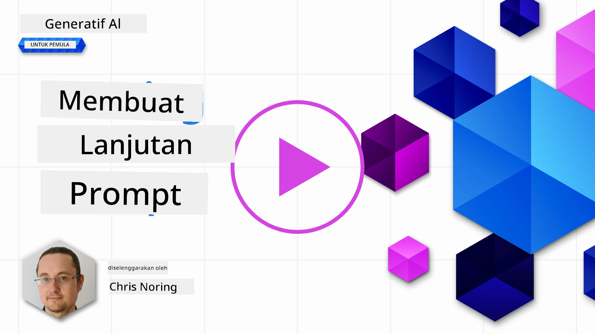

# Membuat Prompt Lanjutan

[](https://youtu.be/BAjzkaCdRok?si=NmUIyRf7-cDgbjtt)

Mari kita ulang beberapa pembelajaran dari bab sebelumnya:

> _Rekayasa_ prompt adalah proses di mana kita **mengarahkan model menuju respons yang lebih relevan** dengan memberikan instruksi atau konteks yang lebih berguna.

Ada juga dua langkah dalam menulis prompt: membangun prompt, dengan memberikan konteks yang relevan, dan _optimisasi_, bagaimana secara bertahap memperbaiki prompt tersebut.

Pada titik ini, kita memiliki pemahaman dasar tentang cara menulis prompt, tetapi kita perlu mendalaminya. Dalam bab ini, kamu akan beralih dari mencoba berbagai prompt menjadi memahami mengapa satu prompt lebih baik daripada yang lain. Kamu akan belajar bagaimana membangun prompt mengikuti beberapa teknik dasar yang dapat diterapkan pada LLM manapun.

## Pendahuluan

Dalam bab ini, kita akan membahas topik berikut:

- Memperluas pengetahuan rekayasa prompt dengan menerapkan berbagai teknik pada prompt kamu.
- Mengonfigurasi prompt kamu untuk memvariasikan output.

## Tujuan pembelajaran

Setelah menyelesaikan pelajaran ini, kamu akan dapat:

- Menerapkan teknik rekayasa prompt yang meningkatkan hasil prompt kamu.
- Melakukan prompting yang bersifat bervariasi atau deterministik.

## Rekayasa prompt

Rekayasa prompt adalah proses membuat prompt yang akan menghasilkan hasil yang diinginkan. Rekayasa prompt lebih dari sekadar menulis teks prompt. Rekayasa prompt bukan disiplin teknik, melainkan kumpulan teknik yang bisa kamu terapkan untuk mendapatkan hasil yang diinginkan.

### Contoh sebuah prompt

Mari ambil contoh prompt dasar seperti ini:

> Hasilkan 10 pertanyaan tentang geografi.

Dalam prompt ini, kamu sebenarnya menerapkan beberapa teknik prompt yang berbeda.

Mari kita uraikan.

- **Konteks**, kamu menyebutkan harus tentang "geografi".
- **Membatasi output**, kamu ingin tidak lebih dari 10 pertanyaan.

### Keterbatasan prompting sederhana

Kamu mungkin mendapatkan hasil yang diinginkan atau tidak. Pertanyaan kamu akan dibuat, namun geografi adalah topik besar dan kamu mungkin tidak mendapatkan apa yang kamu inginkan karena alasan berikut:

- **Topik besar**, kamu tidak tahu apakah itu akan tentang negara, ibu kota, sungai dan lain-lain.
- **Format**, bagaimana jika kamu ingin pertanyaannya diformat dengan cara tertentu?

Seperti yang kamu lihat, ada banyak hal untuk dipertimbangkan saat membuat prompt.

Sejauh ini, kita telah melihat contoh prompt sederhana, tapi AI generatif mampu jauh lebih banyak untuk membantu orang dalam berbagai peran dan industri. Mari kita jelajahi beberapa teknik dasar berikutnya.

### Teknik untuk prompting

Pertama, kita perlu memahami bahwa prompting adalah sifat _emergent_ dari LLM yang berarti ini bukan fitur yang dibangun ke dalam model tetapi sesuatu yang kita temukan saat menggunakan model.

Ada beberapa teknik dasar yang bisa kita gunakan untuk mem-prompt LLM. Mari kita jelajahi.

- **Zero-shot prompting**, ini bentuk prompting paling dasar. Ini adalah satu prompt yang meminta respons dari LLM hanya berdasarkan data latihannya.
- **Few-shot prompting**, jenis prompting ini membimbing LLM dengan memberikan 1 atau lebih contoh yang bisa diandalkannya untuk menghasilkan respons.
- **Chain-of-thought**, jenis prompting ini memberitahu LLM bagaimana memecah masalah menjadi langkah-langkah.
- **Pengetahuan yang dihasilkan**, untuk memperbaiki respons prompt, kamu bisa memberikan fakta atau pengetahuan yang dihasilkan selain promptmu.
- **Least to most**, seperti chain-of-thought, teknik ini tentang memecah masalah menjadi rangkaian langkah dan kemudian minta langkah-langkah ini dilakukan secara berurutan.
- **Self-refine**, teknik ini tentang mengkritik output LLM lalu memintanya memperbaikinya.
- **Maieutik prompting**. Yang kamu inginkan di sini adalah memastikan jawaban LLM benar dan kamu minta ia menjelaskan berbagai bagian dari jawaban tersebut. Ini adalah bentuk self-refine.

### Zero-shot prompting

Gaya prompting ini sangat sederhana, terdiri dari satu prompt. Teknik ini mungkin yang kamu gunakan saat mulai belajar tentang LLM. Berikut contohnya:

- Prompt: "Apa itu Aljabar?"
- Jawaban: "Aljabar adalah cabang matematika yang mempelajari simbol-simbol matematika dan aturan untuk memanipulasi simbol tersebut."

### Few-shot prompting

Gaya prompting ini membantu model dengan memberikan beberapa contoh beserta permintaan. Ini terdiri dari satu prompt dengan data spesifik tugas tambahan. Berikut contohnya:

- Prompt: "Tulislah puisi dengan gaya Shakespeare. Berikut beberapa contoh soneta Shakespeare:
  Soneta 18: 'Haruskah aku membandingkanmu dengan hari musim panas? Kau lebih indah dan lebih sejuk...'
  Soneta 116: 'Aku tak boleh menghalangi ikatan pikiran sejati. Cinta bukan cinta yang berubah saat ada perubahan...'
  Soneta 132: 'Matamu kucintai, dan mereka, seakan kasihan padaku, mengetahui hatimu menyiksaku dengan penghinaan,...'
  Sekarang, tulislah soneta tentang keindahan bulan."
- Jawaban: "Di langit, bulan bersinar lembut, Dalam cahaya perak yang memancarkan rahmat lembut,..."

Contoh memberikan konteks, format, atau gaya output yang diinginkan pada LLM. Mereka membantu model memahami tugas spesifik dan menghasilkan jawaban yang lebih tepat dan relevan.

### Chain-of-thought

Chain-of-thought adalah teknik yang sangat menarik karena tentang membawa LLM melalui serangkaian langkah. Idemya adalah menginstruksikan LLM sedemikian rupa sehingga ia memahami cara melakukan sesuatu. Pertimbangkan contoh berikut, dengan dan tanpa chain-of-thought:

    - Prompt: "Alice memiliki 5 apel, melempar 3 apel, memberi 2 kepada Bob dan Bob memberikan satu kembali, berapa banyak apel yang Alice miliki?"
    - Jawaban: 5

LLM menjawab 5, yang salah. Jawaban yang benar adalah 1 apel, berdasarkan perhitungan (5 -3 -2 + 1 = 1).

Jadi bagaimana kita mengajari LLM agar melakukan ini dengan benar?

Mari coba chain-of-thought. Menerapkan chain-of-thought berarti:

1. Beri LLM contoh yang serupa.
1. Tunjukkan perhitungannya, dan bagaimana menghitungnya dengan benar.
1. Beri prompt asli.

Berikut caranya:

- Prompt: "Lisa memiliki 7 apel, melempar 1 apel, memberi 4 apel kepada Bart dan Bart memberikan satu kembali:
  7 -1 = 6
  6 -4 = 2
  2 +1 = 3  
  Alice memiliki 5 apel, melempar 3 apel, memberi 2 kepada Bob dan Bob memberikan satu kembali, berapa banyak apel yang Alice miliki?"
  Jawaban: 1

Perhatikan bagaimana kita menulis prompt yang jauh lebih panjang dengan contoh lain, perhitungan, lalu prompt asli dan kita sampai pada jawaban yang benar yaitu 1.

Seperti yang kamu lihat, chain-of-thought adalah teknik yang sangat kuat.

### Pengetahuan yang dihasilkan

Seringkali saat kamu ingin membuat prompt, kamu ingin melakukannya menggunakan data perusahaanmu sendiri. Kamu ingin bagian dari prompt berasal dari perusahaan dan bagian lain adalah prompt sebenarnya yang kamu minati.

Sebagai contoh, berikut ini seperti apa prompt kamu bisa terlihat jika kamu berada di bisnis asuransi:

```text
{{company}}: {{company_name}}
{{products}}:
{{products_list}}
Please suggest an insurance given the following budget and requirements:
Budget: {{budget}}
Requirements: {{requirements}}
```

Di atas, terlihat bagaimana prompt dibangun menggunakan templat. Dalam templat ada sejumlah variabel, yang ditandai dengan `{{variable}}`, yang akan diganti dengan nilai aktual dari API perusahaan.

Berikut contoh bagaimana prompt bisa terlihat setelah variabel diganti dengan konten dari perusahaan kamu:

```text
Insurance company: ACME Insurance
Insurance products (cost per month):
- Car, cheap, 500 USD
- Car, expensive, 1100 USD
- Home, cheap, 600 USD
- Home, expensive, 1200 USD
- Life, cheap, 100 USD

Please suggest an insurance given the following budget and requirements:
Budget: $1000
Requirements: Car, Home, and Life insurance
```

Menjalankan prompt ini melalui LLM akan menghasilkan respons seperti ini:

```output
Given the budget and requirements, we suggest the following insurance package from ACME Insurance:
- Car, cheap, 500 USD
- Home, cheap, 600 USD
- Life, cheap, 100 USD
Total cost: $1,200 USD
```

Seperti yang kamu lihat, juga menyarankan Asuransi Jiwa, yang seharusnya tidak. Hasil ini adalah indikasi bahwa kita perlu mengoptimalkan prompt dengan mengubah prompt agar lebih jelas tentang apa yang boleh diterima. Setelah beberapa _trial and error_, kita sampai pada prompt sebagai berikut:

```text
Insurance company: ACME Insurance
Insurance products (cost per month):
- type: Car, cheap, cost: 500 USD
- type: Car, expensive, cost: 1100 USD
- type: Home, cheap, cost: 600 USD
- type: Home, expensive, cost: 1200 USD
- type: Life, cheap, cost: 100 USD

Please suggest an insurance given the following budget and requirements:
Budget: $1000 restrict choice to types: Car, Home
```

Perhatikan bagaimana menambahkan _tipe_ dan _biaya_ serta menggunakan kata kunci _restrict_ membantu LLM memahami apa yang kita inginkan.

Sekarang kita mendapatkan respons berikut:

```output
Given the budget and requirements, we suggest the Car, Cheap insurance product which costs 500 USD per month.
```

Inti contoh ini adalah menunjukkan bahwa meskipun kita menggunakan teknik dasar seperti _pengetahuan yang dihasilkan_, kita masih perlu mengoptimalkan prompt dalam sebagian besar kasus untuk mendapatkan hasil yang diinginkan.

### Least-to-most

Ide dengan prompting Least-to-most adalah memecah masalah besar menjadi submasalah. Dengan cara itu, kamu membimbing LLM tentang bagaimana "menaklukkan" masalah yang lebih besar. Contoh yang bagus bisa untuk ilmu data di mana kamu bisa meminta LLM membagi masalah seperti ini:

> Prompt: Bagaimana melakukan ilmu data dalam 5 langkah?

Dengan asisten AI kamu menjawab:

1. Kumpulkan data
1. Bersihkan data
1. Analisis data
1. Plot data
1. Sajikan data

### Self-refine, kritik hasil

Dengan AI generatif dan LLM, kamu tidak bisa langsung percaya outputnya. Kamu perlu memverifikasinya. Lagi pula, LLM hanya menyajikan apa hal yang paling mungkin berikutnya untuk dikatakan, bukan apa yang benar. Oleh karena itu, ide bagus adalah meminta LLM mengkritik dirinya sendiri, yang membawa kita pada teknik self-refine.

Cara kerjanya adalah kamu mengikuti langkah-langkah berikut:

1. Prompt awal meminta LLM menyelesaikan masalah
1. LLM menjawab
1. Kamu mengkritik jawaban dan meminta AI untuk memperbaiki
1. LLM menjawab lagi, kali ini mempertimbangkan kritik dan menyarankan solusi yang ditemukannya

Kamu bisa mengulangi proses ini sebanyak yang kamu mau.

Berikut contoh menggunakan teknik ini:

> Prompt: "Buat API Web Python dengan rute produk dan pelanggan"

Jawaban AI:

```python
import flask
app = Flask(__name__)

@app.route('/products')
def products():
    return 'Products'

@app.route('/customers')
def customers():
    return 'Customers'
```

> Prompt: sarankan 3 perbaikan dari kode di atas

Jawaban AI:

```text
Sure, here are three suggestions to improve the code:

Import the correct module: The first line should import Flask instead of flask. The correct import statement should be from flask import Flask.

Add a main function: Add a if __name__ == '__main__': block to the end of the file to run the application when the file is executed.

Use f-strings: Use f-strings to format the return statements in the route functions. For example, return 'Products' can be changed to return f'This is the {request.path} page'.
```

```python
from flask import Flask, request

app = Flask(__name__)

@app.route('/products')
def products():
    return f'This is the {request.path} page'

@app.route('/customers')
def customers():
    return f'This is the {request.path} page'

if __name__ == '__main__':
    app.run()
```

Seperti yang kamu lihat, respons AI di atas memperbaiki kode yang disarankan pertama berkat mengkritik jawaban pertama.

### Maieutik prompting

Maieutik prompting adalah teknik yang mirip dengan self-refine tapi lebih tentang meminta LLM menjelaskan dirinya sendiri. Tujuannya adalah mengurangi inkonsistensi dalam output LLM sehingga memastikan ia sampai pada jawaban yang benar. Alur kerja yang diikuti adalah:

1. Minta LLM menjawab sebuah pertanyaan
1. Untuk setiap bagian jawaban, minta LLM menjelaskannya lebih mendalam.
1. Jika ada inkonsistensi, buang bagian yang tidak konsisten.

Ulangi langkah 2 dan 3 sampai kamu sudah membahas semua bagian dan puas dengan jawaban.

Berikut contoh prompt:

> prompt: Bagaimana cara membuat rencana krisis untuk mengurangi dampak pandemi dalam 5 langkah?
> Jawaban LLM:

```text
1. Identify the risks
1. Identify the stakeholders
1. Identify the resources
1. Identify the actions
1. Identify the communication channels
```

Sudah diidentifikasi 5 langkah, tapi bisakah kita menentukan ini benar? Mari minta LLM menjelaskan tiap langkah:

> prompt: Jelaskan langkah pertama dengan lebih rinci, apa saja risiko detail dengan pandemi?

```text
The risks are the following:

- Loss of life
- Loss of business
- Loss of reputation
- Loss of customers
- Loss of employees
```

Pada titik ini, kita ingin memastikan LLM benar jadi kita minta penjelasan risiko pertama secara lebih rinci dan berharap konsisten dengan jawaban di atas:

> prompt: Dalam pandemi, risiko terbesar apa dan mengapa?

```text
The biggest risk is loss of life because it's the most important thing to protect.
```

> Apa dua risiko terbesar dalam pandemi?

```text
The two biggest risks are loss of life and loss of business.
```

Pada titik ini, LLM konsisten dan menyebutkan "kehidupan" dan "bisnis" sebagai dua risiko utama. Sekarang kita bisa melanjutkan ke langkah berikutnya dan cukup yakin. Namun, kita tidak boleh mempercayai LLM secara membabi buta, kita harus selalu memverifikasi output.

## Variasikan output kamu

LLM bersifat nondeterministik secara alami, yang berarti kamu akan mendapatkan hasil berbeda setiap kali menjalankan prompt yang sama. Coba prompt berikut misalnya:

> "Buat kode untuk API Web Python"

```python
# Impor modul yang diperlukan
import flask
from flask import request, jsonify

# Buat aplikasi Flask
app = flask.Flask(__name__)

# Buat rute untuk API
@app.route('/api', methods=['GET'])
def api():
    # Dapatkan data dari permintaan
    data = request.args

    # Proses data
    result = process_data(data)

    # Kembalikan hasil sebagai JSON
    return jsonify(result)

# Fungsi untuk memproses data
def process_data(data):
    # Lakukan sesuatu dengan data
    result = data + 1

    # Kembalikan hasil
    return result

# Jalankan aplikasi
if __name__ == '__main__':
    app.run()

```

Menjalankan prompt yang sama lagi menghasilkan respons yang sedikit berbeda:

```python
#impor paket yang diperlukan
import flask
from flask import request, jsonify

#buat aplikasi Flask
app = flask.Flask(__name__)
app.config["DEBUG"] = True

#buat daftar buku
books = [
    {'id': 0,
     'title': 'A Fire Upon the Deep',
     'author': 'Vernor Vinge',
     'first_sentence': 'The coldsleep itself was dreamless.',
     'year_published': '1992'},
    {'id': 1,
     'title': 'The Ones Who Walk Away From Omelas',
     'author': 'Ursula K. Le Guin',
     'first_sentence': 'With a clamor of bells that set the swallows soaring, the Festival of Summer came to the city Omelas, bright-towered by the sea.',
     'published': '1973'},
    {'id': 2,
     'title': 'Dhalgren',
     'author': 'Samuel R. Delany',
     'first_sentence': 'to wound the autumnal city.',
     'published': '1975'}
]

#buat endpoint untuk API
@app.route('/', methods=['GET'])
def home():
    return '''<h1>Books API</h1>
<p>A prototype API for retrieving books.</p>'''

#buat endpoint untuk mengembalikan semua buku
@app.route('/api/v1/resources/books/all', methods=['GET'])
def api_all():
    return jsonify(books)

#buat endpoint untuk mengembalikan satu buku
@app.route('/api/v1/resources/books', methods=['GET'])
def api_id():
    #periksa apakah ID diberikan sebagai bagian dari URL
    #jika ID diberikan, tetapkan ke variabel
    #jika tidak ada ID yang diberikan, tampilkan error
    if 'id' in request.args:
        id = int(request.args['id'])
    else:
        return "Error: No id field provided. Please specify an id."

    #buat daftar kosong untuk hasil kami
    results = []

    #loop melalui data dan cocokkan hasil yang sesuai dengan ID yang diminta
    #ID adalah unik, tetapi bidang lain mungkin mengembalikan banyak hasil
    for book in books:
        if book['id'] == id:
            results.append(book)

    #gunakan fungsi jsonify dari Flask untuk mengubah daftar kami
    #kamus Python ke format JSON
    return jsonify(results)

app.run()
```

> Jadi apakah output yang bervariasi ini masalah?

Bergantung pada apa yang kamu coba lakukan. Jika kamu ingin jawaban spesifik maka ini masalah. Jika kamu nyaman dengan output bervariasi seperti "Buat 3 pertanyaan apa saja tentang geografi", maka ini bukan masalah.

### Menggunakan temperature untuk memvariasikan output kamu

Oke, jadi kita sudah memutuskan kita ingin membatasi output agar lebih dapat diprediksi, yaitu lebih deterministik. Bagaimana caranya?

Temperature adalah nilai antara 0 dan 1, di mana 0 adalah yang paling deterministik dan 1 adalah yang paling bervariasi. Nilai default adalah 0,7. Mari lihat apa yang terjadi dengan dua kali menjalankan prompt yang sama dengan temperature diset ke 0,1:

> "Buat kode untuk API Web Python"

```python
#impor pustaka yang diperlukan
import flask
from flask import request, jsonify

#buat sebuah instance dari kelas Flask
app = flask.Flask(__name__)

#buat endpoint untuk API
@app.route('/api/v1/endpoint', methods=['GET'])
def api_endpoint():
    #dapatkan data permintaan
    data = request.get_json()

    #proses data
    result = process_data(data)

    #kembalikan hasil
    return jsonify(result)

#fungsi untuk memproses data
def process_data(data):
    #proses data
    result = {'result': 'success'}

    #kembalikan hasil
    return result

#jalankan aplikasi Flask
if __name__ == '__main__':
    app.run()

```

Menjalankan prompt lagi menghasilkan outcome berikut:

```python
#impor pustaka yang diperlukan
import flask
from flask import request, jsonify

#buat aplikasi Flask
app = flask.Flask(__name__)

#buat rute untuk API
@app.route('/api', methods=['GET'])
def api_call():
    #dapatkan data dari permintaan
    data = request.get_json()

    #proses data
    result = process_data(data)

    #kembalikan hasil
    return jsonify(result)

#definisikan fungsi process_data
def process_data(data):
    #lakukan sesuatu dengan data
    result = data + 1

    #kembalikan hasil
    return result

#jalankan aplikasi
if __name__ == '__main__':
    app.run()

```

Hanya ada perbedaan kecil antara dua output ini. Mari lakukan yang sebaliknya kali ini, kita set temperature ke 0,9:

```python
# Impor perpustakaan yang dibutuhkan
import flask
from flask import request, jsonify

# Buat aplikasi Flask
app = flask.Flask(__name__)

# Buat rute untuk API
@app.route('/api', methods=['GET'])
def api_call():
    # Dapatkan data dari permintaan
    data = request.args

    # Proses data
    result = process_data(data)

    # Kembalikan hasil
    return jsonify(result)

# Fungsi untuk memproses data
def process_data(data):
    # Lakukan sesuatu dengan data
    result = data + 1

    # Kembalikan hasil
    return result

# Jalankan aplikasi
if __name__ == '__main__':
    app.run()

```

dan upaya kedua dengan nilai temperature 0,9:

```python
import flask
from flask import request, jsonify

# buat aplikasi Flask
app = flask.Flask(__name__)
app.config['DEBUG'] = True

# buat beberapa data uji
books = [
    {'id': 0, 'title': 'A Fire Upon The Deep', 'author': 'Vernor Vinge', 'first_sentence': 'The coldsleep itself was dreamless.', 'year_published': '1992'},
    {'id': 1, 'title': 'The Ones Who Walk Away From Omelas', 'author': 'Ursula K. Le Guin', 'first_sentence': 'With a clamor of bells that set the swallows soaring, the Festival of Summer came to the city Omelas, bright-towered by the sea.', 'published': '1973'},
    {'id': 2, 'title': 'Dhalgren', 'author': 'Samuel R. Delany', 'first_sentence': 'to wound the autumnal city.', 'published': '1975'}
]

# buat sebuah endpoint
@app.route('/', methods=['GET'])
def home():
    return '''<h1>Welcome to our book API!</h1>'''

@app.route('/api/v1/resources/books

```

Seperti yang kamu lihat, hasilnya sangat bervariasi.


> Perlu dicatat, ada lebih banyak parameter yang dapat Anda ubah untuk memvariasikan keluaran, seperti top-k, top-p, penalti pengulangan, penalti panjang, dan penalti keberagaman tetapi ini berada di luar cakupan kurikulum ini.

## Praktik baik

Ada banyak praktik yang dapat Anda terapkan untuk mencoba mendapatkan apa yang Anda inginkan. Anda akan menemukan gaya Anda sendiri saat Anda menggunakan prompting semakin banyak.

Selain teknik yang telah kita bahas, ada beberapa praktik baik untuk dipertimbangkan saat melakukan prompting pada LLM.

Berikut adalah beberapa praktik baik yang perlu dipertimbangkan:

- **Tentukan konteks**. Konteks itu penting, semakin Anda bisa menentukan seperti domain, topik, dll., semakin baik.
- Batasi keluaran. Jika Anda ingin jumlah item tertentu atau panjang tertentu, sebutkan itu.
- **Tentukan baik apa dan bagaimana**. Ingat untuk menyebutkan apa yang Anda inginkan dan bagaimana Anda menginginkannya, misalnya "Buat API Web Python dengan rute produk dan pelanggan, bagi menjadi 3 file".
- **Gunakan template**. Seringkali, Anda ingin memperkaya prompt Anda dengan data dari perusahaan Anda. Gunakan template untuk melakukan ini. Template dapat memiliki variabel yang Anda gantikan dengan data sebenarnya.
- **Eja dengan benar**. LLM mungkin memberikan jawaban yang benar, tetapi jika Anda mengeja dengan benar, Anda akan mendapatkan jawaban yang lebih baik.

## Tugas

Berikut adalah kode Python yang menunjukkan cara membangun API sederhana menggunakan Flask:

```python
from flask import Flask, request

app = Flask(__name__)

@app.route('/')
def hello():
    name = request.args.get('name', 'World')
    return f'Hello, {name}!'

if __name__ == '__main__':
    app.run()
```

Gunakan asisten AI seperti GitHub Copilot atau ChatGPT dan terapkan teknik "self-refine" untuk memperbaiki kode.

## Solusi

Silakan coba selesaikan tugas dengan menambahkan prompt yang sesuai pada kode.

> [!TIP]
> Buatlah sebuah prompt untuk memintanya memperbaiki, sebaiknya batasi berapa banyak perbaikan yang dilakukan. Anda juga dapat meminta untuk memperbaikinya dengan cara tertentu, misalnya arsitektur, performa, keamanan, dll.

[Solusi](../../../05-advanced-prompts/python/aoai-solution.py)

## Pemeriksaan pengetahuan

Mengapa saya harus menggunakan prompting rantai pemikiran (chain-of-thought)? Tunjukkan 1 jawaban benar dan 2 jawaban salah.

1. Untuk mengajarkan LLM bagaimana cara menyelesaikan masalah.
1. B, Untuk mengajarkan LLM menemukan kesalahan dalam kode.
1. C, Untuk menginstruksikan LLM mencari solusi yang berbeda.

A: 1, karena chain-of-thought adalah tentang menunjukkan kepada LLM bagaimana cara menyelesaikan masalah dengan memberinya serangkaian langkah, dan masalah serupa serta cara mereka diselesaikan.

## 🚀 Tantangan

Anda baru saja menggunakan teknik self-refine dalam tugas. Ambil program apa pun yang telah Anda buat dan pertimbangkan perbaikan apa yang ingin Anda terapkan. Sekarang gunakan teknik self-refine untuk menerapkan perubahan yang diusulkan. Bagaimana menurut Anda hasilnya, lebih baik atau lebih buruk?

## Kerja bagus! Lanjutkan Pembelajaran Anda

Setelah menyelesaikan pelajaran ini, lihatlah [koleksi Pembelajaran AI Generatif kami](https://aka.ms/genai-collection?WT.mc_id=academic-105485-koreyst) untuk terus meningkatkan pengetahuan AI Generatif Anda!

Lanjutkan ke Pelajaran 6 di mana kita akan menerapkan pengetahuan Prompt Engineering dengan [membangun aplikasi generasi teks](../06-text-generation-apps/README.md?WT.mc_id=academic-105485-koreyst)

---

<!-- CO-OP TRANSLATOR DISCLAIMER START -->
**Penafian**:
Dokumen ini telah diterjemahkan menggunakan layanan terjemahan AI [Co-op Translator](https://github.com/Azure/co-op-translator). Meskipun kami berupaya untuk mencapai akurasi, harap diketahui bahwa terjemahan otomatis mungkin mengandung kesalahan atau ketidakakuratan. Dokumen asli dalam bahasa aslinya harus dianggap sebagai sumber yang sah. Untuk informasi penting, disarankan menggunakan terjemahan profesional oleh manusia. Kami tidak bertanggung jawab atas kesalahpahaman atau penafsiran yang keliru yang timbul dari penggunaan terjemahan ini.
<!-- CO-OP TRANSLATOR DISCLAIMER END -->