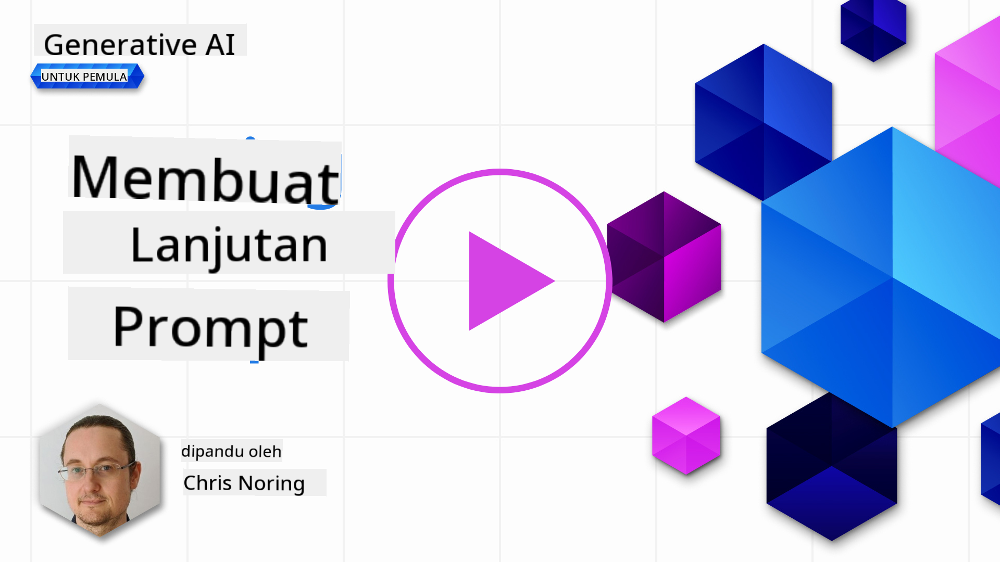

<!--
CO_OP_TRANSLATOR_METADATA:
{
  "original_hash": "b2651fb16bcfbc62b8e518751ed90fdb",
  "translation_date": "2025-10-17T20:41:35+00:00",
  "source_file": "05-advanced-prompts/README.md",
  "language_code": "id"
}
-->
# Membuat Prompt Lanjutan

[](https://youtu.be/BAjzkaCdRok?si=NmUIyRf7-cDgbjtt)

Mari kita ulas kembali beberapa pembelajaran dari bab sebelumnya:

> _Prompt engineering_ adalah proses di mana kita **mengarahkan model untuk memberikan respons yang lebih relevan** dengan menyediakan instruksi atau konteks yang lebih berguna.

Ada dua langkah dalam menulis prompt: membangun prompt dengan memberikan konteks yang relevan, dan _optimasi_, yaitu bagaimana secara bertahap meningkatkan kualitas prompt.

Pada titik ini, kita sudah memiliki pemahaman dasar tentang cara menulis prompt, tetapi kita perlu mendalaminya lebih jauh. Dalam bab ini, Anda akan belajar dari mencoba berbagai prompt hingga memahami mengapa satu prompt lebih baik daripada yang lain. Anda akan mempelajari cara membangun prompt dengan mengikuti beberapa teknik dasar yang dapat diterapkan pada LLM apa pun.

## Pendahuluan

Dalam bab ini, kita akan membahas topik-topik berikut:

- Memperluas pengetahuan Anda tentang _prompt engineering_ dengan menerapkan berbagai teknik pada prompt Anda.
- Mengonfigurasi prompt Anda untuk menghasilkan output yang bervariasi.

## Tujuan Pembelajaran

Setelah menyelesaikan pelajaran ini, Anda akan dapat:

- Menerapkan teknik _prompt engineering_ yang meningkatkan hasil dari prompt Anda.
- Melakukan _prompting_ yang bervariasi atau deterministik.

## Prompt Engineering

_Prompt engineering_ adalah proses menciptakan prompt yang akan menghasilkan hasil yang diinginkan. _Prompt engineering_ lebih dari sekadar menulis teks prompt. Ini bukan disiplin teknik, melainkan serangkaian teknik yang dapat Anda terapkan untuk mendapatkan hasil yang diinginkan.

### Contoh Prompt

Mari kita ambil contoh prompt dasar seperti ini:

> Buat 10 pertanyaan tentang geografi.

Dalam prompt ini, Anda sebenarnya menerapkan serangkaian teknik _prompt_ yang berbeda.

Mari kita uraikan.

- **Konteks**, Anda menentukan bahwa itu harus tentang "geografi".
- **Membatasi output**, Anda menginginkan tidak lebih dari 10 pertanyaan.

### Keterbatasan Prompt Sederhana

Anda mungkin mendapatkan atau tidak mendapatkan hasil yang diinginkan. Anda akan mendapatkan pertanyaan yang dihasilkan, tetapi geografi adalah topik yang luas dan Anda mungkin tidak mendapatkan apa yang Anda inginkan karena alasan berikut:

- **Topik yang luas**, Anda tidak tahu apakah itu akan tentang negara, ibu kota, sungai, dan sebagainya.
- **Format**, bagaimana jika Anda ingin pertanyaan-pertanyaan tersebut diformat dengan cara tertentu?

Seperti yang Anda lihat, ada banyak hal yang perlu dipertimbangkan saat membuat prompt.

Sejauh ini, kita telah melihat contoh prompt sederhana, tetapi AI generatif mampu melakukan lebih banyak hal untuk membantu orang dalam berbagai peran dan industri. Mari kita jelajahi beberapa teknik dasar berikutnya.

### Teknik-Teknik untuk Prompting

Pertama, kita perlu memahami bahwa _prompting_ adalah sifat _emergent_ dari LLM, yang berarti ini bukan fitur yang dibangun ke dalam model, melainkan sesuatu yang kita temukan saat menggunakan model.

Ada beberapa teknik dasar yang dapat kita gunakan untuk mem-_prompt_ LLM. Mari kita jelajahi.

- **Zero-shot prompting**, ini adalah bentuk _prompting_ yang paling dasar. Ini adalah satu _prompt_ yang meminta respons dari LLM hanya berdasarkan data pelatihannya.
- **Few-shot prompting**, jenis _prompting_ ini membimbing LLM dengan memberikan 1 atau lebih contoh yang dapat diandalkan untuk menghasilkan responsnya.
- **Chain-of-thought**, jenis _prompting_ ini memberi tahu LLM cara memecah masalah menjadi langkah-langkah.
- **Generated knowledge**, untuk meningkatkan respons _prompt_, Anda dapat memberikan fakta atau pengetahuan tambahan pada _prompt_ Anda.
- **Least to most**, seperti _chain-of-thought_, teknik ini adalah tentang memecah masalah menjadi serangkaian langkah dan kemudian meminta langkah-langkah tersebut dilakukan secara berurutan.
- **Self-refine**, teknik ini adalah tentang mengkritik output LLM dan kemudian memintanya untuk memperbaiki.
- **Maieutic prompting**, di sini Anda ingin memastikan jawaban LLM benar dan Anda memintanya untuk menjelaskan berbagai bagian dari jawaban tersebut. Ini adalah bentuk dari _self-refine_.

### Zero-shot Prompting

Gaya _prompting_ ini sangat sederhana, hanya terdiri dari satu _prompt_. Teknik ini mungkin adalah yang paling sering Anda gunakan saat mulai belajar tentang LLM. Berikut contohnya:

- Prompt: "Apa itu Aljabar?"
- Jawaban: "Aljabar adalah cabang matematika yang mempelajari simbol-simbol matematika dan aturan untuk memanipulasi simbol-simbol tersebut."

### Few-shot Prompting

Gaya _prompting_ ini membantu model dengan memberikan beberapa contoh bersama dengan permintaan. Ini terdiri dari satu _prompt_ dengan data spesifik tambahan. Berikut contohnya:

- Prompt: "Tulis sebuah puisi dengan gaya Shakespeare. Berikut beberapa contoh soneta Shakespeare:
  Soneta 18: 'Shall I compare thee to a summer's day? Thou art more lovely and more temperate...'
 
Seperti yang Anda lihat, hasilnya sangat beragam.

> Perhatikan, ada lebih banyak parameter yang dapat Anda ubah untuk memvariasikan output, seperti top-k, top-p, repetition penalty, length penalty, dan diversity penalty, tetapi ini berada di luar cakupan kurikulum ini.

## Praktik yang Baik

Ada banyak praktik yang dapat Anda terapkan untuk mencoba mendapatkan hasil yang Anda inginkan. Anda akan menemukan gaya Anda sendiri seiring dengan semakin seringnya Anda menggunakan teknik prompting.

Selain teknik-teknik yang telah kita bahas, ada beberapa praktik baik yang perlu dipertimbangkan saat memberikan prompt kepada LLM.

Berikut adalah beberapa praktik baik yang perlu dipertimbangkan:

- **Tentukan konteks**. Konteks sangat penting, semakin banyak Anda dapat menentukan seperti domain, topik, dll., semakin baik.
- Batasi output. Jika Anda menginginkan jumlah item tertentu atau panjang tertentu, tentukan itu.
- **Tentukan apa dan bagaimana**. Ingatlah untuk menyebutkan apa yang Anda inginkan dan bagaimana Anda menginginkannya, misalnya "Buat Python Web API dengan rute produk dan pelanggan, bagi menjadi 3 file".
- **Gunakan template**. Sering kali, Anda ingin memperkaya prompt Anda dengan data dari perusahaan Anda. Gunakan template untuk melakukan ini. Template dapat memiliki variabel yang Anda ganti dengan data aktual.
- **Eja dengan benar**. LLM mungkin memberikan respons yang benar, tetapi jika Anda mengeja dengan benar, Anda akan mendapatkan respons yang lebih baik.

## Tugas

Berikut adalah kode dalam Python yang menunjukkan cara membangun API sederhana menggunakan Flask:

```python
from flask import Flask, request

app = Flask(__name__)

@app.route('/')
def hello():
    name = request.args.get('name', 'World')
    return f'Hello, {name}!'

if __name__ == '__main__':
    app.run()
```

Gunakan asisten AI seperti GitHub Copilot atau ChatGPT dan terapkan teknik "self-refine" untuk meningkatkan kode tersebut.

## Solusi

Silakan coba menyelesaikan tugas dengan menambahkan prompt yang sesuai ke dalam kode.

> [!TIP]
> Susun prompt untuk meminta peningkatan, sebaiknya batasi jumlah peningkatan. Anda juga dapat meminta peningkatan dalam cara tertentu, misalnya arsitektur, performa, keamanan, dll.

[Solusi](../../../05-advanced-prompts/python/aoai-solution.py)

## Uji Pengetahuan

Mengapa saya menggunakan chain-of-thought prompting? Tunjukkan 1 jawaban yang benar dan 2 jawaban yang salah.

1. Untuk mengajarkan LLM cara menyelesaikan masalah.
1. B, Untuk mengajarkan LLM menemukan kesalahan dalam kode.
1. C, Untuk menginstruksikan LLM menghasilkan berbagai solusi.

A: 1, karena chain-of-thought adalah tentang menunjukkan kepada LLM cara menyelesaikan masalah dengan memberikan serangkaian langkah, dan masalah serupa serta bagaimana mereka diselesaikan.

## 🚀 Tantangan

Anda baru saja menggunakan teknik self-refine dalam tugas. Ambil program apa pun yang telah Anda buat dan pertimbangkan perbaikan apa yang ingin Anda terapkan padanya. Sekarang gunakan teknik self-refine untuk menerapkan perubahan yang diusulkan. Menurut Anda, apakah hasilnya lebih baik atau lebih buruk?

## Kerja Hebat! Lanjutkan Pembelajaran Anda

Setelah menyelesaikan pelajaran ini, lihat [koleksi Pembelajaran AI Generatif kami](https://aka.ms/genai-collection?WT.mc_id=academic-105485-koreyst) untuk terus meningkatkan pengetahuan Anda tentang AI Generatif!

Lanjutkan ke Pelajaran 6 di mana kita akan menerapkan pengetahuan kita tentang Prompt Engineering dengan [membangun aplikasi generasi teks](../06-text-generation-apps/README.md?WT.mc_id=academic-105485-koreyst)

---

**Penafian**:  
Dokumen ini telah diterjemahkan menggunakan layanan penerjemahan AI [Co-op Translator](https://github.com/Azure/co-op-translator). Meskipun kami berupaya untuk memberikan hasil yang akurat, harap diketahui bahwa terjemahan otomatis mungkin mengandung kesalahan atau ketidakakuratan. Dokumen asli dalam bahasa aslinya harus dianggap sebagai sumber yang otoritatif. Untuk informasi yang penting, disarankan menggunakan jasa penerjemahan manusia profesional. Kami tidak bertanggung jawab atas kesalahpahaman atau penafsiran yang timbul dari penggunaan terjemahan ini.