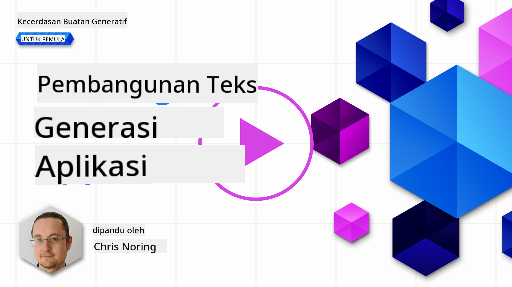

<!--
CO_OP_TRANSLATOR_METADATA:
{
  "original_hash": "ce8224073b86b728ed52b19bed7932fd",
  "translation_date": "2025-07-09T12:03:45+00:00",
  "source_file": "06-text-generation-apps/README.md",
  "language_code": "id"
}
-->
# Membangun Aplikasi Generasi Teks

[](https://aka.ms/gen-ai-lesson6-gh?WT.mc_id=academic-105485-koreyst)

> _(Klik gambar di atas untuk menonton video pelajaran ini)_

Sejauh ini dalam kurikulum ini, Anda telah melihat ada konsep inti seperti prompt dan bahkan disiplin khusus yang disebut "prompt engineering". Banyak alat yang bisa Anda gunakan seperti ChatGPT, Office 365, Microsoft Power Platform, dan lainnya, mendukung penggunaan prompt untuk menyelesaikan sesuatu.

Agar Anda bisa menambahkan pengalaman seperti itu ke dalam sebuah aplikasi, Anda perlu memahami konsep seperti prompt, completions, dan memilih pustaka yang akan digunakan. Itulah yang akan Anda pelajari di bab ini.

## Pendahuluan

Di bab ini, Anda akan:

- Mempelajari tentang pustaka openai dan konsep utamanya.
- Membangun aplikasi generasi teks menggunakan openai.
- Memahami cara menggunakan konsep seperti prompt, temperature, dan tokens untuk membangun aplikasi generasi teks.

## Tujuan pembelajaran

Di akhir pelajaran ini, Anda akan mampu:

- Menjelaskan apa itu aplikasi generasi teks.
- Membangun aplikasi generasi teks menggunakan openai.
- Mengonfigurasi aplikasi Anda untuk menggunakan lebih banyak atau lebih sedikit token serta mengubah temperature, untuk menghasilkan output yang bervariasi.

## Apa itu aplikasi generasi teks?

Biasanya saat Anda membangun aplikasi, aplikasi tersebut memiliki semacam antarmuka seperti berikut:

- Berbasis perintah. Aplikasi konsol adalah aplikasi khas di mana Anda mengetik perintah dan aplikasi menjalankan tugas. Misalnya, `git` adalah aplikasi berbasis perintah.
- Antarmuka pengguna (UI). Beberapa aplikasi memiliki antarmuka grafis (GUI) di mana Anda mengklik tombol, memasukkan teks, memilih opsi, dan lainnya.

### Aplikasi konsol dan UI memiliki keterbatasan

Bandingkan dengan aplikasi berbasis perintah di mana Anda mengetik perintah:

- **Terbatas**. Anda tidak bisa mengetik sembarang perintah, hanya perintah yang didukung aplikasi.
- **Spesifik bahasa**. Beberapa aplikasi mendukung banyak bahasa, tapi secara default aplikasi dibangun untuk bahasa tertentu, meskipun Anda bisa menambahkan dukungan bahasa lain.

### Manfaat aplikasi generasi teks

Lalu, apa yang membedakan aplikasi generasi teks?

Dalam aplikasi generasi teks, Anda memiliki fleksibilitas lebih, tidak terbatas pada sekumpulan perintah atau bahasa input tertentu. Sebaliknya, Anda bisa menggunakan bahasa alami untuk berinteraksi dengan aplikasi. Manfaat lain adalah karena Anda sudah berinteraksi dengan sumber data yang telah dilatih pada korpus informasi yang sangat luas, sementara aplikasi tradisional mungkin terbatas pada apa yang ada di database.

### Apa yang bisa saya bangun dengan aplikasi generasi teks?

Ada banyak hal yang bisa Anda buat. Misalnya:

- **Chatbot**. Chatbot yang menjawab pertanyaan tentang topik tertentu, seperti perusahaan Anda dan produknya, bisa menjadi pilihan yang tepat.
- **Asisten**. LLM sangat bagus untuk hal-hal seperti meringkas teks, mendapatkan wawasan dari teks, menghasilkan teks seperti resume, dan lainnya.
- **Asisten kode**. Tergantung pada model bahasa yang Anda gunakan, Anda bisa membangun asisten kode yang membantu menulis kode. Misalnya, Anda bisa menggunakan produk seperti GitHub Copilot maupun ChatGPT untuk membantu menulis kode.

## Bagaimana cara memulai?

Anda perlu menemukan cara untuk mengintegrasikan dengan LLM yang biasanya melibatkan dua pendekatan berikut:

- Menggunakan API. Di sini Anda membuat permintaan web dengan prompt Anda dan mendapatkan teks yang dihasilkan kembali.
- Menggunakan pustaka. Pustaka membantu membungkus panggilan API dan membuatnya lebih mudah digunakan.

## Pustaka/SDK

Ada beberapa pustaka terkenal untuk bekerja dengan LLM seperti:

- **openai**, pustaka ini memudahkan untuk terhubung ke model Anda dan mengirim prompt.

Kemudian ada pustaka yang beroperasi di tingkat yang lebih tinggi seperti:

- **Langchain**. Langchain cukup terkenal dan mendukung Python.
- **Semantic Kernel**. Semantic Kernel adalah pustaka dari Microsoft yang mendukung bahasa C#, Python, dan Java.

## Aplikasi pertama menggunakan openai

Mari kita lihat bagaimana membangun aplikasi pertama kita, pustaka apa yang dibutuhkan, berapa banyak yang diperlukan, dan sebagainya.

### Instal openai

Ada banyak pustaka untuk berinteraksi dengan OpenAI atau Azure OpenAI. Anda bisa menggunakan berbagai bahasa pemrograman seperti C#, Python, JavaScript, Java, dan lainnya. Kami memilih menggunakan pustaka Python `openai`, jadi kita akan menggunakan `pip` untuk menginstalnya.

```bash
pip install openai
```

### Membuat resource

Anda perlu melakukan langkah-langkah berikut:

- Buat akun di Azure [https://azure.microsoft.com/free/](https://azure.microsoft.com/free/?WT.mc_id=academic-105485-koreyst).
- Dapatkan akses ke Azure OpenAI. Kunjungi [https://learn.microsoft.com/azure/ai-services/openai/overview#how-do-i-get-access-to-azure-openai](https://learn.microsoft.com/azure/ai-services/openai/overview#how-do-i-get-access-to-azure-openai?WT.mc_id=academic-105485-koreyst) dan ajukan permohonan akses.

  > [!NOTE]
  > Pada saat penulisan, Anda perlu mengajukan permohonan akses ke Azure OpenAI.

- Instal Python <https://www.python.org/>
- Sudah membuat resource Azure OpenAI Service. Lihat panduan ini untuk cara [membuat resource](https://learn.microsoft.com/azure/ai-services/openai/how-to/create-resource?pivots=web-portal?WT.mc_id=academic-105485-koreyst).

### Temukan API key dan endpoint

Saat ini, Anda perlu memberi tahu pustaka `openai` API key mana yang akan digunakan. Untuk menemukan API key Anda, buka bagian "Keys and Endpoint" dari resource Azure OpenAI Anda dan salin nilai "Key 1".


Setelah Anda menyalin informasi ini, mari instruksikan pustaka untuk menggunakannya.

> [!NOTE]
> Sebaiknya pisahkan API key Anda dari kode. Anda bisa melakukannya dengan menggunakan variabel lingkungan.
>
> - Set variabel lingkungan `OPENAI_API_KEY` ke API key Anda.
>   `export OPENAI_API_KEY='sk-...'`

### Konfigurasi setup Azure

Jika Anda menggunakan Azure OpenAI, berikut cara mengatur konfigurasinya:

```python
openai.api_type = 'azure'
openai.api_key = os.environ["OPENAI_API_KEY"]
openai.api_version = '2023-05-15'
openai.api_base = os.getenv("API_BASE")
```

Di atas kita mengatur hal berikut:

- `api_type` ke `azure`. Ini memberi tahu pustaka untuk menggunakan Azure OpenAI, bukan OpenAI.
- `api_key`, ini adalah API key Anda yang ditemukan di Azure Portal.
- `api_version`, ini adalah versi API yang ingin Anda gunakan. Pada saat penulisan, versi terbaru adalah `2023-05-15`.
- `api_base`, ini adalah endpoint API. Anda bisa menemukannya di Azure Portal di samping API key Anda.

> [!NOTE] > `os.getenv` adalah fungsi yang membaca variabel lingkungan. Anda bisa menggunakannya untuk membaca variabel lingkungan seperti `OPENAI_API_KEY` dan `API_BASE`. Set variabel lingkungan ini di terminal Anda atau dengan menggunakan pustaka seperti `dotenv`.

## Menghasilkan teks

Cara menghasilkan teks adalah dengan menggunakan kelas `Completion`. Berikut contohnya:

```python
prompt = "Complete the following: Once upon a time there was a"

completion = openai.Completion.create(model="davinci-002", prompt=prompt)
print(completion.choices[0].text)
```

Dalam kode di atas, kita membuat objek completion dan memasukkan model yang ingin digunakan serta prompt. Kemudian kita cetak teks yang dihasilkan.

### Chat completions

Sejauh ini, Anda telah melihat bagaimana kita menggunakan `Completion` untuk menghasilkan teks. Tapi ada kelas lain bernama `ChatCompletion` yang lebih cocok untuk chatbot. Berikut contoh penggunaannya:

```python
import openai

openai.api_key = "sk-..."

completion = openai.ChatCompletion.create(model="gpt-3.5-turbo", messages=[{"role": "user", "content": "Hello world"}])
print(completion.choices[0].message.content)
```

Lebih lanjut tentang fungsi ini akan dibahas di bab berikutnya.

## Latihan - aplikasi generasi teks pertama Anda

Sekarang setelah kita belajar cara mengatur dan mengonfigurasi openai, saatnya membangun aplikasi generasi teks pertama Anda. Untuk membangun aplikasi, ikuti langkah-langkah berikut:

1. Buat virtual environment dan instal openai:

   ```bash
   python -m venv venv
   source venv/bin/activate
   pip install openai
   ```

   > [!NOTE]
   > Jika Anda menggunakan Windows, ketik `venv\Scripts\activate` bukan `source venv/bin/activate`.

   > [!NOTE]
   > Temukan kunci Azure OpenAI Anda dengan membuka [https://portal.azure.com/](https://portal.azure.com/?WT.mc_id=academic-105485-koreyst), cari `Open AI`, pilih `Open AI resource`, lalu pilih `Keys and Endpoint` dan salin nilai `Key 1`.

1. Buat file _app.py_ dan isi dengan kode berikut:

   ```python
   import openai

   openai.api_key = "<replace this value with your open ai key or Azure OpenAI key>"

   openai.api_type = 'azure'
   openai.api_version = '2023-05-15'
   openai.api_base = "<endpoint found in Azure Portal where your API key is>"
   deployment_name = "<deployment name>"

   # add your completion code
   prompt = "Complete the following: Once upon a time there was a"
   messages = [{"role": "user", "content": prompt}]

   # make completion
   completion = openai.chat.completions.create(model=deployment_name, messages=messages)

   # print response
   print(completion.choices[0].message.content)
   ```

   > [!NOTE]
   > Jika Anda menggunakan Azure OpenAI, Anda perlu mengatur `api_type` ke `azure` dan `api_key` ke kunci Azure OpenAI Anda.

   Anda akan melihat output seperti berikut:

   ```output
    very unhappy _____.

   Once upon a time there was a very unhappy mermaid.
   ```

## Jenis prompt yang berbeda, untuk hal yang berbeda

Sekarang Anda sudah melihat cara menghasilkan teks menggunakan prompt. Anda bahkan sudah memiliki program yang berjalan dan bisa Anda modifikasi untuk menghasilkan jenis teks yang berbeda.

Prompt bisa digunakan untuk berbagai tugas. Misalnya:

- **Menghasilkan jenis teks tertentu**. Misalnya, Anda bisa menghasilkan puisi, pertanyaan kuis, dan sebagainya.
- **Mencari informasi**. Anda bisa menggunakan prompt untuk mencari informasi seperti contoh berikut 'Apa arti CORS dalam pengembangan web?'.
- **Menghasilkan kode**. Anda bisa menggunakan prompt untuk menghasilkan kode, misalnya membuat regular expression untuk memvalidasi email atau bahkan membuat program lengkap seperti aplikasi web.

## Kasus penggunaan yang lebih praktis: pembuat resep

Bayangkan Anda punya bahan-bahan di rumah dan ingin memasak sesuatu. Untuk itu, Anda butuh resep. Cara mencari resep bisa dengan menggunakan mesin pencari atau Anda bisa menggunakan LLM.

Anda bisa menulis prompt seperti ini:

> "Tunjukkan 5 resep untuk hidangan dengan bahan-bahan berikut: ayam, kentang, dan wortel. Untuk setiap resep, cantumkan semua bahan yang digunakan"

Dengan prompt di atas, Anda mungkin mendapatkan respons seperti:

```output
1. Roasted Chicken and Vegetables:
Ingredients:
- 4 chicken thighs
- 2 potatoes, cut into cubes
- 2 carrots, cut into cubes
- 2 tablespoons olive oil
- 2 cloves garlic, minced
- 1 teaspoon dried thyme
- 1 teaspoon dried oregano
- Salt and pepper, to taste

2. Chicken and Potato Stew:
Ingredients:
- 2 tablespoons olive oil
- 1 onion, diced
- 2 cloves garlic, minced
- 2 chicken breasts, cut into cubes
- 2 potatoes, cut into cubes
- 2 carrots, cut into cubes
- 1 teaspoon dried oregano
- 1 teaspoon dried thyme
- 1 cup chicken broth
- Salt and pepper, to taste

3. Chicken and Potato Bake:
Ingredients:
- 2 tablespoons olive oil
- 2 chicken breasts, cut into cubes
- 2 potatoes, cut into cubes
- 2 carrots, cut into cubes
- 1 onion, diced
- 2 cloves garlic, minced
- 1 teaspoon dried oregano
- 1 teaspoon dried thyme
- 1 cup chicken broth
- Salt and pepper, to taste

4. Chicken and Potato Soup:
Ingredients:
- 2 tablespoons olive oil
- 1 onion, diced
- 2 cloves garlic, minced
- 2 chicken breasts, cut into cubes
- 2 potatoes, cut into cubes
- 2 carrots, cut into cubes
- 1 teaspoon dried oregano
- 1 teaspoon dried thyme
- 4 cups chicken broth
- Salt and pepper, to taste

5. Chicken and Potato Hash:
Ingredients:
- 2 tablespoons olive oil
- 2 chicken breasts, cut into cubes
- 2 potatoes, cut into cubes
- 2 carrots, cut into cubes
- 1 onion, diced
- 2 cloves garlic, minced
- 1 teaspoon dried oregano
```

Hasil ini bagus, saya tahu apa yang akan dimasak. Pada titik ini, perbaikan yang berguna bisa berupa:

- Menyaring bahan yang tidak saya suka atau saya alergi.
- Membuat daftar belanja, jika saya tidak memiliki semua bahan di rumah.

Untuk kasus di atas, mari tambahkan prompt tambahan:

> "Tolong hapus resep yang mengandung bawang putih karena saya alergi dan ganti dengan bahan lain. Juga, buatkan daftar belanja untuk resep-resep tersebut, dengan mempertimbangkan saya sudah punya ayam, kentang, dan wortel di rumah."

Sekarang Anda punya hasil baru, yaitu:

```output
1. Roasted Chicken and Vegetables:
Ingredients:
- 4 chicken thighs
- 2 potatoes, cut into cubes
- 2 carrots, cut into cubes
- 2 tablespoons olive oil
- 1 teaspoon dried thyme
- 1 teaspoon dried oregano
- Salt and pepper, to taste

2. Chicken and Potato Stew:
Ingredients:
- 2 tablespoons olive oil
- 1 onion, diced
- 2 chicken breasts, cut into cubes
- 2 potatoes, cut into cubes
- 2 carrots, cut into cubes
- 1 teaspoon dried oregano
- 1 teaspoon dried thyme
- 1 cup chicken broth
- Salt and pepper, to taste

3. Chicken and Potato Bake:
Ingredients:
- 2 tablespoons olive oil
- 2 chicken breasts, cut into cubes
- 2 potatoes, cut into cubes
- 2 carrots, cut into cubes
- 1 onion, diced
- 1 teaspoon dried oregano
- 1 teaspoon dried thyme
- 1 cup chicken broth
- Salt and pepper, to taste

4. Chicken and Potato Soup:
Ingredients:
- 2 tablespoons olive oil
- 1 onion, diced
- 2 chicken breasts, cut into cubes
- 2 potatoes, cut into cubes
- 2 carrots, cut into cubes
- 1 teaspoon dried oregano
- 1 teaspoon dried thyme
- 4 cups chicken broth
- Salt and pepper, to taste

5. Chicken and Potato Hash:
Ingredients:
- 2 tablespoons olive oil
- 2 chicken breasts, cut into cubes
- 2 potatoes, cut into cubes
- 2 carrots, cut into cubes
- 1 onion, diced
- 1 teaspoon dried oregano

Shopping List:
- Olive oil
- Onion
- Thyme
- Oregano
- Salt
- Pepper
```

Itulah lima resep Anda, tanpa bawang putih, dan Anda juga punya daftar belanja dengan mempertimbangkan bahan yang sudah ada di rumah.

## Latihan - buat pembuat resep

Setelah kita memainkan skenario ini, mari tulis kode yang sesuai dengan skenario tersebut. Untuk melakukannya, ikuti langkah-langkah berikut:

1. Gunakan file _app.py_ yang sudah ada sebagai titik awal
1. Temukan variabel `prompt` dan ubah kodenya menjadi seperti berikut:

   ```python
   prompt = "Show me 5 recipes for a dish with the following ingredients: chicken, potatoes, and carrots. Per recipe, list all the ingredients used"
   ```

   Jika Anda menjalankan kode sekarang, Anda akan melihat output yang mirip dengan:

   ```output
   -Chicken Stew with Potatoes and Carrots: 3 tablespoons oil, 1 onion, chopped, 2 cloves garlic, minced, 1 carrot, peeled and chopped, 1 potato, peeled and chopped, 1 bay leaf, 1 thyme sprig, 1/2 teaspoon salt, 1/4 teaspoon black pepper, 1 1/2 cups chicken broth, 1/2 cup dry white wine, 2 tablespoons chopped fresh parsley, 2 tablespoons unsalted butter, 1 1/2 pounds boneless, skinless chicken thighs, cut into 1-inch pieces
   -Oven-Roasted Chicken with Potatoes and Carrots: 3 tablespoons extra-virgin olive oil, 1 tablespoon Dijon mustard, 1 tablespoon chopped fresh rosemary, 1 tablespoon chopped fresh thyme, 4 cloves garlic, minced, 1 1/2 pounds small red potatoes, quartered, 1 1/2 pounds carrots, quartered lengthwise, 1/2 teaspoon salt, 1/4 teaspoon black pepper, 1 (4-pound) whole chicken
   -Chicken, Potato, and Carrot Casserole: cooking spray, 1 large onion, chopped, 2 cloves garlic, minced, 1 carrot, peeled and shredded, 1 potato, peeled and shredded, 1/2 teaspoon dried thyme leaves, 1/4 teaspoon salt, 1/4 teaspoon black pepper, 2 cups fat-free, low-sodium chicken broth, 1 cup frozen peas, 1/4 cup all-purpose flour, 1 cup 2% reduced-fat milk, 1/4 cup grated Parmesan cheese

   -One Pot Chicken and Potato Dinner: 2 tablespoons olive oil, 1 pound boneless, skinless chicken thighs, cut into 1-inch pieces, 1 large onion, chopped, 3 cloves garlic, minced, 1 carrot, peeled and chopped, 1 potato, peeled and chopped, 1 bay leaf, 1 thyme sprig, 1/2 teaspoon salt, 1/4 teaspoon black pepper, 2 cups chicken broth, 1/2 cup dry white wine

   -Chicken, Potato, and Carrot Curry: 1 tablespoon vegetable oil, 1 large onion, chopped, 2 cloves garlic, minced, 1 carrot, peeled and chopped, 1 potato, peeled and chopped, 1 teaspoon ground coriander, 1 teaspoon ground cumin, 1/2 teaspoon ground turmeric, 1/2 teaspoon ground ginger, 1/4 teaspoon cayenne pepper, 2 cups chicken broth, 1/2 cup dry white wine, 1 (15-ounce) can chickpeas, drained and rinsed, 1/2 cup raisins, 1/2 cup chopped fresh cilantro
   ```

   > NOTE, LLM Anda bersifat nondeterministik, jadi Anda mungkin mendapatkan hasil berbeda setiap kali menjalankan program.

   Bagus, mari kita lihat bagaimana cara memperbaikinya. Untuk memperbaiki, kita ingin membuat kode lebih fleksibel, sehingga bahan dan jumlah resep bisa diubah dan ditingkatkan.

1. Mari ubah kode seperti berikut:

   ```python
   no_recipes = input("No of recipes (for example, 5): ")

   ingredients = input("List of ingredients (for example, chicken, potatoes, and carrots): ")

   # interpolate the number of recipes into the prompt an ingredients
   prompt = f"Show me {no_recipes} recipes for a dish with the following ingredients: {ingredients}. Per recipe, list all the ingredients used"
   ```

   Contoh kode untuk pengujian bisa seperti ini:

   ```output
   No of recipes (for example, 5): 3
   List of ingredients (for example, chicken, potatoes, and carrots): milk,strawberries

   -Strawberry milk shake: milk, strawberries, sugar, vanilla extract, ice cubes
   -Strawberry shortcake: milk, flour, baking powder, sugar, salt, unsalted butter, strawberries, whipped cream
   -Strawberry milk: milk, strawberries, sugar, vanilla extract
   ```

### Perbaiki dengan menambahkan filter dan daftar belanja

Sekarang kita punya aplikasi yang bisa menghasilkan resep dan cukup fleksibel karena bergantung pada input pengguna, baik jumlah resep maupun bahan yang digunakan.

Untuk memperbaikinya lebih lanjut, kita ingin menambahkan hal berikut:

- **Menyaring bahan**. Kita ingin bisa menyaring bahan yang tidak disukai atau yang alergi. Untuk melakukan ini, kita bisa mengedit prompt yang sudah ada dan menambahkan kondisi filter di akhir seperti ini:

  ```python
  filter = input("Filter (for example, vegetarian, vegan, or gluten-free): ")

  prompt = f"Show me {no_recipes} recipes for a dish with the following ingredients: {ingredients}. Per recipe, list all the ingredients used, no {filter}"
  ```

  Di atas, kita menambahkan `{filter}` di akhir prompt dan juga menangkap nilai filter dari pengguna.

  Contoh input saat menjalankan program sekarang bisa seperti ini:

  ```output
  No of recipes (for example, 5): 3
  List of ingredients (for example, chicken, potatoes, and carrots): onion,milk
  Filter (for example, vegetarian, vegan, or gluten-free): no milk

  1. French Onion Soup

  Ingredients:

  -1 large onion, sliced
  -3 cups beef broth
  -1 cup milk
  -6 slices french bread
  -1/4 cup shredded Parmesan cheese
  -1 tablespoon butter
  -1 teaspoon dried thyme
  -1/4 teaspoon salt
  -1/4 teaspoon black pepper

  Instructions:

  1. In a large pot, sauté onions in butter until golden brown.
  2. Add beef broth, milk, thyme, salt, and pepper. Bring to a boil.
  3. Reduce heat and simmer for 10 minutes.
  4. Place french bread slices on soup bowls.
  5. Ladle soup over bread.
  6. Sprinkle with Parmesan cheese.

  2. Onion and Potato Soup

  Ingredients:

  -1 large onion, chopped
  -2 cups potatoes, diced
  -3 cups vegetable broth
  -1 cup milk
  -1/4 teaspoon black pepper

  Instructions:

  1. In a large pot, sauté onions in butter until golden brown.
  2. Add potatoes, vegetable broth, milk, and pepper. Bring to a boil.
  3. Reduce heat and simmer for 10 minutes.
  4. Serve hot.

  3. Creamy Onion Soup

  Ingredients:

  -1 large onion, chopped
  -3 cups vegetable broth
  -1 cup milk
  -1/4 teaspoon black pepper
  -1/4 cup all-purpose flour
  -1/2 cup shredded Parmesan cheese

  Instructions:

  1. In a large pot, sauté onions in butter until golden brown.
  2. Add vegetable broth, milk, and pepper. Bring to a boil.
  3. Reduce heat and simmer for 10 minutes.
  4. In a small bowl, whisk together flour and Parmesan cheese until smooth.
  5. Add to soup and simmer for an additional 5 minutes, or until soup has thickened.
  ```

  Seperti yang Anda lihat, resep yang mengandung susu sudah disaring. Tapi, jika Anda intoleran laktosa, Anda mungkin juga ingin menyaring resep yang mengandung keju, jadi perlu penjelasan yang jelas.

- **Membuat daftar belanja**. Kita ingin membuat daftar belanja dengan mempertimbangkan bahan yang sudah ada di rumah.

  Untuk fungsi ini, kita bisa mencoba menyelesaikan semuanya dalam satu prompt atau membaginya menjadi dua prompt. Mari coba pendekatan kedua. Di sini kita menyarankan menambahkan prompt tambahan, tapi agar ini berhasil, kita perlu menambahkan hasil dari prompt pertama sebagai konteks ke prompt kedua.

  Temukan bagian kode yang mencetak hasil dari prompt pertama dan tambahkan kode berikut di bawahnya:

  ```python
  old_prompt_result = completion.choices[0].message.content
  prompt = "Produce a shopping list for the generated recipes and please don't include ingredients that I already have."

  new_prompt = f"{old_prompt_result} {prompt}"
  messages = [{"role": "user", "content": new_prompt}]
  completion = openai.Completion.create(engine=deployment_name, messages=messages, max_tokens=1200)

  # print response
  print("Shopping list:")
  print(completion.choices[0].message.content)
  ```

  Perhatikan hal berikut:

  1. Kita membuat prompt baru dengan menambahkan hasil dari prompt pertama ke prompt baru:

     ```python
     new_prompt = f"{old_prompt_result} {prompt}"
     ```
1. Kita membuat permintaan baru, tapi juga mempertimbangkan jumlah token yang kita minta di prompt pertama, jadi kali ini kita menetapkan `max_tokens` menjadi 1200.

```python
     completion = openai.Completion.create(engine=deployment_name, prompt=new_prompt, max_tokens=1200)
     ```

Mencoba kode ini, kita sekarang mendapatkan output berikut:

```output
     No of recipes (for example, 5): 2
     List of ingredients (for example, chicken, potatoes, and carrots): apple,flour
     Filter (for example, vegetarian, vegan, or gluten-free): sugar


     -Apple and flour pancakes: 1 cup flour, 1/2 tsp baking powder, 1/2 tsp baking soda, 1/4 tsp salt, 1 tbsp sugar, 1 egg, 1 cup buttermilk or sour milk, 1/4 cup melted butter, 1 Granny Smith apple, peeled and grated
     -Apple fritters: 1-1/2 cups flour, 1 tsp baking powder, 1/4 tsp salt, 1/4 tsp baking soda, 1/4 tsp nutmeg, 1/4 tsp cinnamon, 1/4 tsp allspice, 1/4 cup sugar, 1/4 cup vegetable shortening, 1/4 cup milk, 1 egg, 2 cups shredded, peeled apples
     Shopping list:
     -Flour, baking powder, baking soda, salt, sugar, egg, buttermilk, butter, apple, nutmeg, cinnamon, allspice
     ```

## Tingkatkan pengaturan Anda

Apa yang kita miliki sejauh ini adalah kode yang berjalan, tapi ada beberapa penyesuaian yang sebaiknya kita lakukan untuk memperbaikinya lebih jauh. Beberapa hal yang sebaiknya dilakukan adalah:

- **Pisahkan rahasia dari kode**, seperti API key. Rahasia tidak seharusnya ada di dalam kode dan harus disimpan di tempat yang aman. Untuk memisahkan rahasia dari kode, kita bisa menggunakan variabel lingkungan dan pustaka seperti `python-dotenv` untuk memuatnya dari sebuah file. Berikut contoh bagaimana itu terlihat dalam kode:

  1. Buat file `.env` dengan isi berikut:

     ```bash
     OPENAI_API_KEY=sk-...
     ```

     
> Catatan, untuk Azure, Anda perlu mengatur variabel lingkungan berikut:

     ```bash
     OPENAI_API_TYPE=azure
     OPENAI_API_VERSION=2023-05-15
     OPENAI_API_BASE=<replace>
     ```

     Dalam kode, Anda akan memuat variabel lingkungan seperti ini:

     ```python
     from dotenv import load_dotenv

     load_dotenv()

     openai.api_key = os.environ["OPENAI_API_KEY"]
     ```

- **Sedikit penjelasan tentang panjang token**. Kita harus mempertimbangkan berapa banyak token yang dibutuhkan untuk menghasilkan teks yang kita inginkan. Token berbayar, jadi jika memungkinkan, kita harus berusaha hemat dalam penggunaan token. Misalnya, bisakah kita menyusun prompt agar menggunakan token lebih sedikit?

  Untuk mengubah jumlah token yang digunakan, Anda bisa memakai parameter `max_tokens`. Contohnya, jika ingin menggunakan 100 token, Anda bisa melakukan:

  ```python
  completion = client.chat.completions.create(model=deployment, messages=messages, max_tokens=100)
  ```

- **Bereksperimen dengan temperature**. Temperature adalah hal yang belum kita bahas sebelumnya tapi penting untuk konteks bagaimana program kita bekerja. Semakin tinggi nilai temperature, output akan semakin acak. Sebaliknya, semakin rendah nilai temperature, output akan semakin dapat diprediksi. Pertimbangkan apakah Anda ingin variasi dalam output atau tidak.

  Untuk mengubah temperature, Anda bisa menggunakan parameter `temperature`. Misalnya, jika ingin menggunakan temperature 0.5, Anda bisa melakukan:

  ```python
  completion = client.chat.completions.create(model=deployment, messages=messages, temperature=0.5)
  ```

  > Catatan, semakin mendekati 1.0, output akan semakin bervariasi.

## Tugas

Untuk tugas ini, Anda bebas memilih apa yang ingin dibuat.

Berikut beberapa saran:

- Ubah aplikasi pembuat resep untuk memperbaikinya lebih jauh. Coba-coba dengan nilai temperature dan prompt untuk melihat apa yang bisa Anda hasilkan.
- Buat "study buddy". Aplikasi ini harus bisa menjawab pertanyaan tentang suatu topik, misalnya Python, Anda bisa membuat prompt seperti "Apa itu topik tertentu dalam Python?", atau prompt yang meminta contoh kode untuk topik tertentu, dan sebagainya.
- Bot sejarah, buat sejarah menjadi hidup, instruksikan bot untuk berperan sebagai tokoh sejarah tertentu dan tanyakan tentang kehidupan dan zamannya.

## Solusi

### Study buddy

Berikut adalah prompt awal, lihat bagaimana Anda bisa menggunakannya dan mengubahnya sesuai keinginan.

```text
- "You're an expert on the Python language

    Suggest a beginner lesson for Python in the following format:

    Format:
    - concepts:
    - brief explanation of the lesson:
    - exercise in code with solutions"
```

### Bot sejarah

Berikut beberapa prompt yang bisa Anda gunakan:

```text
- "You are Abe Lincoln, tell me about yourself in 3 sentences, and respond using grammar and words like Abe would have used"
- "You are Abe Lincoln, respond using grammar and words like Abe would have used:

   Tell me about your greatest accomplishments, in 300 words"
```

## Pemeriksaan pengetahuan

Apa fungsi konsep temperature?

1. Mengontrol seberapa acak outputnya.
1. Mengontrol seberapa besar responsnya.
1. Mengontrol berapa banyak token yang digunakan.

## 🚀 Tantangan

Saat mengerjakan tugas, coba variasikan temperature, coba atur ke 0, 0.5, dan 1. Ingat bahwa 0 adalah yang paling sedikit variasi dan 1 adalah yang paling banyak. Nilai mana yang paling cocok untuk aplikasi Anda?

## Kerja Bagus! Lanjutkan Pembelajaran Anda

Setelah menyelesaikan pelajaran ini, lihat koleksi [Generative AI Learning](https://aka.ms/genai-collection?WT.mc_id=academic-105485-koreyst) kami untuk terus meningkatkan pengetahuan Generative AI Anda!

Lanjut ke Pelajaran 7 di mana kita akan membahas cara [membangun aplikasi chat](../07-building-chat-applications/README.md?WT.mc_id=academic-105485-koreyst)!

**Penafian**:  
Dokumen ini telah diterjemahkan menggunakan layanan terjemahan AI [Co-op Translator](https://github.com/Azure/co-op-translator). Meskipun kami berupaya untuk mencapai akurasi, harap diingat bahwa terjemahan otomatis mungkin mengandung kesalahan atau ketidakakuratan. Dokumen asli dalam bahasa aslinya harus dianggap sebagai sumber yang sahih. Untuk informasi penting, disarankan menggunakan terjemahan profesional oleh manusia. Kami tidak bertanggung jawab atas kesalahpahaman atau penafsiran yang keliru yang timbul dari penggunaan terjemahan ini.