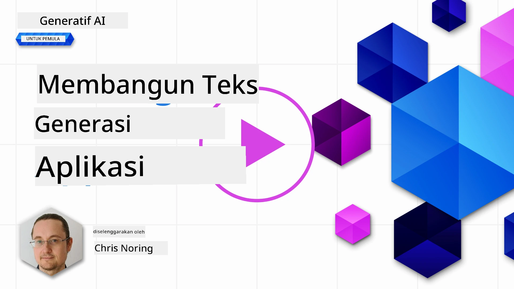

# Membangun Aplikasi Generasi Teks

[](https://youtu.be/0Y5Luf5sRQA?si=t_xVg0clnAI4oUFZ)

> _(Klik gambar di atas untuk menonton video pelajaran ini)_

Sejauh ini kamu sudah melihat dalam kurikulum ini bahwa ada konsep inti seperti prompt dan bahkan suatu disiplin khusus yang disebut "rekayasa prompt". Banyak alat yang bisa kamu gunakan seperti ChatGPT, Office 365, Microsoft Power Platform dan lainnya, mendukung penggunaannya dengan prompt untuk menyelesaikan sesuatu.

Agar kamu bisa menambahkan pengalaman semacam itu ke sebuah aplikasi, kamu perlu memahami konsep-konsep seperti prompt, completions dan memilih pustaka yang akan digunakan. Itulah yang akan kamu pelajari di bab ini.

## Pendahuluan

Dalam bab ini, kamu akan:

- Mempelajari tentang pustaka openai dan konsep utamanya.
- Membangun aplikasi generasi teks menggunakan openai.
- Memahami cara menggunakan konsep seperti prompt, temperature, dan tokens untuk membangun aplikasi generasi teks.

## Tujuan pembelajaran

Pada akhir pelajaran ini, kamu akan bisa:

- Menjelaskan apa itu aplikasi generasi teks.
- Membangun aplikasi generasi teks menggunakan openai.
- Mengonfigurasi aplikasi kamu untuk menggunakan lebih banyak atau lebih sedikit token dan juga mengubah temperatur, untuk menghasilkan output yang bervariasi.

## Apa itu aplikasi generasi teks?

Biasanya ketika kamu membangun aplikasi, aplikasi tersebut memiliki jenis antarmuka seperti berikut:

- Berbasis perintah. Aplikasi konsol adalah aplikasi tipikal di mana kamu mengetikkan perintah dan aplikasi mengeksekusi tugas. Contohnya, `git` adalah aplikasi berbasis perintah.
- Antarmuka pengguna (UI). Beberapa aplikasi memiliki antarmuka pengguna grafis (GUI) di mana kamu mengklik tombol, memasukkan teks, memilih opsi dan lainnya.

### Aplikasi konsol dan UI memiliki keterbatasan

Bandingkan dengan aplikasi berbasis perintah di mana kamu mengetik sebuah perintah:

- **Terbatas**. Kamu tidak bisa mengetik sembarang perintah, hanya perintah yang didukung aplikasi saja.
- **Spesifik bahasa**. Beberapa aplikasi mendukung banyak bahasa, tapi secara default aplikasi dibuat untuk bahasa tertentu, walaupun kamu bisa menambahkan dukungan bahasa lain.

### Manfaat aplikasi generasi teks

Jadi, bagaimana perbedaan aplikasi generasi teks?

Dalam aplikasi generasi teks, kamu memiliki fleksibilitas lebih, kamu tidak terbatas pada sekumpulan perintah atau bahasa input tertentu. Sebaliknya, kamu bisa menggunakan bahasa alami untuk berinteraksi dengan aplikasi. Keuntungan lain adalah kamu sudah berinteraksi dengan sumber data yang telah dilatih pada korpus informasi yang sangat luas, sementara aplikasi tradisional mungkin terbatas pada apa yang ada di database.

### Apa yang bisa saya bangun dengan aplikasi generasi teks?

Ada banyak hal yang bisa kamu buat. Contohnya:

- **Chatbot**. Chatbot yang menjawab pertanyaan tentang topik-topik tertentu, seperti perusahaanmu dan produk-produknya, bisa menjadi pilihan bagus.
- **Asisten**. LLM sangat bagus untuk hal-hal seperti meringkas teks, mendapatkan wawasan dari teks, menghasilkan teks seperti resume dan lainnya.
- **Asisten kode**. Bergantung pada model bahasa yang kamu gunakan, kamu bisa membuat asisten kode yang membantu menulis kode. Misalnya, kamu bisa menggunakan produk seperti GitHub Copilot serta ChatGPT untuk membantu menulis kode.

## Bagaimana saya bisa mulai?

Nah, kamu perlu mencari cara untuk terintegrasi dengan LLM yang biasanya melibatkan dua pendekatan berikut:

- Menggunakan API. Di sini kamu membuat permintaan web dengan prompt dan mendapatkan teks yang dihasilkan kembali.
- Menggunakan pustaka. Pustaka membantu membungkus panggilan API dan membuatnya lebih mudah digunakan.

## Pustaka/SDK

Ada beberapa pustaka terkenal untuk bekerja dengan LLM seperti:

- **openai**, pustaka ini memudahkan menghubungkan dengan modelmu dan mengirim prompt.

Kemudian ada pustaka yang beroperasi di tingkat yang lebih tinggi seperti:

- **Langchain**. Langchain terkenal dan mendukung Python.
- **Semantic Kernel**. Semantic Kernel adalah pustaka dari Microsoft yang mendukung bahasa C#, Python, dan Java.

## Aplikasi pertama menggunakan openai

Mari kita lihat bagaimana kita membangun aplikasi pertama kita, pustaka apa yang dibutuhkan, berapa banyak yang diperlukan dan sebagainya.

### Pasang openai

Ada banyak pustaka yang tersedia untuk berinteraksi dengan OpenAI atau Azure OpenAI. Bisa juga menggunakan banyak bahasa pemrograman seperti C#, Python, JavaScript, Java dan lainnya. Kami memilih menggunakan pustaka Python `openai`, jadi kita akan menggunakan `pip` untuk memasangnya.

```bash
pip install openai
```

### Buat resource

Kamu perlu melakukan langkah-langkah berikut:

- Buat akun di Azure [https://azure.microsoft.com/free/](https://azure.microsoft.com/free/?WT.mc_id=academic-105485-koreyst).
- Dapatkan akses ke Azure OpenAI. Pergi ke [https://learn.microsoft.com/azure/ai-services/openai/overview#how-do-i-get-access-to-azure-openai](https://learn.microsoft.com/azure/ai-services/openai/overview#how-do-i-get-access-to-azure-openai?WT.mc_id=academic-105485-koreyst) dan ajukan permintaan akses.

  > [!NOTE]
  > Pada saat penulisan, kamu perlu mengajukan permohonan untuk mengakses Azure OpenAI.

- Pasang Python <https://www.python.org/>
- Sudah membuat resource Azure OpenAI Service. Lihat panduan ini tentang cara [membuat resource](https://learn.microsoft.com/azure/ai-services/openai/how-to/create-resource?pivots=web-portal?WT.mc_id=academic-105485-koreyst).

### Temukan API key dan endpoint

Saat ini, kamu perlu memberi tahu pustaka `openai` API key mana yang harus dipakai. Untuk menemukan API key, pergi ke bagian "Keys and Endpoint" resource Azure OpenAI-mu dan salin nilai "Key 1".


Sekarang setelah kamu punya informasi ini, mari instruksikan pustaka untuk menggunakannya.

> [!NOTE]
> Ada baiknya memisahkan API key dari kode programmu. Kamu bisa melakukannya dengan menggunakan variabel lingkungan (environment variables).
>
> - Tetapkan variabel lingkungan `OPENAI_API_KEY` ke API key-mu.
>   `export OPENAI_API_KEY='sk-...'`

### Pengaturan konfigurasi Azure

Jika kamu menggunakan Azure OpenAI (sekarang bagian dari Microsoft Foundry), berikut cara kamu mengatur konfigurasinya. Kita menggunakan klien standar `OpenAI` yang diarahkan ke endpoint Azure OpenAI `/openai/v1/`, yang bekerja dengan Responses API dan tidak memerlukan `api_version`:

```python
import os
from openai import OpenAI

client = OpenAI(
    api_key=os.environ["AZURE_OPENAI_API_KEY"],
    base_url=f"{os.environ['AZURE_OPENAI_ENDPOINT'].rstrip('/')}/openai/v1/",
)
```

Di atas kita mengatur hal berikut:

- `api_key`, ini adalah API key yang ditemukan di Portal Azure atau portal Microsoft Foundry.
- `base_url`, ini adalah endpoint resource Foundry-mu dengan `/openai/v1/` ditambahkan. Endpoint stabil v1 ini bekerja di OpenAI dan Azure OpenAI tanpa perlu pengelolaan `api_version`.

> [!NOTE] > `os.environ` membaca variabel lingkungan. Kamu bisa menggunakannya untuk membaca variabel lingkungan seperti `AZURE_OPENAI_API_KEY` dan `AZURE_OPENAI_ENDPOINT`. Tetapkan variabel ini di terminalmu atau menggunakan pustaka seperti `dotenv`.

## Menghasilkan teks

Cara menghasilkan teks adalah dengan menggunakan Responses API melalui metode `responses.create`. Berikut contohnya:

```python
prompt = "Complete the following: Once upon a time there was a"

response = client.responses.create(
    model="gpt-4o-mini",  # ini adalah nama penempatan model Anda
    input=prompt,
    store=False,
)
print(response.output_text)
```

Pada kode di atas, kita membuat sebuah response dan mengirim model yang ingin digunakan beserta promptnya. Kemudian kita cetak teks yang dihasilkan lewat `response.output_text`.

### Percakapan multi-putar (multi-turn)

Responses API cocok untuk generasi teks satu putaran maupun chatbot multi-putar — kamu menyediakan daftar pesan di `input` untuk membangun sebuah percakapan:

```python
from openai import OpenAI

client = OpenAI(api_key="sk-...")

response = client.responses.create(model="gpt-4o-mini", input="Hello world", store=False)
print(response.output_text)
```

Lebih banyak tentang fitur ini akan dibahas di bab berikutnya.

## Latihan - aplikasi generasi teks pertamamu

Sekarang kita sudah belajar cara mengatur dan mengonfigurasi openai, saatnya membangun aplikasi generasi teks pertamamu. Untuk membangun aplikasi, ikuti langkah berikut:

1. Buat lingkungan virtual dan pasang openai:

   ```bash
   python -m venv venv
   source venv/bin/activate
   pip install openai
   ```

   > [!NOTE]
   > Jika kamu menggunakan Windows ketik `venv\Scripts\activate` bukan `source venv/bin/activate`.

   > [!NOTE]
   > Temukan kunci Azure OpenAI kamu dengan pergi ke [https://portal.azure.com/](https://portal.azure.com/?WT.mc_id=academic-105485-koreyst) dan cari `Open AI` lalu pilih `Open AI resource` kemudian pilih `Keys and Endpoint` dan salin nilai `Key 1`.

1. Buat file _app.py_ dan isi dengan kode berikut:

   ```python
   import os
   from openai import OpenAI

   client = OpenAI(
       api_key="<replace this value with your Azure OpenAI key>",
       base_url="<endpoint found in Azure Portal>/openai/v1/",
   )
   deployment_name = "<deployment name>"

   # tambahkan kode penyelesaian Anda
   prompt = "Complete the following: Once upon a time there was a"

   # buat permintaan menggunakan API Respons
   response = client.responses.create(model=deployment_name, input=prompt, store=False)

   # cetak respons
   print(response.output_text)
   ```

   > [!NOTE]
   > Jika kamu menggunakan OpenAI biasa (bukan Azure), gunakan `client = OpenAI(api_key="<ganti dengan kunci OpenAI-mu>")` (tanpa `base_url`) dan berikan nama model seperti `gpt-4o-mini` bukan nama deployment.

   Kamu akan melihat output seperti berikut:

   ```output
    very unhappy _____.

   Once upon a time there was a very unhappy mermaid.
   ```

## Jenis-jenis prompt yang berbeda, untuk hal berbeda

Sekarang kamu sudah tahu cara menghasilkan teks menggunakan prompt. Bahkan kamu sudah memiliki program berjalan yang bisa kamu modifikasi dan ubah untuk menghasilkan jenis teks yang berbeda.

Prompt bisa digunakan untuk berbagai tugas. Misalnya:

- **Menghasilkan jenis teks tertentu**. Misalnya, kamu bisa membuat puisi, pertanyaan untuk kuis dan sebagainya.
- **Mencari informasi**. Kamu bisa menggunakan prompt untuk mencari informasi seperti contoh berikut 'Apa arti CORS dalam pengembangan web?'.
- **Menghasilkan kode**. Kamu bisa menggunakan prompt untuk membuat kode, misalnya membuat regular expression untuk memvalidasi email atau bahkan membuat program utuh seperti aplikasi web?

## Kasus penggunaan yang lebih praktis: pembuat resep

Bayangkan kamu punya bahan masak di rumah dan ingin memasak sesuatu. Untuk itu, kamu butuh resep. Cara menemukan resep bisa dengan menggunakan mesin pencari atau kamu bisa menggunakan LLM untuk melakukannya.

Kamu bisa menulis prompt seperti ini:

> "Tunjukkan saya 5 resep untuk hidangan dengan bahan berikut: ayam, kentang, dan wortel. Untuk setiap resep, cantumkan semua bahan yang digunakan"

Berdasarkan prompt di atas, kamu mungkin mendapatkan respon seperti berikut:

```output
1. Roasted Chicken and Vegetables:
Ingredients:
- 4 chicken thighs
- 2 potatoes, cut into cubes
- 2 carrots, cut into cubes
- 2 tablespoons olive oil
- 2 cloves garlic, minced
- 1 teaspoon dried thyme
- 1 teaspoon dried oregano
- Salt and pepper, to taste

2. Chicken and Potato Stew:
Ingredients:
- 2 tablespoons olive oil
- 1 onion, diced
- 2 cloves garlic, minced
- 2 chicken breasts, cut into cubes
- 2 potatoes, cut into cubes
- 2 carrots, cut into cubes
- 1 teaspoon dried oregano
- 1 teaspoon dried thyme
- 1 cup chicken broth
- Salt and pepper, to taste

3. Chicken and Potato Bake:
Ingredients:
- 2 tablespoons olive oil
- 2 chicken breasts, cut into cubes
- 2 potatoes, cut into cubes
- 2 carrots, cut into cubes
- 1 onion, diced
- 2 cloves garlic, minced
- 1 teaspoon dried oregano
- 1 teaspoon dried thyme
- 1 cup chicken broth
- Salt and pepper, to taste

4. Chicken and Potato Soup:
Ingredients:
- 2 tablespoons olive oil
- 1 onion, diced
- 2 cloves garlic, minced
- 2 chicken breasts, cut into cubes
- 2 potatoes, cut into cubes
- 2 carrots, cut into cubes
- 1 teaspoon dried oregano
- 1 teaspoon dried thyme
- 4 cups chicken broth
- Salt and pepper, to taste

5. Chicken and Potato Hash:
Ingredients:
- 2 tablespoons olive oil
- 2 chicken breasts, cut into cubes
- 2 potatoes, cut into cubes
- 2 carrots, cut into cubes
- 1 onion, diced
- 2 cloves garlic, minced
- 1 teaspoon dried oregano
```

Hasil ini bagus, saya tahu apa yang akan dimasak. Pada titik ini, perbaikan yang berguna bisa berupa:

- Menyaring bahan yang tidak saya suka atau yang saya alergi.
- Membuat daftar belanja, jika saya belum punya semua bahan di rumah.

Untuk kasus di atas, mari tambahkan prompt tambahan:

> "Tolong singkirkan resep dengan bawang putih karena saya alergi dan ganti dengan bahan lain. Juga, tolong buatkan daftar belanja untuk resep tersebut, mengingat saya sudah punya ayam, kentang dan wortel di rumah."

Sekarang kamu mendapatkan hasil baru, yaitu:

```output
1. Roasted Chicken and Vegetables:
Ingredients:
- 4 chicken thighs
- 2 potatoes, cut into cubes
- 2 carrots, cut into cubes
- 2 tablespoons olive oil
- 1 teaspoon dried thyme
- 1 teaspoon dried oregano
- Salt and pepper, to taste

2. Chicken and Potato Stew:
Ingredients:
- 2 tablespoons olive oil
- 1 onion, diced
- 2 chicken breasts, cut into cubes
- 2 potatoes, cut into cubes
- 2 carrots, cut into cubes
- 1 teaspoon dried oregano
- 1 teaspoon dried thyme
- 1 cup chicken broth
- Salt and pepper, to taste

3. Chicken and Potato Bake:
Ingredients:
- 2 tablespoons olive oil
- 2 chicken breasts, cut into cubes
- 2 potatoes, cut into cubes
- 2 carrots, cut into cubes
- 1 onion, diced
- 1 teaspoon dried oregano
- 1 teaspoon dried thyme
- 1 cup chicken broth
- Salt and pepper, to taste

4. Chicken and Potato Soup:
Ingredients:
- 2 tablespoons olive oil
- 1 onion, diced
- 2 chicken breasts, cut into cubes
- 2 potatoes, cut into cubes
- 2 carrots, cut into cubes
- 1 teaspoon dried oregano
- 1 teaspoon dried thyme
- 4 cups chicken broth
- Salt and pepper, to taste

5. Chicken and Potato Hash:
Ingredients:
- 2 tablespoons olive oil
- 2 chicken breasts, cut into cubes
- 2 potatoes, cut into cubes
- 2 carrots, cut into cubes
- 1 onion, diced
- 1 teaspoon dried oregano

Shopping List:
- Olive oil
- Onion
- Thyme
- Oregano
- Salt
- Pepper
```

Itulah lima resepmu, tanpa bawang putih dan juga ada daftar belanja sesuai bahan yang sudah kamu punya di rumah.

## Latihan - buat pembuat resep

Setelah kita memainkan skenario ini, mari kita tulis kode yang sesuai dengan skenario yang ditunjukkan. Untuk melakukannya, ikuti langkah berikut:

1. Gunakan file _app.py_ yang sudah ada sebagai titik awal
1. Temukan variabel `prompt` dan ubah kodenya menjadi berikut:

   ```python
   prompt = "Show me 5 recipes for a dish with the following ingredients: chicken, potatoes, and carrots. Per recipe, list all the ingredients used"
   ```

   Jika kamu menjalankan kode sekarang, kamu harus melihat output yang mirip dengan:

   ```output
   -Chicken Stew with Potatoes and Carrots: 3 tablespoons oil, 1 onion, chopped, 2 cloves garlic, minced, 1 carrot, peeled and chopped, 1 potato, peeled and chopped, 1 bay leaf, 1 thyme sprig, 1/2 teaspoon salt, 1/4 teaspoon black pepper, 1 1/2 cups chicken broth, 1/2 cup dry white wine, 2 tablespoons chopped fresh parsley, 2 tablespoons unsalted butter, 1 1/2 pounds boneless, skinless chicken thighs, cut into 1-inch pieces
   -Oven-Roasted Chicken with Potatoes and Carrots: 3 tablespoons extra-virgin olive oil, 1 tablespoon Dijon mustard, 1 tablespoon chopped fresh rosemary, 1 tablespoon chopped fresh thyme, 4 cloves garlic, minced, 1 1/2 pounds small red potatoes, quartered, 1 1/2 pounds carrots, quartered lengthwise, 1/2 teaspoon salt, 1/4 teaspoon black pepper, 1 (4-pound) whole chicken
   -Chicken, Potato, and Carrot Casserole: cooking spray, 1 large onion, chopped, 2 cloves garlic, minced, 1 carrot, peeled and shredded, 1 potato, peeled and shredded, 1/2 teaspoon dried thyme leaves, 1/4 teaspoon salt, 1/4 teaspoon black pepper, 2 cups fat-free, low-sodium chicken broth, 1 cup frozen peas, 1/4 cup all-purpose flour, 1 cup 2% reduced-fat milk, 1/4 cup grated Parmesan cheese

   -One Pot Chicken and Potato Dinner: 2 tablespoons olive oil, 1 pound boneless, skinless chicken thighs, cut into 1-inch pieces, 1 large onion, chopped, 3 cloves garlic, minced, 1 carrot, peeled and chopped, 1 potato, peeled and chopped, 1 bay leaf, 1 thyme sprig, 1/2 teaspoon salt, 1/4 teaspoon black pepper, 2 cups chicken broth, 1/2 cup dry white wine

   -Chicken, Potato, and Carrot Curry: 1 tablespoon vegetable oil, 1 large onion, chopped, 2 cloves garlic, minced, 1 carrot, peeled and chopped, 1 potato, peeled and chopped, 1 teaspoon ground coriander, 1 teaspoon ground cumin, 1/2 teaspoon ground turmeric, 1/2 teaspoon ground ginger, 1/4 teaspoon cayenne pepper, 2 cups chicken broth, 1/2 cup dry white wine, 1 (15-ounce) can chickpeas, drained and rinsed, 1/2 cup raisins, 1/2 cup chopped fresh cilantro
   ```

   > CATATAN, LLM-mu nondeterministik, jadi kamu mungkin mendapatkan hasil yang berbeda setiap kali menjalankan program.

   Bagus, mari kita lihat bagaimana cara memperbaiki. Untuk memperbaikinya, kita ingin membuat kode lebih fleksibel, sehingga bahan dan jumlah resep bisa diubah dan disesuaikan.

1. Mari ubah kode seperti ini:

   ```python
   no_recipes = input("No of recipes (for example, 5): ")

   ingredients = input("List of ingredients (for example, chicken, potatoes, and carrots): ")

   # menyisipkan jumlah resep ke dalam prompt dan bahan-bahan
   prompt = f"Show me {no_recipes} recipes for a dish with the following ingredients: {ingredients}. Per recipe, list all the ingredients used"
   ```

   Mengambil kode untuk uji coba, bisa terlihat seperti ini:

   ```output
   No of recipes (for example, 5): 3
   List of ingredients (for example, chicken, potatoes, and carrots): milk,strawberries

   -Strawberry milk shake: milk, strawberries, sugar, vanilla extract, ice cubes
   -Strawberry shortcake: milk, flour, baking powder, sugar, salt, unsalted butter, strawberries, whipped cream
   -Strawberry milk: milk, strawberries, sugar, vanilla extract
   ```

### Perbaiki dengan menambahkan filter dan daftar belanja

Sekarang kita sudah punya aplikasi yang berfungsi untuk menghasilkan resep dan aplikasinya fleksibel karena bergantung pada input pengguna, baik pada jumlah resep maupun bahan yang digunakan.

Untuk meningkatkannya lebih lanjut, kita ingin menambahkan hal berikut:

- **Menyaring bahan**. Kita ingin bisa menyaring bahan yang tidak kita suka atau yang kita alergi. Untuk perubahan ini, kita bisa mengedit prompt yang ada dan menambahkan kondisi filter di akhir seperti ini:

  ```python
  filter = input("Filter (for example, vegetarian, vegan, or gluten-free): ")

  prompt = f"Show me {no_recipes} recipes for a dish with the following ingredients: {ingredients}. Per recipe, list all the ingredients used, no {filter}"
  ```

  Di atas, kita menambahkan `{filter}` di akhir prompt dan juga menangkap nilai filter dari pengguna.

  Contoh input menjalankan program sekarang bisa seperti ini:

  ```output
  No of recipes (for example, 5): 3
  List of ingredients (for example, chicken, potatoes, and carrots): onion,milk
  Filter (for example, vegetarian, vegan, or gluten-free): no milk

  1. French Onion Soup

  Ingredients:

  -1 large onion, sliced
  -3 cups beef broth
  -1 cup milk
  -6 slices french bread
  -1/4 cup shredded Parmesan cheese
  -1 tablespoon butter
  -1 teaspoon dried thyme
  -1/4 teaspoon salt
  -1/4 teaspoon black pepper

  Instructions:

  1. In a large pot, sauté onions in butter until golden brown.
  2. Add beef broth, milk, thyme, salt, and pepper. Bring to a boil.
  3. Reduce heat and simmer for 10 minutes.
  4. Place french bread slices on soup bowls.
  5. Ladle soup over bread.
  6. Sprinkle with Parmesan cheese.

  2. Onion and Potato Soup

  Ingredients:

  -1 large onion, chopped
  -2 cups potatoes, diced
  -3 cups vegetable broth
  -1 cup milk
  -1/4 teaspoon black pepper

  Instructions:

  1. In a large pot, sauté onions in butter until golden brown.
  2. Add potatoes, vegetable broth, milk, and pepper. Bring to a boil.
  3. Reduce heat and simmer for 10 minutes.
  4. Serve hot.

  3. Creamy Onion Soup

  Ingredients:

  -1 large onion, chopped
  -3 cups vegetable broth
  -1 cup milk
  -1/4 teaspoon black pepper
  -1/4 cup all-purpose flour
  -1/2 cup shredded Parmesan cheese

  Instructions:

  1. In a large pot, sauté onions in butter until golden brown.
  2. Add vegetable broth, milk, and pepper. Bring to a boil.
  3. Reduce heat and simmer for 10 minutes.
  4. In a small bowl, whisk together flour and Parmesan cheese until smooth.
  5. Add to soup and simmer for an additional 5 minutes, or until soup has thickened.
  ```

  Seperti yang kamu lihat, resep yang mengandung susu sudah disaring. Tapi, jika kamu intoleran laktosa, kamu mungkin ingin menyaring resep yang mengandung keju juga, jadi perlu penjelasan yang jelas.


- **Buat daftar belanja**. Kita ingin membuat daftar belanja, dengan mempertimbangkan apa yang sudah kita miliki di rumah.

  Untuk fungsionalitas ini, kita bisa mencoba menyelesaikan semuanya dalam satu prompt atau membaginya menjadi dua prompt. Mari kita coba pendekatan yang kedua. Di sini kami menyarankan menambahkan prompt tambahan, tetapi agar itu berhasil, kita perlu menambahkan hasil dari prompt pertama sebagai konteks ke prompt kedua.

  Temukan bagian dalam kode yang mencetak hasil dari prompt pertama dan tambahkan kode berikut di bawahnya:

  ```python
  old_prompt_result = response.output_text
  prompt = "Produce a shopping list for the generated recipes and please don't include ingredients that I already have."

  new_prompt = f"{old_prompt_result} {prompt}"
  response = client.responses.create(model=deployment_name, input=new_prompt, max_output_tokens=1200, store=False)

  # cetak tanggapan
  print("Shopping list:")
  print(response.output_text)
  ```

  Perhatikan hal berikut:

  1. Kita membangun prompt baru dengan menambahkan hasil dari prompt pertama ke prompt baru:

     ```python
     new_prompt = f"{old_prompt_result} {prompt}"
     ```

  1. Kita membuat permintaan baru, tetapi juga mempertimbangkan jumlah token yang diminta pada prompt pertama, jadi kali ini kita mengatakan `max_output_tokens` adalah 1200.

     ```python
     response = client.responses.create(model=deployment_name, input=new_prompt, max_output_tokens=1200, store=False)
     ```

     Dengan mencoba kode ini, kita sekarang mendapatkan output berikut:

     ```output
     No of recipes (for example, 5): 2
     List of ingredients (for example, chicken, potatoes, and carrots): apple,flour
     Filter (for example, vegetarian, vegan, or gluten-free): sugar


     -Apple and flour pancakes: 1 cup flour, 1/2 tsp baking powder, 1/2 tsp baking soda, 1/4 tsp salt, 1 tbsp sugar, 1 egg, 1 cup buttermilk or sour milk, 1/4 cup melted butter, 1 Granny Smith apple, peeled and grated
     -Apple fritters: 1-1/2 cups flour, 1 tsp baking powder, 1/4 tsp salt, 1/4 tsp baking soda, 1/4 tsp nutmeg, 1/4 tsp cinnamon, 1/4 tsp allspice, 1/4 cup sugar, 1/4 cup vegetable shortening, 1/4 cup milk, 1 egg, 2 cups shredded, peeled apples
     Shopping list:
     -Flour, baking powder, baking soda, salt, sugar, egg, buttermilk, butter, apple, nutmeg, cinnamon, allspice
     ```

## Tingkatkan pengaturan Anda

Apa yang kita miliki sejauh ini adalah kode yang berfungsi, tapi ada beberapa penyesuaian yang harus kita lakukan untuk memperbaikinya lebih jauh. Beberapa hal yang harus kita lakukan adalah:

- **Pisahkan rahasia dari kode**, seperti kunci API. Rahasia tidak boleh ada di kode dan harus disimpan di lokasi yang aman. Untuk memisahkan rahasia dari kode, kita bisa menggunakan variabel lingkungan dan pustaka seperti `python-dotenv` untuk memuatnya dari sebuah file. Berikut ini contohnya dalam kode:

  1. Buat file `.env` dengan isi sebagai berikut:

     ```bash
     OPENAI_API_KEY=sk-...
     ```

     > Catatan, untuk Azure OpenAI di Microsoft Foundry, Anda perlu mengatur variabel lingkungan berikut sebagai gantinya:

     ```bash
     AZURE_OPENAI_API_KEY=<replace>
     AZURE_OPENAI_ENDPOINT=<replace>
     AZURE_OPENAI_API_VERSION=2024-10-21
     ```

     Dalam kode, Anda akan memuat variabel lingkungan seperti ini:

     ```python
     import os
     from dotenv import load_dotenv
     from openai import OpenAI

     load_dotenv()

     client = OpenAI(api_key=os.environ["OPENAI_API_KEY"])
     ```

- **Penjelasan tentang panjang token**. Kita harus mempertimbangkan berapa banyak token yang diperlukan untuk menghasilkan teks yang kita inginkan. Token berbiaya uang, jadi bila memungkinkan, kita harus berhemat dalam penggunaan token. Misalnya, bisakah kita merumuskan prompt sehingga bisa menggunakan token yang lebih sedikit?

  Untuk mengubah jumlah token yang digunakan, Anda dapat menggunakan parameter `max_output_tokens`. Misalnya, jika Anda ingin menggunakan 100 token, Anda bisa melakukan:

  ```python
  response = client.responses.create(model=deployment, input=prompt, max_output_tokens=100, store=False)
  ```

- **Menguji temperature**. Temperature adalah sesuatu yang belum kita sebutkan sejauh ini tapi merupakan konteks penting untuk performa program kita. Semakin tinggi nilai temperature, output akan semakin acak. Sebaliknya, semakin rendah nilai temperature, output akan semakin terduga. Pertimbangkan apakah Anda ingin variasi dalam output atau tidak.

  Untuk mengubah temperature, Anda dapat menggunakan parameter `temperature`. Misalnya, jika Anda ingin menggunakan temperature 0.5, Anda bisa melakukan:

  ```python
  response = client.responses.create(model=deployment, input=prompt, temperature=0.5, store=False)
  ```

  > Catatan, semakin dekat ke 1.0, output akan semakin bervariasi.

## Tugas

Untuk tugas ini, Anda dapat memilih apa yang ingin dibuat.

Berikut beberapa saran:

- Ubah aplikasi pembuat resep untuk memperbaikinya lebih jauh. Coba-coba dengan nilai temperature, dan prompt untuk melihat apa yang bisa Anda hasilkan.
- Buat "teman belajar". Aplikasi ini harus bisa menjawab pertanyaan tentang suatu topik misalnya Python, Anda bisa membuat prompt seperti "Apa itu topik tertentu dalam Python?", atau Anda bisa membuat prompt yang mengatakan, tunjukkan saya kode untuk topik tertentu dan sebagainya.
- Bot sejarah, hidupkan sejarah, instruksikan bot untuk memainkan karakter sejarah tertentu dan tanyakan tentang kehidupan dan jaman yang dijalaninya.

## Solusi

### Teman belajar

Di bawah ini adalah prompt awal, lihat bagaimana Anda dapat menggunakannya dan mengubahnya sesuai selera Anda.

```text
- "You're an expert on the Python language

    Suggest a beginner lesson for Python in the following format:

    Format:
    - concepts:
    - brief explanation of the lesson:
    - exercise in code with solutions"
```

### Bot sejarah

Berikut beberapa prompt yang bisa Anda gunakan:

```text
- "You are Abe Lincoln, tell me about yourself in 3 sentences, and respond using grammar and words like Abe would have used"
- "You are Abe Lincoln, respond using grammar and words like Abe would have used:

   Tell me about your greatest accomplishments, in 300 words"
```

## Pemeriksaan pengetahuan

Apa fungsi dari konsep temperature?

1. Itu mengontrol seberapa acak outputnya.
1. Itu mengontrol seberapa besar responsnya.
1. Itu mengontrol berapa banyak token yang digunakan.

## 🚀 Tantangan

Saat mengerjakan tugas, coba variasikan temperature, coba atur ke 0, 0.5, dan 1. Ingat bahwa 0 adalah yang paling tidak bervariasi dan 1 adalah yang paling bervariasi. Nilai mana yang paling cocok untuk aplikasi Anda?

## Kerja Bagus! Lanjutkan Pembelajaran Anda

Setelah menyelesaikan pelajaran ini, lihat koleksi [Generative AI Learning collection](https://aka.ms/genai-collection?WT.mc_id=academic-105485-koreyst) untuk terus meningkatkan pengetahuan Generative AI Anda!

Lanjut ke Pelajaran 7 di mana kita akan melihat cara [membangun aplikasi chat](../07-building-chat-applications/README.md?WT.mc_id=academic-105485-koreyst)!

---

<!-- CO-OP TRANSLATOR DISCLAIMER START -->
**Penafian**:
Dokumen ini telah diterjemahkan menggunakan layanan terjemahan AI [Co-op Translator](https://github.com/Azure/co-op-translator). Meskipun kami berupaya untuk mencapai akurasi, harap diketahui bahwa terjemahan otomatis mungkin mengandung kesalahan atau ketidakakuratan. Dokumen asli dalam bahasa aslinya harus dianggap sebagai sumber yang sah. Untuk informasi penting, disarankan menggunakan terjemahan profesional oleh manusia. Kami tidak bertanggung jawab atas kesalahpahaman atau penafsiran yang keliru yang timbul dari penggunaan terjemahan ini.
<!-- CO-OP TRANSLATOR DISCLAIMER END -->