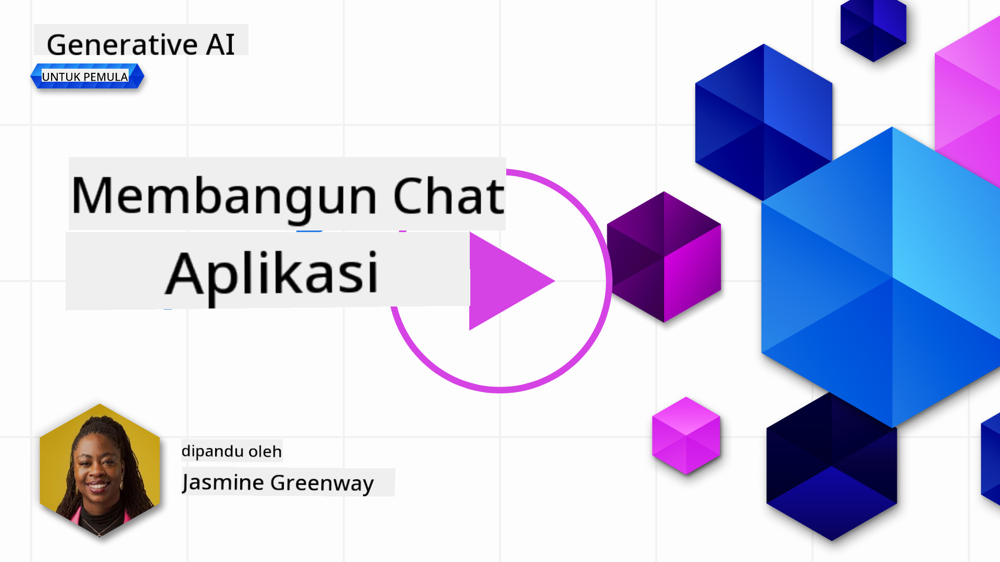
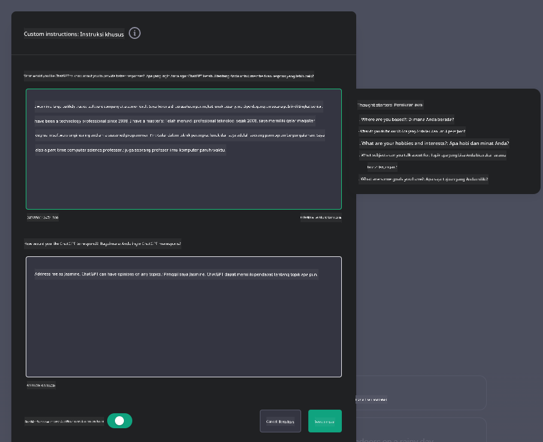
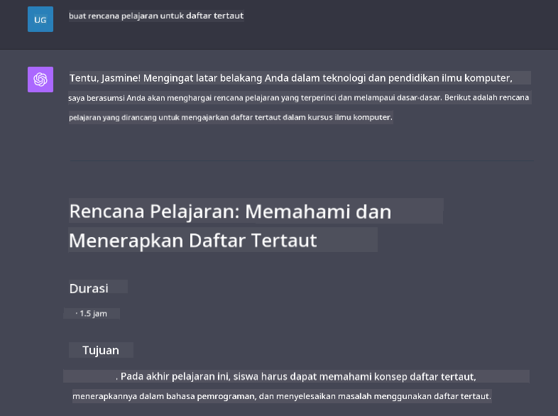

<!--
CO_OP_TRANSLATOR_METADATA:
{
  "original_hash": "ea4bbe640847aafbbba14dae4625e9af",
  "translation_date": "2025-07-09T12:35:08+00:00",
  "source_file": "07-building-chat-applications/README.md",
  "language_code": "id"
}
-->
# Membangun Aplikasi Chat Berbasis Generative AI

[](https://aka.ms/gen-ai-lessons7-gh?WT.mc_id=academic-105485-koreyst)

> _(Klik gambar di atas untuk menonton video pelajaran ini)_

Setelah kita melihat bagaimana membangun aplikasi generasi teks, sekarang mari kita pelajari aplikasi chat.

Aplikasi chat telah menjadi bagian dari kehidupan sehari-hari kita, menawarkan lebih dari sekadar sarana percakapan santai. Mereka menjadi bagian penting dari layanan pelanggan, dukungan teknis, dan bahkan sistem penasihat yang canggih. Kemungkinan besar Anda baru saja mendapatkan bantuan dari aplikasi chat. Saat kita mengintegrasikan teknologi canggih seperti generative AI ke dalam platform ini, kompleksitas dan tantangannya pun meningkat.

Beberapa pertanyaan yang perlu kita jawab adalah:

- **Membangun aplikasi**. Bagaimana kita membangun dan mengintegrasikan aplikasi bertenaga AI ini secara efisien untuk kasus penggunaan tertentu?
- **Pemantauan**. Setelah diterapkan, bagaimana kita memantau dan memastikan aplikasi berjalan dengan kualitas terbaik, baik dari segi fungsi maupun kepatuhan terhadap [enam prinsip AI yang bertanggung jawab](https://www.microsoft.com/ai/responsible-ai?WT.mc_id=academic-105485-koreyst)?

Seiring kita memasuki era yang ditandai dengan otomatisasi dan interaksi manusia-mesin yang mulus, memahami bagaimana generative AI mengubah cakupan, kedalaman, dan kemampuan adaptasi aplikasi chat menjadi sangat penting. Pelajaran ini akan membahas aspek arsitektur yang mendukung sistem rumit ini, metode untuk menyempurnakannya agar sesuai dengan tugas domain tertentu, serta mengevaluasi metrik dan pertimbangan yang relevan untuk memastikan penerapan AI yang bertanggung jawab.

## Pendahuluan

Pelajaran ini mencakup:

- Teknik membangun dan mengintegrasikan aplikasi chat secara efisien.
- Cara menerapkan kustomisasi dan penyempurnaan aplikasi.
- Strategi dan pertimbangan untuk memantau aplikasi chat secara efektif.

## Tujuan Pembelajaran

Di akhir pelajaran ini, Anda akan mampu:

- Menjelaskan pertimbangan dalam membangun dan mengintegrasikan aplikasi chat ke dalam sistem yang sudah ada.
- Menyesuaikan aplikasi chat untuk kasus penggunaan tertentu.
- Mengidentifikasi metrik utama dan pertimbangan untuk memantau dan menjaga kualitas aplikasi chat bertenaga AI secara efektif.
- Memastikan aplikasi chat menggunakan AI secara bertanggung jawab.

## Mengintegrasikan Generative AI ke dalam Aplikasi Chat

Meningkatkan aplikasi chat dengan generative AI bukan hanya soal membuatnya lebih pintar; ini tentang mengoptimalkan arsitektur, performa, dan antarmuka pengguna untuk memberikan pengalaman pengguna yang berkualitas. Ini melibatkan penelaahan fondasi arsitektur, integrasi API, dan pertimbangan antarmuka pengguna. Bagian ini bertujuan memberikan peta jalan komprehensif untuk menavigasi lanskap kompleks ini, baik saat menghubungkannya ke sistem yang sudah ada maupun membangunnya sebagai platform mandiri.

Di akhir bagian ini, Anda akan memiliki keahlian yang dibutuhkan untuk membangun dan mengintegrasikan aplikasi chat secara efisien.

### Chatbot atau Aplikasi Chat?

Sebelum kita membahas pembangunan aplikasi chat, mari bandingkan 'chatbot' dengan 'aplikasi chat bertenaga AI,' yang memiliki peran dan fungsi berbeda. Chatbot bertujuan mengotomatisasi tugas percakapan tertentu, seperti menjawab pertanyaan yang sering diajukan atau melacak paket. Biasanya diatur oleh logika berbasis aturan atau algoritma AI yang kompleks. Sebaliknya, aplikasi chat bertenaga AI adalah lingkungan yang jauh lebih luas yang dirancang untuk memfasilitasi berbagai bentuk komunikasi digital, seperti chat teks, suara, dan video antar pengguna manusia. Fitur utamanya adalah integrasi model generative AI yang mensimulasikan percakapan yang bernuansa dan mirip manusia, menghasilkan respons berdasarkan berbagai input dan konteks. Aplikasi chat bertenaga generative AI dapat melakukan diskusi domain terbuka, beradaptasi dengan konteks percakapan yang berkembang, dan bahkan menghasilkan dialog kreatif atau kompleks.

Tabel berikut menguraikan perbedaan dan kesamaan utama untuk membantu kita memahami peran unik mereka dalam komunikasi digital.

| Chatbot                               | Aplikasi Chat Berbasis Generative AI  |
| ------------------------------------- | ------------------------------------ |
| Fokus pada tugas dan berbasis aturan  | Sadar konteks                        |
| Sering terintegrasi dalam sistem besar | Dapat menampung satu atau beberapa chatbot |
| Terbatas pada fungsi yang diprogram   | Menggunakan model generative AI      |
| Interaksi khusus dan terstruktur       | Mampu diskusi domain terbuka         |

### Memanfaatkan Fungsi Bawaan dengan SDK dan API

Saat membangun aplikasi chat, langkah awal yang baik adalah menilai apa yang sudah tersedia. Menggunakan SDK dan API untuk membangun aplikasi chat adalah strategi yang menguntungkan karena berbagai alasan. Dengan mengintegrasikan SDK dan API yang terdokumentasi dengan baik, Anda menempatkan aplikasi Anda pada posisi strategis untuk kesuksesan jangka panjang, mengatasi masalah skalabilitas dan pemeliharaan.

- **Mempercepat proses pengembangan dan mengurangi beban**: Mengandalkan fungsi bawaan daripada membangunnya sendiri yang mahal memungkinkan Anda fokus pada aspek lain dari aplikasi yang mungkin lebih penting, seperti logika bisnis.
- **Performa lebih baik**: Saat membangun fungsi dari nol, Anda akan bertanya "Bagaimana skalanya? Apakah aplikasi ini mampu menangani lonjakan pengguna secara tiba-tiba?" SDK dan API yang terawat dengan baik biasanya sudah memiliki solusi untuk masalah ini.
- **Pemeliharaan lebih mudah**: Pembaruan dan perbaikan lebih mudah dikelola karena sebagian besar API dan SDK hanya memerlukan pembaruan pustaka saat versi baru dirilis.
- **Akses ke teknologi terkini**: Memanfaatkan model yang telah disempurnakan dan dilatih dengan dataset besar memberikan kemampuan bahasa alami pada aplikasi Anda.

Mengakses fungsi SDK atau API biasanya melibatkan izin untuk menggunakan layanan yang disediakan, sering melalui penggunaan kunci unik atau token otentikasi. Kita akan menggunakan OpenAI Python Library untuk melihat contohnya. Anda juga bisa mencobanya sendiri di [notebook OpenAI](../../../07-building-chat-applications/python/oai-assignment.ipynb) atau [notebook Azure OpenAI Services](../../../07-building-chat-applications/python/aoai-assignment.ipynb) untuk pelajaran ini.

```python
import os
from openai import OpenAI

API_KEY = os.getenv("OPENAI_API_KEY","")

client = OpenAI(
    api_key=API_KEY
    )

chat_completion = client.chat.completions.create(model="gpt-3.5-turbo", messages=[{"role": "user", "content": "Suggest two titles for an instructional lesson on chat applications for generative AI."}])
```

Contoh di atas menggunakan model GPT-3.5 Turbo untuk menyelesaikan prompt, tapi perhatikan bahwa API key sudah disetel sebelumnya. Anda akan mendapat error jika tidak menyetel kunci tersebut.

## Pengalaman Pengguna (UX)

Prinsip UX umum berlaku untuk aplikasi chat, tapi berikut beberapa pertimbangan tambahan yang menjadi sangat penting karena komponen machine learning yang terlibat.

- **Mekanisme untuk mengatasi ambiguitas**: Model generative AI kadang menghasilkan jawaban yang ambigu. Fitur yang memungkinkan pengguna meminta klarifikasi bisa sangat membantu jika mereka menemui masalah ini.
- **Retensi konteks**: Model generative AI canggih mampu mengingat konteks dalam percakapan, yang bisa menjadi aset penting untuk pengalaman pengguna. Memberi pengguna kemampuan mengontrol dan mengelola konteks meningkatkan pengalaman, tapi juga menimbulkan risiko menyimpan informasi sensitif. Pertimbangan tentang berapa lama informasi ini disimpan, seperti kebijakan retensi, dapat menyeimbangkan kebutuhan konteks dengan privasi.
- **Personalisasi**: Dengan kemampuan belajar dan beradaptasi, model AI menawarkan pengalaman yang dipersonalisasi untuk pengguna. Menyesuaikan pengalaman pengguna melalui fitur seperti profil pengguna tidak hanya membuat pengguna merasa dipahami, tapi juga membantu mereka menemukan jawaban spesifik dengan lebih efisien dan memuaskan.

Salah satu contoh personalisasi adalah pengaturan "Custom instructions" di ChatGPT OpenAI. Fitur ini memungkinkan Anda memberikan informasi tentang diri Anda yang mungkin menjadi konteks penting untuk prompt Anda. Berikut contoh custom instruction.



"Profil" ini mendorong ChatGPT untuk membuat rencana pelajaran tentang linked lists. Perhatikan bahwa ChatGPT mempertimbangkan bahwa pengguna mungkin menginginkan rencana pelajaran yang lebih mendalam berdasarkan pengalamannya.



### Microsoft System Message Framework untuk Large Language Models

[Microsoft memberikan panduan](https://learn.microsoft.com/azure/ai-services/openai/concepts/system-message#define-the-models-output-format?WT.mc_id=academic-105485-koreyst) untuk menulis pesan sistem yang efektif saat menghasilkan respons dari LLM yang dibagi menjadi 4 area:

1. Mendefinisikan siapa model ini untuk siapa, serta kemampuan dan keterbatasannya.
2. Mendefinisikan format output model.
3. Memberikan contoh spesifik yang menunjukkan perilaku yang diinginkan dari model.
4. Memberikan batasan perilaku tambahan.

### Aksesibilitas

Apakah pengguna memiliki gangguan penglihatan, pendengaran, motorik, atau kognitif, aplikasi chat yang dirancang dengan baik harus dapat digunakan oleh semua orang. Daftar berikut menguraikan fitur spesifik yang ditujukan untuk meningkatkan aksesibilitas bagi berbagai gangguan pengguna.

- **Fitur untuk Gangguan Penglihatan**: Tema kontras tinggi dan teks yang dapat diubah ukurannya, kompatibilitas pembaca layar.
- **Fitur untuk Gangguan Pendengaran**: Fungsi teks ke suara dan suara ke teks, isyarat visual untuk notifikasi audio.
- **Fitur untuk Gangguan Motorik**: Dukungan navigasi keyboard, perintah suara.
- **Fitur untuk Gangguan Kognitif**: Opsi bahasa yang disederhanakan.

## Kustomisasi dan Penyempurnaan untuk Model Bahasa Domain-Spesifik

Bayangkan aplikasi chat yang memahami jargon perusahaan Anda dan mengantisipasi pertanyaan spesifik yang sering diajukan oleh basis penggunanya. Ada beberapa pendekatan yang patut disebutkan:

- **Memanfaatkan model DSL**. DSL adalah singkatan dari domain specific language. Anda dapat memanfaatkan model DSL yang dilatih pada domain tertentu untuk memahami konsep dan skenarionya.
- **Menerapkan fine-tuning**. Fine-tuning adalah proses melatih model Anda lebih lanjut dengan data spesifik.

## Kustomisasi: Menggunakan DSL

Memanfaatkan model bahasa domain-spesifik (DSL Models) dapat meningkatkan keterlibatan pengguna dengan menyediakan interaksi yang khusus dan relevan secara kontekstual. Ini adalah model yang dilatih atau disempurnakan untuk memahami dan menghasilkan teks terkait bidang, industri, atau subjek tertentu. Pilihan menggunakan model DSL bisa bervariasi dari melatih model dari awal, hingga menggunakan yang sudah ada melalui SDK dan API. Pilihan lain adalah fine-tuning, yaitu mengambil model yang sudah dilatih sebelumnya dan menyesuaikannya untuk domain tertentu.

## Kustomisasi: Menerapkan Fine-tuning

Fine-tuning sering dipertimbangkan ketika model pra-latih tidak memadai untuk domain khusus atau tugas tertentu.

Misalnya, pertanyaan medis itu kompleks dan memerlukan banyak konteks. Saat seorang profesional medis mendiagnosis pasien, itu didasarkan pada berbagai faktor seperti gaya hidup atau kondisi yang sudah ada, dan mungkin juga mengacu pada jurnal medis terbaru untuk memvalidasi diagnosisnya. Dalam skenario yang rumit seperti ini, aplikasi chat AI umum tidak bisa menjadi sumber yang dapat diandalkan.

### Skenario: aplikasi medis

Pertimbangkan aplikasi chat yang dirancang untuk membantu praktisi medis dengan memberikan referensi cepat tentang pedoman pengobatan, interaksi obat, atau temuan riset terbaru.

Model umum mungkin cukup untuk menjawab pertanyaan medis dasar atau memberikan saran umum, tapi mungkin kesulitan dengan hal berikut:

- **Kasus yang sangat spesifik atau kompleks**. Misalnya, seorang ahli saraf mungkin bertanya, "Apa praktik terbaik saat ini untuk mengelola epilepsi yang resisten obat pada pasien anak-anak?"
- **Kurangnya kemajuan terbaru**. Model umum mungkin kesulitan memberikan jawaban terkini yang menggabungkan kemajuan terbaru dalam neurologi dan farmakologi.

Dalam kasus seperti ini, fine-tuning model dengan dataset medis khusus dapat secara signifikan meningkatkan kemampuannya untuk menangani pertanyaan medis rumit dengan lebih akurat dan andal. Ini memerlukan akses ke dataset besar dan relevan yang mewakili tantangan dan pertanyaan domain-spesifik yang perlu dijawab.

## Pertimbangan untuk Pengalaman Chat AI Berkualitas Tinggi

Bagian ini menguraikan kriteria untuk aplikasi chat "berkualitas tinggi," yang mencakup pengumpulan metrik yang dapat ditindaklanjuti dan kepatuhan pada kerangka kerja yang menggunakan teknologi AI secara bertanggung jawab.

### Metrik Utama

Untuk menjaga performa aplikasi yang berkualitas tinggi, penting untuk memantau metrik dan pertimbangan utama. Pengukuran ini tidak hanya memastikan fungsi aplikasi, tapi juga menilai kualitas model AI dan pengalaman pengguna. Berikut daftar yang mencakup metrik dasar, AI, dan pengalaman pengguna yang perlu dipertimbangkan.

| Metrik                        | Definisi                                                                                                             | Pertimbangan untuk Pengembang Chat                                      |
| ----------------------------- | ---------------------------------------------------------------------------------------------------------------------- | ----------------------------------------------------------------------- |
| **Uptime**                    | Mengukur waktu aplikasi beroperasi dan dapat diakses pengguna.                                                        | Bagaimana Anda meminimalkan waktu tidak aktif?                          |
| **Response Time**             | Waktu yang dibutuhkan aplikasi untuk merespons pertanyaan pengguna.                                                   | Bagaimana Anda mengoptimalkan pemrosesan query untuk mempercepat respons? |
| **Precision**                 | Rasio prediksi positif benar terhadap total prediksi positif.                                                        | Bagaimana Anda memvalidasi presisi model Anda?                          |
| **Recall (Sensitivity)**      | Rasio prediksi positif benar terhadap jumlah positif sebenarnya.                                                     | Bagaimana Anda mengukur dan meningkatkan recall?                        |
| **F1 Score**                  | Rata-rata harmonis dari precision dan recall, menyeimbangkan keduanya.                                               | Berapa target F1 Score Anda? Bagaimana Anda menyeimbangkan precision dan recall? |
| **Perplexity**                | Mengukur seberapa baik distribusi probabilitas yang diprediksi model sesuai dengan distribusi data sebenarnya.       | Bagaimana Anda meminimalkan perplexity?                                |
| **User Satisfaction Metrics** | Mengukur persepsi pengguna terhadap aplikasi. Biasanya dikumpulkan melalui survei.                                   | Seberapa sering Anda mengumpulkan umpan balik pengguna? Bagaimana Anda menyesuaikan berdasarkan itu? |
| **Error Rate**                | Tingkat kesalahan model dalam memahami atau menghasilkan output.                                                     | Strategi apa yang Anda miliki untuk mengurangi tingkat kesalahan?      |
| **Retraining Cycles**         | Frekuensi model diperbarui untuk memasukkan data dan wawasan baru.                                                  | Seberapa sering Anda melatih ulang model? Apa yang memicu siklus pelatihan ulang? |
| **Deteksi Anomali**         | Alat dan teknik untuk mengidentifikasi pola tidak biasa yang tidak sesuai dengan perilaku yang diharapkan.                        | Bagaimana Anda akan merespons anomali?                                        |

### Menerapkan Praktik AI yang Bertanggung Jawab dalam Aplikasi Chat

Pendekatan Microsoft terhadap AI yang Bertanggung Jawab telah mengidentifikasi enam prinsip yang harus menjadi panduan dalam pengembangan dan penggunaan AI. Berikut adalah prinsip-prinsip tersebut, definisinya, serta hal-hal yang perlu dipertimbangkan oleh pengembang chat dan mengapa hal tersebut penting untuk diperhatikan.

| Prinsip                | Definisi Microsoft                                    | Pertimbangan untuk Pengembang Chat                                      | Mengapa Ini Penting                                                                    |
| ---------------------- | ----------------------------------------------------- | ---------------------------------------------------------------------- | -------------------------------------------------------------------------------------- |
| Keadilan               | Sistem AI harus memperlakukan semua orang secara adil. | Pastikan aplikasi chat tidak mendiskriminasi berdasarkan data pengguna. | Untuk membangun kepercayaan dan inklusivitas di antara pengguna; menghindari masalah hukum. |
| Keandalan dan Keamanan | Sistem AI harus berfungsi dengan andal dan aman.      | Terapkan pengujian dan mekanisme pengaman untuk meminimalkan kesalahan dan risiko. | Menjamin kepuasan pengguna dan mencegah potensi bahaya.                                |
| Privasi dan Keamanan   | Sistem AI harus aman dan menghormati privasi.          | Terapkan enkripsi kuat dan langkah perlindungan data.                   | Melindungi data sensitif pengguna dan mematuhi undang-undang privasi.                  |
| Inklusivitas           | Sistem AI harus memberdayakan semua orang dan melibatkan mereka. | Rancang UI/UX yang dapat diakses dan mudah digunakan oleh beragam audiens. | Memastikan lebih banyak orang dapat menggunakan aplikasi secara efektif.               |
| Transparansi           | Sistem AI harus dapat dipahami.                         | Sediakan dokumentasi yang jelas dan alasan di balik respons AI.         | Pengguna cenderung lebih percaya pada sistem jika mereka memahami bagaimana keputusan dibuat. |
| Akuntabilitas          | Orang harus bertanggung jawab atas sistem AI.          | Tetapkan proses yang jelas untuk audit dan perbaikan keputusan AI.      | Memungkinkan perbaikan berkelanjutan dan tindakan korektif jika terjadi kesalahan.     |

## Tugas

Lihat [assignment](../../../07-building-chat-applications/python) yang akan memandu Anda melalui serangkaian latihan mulai dari menjalankan prompt chat pertama Anda, mengklasifikasikan dan meringkas teks, dan lainnya. Perhatikan bahwa tugas tersedia dalam berbagai bahasa pemrograman!

## Kerja Bagus! Lanjutkan Perjalanan

Setelah menyelesaikan pelajaran ini, lihat koleksi [Generative AI Learning](https://aka.ms/genai-collection?WT.mc_id=academic-105485-koreyst) kami untuk terus meningkatkan pengetahuan Anda tentang Generative AI!

Lanjut ke Pelajaran 8 untuk melihat bagaimana Anda dapat mulai [membangun aplikasi pencarian](../08-building-search-applications/README.md?WT.mc_id=academic-105485-koreyst)!

**Penafian**:  
Dokumen ini telah diterjemahkan menggunakan layanan terjemahan AI [Co-op Translator](https://github.com/Azure/co-op-translator). Meskipun kami berupaya untuk akurasi, harap diketahui bahwa terjemahan otomatis mungkin mengandung kesalahan atau ketidakakuratan. Dokumen asli dalam bahasa aslinya harus dianggap sebagai sumber yang sah. Untuk informasi penting, disarankan menggunakan terjemahan profesional oleh manusia. Kami tidak bertanggung jawab atas kesalahpahaman atau penafsiran yang keliru yang timbul dari penggunaan terjemahan ini.