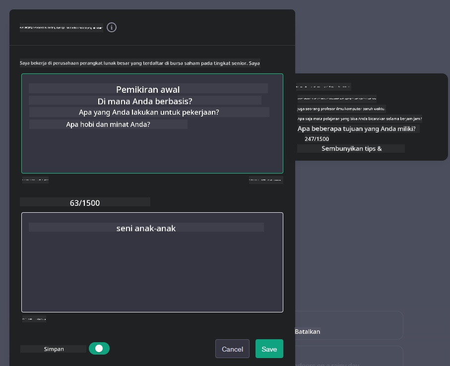
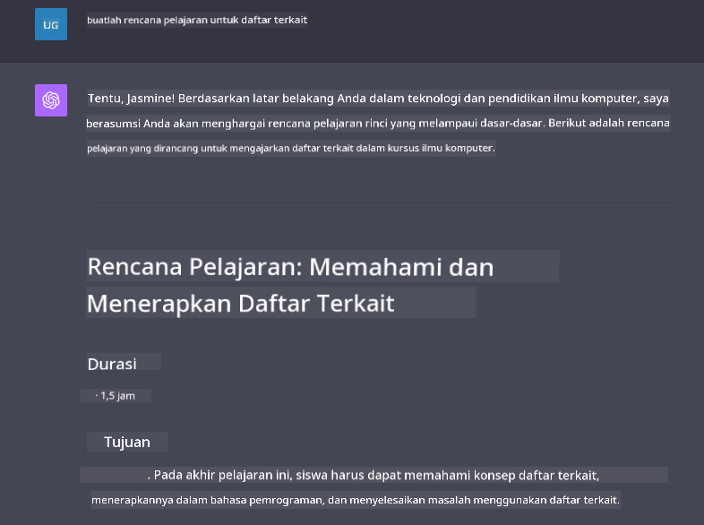

<!--
CO_OP_TRANSLATOR_METADATA:
{
  "original_hash": "ea4bbe640847aafbbba14dae4625e9af",
  "translation_date": "2025-05-19T18:00:07+00:00",
  "source_file": "07-building-chat-applications/README.md",
  "language_code": "id"
}
-->
# Membangun Aplikasi Chat yang Didukung oleh AI Generatif

[](https://aka.ms/gen-ai-lessons7-gh?WT.mc_id=academic-105485-koreyst)

> _(Klik gambar di atas untuk menonton video pelajaran ini)_

Sekarang kita telah melihat bagaimana kita dapat membangun aplikasi generasi teks, mari kita lihat aplikasi chat.

Aplikasi chat telah menjadi bagian dari kehidupan sehari-hari kita, menawarkan lebih dari sekadar sarana percakapan santai. Mereka adalah bagian integral dari layanan pelanggan, dukungan teknis, dan bahkan sistem penasihat canggih. Kemungkinan besar Anda telah mendapatkan bantuan dari aplikasi chat belum lama ini. Saat kita mengintegrasikan teknologi yang lebih canggih seperti AI generatif ke dalam platform ini, kompleksitas meningkat dan tantangan pun bertambah.

Beberapa pertanyaan yang perlu dijawab adalah:

- **Membangun aplikasi**. Bagaimana kita membangun dan mengintegrasikan aplikasi yang didukung AI ini dengan efisien untuk kasus penggunaan tertentu?
- **Pemantauan**. Setelah diterapkan, bagaimana kita dapat memantau dan memastikan bahwa aplikasi beroperasi pada tingkat kualitas tertinggi, baik dari segi fungsionalitas maupun mematuhi [enam prinsip AI yang bertanggung jawab](https://www.microsoft.com/ai/responsible-ai?WT.mc_id=academic-105485-koreyst)?

Saat kita semakin memasuki era yang ditandai oleh otomatisasi dan interaksi manusia-mesin yang mulus, memahami bagaimana AI generatif mengubah cakupan, kedalaman, dan adaptabilitas aplikasi chat menjadi sangat penting. Pelajaran ini akan menyelidiki aspek arsitektur yang mendukung sistem yang rumit ini, menyelami metodologi untuk menyempurnakannya untuk tugas-tugas spesifik domain, dan mengevaluasi metrik serta pertimbangan yang relevan untuk memastikan penerapan AI yang bertanggung jawab.

## Pendahuluan

Pelajaran ini mencakup:

- Teknik untuk membangun dan mengintegrasikan aplikasi chat dengan efisien.
- Bagaimana menerapkan kustomisasi dan penyempurnaan pada aplikasi.
- Strategi dan pertimbangan untuk memantau aplikasi chat dengan efektif.

## Tujuan Pembelajaran

Pada akhir pelajaran ini, Anda akan dapat:

- Menjelaskan pertimbangan untuk membangun dan mengintegrasikan aplikasi chat ke dalam sistem yang ada.
- Menyesuaikan aplikasi chat untuk kasus penggunaan tertentu.
- Mengidentifikasi metrik kunci dan pertimbangan untuk memantau dan mempertahankan kualitas aplikasi chat yang didukung AI dengan efektif.
- Memastikan aplikasi chat memanfaatkan AI secara bertanggung jawab.

## Mengintegrasikan AI Generatif ke dalam Aplikasi Chat

Meningkatkan aplikasi chat melalui AI generatif tidak hanya berfokus pada membuatnya lebih pintar; ini tentang mengoptimalkan arsitektur, kinerja, dan antarmuka pengguna untuk memberikan pengalaman pengguna berkualitas. Ini melibatkan penyelidikan fondasi arsitektur, integrasi API, dan pertimbangan antarmuka pengguna. Bagian ini bertujuan untuk menawarkan Anda peta jalan yang komprehensif untuk menavigasi lanskap yang kompleks ini, apakah Anda menghubungkannya ke sistem yang ada atau membangunnya sebagai platform mandiri.

Pada akhir bagian ini, Anda akan dilengkapi dengan keahlian yang diperlukan untuk membangun dan menggabungkan aplikasi chat dengan efisien.

### Chatbot atau Aplikasi Chat?

Sebelum kita menyelam lebih dalam ke pembangunan aplikasi chat, mari kita bandingkan 'chatbot' dengan 'aplikasi chat yang didukung AI,' yang memiliki peran dan fungsi yang berbeda. Tujuan utama chatbot adalah untuk mengotomatisasi tugas percakapan tertentu, seperti menjawab pertanyaan yang sering diajukan atau melacak paket. Biasanya diatur oleh logika berbasis aturan atau algoritma AI yang kompleks. Sebaliknya, aplikasi chat yang didukung AI adalah lingkungan yang jauh lebih luas yang dirancang untuk memfasilitasi berbagai bentuk komunikasi digital, seperti teks, suara, dan video chat di antara pengguna manusia. Fitur utamanya adalah integrasi model AI generatif yang mensimulasikan percakapan yang halus dan mirip manusia, menghasilkan respons berdasarkan berbagai input dan petunjuk kontekstual. Aplikasi chat yang didukung AI generatif dapat terlibat dalam diskusi domain terbuka, beradaptasi dengan konteks percakapan yang berkembang, dan bahkan menghasilkan dialog kreatif atau kompleks.

Tabel di bawah ini merinci perbedaan dan kesamaan utama untuk membantu kita memahami peran unik mereka dalam komunikasi digital.

| Chatbot                               | Aplikasi Chat yang Didukung AI Generatif |
| ------------------------------------- | ---------------------------------------- |
| Berfokus pada tugas dan berbasis aturan | Sadar akan konteks                        |
| Sering diintegrasikan ke dalam sistem yang lebih besar | Dapat menjadi tuan rumah satu atau beberapa chatbot |
| Terbatas pada fungsi yang diprogram    | Menggabungkan model AI generatif          |
| Interaksi yang terstruktur dan khusus  | Mampu berdiskusi dalam domain terbuka    |

### Memanfaatkan fungsionalitas yang telah dibangun dengan SDK dan API

Saat membangun aplikasi chat, langkah pertama yang bagus adalah menilai apa yang sudah ada. Menggunakan SDK dan API untuk membangun aplikasi chat adalah strategi yang menguntungkan karena berbagai alasan. Dengan mengintegrasikan SDK dan API yang terdokumentasi dengan baik, Anda secara strategis memposisikan aplikasi Anda untuk kesuksesan jangka panjang, mengatasi masalah skalabilitas dan pemeliharaan.

- **Mempercepat proses pengembangan dan mengurangi overhead**: Mengandalkan fungsionalitas yang telah dibangun daripada proses mahal untuk membangunnya sendiri memungkinkan Anda fokus pada aspek lain dari aplikasi Anda yang mungkin Anda anggap lebih penting, seperti logika bisnis.
- **Kinerja lebih baik**: Saat membangun fungsionalitas dari awal, Anda akhirnya akan bertanya pada diri sendiri "Bagaimana cara skala? Apakah aplikasi ini mampu menangani lonjakan pengguna yang tiba-tiba?" SDK dan API yang terawat baik sering kali memiliki solusi bawaan untuk kekhawatiran ini.
- **Pemeliharaan lebih mudah**: Pembaruan dan perbaikan lebih mudah dikelola karena sebagian besar API dan SDK hanya memerlukan pembaruan pustaka saat versi yang lebih baru dirilis.
- **Akses ke teknologi mutakhir**: Memanfaatkan model yang telah disempurnakan dan dilatih pada dataset yang luas memberikan aplikasi Anda kemampuan bahasa alami.

Mengakses fungsionalitas SDK atau API biasanya melibatkan mendapatkan izin untuk menggunakan layanan yang disediakan, yang sering kali melalui penggunaan kunci unik atau token otentikasi. Kita akan menggunakan OpenAI Python Library untuk mengeksplorasi seperti apa tampilannya. Anda juga dapat mencobanya sendiri dalam [notebook untuk OpenAI](../../../07-building-chat-applications/python/oai-assignment.ipynb) atau [notebook untuk Azure OpenAI Services](../../../07-building-chat-applications/python/aoai-assignment.ipynb) untuk pelajaran ini.

```python
import os
from openai import OpenAI

API_KEY = os.getenv("OPENAI_API_KEY","")

client = OpenAI(
    api_key=API_KEY
    )

chat_completion = client.chat.completions.create(model="gpt-3.5-turbo", messages=[{"role": "user", "content": "Suggest two titles for an instructional lesson on chat applications for generative AI."}])
```

Contoh di atas menggunakan model GPT-3.5 Turbo untuk menyelesaikan prompt, tetapi perhatikan bahwa kunci API diatur sebelum melakukannya. Anda akan menerima kesalahan jika tidak mengatur kunci.

## Pengalaman Pengguna (UX)

Prinsip-prinsip UX umum berlaku untuk aplikasi chat, tetapi berikut adalah beberapa pertimbangan tambahan yang menjadi sangat penting karena komponen pembelajaran mesin yang terlibat.

- **Mekanisme untuk mengatasi ambiguitas**: Model AI generatif terkadang menghasilkan jawaban yang ambigu. Fitur yang memungkinkan pengguna meminta klarifikasi dapat membantu jika mereka menghadapi masalah ini.
- **Retensi konteks**: Model AI generatif yang canggih memiliki kemampuan untuk mengingat konteks dalam percakapan, yang dapat menjadi aset yang diperlukan untuk pengalaman pengguna. Memberikan pengguna kemampuan untuk mengontrol dan mengelola konteks meningkatkan pengalaman pengguna, tetapi memperkenalkan risiko mempertahankan informasi pengguna yang sensitif. Pertimbangan tentang berapa lama informasi ini disimpan, seperti memperkenalkan kebijakan retensi, dapat menyeimbangkan kebutuhan akan konteks dengan privasi.
- **Personalisasi**: Dengan kemampuan untuk belajar dan beradaptasi, model AI menawarkan pengalaman yang dipersonalisasi untuk pengguna. Menyesuaikan pengalaman pengguna melalui fitur seperti profil pengguna tidak hanya membuat pengguna merasa dipahami, tetapi juga membantu mereka dalam mencari jawaban spesifik, menciptakan interaksi yang lebih efisien dan memuaskan.

Salah satu contoh personalisasi adalah pengaturan "Instruksi Khusus" dalam ChatGPT OpenAI. Ini memungkinkan Anda memberikan informasi tentang diri Anda yang mungkin menjadi konteks penting untuk prompt Anda. Berikut adalah contoh instruksi khusus.



"Profil" ini meminta ChatGPT untuk membuat rencana pelajaran tentang linked list. Perhatikan bahwa ChatGPT mempertimbangkan bahwa pengguna mungkin menginginkan rencana pelajaran yang lebih mendalam berdasarkan pengalamannya.



### Kerangka Pesan Sistem Microsoft untuk Model Bahasa Besar

[Microsoft telah memberikan panduan](https://learn.microsoft.com/azure/ai-services/openai/concepts/system-message#define-the-models-output-format?WT.mc_id=academic-105485-koreyst) untuk menulis pesan sistem yang efektif saat menghasilkan respons dari LLM yang dibagi menjadi 4 area:

1. Mendefinisikan siapa model itu untuk, serta kemampuan dan keterbatasannya.
2. Mendefinisikan format output model.
3. Memberikan contoh spesifik yang menunjukkan perilaku yang diinginkan dari model.
4. Memberikan batasan perilaku tambahan.

### Aksesibilitas

Apakah pengguna memiliki gangguan visual, pendengaran, motorik, atau kognitif, aplikasi chat yang dirancang dengan baik harus dapat digunakan oleh semua orang. Daftar berikut merinci fitur-fitur khusus yang ditujukan untuk meningkatkan aksesibilitas bagi berbagai gangguan pengguna.

- **Fitur untuk Gangguan Visual**: Tema kontras tinggi dan teks yang dapat diubah ukurannya, kompatibilitas pembaca layar.
- **Fitur untuk Gangguan Pendengaran**: Fungsi teks-ke-suara dan suara-ke-teks, petunjuk visual untuk notifikasi audio.
- **Fitur untuk Gangguan Motorik**: Dukungan navigasi keyboard, perintah suara.
- **Fitur untuk Gangguan Kognitif**: Opsi bahasa yang disederhanakan.

## Kustomisasi dan Penyempurnaan untuk Model Bahasa Spesifik Domain

Bayangkan sebuah aplikasi chat yang memahami jargon perusahaan Anda dan mengantisipasi pertanyaan spesifik yang sering diajukan oleh basis pengguna. Ada beberapa pendekatan yang patut disebutkan:

- **Memanfaatkan model DSL**. DSL adalah singkatan dari bahasa spesifik domain. Anda dapat memanfaatkan model DSL yang dilatih pada domain tertentu untuk memahami konsep dan skenario.
- **Menerapkan penyempurnaan**. Penyempurnaan adalah proses pelatihan lebih lanjut model Anda dengan data spesifik.

## Kustomisasi: Menggunakan DSL

Memanfaatkan model bahasa spesifik domain (Model DSL) dapat meningkatkan keterlibatan pengguna dengan menyediakan interaksi yang khusus dan relevan secara kontekstual. Ini adalah model yang dilatih atau disempurnakan untuk memahami dan menghasilkan teks terkait dengan bidang, industri, atau subjek tertentu. Opsi untuk menggunakan model DSL dapat bervariasi dari melatih satu dari awal, hingga menggunakan yang sudah ada melalui SDK dan API. Opsi lain adalah penyempurnaan, yang melibatkan mengambil model yang sudah dilatih sebelumnya dan mengadaptasinya untuk domain tertentu.

## Kustomisasi: Menerapkan penyempurnaan

Penyempurnaan sering dipertimbangkan ketika model yang sudah dilatih sebelumnya tidak memenuhi kebutuhan dalam domain khusus atau tugas tertentu.

Misalnya, pertanyaan medis kompleks dan membutuhkan banyak konteks. Ketika seorang profesional medis mendiagnosis pasien, itu didasarkan pada berbagai faktor seperti gaya hidup atau kondisi yang sudah ada, dan bahkan mungkin mengandalkan jurnal medis terbaru untuk memvalidasi diagnosis mereka. Dalam skenario yang rumit seperti ini, aplikasi chat AI tujuan umum tidak dapat menjadi sumber yang dapat diandalkan.

### Skenario: aplikasi medis

Pertimbangkan aplikasi chat yang dirancang untuk membantu praktisi medis dengan menyediakan referensi cepat untuk pedoman pengobatan, interaksi obat, atau temuan penelitian terbaru.

Model tujuan umum mungkin memadai untuk menjawab pertanyaan medis dasar atau memberikan saran umum, tetapi mungkin kesulitan dengan hal-hal berikut:

- **Kasus yang sangat spesifik atau kompleks**. Misalnya, seorang ahli saraf mungkin bertanya kepada aplikasi, "Apa praktik terbaik saat ini untuk mengelola epilepsi yang resisten terhadap obat pada pasien anak-anak?"
- **Kurangnya kemajuan terbaru**. Model tujuan umum bisa kesulitan memberikan jawaban terkini yang mencakup kemajuan terbaru dalam neurologi dan farmakologi.

Dalam contoh seperti ini, menyempurnakan model dengan dataset medis khusus dapat secara signifikan meningkatkan kemampuannya untuk menangani pertanyaan medis yang rumit ini dengan lebih akurat dan dapat diandalkan. Ini membutuhkan akses ke dataset yang besar dan relevan yang mewakili tantangan dan pertanyaan spesifik domain yang perlu diatasi.

## Pertimbangan untuk Pengalaman Chat yang Berkualitas Tinggi yang Didukung AI

Bagian ini merinci kriteria untuk aplikasi chat "berkualitas tinggi", yang mencakup penangkapan metrik yang dapat ditindaklanjuti dan kepatuhan pada kerangka kerja yang memanfaatkan teknologi AI secara bertanggung jawab.

### Metrik Utama

Untuk mempertahankan kinerja aplikasi yang berkualitas tinggi, sangat penting untuk melacak metrik dan pertimbangan utama. Pengukuran ini tidak hanya memastikan fungsionalitas aplikasi tetapi juga menilai kualitas model AI dan pengalaman pengguna. Berikut adalah daftar yang mencakup metrik dasar, AI, dan pengalaman pengguna yang perlu dipertimbangkan.

| Metrik                         | Definisi                                                                                                             | Pertimbangan untuk Pengembang Chat                                       |
| ----------------------------- | ---------------------------------------------------------------------------------------------------------------------- | ------------------------------------------------------------------------ |
| **Waktu Aktif**               | Mengukur waktu aplikasi beroperasi dan dapat diakses oleh pengguna.                                                   | Bagaimana Anda akan meminimalkan waktu henti?                            |
| **Waktu Respons**             | Waktu yang dibutuhkan oleh aplikasi untuk membalas pertanyaan pengguna.                                               | Bagaimana Anda dapat mengoptimalkan pemrosesan pertanyaan untuk meningkatkan waktu respons? |
| **Presisi**                   | Rasio prediksi positif yang benar terhadap jumlah total prediksi positif.                                            | Bagaimana Anda akan memvalidasi presisi model Anda?                      |
| **Recall (Sensitivitas)**     | Rasio prediksi positif yang benar terhadap jumlah positif yang sebenarnya.                                           | Bagaimana Anda akan mengukur dan meningkatkan recall?                    |
| **Skor F1**                   | Rata-rata harmonis dari presisi dan recall, yang menyeimbangkan trade-off antara keduanya.                           | Apa target Skor F1 Anda? Bagaimana Anda akan menyeimbangkan presisi dan recall? |
| **Perplexity**                | Mengukur seberapa baik distribusi probabilitas yang diprediksi oleh model sesuai dengan distribusi data yang sebenarnya. | Bagaimana Anda akan meminimalkan perplexity?                             |
| **Metrik Kepuasan Pengguna**  | Mengukur persepsi pengguna terhadap aplikasi. Sering kali ditangkap melalui survei.                                  | Seberapa sering Anda akan mengumpulkan umpan balik pengguna? Bagaimana Anda akan beradaptasi berdasarkan umpan balik tersebut? |
| **Tingkat Kesalahan**         | Tingkat kesalahan yang dibuat oleh model dalam memahami atau output.                                                 | Strategi apa yang Anda miliki untuk mengurangi tingkat kesalahan?        |
| **Siklus Pelatihan Ulang**    | Frekuensi model diperbarui untuk memasukkan data dan wawasan baru.                                                   | Seberapa sering Anda akan melatih ulang model? Apa yang memicu siklus pelatihan ulang? |
| **Deteksi Anomali**           | Alat dan teknik untuk mengidentifikasi pola yang tidak biasa yang tidak sesuai dengan perilaku yang diharapkan.     | Bagaimana Anda akan merespons anomali?                                   |

### Menerapkan Praktik AI yang Bertanggung Jawab dalam Aplikasi Chat

Pendekatan Microsoft terhadap AI yang Bertanggung Jawab telah mengidentifikasi enam prinsip yang harus memandu pengembangan dan penggunaan AI. Berikut adalah prinsip-prinsip tersebut, definisinya, dan hal-hal yang harus dipertimbangkan oleh pengembang chat serta alasan mengapa mereka harus mengambilnya dengan serius.

| Prinsip                 | Definisi Microsoft                                    | Pertimbangan untuk Pengembang Chat                                       | Mengapa Penting                                                                         |
| ---------------------- | ----------------------------------------------------- | ------------------------------------------------------------------------ | -------------------------------------------------------------------------------------- |
| Keadilan               | Sistem AI harus memperlakukan semua orang dengan adil. | Pastikan aplikasi chat tidak mendiskriminasi berdasarkan data pengguna.  | Untuk membangun kepercayaan dan inklusivitas di antara pengguna; menghindari konsekuensi hukum. |
| Keandalan dan Keamanan | Sistem AI harus berfungsi dengan andal dan aman.      | Implementasikan pengujian dan fail-safes untuk meminimalkan kesalahan dan risiko. | Memastikan kepuasan pengguna dan mencegah potensi bahaya.                              |
| Privasi dan Keamanan   | Sistem AI harus aman dan menghormati privasi.         | Implementasikan enkripsi kuat dan langkah-langkah perlindungan data.     | Untuk melindungi data pengguna yang sensitif dan mematuhi undang-undang privasi.       |
| Inklusivitas           | Sistem AI harus memberdayakan semua orang dan melibatkan orang. | Rancang UI/UX yang dapat diakses dan mudah digunakan untuk audiens yang beragam. | Memastikan bahwa lebih banyak orang dapat menggunakan aplikasi dengan efektif.         |
| Transparansi           | Sistem AI harus dapat dipahami.                       | Berikan dokumentasi yang jelas dan alasan untuk respons AI.              | Pengguna lebih cenderung mempercayai sistem jika mereka dapat memahami bagaimana keputusan dibuat. |
| Akuntabilitas          | Orang harus bertanggung jawab atas sistem AI.         | Tetapkan proses yang jelas untuk mengaudit dan meningkatkan keputusan AI. | Memungkinkan perbaikan berkelanjutan dan tindakan korektif jika terjadi kesalahan.     |

## Tugas

Lihat [tugas](../../../07-building-chat-applications/python) ini akan membawa Anda melalui serangkaian latihan dari menjalankan prompt chat pertama Anda, hingga mengklasifikasikan dan meringkas teks dan banyak lagi. Perhatikan bahwa tugas-tugas tersedia dalam berbagai bahasa pemrograman!

## Kerja Bagus! Lanjutkan Perjalanan

Setelah menyelesaikan pelajaran ini, lihat [koleksi Pembelajaran AI Generatif](https://aka.ms/genai-collection?WT.mc_id=academic-105485-koreyst) kami untuk terus

**Penafian**:  
Dokumen ini telah diterjemahkan menggunakan layanan penerjemahan AI [Co-op Translator](https://github.com/Azure/co-op-translator). Meskipun kami berusaha untuk mencapai akurasi, harap diperhatikan bahwa terjemahan otomatis mungkin mengandung kesalahan atau ketidakakuratan. Dokumen asli dalam bahasa aslinya harus dianggap sebagai sumber yang berwenang. Untuk informasi penting, disarankan menggunakan penerjemahan manusia profesional. Kami tidak bertanggung jawab atas kesalahpahaman atau penafsiran yang keliru yang timbul dari penggunaan terjemahan ini.