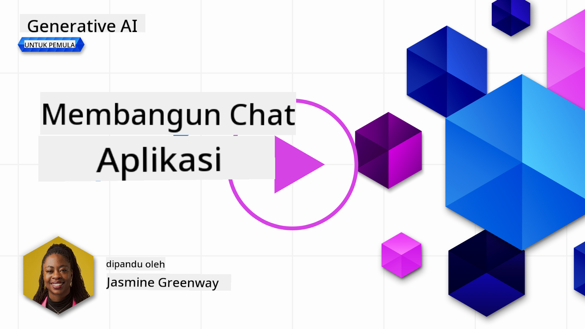
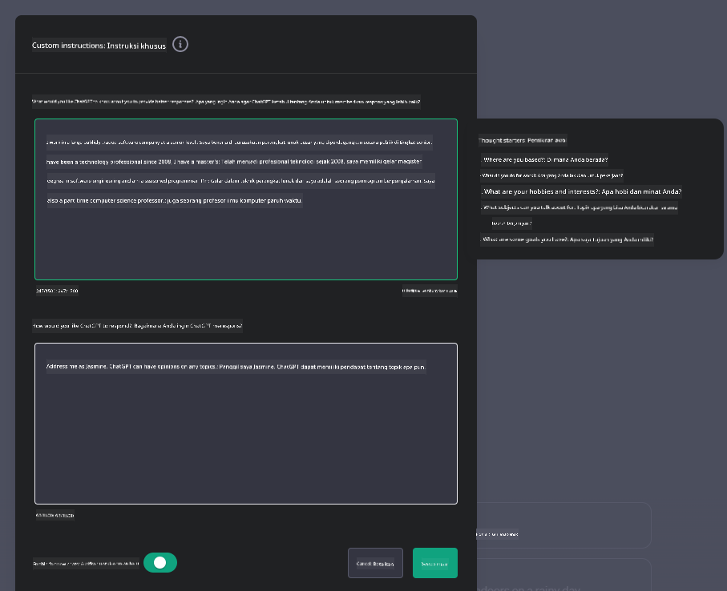
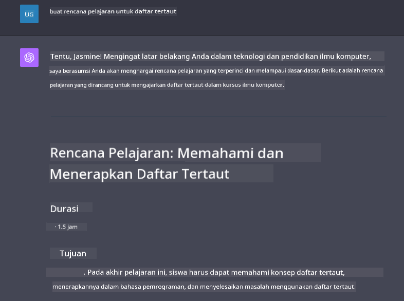

<!--
CO_OP_TRANSLATOR_METADATA:
{
  "original_hash": "ea4bbe640847aafbbba14dae4625e9af",
  "translation_date": "2025-06-25T15:45:36+00:00",
  "source_file": "07-building-chat-applications/README.md",
  "language_code": "id"
}
-->
# Membangun Aplikasi Chat Berbasis AI Generatif

[](https://aka.ms/gen-ai-lessons7-gh?WT.mc_id=academic-105485-koreyst)

> _(Klik gambar di atas untuk menonton video dari pelajaran ini)_

Setelah kita melihat bagaimana kita bisa membangun aplikasi pembangkitan teks, mari kita lihat aplikasi chat.

Aplikasi chat telah menjadi bagian dari kehidupan kita sehari-hari, menawarkan lebih dari sekadar sarana percakapan santai. Mereka adalah bagian integral dari layanan pelanggan, dukungan teknis, dan bahkan sistem penasehat yang canggih. Kemungkinan besar Anda pernah mendapatkan bantuan dari aplikasi chat belum lama ini. Saat kita mengintegrasikan teknologi yang lebih canggih seperti AI generatif ke dalam platform ini, kompleksitas meningkat begitu juga dengan tantangannya.

Beberapa pertanyaan yang perlu kita jawab adalah:

- **Membangun aplikasi**. Bagaimana kita dapat membangun dan mengintegrasikan aplikasi berbasis AI ini secara efisien untuk kasus penggunaan tertentu?
- **Pemantauan**. Setelah diterapkan, bagaimana kita dapat memantau dan memastikan bahwa aplikasi beroperasi pada tingkat kualitas tertinggi, baik dari segi fungsi maupun mematuhi [enam prinsip AI yang bertanggung jawab](https://www.microsoft.com/ai/responsible-ai?WT.mc_id=academic-105485-koreyst)?

Saat kita bergerak lebih jauh ke era yang didefinisikan oleh otomatisasi dan interaksi manusia-mesin yang mulus, memahami bagaimana AI generatif mengubah cakupan, kedalaman, dan adaptabilitas aplikasi chat menjadi penting. Pelajaran ini akan menyelidiki aspek arsitektur yang mendukung sistem yang rumit ini, menyelami metodologi untuk menyempurnakannya untuk tugas-tugas khusus domain, dan mengevaluasi metrik serta pertimbangan yang relevan untuk memastikan penerapan AI yang bertanggung jawab.

## Pengantar

Pelajaran ini mencakup:

- Teknik untuk membangun dan mengintegrasikan aplikasi chat secara efisien.
- Cara menerapkan kustomisasi dan penyempurnaan pada aplikasi.
- Strategi dan pertimbangan untuk memantau aplikasi chat secara efektif.

## Tujuan Pembelajaran

Pada akhir pelajaran ini, Anda akan dapat:

- Menjelaskan pertimbangan untuk membangun dan mengintegrasikan aplikasi chat ke dalam sistem yang ada.
- Menyesuaikan aplikasi chat untuk kasus penggunaan tertentu.
- Mengidentifikasi metrik kunci dan pertimbangan untuk memantau dan menjaga kualitas aplikasi chat berbasis AI secara efektif.
- Memastikan aplikasi chat memanfaatkan AI secara bertanggung jawab.

## Mengintegrasikan AI Generatif ke dalam Aplikasi Chat

Meningkatkan aplikasi chat melalui AI generatif bukan hanya tentang membuatnya lebih pintar; ini tentang mengoptimalkan arsitektur, kinerja, dan antarmuka pengguna mereka untuk memberikan pengalaman pengguna yang berkualitas. Ini melibatkan penyelidikan dasar-dasar arsitektur, integrasi API, dan pertimbangan antarmuka pengguna. Bagian ini bertujuan untuk menawarkan Anda peta jalan yang komprehensif untuk menavigasi lanskap yang kompleks ini, apakah Anda menghubungkannya ke dalam sistem yang ada atau membangunnya sebagai platform mandiri.

Pada akhir bagian ini, Anda akan dilengkapi dengan keahlian yang diperlukan untuk membangun dan menggabungkan aplikasi chat secara efisien.

### Chatbot atau Aplikasi Chat?

Sebelum kita terjun ke membangun aplikasi chat, mari kita bandingkan 'chatbot' dengan 'aplikasi chat berbasis AI,' yang memiliki peran dan fungsi yang berbeda. Tujuan utama chatbot adalah mengotomatisasi tugas percakapan tertentu, seperti menjawab pertanyaan yang sering diajukan atau melacak paket. Biasanya diatur oleh logika berbasis aturan atau algoritma AI yang kompleks. Sebaliknya, aplikasi chat berbasis AI adalah lingkungan yang jauh lebih luas yang dirancang untuk memfasilitasi berbagai bentuk komunikasi digital, seperti teks, suara, dan video chat di antara pengguna manusia. Fitur yang membedakannya adalah integrasi model AI generatif yang mensimulasikan percakapan yang bernuansa dan mirip manusia, menghasilkan respons berdasarkan berbagai masukan dan petunjuk kontekstual. Aplikasi chat berbasis AI generatif dapat terlibat dalam diskusi domain terbuka, beradaptasi dengan konteks percakapan yang berkembang, dan bahkan menghasilkan dialog kreatif atau kompleks.

Tabel di bawah ini menjelaskan perbedaan dan kesamaan utama untuk membantu kita memahami peran unik mereka dalam komunikasi digital.

| Chatbot                               | Aplikasi Chat Berbasis AI Generatif   |
| ------------------------------------- | -------------------------------------- |
| Berfokus pada tugas dan berbasis aturan | Sadar konteks                          |
| Sering terintegrasi ke dalam sistem yang lebih besar | Dapat meng-host satu atau beberapa chatbot |
| Terbatas pada fungsi yang diprogram    | Menggabungkan model AI generatif      |
| Interaksi khusus & terstruktur         | Mampu diskusi domain terbuka          |

### Memanfaatkan fungsi yang sudah dibangun dengan SDK dan API

Saat membangun aplikasi chat, langkah pertama yang bagus adalah menilai apa yang sudah ada. Menggunakan SDK dan API untuk membangun aplikasi chat adalah strategi yang menguntungkan untuk berbagai alasan. Dengan mengintegrasikan SDK dan API yang terdokumentasi dengan baik, Anda secara strategis memposisikan aplikasi Anda untuk sukses jangka panjang, mengatasi masalah skalabilitas dan pemeliharaan.

- **Mempercepat proses pengembangan dan mengurangi overhead**: Mengandalkan fungsi yang sudah dibangun alih-alih proses mahal untuk membangunnya sendiri memungkinkan Anda fokus pada aspek lain dari aplikasi Anda yang mungkin Anda anggap lebih penting, seperti logika bisnis.
- **Kinerja lebih baik**: Saat membangun fungsi dari awal, Anda akhirnya akan bertanya pada diri sendiri "Bagaimana ini skalanya? Apakah aplikasi ini mampu menangani lonjakan pengguna secara tiba-tiba?" SDK dan API yang terawat baik sering kali memiliki solusi bawaan untuk masalah ini.
- **Pemeliharaan lebih mudah**: Pembaruan dan peningkatan lebih mudah dikelola karena sebagian besar API dan SDK hanya memerlukan pembaruan ke pustaka ketika versi yang lebih baru dirilis.
- **Akses ke teknologi mutakhir**: Memanfaatkan model yang telah disempurnakan dan dilatih pada dataset yang luas memberikan aplikasi Anda kemampuan bahasa alami.

Mengakses fungsi dari SDK atau API biasanya melibatkan memperoleh izin untuk menggunakan layanan yang disediakan, yang sering kali melalui penggunaan kunci unik atau token otentikasi. Kita akan menggunakan Perpustakaan Python OpenAI untuk menjelajahi seperti apa tampilan ini. Anda juga dapat mencobanya sendiri dalam [notebook untuk OpenAI](../../../07-building-chat-applications/python/oai-assignment.ipynb) atau [notebook untuk Layanan Azure OpenAI](../../../07-building-chat-applications/python/aoai-assignment.ipynb) untuk pelajaran ini.

```python
import os
from openai import OpenAI

API_KEY = os.getenv("OPENAI_API_KEY","")

client = OpenAI(
    api_key=API_KEY
    )

chat_completion = client.chat.completions.create(model="gpt-3.5-turbo", messages=[{"role": "user", "content": "Suggest two titles for an instructional lesson on chat applications for generative AI."}])
```

Contoh di atas menggunakan model GPT-3.5 Turbo untuk menyelesaikan prompt, tetapi perhatikan bahwa kunci API diatur sebelum melakukannya. Anda akan menerima kesalahan jika tidak mengatur kunci.

## Pengalaman Pengguna (UX)

Prinsip UX umum berlaku untuk aplikasi chat, tetapi berikut adalah beberapa pertimbangan tambahan yang menjadi sangat penting karena komponen pembelajaran mesin yang terlibat.

- **Mekanisme untuk mengatasi ambiguitas**: Model AI generatif kadang-kadang menghasilkan jawaban yang ambigu. Fitur yang memungkinkan pengguna untuk meminta klarifikasi bisa sangat membantu jika mereka menghadapi masalah ini.
- **Retensi konteks**: Model AI generatif yang canggih memiliki kemampuan untuk mengingat konteks dalam percakapan, yang bisa menjadi aset penting bagi pengalaman pengguna. Memberikan pengguna kemampuan untuk mengontrol dan mengelola konteks meningkatkan pengalaman pengguna, tetapi memperkenalkan risiko mempertahankan informasi pengguna yang sensitif. Pertimbangan untuk berapa lama informasi ini disimpan, seperti memperkenalkan kebijakan retensi, dapat menyeimbangkan kebutuhan akan konteks dengan privasi.
- **Personalisasi**: Dengan kemampuan untuk belajar dan beradaptasi, model AI menawarkan pengalaman yang dipersonalisasi untuk pengguna. Menyesuaikan pengalaman pengguna melalui fitur seperti profil pengguna tidak hanya membuat pengguna merasa dipahami, tetapi juga membantu mereka menemukan jawaban spesifik, menciptakan interaksi yang lebih efisien dan memuaskan.

Salah satu contoh personalisasi adalah pengaturan "Instruksi Kustom" di ChatGPT OpenAI. Ini memungkinkan Anda memberikan informasi tentang diri Anda yang mungkin menjadi konteks penting untuk permintaan Anda. Berikut adalah contoh instruksi kustom.



"Profil" ini meminta ChatGPT untuk membuat rencana pelajaran tentang linked lists. Perhatikan bahwa ChatGPT memperhitungkan bahwa pengguna mungkin menginginkan rencana pelajaran yang lebih mendalam berdasarkan pengalamannya.



### Kerangka Pesan Sistem Microsoft untuk Model Bahasa Besar

[Microsoft telah memberikan panduan](https://learn.microsoft.com/azure/ai-services/openai/concepts/system-message#define-the-models-output-format?WT.mc_id=academic-105485-koreyst) untuk menulis pesan sistem yang efektif saat menghasilkan respons dari LLM yang dibagi menjadi 4 area:

1. Menentukan untuk siapa model itu, serta kemampuan dan keterbatasannya.
2. Menentukan format keluaran model.
3. Memberikan contoh spesifik yang menunjukkan perilaku yang diinginkan dari model.
4. Memberikan pembatas perilaku tambahan.

### Aksesibilitas

Apakah seorang pengguna memiliki gangguan visual, pendengaran, motorik, atau kognitif, aplikasi chat yang dirancang dengan baik harus dapat digunakan oleh semua orang. Daftar berikut memecah fitur spesifik yang ditujukan untuk meningkatkan aksesibilitas untuk berbagai gangguan pengguna.

- **Fitur untuk Gangguan Visual**: Tema kontras tinggi dan teks yang dapat diubah ukurannya, kompatibilitas pembaca layar.
- **Fitur untuk Gangguan Pendengaran**: Fungsi teks-ke-suara dan suara-ke-teks, isyarat visual untuk notifikasi audio.
- **Fitur untuk Gangguan Motorik**: Dukungan navigasi keyboard, perintah suara.
- **Fitur untuk Gangguan Kognitif**: Opsi bahasa yang disederhanakan.

## Kustomisasi dan Penyempurnaan untuk Model Bahasa Khusus Domain

Bayangkan sebuah aplikasi chat yang memahami jargon perusahaan Anda dan mengantisipasi pertanyaan spesifik yang sering diajukan oleh basis penggunanya. Ada beberapa pendekatan yang patut disebutkan:

- **Memanfaatkan model DSL**. DSL adalah singkatan dari domain specific language. Anda dapat memanfaatkan model DSL yang dilatih pada domain tertentu untuk memahami konsep dan skenarionya.
- **Menerapkan penyempurnaan**. Penyempurnaan adalah proses melatih model Anda lebih lanjut dengan data spesifik.

## Kustomisasi: Menggunakan DSL

Memanfaatkan model bahasa khusus domain (Model DSL) dapat meningkatkan keterlibatan pengguna dengan menyediakan interaksi yang khusus dan relevan secara kontekstual. Ini adalah model yang dilatih atau disempurnakan untuk memahami dan menghasilkan teks yang terkait dengan bidang, industri, atau subjek tertentu. Opsi untuk menggunakan model DSL dapat bervariasi dari melatih satu dari awal, hingga menggunakan yang sudah ada melalui SDK dan API. Opsi lain adalah penyempurnaan, yang melibatkan mengambil model pra-latih yang ada dan mengadaptasinya untuk domain tertentu.

## Kustomisasi: Menerapkan Penyempurnaan

Penyempurnaan sering dipertimbangkan ketika model pra-latih kurang dalam domain khusus atau tugas tertentu.

Misalnya, pertanyaan medis bersifat kompleks dan memerlukan banyak konteks. Ketika seorang profesional medis mendiagnosis pasien, itu didasarkan pada berbagai faktor seperti gaya hidup atau kondisi yang sudah ada sebelumnya, dan bahkan mungkin bergantung pada jurnal medis terbaru untuk memvalidasi diagnosis mereka. Dalam skenario yang rumit seperti ini, aplikasi chat AI umum tidak dapat menjadi sumber yang dapat diandalkan.

### Skenario: aplikasi medis

Pertimbangkan aplikasi chat yang dirancang untuk membantu praktisi medis dengan memberikan referensi cepat ke pedoman pengobatan, interaksi obat, atau temuan penelitian terbaru.

Model umum mungkin cukup untuk menjawab pertanyaan medis dasar atau memberikan saran umum, tetapi mungkin kesulitan dengan hal-hal berikut:

- **Kasus yang sangat spesifik atau kompleks**. Misalnya, seorang ahli saraf mungkin bertanya kepada aplikasi, "Apa praktik terbaik saat ini untuk mengelola epilepsi yang resisten terhadap obat pada pasien anak?"
- **Kurangnya kemajuan terbaru**. Model umum bisa kesulitan memberikan jawaban terkini yang menggabungkan kemajuan terbaru dalam neurologi dan farmakologi.

Dalam kasus seperti ini, menyempurnakan model dengan dataset medis khusus dapat secara signifikan meningkatkan kemampuannya untuk menangani pertanyaan medis yang rumit ini dengan lebih akurat dan andal. Ini memerlukan akses ke dataset besar dan relevan yang mewakili tantangan dan pertanyaan khusus domain yang perlu diatasi.

## Pertimbangan untuk Pengalaman Chat Berbasis AI Berkualitas Tinggi

Bagian ini menjelaskan kriteria untuk aplikasi chat "berkualitas tinggi", yang mencakup pengambilan metrik yang dapat ditindaklanjuti dan kepatuhan terhadap kerangka kerja yang memanfaatkan teknologi AI secara bertanggung jawab.

### Metrik Kunci

Untuk menjaga kinerja aplikasi yang berkualitas tinggi, penting untuk melacak metrik kunci dan pertimbangan. Pengukuran ini tidak hanya memastikan fungsionalitas aplikasi tetapi juga menilai kualitas model AI dan pengalaman pengguna. Berikut adalah daftar yang mencakup metrik dasar, AI, dan pengalaman pengguna yang perlu dipertimbangkan.

| Metrik                        | Definisi                                                                                                             | Pertimbangan untuk Pengembang Chat                                        |
| ----------------------------- | -------------------------------------------------------------------------------------------------------------------- | ------------------------------------------------------------------------- |
| **Uptime**                    | Mengukur waktu aplikasi beroperasi dan dapat diakses oleh pengguna.                                                  | Bagaimana Anda akan meminimalkan downtime?                                |
| **Waktu Respons**             | Waktu yang dibutuhkan aplikasi untuk membalas permintaan pengguna.                                                   | Bagaimana Anda dapat mengoptimalkan pemrosesan permintaan untuk meningkatkan waktu respons? |
| **Presisi**                   | Rasio prediksi positif benar terhadap jumlah total prediksi positif                                                  | Bagaimana Anda akan memvalidasi presisi model Anda?                       |
| **Recall (Sensitivitas)**     | Rasio prediksi positif benar terhadap jumlah sebenarnya dari positif                                                 | Bagaimana Anda akan mengukur dan meningkatkan recall?                     |
| **Skor F1**                   | Rata-rata harmonis dari presisi dan recall, yang menyeimbangkan trade-off antara keduanya.                           | Apa target Skor F1 Anda? Bagaimana Anda akan menyeimbangkan presisi dan recall? |
| **Perplexity**                | Mengukur seberapa baik distribusi probabilitas yang diprediksi oleh model selaras dengan distribusi data yang sebenarnya. | Bagaimana Anda akan meminimalkan perplexity?                              |
| **Metrik Kepuasan Pengguna**  | Mengukur persepsi pengguna terhadap aplikasi. Sering kali ditangkap melalui survei.                                  | Seberapa sering Anda akan mengumpulkan umpan balik pengguna? Bagaimana Anda akan beradaptasi berdasarkan itu? |
| **Tingkat Kesalahan**         | Tingkat di mana model membuat kesalahan dalam memahami atau menghasilkan output.                                      | Strategi apa yang Anda miliki untuk mengurangi tingkat kesalahan?         |
| **Siklus Pelatihan Ulang**    | Frekuensi di mana model diperbarui untuk menggabungkan data dan wawasan baru.                                        | Seberapa sering Anda akan melatih ulang model? Apa yang memicu siklus pelatihan ulang? |
| **Deteksi Anomali**           | Alat dan teknik untuk mengidentifikasi pola yang tidak biasa yang tidak sesuai dengan perilaku yang diharapkan.      | Bagaimana Anda akan merespons anomali?                                    |

### Menerapkan Praktik AI yang Bertanggung Jawab dalam Aplikasi Chat

Pendekatan Microsoft terhadap AI yang Bertanggung Jawab telah mengidentifikasi enam prinsip yang harus memandu pengembangan dan penggunaan AI. Di bawah ini adalah prinsip-prinsipnya, definisi mereka, dan hal-hal yang harus dipertimbangkan oleh pengembang chat serta mengapa mereka harus menganggapnya serius.

| Prinsip                | Definisi Microsoft                                       | Pertimbangan untuk Pengembang Chat                                      | Mengapa Ini Penting                                                                     |
| ---------------------- | -------------------------------------------------------- | ---------------------------------------------------------------------- | -------------------------------------------------------------------------------------- |
| Keadilan               | Sistem AI harus memperlakukan semua orang secara adil.   | Pastikan aplikasi chat tidak mendiskriminasi berdasarkan data pengguna. | Untuk membangun kepercayaan dan inklusivitas di antara pengguna; menghindari konsekuensi hukum. |
| Keandalan dan Keamanan | Sistem AI harus berfungsi secara andal dan aman.         | Terapkan pengujian dan pengaman untuk meminimalkan kesalahan dan risiko. | Memastikan kepuasan pengguna dan mencegah potensi bahaya.                             |
| Privasi dan Keamanan   | Sistem AI harus aman dan menghormati privasi.            | Terapkan enkripsi yang kuat dan langkah-langkah perlindungan data.      | Untuk melindungi data pengguna yang sensitif dan mematuhi undang-undang privasi.       |
| Inklusivitas           | Sistem AI harus memberdayakan semua orang dan melibatkan mereka. | Rancang UI/UX yang dapat diakses dan mudah digunakan untuk beragam audiens. | Memastikan bahwa lebih banyak orang dapat menggunakan aplikasi dengan efektif.        |
| Transparansi           | Sistem AI harus dapat dipahami.                          | Berikan dokumentasi yang jelas dan alasan untuk respons AI.             | Pengguna lebih mungkin mempercayai sistem jika mereka dapat memahami bagaimana keputusan dibuat. |
| Akuntabilitas          | Orang harus bertanggung jawab atas sistem AI.            | Tetapkan proses yang jelas untuk mengaudit dan meningkatkan keputusan AI. | Memungkinkan peningkatan berkelanjutan dan tindakan korektif jika terjadi kesalahan.  |

## Tugas

Lihat [tugas](../../../07-building-chat-applications/python) ini akan membawa Anda melalui serangkaian latihan dari menjalankan permintaan chat pertama Anda, hingga mengklasifikasikan dan meringkas teks dan lainnya. Perhatikan bahwa tugas-tugas tersedia dalam berbagai bahasa pemrograman!

## Kerja Bagus! Lanjutkan Perjalanan

Setelah menyelesaikan pelajaran ini, lihat [koleksi Pembelajaran AI Generatif kami](https://aka.ms/genai-collection?WT.mc_id=academic-105485-koreyst) untuk terus meningkatkan pengetahuan AI Generatif Anda!

Pergi ke Pelajaran 8 untuk melihat bagaimana Anda dapat mulai [membangun aplikasi pencarian](../08-building-search-applications/README.md?WT

**Penafian**:  
Dokumen ini telah diterjemahkan menggunakan layanan penerjemahan AI [Co-op Translator](https://github.com/Azure/co-op-translator). Meskipun kami berusaha untuk mencapai akurasi, harap diingat bahwa terjemahan otomatis mungkin mengandung kesalahan atau ketidakakuratan. Dokumen asli dalam bahasa aslinya harus dianggap sebagai sumber otoritatif. Untuk informasi penting, disarankan menggunakan terjemahan manusia profesional. Kami tidak bertanggung jawab atas kesalahpahaman atau salah tafsir yang timbul dari penggunaan terjemahan ini.