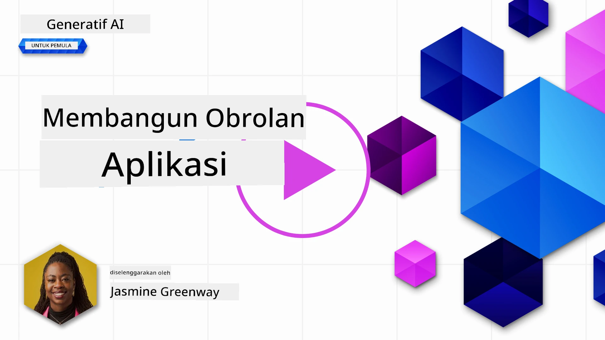
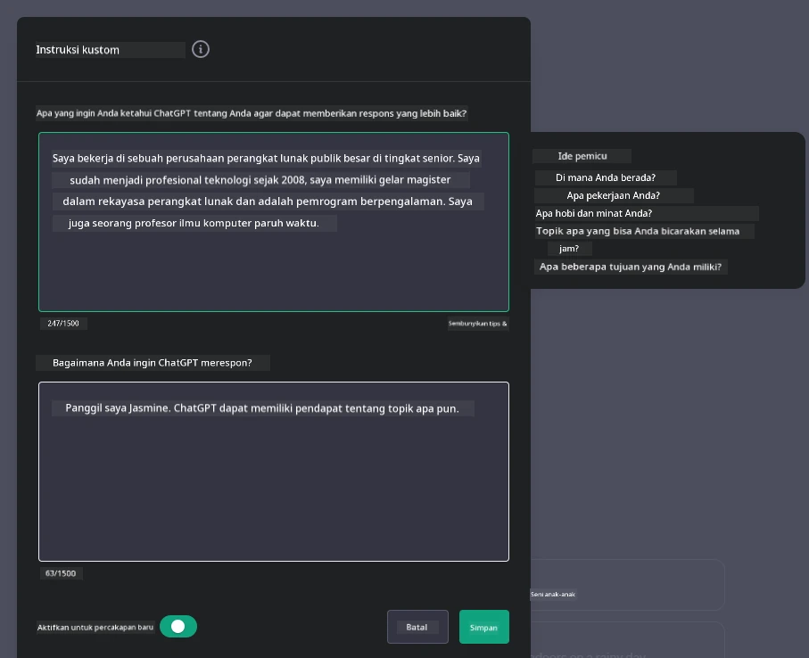
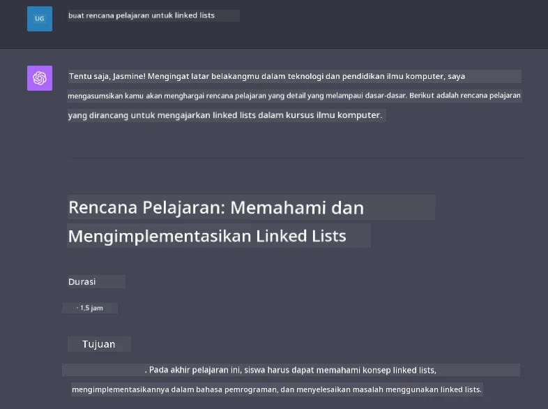

# Membangun Aplikasi Chat yang Didukung AI Generatif

[](https://youtu.be/R9V0ZY1BEQo?si=IHuU-fS9YWT8s4sA)

> _(Klik gambar di atas untuk menonton video pelajaran ini)_

Sekarang setelah kita melihat bagaimana kita dapat membangun aplikasi generasi teks, mari kita lihat aplikasi chat.

Aplikasi chat telah menjadi bagian yang terintegrasi dalam kehidupan sehari-hari kita, menawarkan lebih dari sekadar sarana untuk percakapan santai. Mereka adalah bagian integral dari layanan pelanggan, dukungan teknis, dan bahkan sistem penasihat yang canggih. Kemungkinan besar Anda baru-baru ini mendapatkan bantuan dari aplikasi chat. Saat kita mengintegrasikan teknologi yang lebih maju seperti AI generatif ke dalam platform ini, kompleksitas meningkat begitu juga tantangannya.

Beberapa pertanyaan yang perlu kita jawab adalah:

- **Membangun aplikasi**. Bagaimana kita secara efisien membangun dan mengintegrasikan aplikasi bertenaga AI ini dengan mulus untuk kasus penggunaan tertentu?
- **Pemantauan**. Setelah diluncurkan, bagaimana kita dapat memantau dan memastikan aplikasi beroperasi pada tingkat kualitas tertinggi, baik dari segi fungsionalitas maupun mematuhi [enam prinsip AI bertanggung jawab](https://www.microsoft.com/ai/responsible-ai?WT.mc_id=academic-105485-koreyst)?

Saat kita melangkah lebih jauh ke zaman yang didefinisikan oleh otomatisasi dan interaksi manusia-mesin yang mulus, memahami bagaimana AI generatif mengubah cakupan, kedalaman, dan kemampuan beradaptasi aplikasi chat menjadi sangat penting. Pelajaran ini akan menyelidiki aspek arsitektur yang mendukung sistem rumit ini, mendalami metodologi untuk menyetel mereka untuk tugas khusus domain, dan mengevaluasi metrik serta pertimbangan yang relevan untuk memastikan penerapan AI yang bertanggung jawab.

## Pendahuluan

Pelajaran ini membahas:

- Teknik untuk membangun dan mengintegrasikan aplikasi chat secara efisien.
- Cara menerapkan kustomisasi dan penyetelan pada aplikasi.
- Strategi dan pertimbangan untuk memantau aplikasi chat secara efektif.

## Tujuan Pembelajaran

Pada akhir pelajaran ini, Anda akan dapat:

- Menjelaskan pertimbangan dalam membangun dan mengintegrasikan aplikasi chat ke dalam sistem yang sudah ada.
- Menyesuaikan aplikasi chat untuk kasus penggunaan tertentu.
- Mengidentifikasi metrik utama dan pertimbangan untuk memantau dan menjaga kualitas aplikasi chat bertenaga AI secara efektif.
- Memastikan aplikasi chat memanfaatkan AI secara bertanggung jawab.

## Mengintegrasikan AI Generatif ke dalam Aplikasi Chat

Meningkatkan aplikasi chat melalui AI generatif tidak hanya berfokus pada membuatnya lebih pintar; ini mengenai mengoptimalkan arsitektur, kinerja, dan antarmuka pengguna untuk memberikan pengalaman pengguna yang berkualitas. Ini melibatkan penyelidikan fondasi arsitektur, integrasi API, dan pertimbangan antarmuka pengguna. Bagian ini bertujuan menawarkan roadmap komprehensif untuk menavigasi lanskap kompleks ini, apakah Anda menghubungkannya ke sistem yang sudah ada atau membangunnya sebagai platform mandiri.

Pada akhir bagian ini, Anda akan dilengkapi dengan keahlian yang diperlukan untuk membangun dan menggabungkan aplikasi chat secara efisien.

### Chatbot atau Aplikasi Chat?

Sebelum kita masuk ke membangun aplikasi chat, mari kita bandingkan ‘chatbot’ dengan ‘aplikasi chat bertenaga AI’, yang memiliki peran dan fungsi yang berbeda. Tujuan utama chatbot adalah mengotomatiskan tugas percakapan spesifik, seperti menjawab pertanyaan yang sering diajukan atau melacak paket. Biasanya dikendalikan oleh logika berbasis aturan atau algoritma AI yang kompleks. Sebaliknya, aplikasi chat bertenaga AI adalah lingkungan yang jauh lebih luas yang dirancang untuk memfasilitasi berbagai bentuk komunikasi digital, seperti chat teks, suara, dan video antar pengguna manusia. Fitur penentunya adalah integrasi model AI generatif yang mensimulasikan percakapan yang bernuansa dan mirip manusia, menghasilkan respons berdasarkan beragam input dan petunjuk kontekstual. Aplikasi chat yang didukung AI generatif dapat terlibat dalam diskusi domain terbuka, beradaptasi dengan konteks percakapan yang berkembang, dan bahkan menghasilkan dialog yang kreatif atau kompleks.

Tabel di bawah ini menguraikan perbedaan dan persamaan utama untuk membantu kita memahami peran unik mereka dalam komunikasi digital.

| Chatbot                               | Aplikasi Chat Bertenaga AI Generatif          |
| ------------------------------------- | ---------------------------------------------- |
| Terfokus pada tugas dan berbasis aturan | Sadar konteks                                  |
| Sering terintegrasi ke sistem yang lebih besar | Dapat menjadi host satu atau beberapa chatbot |
| Terbatas pada fungsi yang diprogram      | Menggabungkan model AI generatif               |
| Interaksi khusus & terstruktur           | Mampu melakukan diskusi domain terbuka         |

### Memanfaatkan fungsi yang sudah dibuat dengan SDK dan API

Saat membangun aplikasi chat, langkah awal yang baik adalah menilai apa yang sudah ada. Menggunakan SDK dan API untuk membangun aplikasi chat adalah strategi yang menguntungkan karena berbagai alasan. Dengan mengintegrasikan SDK dan API yang terdokumentasi dengan baik, Anda secara strategis memposisikan aplikasi Anda untuk sukses jangka panjang, mengatasi masalah skala dan pemeliharaan.

- **Mempercepat proses pengembangan dan mengurangi beban**: Mengandalkan fungsi yang sudah dibuat ketimbang membangunnya sendiri yang mahal memungkinkan Anda fokus pada aspek lain dari aplikasi yang mungkin lebih penting, seperti logika bisnis.
- **Kinerja lebih baik**: Saat membangun fungsi dari awal, Anda akhirnya bertanya "Bagaimana skalabilitasnya? Apakah aplikasi ini mampu menangani lonjakan pengguna secara tiba-tiba?" SDK dan API yang terawat dengan baik sering memiliki solusi bawaan untuk masalah ini.
- **Pemeliharaan lebih mudah**: Pembaruan dan peningkatan lebih mudah dikelola karena kebanyakan API dan SDK hanya memerlukan pembaruan perpustakaan saat versi baru dirilis.
- **Akses ke teknologi mutakhir**: Memanfaatkan model yang sudah disetel dan dilatih pada dataset yang luas memberikan aplikasi Anda kemampuan bahasa alami.

Mengakses fungsi SDK atau API biasanya melibatkan memperoleh izin untuk menggunakan layanan yang disediakan, yang sering melalui penggunaan kunci unik atau token otentikasi. Kita akan menggunakan OpenAI Python Library untuk mengeksplorasi bagaimana tampilannya. Anda juga dapat mencobanya sendiri dalam [notebook untuk OpenAI](./python/oai-assignment.ipynb?WT.mc_id=academic-105485-koreyst) atau [notebook untuk Azure OpenAI Services](./python/aoai-assignment.ipynb?WT.mc_id=academic-105485-koreys) untuk pelajaran ini.

```python
import os
from openai import OpenAI

API_KEY = os.getenv("OPENAI_API_KEY","")

client = OpenAI(
    api_key=API_KEY
    )

response = client.responses.create(model="gpt-5-mini", input="Suggest two titles for an instructional lesson on chat applications for generative AI.", store=False)
print(response.output_text)
```

Contoh di atas menggunakan model mini GPT-5 dengan Responses API untuk menyelesaikan prompt, tetapi perhatikan bahwa kunci API telah disetel sebelumnya. Anda akan menerima kesalahan jika tidak menyetel kunci tersebut.

## Pengalaman Pengguna (UX)

Prinsip UX umum berlaku untuk aplikasi chat, tetapi berikut adalah beberapa pertimbangan tambahan yang menjadi sangat penting karena komponen pembelajaran mesin yang terlibat.

- **Mekanisme untuk menangani ambigu**: Model AI generatif kadang-kadang menghasilkan jawaban yang ambigu. Fitur yang memungkinkan pengguna meminta klarifikasi bisa sangat membantu jika mereka menghadapi masalah tersebut.
- **Retensi konteks**: Model AI generatif yang canggih memiliki kemampuan mengingat konteks dalam percakapan, yang dapat menjadi aset penting bagi pengalaman pengguna. Memberi pengguna kemampuan untuk mengontrol dan mengelola konteks meningkatkan pengalaman pengguna, tetapi memperkenalkan risiko menyimpan informasi sensitif pengguna. Pertimbangan berapa lama informasi ini disimpan, seperti memperkenalkan kebijakan retensi, bisa menyeimbangkan kebutuhan konteks dengan privasi.
- **Personalisasi**: Dengan kemampuan belajar dan beradaptasi, model AI menawarkan pengalaman yang dipersonalisasi untuk pengguna. Menyesuaikan pengalaman pengguna melalui fitur seperti profil pengguna tidak hanya membuat pengguna merasa dipahami, tetapi juga membantu pencarian jawaban spesifik, menciptakan interaksi yang lebih efisien dan memuaskan.

Salah satu contoh personalisasi adalah pengaturan "Custom instructions" di ChatGPT OpenAI. Ini memungkinkan Anda memberikan informasi tentang diri Anda yang mungkin menjadi konteks penting untuk prompt Anda. Berikut contoh instruksi khusus.



"Profil" ini mengarahkan ChatGPT untuk membuat rencana pelajaran tentang linked lists. Perhatikan bahwa ChatGPT mempertimbangkan bahwa pengguna mungkin menginginkan rencana pelajaran yang lebih mendalam berdasarkan pengalamannya.



### Framework Microsoft untuk Pesan Sistem pada Model Bahasa Besar

[Microsoft telah memberikan panduan](https://learn.microsoft.com/azure/ai-foundry/openai/concepts/system-message#define-the-models-output-format?WT.mc_id=academic-105485-koreyst) untuk menulis pesan sistem yang efektif saat menghasilkan respons dari LLM yang dibagi menjadi 4 area:

1. Mendefinisikan siapa model ini untuk siapa, serta kapabilitas dan batasannya.
2. Mendefinisikan format keluaran model.
3. Memberikan contoh spesifik yang menunjukkan perilaku yang dimaksudkan dari model.
4. Memberikan pedoman perilaku tambahan.

### Aksesibilitas

Apakah pengguna memiliki gangguan penglihatan, pendengaran, motorik, atau kognitif, aplikasi chat yang dirancang dengan baik harus dapat digunakan oleh semua orang. Daftar berikut menguraikan fitur spesifik yang bertujuan untuk meningkatkan aksesibilitas bagi berbagai gangguan pengguna.

- **Fitur untuk Gangguan Penglihatan**: Tema kontras tinggi dan teks yang dapat diubah ukurannya, kompatibilitas pembaca layar.
- **Fitur untuk Gangguan Pendengaran**: Fungsi text-to-speech dan speech-to-text, petunjuk visual untuk notifikasi audio.
- **Fitur untuk Gangguan Motorik**: Dukungan navigasi keyboard, perintah suara.
- **Fitur untuk Gangguan Kognitif**: Pilihan bahasa yang disederhanakan.

## Kustomisasi dan Penyelesaian untuk Model Bahasa Spesifik Domain

Bayangkan sebuah aplikasi chat yang memahami istilah perusahaan Anda dan mengantisipasi pertanyaan spesifik yang sering diajukan basis penggunanya. Ada beberapa pendekatan yang patut disebutkan:

- **Memanfaatkan model DSL**. DSL berarti bahasa spesifik domain. Anda dapat memanfaatkan model DSL yang dilatih pada domain tertentu untuk memahami konsep dan skenario tersebut.
- **Menerapkan penyetelan**. Pemetaan ulang adalah proses pelatihan lebih lanjut model Anda dengan data spesifik.

## Kustomisasi: Menggunakan DSL

Memanfaatkan model bahasa spesifik domain (Model DSL) dapat meningkatkan keterlibatan pengguna dengan menyediakan interaksi yang khusus dan relevan secara kontekstual. Ini adalah model yang dilatih atau disetel untuk memahami dan menghasilkan teks terkait bidang, industri, atau subjek tertentu. Opsi menggunakan model DSL dapat bervariasi dari melatih satu dari awal, hingga menggunakan yang sudah ada melalui SDK dan API. Pilihan lainnya adalah penyetelan, yang melibatkan mengambil model yang sudah dilatih sebelumnya dan menyesuaikannya untuk domain tertentu.

## Kustomisasi: Terapkan penyetelan

Penyetelan sering dipertimbangkan ketika model pra-latih kurang memadai dalam domain khusus atau tugas tertentu.

Misalnya, pertanyaan medis itu kompleks dan membutuhkan banyak konteks. Ketika seorang profesional medis mendiagnosa pasien, itu didasarkan pada berbagai faktor seperti gaya hidup atau kondisi sebelumnya, dan mungkin juga bergantung pada jurnal medis terbaru untuk memvalidasi diagnosis mereka. Dalam skenario bernuansa seperti itu, aplikasi chat AI tujuan umum tidak bisa menjadi sumber terpercaya.

### Skenario: aplikasi medis

Pertimbangkan aplikasi chat yang dirancang untuk membantu praktisi medis dengan memberikan referensi cepat ke pedoman pengobatan, interaksi obat, atau temuan riset terbaru.

Model tujuan umum mungkin memadai untuk menjawab pertanyaan medis dasar atau memberikan saran umum, tetapi mungkin kesulitan dengan hal-hal berikut:

- **Kasus yang sangat spesifik atau kompleks**. Misalnya, seorang ahli saraf mungkin bertanya pada aplikasi, "Apa praktik terbaik terbaru untuk mengelola epilepsi resisten obat pada pasien anak-anak?"
- **Kurangnya kemajuan terbaru**. Model umum mungkin kesulitan memberikan jawaban terkini yang menggabungkan kemajuan terbaru dalam neurologi dan farmakologi.

Dalam kasus seperti ini, menyetel model dengan dataset medis khusus dapat secara signifikan meningkatkan kemampuannya menangani pertanyaan medis rumit ini dengan lebih akurat dan andal. Ini memerlukan akses ke dataset besar dan relevan yang merepresentasikan tantangan dan pertanyaan spesifik domain yang perlu diatasi.

## Pertimbangan untuk Pengalaman Chat Berbasis AI Berkualitas Tinggi

Bagian ini menguraikan kriteria untuk aplikasi chat "berkualitas tinggi," yang mencakup pengambilan metrik yang dapat ditindaklanjuti dan ketaatan pada kerangka kerja yang menggunakan teknologi AI secara bertanggung jawab.

### Metrik Kunci

Untuk menjaga kinerja aplikasi agar berkualitas tinggi, sangat penting melacak metrik dan pertimbangan kunci. Pengukuran ini tidak hanya memastikan fungsionalitas aplikasi tetapi juga menilai kualitas model AI dan pengalaman pengguna. Berikut daftar yang mencakup metrik dasar, AI, dan pengalaman pengguna yang perlu dipertimbangkan.

| Metrik                       | Definisi                                                                                                               | Pertimbangan untuk Pengembang Chat                                       |
| ---------------------------- | ---------------------------------------------------------------------------------------------------------------------- | ----------------------------------------------------------------------- |
| **Waktu Aktif (Uptime)**     | Mengukur waktu aplikasi beroperasi dan dapat diakses oleh pengguna.                                                    | Bagaimana Anda meminimalkan waktu tidak aktif?                          |
| **Waktu Respons**            | Waktu yang dibutuhkan aplikasi untuk membalas pertanyaan pengguna.                                                    | Bagaimana Anda mengoptimalkan pemrosesan kueri untuk memperbaiki waktu respons? |
| **Presisi**                  | Rasio prediksi positif benar terhadap total prediksi positif.                                                          | Bagaimana Anda memvalidasi presisi model Anda?                          |
| **Recall (Sensitivitas)**    | Rasio prediksi positif benar terhadap jumlah positif yang sebenarnya.                                                  | Bagaimana Anda mengukur dan meningkatkan recall?                        |
| **Skor F1**                  | Rata-rata harmonik antara presisi dan recall yang menyeimbangkan keduanya.                                             | Berapa target Skor F1 Anda? Bagaimana Anda menyeimbangkan presisi dan recall? |
| **Perplexity**               | Mengukur seberapa baik distribusi probabilitas yang diprediksi model sesuai dengan distribusi data sebenarnya.         | Bagaimana Anda meminimalkan perplexity?                                |
| **Metrik Kepuasan Pengguna**| Mengukur persepsi pengguna terhadap aplikasi. Biasanya diambil melalui survei.                                         | Seberapa sering Anda mengumpulkan umpan balik pengguna? Bagaimana Anda beradaptasi berdasarkan itu? |
| **Tingkat Kesalahan**        | Tingkat di mana model membuat kesalahan dalam pemahaman atau keluaran.                                                  | Strategi apa yang Anda miliki untuk mengurangi tingkat kesalahan?      |
| **Siklus Pelatihan Ulang**  | Frekuensi model diperbarui untuk memasukkan data dan wawasan baru.                                                     | Seberapa sering Anda melakukan pelatihan ulang? Apa yang memicu siklus pelatihan ulang? |

| **Deteksi Anomali**         | Alat dan teknik untuk mengidentifikasi pola tidak biasa yang tidak sesuai dengan perilaku yang diharapkan.                        | Bagaimana Anda akan merespons anomali?                                        |

### Menerapkan Praktik AI yang Bertanggung Jawab dalam Aplikasi Chat

Pendekatan Microsoft terhadap AI Bertanggung Jawab telah mengidentifikasi enam prinsip yang harus menjadi panduan dalam pengembangan dan penggunaan AI. Berikut adalah prinsip-prinsip tersebut, definisinya, serta hal-hal yang harus dipertimbangkan oleh pengembang chat dan mengapa mereka harus menanggapinya dengan serius.

| Prinsip                | Definisi Microsoft                                    | Pertimbangan untuk Pengembang Chat                                      | Mengapa Ini Penting                                                                     |
| ---------------------- | ----------------------------------------------------- | ---------------------------------------------------------------------- | -------------------------------------------------------------------------------------- |
| Keadilan               | Sistem AI harus memperlakukan semua orang secara adil.| Pastikan aplikasi chat tidak mendiskriminasi berdasarkan data pengguna. | Untuk membangun kepercayaan dan inklusivitas di antara pengguna; menghindari konsekuensi hukum.                |
| Keandalan dan Keamanan | Sistem AI harus berfungsi dengan andal dan aman.       | Terapkan pengujian dan fail-safe untuk meminimalkan kesalahan dan risiko. | Menjamin kepuasan pengguna dan mencegah potensi bahaya.                                 |
| Privasi dan Keamanan   | Sistem AI harus aman dan menghormati privasi.          | Terapkan enkripsi kuat dan langkah perlindungan data.                   | Untuk melindungi data pengguna yang sensitif dan mematuhi undang-undang privasi.                         |
| Inklusivitas           | Sistem AI harus memberdayakan semua orang dan melibatkan mereka.| Rancang UI/UX yang dapat diakses dan mudah digunakan oleh beragam audiens. | Memastikan lebih banyak orang dapat menggunakan aplikasi secara efektif.                   |
| Transparansi           | Sistem AI harus dapat dipahami.                         | Sediakan dokumentasi yang jelas dan alasan di balik respons AI.          | Pengguna lebih cenderung mempercayai sistem jika mereka dapat memahami bagaimana keputusan dibuat. |
| Akuntabilitas          | Orang harus bertanggung jawab atas sistem AI.          | Tetapkan proses jelas untuk mengaudit dan memperbaiki keputusan AI.     | Memungkinkan perbaikan berkelanjutan dan tindakan korektif jika terjadi kesalahan.               |

## Tugas

Lihat [assignment](../../../07-building-chat-applications/python). Ini akan membimbing Anda melalui serangkaian latihan mulai dari menjalankan prompt chat pertama Anda, mengklasifikasikan dan meringkas teks, dan lainnya. Perhatikan bahwa tugas tersedia dalam berbagai bahasa pemrograman!

## Kerja Bagus! Lanjutkan Perjalanan

Setelah menyelesaikan pelajaran ini, lihat koleksi [Pembelajaran AI Generatif](https://aka.ms/genai-collection?WT.mc_id=academic-105485-koreyst) untuk terus meningkatkan pengetahuan AI Generatif Anda!

Lanjut ke Pelajaran 8 untuk melihat bagaimana Anda dapat mulai [membangun aplikasi pencarian](../08-building-search-applications/README.md?WT.mc_id=academic-105485-koreyst)!

---

<!-- CO-OP TRANSLATOR DISCLAIMER START -->
**Penafian**:
Dokumen ini telah diterjemahkan menggunakan layanan terjemahan AI [Co-op Translator](https://github.com/Azure/co-op-translator). Meskipun kami berupaya untuk mencapai akurasi, harap diketahui bahwa terjemahan otomatis mungkin mengandung kesalahan atau ketidakakuratan. Dokumen asli dalam bahasa aslinya harus dianggap sebagai sumber yang sah. Untuk informasi penting, disarankan menggunakan terjemahan profesional oleh manusia. Kami tidak bertanggung jawab atas kesalahpahaman atau penafsiran yang keliru yang timbul dari penggunaan terjemahan ini.
<!-- CO-OP TRANSLATOR DISCLAIMER END -->