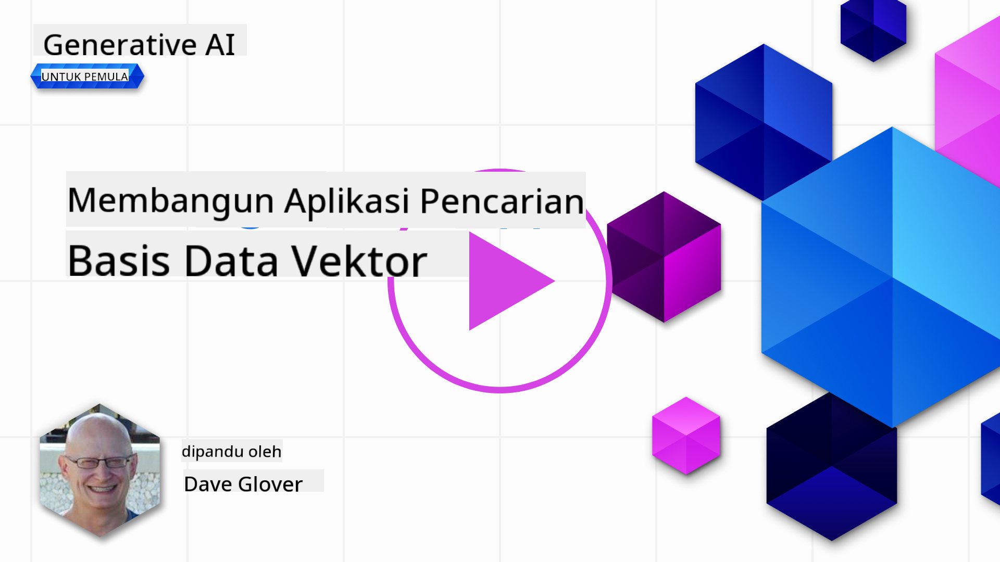
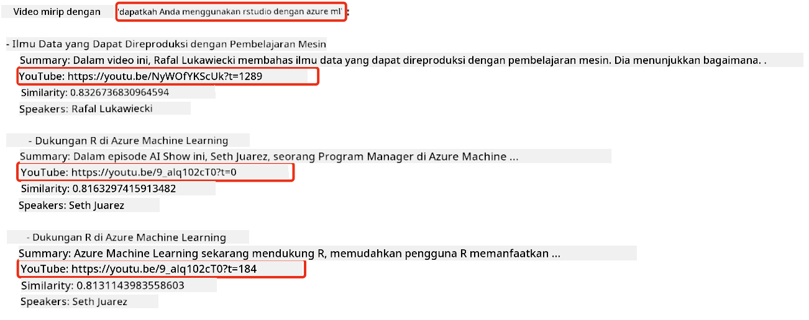
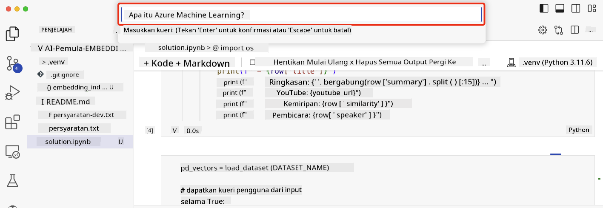

<!--
CO_OP_TRANSLATOR_METADATA:
{
  "original_hash": "58953c08b8ba7073b836d4270ea0fe86",
  "translation_date": "2025-10-17T20:42:55+00:00",
  "source_file": "08-building-search-applications/README.md",
  "language_code": "id"
}
-->
# Membangun Aplikasi Pencarian

[](https://youtu.be/W0-nzXjOjr0?si=GcsqiTTvd7RKbo7V)

> > _Klik gambar di atas untuk menonton video pelajaran ini_

LLM tidak hanya tentang chatbot dan pembuatan teks. Anda juga dapat membangun aplikasi pencarian menggunakan Embeddings. Embeddings adalah representasi numerik dari data yang juga dikenal sebagai vektor, dan dapat digunakan untuk pencarian semantik data.

Dalam pelajaran ini, Anda akan membangun aplikasi pencarian untuk startup pendidikan kami. Startup kami adalah organisasi nirlaba yang menyediakan pendidikan gratis untuk siswa di negara berkembang. Startup kami memiliki banyak video YouTube yang dapat digunakan siswa untuk belajar tentang AI. Startup kami ingin membangun aplikasi pencarian yang memungkinkan siswa mencari video YouTube dengan mengetikkan sebuah pertanyaan.

Sebagai contoh, seorang siswa mungkin mengetik 'Apa itu Jupyter Notebooks?' atau 'Apa itu Azure ML' dan aplikasi pencarian akan mengembalikan daftar video YouTube yang relevan dengan pertanyaan tersebut, dan lebih baik lagi, aplikasi pencarian akan mengembalikan tautan ke bagian video di mana jawaban atas pertanyaan tersebut berada.

## Pengantar

Dalam pelajaran ini, kita akan membahas:

- Pencarian Semantik vs Pencarian Kata Kunci.
- Apa itu Text Embeddings.
- Membuat Indeks Text Embeddings.
- Mencari di Indeks Text Embeddings.

## Tujuan Pembelajaran

Setelah menyelesaikan pelajaran ini, Anda akan dapat:

- Membedakan antara pencarian semantik dan pencarian kata kunci.
- Menjelaskan apa itu Text Embeddings.
- Membuat aplikasi menggunakan Embeddings untuk mencari data.

## Mengapa membangun aplikasi pencarian?

Membuat aplikasi pencarian akan membantu Anda memahami cara menggunakan Embeddings untuk mencari data. Anda juga akan belajar cara membangun aplikasi pencarian yang dapat digunakan siswa untuk menemukan informasi dengan cepat.

Pelajaran ini mencakup Indeks Embedding dari transkrip YouTube untuk saluran YouTube Microsoft [AI Show](https://www.youtube.com/playlist?list=PLlrxD0HtieHi0mwteKBOfEeOYf0LJU4O1). AI Show adalah saluran YouTube yang mengajarkan tentang AI dan pembelajaran mesin. Indeks Embedding berisi Embeddings untuk setiap transkrip YouTube hingga Oktober 2023. Anda akan menggunakan Indeks Embedding untuk membangun aplikasi pencarian untuk startup kami. Aplikasi pencarian mengembalikan tautan ke bagian video di mana jawaban atas pertanyaan berada. Ini adalah cara yang bagus bagi siswa untuk menemukan informasi yang mereka butuhkan dengan cepat.

Berikut adalah contoh kueri semantik untuk pertanyaan 'bisakah Anda menggunakan rstudio dengan azure ml?'. Periksa URL YouTube, Anda akan melihat URL tersebut berisi timestamp yang membawa Anda ke bagian video di mana jawaban atas pertanyaan tersebut berada.



## Apa itu pencarian semantik?

Sekarang Anda mungkin bertanya-tanya, apa itu pencarian semantik? Pencarian semantik adalah teknik pencarian yang menggunakan semantik, atau makna, dari kata-kata dalam kueri untuk mengembalikan hasil yang relevan.

Berikut adalah contoh pencarian semantik. Misalnya Anda ingin membeli mobil, Anda mungkin mencari 'mobil impian saya', pencarian semantik memahami bahwa Anda tidak `bermimpi` tentang mobil, tetapi Anda sedang mencari mobil `ideal` Anda. Pencarian semantik memahami niat Anda dan mengembalikan hasil yang relevan. Alternatifnya adalah `pencarian kata kunci` yang secara harfiah akan mencari mimpi tentang mobil dan sering kali mengembalikan hasil yang tidak relevan.

## Apa itu Text Embeddings?

[Text embeddings](https://en.wikipedia.org/wiki/Word_embedding?WT.mc_id=academic-105485-koreyst) adalah teknik representasi teks yang digunakan dalam [pemrosesan bahasa alami](https://en.wikipedia.org/wiki/Natural_language_processing?WT.mc_id=academic-105485-koreyst). Text embeddings adalah representasi numerik semantik dari teks. Embeddings digunakan untuk mewakili data dengan cara yang mudah dipahami oleh mesin. Ada banyak model untuk membangun text embeddings, dalam pelajaran ini, kita akan fokus pada pembuatan embeddings menggunakan OpenAI Embedding Model.

Berikut contohnya, bayangkan teks berikut ada dalam transkrip dari salah satu episode di saluran YouTube AI Show:

```text
Today we are going to learn about Azure Machine Learning.
```

Kami akan mengirimkan teks tersebut ke OpenAI Embedding API dan API tersebut akan mengembalikan embedding yang terdiri dari 1536 angka alias vektor. Setiap angka dalam vektor mewakili aspek berbeda dari teks tersebut. Untuk ringkasnya, berikut adalah 10 angka pertama dalam vektor tersebut.

```python
[-0.006655829958617687, 0.0026128944009542465, 0.008792596869170666, -0.02446001023054123, -0.008540431968867779, 0.022071078419685364, -0.010703742504119873, 0.003311325330287218, -0.011632772162556648, -0.02187200076878071, ...]
```

## Bagaimana Indeks Embedding dibuat?

Indeks Embedding untuk pelajaran ini dibuat dengan serangkaian skrip Python. Anda akan menemukan skrip tersebut beserta instruksinya di [README](./scripts/README.md?WT.mc_id=academic-105485-koreyst) dalam folder 'scripts' untuk pelajaran ini. Anda tidak perlu menjalankan skrip ini untuk menyelesaikan pelajaran ini karena Indeks Embedding sudah disediakan untuk Anda.

Skrip tersebut melakukan operasi berikut:

1. Transkrip untuk setiap video YouTube dalam playlist [AI Show](https://www.youtube.com/playlist?list=PLlrxD0HtieHi0mwteKBOfEeOYf0LJU4O1) diunduh.
2. Menggunakan [OpenAI Functions](https://learn.microsoft.com/azure/ai-services/openai/how-to/function-calling?WT.mc_id=academic-105485-koreyst), dilakukan upaya untuk mengekstrak nama pembicara dari 3 menit pertama transkrip YouTube. Nama pembicara untuk setiap video disimpan dalam Indeks Embedding bernama `embedding_index_3m.json`.
3. Teks transkrip kemudian dibagi menjadi **segmen teks 3 menit**. Segmen tersebut mencakup sekitar 20 kata yang tumpang tindih dari segmen berikutnya untuk memastikan bahwa Embedding untuk segmen tersebut tidak terpotong dan memberikan konteks pencarian yang lebih baik.
4. Setiap segmen teks kemudian dikirimkan ke OpenAI Chat API untuk diringkas menjadi 60 kata. Ringkasan juga disimpan dalam Indeks Embedding `embedding_index_3m.json`.
5. Akhirnya, teks segmen dikirimkan ke OpenAI Embedding API. Embedding API mengembalikan vektor 1536 angka yang mewakili makna semantik dari segmen tersebut. Segmen tersebut bersama dengan vektor OpenAI Embedding disimpan dalam Indeks Embedding `embedding_index_3m.json`.

### Basis Data Vektor

Untuk kesederhanaan pelajaran, Indeks Embedding disimpan dalam file JSON bernama `embedding_index_3m.json` dan dimuat ke dalam Pandas DataFrame. Namun, dalam produksi, Indeks Embedding akan disimpan dalam basis data vektor seperti [Azure Cognitive Search](https://learn.microsoft.com/training/modules/improve-search-results-vector-search?WT.mc_id=academic-105485-koreyst), [Redis](https://cookbook.openai.com/examples/vector_databases/redis/readme?WT.mc_id=academic-105485-koreyst), [Pinecone](https://cookbook.openai.com/examples/vector_databases/pinecone/readme?WT.mc_id=academic-105485-koreyst), [Weaviate](https://cookbook.openai.com/examples/vector_databases/weaviate/readme?WT.mc_id=academic-105485-koreyst), dan lainnya.

## Memahami kesamaan kosinus

Kita telah mempelajari tentang text embeddings, langkah berikutnya adalah mempelajari cara menggunakan text embeddings untuk mencari data dan khususnya menemukan embeddings yang paling mirip dengan kueri tertentu menggunakan kesamaan kosinus.

### Apa itu kesamaan kosinus?

Kesamaan kosinus adalah ukuran kesamaan antara dua vektor, Anda juga akan mendengar ini disebut sebagai `pencarian tetangga terdekat`. Untuk melakukan pencarian kesamaan kosinus, Anda perlu _memvektorisasi_ teks _kueri_ menggunakan OpenAI Embedding API. Kemudian hitung _kesamaan kosinus_ antara vektor kueri dan setiap vektor dalam Indeks Embedding. Ingat, Indeks Embedding memiliki vektor untuk setiap segmen teks transkrip YouTube. Akhirnya, urutkan hasil berdasarkan kesamaan kosinus dan segmen teks dengan kesamaan kosinus tertinggi adalah yang paling mirip dengan kueri.

Dari perspektif matematika, kesamaan kosinus mengukur kosinus sudut antara dua vektor yang diproyeksikan dalam ruang multidimensi. Pengukuran ini bermanfaat, karena jika dua dokumen berjauhan berdasarkan jarak Euclidean karena ukuran, mereka masih bisa memiliki sudut yang lebih kecil di antara mereka dan oleh karena itu kesamaan kosinus yang lebih tinggi. Untuk informasi lebih lanjut tentang persamaan kesamaan kosinus, lihat [Cosine similarity](https://en.wikipedia.org/wiki/Cosine_similarity?WT.mc_id=academic-105485-koreyst).

## Membangun aplikasi pencarian pertama Anda

Selanjutnya, kita akan belajar cara membangun aplikasi pencarian menggunakan Embeddings. Aplikasi pencarian akan memungkinkan siswa mencari video dengan mengetikkan sebuah pertanyaan. Aplikasi pencarian akan mengembalikan daftar video yang relevan dengan pertanyaan tersebut. Aplikasi pencarian juga akan mengembalikan tautan ke bagian video di mana jawaban atas pertanyaan tersebut berada.

Solusi ini dibangun dan diuji di Windows 11, macOS, dan Ubuntu 22.04 menggunakan Python 3.10 atau lebih baru. Anda dapat mengunduh Python dari [python.org](https://www.python.org/downloads/?WT.mc_id=academic-105485-koreyst).

## Tugas - membangun aplikasi pencarian, untuk membantu siswa

Kami memperkenalkan startup kami di awal pelajaran ini. Sekarang saatnya membantu siswa membangun aplikasi pencarian untuk penilaian mereka.

Dalam tugas ini, Anda akan membuat Layanan Azure OpenAI yang akan digunakan untuk membangun aplikasi pencarian. Anda akan membuat Layanan Azure OpenAI berikut. Anda memerlukan langganan Azure untuk menyelesaikan tugas ini.

### Memulai Azure Cloud Shell

1. Masuk ke [portal Azure](https://portal.azure.com/?WT.mc_id=academic-105485-koreyst).
2. Pilih ikon Cloud Shell di sudut kanan atas portal Azure.
3. Pilih **Bash** untuk jenis lingkungan.

#### Membuat grup sumber daya

> Untuk instruksi ini, kami menggunakan grup sumber daya bernama "semantic-video-search" di East US.
> Anda dapat mengubah nama grup sumber daya, tetapi saat mengubah lokasi untuk sumber daya,
> periksa [tabel ketersediaan model](https://aka.ms/oai/models?WT.mc_id=academic-105485-koreyst).

```shell
az group create --name semantic-video-search --location eastus
```

#### Membuat sumber daya Layanan Azure OpenAI

Dari Azure Cloud Shell, jalankan perintah berikut untuk membuat sumber daya Layanan Azure OpenAI.

```shell
az cognitiveservices account create --name semantic-video-openai --resource-group semantic-video-search \
    --location eastus --kind OpenAI --sku s0
```

#### Dapatkan endpoint dan kunci untuk digunakan dalam aplikasi ini

Dari Azure Cloud Shell, jalankan perintah berikut untuk mendapatkan endpoint dan kunci untuk sumber daya Layanan Azure OpenAI.

```shell
az cognitiveservices account show --name semantic-video-openai \
   --resource-group  semantic-video-search | jq -r .properties.endpoint
az cognitiveservices account keys list --name semantic-video-openai \
   --resource-group semantic-video-search | jq -r .key1
```

#### Menyebarkan model Embedding OpenAI

Dari Azure Cloud Shell, jalankan perintah berikut untuk menyebarkan model Embedding OpenAI.

```shell
az cognitiveservices account deployment create \
    --name semantic-video-openai \
    --resource-group  semantic-video-search \
    --deployment-name text-embedding-ada-002 \
    --model-name text-embedding-ada-002 \
    --model-version "2"  \
    --model-format OpenAI \
    --sku-capacity 100 --sku-name "Standard"
```

## Solusi

Buka [notebook solusi](./python/aoai-solution.ipynb?WT.mc_id=academic-105485-koreyst) di GitHub Codespaces dan ikuti instruksi dalam Jupyter Notebook.

Saat Anda menjalankan notebook, Anda akan diminta untuk memasukkan kueri. Kotak input akan terlihat seperti ini:



## Kerja Hebat! Lanjutkan Pembelajaran Anda

Setelah menyelesaikan pelajaran ini, lihat [koleksi Pembelajaran Generative AI](https://aka.ms/genai-collection?WT.mc_id=academic-105485-koreyst) kami untuk terus meningkatkan pengetahuan Anda tentang Generative AI!

Lanjutkan ke Pelajaran 9 di mana kita akan melihat cara [membangun aplikasi generasi gambar](../09-building-image-applications/README.md?WT.mc_id=academic-105485-koreyst)!

---

**Penafian**:  
Dokumen ini telah diterjemahkan menggunakan layanan penerjemahan AI [Co-op Translator](https://github.com/Azure/co-op-translator). Meskipun kami berupaya untuk memberikan hasil yang akurat, harap diketahui bahwa terjemahan otomatis mungkin mengandung kesalahan atau ketidakakuratan. Dokumen asli dalam bahasa aslinya harus dianggap sebagai sumber yang otoritatif. Untuk informasi yang penting, disarankan menggunakan jasa penerjemahan manusia profesional. Kami tidak bertanggung jawab atas kesalahpahaman atau penafsiran yang keliru yang timbul dari penggunaan terjemahan ini.