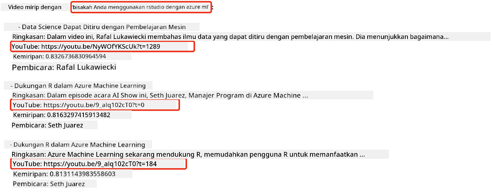
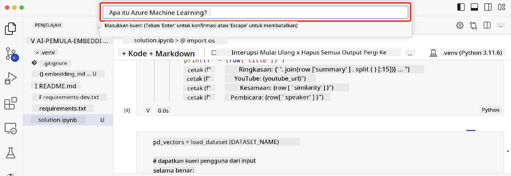

<!--
CO_OP_TRANSLATOR_METADATA:
{
  "original_hash": "d46aad0917a1a342d613e2c13d457da5",
  "translation_date": "2025-05-19T18:37:40+00:00",
  "source_file": "08-building-search-applications/README.md",
  "language_code": "id"
}
-->
# Membangun Aplikasi Pencarian

[](https://aka.ms/gen-ai-lesson8-gh?WT.mc_id=academic-105485-koreyst)

> > _Klik gambar di atas untuk menonton video pelajaran ini_

LLM lebih dari sekadar chatbot dan pembuatan teks. Anda juga bisa membangun aplikasi pencarian menggunakan Embeddings. Embeddings adalah representasi numerik dari data yang juga dikenal sebagai vektor, dan dapat digunakan untuk pencarian semantik data.

Dalam pelajaran ini, Anda akan membangun aplikasi pencarian untuk startup pendidikan kami. Startup kami adalah organisasi nirlaba yang menyediakan pendidikan gratis kepada siswa di negara berkembang. Startup kami memiliki sejumlah besar video YouTube yang dapat digunakan siswa untuk belajar tentang AI. Startup kami ingin membangun aplikasi pencarian yang memungkinkan siswa mencari video YouTube dengan mengetikkan pertanyaan.

Misalnya, seorang siswa mungkin mengetik 'Apa itu Jupyter Notebooks?' atau 'Apa itu Azure ML' dan aplikasi pencarian akan mengembalikan daftar video YouTube yang relevan dengan pertanyaan tersebut, dan lebih baik lagi, aplikasi pencarian akan mengembalikan tautan ke tempat dalam video di mana jawaban atas pertanyaan tersebut berada.

## Pengantar

Dalam pelajaran ini, kita akan membahas:

- Pencarian Semantik vs Pencarian Kata Kunci.
- Apa itu Text Embeddings.
- Membuat Indeks Text Embeddings.
- Mencari Indeks Text Embeddings.

## Tujuan Pembelajaran

Setelah menyelesaikan pelajaran ini, Anda akan dapat:

- Membedakan antara pencarian semantik dan pencarian kata kunci.
- Menjelaskan apa itu Text Embeddings.
- Membuat aplikasi menggunakan Embeddings untuk mencari data.

## Mengapa membangun aplikasi pencarian?

Membangun aplikasi pencarian akan membantu Anda memahami cara menggunakan Embeddings untuk mencari data. Anda juga akan belajar cara membangun aplikasi pencarian yang dapat digunakan oleh siswa untuk menemukan informasi dengan cepat.

Pelajaran ini mencakup Indeks Embedding dari transkrip YouTube untuk saluran YouTube Microsoft [AI Show](https://www.youtube.com/playlist?list=PLlrxD0HtieHi0mwteKBOfEeOYf0LJU4O1). AI Show adalah saluran YouTube yang mengajarkan Anda tentang AI dan pembelajaran mesin. Indeks Embedding berisi Embeddings untuk setiap transkrip YouTube hingga Oktober 2023. Anda akan menggunakan Indeks Embedding untuk membangun aplikasi pencarian untuk startup kami. Aplikasi pencarian mengembalikan tautan ke tempat dalam video di mana jawaban atas pertanyaan tersebut berada. Ini adalah cara yang bagus bagi siswa untuk menemukan informasi yang mereka butuhkan dengan cepat.

Berikut adalah contoh kueri semantik untuk pertanyaan 'bisakah Anda menggunakan rstudio dengan azure ml?'. Periksa url YouTube, Anda akan melihat url tersebut mengandung stempel waktu yang membawa Anda ke tempat dalam video di mana jawaban atas pertanyaan tersebut berada.



## Apa itu pencarian semantik?

Sekarang Anda mungkin bertanya-tanya, apa itu pencarian semantik? Pencarian semantik adalah teknik pencarian yang menggunakan semantik, atau makna, dari kata-kata dalam kueri untuk mengembalikan hasil yang relevan.

Berikut adalah contoh pencarian semantik. Misalnya Anda ingin membeli mobil, Anda mungkin mencari 'mobil impian saya', pencarian semantik memahami bahwa Anda tidak `dreaming` tentang mobil, tetapi Anda sedang mencari mobil `ideal` impian Anda. Pencarian semantik memahami niat Anda dan mengembalikan hasil yang relevan. Alternatifnya adalah `keyword search` yang akan secara harfiah mencari mimpi tentang mobil dan sering kali mengembalikan hasil yang tidak relevan.

## Apa itu Text Embeddings?

[Text embeddings](https://en.wikipedia.org/wiki/Word_embedding?WT.mc_id=academic-105485-koreyst) adalah teknik representasi teks yang digunakan dalam [pemrosesan bahasa alami](https://en.wikipedia.org/wiki/Natural_language_processing?WT.mc_id=academic-105485-koreyst). Text embeddings adalah representasi numerik semantik dari teks. Embeddings digunakan untuk mewakili data dengan cara yang mudah dipahami oleh mesin. Ada banyak model untuk membangun text embeddings, dalam pelajaran ini, kita akan fokus pada pembuatan embeddings menggunakan Model Embedding OpenAI.

Berikut adalah contohnya, bayangkan teks berikut ada dalam transkrip dari salah satu episode di saluran YouTube AI Show:

```text
Today we are going to learn about Azure Machine Learning.
```

Kita akan mengirimkan teks ke OpenAI Embedding API dan itu akan mengembalikan embedding yang terdiri dari 1536 angka yang juga dikenal sebagai vektor. Setiap angka dalam vektor mewakili aspek berbeda dari teks. Untuk singkatnya, berikut adalah 10 angka pertama dalam vektor.

```python
[-0.006655829958617687, 0.0026128944009542465, 0.008792596869170666, -0.02446001023054123, -0.008540431968867779, 0.022071078419685364, -0.010703742504119873, 0.003311325330287218, -0.011632772162556648, -0.02187200076878071, ...]
```

## Bagaimana cara membuat Indeks Embedding?

Indeks Embedding untuk pelajaran ini dibuat dengan serangkaian skrip Python. Anda akan menemukan skrip tersebut beserta petunjuknya di [README](./scripts/README.md?WT.mc_id=academic-105485-koreyst) dalam folder 'scripts' untuk pelajaran ini. Anda tidak perlu menjalankan skrip ini untuk menyelesaikan pelajaran ini karena Indeks Embedding telah disediakan untuk Anda.

Skrip tersebut melakukan operasi berikut:

1. Transkrip untuk setiap video YouTube dalam playlist [AI Show](https://www.youtube.com/playlist?list=PLlrxD0HtieHi0mwteKBOfEeOYf0LJU4O1) diunduh.
2. Menggunakan [Fungsi OpenAI](https://learn.microsoft.com/azure/ai-services/openai/how-to/function-calling?WT.mc_id=academic-105485-koreyst), dilakukan upaya untuk mengekstrak nama pembicara dari 3 menit pertama transkrip YouTube. Nama pembicara untuk setiap video disimpan dalam Indeks Embedding yang diberi nama `embedding_index_3m.json`.
3. Teks transkrip kemudian dibagi menjadi **segmen teks 3 menit**. Segmen tersebut mencakup sekitar 20 kata yang tumpang tindih dari segmen berikutnya untuk memastikan bahwa Embedding untuk segmen tersebut tidak terputus dan untuk memberikan konteks pencarian yang lebih baik.
4. Setiap segmen teks kemudian dikirimkan ke OpenAI Chat API untuk merangkum teks menjadi 60 kata. Ringkasan juga disimpan dalam Indeks Embedding `embedding_index_3m.json`.
5. Akhirnya, teks segmen dikirimkan ke OpenAI Embedding API. Embedding API mengembalikan vektor 1536 angka yang mewakili makna semantik dari segmen tersebut. Segmen tersebut bersama dengan vektor Embedding OpenAI disimpan dalam Indeks Embedding `embedding_index_3m.json`.

### Basis Data Vektor

Untuk kesederhanaan pelajaran, Indeks Embedding disimpan dalam file JSON bernama `embedding_index_3m.json` dan dimuat ke dalam Pandas DataFrame. Namun, dalam produksi, Indeks Embedding akan disimpan dalam basis data vektor seperti [Azure Cognitive Search](https://learn.microsoft.com/training/modules/improve-search-results-vector-search?WT.mc_id=academic-105485-koreyst), [Redis](https://cookbook.openai.com/examples/vector_databases/redis/readme?WT.mc_id=academic-105485-koreyst), [Pinecone](https://cookbook.openai.com/examples/vector_databases/pinecone/readme?WT.mc_id=academic-105485-koreyst), [Weaviate](https://cookbook.openai.com/examples/vector_databases/weaviate/readme?WT.mc_id=academic-105485-koreyst), untuk menyebutkan beberapa saja.

## Memahami kemiripan kosinus

Kita telah mempelajari tentang text embeddings, langkah berikutnya adalah mempelajari cara menggunakan text embeddings untuk mencari data dan khususnya menemukan embeddings yang paling mirip dengan kueri tertentu menggunakan kemiripan kosinus.

### Apa itu kemiripan kosinus?

Kemiripan kosinus adalah ukuran kemiripan antara dua vektor, Anda juga akan mendengar ini disebut sebagai `nearest neighbor search`. Untuk melakukan pencarian kemiripan kosinus, Anda perlu _memvektorisasi_ teks _kueri_ menggunakan OpenAI Embedding API. Kemudian hitung _kemiripan kosinus_ antara vektor kueri dan setiap vektor dalam Indeks Embedding. Ingat, Indeks Embedding memiliki vektor untuk setiap segmen teks transkrip YouTube. Akhirnya, urutkan hasil berdasarkan kemiripan kosinus dan segmen teks dengan kemiripan kosinus tertinggi adalah yang paling mirip dengan kueri.

Dari perspektif matematika, kemiripan kosinus mengukur kosinus sudut antara dua vektor yang diproyeksikan dalam ruang multidimensi. Pengukuran ini bermanfaat, karena jika dua dokumen berjauhan menurut jarak Euclidean karena ukurannya, mereka masih bisa memiliki sudut yang lebih kecil di antara mereka dan oleh karena itu kemiripan kosinus yang lebih tinggi. Untuk informasi lebih lanjut tentang persamaan kemiripan kosinus, lihat [Kemiripan kosinus](https://en.wikipedia.org/wiki/Cosine_similarity?WT.mc_id=academic-105485-koreyst).

## Membangun aplikasi pencarian pertama Anda

Selanjutnya, kita akan belajar cara membangun aplikasi pencarian menggunakan Embeddings. Aplikasi pencarian ini akan memungkinkan siswa untuk mencari video dengan mengetikkan pertanyaan. Aplikasi pencarian akan mengembalikan daftar video yang relevan dengan pertanyaan tersebut. Aplikasi pencarian juga akan mengembalikan tautan ke tempat dalam video di mana jawaban atas pertanyaan tersebut berada.

Solusi ini dibangun dan diuji pada Windows 11, macOS, dan Ubuntu 22.04 menggunakan Python 3.10 atau yang lebih baru. Anda dapat mengunduh Python dari [python.org](https://www.python.org/downloads/?WT.mc_id=academic-105485-koreyst).

## Tugas - membangun aplikasi pencarian, untuk memberdayakan siswa

Kami memperkenalkan startup kami di awal pelajaran ini. Sekarang saatnya untuk memberdayakan siswa membangun aplikasi pencarian untuk penilaian mereka.

Dalam tugas ini, Anda akan membuat Layanan Azure OpenAI yang akan digunakan untuk membangun aplikasi pencarian. Anda akan membuat Layanan Azure OpenAI berikut. Anda akan memerlukan langganan Azure untuk menyelesaikan tugas ini.

### Mulai Azure Cloud Shell

1. Masuk ke [portal Azure](https://portal.azure.com/?WT.mc_id=academic-105485-koreyst).
2. Pilih ikon Cloud Shell di pojok kanan atas portal Azure.
3. Pilih **Bash** untuk jenis lingkungan.

#### Membuat grup sumber daya

> Untuk instruksi ini, kami menggunakan grup sumber daya bernama "semantic-video-search" di East US.
> Anda dapat mengubah nama grup sumber daya, tetapi saat mengubah lokasi untuk sumber daya,
> periksa [tabel ketersediaan model](https://aka.ms/oai/models?WT.mc_id=academic-105485-koreyst).

```shell
az group create --name semantic-video-search --location eastus
```

#### Membuat sumber daya Layanan Azure OpenAI

Dari Azure Cloud Shell, jalankan perintah berikut untuk membuat sumber daya Layanan Azure OpenAI.

```shell
az cognitiveservices account create --name semantic-video-openai --resource-group semantic-video-search \
    --location eastus --kind OpenAI --sku s0
```

#### Dapatkan endpoint dan kunci untuk penggunaan dalam aplikasi ini

Dari Azure Cloud Shell, jalankan perintah berikut untuk mendapatkan endpoint dan kunci untuk sumber daya Layanan Azure OpenAI.

```shell
az cognitiveservices account show --name semantic-video-openai \
   --resource-group  semantic-video-search | jq -r .properties.endpoint
az cognitiveservices account keys list --name semantic-video-openai \
   --resource-group semantic-video-search | jq -r .key1
```

#### Menerapkan model Embedding OpenAI

Dari Azure Cloud Shell, jalankan perintah berikut untuk menerapkan model Embedding OpenAI.

```shell
az cognitiveservices account deployment create \
    --name semantic-video-openai \
    --resource-group  semantic-video-search \
    --deployment-name text-embedding-ada-002 \
    --model-name text-embedding-ada-002 \
    --model-version "2"  \
    --model-format OpenAI \
    --sku-capacity 100 --sku-name "Standard"
```

## Solusi

Buka [notebook solusi](../../../08-building-search-applications/python/aoai-solution.ipynb) di GitHub Codespaces dan ikuti petunjuk di Jupyter Notebook.

Ketika Anda menjalankan notebook, Anda akan diminta untuk memasukkan kueri. Kotak input akan terlihat seperti ini:



## Kerja Bagus! Lanjutkan Pembelajaran Anda

Setelah menyelesaikan pelajaran ini, lihat [koleksi Pembelajaran AI Generatif](https://aka.ms/genai-collection?WT.mc_id=academic-105485-koreyst) kami untuk terus meningkatkan pengetahuan AI Generatif Anda!

Lanjutkan ke Pelajaran 9 di mana kita akan melihat cara [membangun aplikasi pembuatan gambar](../09-building-image-applications/README.md?WT.mc_id=academic-105485-koreyst)!

**Penafian**:  
Dokumen ini telah diterjemahkan menggunakan layanan terjemahan AI [Co-op Translator](https://github.com/Azure/co-op-translator). Meskipun kami berupaya untuk mencapai akurasi, harap diketahui bahwa terjemahan otomatis mungkin mengandung kesalahan atau ketidakakuratan. Dokumen asli dalam bahasa aslinya harus dianggap sebagai sumber yang berwenang. Untuk informasi penting, disarankan untuk menggunakan jasa terjemahan manusia profesional. Kami tidak bertanggung jawab atas kesalahpahaman atau salah tafsir yang timbul dari penggunaan terjemahan ini.